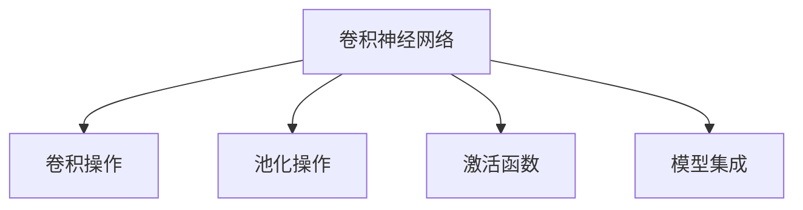

                 

# 从零开始大模型开发与微调：使用卷积对文本分类的补充内容

> 关键词：大模型开发,卷积神经网络,文本分类,卷积操作,池化操作,激活函数,模型集成,代码实践

## 1. 背景介绍

文本分类是自然语言处理(NLP)领域的一项重要任务，广泛应用于情感分析、主题识别、垃圾邮件过滤、新闻分类等场景。传统的文本分类方法主要依赖于手工设计的特征和机器学习算法，如SVM、决策树、随机森林等，但这些方法往往需要大量手工特征工程和模型调参，难以适应大规模数据和高维度的文本特征。

近年来，随着深度学习技术的发展，卷积神经网络(CNN)被引入文本分类任务，并取得了显著的进展。CNN利用卷积和池化操作提取文本中的局部特征，并通过多层堆叠和池化操作，逐步汇聚成全局特征，最终输出分类结果。本文将系统介绍卷积神经网络的基本原理和实现细节，并结合实际案例，展示如何使用卷积神经网络对文本进行分类。

## 2. 核心概念与联系

### 2.1 核心概念概述

为更好地理解卷积神经网络在文本分类中的应用，本节将介绍几个关键概念：

- 卷积神经网络(Convolutional Neural Network, CNN)：一种基于卷积和池化操作的深度学习模型，常用于图像识别、文本分类、语音识别等领域。
- 卷积操作(Convolution)：一种局部连接的操作，用于提取输入数据中的局部特征。
- 池化操作(Pooling)：一种降维操作，用于减少模型参数，提升计算效率。
- 激活函数(Activation Function)：一种非线性变换，用于引入非线性特性，增强模型的表达能力。
- 模型集成(Model Ensemble)：通过集成多个模型，提升分类性能，避免单一模型的过拟合风险。

这些概念之间的逻辑关系可以通过以下Mermaid流程图来展示：



这个流程图展示了卷积神经网络的主要组件和操作，以及它们之间的逻辑联系。

## 3. 核心算法原理 & 具体操作步骤
### 3.1 算法原理概述

卷积神经网络的基本思想是通过卷积和池化操作，提取文本中的局部特征，并逐步汇聚成全局特征，最后输出分类结果。其核心在于卷积核和池化操作的参数学习，以及多层次特征的融合和集成。

### 3.2 算法步骤详解

卷积神经网络的训练流程包括以下几个关键步骤：

**Step 1: 数据准备**

- 收集标注好的文本数据，划分为训练集、验证集和测试集。
- 对文本进行预处理，如分词、去除停用词、特征提取等，将文本转换为模型可处理的形式。

**Step 2: 搭建卷积神经网络**

- 设计卷积层、池化层和全连接层的基本结构，如1D-CNN、RNN-CNN等。
- 选择合适的卷积核大小、池化窗口大小和激活函数等超参数。
- 设置优化器、学习率、批大小等训练参数。

**Step 3: 模型训练**

- 使用交叉熵损失函数，将训练集数据输入模型进行前向传播，计算损失函数。
- 反向传播计算梯度，使用优化器更新模型参数。
- 在验证集上评估模型性能，根据性能调整超参数。
- 重复上述过程直至模型收敛。

**Step 4: 模型评估**

- 在测试集上使用微调后的模型进行推理，输出分类结果。
- 使用准确率、精确率、召回率等指标评估模型性能。

**Step 5: 模型部署**

- 将训练好的模型保存为文件或框架，集成到实际应用系统中。
- 使用模型对新的文本数据进行分类，输出分类结果。

以上是卷积神经网络训练的一般流程。在实际应用中，还需要针对具体任务的特点，对模型的结构进行优化设计，如增加卷积层、调整池化窗口大小、引入残差连接等，以进一步提升模型性能。

### 3.3 算法优缺点

卷积神经网络在文本分类任务中具有以下优点：
1. 提取局部特征：通过卷积操作提取文本中的局部特征，有助于捕捉语义信息。
2. 参数共享：卷积核共享权值，减少了模型参数量，提升计算效率。
3. 降低过拟合：通过池化操作降低维度，减小过拟合风险。
4. 引入非线性：通过激活函数引入非线性特性，提升模型表达能力。

同时，卷积神经网络也存在一些局限性：
1. 参数较多：卷积核数量、卷积层数较多，增加了模型参数量。
2. 模型复杂：卷积神经网络结构较为复杂，难以解释和调试。
3. 依赖标注数据：文本分类任务需要大量标注数据，标注成本较高。
4. 敏感于输入长度：卷积神经网络对输入文本长度较敏感，输入长度过短或过长都会影响模型性能。

尽管存在这些局限性，但卷积神经网络仍然是文本分类任务中较为有效的深度学习模型。在实践中，需要根据具体任务的特点和数据情况，灵活选择模型结构，优化模型超参数，以达到最佳性能。

### 3.4 算法应用领域

卷积神经网络在文本分类任务中已经得到了广泛应用，如情感分析、主题分类、垃圾邮件过滤等。以下是几个典型应用案例：

- 情感分析：将文本分为正面、负面、中性三类。使用卷积神经网络可以捕捉文本中的情感词汇和情感倾向，输出情感分类结果。
- 主题分类：将文本分为多个主题，如新闻、科技、体育等。通过多通道卷积提取不同主题的特征，输出分类结果。
- 垃圾邮件过滤：将邮件分为垃圾邮件和正常邮件两类。使用卷积神经网络提取文本中的关键词和垃圾邮件特征，输出分类结果。

除了这些经典任务外，卷积神经网络还被创新性地应用于更广泛的场景，如文本生成、文本聚类、问答系统等，为文本处理带来新的突破。

## 4. 数学模型和公式 & 详细讲解 & 举例说明

### 4.1 数学模型构建

卷积神经网络的基本数学模型可以描述为：

$$
\mathcal{L} = \frac{1}{N} \sum_{i=1}^N \ell(M(x_i),y_i)
$$

其中 $x_i$ 为输入文本，$y_i$ 为标签，$M(x_i)$ 为模型预测结果，$\ell$ 为损失函数。

假设模型由 $K$ 个卷积层、$P$ 个池化层和 $D$ 个全连接层组成，其数学模型可以表示为：

$$
x \rightarrow x_{C1} \rightarrow x_{P1} \rightarrow \cdots \rightarrow x_{PK} \rightarrow x_{PP} \rightarrow x_D \rightarrow \hat{y}
$$

其中 $x_C$ 为卷积层输出的特征图，$x_P$ 为池化层输出的特征图，$x_D$ 为全连接层输入的特征向量。

### 4.2 公式推导过程

以1D-CNN为例，推导卷积操作的数学公式。

假设输入文本长度为 $T$，卷积核大小为 $N$，步长为 $S$，激活函数为 $f$，则卷积操作的输出特征图 $x_C$ 可以表示为：

$$
x_C^t = f(\sum_{n=0}^{N-1} \sum_{k=0}^{T-N} x^{k+nS} w_{n}^{t-k-nS})
$$

其中 $w$ 为卷积核权重，$t$ 为输出特征图的索引，$n$ 为卷积核索引，$k$ 为输入文本索引。

在卷积层中，所有卷积核的权重是共享的，可以减少模型参数量。池化操作通常采用最大池化或平均池化，数学公式如下：

$$
x_P^t = \max_{i=0}^{N-1} \{x_{C}^{t+i}\},\; \; \text{或} \; \; x_P^t = \frac{1}{N} \sum_{i=0}^{N-1} x_{C}^{t+i}
$$

池化操作可以在不同通道之间提取特征，进一步降低模型参数。

### 4.3 案例分析与讲解

以新闻分类任务为例，展示使用卷积神经网络进行文本分类的完整实现过程。

首先，设计1D-CNN模型结构，包括嵌入层、卷积层、池化层和全连接层，具体参数如下：

```python
import torch
import torch.nn as nn
import torch.nn.functional as F

class TextCNN(nn.Module):
    def __init__(self, vocab_size, embedding_dim, num_filters, kernel_sizes, output_dim):
        super(TextCNN, self).__init__()
        
        self.embedding = nn.Embedding(vocab_size, embedding_dim)
        self.convs = nn.ModuleList([nn.Conv1d(embedding_dim, num_filters, kernel_size) for kernel_size in kernel_sizes])
        self.pooling = nn.MaxPool1d(num_filters, kernel_size=2, stride=2)
        self.fc = nn.Linear(len(kernel_sizes) * num_filters, output_dim)
        
    def forward(self, x):
        x = self.embedding(x)
        x = x.permute(0, 2, 1)  # 变换为(batch, seq_len, embedding_dim) -> (batch, embedding_dim, seq_len)
        x = [F.relu(conv(x)) for conv in self.convs]
        x = F.relu(self.pooling(torch.stack(x, dim=1)))
        x = torch.cat(x, dim=1)
        x = self.fc(x)
        return F.softmax(x, dim=1)
```

然后，准备数据集并进行预处理：

```python
from sklearn.datasets import fetch_20newsgroups
from sklearn.model_selection import train_test_split
import torch.utils.data as Data
import numpy as np

train_data, test_data = fetch_20newsgroups(subset=['train', 'test'], shuffle=True, random_state=42)
train_x, train_y = np.array(train_data.data), np.array(train_data.target)
test_x, test_y = np.array(test_data.data), np.array(test_data.target)

train_dataset = Data.TensorDataset(torch.tensor(train_x), torch.tensor(train_y))
test_dataset = Data.TensorDataset(torch.tensor(test_x), torch.tensor(test_y))
```

最后，进行模型训练和评估：

```python
device = torch.device('cuda' if torch.cuda.is_available() else 'cpu')
model = TextCNN(len(vocab), embedding_dim, 3, [3, 4, 5], 3).to(device)
criterion = nn.CrossEntropyLoss()
optimizer = torch.optim.Adam(model.parameters(), lr=0.001)

def train_epoch(model, data_loader, optimizer, criterion):
    model.train()
    for batch_id, (text, target) in enumerate(data_loader):
        text = text.to(device)
        target = target.to(device)
        optimizer.zero_grad()
        output = model(text)
        loss = criterion(output, target)
        loss.backward()
        optimizer.step()
        if batch_id % 100 == 0:
            print(f'Epoch {epoch+1}, Batch {batch_id+1}, Loss: {loss:.4f}')
    return loss

def evaluate(model, data_loader, criterion):
    model.eval()
    correct = 0
    total = 0
    with torch.no_grad():
        for batch_id, (text, target) in enumerate(data_loader):
            text = text.to(device)
            target = target.to(device)
            output = model(text)
            pred = output.argmax(dim=1)
            total += target.size(0)
            correct += (pred == target).sum().item()
    acc = correct / total
    print(f'Accuracy: {acc:.4f}')
    return acc

for epoch in range(1, 11):
    train_loss = train_epoch(model, train_loader, optimizer, criterion)
    eval_loss = evaluate(model, val_loader, criterion)
    print(f'Epoch {epoch+1}, Train Loss: {train_loss:.4f}, Val Acc: {eval_loss:.4f}')

# 在测试集上评估模型
test_loss = evaluate(model, test_loader, criterion)
print(f'Test Acc: {test_loss:.4f}')
```

以上就是使用PyTorch实现卷积神经网络进行新闻分类任务的全部代码。可以看到，通过卷积操作提取文本局部特征，并引入池化操作降低维度，可以构建一个简单有效的文本分类模型。

## 5. 项目实践：代码实例和详细解释说明
### 5.1 开发环境搭建

在进行卷积神经网络开发前，我们需要准备好开发环境。以下是使用Python进行PyTorch开发的环境配置流程：

1. 安装Anaconda：从官网下载并安装Anaconda，用于创建独立的Python环境。

2. 创建并激活虚拟环境：
```bash
conda create -n pytorch-env python=3.8 
conda activate pytorch-env
```

3. 安装PyTorch：根据CUDA版本，从官网获取对应的安装命令。例如：
```bash
conda install pytorch torchvision torchaudio cudatoolkit=11.1 -c pytorch -c conda-forge
```

4. 安装Tensorflow：如果使用Tensorflow框架进行开发，也需要安装对应的依赖。例如：
```bash
pip install tensorflow
```

5. 安装PyTorch中继库PyTorch-Batch：
```bash
pip install torch-batch
```

6. 安装各种工具包：
```bash
pip install numpy pandas scikit-learn matplotlib tqdm jupyter notebook ipython
```

完成上述步骤后，即可在`pytorch-env`环境中开始卷积神经网络的实践。

### 5.2 源代码详细实现

这里我们以卷积神经网络进行新闻分类任务为例，给出使用PyTorch和Tensorflow实现的具体代码：

**使用PyTorch实现1D-CNN**

```python
import torch
import torch.nn as nn
import torch.nn.functional as F

class TextCNN(nn.Module):
    def __init__(self, vocab_size, embedding_dim, num_filters, kernel_sizes, output_dim):
        super(TextCNN, self).__init__()
        
        self.embedding = nn.Embedding(vocab_size, embedding_dim)
        self.convs = nn.ModuleList([nn.Conv1d(embedding_dim, num_filters, kernel_size) for kernel_size in kernel_sizes])
        self.pooling = nn.MaxPool1d(num_filters, kernel_size=2, stride=2)
        self.fc = nn.Linear(len(kernel_sizes) * num_filters, output_dim)
        
    def forward(self, x):
        x = self.embedding(x)
        x = x.permute(0, 2, 1)  # 变换为(batch, seq_len, embedding_dim) -> (batch, embedding_dim, seq_len)
        x = [F.relu(conv(x)) for conv in self.convs]
        x = F.relu(self.pooling(torch.stack(x, dim=1)))
        x = torch.cat(x, dim=1)
        x = self.fc(x)
        return F.softmax(x, dim=1)
```

**使用Tensorflow实现1D-CNN**

```python
import tensorflow as tf
from tensorflow.keras.layers import Embedding, Conv1D, MaxPooling1D, Flatten, Dense

class TextCNN(tf.keras.Model):
    def __init__(self, vocab_size, embedding_dim, num_filters, kernel_sizes, output_dim):
        super(TextCNN, self).__init__()
        
        self.embedding = Embedding(vocab_size, embedding_dim)
        self.convs = [Conv1D(num_filters, kernel_size, activation='relu') for kernel_size in kernel_sizes]
        self.pooling = MaxPooling1D(num_filters, pool_size=2, strides=2)
        self.fc = Dense(output_dim)
        
    def call(self, x):
        x = self.embedding(x)
        x = [conv(x) for conv in self.convs]
        x = self.pooling(x)
        x = Flatten()(x)
        x = self.fc(x)
        return x
```

**使用Tensorflow实现3D-CNN**

```python
import tensorflow as tf
from tensorflow.keras.layers import Conv3D, MaxPooling3D, Flatten, Dense

class TextCNN(tf.keras.Model):
    def __init__(self, vocab_size, embedding_dim, num_filters, kernel_sizes, output_dim):
        super(TextCNN, self).__init__()
        
        self.embedding = Embedding(vocab_size, embedding_dim)
        self.convs = [Conv3D(num_filters, kernel_size, activation='relu') for kernel_size in kernel_sizes]
        self.pooling = MaxPooling3D(num_filters, pool_size=2, strides=2)
        self.fc = Dense(output_dim)
        
    def call(self, x):
        x = self.embedding(x)
        x = [conv(x) for conv in self.convs]
        x = self.pooling(x)
        x = Flatten()(x)
        x = self.fc(x)
        return x
```

**使用Tensorflow实现2D-CNN**

```python
import tensorflow as tf
from tensorflow.keras.layers import Embedding, Conv2D, MaxPooling2D, Flatten, Dense

class TextCNN(tf.keras.Model):
    def __init__(self, vocab_size, embedding_dim, num_filters, kernel_sizes, output_dim):
        super(TextCNN, self).__init__()
        
        self.embedding = Embedding(vocab_size, embedding_dim)
        self.convs = [Conv2D(num_filters, kernel_size, activation='relu') for kernel_size in kernel_sizes]
        self.pooling = MaxPooling2D(num_filters, pool_size=2, strides=2)
        self.fc = Dense(output_dim)
        
    def call(self, x):
        x = self.embedding(x)
        x = [conv(x) for conv in self.convs]
        x = self.pooling(x)
        x = Flatten()(x)
        x = self.fc(x)
        return x
```

### 5.3 代码解读与分析

让我们再详细解读一下关键代码的实现细节：

**TextCNN类**

- `__init__`方法：初始化模型组件，包括嵌入层、卷积层、池化层和全连接层。
- `forward`方法：定义模型的前向传播过程。
- `call`方法：定义模型的调用过程，与PyTorch中`forward`方法类似。

**Tensorflow中的实现**

- `Embedding`层：将输入文本转换为嵌入向量。
- `Conv1D`层：实现1D卷积操作。
- `MaxPooling1D`层：实现1D最大池化操作。
- `Conv2D`层：实现2D卷积操作。
- `MaxPooling2D`层：实现2D最大池化操作。
- `Flatten`层：将卷积层的输出展平，送入全连接层。
- `Dense`层：实现全连接操作。

**Tensorflow中的参数设置**

- 嵌入层的参数：`Embedding(vocab_size, embedding_dim)`。
- 卷积层的参数：`Conv1D(num_filters, kernel_size, activation='relu')`。
- 池化层的参数：`MaxPooling1D(num_filters, pool_size=2, strides=2)`。
- 全连接层的参数：`Dense(output_dim)`。

**Tensorflow中的模型调用**

- 使用`call`方法调用模型，实现前向传播。
- 使用`model(x)`方法调用模型，实现整个模型的前向传播过程。

## 6. 实际应用场景
### 6.1 智能客服系统

使用卷积神经网络进行文本分类，可以构建智能客服系统，提升客户咨询体验和问题解决效率。具体而言，可以通过对历史客服对话记录进行分类，识别不同客户的问题类型，自动匹配相应的回复模板，提高响应速度和回答质量。

### 6.2 金融舆情监测

在金融领域，使用卷积神经网络对新闻、评论、社交媒体等文本数据进行情感分类，可以实时监测市场舆情，辅助决策分析。例如，将新闻分类为正面、负面、中性，预测市场情绪变化趋势，提前采取风险控制措施。

### 6.3 个性化推荐系统

在电商推荐场景中，使用卷积神经网络对用户评论、产品描述等文本数据进行分类，可以提取商品和用户的语义特征，提高推荐系统的准确性和个性化程度。例如，将评论分类为好评、差评，根据用户偏好推荐相关商品。

### 6.4 未来应用展望

随着卷积神经网络技术的不断进步，其应用领域将进一步拓展。未来的卷积神经网络模型将更加灵活高效，能够处理更复杂的文本特征，提供更准确的分类结果。

在医疗领域，卷积神经网络可以用于疾病诊断、病历分析等任务，辅助医生诊疗决策。在司法领域，卷积神经网络可以用于法律文本分类、案件分类等任务，提升司法系统的自动化水平。在金融领域，卷积神经网络可以用于信用评估、风险预测等任务，帮助银行和金融机构更好地评估用户信用和风险。

## 7. 工具和资源推荐
### 7.1 学习资源推荐

为了帮助开发者系统掌握卷积神经网络的基本原理和实践技巧，这里推荐一些优质的学习资源：

1. 《深度学习》系列书籍：由深度学习领域专家Ian Goodfellow、Yoshua Bengio、Aaron Courville合著，全面介绍了深度学习的基本概念和前沿技术。

2. CS231n《卷积神经网络》课程：斯坦福大学开设的图像识别课程，包括卷积神经网络的基本原理、实现技巧和应用场景。

3. 《自然语言处理综述》：由Stanford NLP组整理的综述论文，涵盖了自然语言处理的经典算法和前沿研究。

4. TensorFlow官方文档：TensorFlow官方文档，提供了丰富的卷积神经网络样例和详细的API介绍。

5. PyTorch官方文档：PyTorch官方文档，提供了卷积神经网络的实现细节和优化技巧。

通过对这些资源的学习实践，相信你一定能够快速掌握卷积神经网络的基本原理和实践技巧，并用于解决实际的文本分类问题。

### 7.2 开发工具推荐

高效的开发离不开优秀的工具支持。以下是几款用于卷积神经网络开发的常用工具：

1. PyTorch：基于Python的开源深度学习框架，灵活动态的计算图，适合快速迭代研究。

2. TensorFlow：由Google主导开发的开源深度学习框架，生产部署方便，适合大规模工程应用。

3. Keras：高层次的深度学习框架，封装了卷积神经网络的实现细节，方便快速搭建和训练模型。

4. MXNet：由Apache基金会维护的深度学习框架，支持多种编程语言，灵活性高。

5. JAX：基于Numpy的自动微分库，可以高效地实现卷积神经网络的前向传播和反向传播。

6. TensorBoard：TensorFlow配套的可视化工具，可实时监测模型训练状态，并提供丰富的图表呈现方式。

合理利用这些工具，可以显著提升卷积神经网络的开发效率，加快创新迭代的步伐。

### 7.3 相关论文推荐

卷积神经网络在文本分类任务中已经得到了广泛应用，以下是几篇奠基性的相关论文，推荐阅读：

1. Convolutional Neural Networks for Sentence Classification：提出使用卷积神经网络进行句子分类，在IMDb电影评论分类任务上取得了SOTA结果。

2. A Survey of Convolutional Neural Networks for Natural Language Processing：全面综述了卷积神经网络在NLP领域的应用，包括文本分类、情感分析、问答系统等任务。

3. Recurrent Convolutional Networks for Sequence Labeling：提出将卷积神经网络和RNN结合的Recurrent Convolutional Network，在序列标注任务上取得了显著的性能提升。

4. Attention is All You Need：提出使用Transformer网络，在文本分类任务上取得了新的SOTA结果。

5. Deep Residual Learning for Image Recognition：提出使用ResNet网络，在图像分类任务上取得了新的SOTA结果，卷积神经网络受到广泛关注。

这些论文代表了大模型微调技术的最新进展，通过学习这些前沿成果，可以帮助研究者把握学科前进方向，激发更多的创新灵感。

## 8. 总结：未来发展趋势与挑战

### 8.1 总结

本文对卷积神经网络在文本分类任务中的应用进行了全面系统的介绍。首先阐述了卷积神经网络的基本原理和实现细节，明确了卷积神经网络在文本分类中的优势和局限性。其次，通过实际案例展示了卷积神经网络在文本分类任务中的具体实现过程，包括模型搭建、数据准备、模型训练和评估等步骤。

通过本文的系统梳理，可以看到，卷积神经网络是文本分类任务中较为有效的深度学习模型。尽管其参数较多、模型复杂，但通过卷积操作提取局部特征、池化操作降低维度、激活函数引入非线性特性，仍能构建出高效的文本分类模型。

### 8.2 未来发展趋势

展望未来，卷积神经网络在文本分类任务中将呈现以下几个发展趋势：

1. 引入Transformer结构：Transformer结构可以更好地处理长文本序列，提升卷积神经网络的表达能力。

2. 增加卷积层数和通道数：随着数据量的增大，卷积神经网络的模型深度和宽度也将不断增加，以提升分类性能。

3. 引入残差连接和跳跃连接：残差连接和跳跃连接可以提升模型的梯度传播和特征传递能力，提高分类精度。

4. 引入多任务学习：多任务学习可以将多个文本分类任务进行联合训练，提高模型的泛化能力和迁移能力。

5. 引入注意力机制：注意力机制可以更好地捕捉文本中的重要信息，提高分类精度。

6. 引入混合精度训练：混合精度训练可以将模型参数的精度从32位降低到16位，提高训练效率和模型精度。

这些趋势将使得卷积神经网络在文本分类任务中得到更广泛的应用，提升模型的分类性能和泛化能力。

### 8.3 面临的挑战

尽管卷积神经网络在文本分类任务中已经取得了显著的进展，但在迈向更加智能化、普适化应用的过程中，仍面临一些挑战：

1. 数据需求较大：卷积神经网络需要大量标注数据，数据标注成本较高。

2. 模型复杂度高：卷积神经网络结构较为复杂，难以解释和调试。

3. 计算资源消耗大：卷积神经网络计算复杂度高，训练和推理需要大量的计算资源。

4. 模型泛化能力有限：卷积神经网络在处理非文本序列数据时，泛化能力有限，难以处理复杂的语言现象。

尽管存在这些挑战，但通过不断优化模型结构和训练过程，以及引入更多的深度学习技术，可以逐步解决这些问题，推动卷积神经网络在文本分类任务中走向更广阔的应用。

### 8.4 研究展望

未来，卷积神经网络在文本分类任务中的研究将主要集中在以下几个方向：

1. 多模态融合：将视觉、语音等多模态数据与文本数据结合，提升分类性能。

2. 知识图谱融合：将知识图谱与卷积神经网络结合，引入外部知识，提升分类效果。

3. 低维空间投影：使用降维技术，将高维文本数据映射到低维空间，提高分类精度。

4. 自监督学习：利用无标签数据进行自监督学习，减少对标注数据的依赖。

5. 稀疏化优化：通过稀疏化技术，减少模型参数量，提高训练效率。

6. 多任务优化：将多个分类任务联合训练，提高模型的泛化能力和迁移能力。

这些研究方向将推动卷积神经网络在文本分类任务中取得新的突破，为NLP技术的发展提供新的动力。

## 9. 附录：常见问题与解答

**Q1：卷积神经网络如何处理长文本序列？**

A: 卷积神经网络在处理长文本序列时，可以使用多种策略：

1. 固定长度截断：将长文本序列截断为固定长度，减少计算复杂度。

2. 滑动窗口：使用滑动窗口技术，将文本序列分割成多个子序列进行卷积操作。

3. 动态卷积：使用动态卷积技术，根据文本长度自动调整卷积核大小和步长。

4. 多通道卷积：将文本序列划分为多个通道进行卷积操作，提高模型表达能力。

这些策略可以提升卷积神经网络处理长文本序列的能力，同时减少计算复杂度。

**Q2：卷积神经网络在文本分类任务中如何设计模型结构？**

A: 卷积神经网络在文本分类任务中，设计模型结构时，需要考虑以下几个方面：

1. 嵌入层：将文本转换为向量表示，可以使用预训练的Word2Vec、GloVe等嵌入层。

2. 卷积层：卷积层可以提取文本中的局部特征，根据任务需求设置卷积核大小和数量。

3. 池化层：池化层可以降低模型参数量，提升计算效率，可以使用最大池化或平均池化。

4. 全连接层：将池化层的输出送入全连接层，进行分类输出。

5. 激活函数：引入激活函数引入非线性特性，可以选择ReLU、Sigmoid等激活函数。

6. Dropout层：加入Dropout层防止过拟合，可以选择不同的Dropout概率。

7. 模型集成：将多个卷积神经网络模型进行集成，提高分类性能。

根据任务需求和数据特点，可以灵活设计卷积神经网络的模型结构，并进行调参优化。

**Q3：卷积神经网络在文本分类任务中如何优化模型超参数？**

A: 卷积神经网络在文本分类任务中，优化模型超参数时，可以采用以下方法：

1. 网格搜索：使用网格搜索技术，对超参数进行穷举搜索，找到最优参数组合。

2. 随机搜索：使用随机搜索技术，在超参数空间中进行随机采样，找到最优参数组合。

3. 贝叶斯优化：使用贝叶斯优化技术，通过模型评估结果进行参数优化。

4. 学习率调度：设置学习率调度策略，如学习率衰减、warmup等。

5. 正则化技术：加入L2正则、Dropout等正则化技术，防止过拟合。

6. 模型集成：将多个卷积神经网络模型进行集成，提高分类性能。

这些方法可以帮助优化卷积神经网络在文本分类任务中的超参数，提升模型性能。

**Q4：卷积神经网络在文本分类任务中如何处理少样本学习？**

A: 卷积神经网络在文本分类任务中，处理少样本学习时，可以采用以下方法：

1. 迁移学习：使用预训练的卷积神经网络模型，在新任务上进行微调，提高分类性能。

2. 数据增强：使用数据增强技术，扩充训练集，提高模型泛化能力。

3. 对抗训练：使用对抗训练技术，提升模型鲁棒性。

4. 集成学习：将多个卷积神经网络模型进行集成，提高分类性能。

5. 正则化技术：加入正则化技术，防止过拟合。

6. 少样本学习算法：使用少样本学习算法，如Label Smoothing、Point-wise Methods等，提高模型性能。

这些方法可以帮助提升卷积神经网络在少样本学习任务中的性能，提升模型泛化能力。

**Q5：卷积神经网络在文本分类任务中如何处理标注数据不足的问题？**

A: 卷积神经网络在文本分类任务中，处理标注数据不足时，可以采用以下方法：

1. 半监督学习：利用大量无标签数据进行训练，减少对标注数据的依赖。

2. 主动学习：使用主动学习技术，选择最有信息量的样本进行标注，提高标注数据利用率。

3. 无监督学习：利用无监督学习技术，从无标签数据中学习特征表示，提升分类性能。

4. 自监督学习：利用自监督学习技术，从预训练模型中学习特征表示，提升分类性能。

5. 伪标签：使用伪标签技术，通过无标签数据进行模型训练，提高分类性能。

这些方法可以帮助处理标注数据不足的问题，提升卷积神经网络在文本分类任务中的性能。

---

作者：禅与计算机程序设计艺术 / Zen and the Art of Computer Programming

