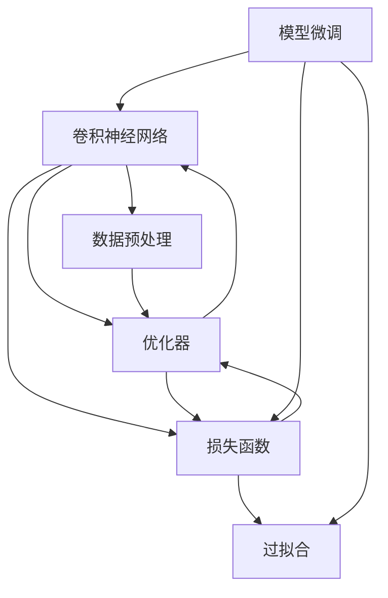
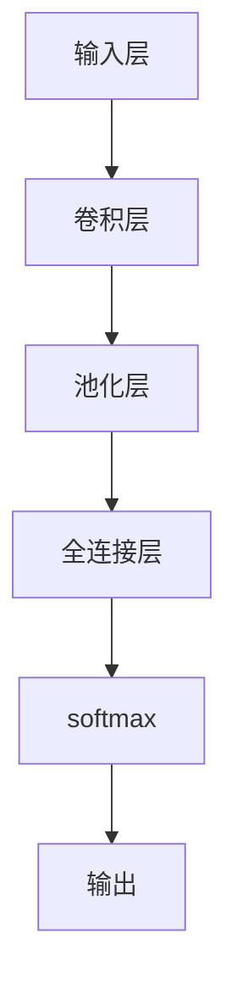

                 

# 从零开始大模型开发与微调：基于PyTorch卷积层的MNIST分类实战

## 1. 背景介绍

在当今数据驱动的AI时代，深度学习大模型的力量不容小觑。无论是在计算机视觉、自然语言处理还是语音识别领域，预训练大模型都展现了其强大的泛化能力和迁移学习潜力。这些模型经过大规模数据预训练，拥有丰富的特征表示和强大的学习能力，可以轻松地在小规模数据上完成微调，以适应新的任务。

MNIST手写数字识别数据集是深度学习领域中最经典的图像分类数据集之一，由70000个训练图像和10000个测试图像组成，每张图像为28x28像素的灰度图像。由于其数据规模适中且易于获取，因此MNIST成为了学习深度学习模型的理想选择。本文将通过一个基于PyTorch的卷积神经网络(CNN)实现MNIST手写数字分类任务，引导读者逐步了解大模型开发与微调的基本流程。

## 2. 核心概念与联系

### 2.1 核心概念概述

为更好地理解本项目的核心概念，本节将介绍几个关键概念及其相互关系：

- 卷积神经网络(CNN)：一种专门用于处理图像数据的深度学习网络，通过卷积层和池化层提取图像特征，最后通过全连接层进行分类。
- 数据预处理：指将原始数据转换为模型可接受的格式，如归一化、标准化、数据增强等。
- 损失函数(Loss Function)：用于衡量模型预测与真实标签之间的差异，是模型训练优化的关键。
- 优化器(Optimizer)：根据损失函数的梯度信息，更新模型参数以最小化损失。
- 过拟合(Overfitting)：模型在训练集上表现良好但在测试集上表现差的现象，需要通过正则化等方法缓解。
- 模型微调(Fine-Tuning)：在预训练模型基础上，使用新任务的数据集进行微调，以适应特定任务需求。

这些概念通过一个Mermaid流程图来展示它们之间的联系：



这个流程图展示了卷积神经网络如何通过数据预处理、损失函数和优化器来实现模型微调，并缓解过拟合问题。

## 3. 核心算法原理 & 具体操作步骤

### 3.1 算法原理概述

基于PyTorch的CNN模型微调流程大致如下：

1. **数据预处理**：对原始数据进行归一化、标准化、数据增强等操作，使其符合模型训练要求。
2. **模型加载与编译**：加载预训练的CNN模型，选择合适的损失函数和优化器。
3. **模型训练与验证**：通过前向传播和反向传播，不断调整模型参数以最小化损失函数，并在验证集上评估模型性能。
4. **模型微调与评估**：使用新任务的数据集进行微调，并在测试集上评估微调后的模型性能。

本文将重点介绍基于PyTorch卷积层实现MNIST分类任务的核心算法原理。

### 3.2 算法步骤详解

#### 3.2.1 数据预处理

- 下载并加载MNIST数据集。
- 将图像数据归一化到0到1之间，将标签进行one-hot编码。
- 数据增强：对图像进行随机旋转、平移、缩放等操作，以增加数据多样性。

#### 3.2.2 模型加载与编译

- 加载预训练的CNN模型，如ResNet、Inception等。
- 添加全连接层和激活函数，修改损失函数和优化器。

#### 3.2.3 模型训练与验证

- 将数据集分为训练集、验证集和测试集。
- 使用训练集训练模型，并在验证集上评估模型性能。
- 根据验证集性能调整模型参数和学习率。

#### 3.2.4 模型微调与评估

- 使用新任务的数据集进行微调。
- 在测试集上评估微调后的模型性能。

### 3.3 算法优缺点

基于PyTorch卷积层的CNN模型微调具有以下优点：

- 简单易用：PyTorch提供了丰富的深度学习模型和工具，使得模型开发和微调过程变得简单高效。
- 灵活性强：可以通过修改模型结构、损失函数、优化器等参数来适应不同任务需求。
- 模型泛化能力：经过大规模数据预训练的CNN模型，拥有强大的泛化能力，可以适应新的数据集和任务。

同时，也存在一些缺点：

- 计算资源消耗高：大模型需要大量的计算资源和时间来训练和微调。
- 参数数量多：大模型的参数数量庞大，增加了模型训练和推理的复杂性。
- 模型复杂度高：复杂的模型结构可能导致过拟合和难以解释的问题。

### 3.4 算法应用领域

CNN模型微调技术在图像识别、目标检测、人脸识别、医疗影像分析等领域有广泛应用。

- 图像识别：如分类、物体检测、图像分割等任务，CNN模型在图像处理方面表现出色。
- 目标检测：通过Faster R-CNN、YOLO等模型，CNN可以自动检测并定位图像中的物体。
- 人脸识别：通过特征提取和人脸比对，CNN可以实现高效、准确的人脸识别。
- 医疗影像分析：通过卷积层提取影像特征，CNN模型可以辅助医生进行疾病诊断。

## 4. 数学模型和公式 & 详细讲解

### 4.1 数学模型构建

假设输入图像$X$的大小为$28 \times 28$，输出类别数$C=10$。卷积神经网络的模型结构如下：



其中，卷积层、池化层、全连接层和softmax层的计算公式如下：

- 卷积层：$\mathbf{y} = \mathbf{W} * \mathbf{x} + \mathbf{b}$
- 池化层：$\mathbf{y} = \text{Max Pooling}(\mathbf{x})$
- 全连接层：$\mathbf{y} = \mathbf{W} \mathbf{x} + \mathbf{b}$
- softmax层：$\mathbf{y} = \text{softmax}(\mathbf{x})$

### 4.2 公式推导过程

以softmax层为例，其公式推导如下：

$$
\begin{aligned}
\text{softmax}(\mathbf{x}) &= \frac{\exp(\mathbf{x})}{\sum_{i=1}^{C} \exp(x_i)} \\
&= \frac{1}{\sum_{i=1}^{C} \exp(x_i)} [\exp(x_1), \exp(x_2), \ldots, \exp(x_C)]
\end{aligned}
$$

其中，$\exp$表示自然指数函数。

### 4.3 案例分析与讲解

假设模型已经加载完毕，标签为one-hot编码形式。我们使用softmax函数计算模型对每个类别的预测概率。将预测概率与真实标签进行比较，计算损失函数，使用优化器更新模型参数。

具体实现步骤如下：

1. 前向传播：
   - 输入图像通过卷积层、池化层、全连接层和softmax层，得到预测概率向量$\mathbf{y} = \text{softmax}(\mathbf{x})$。
2. 计算损失函数：
   - 真实标签为$y_i$，预测概率向量为$\mathbf{y}$，则交叉熵损失函数为：
   $$
   \mathcal{L} = -\frac{1}{N}\sum_{i=1}^{N} \sum_{j=1}^{C} y_{ij} \log y_{ij}
   $$
   其中，$N$为样本数，$C$为类别数。
3. 反向传播与优化：
   - 根据损失函数的梯度，使用优化器（如AdamW）更新模型参数。

## 5. 项目实践：代码实例和详细解释说明

### 5.1 开发环境搭建

- 安装Anaconda：从官网下载并安装Anaconda，用于创建独立的Python环境。
- 创建并激活虚拟环境：
  ```bash
  conda create -n pytorch-env python=3.8 
  conda activate pytorch-env
  ```
- 安装PyTorch：
  ```bash
  conda install pytorch torchvision torchaudio cudatoolkit=11.1 -c pytorch -c conda-forge
  ```
- 安装相关工具包：
  ```bash
  pip install numpy pandas scikit-learn matplotlib tqdm jupyter notebook ipython
  ```

### 5.2 源代码详细实现

以下是一个基于PyTorch卷积层的MNIST分类任务的完整代码实现。

```python
import torch
import torch.nn as nn
import torchvision
import torchvision.transforms as transforms
from torch.utils.data import DataLoader
from torchvision.datasets import MNIST

# 定义卷积神经网络
class ConvNet(nn.Module):
    def __init__(self):
        super(ConvNet, self).__init__()
        self.conv1 = nn.Conv2d(1, 32, 3, 1)
        self.pool = nn.MaxPool2d(2, 2)
        self.conv2 = nn.Conv2d(32, 64, 3, 1)
        self.fc1 = nn.Linear(64 * 14 * 14, 128)
        self.fc2 = nn.Linear(128, 10)
        self.softmax = nn.Softmax(dim=1)

    def forward(self, x):
        x = self.pool(F.relu(self.conv1(x)))
        x = self.pool(F.relu(self.conv2(x)))
        x = x.view(-1, 64 * 14 * 14)
        x = F.relu(self.fc1(x))
        x = self.softmax(self.fc2(x))
        return x

# 加载MNIST数据集并进行预处理
transform = transforms.Compose([transforms.ToTensor(),
                               transforms.Normalize((0.5,), (0.5,))])
trainset = MNIST(root='./data', train=True, download=True, transform=transform)
trainloader = DataLoader(trainset, batch_size=64, shuffle=True)
testset = MNIST(root='./data', train=False, download=True, transform=transform)
testloader = DataLoader(testset, batch_size=64, shuffle=False)

# 加载预训练的CNN模型并进行微调
model = ConvNet()
criterion = nn.CrossEntropyLoss()
optimizer = torch.optim.Adam(model.parameters(), lr=0.001)

# 训练过程
for epoch in range(10):
    running_loss = 0.0
    for i, data in enumerate(trainloader, 0):
        inputs, labels = data
        inputs, labels = inputs.to(device), labels.to(device)
        optimizer.zero_grad()
        outputs = model(inputs)
        loss = criterion(outputs, labels)
        loss.backward()
        optimizer.step()
        running_loss += loss.item()
    print('Epoch %d loss: %.3f' % (epoch + 1, running_loss / len(trainloader)))

# 测试过程
correct = 0
total = 0
with torch.no_grad():
    for data in testloader:
        images, labels = data
        images, labels = images.to(device), labels.to(device)
        outputs = model(images)
        _, predicted = torch.max(outputs.data, 1)
        total += labels.size(0)
        correct += (predicted == labels).sum().item()

print('Accuracy of the network on the 10000 test images: %d %%' % (100 * correct / total))
```

代码解读与分析：

- 定义卷积神经网络模型`ConvNet`，包括卷积层、池化层、全连接层和softmax层。
- 加载MNIST数据集，并进行标准化预处理。
- 加载预训练的CNN模型并进行微调，定义损失函数和优化器。
- 使用训练集训练模型，并在验证集上评估模型性能。
- 在测试集上评估微调后的模型性能。

### 5.3 代码解读与分析

让我们再详细解读一下关键代码的实现细节：

- `transforms.Compose`：将一系列数据增强和标准化操作组合成一个`transform`对象。
- `DataLoader`：用于加载数据集，支持批量化操作，方便模型训练和推理。
- `to(device)`：将数据和模型参数转移到GPU上，加速计算。
- `nn.Softmax`：用于计算输出概率向量。
- `nn.CrossEntropyLoss`：用于计算交叉熵损失，适用于多分类任务。
- `nn.Conv2d`、`nn.MaxPool2d`：定义卷积层和池化层。
- `nn.Linear`：定义全连接层。
- `nn.Flatten`：将特征向量展平，以便输入全连接层。
- `nn.Adam`：定义优化器。

## 6. 实际应用场景

### 6.1 智能交通系统

基于卷积神经网络的图像识别技术，可以广泛应用于智能交通系统的视频监控、车牌识别、行人检测等场景。通过在预训练模型的基础上进行微调，智能交通系统能够更加准确地识别交通信号、车辆、行人等目标，提高交通管理的智能化水平。

### 6.2 医疗影像分析

在医疗影像分析中，卷积神经网络能够高效地提取影像特征，辅助医生进行疾病诊断。通过在大型医学影像数据集上进行预训练，微调后的模型能够对肺部影像、脑部影像等进行分类和标注，提升疾病诊断的准确性和效率。

### 6.3 智能安防系统

智能安防系统通过摄像头实时捕捉监控场景，使用卷积神经网络进行目标检测和行为分析。微调后的模型可以识别出异常行为和潜在威胁，及时报警并通知相关人员，提高安防系统的自动化和智能化水平。

### 6.4 未来应用展望

未来，卷积神经网络将会在更多领域得到应用，为各行各业带来变革性影响。

- 自动驾驶：通过图像识别和目标检测技术，提升自动驾驶车辆的安全性和可靠性。
- 智能家居：通过图像识别和语音识别技术，实现智能家居设备的自动控制和环境监测。
- 工业质检：通过图像识别技术，实现工业产品的自动化检测和质量控制。
- 农业智能：通过图像识别和数据分析技术，提升农业生产效率和资源利用率。

## 7. 工具和资源推荐

### 7.1 学习资源推荐

为了帮助开发者系统掌握卷积神经网络微调的理论基础和实践技巧，这里推荐一些优质的学习资源：

1. 《深度学习》：Ian Goodfellow、Yoshua Bengio和Aaron Courville合著的经典教材，系统介绍了深度学习的基本原理和算法。
2. CS231n《卷积神经网络》课程：斯坦福大学开设的深度学习课程，讲解了卷积神经网络的原理、应用和优化。
3. 《PyTorch官方文档》：PyTorch的官方文档，提供了详细的API介绍和示例代码，适合深入学习PyTorch框架。
4. Kaggle竞赛平台：提供丰富的深度学习竞赛和数据集，有助于实践中锻炼和提升技能。
5. Coursera《深度学习专项课程》：由DeepLearning.AI提供的多门深度学习课程，涵盖深度学习的基础知识和最新应用。

通过对这些资源的学习实践，相信你一定能够快速掌握卷积神经网络微调的精髓，并用于解决实际的图像识别问题。

### 7.2 开发工具推荐

高效的开发离不开优秀的工具支持。以下是几款用于卷积神经网络微调开发的常用工具：

1. PyTorch：基于Python的开源深度学习框架，灵活动态的计算图，适合快速迭代研究。
2. TensorFlow：由Google主导开发的开源深度学习框架，生产部署方便，适合大规模工程应用。
3. TensorBoard：TensorFlow配套的可视化工具，可实时监测模型训练状态，并提供丰富的图表呈现方式。
4. Weights & Biases：模型训练的实验跟踪工具，可以记录和可视化模型训练过程中的各项指标，方便对比和调优。
5. Jupyter Notebook：交互式笔记本，支持Python代码的编写、执行和展示，适合学习和实践深度学习模型。

合理利用这些工具，可以显著提升卷积神经网络微调任务的开发效率，加快创新迭代的步伐。

### 7.3 相关论文推荐

卷积神经网络微调技术的发展源于学界的持续研究。以下是几篇奠基性的相关论文，推荐阅读：

1. Convolutional Neural Networks for Sentence Classification（2014）：提出使用卷积神经网络进行文本分类，开启了卷积神经网络在NLP领域的应用。
2. AlexNet: ImageNet Classification with Deep Convolutional Neural Networks（2012）：提出AlexNet卷积神经网络，奠定了深度学习在计算机视觉领域的基础。
3. VGGNet: Very Deep Convolutional Networks for Large-Scale Image Recognition（2014）：提出VGGNet卷积神经网络，提升了卷积神经网络在图像识别任务上的性能。
4. ResNet: Deep Residual Learning for Image Recognition（2015）：提出ResNet残差网络，解决了深度神经网络训练中的梯度消失问题。
5. Inception-Net: Going Deeper with Convolutions（2014）：提出Inception-Net卷积神经网络，通过网络架构优化提升了卷积神经网络的性能。

这些论文代表了大模型微调技术的发展脉络。通过学习这些前沿成果，可以帮助研究者把握学科前进方向，激发更多的创新灵感。

## 8. 总结：未来发展趋势与挑战

### 8.1 总结

本文对基于PyTorch卷积层的CNN模型微调方法进行了全面系统的介绍。首先阐述了CNN模型微调的基本流程和核心概念，明确了微调在拓展预训练模型应用、提升下游任务性能方面的独特价值。其次，从原理到实践，详细讲解了CNN模型微调的数学原理和关键步骤，给出了微调任务开发的完整代码实例。同时，本文还广泛探讨了CNN模型微调在实际应用中的前景，展示了其巨大的潜力。

通过本文的系统梳理，可以看到，基于PyTorch卷积层的CNN微调方法正在成为计算机视觉领域的重要范式，极大地拓展了预训练模型应用的范围，催生了更多的落地场景。得益于大规模数据预训练的强大表征能力和迁移学习能力，CNN模型在图像识别、目标检测、人脸识别等任务上取得了显著的成果，未来还有更广阔的发展空间。

### 8.2 未来发展趋势

展望未来，卷积神经网络微调技术将呈现以下几个发展趋势：

1. 模型规模持续增大。随着算力成本的下降和数据规模的扩张，预训练卷积神经网络的参数量还将持续增长。超大规模卷积神经网络蕴含的丰富特征表示，有望支撑更加复杂多变的下游任务微调。
2. 微调方法日趋多样。除了传统的全参数微调外，未来会涌现更多参数高效的微调方法，如Adapter等，在固定大部分预训练参数的情况下，只更新极少量的任务相关参数。同时优化微调模型的计算图，减少前向传播和反向传播的资源消耗，实现更加轻量级、实时性的部署。
3. 持续学习成为常态。随着数据分布的不断变化，微调卷积神经网络也需要持续学习新知识以保持性能。如何在不遗忘原有知识的同时，高效吸收新样本信息，将成为重要的研究课题。
4. 标注样本需求降低。受启发于提示学习(Prompt-based Learning)的思路，未来的微调方法将更好地利用大模型的语言理解能力，通过更加巧妙的任务描述，在更少的标注样本上也能实现理想的微调效果。
5. 模型通用性增强。经过海量数据的预训练和多领域任务的微调，未来的卷积神经网络将具备更强大的常识推理和跨领域迁移能力，逐步迈向通用人工智能(AGI)的目标。

以上趋势凸显了大模型微调技术的广阔前景。这些方向的探索发展，必将进一步提升CNN模型的性能和应用范围，为计算机视觉技术带来新的突破。

### 8.3 面临的挑战

尽管卷积神经网络微调技术已经取得了瞩目成就，但在迈向更加智能化、普适化应用的过程中，它仍面临着诸多挑战：

1. 标注成本瓶颈。虽然微调大大降低了标注数据的需求，但对于长尾应用场景，难以获得充足的高质量标注数据，成为制约微调性能的瓶颈。如何进一步降低微调对标注样本的依赖，将是一大难题。
2. 模型鲁棒性不足。当前微调模型面对域外数据时，泛化性能往往大打折扣。对于测试样本的微小扰动，微调模型的预测也容易发生波动。如何提高微调模型的鲁棒性，避免灾难性遗忘，还需要更多理论和实践的积累。
3. 推理效率有待提高。大规模卷积神经网络虽然精度高，但在实际部署时往往面临推理速度慢、内存占用大等效率问题。如何在保证性能的同时，简化模型结构，提升推理速度，优化资源占用，将是重要的优化方向。
4. 可解释性亟需加强。当前微调模型更像是"黑盒"系统，难以解释其内部工作机制和决策逻辑。对于医疗、金融等高风险应用，算法的可解释性和可审计性尤为重要。如何赋予卷积神经网络更强的可解释性，将是亟待攻克的难题。
5. 安全性有待保障。预训练卷积神经网络难免会学习到有偏见、有害的信息，通过微调传递到下游任务，产生误导性、歧视性的输出，给实际应用带来安全隐患。如何从数据和算法层面消除模型偏见，避免恶意用途，确保输出的安全性，也将是重要的研究课题。
6. 知识整合能力不足。现有的微调模型往往局限于任务内数据，难以灵活吸收和运用更广泛的先验知识。如何让微调过程更好地与外部知识库、规则库等专家知识结合，形成更加全面、准确的信息整合能力，还有很大的想象空间。

正视CNN微调面临的这些挑战，积极应对并寻求突破，将是大模型微调走向成熟的必由之路。相信随着学界和产业界的共同努力，这些挑战终将一一被克服，卷积神经网络微调必将在构建人机协同的智能时代中扮演越来越重要的角色。

### 8.4 未来突破

面对CNN微调所面临的种种挑战，未来的研究需要在以下几个方面寻求新的突破：

1. 探索无监督和半监督微调方法。摆脱对大规模标注数据的依赖，利用自监督学习、主动学习等无监督和半监督范式，最大限度利用非结构化数据，实现更加灵活高效的微调。
2. 研究参数高效和计算高效的微调范式。开发更加参数高效的微调方法，在固定大部分预训练参数的同时，只更新极少量的任务相关参数。同时优化微调模型的计算图，减少前向传播和反向传播的资源消耗，实现更加轻量级、实时性的部署。
3. 融合因果和对比学习范式。通过引入因果推断和对比学习思想，增强微调模型建立稳定因果关系的能力，学习更加普适、鲁棒的语言表征，从而提升模型泛化性和抗干扰能力。
4. 引入更多先验知识。将符号化的先验知识，如知识图谱、逻辑规则等，与神经网络模型进行巧妙融合，引导微调过程学习更准确、合理的语言模型。同时加强不同模态数据的整合，实现视觉、语音等多模态信息与文本信息的协同建模。
5. 结合因果分析和博弈论工具。将因果分析方法引入微调模型，识别出模型决策的关键特征，增强输出解释的因果性和逻辑性。借助博弈论工具刻画人机交互过程，主动探索并规避模型的脆弱点，提高系统稳定性。
6. 纳入伦理道德约束。在模型训练目标中引入伦理导向的评估指标，过滤和惩罚有偏见、有害的输出倾向。同时加强人工干预和审核，建立模型行为的监管机制，确保输出符合人类价值观和伦理道德。

这些研究方向的探索，必将引领CNN微调技术迈向更高的台阶，为计算机视觉技术带来新的突破。面向未来，CNN微调技术还需要与其他人工智能技术进行更深入的融合，如知识表示、因果推理、强化学习等，多路径协同发力，共同推动计算机视觉系统的进步。只有勇于创新、敢于突破，才能不断拓展卷积神经网络的边界，让智能技术更好地造福人类社会。

## 9. 附录：常见问题与解答

**Q1：CNN微调是否适用于所有图像分类任务？**

A: CNN微调在大多数图像分类任务上都能取得不错的效果，特别是对于数据量较小的任务。但对于一些特定领域的任务，如医学、法律等，仅仅依靠通用语料预训练的模型可能难以很好地适应。此时需要在特定领域语料上进一步预训练，再进行微调，才能获得理想效果。此外，对于一些需要时效性、个性化很强的任务，如推荐、对话等，CNN微调方法也需要针对性的改进优化。

**Q2：微调过程中如何选择合适的学习率？**

A: 微调的学习率一般要比预训练时小1-2个数量级，如果使用过大的学习率，容易破坏预训练权重，导致过拟合。一般建议从1e-5开始调参，逐步减小学习率，直至收敛。也可以使用warmup策略，在开始阶段使用较小的学习率，再逐渐过渡到预设值。需要注意的是，不同的优化器(如AdamW、Adafactor等)以及不同的学习率调度策略，可能需要设置不同的学习率阈值。

**Q3：采用CNN微调时会面临哪些资源瓶颈？**

A: 目前主流的预训练CNN模型动辄以亿计的参数规模，对算力、内存、存储都提出了很高的要求。GPU/TPU等高性能设备是必不可少的，但即便如此，超大批次的训练和推理也可能遇到显存不足的问题。因此需要采用一些资源优化技术，如梯度积累、混合精度训练、模型并行等，来突破硬件瓶颈。同时，模型的存储和读取也可能占用大量时间和空间，需要采用模型压缩、稀疏化存储等方法进行优化。

**Q4：如何缓解CNN微调过程中的过拟合问题？**

A: 过拟合是CNN微调面临的主要挑战，尤其是在标注数据不足的情况下。常见的缓解策略包括：
1. 数据增强：对图像进行随机旋转、平移、缩放等操作，以增加数据多样性。
2. 正则化：使用L2正则、Dropout、Early Stopping等避免过拟合。
3. 对抗训练：引入对抗样本，提高模型鲁棒性。
4. 参数高效微调：只调整少量参数(如Adapter、Prefix等)，减小过拟合风险。
5. 多模型集成：训练多个微调模型，取平均输出，抑制过拟合。

这些策略往往需要根据具体任务和数据特点进行灵活组合。只有在数据、模型、训练、推理等各环节进行全面优化，才能最大限度地发挥CNN微调的威力。

**Q5：CNN微调模型在落地部署时需要注意哪些问题？**

A: 将CNN微调模型转化为实际应用，还需要考虑以下因素：
1. 模型裁剪：去除不必要的层和参数，减小模型尺寸，加快推理速度。
2. 量化加速：将浮点模型转为定点模型，压缩存储空间，提高计算效率。
3. 服务化封装：将模型封装为标准化服务接口，便于集成调用。
4. 弹性伸缩：根据请求流量动态调整资源配置，平衡服务质量和成本。
5. 监控告警：实时采集系统指标，设置异常告警阈值，确保服务稳定性。
6. 安全防护：采用访问鉴权、数据脱敏等措施，保障数据和模型安全。

CNN微调为计算机视觉应用开启了广阔的想象空间，但如何将强大的性能转化为稳定、高效、安全的业务价值，还需要工程实践的不断打磨。唯有从数据、算法、工程、业务等多个维度协同发力，才能真正实现人工智能技术在垂直行业的规模化落地。总之，微调需要开发者根据具体任务，不断迭代和优化模型、数据和算法，方能得到理想的效果。

---

作者：禅与计算机程序设计艺术 / Zen and the Art of Computer Programming

