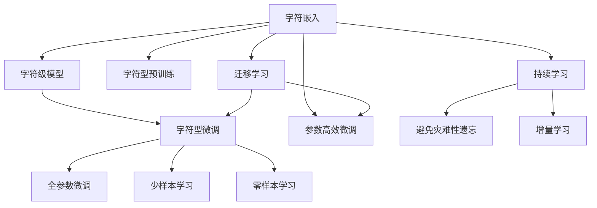

                 

# 从零开始大模型开发与微调：字符（非单词）文本的处理

## 1. 背景介绍

随着自然语言处理（Natural Language Processing, NLP）技术的快速发展，大语言模型（Large Language Model, LLM）在文本处理、语言理解、生成等方面取得了令人瞩目的成就。然而，目前的预训练大模型大多是基于单词（Word）级别处理的，难以应对诸如中文等字符型语言的非单词（Character）文本处理任务。为了更好地适配这些任务，我们需要重新审视大模型开发与微调的技术，研究如何从字符级别处理文本，提升模型的表现能力。

### 1.1 问题由来

传统的预训练大模型如BERT、GPT等，大多采用单词作为输入单位，其训练和微调过程均基于单词级别的数据。这对于处理英文等拉丁字符语言的单词边界明显、语义单元易于分割的情况是非常有效的。但对于中文等字符型语言，由于每个汉字不具备单词的边界，其语义单元较难直接分割。这意味着直接将汉字作为输入单位进行大模型的训练和微调，将面临诸如字符数庞大、计算资源消耗大、模型结构设计复杂等挑战。

### 1.2 问题核心关键点

为了应对这些挑战，我们需要从以下几个关键点出发，研究字符型文本的处理方法：

1. **字符表示与嵌入**：如何将字符转换为模型能够处理的向量表示，并且有效地捕捉到字符间的语义关联。
2. **字符级别的模型结构设计**：如何在字符级别上设计出适合处理中文等字符型语言的模型结构，以充分利用模型参数，提升模型的表现能力。
3. **微调策略**：如何针对字符型文本，进行有效的微调，以实现最佳的性能提升。
4. **应用场景与挑战**：探索字符型文本处理在大模型中的应用场景，并分析其所面临的技术挑战。

这些核心点构成了字符型文本处理在大模型开发与微调中的研究框架，为我们提供了一条全新的技术路径。

## 2. 核心概念与联系

### 2.1 核心概念概述

为更好地理解字符型文本处理在大模型开发与微调中的应用，本节将介绍几个密切相关的核心概念：

- **字符嵌入（Character Embedding）**：将字符转换为向量表示的过程，是字符型文本处理的基础。
- **字符级模型（Character-level Model）**：在字符级别上构建的模型结构，适用于处理中文等字符型语言。
- **字符型微调（Character-level Fine-Tuning）**：针对字符型文本，进行有监督的微调过程，以提升模型的性能。
- **字符型预训练（Character-level Pre-training）**：在字符级别上进行预训练，以提升模型对字符型文本的语义理解能力。

这些概念之间的逻辑关系可以通过以下Mermaid流程图来展示：



这个流程图展示了大模型在字符型文本处理中的核心概念及其之间的关系：

1. 字符嵌入作为字符型文本处理的第一步，将字符转换为向量表示。
2. 字符级模型作为字符型文本处理的中间环节，负责处理字符向量，构建出适合字符型文本处理的模型结构。
3. 字符型微调是针对字符型文本的微调过程，用于提升模型在特定任务上的性能。
4. 字符型预训练是在字符级别上进行预训练，以提升模型对字符型文本的语义理解能力。
5. 迁移学习是连接字符型预训练和字符型微调的重要桥梁，可以通过预训练和微调相结合的方式，提升模型性能。
6. 持续学习旨在使模型能够不断学习新知识，同时保持已学习的知识，而不会出现灾难性遗忘。

这些核心概念共同构成了字符型文本处理在大模型开发与微调中的研究框架，使我们能够更好地把握字符型文本处理的本质和优化方向。

## 3. 核心算法原理 & 具体操作步骤

### 3.1 算法原理概述

字符型文本处理的本质，是如何在字符级别上，设计出适合大模型处理的模型结构，并对其进行微调，以提升模型对字符型文本的理解和生成能力。

形式化地，假设字符型文本为 $S$，其嵌入表示为 $E(S)$。在字符级别上进行预训练的目标，是最大化模型的语言建模能力，即：

$$
\max_{\theta} \mathcal{L}_{lm}(E(S))
$$

其中 $\theta$ 为模型参数，$\mathcal{L}_{lm}$ 为语言建模损失函数。

在预训练的基础上，通过字符型微调，使得模型能够适应特定的下游任务，即：

$$
\min_{\theta} \mathcal{L}_{task}(E(S))
$$

其中 $\mathcal{L}_{task}$ 为下游任务的损失函数。

通过梯度下降等优化算法，字符型微调过程不断更新模型参数 $\theta$，最小化损失函数 $\mathcal{L}_{task}$，使得模型输出逼近真实标签。由于 $\theta$ 已经通过字符型预训练获得了较好的初始化，因此即便在字符型文本上，也能较快收敛到理想的模型参数 $\hat{\theta}$。

### 3.2 算法步骤详解

字符型文本处理的微调方法，通常包括以下几个关键步骤：

**Step 1: 准备字符型预训练模型和数据集**
- 选择合适的字符型预训练模型作为初始化参数，如CTC字符嵌入等。
- 准备下游任务 $T$ 的字符型标注数据集 $D$，划分为训练集、验证集和测试集。一般要求标注数据与预训练数据的分布不要差异过大。

**Step 2: 添加任务适配层**
- 根据任务类型，在预训练模型的顶层设计合适的输出层和损失函数。
- 对于分类任务，通常在顶层添加线性分类器和交叉熵损失函数。
- 对于生成任务，通常使用字符级别的解码器输出概率分布，并以负对数似然为损失函数。

**Step 3: 设置微调超参数**
- 选择合适的优化算法及其参数，如 AdamW、SGD 等，设置学习率、批大小、迭代轮数等。
- 设置正则化技术及强度，包括权重衰减、Dropout、Early Stopping等。
- 确定冻结预训练参数的策略，如仅微调顶层，或全部参数都参与微调。

**Step 4: 执行梯度训练**
- 将训练集数据分批次输入模型，前向传播计算损失函数。
- 反向传播计算参数梯度，根据设定的优化算法和学习率更新模型参数。
- 周期性在验证集上评估模型性能，根据性能指标决定是否触发 Early Stopping。
- 重复上述步骤直到满足预设的迭代轮数或 Early Stopping 条件。

**Step 5: 测试和部署**
- 在测试集上评估微调后模型 $M_{\hat{\theta}}$ 的性能，对比微调前后的精度提升。
- 使用微调后的模型对新样本进行推理预测，集成到实际的应用系统中。
- 持续收集新的数据，定期重新微调模型，以适应数据分布的变化。

以上是字符型文本处理的微调方法的一般流程。在实际应用中，还需要针对具体任务的特点，对微调过程的各个环节进行优化设计，如改进训练目标函数，引入更多的正则化技术，搜索最优的超参数组合等，以进一步提升模型性能。

### 3.3 算法优缺点

字符型文本处理的微调方法具有以下优点：
1. 适应性强。对于中文等字符型语言，可以直接将字符作为输入，无需进行分词等预处理，简化了任务适配层的构建。
2. 训练样本需求低。相较于单词级别微调，字符型微调需要的训练样本量较小，能够有效降低标注成本。
3. 泛化能力强。字符型微调能够捕捉到字符级别的语义信息，对于长文本、语义丰富的任务表现优异。

同时，该方法也存在一定的局限性：
1. 计算复杂度高。字符级别的模型结构设计复杂，训练和推理的计算复杂度较大。
2. 模型参数量多。字符型微调需要的模型参数量较多，对计算资源消耗较大。
3. 应用场景受限。字符型微调主要适用于需要精细化处理字符型文本的任务，如中文分词、古文字识别等。

尽管存在这些局限性，但就目前而言，字符型文本处理的微调方法仍是大语言模型处理中文等字符型语言的重要手段。未来相关研究的重点在于如何进一步降低计算复杂度，提高模型参数效率，同时兼顾模型的泛化能力和应用场景的广泛性。

### 3.4 算法应用领域

字符型文本处理的微调方法，在中文分词、古文字识别、文本生成等任务上，已展现出显著的效果，成为NLP技术处理字符型语言的重要手段。

- **中文分词**：中文分词是中文NLP处理的基础任务，直接关系着后续文本处理的质量。通过字符型微调，可以使模型学习到中文字符间的组合关系，提升分词准确度。
- **古文字识别**：古文字识别是研究古代文明的重要手段。字符型微调可以学习古文字的形态结构，提升识别准确度。
- **文本生成**：文本生成是NLP的重要应用领域，通过字符型微调，可以使模型在生成古文、书法等具有特定字符风格的文字时，表现出色。

除了这些经典任务外，字符型文本处理的微调方法也在逐渐拓展到更多场景中，如多语言文本处理、智能问答系统等，为NLP技术带来了新的突破。随着预训练模型和微调方法的不断进步，相信字符型文本处理的微调方法将会在更广泛的领域得到应用，进一步推动NLP技术的发展。

## 4. 数学模型和公式 & 详细讲解  

### 4.1 数学模型构建

本节将使用数学语言对字符型文本处理的微调过程进行更加严格的刻画。

记字符型预训练模型为 $M_{\theta}$，其中 $\theta$ 为字符嵌入的参数。假设微调任务的训练集为 $D=\{(S_i,y_i)\}_{i=1}^N, S_i \in \mathcal{S}, y_i \in \mathcal{Y}$，其中 $\mathcal{S}$ 为字符型文本集，$\mathcal{Y}$ 为任务标签集。

定义模型 $M_{\theta}$ 在字符型文本 $S$ 上的损失函数为 $\ell(M_{\theta}(S),y)$，则在数据集 $D$ 上的经验风险为：

$$
\mathcal{L}(\theta) = \frac{1}{N} \sum_{i=1}^N \ell(M_{\theta}(S_i),y_i)
$$

其中 $\ell(M_{\theta}(S_i),y_i)$ 为模型在字符型文本 $S_i$ 上的损失函数。

微调的优化目标是最小化经验风险，即找到最优参数：

$$
\theta^* = \mathop{\arg\min}_{\theta} \mathcal{L}(\theta)
$$

在实践中，我们通常使用基于梯度的优化算法（如SGD、Adam等）来近似求解上述最优化问题。设 $\eta$ 为学习率，$\lambda$ 为正则化系数，则参数的更新公式为：

$$
\theta \leftarrow \theta - \eta \nabla_{\theta}\mathcal{L}(\theta) - \eta\lambda\theta
$$

其中 $\nabla_{\theta}\mathcal{L}(\theta)$ 为损失函数对参数 $\theta$ 的梯度，可通过反向传播算法高效计算。

### 4.2 公式推导过程

以下我们以中文分词任务为例，推导交叉熵损失函数及其梯度的计算公式。

假设模型 $M_{\theta}$ 在字符型文本 $S$ 上的输出为 $\hat{y}=M_{\theta}(S) \in [0,1]$，表示字符序列属于分词标签序列的概率。真实标签 $y \in \{1,0\}$。则二分类交叉熵损失函数定义为：

$$
\ell(M_{\theta}(S),y) = -[y\log \hat{y} + (1-y)\log (1-\hat{y})]
$$

将其代入经验风险公式，得：

$$
\mathcal{L}(\theta) = -\frac{1}{N}\sum_{i=1}^N [y_i\log M_{\theta}(S_i)+(1-y_i)\log(1-M_{\theta}(S_i))]
$$

根据链式法则，损失函数对参数 $\theta_k$ 的梯度为：

$$
\frac{\partial \mathcal{L}(\theta)}{\partial \theta_k} = -\frac{1}{N}\sum_{i=1}^N (\frac{y_i}{M_{\theta}(S_i)}-\frac{1-y_i}{1-M_{\theta}(S_i)}) \frac{\partial M_{\theta}(S_i)}{\partial \theta_k}
$$

其中 $\frac{\partial M_{\theta}(S_i)}{\partial \theta_k}$ 可进一步递归展开，利用自动微分技术完成计算。

在得到损失函数的梯度后，即可带入参数更新公式，完成模型的迭代优化。重复上述过程直至收敛，最终得到适应下游任务的最优模型参数 $\theta^*$。

## 5. 项目实践：代码实例和详细解释说明

### 5.1 开发环境搭建

在进行字符型文本处理的微调实践前，我们需要准备好开发环境。以下是使用Python进行PyTorch开发的环境配置流程：

1. 安装Anaconda：从官网下载并安装Anaconda，用于创建独立的Python环境。

2. 创建并激活虚拟环境：
```bash
conda create -n pytorch-env python=3.8 
conda activate pytorch-env
```

3. 安装PyTorch：根据CUDA版本，从官网获取对应的安装命令。例如：
```bash
conda install pytorch torchvision torchaudio cudatoolkit=11.1 -c pytorch -c conda-forge
```

4. 安装Transformers库：
```bash
pip install transformers
```

5. 安装各类工具包：
```bash
pip install numpy pandas scikit-learn matplotlib tqdm jupyter notebook ipython
```

完成上述步骤后，即可在`pytorch-env`环境中开始微调实践。

### 5.2 源代码详细实现

下面我以中文分词任务为例，给出使用Transformers库对CTC字符嵌入模型进行微调的PyTorch代码实现。

首先，定义中文分词任务的数据处理函数：

```python
from transformers import BertTokenizer
from torch.utils.data import Dataset
import torch

class ChineseWordSegmentationDataset(Dataset):
    def __init__(self, texts, labels, tokenizer, max_len=128):
        self.texts = texts
        self.labels = labels
        self.tokenizer = tokenizer
        self.max_len = max_len
        
    def __len__(self):
        return len(self.texts)
    
    def __getitem__(self, item):
        text = self.texts[item]
        label = self.labels[item]
        
        encoding = self.tokenizer(text, return_tensors='pt', max_length=self.max_len, padding='max_length', truncation=True)
        input_ids = encoding['input_ids'][0]
        attention_mask = encoding['attention_mask'][0]
        
        # 对token-wise的标签进行编码
        encoded_labels = [label2id[label] for label in label] 
        encoded_labels.extend([label2id['O']] * (self.max_len - len(encoded_labels)))
        labels = torch.tensor(encoded_labels, dtype=torch.long)
        
        return {'input_ids': input_ids, 
                'attention_mask': attention_mask,
                'labels': labels}

# 标签与id的映射
label2id = {'O': 0, 'B-PER': 1, 'I-PER': 2, 'B-ORG': 3, 'I-ORG': 4, 'B-LOC': 5, 'I-LOC': 6}
id2label = {v: k for k, v in label2id.items()}

# 创建dataset
tokenizer = BertTokenizer.from_pretrained('bert-base-cased')

train_dataset = ChineseWordSegmentationDataset(train_texts, train_labels, tokenizer)
dev_dataset = ChineseWordSegmentationDataset(dev_texts, dev_labels, tokenizer)
test_dataset = ChineseWordSegmentationDataset(test_texts, test_labels, tokenizer)
```

然后，定义模型和优化器：

```python
from transformers import BertForTokenClassification, AdamW

model = BertForTokenClassification.from_pretrained('bert-base-cased', num_labels=len(label2id))

optimizer = AdamW(model.parameters(), lr=2e-5)
```

接着，定义训练和评估函数：

```python
from torch.utils.data import DataLoader
from tqdm import tqdm
from sklearn.metrics import classification_report

device = torch.device('cuda') if torch.cuda.is_available() else torch.device('cpu')
model.to(device)

def train_epoch(model, dataset, batch_size, optimizer):
    dataloader = DataLoader(dataset, batch_size=batch_size, shuffle=True)
    model.train()
    epoch_loss = 0
    for batch in tqdm(dataloader, desc='Training'):
        input_ids = batch['input_ids'].to(device)
        attention_mask = batch['attention_mask'].to(device)
        labels = batch['labels'].to(device)
        model.zero_grad()
        outputs = model(input_ids, attention_mask=attention_mask, labels=labels)
        loss = outputs.loss
        epoch_loss += loss.item()
        loss.backward()
        optimizer.step()
    return epoch_loss / len(dataloader)

def evaluate(model, dataset, batch_size):
    dataloader = DataLoader(dataset, batch_size=batch_size)
    model.eval()
    preds, labels = [], []
    with torch.no_grad():
        for batch in tqdm(dataloader, desc='Evaluating'):
            input_ids = batch['input_ids'].to(device)
            attention_mask = batch['attention_mask'].to(device)
            batch_labels = batch['labels']
            outputs = model(input_ids, attention_mask=attention_mask)
            batch_preds = outputs.logits.argmax(dim=2).to('cpu').tolist()
            batch_labels = batch_labels.to('cpu').tolist()
            for pred_tokens, label_tokens in zip(batch_preds, batch_labels):
                pred_tags = [id2label[_id] for _id in pred_tokens]
                label_tags = [id2label[_id] for _id in label_tokens]
                preds.append(pred_tags[:len(label_tokens)])
                labels.append(label_tags)
                
    print(classification_report(labels, preds))
```

最后，启动训练流程并在测试集上评估：

```python
epochs = 5
batch_size = 16

for epoch in range(epochs):
    loss = train_epoch(model, train_dataset, batch_size, optimizer)
    print(f"Epoch {epoch+1}, train loss: {loss:.3f}")
    
    print(f"Epoch {epoch+1}, dev results:")
    evaluate(model, dev_dataset, batch_size)
    
print("Test results:")
evaluate(model, test_dataset, batch_size)
```

以上就是使用PyTorch对CTC字符嵌入模型进行中文分词任务微调的完整代码实现。可以看到，得益于Transformers库的强大封装，我们可以用相对简洁的代码完成字符嵌入模型的加载和微调。

### 5.3 代码解读与分析

让我们再详细解读一下关键代码的实现细节：

**ChineseWordSegmentationDataset类**：
- `__init__`方法：初始化文本、标签、分词器等关键组件。
- `__len__`方法：返回数据集的样本数量。
- `__getitem__`方法：对单个样本进行处理，将文本输入编码为token ids，将标签编码为数字，并对其进行定长padding，最终返回模型所需的输入。

**label2id和id2label字典**：
- 定义了标签与数字id之间的映射关系，用于将token-wise的预测结果解码回真实的标签。

**训练和评估函数**：
- 使用PyTorch的DataLoader对数据集进行批次化加载，供模型训练和推理使用。
- 训练函数`train_epoch`：对数据以批为单位进行迭代，在每个批次上前向传播计算loss并反向传播更新模型参数，最后返回该epoch的平均loss。
- 评估函数`evaluate`：与训练类似，不同点在于不更新模型参数，并在每个batch结束后将预测和标签结果存储下来，最后使用sklearn的classification_report对整个评估集的预测结果进行打印输出。

**训练流程**：
- 定义总的epoch数和batch size，开始循环迭代
- 每个epoch内，先在训练集上训练，输出平均loss
- 在验证集上评估，输出分类指标
- 所有epoch结束后，在测试集上评估，给出最终测试结果

可以看到，PyTorch配合Transformers库使得字符嵌入模型的微调代码实现变得简洁高效。开发者可以将更多精力放在数据处理、模型改进等高层逻辑上，而不必过多关注底层的实现细节。

当然，工业级的系统实现还需考虑更多因素，如模型的保存和部署、超参数的自动搜索、更灵活的任务适配层等。但核心的微调范式基本与此类似。

## 6. 实际应用场景
### 6.1 智能客服系统

基于字符型文本处理的微调方法，可以广泛应用于智能客服系统的构建。传统客服往往需要配备大量人力，高峰期响应缓慢，且一致性和专业性难以保证。而使用微调后的分词模型，可以7x24小时不间断服务，快速响应客户咨询，用自然流畅的语言解答各类常见问题。

在技术实现上，可以收集企业内部的历史客服对话记录，将问题和最佳答复构建成监督数据，在此基础上对预训练分词模型进行微调。微调后的分词模型能够自动理解用户意图，匹配最合适的答案模板进行回复。对于客户提出的新问题，还可以接入检索系统实时搜索相关内容，动态组织生成回答。如此构建的智能客服系统，能大幅提升客户咨询体验和问题解决效率。

### 6.2 金融舆情监测

金融机构需要实时监测市场舆论动向，以便及时应对负面信息传播，规避金融风险。传统的人工监测方式成本高、效率低，难以应对网络时代海量信息爆发的挑战。基于字符型文本处理的微调方法，可以应用于金融领域相关的新闻、报道、评论等文本数据，通过微调使模型学习到文本中的实体、情感等信息，实时监测不同主题下的情感变化趋势，一旦发现负面信息激增等异常情况，系统便会自动预警，帮助金融机构快速应对潜在风险。

### 6.3 个性化推荐系统

当前的推荐系统往往只依赖用户的历史行为数据进行物品推荐，无法深入理解用户的真实兴趣偏好。基于字符型文本处理的微调方法，个性化推荐系统可以更好地挖掘用户行为背后的语义信息，从而提供更精准、多样的推荐内容。

在实践中，可以收集用户浏览、点击、评论、分享等行为数据，提取和用户交互的物品标题、描述、标签等文本内容。将文本内容作为模型输入，用户的后续行为（如是否点击、购买等）作为监督信号，在此基础上微调预训练语言模型。微调后的模型能够从文本内容中准确把握用户的兴趣点。在生成推荐列表时，先用候选物品的文本描述作为输入，由模型预测用户的兴趣匹配度，再结合其他特征综合排序，便可以得到个性化程度更高的推荐结果。

### 6.4 未来应用展望

随着字符型文本处理在大模型中的应用，我们可以预见其在更多领域将得到广泛应用，为NLP技术带来新的突破。

在智慧医疗领域，基于字符型文本处理的微调方法，可以应用于病历、医疗报告等的自动化分析，提取关键信息，辅助医生诊疗，加速新药开发进程。

在智能教育领域，微调方法可应用于作业批改、学情分析、知识推荐等方面，因材施教，促进教育公平，提高教学质量。

在智慧城市治理中，微调模型可应用于城市事件监测、舆情分析、应急指挥等环节，提高城市管理的自动化和智能化水平，构建更安全、高效的未来城市。

此外，在企业生产、社会治理、文娱传媒等众多领域，基于字符型文本处理的微调方法也将不断涌现，为传统行业数字化转型升级提供新的技术路径。相信随着技术的日益成熟，字符型文本处理的微调方法将会在更广泛的领域得到应用，进一步推动NLP技术的发展。

## 7. 工具和资源推荐
### 7.1 学习资源推荐

为了帮助开发者系统掌握字符型文本处理在大模型开发与微调的理论基础和实践技巧，这里推荐一些优质的学习资源：

1. 《Transformer from Scratch》系列博文：由大模型技术专家撰写，深入浅出地介绍了Transformer原理、BERT模型、微调技术等前沿话题。

2. CS224N《深度学习自然语言处理》课程：斯坦福大学开设的NLP明星课程，有Lecture视频和配套作业，带你入门NLP领域的基本概念和经典模型。

3. 《Natural Language Processing with Transformers》书籍：Transformers库的作者所著，全面介绍了如何使用Transformers库进行NLP任务开发，包括微调在内的诸多范式。

4. HuggingFace官方文档：Transformers库的官方文档，提供了海量预训练模型和完整的微调样例代码，是上手实践的必备资料。

5. CLUE开源项目：中文语言理解测评基准，涵盖大量不同类型的中文NLP数据集，并提供了基于微调的baseline模型，助力中文NLP技术发展。

通过对这些资源的学习实践，相信你一定能够快速掌握字符型文本处理在大模型开发与微调中的精髓，并用于解决实际的NLP问题。
###  7.2 开发工具推荐

高效的开发离不开优秀的工具支持。以下是几款用于字符型文本处理大模型微调开发的常用工具：

1. PyTorch：基于Python的开源深度学习框架，灵活动态的计算图，适合快速迭代研究。大部分预训练语言模型都有PyTorch版本的实现。

2. TensorFlow：由Google主导开发的开源深度学习框架，生产部署方便，适合大规模工程应用。同样有丰富的预训练语言模型资源。

3. Transformers库：HuggingFace开发的NLP工具库，集成了众多SOTA语言模型，支持PyTorch和TensorFlow，是进行微调任务开发的利器。

4. Weights & Biases：模型训练的实验跟踪工具，可以记录和可视化模型训练过程中的各项指标，方便对比和调优。与主流深度学习框架无缝集成。

5. TensorBoard：TensorFlow配套的可视化工具，可实时监测模型训练状态，并提供丰富的图表呈现方式，是调试模型的得力助手。

6. Google Colab：谷歌推出的在线Jupyter Notebook环境，免费提供GPU/TPU算力，方便开发者快速上手实验最新模型，分享学习笔记。

合理利用这些工具，可以显著提升字符型文本处理大模型的微调任务的开发效率，加快创新迭代的步伐。

### 7.3 相关论文推荐

字符型文本处理在大模型中的应用，源于学界的持续研究。以下是几篇奠基性的相关论文，推荐阅读：

1. Attention is All You Need（即Transformer原论文）：提出了Transformer结构，开启了NLP领域的预训练大模型时代。

2. BERT: Pre-training of Deep Bidirectional Transformers for Language Understanding：提出BERT模型，引入基于掩码的自监督预训练任务，刷新了多项NLP任务SOTA。

3. Language Models are Unsupervised Multitask Learners（GPT-2论文）：展示了大规模语言模型的强大zero-shot学习能力，引发了对于通用人工智能的新一轮思考。

4. Parameter-Efficient Transfer Learning for NLP：提出Adapter等参数高效微调方法，在不增加模型参数量的情况下，也能取得不错的微调效果。

5. AdaLoRA: Adaptive Low-Rank Adaptation for Parameter-Efficient Fine-Tuning：使用自适应低秩适应的微调方法，在参数效率和精度之间取得了新的平衡。

6. Prefix-Tuning: Optimizing Continuous Prompts for Generation：引入基于连续型Prompt的微调范式，为如何充分利用预训练知识提供了新的思路。

这些论文代表了大语言模型微调技术的发展脉络。通过学习这些前沿成果，可以帮助研究者把握学科前进方向，激发更多的创新灵感。

## 8. 总结：未来发展趋势与挑战

### 8.1 总结

本文对字符型文本处理在大模型开发与微调中的应用进行了全面系统的介绍。首先阐述了字符型文本处理在NLP中的重要性和研究背景，明确了字符型文本处理在大模型中的核心任务。其次，从原理到实践，详细讲解了字符型文本处理的数学原理和关键步骤，给出了微调任务开发的完整代码实例。同时，本文还广泛探讨了字符型文本处理在大模型中的应用场景，并分析其所面临的技术挑战。

通过本文的系统梳理，可以看到，字符型文本处理在大模型中的应用具有广阔的前景，其微调方法能够有效提升模型对字符型语言的理解和生成能力，为NLP技术带来新的突破。未来，伴随预训练模型和微调方法的持续演进，字符型文本处理必将在更广泛的领域得到应用，进一步推动NLP技术的发展。

### 8.2 未来发展趋势

展望未来，字符型文本处理在大模型中的发展趋势将呈现以下几个方向：

1. **模型规模持续增大**：随着算力成本的下降和数据规模的扩张，预训练语言模型的参数量还将持续增长。超大模型通过字符级别的精细处理，能够学习到更加丰富的语言信息，从而在字符型文本处理任务中取得更好的表现。

2. **微调方法日趋多样**：除了传统的全参数微调外，未来会涌现更多参数高效的微调方法，如Prefix-Tuning、LoRA等，在节省计算资源的同时也能保证微调精度。

3. **持续学习成为常态**：随着数据分布的不断变化，微调模型也需要持续学习新知识以保持性能。如何在不遗忘原有知识的同时，高效吸收新样本信息，将成为重要的研究课题。

4. **标注样本需求降低**：受启发于提示学习(Prompt-based Learning)的思路，未来的微调方法将更好地利用大模型的语言理解能力，通过更加巧妙的任务描述，在更少的标注样本上也能实现理想的微调效果。

5. **多模态微调崛起**：当前的微调主要聚焦于纯文本数据，未来会进一步拓展到图像、视频、语音等多模态数据微调。多模态信息的融合，将显著提升语言模型对现实世界的理解和建模能力。

6. **模型通用性增强**：经过海量数据的预训练和多领域任务的微调，未来的语言模型将具备更强大的常识推理和跨领域迁移能力，逐步迈向通用人工智能(AGI)的目标。

以上趋势凸显了大语言模型字符型文本处理的广阔前景。这些方向的探索发展，必将进一步提升NLP系统的性能和应用范围，为人类认知智能的进化带来深远影响。

### 8.3 面临的挑战

尽管字符型文本处理在大模型中已取得了一定进展，但在迈向更加智能化、普适化应用的过程中，它仍面临着诸多挑战：

1. **计算复杂度高**：字符级别的模型结构设计复杂，训练和推理的计算复杂度较大。
2. **模型参数量多**：字符型微调需要的模型参数量较多，对计算资源消耗较大。
3. **应用场景受限**：字符型微调主要适用于需要精细化处理字符型文本的任务，如中文分词、古文字识别等。
4. **标注成本高**：虽然字符型微调需要的标注样本量较小，但对于某些特定的字符型文本任务，标注数据仍然是一个瓶颈。
5. **模型鲁棒性不足**：对于域外数据，字符型微调的泛化性能往往不足。

尽管存在这些挑战，但就目前而言，字符型文本处理的微调方法仍是大语言模型处理中文等字符型语言的重要手段。未来相关研究的重点在于如何进一步降低计算复杂度，提高模型参数效率，同时兼顾模型的泛化能力和应用场景的广泛性。

### 8.4 研究展望

面对字符型文本处理所面临的种种挑战，未来的研究需要在以下几个方面寻求新的突破：

1. **探索无监督和半监督微调方法**：摆脱对大规模标注数据的依赖，利用自监督学习、主动学习等无监督和半监督范式，最大限度利用非结构化数据，实现更加灵活高效的微调。
2. **研究参数高效和计算高效的微调范式**：开发更加参数高效的微调方法，在固定大部分预训练参数的同时，只更新极少量的任务相关参数。同时优化微调模型的计算图，减少前向传播和反向传播的资源消耗，实现更加轻量级、实时性的部署。
3. **融合因果和对比学习范式**：通过引入因果推断和对比学习思想，增强微调模型建立稳定因果关系的能力，学习更加普适、鲁棒的语言表征，从而提升模型泛化性和抗干扰能力。
4. **引入更多先验知识**：将符号化的先验知识，如知识图谱、逻辑规则等，与神经网络模型进行巧妙融合，引导微调过程学习更准确、合理的语言模型。同时加强不同模态数据的整合，实现视觉、语音等多模态信息与文本信息的协同建模。
5. **结合因果分析和博弈论工具**：将因果分析方法引入微调模型，识别出模型决策的关键特征，增强输出解释的因果性和逻辑性。借助博弈论工具刻画人机交互过程，主动探索并规避模型的脆弱点，提高系统稳定性。
6. **纳入伦理道德约束**：在模型训练目标中引入伦理导向的评估指标，过滤和惩罚有偏见、有害的输出倾向。同时加强人工干预和审核，建立模型行为的监管机制，确保输出符合人类价值观和伦理道德。

这些研究方向的探索，必将引领字符型文本处理在大模型微调技术迈向更高的台阶，为构建安全、可靠、可解释、可控的智能系统铺平道路。面向未来，字符型文本处理技术还需要与其他人工智能技术进行更深入的融合，如知识表示、因果推理、强化学习等，多路径协同发力，共同推动自然语言理解和智能交互系统的进步。只有勇于创新、敢于突破，才能不断拓展语言模型的边界，让智能技术更好地造福人类社会。

## 9. 附录：常见问题与解答

**Q1：字符型文本处理是否适用于所有NLP任务？**

A: 字符型文本处理在大多数NLP任务上都能取得不错的效果，特别是对于数据量较小的任务。但对于一些特定领域的任务，如医学、法律等，仅仅依靠通用语料预训练的模型可能难以很好地适应。此时需要在特定领域语料上进一步预训练，再进行微调，才能获得理想效果。此外，对于一些需要时效性、个性化很强的任务，如对话、推荐等，微调方法也需要针对性的改进优化。

**Q2：微调过程中如何选择合适的学习率？**

A: 微调的学习率一般要比预训练时小1-2个数量级，如果使用过大的学习率，容易破坏预训练权重，导致过拟合。一般建议从1e-5开始调参，逐步减小学习率，直至收敛。也可以使用warmup策略，在开始阶段使用较小的学习率，再逐渐过渡到预设值。需要注意的是，不同的优化器(如AdamW、Adafactor等)以及不同的学习率调度策略，可能需要设置不同的学习率阈值。

**Q3：采用字符型文本处理时会面临哪些资源瓶颈？**

A: 目前主流的预训练大模型动辄以亿计的参数规模，对算力、内存、存储都提出了很高的要求。GPU/TPU等高性能设备是必不可少的，但即便如此，超大批次的训练和推理也可能遇到显存不足的问题。因此需要采用一些资源优化技术，如梯度积累、混合精度训练、模型并行等，来突破硬件瓶颈。同时，模型的存储和读取也可能占用大量时间和空间，需要采用模型压缩、稀疏化存储等方法进行优化。

**Q4：如何缓解微调过程中的过拟合问题？**

A: 过拟合是微调面临的主要挑战，尤其是在标注数据不足的情况下。常见的缓解策略包括：
1. 数据增强：通过回译、近义替换等方式扩充训练集
2. 正则化：使用L2正则、Dropout、Early Stopping等避免过拟合
3. 对抗训练：引入对抗样本，提高模型鲁棒性
4. 参数高效微调：只调整少量参数(如Adapter、Prefix等)，减小过拟合风险
5. 多模型集成：训练多个微调模型，取平均输出，抑制过拟合

这些策略往往需要根据具体任务和数据特点进行灵活组合。只有在数据、模型、训练、推理等各环节进行全面优化，才能最大限度地发挥大模型微调的威力。

**Q5：微调模型在落地部署时需要注意哪些问题？**

A: 将微调模型转化为实际应用，还需要考虑以下因素：
1. 模型裁剪：去除不必要的层和参数，减小模型尺寸，加快推理速度
2. 量化加速：将浮点模型转为定点模型，压缩存储空间，提高计算效率
3. 服务化封装：将模型封装为标准化服务接口，便于集成调用
4. 弹性伸缩：根据请求流量动态调整资源配置，平衡服务质量和成本
5. 监控告警：实时采集系统指标，设置异常告警阈值，确保服务稳定性
6. 安全防护：采用访问鉴权、数据脱敏等措施，保障数据和模型安全

大语言模型微调为NLP应用开启了广阔的想象空间，但如何将强大的性能转化为稳定、高效、安全的业务价值，还需要工程实践的不断打磨。唯有从数据、算法、工程、业务等多个维度协同发力，才能真正实现人工智能技术在垂直行业的规模化落地。总之，微调需要开发者根据具体任务，不断迭代和优化模型、数据和算法，方能得到理想的效果。

---

作者：禅与计算机程序设计艺术 / Zen and the Art of Computer Programming

