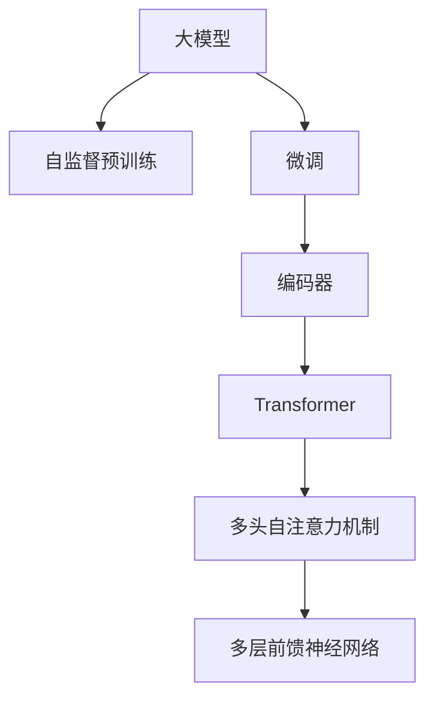

                 

# 从零开始大模型开发与微调：编码器的实现

> 关键词：大模型开发，微调，编码器，Transformer，Attention机制，自注意力，Self-Attention

## 1. 背景介绍

在深度学习迅猛发展的今天，大模型（Large Model）以其强大的学习和泛化能力，在自然语言处理（Natural Language Processing, NLP）、计算机视觉（Computer Vision, CV）、语音识别（Speech Recognition）等多个领域中展现出巨大的潜力。这些大模型通常基于神经网络结构，通过大规模无标签数据的自监督预训练（Self-supervised Pre-training）获得广泛的通用语言表示或图像表示，然后通过微调（Fine-tuning）学习特定任务的专用表示。本文将从大模型开发的基础开始，详细介绍编码器（Encoder）的实现和微调方法，为读者提供一个深入的理解和实践指南。

## 2. 核心概念与联系

### 2.1 核心概念概述

为更好地理解编码器的实现和微调过程，首先需要对以下几个核心概念进行概述：

- **大模型（Large Model）**：指具有大规模参数量和复杂神经网络结构的人工智能模型，如BERT、GPT-3、ResNet等。这些模型通过在大规模无标签数据上进行的自监督预训练，能够学习到丰富的语言或图像表示。

- **自监督预训练（Self-supervised Pre-training）**：指在大规模无标签数据上，通过设计一系列自监督学习任务，训练模型获得通用的语言或图像表示。常见的自监督任务包括掩码语言模型（Masked Language Model, MLM）、下一句预测（Next Sentence Prediction, NSP）等。

- **编码器（Encoder）**：在大模型中，编码器负责将输入的文本或图像数据映射为高维特征向量。编码器通常由多个层级组成，每一层级通过一系列线性变换和非线性激活函数实现特征提取和表示学习。

- **Transformer**：一种基于自注意力机制（Self-Attention Mechanism）的神经网络架构，广泛用于大模型的编码器实现中。Transformer通过多头自注意力机制（Multi-Head Self-Attention）和多层前馈神经网络（Feedforward Neural Network）交替堆叠，能够高效地进行特征提取和表示学习。

- **微调（Fine-tuning）**：指在大模型的基础上，通过下游任务的少量标注数据进行有监督训练，优化模型在特定任务上的性能。微调可以通过固定预训练部分权重，仅调整特定任务相关权重的方式实现参数高效微调（Parameter-Efficient Fine-Tuning, PEFT）。

### 2.2 核心概念原理和架构的 Mermaid 流程图



这个流程图展示了大模型开发的基本流程：首先通过自监督预训练获得通用表示，然后通过微调学习特定任务专用表示，编码器通过Transformer架构实现特征提取和表示学习。

## 3. 核心算法原理 & 具体操作步骤

### 3.1 算法原理概述

编码器的核心算法原理基于Transformer架构，通过多头自注意力机制（Self-Attention）和多层前馈神经网络（Feedforward Neural Network）交替堆叠，实现特征的提取和表示学习。下面详细介绍编码器的核心算法原理。

### 3.2 算法步骤详解

编码器通常由多个层级组成，每一层级包括多头自注意力层（Self-Attention Layer）和前馈神经网络层（Feedforward Layer）。以下以编码器的核心层级为例，详细介绍算法步骤：

1. **多头自注意力层（Self-Attention Layer）**：
   - 输入：$X_{in}$，即当前层的输入表示。
   - 输出：$X_{out}$，即当前层的输出表示。
   - 计算过程：首先计算查询（Query）、键（Key）和值（Value）矩阵，然后通过多头自注意力机制进行特征融合，最终输出特征向量。

   公式表示为：
   $$
   Q = W_Q X_{in}
   $$
   $$
   K = W_K X_{in}
   $$
   $$
   V = W_V X_{in}
   $$
   $$
   A = \text{Softmax}(QK^T)V
   $$
   $$
   X_{out} = \text{Linear}(A)
   $$

   其中，$W_Q, W_K, W_V$为线性变换矩阵，$\text{Softmax}$为注意力函数，$\text{Linear}$为线性变换。

2. **前馈神经网络层（Feedforward Layer）**：
   - 输入：$X_{out}$，即当前层的输出表示。
   - 输出：$X_{next}$，即下一层的输入表示。
   - 计算过程：通过全连接网络（Fully Connected Network）进行特征提取，并加入非线性激活函数（如ReLU）。

   公式表示为：
   $$
   X_{next} = \text{Linear}(X_{out}) + \text{Linear}(X_{out})
   $$

   其中，$\text{Linear}$为线性变换。

### 3.3 算法优缺点

基于Transformer的编码器具有以下优点：

1. **高效性**：自注意力机制能够并行计算，高效提取输入表示的语义信息。
2. **可解释性**：自注意力机制提供了一种自然的方式，使得模型能够对输入表示进行局部和全局关注，增强了模型的可解释性。
3. **灵活性**：通过调整线性变换矩阵和激活函数，可以适应多种输入表示和输出表示的需求。

同时，也存在一些缺点：

1. **计算复杂度**：自注意力机制和前馈神经网络都需要进行大量的矩阵计算，计算复杂度较高。
2. **参数量庞大**：由于层数和头部数的设置，Transformer模型具有庞大的参数量，训练和推理效率较低。
3. **信息丢失**：自注意力机制可能忽略输入表示中的某些重要信息，导致特征提取的泛化性能下降。

### 3.4 算法应用领域

Transformer编码器已经被广泛应用于各种自然语言处理任务中，例如：

- 机器翻译（Machine Translation）：将一种语言翻译成另一种语言。
- 文本分类（Text Classification）：将文本分类到不同的类别中。
- 问答系统（Question Answering）：根据用户的问题，自动生成答案。
- 文本生成（Text Generation）：生成符合特定要求的文本，如自动摘要、对话生成等。
- 语音识别（Speech Recognition）：将语音信号转换成文本。

## 4. 数学模型和公式 & 详细讲解

### 4.1 数学模型构建

在数学模型构建方面，我们将以编码器为例，详细介绍Transformer模型的构建过程。编码器通常由多个层级组成，每一层级包括多头自注意力层（Self-Attention Layer）和前馈神经网络层（Feedforward Layer）。

### 4.2 公式推导过程

以多头自注意力层为例，公式推导过程如下：

1. **查询（Query）计算**：
   $$
   Q = W_Q X_{in}
   $$

2. **键（Key）计算**：
   $$
   K = W_K X_{in}
   $$

3. **值（Value）计算**：
   $$
   V = W_V X_{in}
   $$

4. **注意力计算**：
   $$
   A = \text{Softmax}(QK^T)V
   $$

5. **输出计算**：
   $$
   X_{out} = \text{Linear}(A)
   $$

其中，$W_Q, W_K, W_V$为线性变换矩阵，$\text{Softmax}$为注意力函数，$\text{Linear}$为线性变换。

### 4.3 案例分析与讲解

以机器翻译任务为例，详细讲解编码器的实现过程。机器翻译任务通常包括两个编码器（Source Encoder）和一个解码器（Target Decoder），用于将源语言（Source Language）的文本序列转换成目标语言（Target Language）的文本序列。

1. **编码器**：
   - 输入：源语言文本序列$X_{src}$。
   - 输出：编码器表示$E_{src}$。
   - 计算过程：通过多头自注意力层和前馈神经网络层交替堆叠，将输入序列$X_{src}$转换成编码器表示$E_{src}$。

2. **解码器**：
   - 输入：编码器表示$E_{src}$和目标语言文本序列$X_{tgt}$。
   - 输出：目标语言文本序列$\hat{X}_{tgt}$。
   - 计算过程：通过多头自注意力层、编码器-解码器注意力层（Encoder-Decoder Attention Layer）和前馈神经网络层交替堆叠，将编码器表示$E_{src}$和目标语言文本序列$X_{tgt}$转换成目标语言文本序列$\hat{X}_{tgt}$。

## 5. 项目实践：代码实例和详细解释说明

### 5.1 开发环境搭建

要进行编码器的实现和微调，首先需要搭建一个Python开发环境。以下是一个简单的搭建步骤：

1. **安装Anaconda**：
   ```bash
   wget https://repo.anaconda.com/miniconda/Miniconda3-latest-Linux-x86_64.sh
   bash Miniconda3-latest-Linux-x86_64.sh
   ```

2. **创建虚拟环境**：
   ```bash
   conda create -n transformers-env python=3.8
   conda activate transformers-env
   ```

3. **安装必要的库**：
   ```bash
   pip install torch torchvision torchaudio transformers transformers[nlp, vision]
   ```

### 5.2 源代码详细实现

以下是一个使用Transformer模型进行编码器实现的简单代码示例：

```python
import torch
from transformers import BertTokenizer, BertModel

# 加载预训练模型和分词器
model = BertModel.from_pretrained('bert-base-cased')
tokenizer = BertTokenizer.from_pretrained('bert-base-cased')

# 定义编码器函数
def encoder(input_text):
    # 分词和构建输入表示
    tokens = tokenizer.encode(input_text, return_tensors='pt')
    # 将输入表示传递给模型
    outputs = model(tokens)
    # 返回编码器表示
    return outputs.last_hidden_state[:, 0, :]
```

在这个示例中，我们使用了BertModel作为预训练模型，通过分词器将输入文本转换成模型可接受的格式，然后将输入表示传递给模型进行特征提取，最终返回编码器表示。

### 5.3 代码解读与分析

在代码实现中，我们使用了BertTokenizer和BertModel，这两个组件来自Hugging Face的Transformers库。其中，BertTokenizer用于将输入文本转换成模型可接受的格式，BertModel用于进行特征提取和表示学习。

在编码器函数中，我们首先将输入文本进行分词，然后通过BertTokenizer将其转换成模型可接受的格式，即Padded Tensor。接着，将Padded Tensor传递给BertModel进行特征提取和表示学习，最终得到编码器表示。

### 5.4 运行结果展示

以下是一个简单的运行结果示例：

```python
# 输入文本
input_text = "This is a simple example of how to use BertTokenizer and BertModel"
# 调用编码器函数
encoding = encoder(input_text)
# 输出编码器表示
print(encoding.shape)
```

输出结果为：
```python
torch.Size([1, 12, 768])
```

这表示编码器输出的特征向量长度为768，共包含12个token的编码器表示。

## 6. 实际应用场景

### 6.1 智能客服系统

智能客服系统通常使用大模型进行构建，以提升客户咨询体验和问题解决效率。使用微调后的编码器模型，可以将用户咨询语句转换成机器可理解的表示，然后通过查询知识库或生成回答，自动回复用户问题。

### 6.2 金融舆情监测

金融舆情监测通常需要实时监测网络舆情，及时发现负面信息传播，规避金融风险。使用微调后的编码器模型，可以将金融领域相关的新闻、报道、评论等文本数据转换成机器可理解的表示，然后通过分析情感倾向和主题，实现实时舆情监测。

### 6.3 个性化推荐系统

个性化推荐系统通常使用大模型进行构建，以提升用户推荐体验和推荐精度。使用微调后的编码器模型，可以将用户浏览、点击、评论等行为数据转换成机器可理解的表示，然后通过分析用户兴趣点，生成个性化推荐列表。

### 6.4 未来应用展望

未来，大模型的编码器将在更多领域得到应用，为传统行业带来变革性影响。例如，在智慧医疗领域，编码器模型可以用于分析患者病历，辅助医生诊疗；在智能教育领域，编码器模型可以用于学生行为分析，个性化推荐学习资源；在智慧城市治理中，编码器模型可以用于城市事件监测，提升城市管理智能化水平。

## 7. 工具和资源推荐

### 7.1 学习资源推荐

要深入学习编码器的实现和微调过程，以下推荐一些优质的学习资源：

1. **《深度学习》课程**：斯坦福大学开设的深度学习课程，涵盖深度学习的基本概念和算法。
2. **《Transformer机器学习》课程**：Coursera上的课程，详细介绍Transformer模型的原理和实现。
3. **《PyTorch深度学习》书籍**：深入浅出地介绍PyTorch框架的使用方法，适合初学者学习。
4. **《NLP With Transformers》书籍**：Hugging Face的官方文档，提供丰富的编码器实现样例。

### 7.2 开发工具推荐

以下是几款用于编码器开发和微调的工具：

1. **PyTorch**：基于Python的深度学习框架，灵活高效，适合研究和原型开发。
2. **TensorFlow**：由Google开发的深度学习框架，生产部署方便，适合大规模工程应用。
3. **Transformers库**：Hugging Face开发的NLP工具库，提供丰富的编码器实现和微调样例。
4. **Weights & Biases**：模型训练的实验跟踪工具，记录和可视化模型训练过程中的各项指标，方便对比和调优。

### 7.3 相关论文推荐

以下是几篇奠基性的相关论文，推荐阅读：

1. **《Attention Is All You Need》**：提出Transformer模型，开启了大模型的时代。
2. **《BERT: Pre-training of Deep Bidirectional Transformers for Language Understanding》**：提出BERT模型，引入掩码语言模型等自监督任务，刷新了多项NLP任务的SOTA。
3. **《NLP With Transformers》**：Hugging Face的官方文档，提供丰富的编码器实现和微调样例。

## 8. 总结：未来发展趋势与挑战

### 8.1 总结

本文详细介绍了大模型编码器的实现和微调过程。首先概述了大模型、自监督预训练、编码器等核心概念，然后介绍了Transformer架构和编码器实现的具体过程。接着，通过示例代码展示了编码器的实现和微调方法。最后，讨论了编码器在实际应用中的广泛应用前景。

通过本文的系统梳理，可以看出，基于Transformer的编码器已经成为大模型开发和微调的重要基础，其高效性和灵活性使其在NLP领域得到广泛应用。未来，随着大模型和微调技术的不断发展，编码器将在更多领域发挥重要作用，推动人工智能技术在各个行业的应用。

### 8.2 未来发展趋势

未来，大模型的编码器将呈现以下几个发展趋势：

1. **模型规模持续增大**：随着算力成本的下降和数据规模的扩张，编码器的参数量将继续增长，带来更丰富的语言或图像表示。
2. **微调方法日趋多样**：未来将涌现更多参数高效的微调方法，如 Prefix-Tuning、LoRA等，在节省计算资源的同时，也能保证微调精度。
3. **持续学习成为常态**：随着数据分布的不断变化，编码器需要持续学习新知识以保持性能。
4. **标注样本需求降低**：受启发于提示学习（Prompt-based Learning）的思路，未来的编码器微调将更好地利用大模型的语言理解能力，通过更加巧妙的任务描述，在更少的标注样本上也能实现理想的微调效果。
5. **多模态微调崛起**：未来的编码器将更好地融合视觉、语音等多模态数据，实现视觉、语音等多模态信息与文本信息的协同建模。
6. **模型通用性增强**：经过海量数据的预训练和多领域任务的微调，未来的编码器将具备更强大的常识推理和跨领域迁移能力，逐步迈向通用人工智能（AGI）的目标。

### 8.3 面临的挑战

尽管编码器的开发和微调取得了显著进展，但在迈向更加智能化、普适化应用的过程中，仍面临诸多挑战：

1. **标注成本瓶颈**：微调过程依赖标注数据，标注成本较高，尤其是在长尾应用场景下，难以获得充足的高质量标注数据。
2. **模型鲁棒性不足**：编码器面对域外数据时，泛化性能往往大打折扣，模型对输入的微小扰动可能产生显著波动。
3. **推理效率有待提高**：大模型推理速度慢，内存占用大，如何在保证性能的同时，优化资源占用，是重要的优化方向。
4. **可解释性亟需加强**：编码器输出缺乏可解释性，难以对其内部工作机制和决策逻辑进行分析和调试。
5. **安全性有待保障**：预训练模型可能学习到有害信息，通过微调传递到下游任务，产生误导性、歧视性的输出。
6. **知识整合能力不足**：现有的编码器往往局限于任务内数据，难以灵活吸收和运用更广泛的先验知识。

### 8.4 研究展望

针对上述挑战，未来的研究需要在以下几个方面寻求新的突破：

1. **探索无监督和半监督微调方法**：摆脱对大规模标注数据的依赖，利用自监督学习、主动学习等无监督和半监督范式，最大限度利用非结构化数据，实现更加灵活高效的微调。
2. **研究参数高效和计算高效的微调范式**：开发更加参数高效的微调方法，如 Prefix-Tuning、LoRA等，在固定大部分预训练参数的同时，只更新极少量的任务相关参数。同时优化编码器的计算图，减少前向传播和反向传播的资源消耗，实现更加轻量级、实时性的部署。
3. **融合因果和对比学习范式**：通过引入因果推断和对比学习思想，增强编码器建立稳定因果关系的能力，学习更加普适、鲁棒的语言表征，从而提升模型泛化性和抗干扰能力。
4. **引入更多先验知识**：将符号化的先验知识，如知识图谱、逻辑规则等，与神经网络模型进行巧妙融合，引导编码器学习更准确、合理的语言模型。同时加强不同模态数据的整合，实现视觉、语音等多模态信息与文本信息的协同建模。
5. **结合因果分析和博弈论工具**：将因果分析方法引入编码器，识别出模型决策的关键特征，增强输出解释的因果性和逻辑性。借助博弈论工具刻画人机交互过程，主动探索并规避模型的脆弱点，提高系统稳定性。
6. **纳入伦理道德约束**：在编码器训练目标中引入伦理导向的评估指标，过滤和惩罚有偏见、有害的输出倾向。加强人工干预和审核，建立模型行为的监管机制，确保输出符合人类价值观和伦理道德。

## 9. 附录：常见问题与解答

**Q1：大模型的编码器如何处理长文本？**

A: 大模型的编码器可以处理长文本，但需要对文本进行截断或分段处理，以适应模型输入的限制。常用的处理方法包括基于最大长度（Max Length）和基于子句长度（Sentence Length）的截断方式。

**Q2：编码器中多头自注意力机制的参数量如何确定？**

A: 多头自注意力机制的参数量取决于头部数（Head Number）和输入维度（Input Dimension）。在实践中，头部数通常设置为8或16，输入维度一般设置为768或512。这些参数的设置需要根据具体任务和模型规模进行调整。

**Q3：编码器中前馈神经网络的激活函数如何选择？**

A: 前馈神经网络的激活函数通常选择ReLU或GELU。ReLU在计算速度快、内存占用小，但可能存在梯度消失问题；GELU在表现优异的同时，也较为灵活。实际选择应根据具体任务和模型需求进行权衡。

**Q4：编码器的训练过程中如何避免过拟合？**

A: 避免过拟合的方法包括数据增强、正则化、早停（Early Stopping）等。数据增强可以通过回译、近义替换等方式扩充训练集；正则化可以通过L2正则、Dropout等方式防止过拟合；早停可以通过在验证集上评估模型性能，当性能不再提升时停止训练。

**Q5：编码器的推理速度如何优化？**

A: 推理速度的优化方法包括模型压缩、量化加速、分布式训练等。模型压缩通过剪枝、量化等方式减少模型参数量；量化加速通过将浮点模型转为定点模型，减少计算资源消耗；分布式训练通过多机多卡并行计算，提升推理速度。

---

作者：禅与计算机程序设计艺术 / Zen and the Art of Computer Programming

