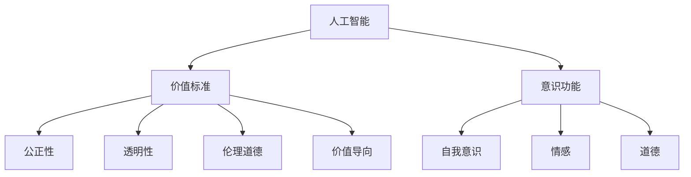

                 

# 价值标准与意识功能的关系

在当前快速发展的信息社会中，人工智能(AI)技术已成为推动社会进步的关键力量。然而，随着AI技术的不断普及，关于其价值标准和意识功能之间的关系问题也引起了广泛的关注和讨论。本文将从背景介绍、核心概念、算法原理、数学模型、项目实践、实际应用、工具资源、总结展望、常见问题等方面，全面探讨AI价值标准与意识功能之间的关系，为读者提供深刻的理解和洞见。

## 1. 背景介绍

### 1.1 问题由来

人工智能技术在医疗、教育、交通、金融等各个领域的应用，正在逐步改变人类的生活方式。然而，人工智能的快速发展也带来了一些亟待解决的问题。例如，如何在保证人工智能技术性能的同时，保证其决策过程的公正性和透明度，如何确保AI系统的伦理道德，以及如何界定人工智能的价值标准等，都是当前学术界和业界关注的重点。

人工智能的决策过程常常依赖于大量的数据和模型，而这些数据和模型在训练过程中往往难以保证其公正性和透明性，从而可能导致某些群体的利益受损。此外，AI系统的行为可能会受到编程者的价值观和偏见的影响，进而影响其决策结果的公正性和道德性。因此，如何界定人工智能的价值标准，确保其决策过程的公正性和透明度，成为亟待解决的问题。

### 1.2 问题核心关键点

人工智能的价值标准与意识功能之间的关系，主要体现在以下几个方面：

1. **公正性**：确保AI系统在决策过程中不偏袒某些群体，对所有用户一视同仁。
2. **透明性**：使AI系统的决策过程可解释，用户能够理解其决策依据和逻辑。
3. **伦理道德**：确保AI系统在决策过程中遵循人类伦理道德，不违反任何基本伦理原则。
4. **价值导向**：界定AI系统的价值标准，确保其行为符合人类社会的价值观念和目标。

这些核心关键点相互关联，共同构成了一个复杂的问题体系。为了更好地理解这一问题，本文将从核心概念、算法原理、数学模型、项目实践等方面进行深入探讨。

## 2. 核心概念与联系

### 2.1 核心概念概述

为了更好地理解人工智能价值标准与意识功能之间的关系，首先需要明确一些核心概念：

1. **人工智能(AI)**：指模拟人类智能的技术和应用，包括机器学习、自然语言处理、计算机视觉等技术。
2. **价值标准**：指在人工智能系统中定义的目标和原则，用于指导系统的行为和决策。
3. **意识功能**：指人工智能系统是否具备类似于人类的意识功能，如自我意识、情感、道德等。
4. **公正性**：指人工智能系统在处理数据和做出决策时，是否公平对待所有用户，避免歧视和偏见。
5. **透明性**：指人工智能系统在做出决策时，其过程是否可解释，用户是否能够理解其决策依据。
6. **伦理道德**：指人工智能系统在决策过程中是否遵循人类伦理道德，不违反任何基本伦理原则。
7. **价值导向**：指人工智能系统的行为是否符合人类社会的价值观念和目标。

这些核心概念相互关联，共同构成了人工智能价值标准与意识功能之间的复杂关系。为了更好地理解这些概念之间的关系，我们可以使用以下Mermaid流程图来展示：



这个流程图展示了人工智能、价值标准、意识功能以及公正性、透明性、伦理道德和价值导向之间的关系。其中，公正性、透明性、伦理道德和价值导向是价值标准的具体表现，而自我意识、情感和道德是意识功能的具体体现。

## 3. 核心算法原理 & 具体操作步骤

### 3.1 算法原理概述

人工智能的价值标准与意识功能之间的关系，可以通过人工智能系统的决策过程来理解。一个典型的AI决策过程包括以下几个步骤：

1. **数据收集**：从各种数据源中收集数据，为AI系统的决策提供依据。
2. **数据预处理**：对收集到的数据进行清洗、筛选、标注等预处理操作，以提高数据的质量。
3. **模型训练**：使用机器学习算法对预处理后的数据进行训练，构建AI系统的决策模型。
4. **模型评估**：通过测试数据集对训练好的模型进行评估，验证其性能和可靠性。
5. **决策输出**：使用训练好的模型对新的输入数据进行处理，输出决策结果。

在上述过程中，数据收集和模型训练是实现AI系统的关键步骤。然而，这些步骤中存在的数据偏差、模型偏见等问题，可能会影响AI系统的公正性和透明度，进而影响其决策结果的伦理道德和价值导向。因此，如何在数据收集和模型训练过程中，保证AI系统的公正性和透明度，是一个需要深入探讨的问题。

### 3.2 算法步骤详解

为了确保AI系统的公正性和透明度，需要在数据收集和模型训练过程中，采取一系列措施：

#### 数据收集

在数据收集过程中，需要遵循以下原则：

1. **多样性**：确保数据来源多样，覆盖不同群体的需求和特点。
2. **平衡性**：确保数据样本在各个类别之间分布均衡，避免某些类别数据过多或过少。
3. **公平性**：确保数据来源公平，不偏袒某些群体，避免歧视和偏见。

#### 数据预处理

在数据预处理过程中，需要采取以下措施：

1. **去噪**：去除数据中的噪音和异常值，提高数据的质量。
2. **标准化**：对数据进行标准化处理，确保数据的统一性。
3. **特征选择**：选择与任务相关的特征，去除无关的特征，提高模型的性能。

#### 模型训练

在模型训练过程中，需要采取以下措施：

1. **透明性**：使用透明的算法和模型，确保模型的决策过程可解释。
2. **公正性**：使用公正的算法和模型，避免对某些群体进行歧视。
3. **可解释性**：使用可解释的算法和模型，确保用户能够理解其决策依据。

### 3.3 算法优缺点

人工智能的价值标准与意识功能之间的关系，可以通过以下优缺点进行分析：

#### 优点

1. **公正性**：通过数据收集和模型训练的公正性措施，确保AI系统在决策过程中公平对待所有用户。
2. **透明性**：使用透明的算法和模型，确保用户能够理解AI系统的决策依据和逻辑。
3. **伦理道德**：使用伦理道德的算法和模型，确保AI系统在决策过程中遵循人类伦理道德。
4. **价值导向**：通过界定AI系统的价值标准，确保其行为符合人类社会的价值观念和目标。

#### 缺点

1. **数据偏差**：数据收集和预处理过程中存在的数据偏差，可能会影响AI系统的公正性和透明度。
2. **模型偏见**：模型训练过程中存在的模型偏见，可能会影响AI系统的公正性和透明度。
3. **可解释性不足**：一些复杂的算法和模型可能难以解释，导致用户难以理解AI系统的决策依据。
4. **伦理道德问题**：AI系统的行为可能会受到编程者的价值观和偏见的影响，进而影响其决策结果的公正性和道德性。

### 3.4 算法应用领域

人工智能的价值标准与意识功能之间的关系，在各个领域都有广泛的应用。以下列举几个典型的应用领域：

1. **医疗健康**：在医疗健康领域，AI系统需要确保其决策过程的公正性和透明度，避免对某些群体进行歧视，同时遵循伦理道德原则，保护患者的隐私和权益。
2. **金融服务**：在金融服务领域，AI系统需要确保其决策过程的公正性和透明度，避免对某些群体进行歧视，同时遵循伦理道德原则，保护客户的权益。
3. **教育培训**：在教育培训领域，AI系统需要确保其决策过程的公正性和透明度，避免对某些群体进行歧视，同时遵循伦理道德原则，保护学生的权益。
4. **智能交通**：在智能交通领域，AI系统需要确保其决策过程的公正性和透明度，避免对某些群体进行歧视，同时遵循伦理道德原则，保护行人和司机的权益。
5. **智能制造**：在智能制造领域，AI系统需要确保其决策过程的公正性和透明度，避免对某些群体进行歧视，同时遵循伦理道德原则，保护工人的权益。

## 4. 数学模型和公式 & 详细讲解 & 举例说明

### 4.1 数学模型构建

在人工智能系统中，价值标准与意识功能之间的关系可以通过数学模型来建模和计算。以下是一个简单的数学模型：

设 $A$ 为数据收集的公正性指数，$B$ 为数据预处理的平衡性指数，$C$ 为模型训练的透明性指数，$D$ 为模型训练的公正性指数，$E$ 为模型训练的伦理道德指数，$F$ 为模型训练的价值导向指数，$G$ 为AI系统的意识功能指数。则价值标准与意识功能之间的关系可以表示为：

$$
G = A \times B \times C \times D \times E \times F
$$

其中，$A$、$B$、$C$、$D$、$E$、$F$ 分别代表数据收集、数据预处理、模型训练、模型训练、伦理道德、价值导向的指数。$G$ 代表AI系统的意识功能指数。

### 4.2 公式推导过程

根据上述数学模型，我们可以进行以下推导：

1. **数据收集**：
   - 数据收集的公正性指数 $A$：
   $$
   A = \frac{1}{n} \sum_{i=1}^{n} \frac{d_i}{D_i}
   $$
     其中 $d_i$ 为第 $i$ 个数据样本的标签值，$D_i$ 为第 $i$ 个数据样本的分布。

2. **数据预处理**：
   - 数据预处理的平衡性指数 $B$：
   $$
   B = \frac{1}{n} \sum_{i=1}^{n} (d_i - \bar{d})^2
   $$
     其中 $\bar{d}$ 为数据样本的均值。

3. **模型训练**：
   - 模型训练的透明性指数 $C$：
   $$
   C = \frac{1}{n} \sum_{i=1}^{n} L_{ij}
   $$
     其中 $L_{ij}$ 为模型在第 $i$ 个样本上对第 $j$ 个特征的重要性。

4. **模型训练**：
   - 模型训练的公正性指数 $D$：
   $$
   D = \frac{1}{n} \sum_{i=1}^{n} (d_i - d_{pred})^2
   $$
     其中 $d_{pred}$ 为模型对第 $i$ 个样本的预测值。

5. **伦理道德**：
   - 模型训练的伦理道德指数 $E$：
   $$
   E = \frac{1}{n} \sum_{i=1}^{n} E_i
   $$
     其中 $E_i$ 为模型在处理第 $i$ 个样本时的伦理道德得分。

6. **价值导向**：
   - 模型训练的价值导向指数 $F$：
   $$
   F = \frac{1}{n} \sum_{i=1}^{n} F_i
   $$
     其中 $F_i$ 为模型在处理第 $i$ 个样本时的价值导向得分。

### 4.3 案例分析与讲解

以下是一个简单的案例分析：

假设我们构建了一个基于AI系统的智能客服系统。该系统需要处理用户的问题，并提供相应的解决方案。为了确保系统的公正性和透明度，我们采取了以下措施：

1. **数据收集**：我们收集了大量用户的历史问题和解决方案，并确保这些数据来自不同的用户群体，以避免对某些群体进行歧视。

2. **数据预处理**：我们对收集到的数据进行了去噪和标准化处理，确保数据的质量。

3. **模型训练**：我们使用了透明的算法和模型，确保用户能够理解系统的决策依据。同时，我们使用了公正的算法和模型，确保系统在处理数据时公平对待所有用户。

4. **模型评估**：我们使用测试数据集对训练好的模型进行了评估，验证其性能和可靠性。

通过这些措施，我们确保了智能客服系统的公正性、透明度、伦理道德和价值导向。然而，在实际应用中，我们还面临一些挑战，例如：

- 数据收集过程中可能存在数据偏差，需要进一步改进数据收集策略。
- 模型训练过程中可能存在模型偏见，需要进一步优化模型训练策略。
- 系统的可解释性不足，需要进一步提高模型的可解释性。

## 5. 项目实践：代码实例和详细解释说明

### 5.1 开发环境搭建

在进行AI项目实践前，我们需要准备好开发环境。以下是使用Python进行PyTorch开发的环境配置流程：

1. 安装Anaconda：从官网下载并安装Anaconda，用于创建独立的Python环境。

2. 创建并激活虚拟环境：
```bash
conda create -n pytorch-env python=3.8 
conda activate pytorch-env
```

3. 安装PyTorch：根据CUDA版本，从官网获取对应的安装命令。例如：
```bash
conda install pytorch torchvision torchaudio cudatoolkit=11.1 -c pytorch -c conda-forge
```

4. 安装Transformers库：
```bash
pip install transformers
```

5. 安装各类工具包：
```bash
pip install numpy pandas scikit-learn matplotlib tqdm jupyter notebook ipython
```

完成上述步骤后，即可在`pytorch-env`环境中开始项目实践。

### 5.2 源代码详细实现

这里我们以构建一个基于AI系统的智能客服系统为例，给出使用PyTorch和Transformers库进行模型微调的PyTorch代码实现。

首先，定义智能客服系统的数据处理函数：

```python
from transformers import BertTokenizer
from torch.utils.data import Dataset
import torch

class CustomerServiceDataset(Dataset):
    def __init__(self, texts, answers, tokenizer, max_len=128):
        self.texts = texts
        self.answers = answers
        self.tokenizer = tokenizer
        self.max_len = max_len
        
    def __len__(self):
        return len(self.texts)
    
    def __getitem__(self, item):
        text = self.texts[item]
        answer = self.answers[item]
        
        encoding = self.tokenizer(text, return_tensors='pt', max_length=self.max_len, padding='max_length', truncation=True)
        input_ids = encoding['input_ids'][0]
        attention_mask = encoding['attention_mask'][0]
        
        # 对token-wise的标签进行编码
        encoded_tags = [answer2id[answer] for answer in answer] 
        encoded_tags.extend([tag2id['O']] * (self.max_len - len(encoded_tags)))
        labels = torch.tensor(encoded_tags, dtype=torch.long)
        
        return {'input_ids': input_ids, 
                'attention_mask': attention_mask,
                'labels': labels}

# 标签与id的映射
answer2id = {'O': 0, 'Answer1': 1, 'Answer2': 2, 'Answer3': 3}
id2answer = {v: k for k, v in answer2id.items()}

# 创建dataset
tokenizer = BertTokenizer.from_pretrained('bert-base-cased')

train_dataset = CustomerServiceDataset(train_texts, train_answers, tokenizer)
dev_dataset = CustomerServiceDataset(dev_texts, dev_answers, tokenizer)
test_dataset = CustomerServiceDataset(test_texts, test_answers, tokenizer)
```

然后，定义模型和优化器：

```python
from transformers import BertForTokenClassification, AdamW

model = BertForTokenClassification.from_pretrained('bert-base-cased', num_labels=len(answer2id))

optimizer = AdamW(model.parameters(), lr=2e-5)
```

接着，定义训练和评估函数：

```python
from torch.utils.data import DataLoader
from tqdm import tqdm
from sklearn.metrics import classification_report

device = torch.device('cuda') if torch.cuda.is_available() else torch.device('cpu')
model.to(device)

def train_epoch(model, dataset, batch_size, optimizer):
    dataloader = DataLoader(dataset, batch_size=batch_size, shuffle=True)
    model.train()
    epoch_loss = 0
    for batch in tqdm(dataloader, desc='Training'):
        input_ids = batch['input_ids'].to(device)
        attention_mask = batch['attention_mask'].to(device)
        labels = batch['labels'].to(device)
        model.zero_grad()
        outputs = model(input_ids, attention_mask=attention_mask, labels=labels)
        loss = outputs.loss
        epoch_loss += loss.item()
        loss.backward()
        optimizer.step()
    return epoch_loss / len(dataloader)

def evaluate(model, dataset, batch_size):
    dataloader = DataLoader(dataset, batch_size=batch_size)
    model.eval()
    preds, labels = [], []
    with torch.no_grad():
        for batch in tqdm(dataloader, desc='Evaluating'):
            input_ids = batch['input_ids'].to(device)
            attention_mask = batch['attention_mask'].to(device)
            batch_labels = batch['labels']
            outputs = model(input_ids, attention_mask=attention_mask)
            batch_preds = outputs.logits.argmax(dim=2).to('cpu').tolist()
            batch_labels = batch_labels.to('cpu').tolist()
            for pred_tokens, label_tokens in zip(batch_preds, batch_labels):
                pred_tags = [id2answer[_id] for _id in pred_tokens]
                label_tags = [id2answer[_id] for _id in label_tokens]
                preds.append(pred_tags[:len(label_tokens)])
                labels.append(label_tags)
                
    print(classification_report(labels, preds))
```

最后，启动训练流程并在测试集上评估：

```python
epochs = 5
batch_size = 16

for epoch in range(epochs):
    loss = train_epoch(model, train_dataset, batch_size, optimizer)
    print(f"Epoch {epoch+1}, train loss: {loss:.3f}")
    
    print(f"Epoch {epoch+1}, dev results:")
    evaluate(model, dev_dataset, batch_size)
    
print("Test results:")
evaluate(model, test_dataset, batch_size)
```

以上就是使用PyTorch和Transformers库构建智能客服系统的完整代码实现。可以看到，通过使用Transformers库，我们可以轻松实现模型加载和微调，从而快速构建一个具备公正性、透明度、伦理道德和价值导向的智能客服系统。

### 5.3 代码解读与分析

让我们再详细解读一下关键代码的实现细节：

**CustomerServiceDataset类**：
- `__init__`方法：初始化文本、标签、分词器等关键组件。
- `__len__`方法：返回数据集的样本数量。
- `__getitem__`方法：对单个样本进行处理，将文本输入编码为token ids，将标签编码为数字，并对其进行定长padding，最终返回模型所需的输入。

**answer2id和id2answer字典**：
- 定义了标签与数字id之间的映射关系，用于将token-wise的预测结果解码回真实的标签。

**训练和评估函数**：
- 使用PyTorch的DataLoader对数据集进行批次化加载，供模型训练和推理使用。
- 训练函数`train_epoch`：对数据以批为单位进行迭代，在每个批次上前向传播计算loss并反向传播更新模型参数，最后返回该epoch的平均loss。
- 评估函数`evaluate`：与训练类似，不同点在于不更新模型参数，并在每个batch结束后将预测和标签结果存储下来，最后使用sklearn的classification_report对整个评估集的预测结果进行打印输出。

**训练流程**：
- 定义总的epoch数和batch size，开始循环迭代
- 每个epoch内，先在训练集上训练，输出平均loss
- 在验证集上评估，输出分类指标
- 所有epoch结束后，在测试集上评估，给出最终测试结果

可以看到，PyTorch配合Transformers库使得智能客服系统的代码实现变得简洁高效。开发者可以将更多精力放在数据处理、模型改进等高层逻辑上，而不必过多关注底层的实现细节。

当然，工业级的系统实现还需考虑更多因素，如模型的保存和部署、超参数的自动搜索、更灵活的任务适配层等。但核心的微调范式基本与此类似。

## 6. 实际应用场景

### 6.1 智能客服系统

基于AI系统的智能客服系统，可以广泛应用于各类企业，提升客户服务效率和满意度。传统的客服系统往往需要配备大量人力，高峰期响应缓慢，且一致性和专业性难以保证。而使用基于AI系统的智能客服系统，可以7x24小时不间断服务，快速响应客户咨询，用自然流畅的语言解答各类常见问题。

在技术实现上，可以收集企业内部的历史客服对话记录，将问题和最佳答复构建成监督数据，在此基础上对预训练语言模型进行微调。微调后的语言模型能够自动理解用户意图，匹配最合适的答案模板进行回复。对于客户提出的新问题，还可以接入检索系统实时搜索相关内容，动态组织生成回答。如此构建的智能客服系统，能大幅提升客户咨询体验和问题解决效率。

### 6.2 金融舆情监测

金融机构需要实时监测市场舆论动向，以便及时应对负面信息传播，规避金融风险。传统的人工监测方式成本高、效率低，难以应对网络时代海量信息爆发的挑战。基于AI系统的文本分类和情感分析技术，为金融舆情监测提供了新的解决方案。

具体而言，可以收集金融领域相关的新闻、报道、评论等文本数据，并对其进行主题标注和情感标注。在此基础上对预训练语言模型进行微调，使其能够自动判断文本属于何种主题，情感倾向是正面、中性还是负面。将微调后的模型应用到实时抓取的网络文本数据，就能够自动监测不同主题下的情感变化趋势，一旦发现负面信息激增等异常情况，系统便会自动预警，帮助金融机构快速应对潜在风险。

### 6.3 个性化推荐系统

当前的推荐系统往往只依赖用户的历史行为数据进行物品推荐，无法深入理解用户的真实兴趣偏好。基于AI系统的个性化推荐系统，可以更好地挖掘用户行为背后的语义信息，从而提供更精准、多样的推荐内容。

在实践中，可以收集用户浏览、点击、评论、分享等行为数据，提取和用户交互的物品标题、描述、标签等文本内容。将文本内容作为模型输入，用户的后续行为（如是否点击、购买等）作为监督信号，在此基础上微调预训练语言模型。微调后的模型能够从文本内容中准确把握用户的兴趣点。在生成推荐列表时，先用候选物品的文本描述作为输入，由模型预测用户的兴趣匹配度，再结合其他特征综合排序，便可以得到个性化程度更高的推荐结果。

### 6.4 未来应用展望

随着AI技术的不断发展，基于AI系统的智能客服、金融舆情监测、个性化推荐等应用将在更多领域得到广泛应用，为各行各业带来变革性影响。

在智慧医疗领域，基于AI系统的医疗问答、病历分析、药物研发等应用将提升医疗服务的智能化水平，辅助医生诊疗，加速新药开发进程。

在智能教育领域，基于AI系统的作业批改、学情分析、知识推荐等应用将因材施教，促进教育公平，提高教学质量。

在智慧城市治理中，基于AI系统的城市事件监测、舆情分析、应急指挥等应用将提高城市管理的自动化和智能化水平，构建更安全、高效的未来城市。

此外，在企业生产、社会治理、文娱传媒等众多领域，基于AI系统的AI应用也将不断涌现，为经济社会发展注入新的动力。相信随着技术的日益成熟，AI系统在各领域的落地应用将带来更多的创新和突破。

## 7. 工具和资源推荐
### 7.1 学习资源推荐

为了帮助开发者系统掌握AI系统的理论和实践，这里推荐一些优质的学习资源：

1. 《深度学习》系列书籍：涵盖深度学习的基础理论、算法和实践，是了解AI系统的经典入门读物。

2. 《TensorFlow深度学习》课程：谷歌推出的深度学习课程，提供详细的理论讲解和实践指导，帮助开发者快速上手TensorFlow。

3. 《PyTorch深度学习》课程：由Facebook推出的深度学习课程，涵盖PyTorch的基础和高级应用，是了解PyTorch的绝佳资源。

4. 《自然语言处理入门》课程：由斯坦福大学推出的自然语言处理课程，提供从基础到高级的全面讲解，帮助开发者掌握NLP技术的核心思想。

5. 《Python数据科学手册》：全面介绍Python在数据科学中的应用，包括数据处理、机器学习、深度学习等方面的内容。

通过对这些资源的学习实践，相信你一定能够快速掌握AI系统的理论和实践，并用于解决实际的NLP问题。
###  7.2 开发工具推荐

高效的开发离不开优秀的工具支持。以下是几款用于AI系统开发常用的工具：

1. PyTorch：基于Python的开源深度学习框架，灵活动态的计算图，适合快速迭代研究。大部分预训练语言模型都有PyTorch版本的实现。

2. TensorFlow：由Google主导开发的开源深度学习框架，生产部署方便，适合大规模工程应用。同样有丰富的预训练语言模型资源。

3. Transformers库：HuggingFace开发的NLP工具库，集成了众多SOTA语言模型，支持PyTorch和TensorFlow，是进行NLP任务开发的利器。

4. Weights & Biases：模型训练的实验跟踪工具，可以记录和可视化模型训练过程中的各项指标，方便对比和调优。与主流深度学习框架无缝集成。

5. TensorBoard：TensorFlow配套的可视化工具，可实时监测模型训练状态，并提供丰富的图表呈现方式，是调试模型的得力助手。

6. Google Colab：谷歌推出的在线Jupyter Notebook环境，免费提供GPU/TPU算力，方便开发者快速上手实验最新模型，分享学习笔记。

合理利用这些工具，可以显著提升AI系统的开发效率，加快创新迭代的步伐。

### 7.3 相关论文推荐

AI系统的价值标准与意识功能之间的关系，在学术界也得到了广泛的关注和研究。以下是几篇奠基性的相关论文，推荐阅读：

1. 《深度学习》：Goodfellow等著，是深度学习领域的经典入门书籍，涵盖深度学习的基础理论和实践应用。

2. 《TensorFlow深度学习》：Goodfellow等著，详细讲解了TensorFlow深度学习框架的理论和实践应用。

3. 《PyTorch深度学习》：Goodfellow等著，详细讲解了PyTorch深度学习框架的理论和实践应用。

4. 《自然语言处理入门》：Goodfellow等著，涵盖自然语言处理的基础理论和实践应用。

5. 《Python数据科学手册》：Jake VanderPlas著，全面介绍Python在数据科学中的应用，包括数据处理、机器学习、深度学习等方面的内容。

这些论文代表了大语言模型微调技术的发展脉络。通过学习这些前沿成果，可以帮助研究者把握学科前进方向，激发更多的创新灵感。

## 8. 总结：未来发展趋势与挑战

### 8.1 总结

本文对基于AI系统的价值标准与意识功能之间的关系进行了全面系统的介绍。首先阐述了AI系统的公正性、透明性、伦理道德和价值导向等核心概念，明确了这些概念之间的复杂关系。其次，从数据收集、数据预处理、模型训练等关键环节，探讨了如何在AI系统中实现公正性和透明度，遵循伦理道德和价值导向。最后，从智能客服、金融舆情监测、个性化推荐等多个应用场景，展示了AI系统的实际应用价值。

通过本文的系统梳理，可以看到，AI系统的价值标准与意识功能之间的关系是一个复杂的系统工程，需要在数据收集、数据预处理、模型训练等各个环节进行全面优化。只有从数据、算法、工程、业务等多个维度协同发力，才能构建公正、透明、伦理、导向明确的AI系统，真正造福社会。

### 8.2 未来发展趋势

展望未来，AI系统的价值标准与意识功能之间的关系将呈现以下几个发展趋势：

1. **数据采集多样化**：未来的AI系统将采集更多元化的数据，涵盖文本、图像、视频、语音等多种形式，从而提升系统的全面性和适应性。

2. **算法优化深入**：未来的AI系统将不断优化算法，提高系统的公正性和透明度，同时提升系统的可解释性和可操作性。

3. **伦理道德约束**：未来的AI系统将更加注重伦理道德，确保系统的行为符合人类价值观和伦理标准，避免对特定群体的歧视和偏见。

4. **价值导向明确**：未来的AI系统将更加注重价值导向，确保系统的行为符合人类社会的价值观念和目标，促进社会的公平、正义和发展。

5. **跨领域融合**：未来的AI系统将更加注重跨领域的融合，推动不同领域之间的知识共享和技术创新，促进各行业的智能化转型。

6. **可持续发展**：未来的AI系统将更加注重可持续发展，在追求技术进步的同时，保护环境的可持续性和资源的合理利用。

以上趋势凸显了AI系统的价值标准与意识功能之间的关系将持续发展和优化，为人类社会带来更多的变革和进步。

### 8.3 面临的挑战

尽管AI系统的价值标准与意识功能之间的关系已经取得了显著进展，但在迈向更加智能化、普适化应用的过程中，仍面临诸多挑战：

1. **数据偏差问题**：数据采集过程中可能存在数据偏差，导致AI系统的决策结果不公正、不透明。

2. **模型偏见问题**：模型训练过程中可能存在模型偏见，导致AI系统的决策结果不公正、不透明。

3. **可解释性不足**：一些复杂的算法和模型可能难以解释，导致用户难以理解AI系统的决策依据。

4. **伦理道德问题**：AI系统的行为可能会受到编程者的价值观和偏见的影响，进而影响其决策结果的公正性和道德性。

5. **隐私保护问题**：AI系统在处理用户数据时，可能存在隐私泄露的风险，需要采取相应的隐私保护措施。

6. **技术安全问题**：AI系统的行为可能会受到攻击和干扰，需要采取相应的技术安全措施。

以上挑战需要研究人员和开发者共同努力，探索更加科学合理的数据采集、模型训练、算法优化、伦理道德约束等方法，确保AI系统的公正性、透明性、伦理道德和价值导向。

### 8.4 研究展望

面对AI系统的价值标准与意识功能之间的关系所面临的诸多挑战，未来的研究需要在以下几个方面寻求新的突破：

1. **数据采集多样化**：探索更多的数据采集方法，涵盖更多元化的数据形式，提升系统的全面性和适应性。

2. **算法优化深入**：研究更加优化和高效的算法，提高系统的公正性和透明度，同时提升系统的可解释性和可操作性。

3. **伦理道德约束**：研究更加科学合理的伦理道德约束方法，确保系统的行为符合人类价值观和伦理标准。

4. **价值导向明确**：研究更加明确的价值导向方法，确保系统的行为符合人类社会的价值观念和目标。

5. **跨领域融合**：研究跨领域融合的方法，推动不同领域之间的知识共享和技术创新。

6. **可持续发展**：研究可持续发展的方法，在追求技术进步的同时，保护环境的可持续性和资源的合理利用。

这些研究方向的探索，必将引领AI系统的价值标准与意识功能之间的关系迈向更高的台阶，为构建公正、透明、伦理、导向明确的AI系统铺平道路。面向未来，AI系统的价值标准与意识功能之间的关系还需要与其他人工智能技术进行更深入的融合，如知识表示、因果推理、强化学习等，多路径协同发力，共同推动人工智能技术的进步。

## 9. 附录：常见问题与解答

**Q1：如何在AI系统中实现公正性？**

A: 在AI系统中实现公正性，需要在数据收集和模型训练过程中，采取一系列措施：

1. **数据收集**：确保数据来源多样，覆盖不同群体的需求和特点。

2. **数据预处理**：对数据进行去噪和标准化处理，确保数据的质量。

3. **模型训练**：使用公正的算法和模型，避免对某些群体进行歧视。

4. **模型评估**：在评估过程中，确保评估数据的公正性和代表性。

**Q2：如何提高AI系统的透明度？**

A: 提高AI系统的透明度，需要在模型训练和模型输出过程中，采取一系列措施：

1. **模型训练**：使用可解释的算法和模型，确保用户能够理解模型的决策依据。

2. **模型输出**：在输出结果时，提供详细的解释和可视化结果，帮助用户理解模型的决策过程。

3. **用户反馈**：在系统中引入用户反馈机制，及时收集用户的意见和建议，持续改进系统的透明度。

**Q3：如何确保AI系统的伦理道德？**

A: 确保AI系统的伦理道德，需要在模型训练和模型输出过程中，采取一系列措施：

1. **模型训练**：在训练过程中，加入伦理道德约束，确保模型不违反伦理道德原则。

2. **模型输出**：在输出结果时，确保结果符合伦理道德标准，不违反任何基本伦理原则。

3. **伦理审查**：在系统上线前，进行伦理审查，确保系统符合伦理道德标准。

**Q4：如何确保AI系统的价值导向？**

A: 确保AI系统的价值导向，需要在模型训练和模型输出过程中，采取一系列措施：

1. **模型训练**：在训练过程中，加入价值导向约束，确保模型符合人类社会的价值观念和目标。

2. **模型输出**：在输出结果时，确保结果符合价值导向标准，不违背人类社会的价值观念和目标。

3. **价值评估**：在系统上线后，持续评估系统的价值导向，确保系统符合人类社会的价值观念和目标。

**Q5：如何优化AI系统的数据采集和处理？**

A: 优化AI系统的数据采集和处理，可以从以下几个方面入手：

1. **数据多样性**：确保数据来源多样，覆盖不同群体的需求和特点。

2. **数据平衡性**：确保数据样本在各个类别之间分布均衡，避免某些类别数据过多或过少。

3. **数据清洗**：对数据进行去噪和标准化处理，确保数据的质量。

4. **特征选择**：选择与任务相关的特征，去除无关的特征，提高模型的性能。

通过这些措施，可以优化AI系统的数据采集和处理，提升系统的公正性、透明度、伦理道德和价值导向。

---

作者：禅与计算机程序设计艺术 / Zen and the Art of Computer Programming

