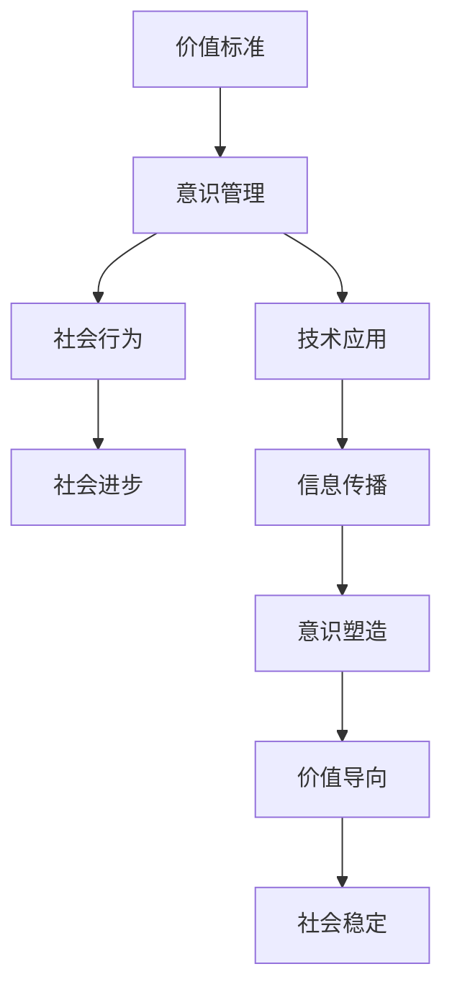

                 

# 价值标准与意识管理的关系

在人类社会的演进过程中，价值标准与意识管理之间的相互作用和影响是一个深层次而复杂的议题。本文将从多个角度深入探讨这两者之间的关系，通过理论分析、案例研究和实践指南，揭示它们之间的内在联系，并为如何在不同场景下有效管理意识和实现价值标准提供见解。

## 1. 背景介绍

### 1.1 问题由来

在数字化时代，信息和技术的飞速发展极大地改变了人们的生活方式和思维模式。一方面，数据的爆炸性增长为社会生产和生活带来了前所未有的便利；另一方面，信息的泛滥和误导可能导致人们价值观念的混淆和偏离。

在这样的背景下，如何通过意识管理来塑造和维护社会的价值标准，成为了一个亟待解决的问题。意识管理不仅是维护社会稳定和和谐的重要手段，也是推动社会进步和文化发展的关键因素。

### 1.2 核心议题

本文将围绕以下几个核心议题展开探讨：

- 价值标准的定义与分类
- 意识管理在价值标准中的作用
- 数字时代价值标准与意识管理的挑战与机遇
- 价值标准与意识管理的未来趋势和展望

通过这些议题的深入分析，本文旨在揭示价值标准与意识管理之间的关系，为有效管理意识和实现价值标准提供指导和建议。

## 2. 核心概念与联系

### 2.1 核心概念概述

- **价值标准（Value Standards）**：是指一个社会或群体共同接受并遵循的行为准则和评价标准。这些标准体现了社会的核心价值观，指导着人们的行为和决策。

- **意识管理（Consciousness Management）**：是指通过各种手段和方法，引导和塑造人们的意识和认知，实现对社会价值标准的维护和提升。

- **数字时代**：指以信息技术为核心的时代，数据和算法成为社会运行的基石，对人类的生产、生活和社会结构产生了深远的影响。

### 2.2 核心概念原理和架构的 Mermaid 流程图



这个流程图展示了价值标准、意识管理、社会行为、社会进步、技术应用、信息传播、意识塑造、价值导向和社会稳定之间的关系。

## 3. 核心算法原理 & 具体操作步骤

### 3.1 算法原理概述

价值标准与意识管理的关系可以用信息流向和社会反馈模型来描述。价值标准的形成和传播是通过信息流向实现的，而意识管理则是通过社会反馈模型来调整和优化的。

**信息流向模型**：
- **输入**：社会事件、文化传统、媒体报道等
- **处理**：算法模型、人类智慧
- **输出**：价值标准、行为规范、决策依据

**社会反馈模型**：
- **输入**：价值标准、行为结果、社会评价
- **处理**：反馈机制、自我调节、集体决策
- **输出**：意识管理、行为调整、价值观更新

### 3.2 算法步骤详解

#### 3.2.1 数据收集与处理

- **收集数据**：通过调查问卷、网络爬虫、社交媒体分析等方式，收集社会事件、文化传统、媒体报道等信息。
- **数据清洗**：对收集到的数据进行去重、去噪、筛选等预处理，确保数据的质量和代表性。

#### 3.2.2 算法模型设计

- **算法选择**：根据任务特点选择合适的算法模型，如机器学习、深度学习、图算法等。
- **模型训练**：使用收集到的数据对模型进行训练，优化模型参数，提高模型准确性。

#### 3.2.3 价值标准形成

- **价值标准提取**：通过算法模型对数据进行处理，提取出反映社会价值观的核心标准。
- **价值标准验证**：对提取出的价值标准进行验证，确保其符合社会主流价值观和公平性原则。

#### 3.2.4 意识管理实施

- **意识引导**：利用算法模型分析社会行为和舆论趋势，提出相应的意识引导策略。
- **社会反馈**：通过社会反馈机制收集公众对意识引导的反馈，进行动态调整。

### 3.3 算法优缺点

#### 3.3.1 优点

- **高效性**：通过算法模型可以快速处理大量数据，提取价值标准和行为规范。
- **客观性**：算法模型能够基于数据进行客观分析，减少主观偏见。
- **可扩展性**：算法模型可以灵活适应不同场景和任务，具有较高的通用性。

#### 3.3.2 缺点

- **复杂性**：算法模型的设计和实现较为复杂，需要专业的技术和资源支持。
- **依赖数据**：算法的准确性依赖于数据的质量和代表性，数据偏差可能导致模型结果偏差。
- **伦理问题**：算法模型的决策过程可能涉及隐私、公平性等伦理问题，需慎重处理。

### 3.4 算法应用领域

价值标准与意识管理的算法在多个领域具有广泛的应用前景，包括：

- **公共政策制定**：利用算法模型分析社会热点事件，为政策制定提供数据支持和决策依据。
- **企业社会责任**：通过意识管理提升企业社会责任感和品牌形象。
- **教育培训**：利用算法模型对学生的行为和表现进行分析和反馈，提升教育质量。
- **媒体传播**：通过算法模型优化媒体内容，引导公众意识和价值观。
- **环境保护**：利用算法模型分析环境数据，制定环境保护政策。

## 4. 数学模型和公式 & 详细讲解 & 举例说明

### 4.1 数学模型构建

在数字时代，价值标准与意识管理的关系可以建模为一个基于数据驱动的动态系统。假设价值标准 $V$ 由以下几个因素决定：

- **历史数据** $D_h$
- **社会事件** $E_s$
- **媒体报道** $M_r$
- **公众反馈** $F_p$

则价值标准 $V$ 的数学模型可以表示为：

$$
V = f(D_h, E_s, M_r, F_p)
$$

其中，$f$ 为一个映射函数，通过算法模型实现。

### 4.2 公式推导过程

以一个简单的线性模型为例，假设：

- $V = \alpha D_h + \beta E_s + \gamma M_r + \delta F_p$
- $\alpha, \beta, \gamma, \delta$ 为模型参数

则模型的最小二乘估计公式为：

$$
\min_{\alpha, \beta, \gamma, \delta} \sum_{i=1}^N (V_i - (\alpha D_{hi} + \beta E_{si} + \gamma M_{ri} + \delta F_{pi}))^2
$$

### 4.3 案例分析与讲解

假设某城市在制定公共政策时，需要考虑以下几个因素：

- **历史数据**：过去政策的效果和实施情况
- **社会事件**：近期重大社会事件和社会动态
- **媒体报道**：媒体对事件和政策的报道和评论
- **公众反馈**：公众对政策的态度和意见

通过算法模型对上述数据进行分析，可以得出当前社会的核心价值标准，并据此制定新的公共政策。

## 5. 项目实践：代码实例和详细解释说明

### 5.1 开发环境搭建

在Python环境中，使用Pandas、NumPy、Scikit-learn等库搭建数据处理和算法模型开发环境。

```python
import pandas as pd
import numpy as np
from sklearn.linear_model import LinearRegression
```

### 5.2 源代码详细实现

假设有一个包含历史数据、社会事件、媒体报道和公众反馈的数据集，使用线性回归模型对价值标准进行预测：

```python
# 读取数据集
data = pd.read_csv('data.csv')

# 划分特征和标签
X = data[['D_h', 'E_s', 'M_r', 'F_p']]
y = data['V']

# 建立线性回归模型
model = LinearRegression()
model.fit(X, y)

# 预测新的价值标准
new_X = np.array([[100, 50, 30, 10]])
predicted_V = model.predict(new_X)
print(predicted_V)
```

### 5.3 代码解读与分析

上述代码通过Pandas库读取数据集，使用NumPy和Scikit-learn库进行数据预处理和模型训练。最后，使用训练好的模型对新的数据进行预测。

## 6. 实际应用场景

### 6.1 公共政策制定

在公共政策制定过程中，通过算法模型分析历史数据、社会事件、媒体报道和公众反馈，可以更加科学、客观地制定政策，确保政策的公平性和有效性。

### 6.2 企业社会责任

企业可以通过意识管理提升社会责任感和品牌形象。例如，利用算法模型分析消费者对企业的评价和反馈，调整营销策略和产品设计，提升企业社会责任感。

### 6.3 教育培训

在教育培训领域，通过算法模型分析学生的行为和表现，可以为教师提供有针对性的教学建议和反馈，提升教育质量。

### 6.4 媒体传播

媒体可以通过算法模型优化内容，引导公众意识和价值观。例如，利用算法模型分析用户的兴趣和偏好，推送符合价值观的内容，提升媒体的社会责任。

### 6.5 环境保护

在环境保护领域，通过算法模型分析环境数据，可以制定更加科学、合理的环境保护政策，推动可持续发展。

## 7. 工具和资源推荐

### 7.1 学习资源推荐

- **机器学习基础**：《Python机器学习》一书，介绍了机器学习的基本概念和算法实现。
- **深度学习框架**：TensorFlow和PyTorch的官方文档，提供了丰富的学习资源和样例代码。
- **数据处理与分析**：Pandas和NumPy库的官方文档和社区资源，提供了强大的数据处理和分析工具。

### 7.2 开发工具推荐

- **数据可视化**：Matplotlib和Seaborn库，用于数据可视化和分析。
- **算法模型**：Scikit-learn和XGBoost库，提供了多种机器学习算法模型。
- **开发环境**：Jupyter Notebook和Google Colab，提供了交互式的开发环境。

### 7.3 相关论文推荐

- **算法优化**：《加速机器学习算法：一种多核并行策略》
- **数据处理**：《大数据时代的统计分析：基于Python的数据挖掘与处理》
- **应用案例**：《基于人工智能的社会政策制定》

## 8. 总结：未来发展趋势与挑战

### 8.1 研究成果总结

本文通过理论分析和实践案例，探讨了价值标准与意识管理之间的关系。研究表明，算法模型在价值标准和意识管理中具有重要的应用价值，能够提供科学、客观的决策依据和指导。

### 8.2 未来发展趋势

- **自动化和智能化**：随着人工智能技术的不断进步，算法模型将更加智能化，能够自动学习并优化决策过程。
- **跨领域融合**：价值标准与意识管理将与更多领域（如金融、医疗、教育等）进行融合，实现跨领域协同优化。
- **伦理和社会责任**：算法模型的设计和应用将更加注重伦理和社会责任，确保技术的公平性和可解释性。

### 8.3 面临的挑战

- **数据隐私和安全**：在数据收集和处理过程中，如何保护个人隐私和数据安全是一个重大挑战。
- **算法偏见和公平性**：算法模型的决策过程可能存在偏见，需要采取措施确保其公平性和公正性。
- **模型解释性和透明性**：算法模型的决策过程可能缺乏解释性，需要提高模型的透明性和可解释性。

### 8.4 研究展望

未来，价值标准与意识管理的算法将面临更多的挑战和机遇。如何通过算法模型实现公平、透明、安全的决策，将是研究的重点。同时，如何通过跨领域融合提升算法的应用价值，也是未来的研究方向。

## 9. 附录：常见问题与解答

### 9.1 常见问题

**Q1：算法模型如何处理数据偏差？**

A: 数据偏差是算法模型常见的问题之一。为了应对数据偏差，可以采用以下方法：
- **数据预处理**：对数据进行去重、去噪、归一化等预处理，减少数据偏差的影响。
- **特征选择**：选择与目标变量最相关的特征，降低数据偏差的影响。
- **模型优化**：使用正则化、集成学习等方法，提高模型的鲁棒性和稳定性。

**Q2：如何确保算法模型的公平性和公正性？**

A: 确保算法模型的公平性和公正性是实现价值标准的重要步骤。可以采取以下措施：
- **数据平衡**：确保数据集的代表性和平衡性，避免数据偏差。
- **算法优化**：使用公平性约束的优化算法，减少算法偏见。
- **透明性**：提高算法的透明性和可解释性，增强公众信任。

**Q3：如何保护数据隐私和安全？**

A: 保护数据隐私和安全是算法应用中必须解决的问题。可以采取以下措施：
- **数据匿名化**：对数据进行匿名化处理，保护个人隐私。
- **访问控制**：对数据访问进行严格控制，确保数据安全。
- **加密存储**：使用加密技术对数据进行存储，防止数据泄露。

**Q4：如何提高算法模型的透明性和可解释性？**

A: 提高算法模型的透明性和可解释性，有助于公众理解和信任。可以采取以下措施：
- **特征解释**：对模型特征进行解释，说明特征对模型的影响。
- **决策过程**：记录和分析模型的决策过程，提供决策依据。
- **可解释模型**：使用可解释性强的模型，如决策树、线性模型等。

**Q5：如何处理算法模型中的伦理问题？**

A: 算法模型中的伦理问题需要通过多种方式解决：
- **伦理审查**：在算法模型开发和应用过程中，进行伦理审查，确保模型符合伦理原则。
- **用户反馈**：收集用户反馈，及时发现和修正模型中的伦理问题。
- **法律规制**：遵守相关法律法规，确保算法应用的合法性。

通过解决这些问题，可以更好地实现价值标准与意识管理，推动社会的和谐与进步。

---

作者：禅与计算机程序设计艺术 / Zen and the Art of Computer Programming

