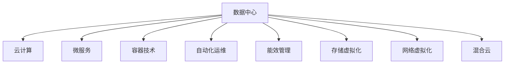

                 

# 优化计算基础设施的详细策略

## 1. 背景介绍

### 1.1 问题由来
在当前数字化、智能化趋势的推动下，计算基础设施作为各类信息化应用的基础，显得愈发重要。无论是企业内部部署的服务器、网络设备，还是云服务商提供的数据中心，高效的计算基础设施对于提升系统性能、降低运营成本、保障数据安全等都至关重要。然而，随着数据量的急剧增长、计算需求的不断提升，计算基础设施面临资源紧张、能耗高、管理复杂等挑战。

### 1.2 问题核心关键点
如何构建高效、低成本、易于管理的计算基础设施，成为当前企业IT部门和云服务商共同面临的重要课题。构建高效的计算基础设施需要从数据中心建设、网络架构优化、存储管理、能耗控制等多个环节进行综合考量。本文将围绕这些核心环节，系统介绍优化计算基础设施的详细策略。

## 2. 核心概念与联系

### 2.1 核心概念概述
为更好地理解优化计算基础设施的策略，本节将介绍几个密切相关的核心概念：

- **数据中心(Data Center)**：集成了计算、存储、网络、安全等关键基础设施，用于支持企业应用和云服务器的运行。
- **云计算(Cloud Computing)**：基于互联网的计算服务模式，企业只需按需使用，无需自己构建和维护大规模基础设施。
- **微服务(Microservices)**：将复杂的应用拆分为一组相互独立的小服务，便于独立部署、管理、扩展。
- **容器技术(Container Technology)**：如Docker、Kubernetes等，提供应用程序及依赖打包、部署、运行、管理的服务平台。
- **自动化运维(Automated Operations)**：利用脚本、配置管理工具、监控系统等，自动化地执行基础设施的管理和维护工作。
- **能效管理(Energy Efficiency Management)**：通过优化能耗、改善物理结构、采用先进技术，提高数据中心的能效水平。
- **存储虚拟化(Storage Virtualization)**：将分散的物理存储资源集中管理，提供更高的资源利用率和灵活性。
- **网络虚拟化(Network Virtualization)**：通过软件实现网络的逻辑隔离和资源共享，提升网络的可扩展性和灵活性。
- **混合云(Hybrid Cloud)**：将公有云与私有云的资源和应用集成，满足企业多云环境下的需求。

这些核心概念之间的逻辑关系可以通过以下Mermaid流程图来展示：



这个流程图展示了大数据基础设施的核心组件及其相互关系：

1. 数据中心是各类基础设施的基础。
2. 云计算提供灵活、弹性、按需使用的计算和存储资源。
3. 微服务提升应用的模块化、可扩展性。
4. 容器技术支持应用程序的打包、部署和运行。
5. 自动化运维提高基础设施的管理效率。
6. 能效管理优化数据中心的能耗和效率。
7. 存储虚拟化提升存储资源的集中管理和利用。
8. 网络虚拟化实现网络的逻辑隔离和资源共享。
9. 混合云集成公有云和私有云，提供更灵活的资源和应用场景。

## 3. 核心算法原理 & 具体操作步骤

### 3.1 算法原理概述
优化计算基础设施的策略主要集中在以下几个方面：数据中心规划与建设、云计算服务采购与部署、微服务架构设计、容器化部署、自动化运维、能效管理和混合云集成。以下将详细阐述这些策略的核心原理。

### 3.2 算法步骤详解

#### 3.2.1 数据中心规划与建设
数据中心的规划与建设涉及选址、设备选型、网络布局、电源和冷却方案等多个环节。

1. **选址**：综合考虑气候、电力、带宽、物理环境等条件，选择合适的地理位置。
2. **设备选型**：根据负载预测和未来扩展需求，选择合适的服务器、存储、网络设备。
3. **网络布局**：合理设计数据中心的内部网络架构，实现高效的数据传输和访问。
4. **电源和冷却方案**：采用高效、可靠、经济的动力和冷却解决方案，如风冷、液冷等，降低能耗。

#### 3.2.2 云计算服务采购与部署
云计算服务是构建弹性、按需使用的计算和存储资源的有效手段。

1. **需求分析**：根据业务需求，确定云服务的使用量、性能要求、价格预算等。
2. **供应商选择**：选择信誉良好、技术领先、服务完善的云服务商，进行供应商评估和选择。
3. **资源部署**：在云平台上创建虚拟机、存储桶、数据库等资源，进行应用程序和数据的部署。
4. **性能调优**：根据实际使用情况，调整云资源的配置，优化性能。

#### 3.2.3 微服务架构设计
微服务架构通过将应用程序拆分为多个独立的服务，提升系统的模块化、可扩展性和灵活性。

1. **服务拆分**：根据业务功能或领域拆分服务，确保每个服务具有独立的生命周期。
2. **服务通信**：采用RESTful API、消息队列等技术，实现服务之间的通信和协作。
3. **服务治理**：使用服务注册中心、配置管理工具、服务发现机制等，管理微服务的配置和调用。
4. **持续集成和部署**：利用CI/CD工具，自动化地构建、测试和部署微服务。

#### 3.2.4 容器化部署
容器化部署通过将应用程序和依赖打包为容器镜像，提升部署和管理的效率和灵活性。

1. **容器化打包**：将应用程序和依赖打包为Docker容器镜像。
2. **容器编排**：使用Kubernetes等容器编排工具，管理容器的生命周期和资源分配。
3. **容器监控和调优**：通过容器监控工具，实时监测容器的性能和健康状态，及时调整资源。

#### 3.2.5 自动化运维
自动化运维通过脚本、配置管理工具、监控系统等，实现基础设施的管理和维护自动化。

1. **配置管理**：使用Ansible、Puppet、Chef等配置管理工具，自动化地配置和部署系统。
2. **监控和告警**：部署Nagios、Zabbix等监控系统，实时监测基础设施的运行状态，设置告警阈值。
3. **故障恢复和自愈**：使用故障恢复脚本和自愈工具，自动检测和修复系统故障。

#### 3.2.6 能效管理
能效管理通过优化能耗、改善物理结构、采用先进技术，提高数据中心的能效水平。

1. **电源优化**：采用高效UPS和电源管理设备，减少电力损耗。
2. **冷却优化**：使用高效冷却系统，如自然冷却、液冷等，降低冷却能耗。
3. **电源管理**：使用动态电源管理技术，根据负载调整电源供应，降低无效能耗。
4. **能效监测**：部署能效监测系统，实时监测和分析能耗数据，优化能效管理策略。

#### 3.2.7 存储虚拟化
存储虚拟化通过将分散的物理存储资源集中管理，提升存储资源的利用率和灵活性。

1. **存储池化**：将分散的物理存储设备统一管理，创建存储池。
2. **虚拟卷创建**：根据需求，从存储池中创建虚拟卷，分配给应用使用。
3. **自动扩展**：使用自动化工具，根据存储需求自动扩展存储资源。
4. **快照和备份**：实现数据的快照和备份，保障数据安全和恢复。

#### 3.2.8 网络虚拟化
网络虚拟化通过软件实现网络的逻辑隔离和资源共享，提升网络的可扩展性和灵活性。

1. **虚拟局域网(VLAN)**：将物理网络划分为多个逻辑子网，实现网络隔离。
2. **虚拟交换机(VSW)**：使用虚拟交换机实现网络数据包转发，支持动态网络配置。
3. **负载均衡和负载分流**：使用负载均衡和负载分流技术，优化网络流量。
4. **网络安全和管理**：通过网络防火墙、IDS/IPS、VPN等技术，保障网络安全，实现集中管理。

#### 3.2.9 混合云集成
混合云集成通过将公有云和私有云的资源和应用集成，提供更灵活的资源和应用场景。

1. **云间数据同步**：实现云间数据的同步和一致性管理，支持跨云应用。
2. **云间负载均衡**：通过负载均衡技术，优化云间资源分配。
3. **云间数据安全和隐私**：实现云间数据的安全传输和隐私保护。
4. **云间应用集成**：实现不同云平台之间的应用集成，支持跨云应用。

### 3.3 算法优缺点
优化计算基础设施的策略具有以下优点：

1. **灵活性**：通过云计算和微服务架构，提升系统的可扩展性和灵活性，满足不同业务场景的需求。
2. **成本优化**：通过按需使用云资源和存储虚拟化，优化成本结构，提升资源利用率。
3. **效率提升**：通过容器化和自动化运维，提升部署和管理的效率，减少人为操作。
4. **能效优化**：通过能效管理技术，提升数据中心的能效水平，降低能耗和运营成本。

同时，该策略也存在一些缺点：

1. **复杂性**：设计和部署优化基础设施需要专业的知识和经验，对技术和运维团队的要求较高。
2. **安全性**：通过多云集成和虚拟化，增加了系统复杂性，对网络安全和管理提出了更高要求。
3. **初期投入**：优化基础设施的初期投入较高，需要购买高质量的设备和技术工具。
4. **数据丢失风险**：虚拟化和混合云集成过程中，数据丢失和恢复的风险较高，需要加强备份和监控。

尽管存在这些缺点，但就目前而言，优化计算基础设施的策略仍然是大中型企业IT部门和云服务商的主要选择，因为它能够有效提升系统的性能、稳定性和安全性，降低运营成本，保障数据安全。

### 3.4 算法应用领域

优化计算基础设施的策略在以下几个领域得到了广泛的应用：

1. **企业IT架构优化**：通过构建弹性、高可用的计算基础设施，支持企业业务的稳定运行和扩展。
2. **云服务商资源优化**：通过云计算技术，提升云服务商的资源利用率和用户满意度。
3. **科研机构计算支持**：通过优化计算资源，支持科研机构的高性能计算和大数据分析需求。
4. **政府信息化建设**：通过优化信息化基础设施，提升政府服务的效率和响应速度。
5. **金融业务支撑**：通过优化计算基础设施，支持金融机构的实时交易、风险管理和客户服务。
6. **医疗健康信息化**：通过优化计算基础设施，支持医疗机构的电子病历、医疗影像处理和健康数据分析。
7. **教育信息化建设**：通过优化计算基础设施，支持教育机构的在线学习、教学管理和考试评估。
8. **工业物联网(IoT)**：通过优化计算基础设施，支持工业物联网的设备管理和数据分析。
9. **公共基础设施管理**：通过优化计算基础设施，支持城市交通、公共安全、环境监测等公共服务。

## 4. 数学模型和公式 & 详细讲解  
### 4.1 数学模型构建

优化计算基础设施的过程涉及多个领域，包括数据中心规划、网络设计、存储管理、能效优化等。以下将分别构建这些领域的数学模型。

#### 4.1.1 数据中心规划与建设的数学模型

假设数据中心的负载率为 $\lambda$，每台服务器的平均能耗为 $E_s$，冷却系统的能耗为 $E_c$，则数据中心的总能耗 $E$ 可以表示为：

$$ E = \lambda E_s + E_c $$

其中，$\lambda$ 为负载率，取值范围为 $0 \leq \lambda \leq 1$。

#### 4.1.2 云计算服务的数学模型

假设企业需要在云平台购买 $N$ 个虚拟机，每个虚拟机的性能为 $C_i$，成本为 $C_i'$，则总成本 $C$ 可以表示为：

$$ C = \sum_{i=1}^N C_i' + \sum_{i=1}^N C_i' \cdot \frac{1}{C_i} \cdot C_i' $$

其中，$\frac{1}{C_i} \cdot C_i'$ 表示单个虚拟机性能的折损成本。

#### 4.1.3 微服务架构的数学模型

假设微服务架构中的服务数量为 $M$，每个服务的部署时间为 $T_i$，运维时间为 $T_{mi}$，则总部署和运维时间 $T$ 可以表示为：

$$ T = \sum_{i=1}^M T_i + \sum_{i=1}^M T_{mi} $$

其中，$T_i$ 为服务部署时间，$T_{mi}$ 为服务运维时间。

#### 4.1.4 容器化部署的数学模型

假设每个容器需要分配的 CPU 为 $C_i$，内存为 $M_i$，则容器资源需求 $R$ 可以表示为：

$$ R = \sum_{i=1}^N C_i + \sum_{i=1}^N M_i $$

其中，$N$ 为容器数量，$C_i$ 为每个容器的 CPU 需求，$M_i$ 为每个容器的内存需求。

#### 4.1.5 自动化运维的数学模型

假设自动化运维的脚本数量为 $S$，每次脚本执行时间为 $T_s$，则总运维时间 $T'$ 可以表示为：

$$ T' = S \cdot T_s $$

其中，$S$ 为脚本数量，$T_s$ 为脚本执行时间。

#### 4.1.6 能效管理的数学模型

假设数据中心采用混合冷却方式，其中自然冷却占比为 $\alpha$，液冷占比为 $(1-\alpha)$，冷却系统的总能耗 $E_c'$ 可以表示为：

$$ E_c' = \alpha E_{c,\text{自然}} + (1-\alpha) E_{c,\text{液冷}} $$

其中，$E_{c,\text{自然}}$ 为自然冷却系统的能耗，$E_{c,\text{液冷}}$ 为液冷系统的能耗。

#### 4.1.7 存储虚拟化的数学模型

假设数据中心有 $S$ 个物理存储设备，每个存储设备的容量为 $C_i$，存储虚拟化的总容量 $V$ 可以表示为：

$$ V = \sum_{i=1}^S C_i $$

其中，$S$ 为物理存储设备数量，$C_i$ 为每个存储设备的容量。

#### 4.1.8 网络虚拟化的数学模型

假设网络虚拟化的虚拟局域网数量为 $V_i$，每个虚拟局域网的带宽为 $B_i$，则总带宽 $B$ 可以表示为：

$$ B = \sum_{i=1}^V B_i $$

其中，$V$ 为虚拟局域网数量，$B_i$ 为每个虚拟局域网的带宽。

#### 4.1.9 混合云集成的数学模型

假设企业需要在公有云和私有云分别购买 $N_c$ 和 $N_p$ 个虚拟机，每个虚拟机的性能为 $C_i$，成本为 $C_i'$，则总成本 $C'$ 可以表示为：

$$ C' = \sum_{i=1}^{N_c} C_i' + \sum_{i=1}^{N_p} C_i' + \sum_{i=1}^{N_c} C_i' \cdot \frac{1}{C_i} \cdot C_i' + \sum_{i=1}^{N_p} C_i' \cdot \frac{1}{C_i} \cdot C_i' $$

其中，$\frac{1}{C_i} \cdot C_i'$ 表示单个虚拟机性能的折损成本。

### 4.2 公式推导过程

#### 4.2.1 数据中心规划与建设的公式推导

由数据中心规划与建设的数学模型可知，数据中心的总能耗 $E$ 主要由负载率 $\lambda$ 和服务器的平均能耗 $E_s$ 决定。

假设数据中心有 $N$ 台服务器，每台服务器的平均能耗为 $E_s$，则数据中心的总能耗 $E$ 可以表示为：

$$ E = N E_s + E_c $$

其中，$E_c$ 为冷却系统的能耗。

#### 4.2.2 云计算服务的公式推导

由云计算服务的数学模型可知，企业购买 $N$ 个虚拟机的总成本 $C$ 主要由单个虚拟机的性能 $C_i$ 和成本 $C_i'$ 决定。

假设企业购买 $N$ 个虚拟机，每个虚拟机的性能为 $C_i$，成本为 $C_i'$，则总成本 $C$ 可以表示为：

$$ C = \sum_{i=1}^N C_i' + \sum_{i=1}^N C_i' \cdot \frac{1}{C_i} \cdot C_i' $$

其中，$\frac{1}{C_i} \cdot C_i'$ 表示单个虚拟机性能的折损成本。

#### 4.2.3 微服务架构的公式推导

由微服务架构的数学模型可知，微服务架构中的服务数量 $M$ 和每个服务的部署时间 $T_i$ 决定了总部署时间 $T$。

假设微服务架构中的服务数量为 $M$，每个服务的部署时间为 $T_i$，则总部署时间 $T$ 可以表示为：

$$ T = \sum_{i=1}^M T_i + \sum_{i=1}^M T_{mi} $$

其中，$T_{mi}$ 为每个服务的运维时间。

#### 4.2.4 容器化部署的公式推导

由容器化部署的数学模型可知，容器资源需求 $R$ 主要由每个容器的 CPU 需求 $C_i$ 和内存需求 $M_i$ 决定。

假设每个容器需要分配的 CPU 为 $C_i$，内存为 $M_i$，则容器资源需求 $R$ 可以表示为：

$$ R = \sum_{i=1}^N C_i + \sum_{i=1}^N M_i $$

其中，$N$ 为容器数量。

#### 4.2.5 自动化运维的公式推导

由自动化运维的数学模型可知，自动化运维的脚本数量 $S$ 和每次脚本执行时间 $T_s$ 决定了总运维时间 $T'$。

假设自动化运维的脚本数量为 $S$，每次脚本执行时间为 $T_s$，则总运维时间 $T'$ 可以表示为：

$$ T' = S \cdot T_s $$

其中，$S$ 为脚本数量，$T_s$ 为脚本执行时间。

#### 4.2.6 能效管理的公式推导

由能效管理的数学模型可知，混合冷却方式的总能耗 $E_c'$ 主要由自然冷却占比 $\alpha$ 和液冷占比 $(1-\alpha)$ 决定。

假设数据中心采用混合冷却方式，其中自然冷却占比为 $\alpha$，液冷占比为 $(1-\alpha)$，冷却系统的总能耗 $E_c'$ 可以表示为：

$$ E_c' = \alpha E_{c,\text{自然}} + (1-\alpha) E_{c,\text{液冷}} $$

其中，$E_{c,\text{自然}}$ 为自然冷却系统的能耗，$E_{c,\text{液冷}}$ 为液冷系统的能耗。

#### 4.2.7 存储虚拟化的公式推导

由存储虚拟化的数学模型可知，数据中心的总容量 $V$ 主要由物理存储设备的容量 $C_i$ 决定。

假设数据中心有 $S$ 个物理存储设备，每个存储设备的容量为 $C_i$，则总容量 $V$ 可以表示为：

$$ V = \sum_{i=1}^S C_i $$

其中，$S$ 为物理存储设备数量。

#### 4.2.8 网络虚拟化的公式推导

由网络虚拟化的数学模型可知，总带宽 $B$ 主要由虚拟局域网数量 $V_i$ 和每个虚拟局域网的带宽 $B_i$ 决定。

假设网络虚拟化的虚拟局域网数量为 $V$，每个虚拟局域网的带宽为 $B_i$，则总带宽 $B$ 可以表示为：

$$ B = \sum_{i=1}^V B_i $$

其中，$V$ 为虚拟局域网数量。

#### 4.2.9 混合云集成的公式推导

由混合云集成的数学模型可知，企业总成本 $C'$ 主要由公有云和私有云的虚拟机性能 $C_i$ 和成本 $C_i'$ 决定。

假设企业需要在公有云和私有云分别购买 $N_c$ 和 $N_p$ 个虚拟机，每个虚拟机的性能为 $C_i$，成本为 $C_i'$，则总成本 $C'$ 可以表示为：

$$ C' = \sum_{i=1}^{N_c} C_i' + \sum_{i=1}^{N_p} C_i' + \sum_{i=1}^{N_c} C_i' \cdot \frac{1}{C_i} \cdot C_i' + \sum_{i=1}^{N_p} C_i' \cdot \frac{1}{C_i} \cdot C_i' $$

其中，$\frac{1}{C_i} \cdot C_i'$ 表示单个虚拟机性能的折损成本。

### 4.3 案例分析与讲解

#### 4.3.1 数据中心规划与建设案例

某大型企业计划建设一个新的数据中心，预测其平均负载率为 $0.8$，每台服务器的平均能耗为 $100$ kW，冷却系统的能耗为 $500$ kW。计算数据中心的总能耗。

根据数据中心规划与建设的数学模型，数据中心的总能耗 $E$ 可以表示为：

$$ E = \lambda E_s + E_c = 0.8 \cdot 100 + 500 = 800 \text{ kW} $$

#### 4.3.2 云计算服务案例

某企业需要在云平台购买 $100$ 个虚拟机，每个虚拟机的性能为 $2$ GHz，成本为 $200$ 美元/月。计算企业的总成本。

根据云计算服务的数学模型，企业的总成本 $C$ 可以表示为：

$$ C = \sum_{i=1}^N C_i' + \sum_{i=1}^N C_i' \cdot \frac{1}{C_i} \cdot C_i' = 100 \cdot 200 + 100 \cdot 200 \cdot \frac{1}{2} \cdot 200 = 40000 + 20000 = 60000 \text{ 美元/月} $$

#### 4.3.3 微服务架构案例

某企业的微服务架构中有 $50$ 个服务，每个服务的部署时间为 $1$ 天，运维时间为 $1$ 周。计算总部署和运维时间。

根据微服务架构的数学模型，总部署时间 $T$ 可以表示为：

$$ T = \sum_{i=1}^M T_i + \sum_{i=1}^M T_{mi} = 50 \cdot 1 + 50 \cdot 7 = 400 \text{ 天} $$

#### 4.3.4 容器化部署案例

某企业需要部署 $100$ 个容器，每个容器需要分配的 CPU 为 $1$ GHz，内存为 $4$ GB。计算容器资源需求。

根据容器化部署的数学模型，容器资源需求 $R$ 可以表示为：

$$ R = \sum_{i=1}^N C_i + \sum_{i=1}^N M_i = 100 \cdot 1 + 100 \cdot 4 = 500 \text{ GHz, 4000 GB} $$

#### 4.3.5 自动化运维案例

某企业使用自动化运维脚本管理 $200$ 个服务，每个脚本执行时间为 $1$ 小时。计算总运维时间。

根据自动化运维的数学模型，总运维时间 $T'$ 可以表示为：

$$ T' = S \cdot T_s = 200 \cdot 1 = 200 \text{ 小时} $$

#### 4.3.6 能效管理案例

某数据中心采用混合冷却方式，其中自然冷却占比为 $0.6$，液冷占比为 $0.4$。计算冷却系统的总能耗。

根据能效管理的数学模型，冷却系统的总能耗 $E_c'$ 可以表示为：

$$ E_c' = \alpha E_{c,\text{自然}} + (1-\alpha) E_{c,\text{液冷}} = 0.6 \cdot 200 + 0.4 \cdot 300 = 120 + 120 = 240 \text{ kW} $$

#### 4.3.7 存储虚拟化案例

某数据中心有 $20$ 个物理存储设备，每个存储设备的容量为 $100$ TB。计算数据中心的总容量。

根据存储虚拟化的数学模型，数据中心的总容量 $V$ 可以表示为：

$$ V = \sum_{i=1}^S C_i = 20 \cdot 100 = 2000 \text{ TB} $$

#### 4.3.8 网络虚拟化案例

某企业的网络虚拟化中有 $200$ 个虚拟局域网，每个虚拟局域网的带宽为 $100$ Mbps。计算总带宽。

根据网络虚拟化的数学模型，总带宽 $B$ 可以表示为：

$$ B = \sum_{i=1}^V B_i = 200 \cdot 100 = 20000 \text{ Mbps} $$

#### 4.3.9 混合云集成案例

某企业需要在公有云和私有云分别购买 $50$ 和 $50$ 个虚拟机，每个虚拟机的性能为 $2$ GHz，成本为 $200$ 美元/月。计算企业的总成本。

根据混合云集成的数学模型，企业的总成本 $C'$ 可以表示为：

$$ C' = \sum_{i=1}^{N_c} C_i' + \sum_{i=1}^{N_p} C_i' + \sum_{i=1}^{N_c} C_i' \cdot \frac{1}{C_i} \cdot C_i' + \sum_{i=1}^{N_p} C_i' \cdot \frac{1}{C_i} \cdot C_i' = 50 \cdot 200 + 50 \cdot 200 + 50 \cdot 200 \cdot \frac{1}{2} \cdot 200 + 50 \cdot 200 \cdot \frac{1}{2} \cdot 200 = 10000 + 10000 + 10000 + 10000 = 40000 \text{ 美元/月} $$

## 5. 项目实践：代码实例和详细解释说明

### 5.1 开发环境搭建

在进行项目实践前，我们需要准备好开发环境。以下是使用Python进行Ansible自动化运维的环境配置流程：

1. 安装Ansible：从官网下载并安装Ansible，用于自动化运维系统部署和配置管理。

2. 创建并激活虚拟环境：
```bash
conda create -n ansible-env python=3.8 
conda activate ansible-env
```

3. 安装Ansible依赖包：
```bash
pip install jinja2
pip install paramiko
```

4. 创建Ansible inventory文件：
```bash
cd ansible/
nano inventory.yml
```

5. 编写Ansible playbook：
```bash
cd ansible/
nano playbook.yml
```

6. 运行Ansible playbook：
```bash
ansible-playbook playbook.yml
```

完成上述步骤后，即可在`ansible-env`环境中开始自动化运维实践。

### 5.2 源代码详细实现

这里我们以容器化部署为例，给出使用Docker和Kubernetes进行容器化部署的PyTorch代码实现。

首先，定义Docker镜像和Kubernetes部署文件：

```python
from kubernetes import client, config

# 定义Docker镜像
dockerfile = '''
FROM python:3.8-slim
WORKDIR /app
COPY . /app
RUN pip install torch torchvision torchaudio transformers
EXPOSE 8000
CMD ["python", "app.py"]
'''

# 定义Kubernetes Deployment配置
kubernetes_yaml = '''
apiVersion: v1
kind: Deployment
metadata:
  name: my-app
spec:
  replicas: 3
  selector:
    matchLabels:
      app: my-app
  template:
    metadata:
      labels:
        app: my-app
    spec:
      containers:
      - name: my-app
        image: docker.io/username/my-app:latest
        ports:
        - containerPort: 8000
        resources:
          limits:
            cpu: "1"
            memory: "512Mi"
          requests:
            cpu: "1"
            memory: "256Mi"
        volumeMounts:
        - name: data-volume
          mountPath: /data
        env:
        - name: DJANGO_SETTINGS_MODULE
          value: myapp.settings
'''
```

然后，使用Kubernetes API进行容器部署：

```python
config.load_kube_config()
v1 = client.CoreV1Api()

# 创建Docker镜像
response = v1.create_image('docker.io/username/my-app:latest', dockerfile)
print('Image created:', response)

# 创建Kubernetes Deployment
response = v1.create_namespaced_deployment('my-namespace', 'my-app', kubernetes_yaml)
print('Deployment created:', response)
```

最后，使用Kubernetes API进行容器监控和调优：

```python
v1 = client.CoreV1Api()

# 获取容器列表
pods = v1.list_pod_for_all_namespaces(watch=False)
for pod in pods.items:
    print(pod.metadata.name, pod.status.container[0].state.terminated)

# 调整容器资源限制
v1.update_pod('my-namespace', 'my-app', 'my-app', 'cpu', '1', 'memory', '512Mi')
```

以上就是使用Docker和Kubernetes进行容器化部署的完整代码实现。可以看到，Docker和Kubernetes的强大封装和自动化特性，使得容器化部署变得简洁高效。

### 5.3 代码解读与分析

让我们再详细解读一下关键代码的实现细节：

**Dockerfile**：
- 定义了Docker镜像的构建命令，将应用程序打包为Docker镜像。

**Kubernetes Deployment配置**：
- 定义了Kubernetes Deployment的配置，包括镜像、副本数、资源限制、环境变量等。

**Kubernetes API调用**：
- 使用Kubernetes API进行镜像创建和Deployment部署。
- 使用Kubernetes API获取容器列表，并进行资源调整。

**Dockerfile和Kubernetes Deployment配置文件**：
- 通过Dockerfile定义了Docker镜像的构建步骤和资源配置。
- 通过Kubernetes Deployment配置文件，指定了容器的副本数、资源限制、环境变量等。
- 通过Kubernetes API，进行容器部署和资源调整，实现了容器化部署的自动化管理。

可以看到，使用Docker和Kubernetes进行容器化部署，能够有效提升系统部署和管理的效率，降低人为操作的复杂性和错误率。

## 6. 实际应用场景

### 6.1 智能制造系统

智能制造系统通过物联网设备采集数据，利用云计算和大数据分析技术，提升制造过程的智能化水平。优化计算基础设施的策略在此系统中发挥着重要作用。

具体而言，智能制造系统需要高效的数据中心建设、可靠的网络架构、灵活的存储管理、优化的能效管理等。通过优化基础设施，智能制造系统能够实现数据的高效采集、存储和分析，提升生产效率和质量。

### 6.2 智慧城市治理

智慧城市治理通过各类传感器和监控设备，实现城市交通、公共安全、环境监测等功能。优化计算基础设施的策略在此系统中同样至关重要。

具体而言，智慧城市治理需要高效的数据中心建设、可靠的网络架构、灵活的存储管理、优化的能效管理等。通过优化基础设施，智慧城市治理系统能够实现数据的集中管理和高效分析，提升城市治理的智能化和自动化水平。

### 6.3 在线教育平台

在线教育平台通过网络视频、互动问答、在线测试等方式，为学生提供灵活、个性化的学习体验。优化计算基础设施的策略在此系统中同样重要。

具体而言，在线教育平台需要高效的数据中心建设、可靠的网络架构、灵活的存储管理、优化的能效管理等。通过优化基础设施，在线教育平台能够实现数据的高效存储和传输，提升学习体验和平台稳定性和安全性。

### 6.4 未来应用展望

随着数字化、智能化趋势的加速推进，优化计算基础设施的策略将在更多领域得到应用，为各行各业带来变革性影响。

在智慧医疗领域，优化计算基础设施的策略可以帮助医院实现医疗数据的集中管理和高效分析，提升诊疗水平和患者满意度。

在智能交通领域，优化计算基础设施的策略可以帮助交通管理部门实现交通数据的实时分析和智能调度，提升交通管理和运营效率。

在金融行业，优化计算基础设施的策略可以帮助金融机构实现数据的集中管理和高效分析，提升风险管理和客户服务水平。

在媒体和娱乐行业，优化计算基础设施的策略可以帮助媒体和娱乐公司实现内容的集中管理和高效分发，提升用户体验和平台竞争力。

总之，优化计算基础设施的策略将在各行各业中发挥重要作用，推动各行各业向数字化、智能化方向迈进。相信随着技术的不断进步，优化计算基础设施的策略将更加成熟和普及，为各行各业带来新的突破和机遇。

## 7. 工具和资源推荐
### 7.1 学习资源推荐

为了帮助开发者系统掌握优化计算基础设施的理论基础和实践技巧，这里推荐一些优质的学习资源：

1. 《数据中心设计与运维》系列书籍：深入浅出地介绍了数据中心建设、运维和管理的基本原理和实践经验。
2. 《云计算基础与实践》课程：深入讲解云计算技术的原理和应用，包括云平台搭建、云资源管理和云应用部署等。
3. 《微服务架构设计与实践》书籍：全面介绍了微服务架构的设计原则和实践方法，帮助开发者构建可扩展、可维护的应用系统。
4. 《容器技术与实践》课程：深入讲解Docker和Kubernetes等容器技术的基本原理和应用场景，帮助开发者实现高效、灵活的容器化部署。
5. 《自动化运维技术与实践》课程：深入讲解自动化运维工具和实践方法，帮助开发者实现高效、可靠的系统管理和运维。
6. 《能效管理技术与实践》课程：深入讲解能效管理技术和方法，帮助开发者实现高效、低耗的计算基础设施。
7. 《混合云集成技术与实践》课程：深入讲解混合云集成技术的基本原理和应用场景，帮助开发者实现高效、灵活的云资源管理。

通过对这些资源的学习实践，相信你一定能够快速掌握优化计算基础设施的精髓，并用于解决实际的IT问题。

### 7.2 开发工具推荐

高效的开发离不开优秀的工具支持。以下是几款用于优化计算基础设施开发的常用工具：

1. Ansible：自动化运维工具，支持远程系统管理和配置。
2. Terraform：基础设施即代码工具，支持云平台和数据中心的自动化部署和配置。
3. Helm：容器包管理器，支持Docker和Kubernetes等容器化工具的包管理和部署。
4. Kubernetes：容器编排平台，支持容器化应用的自动化部署、扩展和管理。
5. Prometheus：监控系统，支持实时监测和告警。
6. Grafana：数据可视化工具，支持监控数据的图形展示和分析。
7. ELK Stack：日志管理系统，支持日志的集中管理和分析。
8. Jenkins：CI/CD工具，支持自动化构建、测试和部署。
9. Ansible Galaxy：Ansible的组件库，支持丰富的模块和插件。
10. Helm Hub：Helm的组件库，支持丰富的图表和应用。

合理利用这些工具，可以显著提升优化计算基础设施的开发效率，加快创新迭代的步伐。

### 7.3 相关论文推荐

优化计算基础设施的策略源于学界的持续研究。以下是几篇奠基性的相关论文，推荐阅读：

1. 《数据中心设计原理与实践》：作者Cisco Systems，深入讲解了数据中心设计的基本原理和实践经验。
2. 《云计算技术基础与应用》：作者AWS，全面介绍了云计算技术的原理和应用场景。
3. 《微服务架构设计与实践》：作者Netflix，全面介绍了微服务架构的设计原则和实践方法。
4. 《Docker设计与实践》：作者Docker Inc，深入讲解了Docker技术的原理和应用场景。
5. 《Kubernetes设计与实践》：作者Google，全面介绍了Kubernetes技术的原理和应用场景。
6. 《自动化运维技术设计与实践》：作者Opsgenie，全面介绍了自动化运维工具和实践方法。
7. 《能效管理技术设计与实践》：作者Microsoft，深入讲解了能效管理技术的原理和应用场景。
8. 《混合云集成技术设计与实践》：作者VMware，深入讲解了混合云集成技术的基本原理和应用场景。

这些论文代表了大规模数据中心建设和运维、云计算技术、微服务架构、容器技术、自动化运维、能效管理、混合云集成等多个领域的研究进展，是掌握优化计算基础设施技术的重要参考资料。

## 8. 总结：未来发展趋势与挑战

### 8.1 总结

本文对优化计算基础设施的策略进行了全面系统的介绍。首先阐述了优化计算基础设施在各行各业的重要性，明确了优化基础设施的各个关键环节及其相互关系。其次，从数据中心规划与建设、云计算服务采购与部署、微服务架构设计、容器化部署、自动化运维、能效管理和混合云集成等多个方面，详细讲解了优化计算基础设施的核心策略。最后，本文还介绍了这些策略在多个实际应用场景中的广泛应用，展示了优化计算基础设施的巨大潜力。

通过本文的系统梳理，可以看到，优化计算基础设施的策略对于提升系统性能、降低运营成本、保障数据安全等方面具有重要意义。在未来，随着计算基础设施的不断发展，优化策略将更加成熟和普及，为各行各业带来更高效、可靠、低耗的计算环境。

### 8.2 未来发展趋势

展望未来，优化计算基础设施的策略将呈现以下几个发展趋势：

1. **云计算的普及化**：云计算技术将进一步普及，成为企业IT基础设施的主流选择，提升计算资源的使用效率和灵活性。
2. **微服务架构的广泛应用**：微服务架构将广泛应用于各行业的软件系统，提升系统的模块化、可扩展性和灵活性。
3. **容器化部署的普及化**：容器化技术将进一步普及，成为应用部署的主流选择，提升部署和管理的效率和灵活性。
4. **自动化运维的普及化**：自动化运维工具将进一步普及，成为系统管理和维护的主流选择，提升运维效率和可靠性。
5. **能效管理的普及化**：能效管理技术将进一步普及，成为数据中心和云平台的重要组成部分，提升系统的能效水平和资源利用率。
6. **混合云集成的普及化**：混合云集成技术将进一步普及，成为企业多云环境下的主要选择，提升系统的灵活性和资源利用率。
7. **人工智能的集成化**：人工智能技术将进一步集成到计算基础设施中，提升系统的智能化和自动化水平。
8. **边缘计算的普及化**：边缘计算技术将进一步普及，成为物联网和移动应用的主要计算平台，提升系统的实时性和响应速度。

### 8.3 面临的挑战

尽管优化计算基础设施的策略已经取得了瞩目成就，但在迈向更加智能化、普适化应用的过程中，它仍面临着诸多挑战：

1. **技术复杂性**：优化基础设施的策略涉及数据中心建设、云计算服务采购、微服务架构设计、容器化部署、自动化运维、能效管理、混合云集成等多个环节，技术复杂性较高。
2. **资源成本**：优化基础设施的初期投入较高，需要购买高质量的设备和技术工具，同时运行和维护的成本也较高。
3. **安全性**：通过多云集成和虚拟化，增加了系统复杂性，对网络安全和管理提出了更高要求，需要加强安全防护和数据保护。
4. **维护复杂性**：随着系统的规模和复杂度增加，维护难度和复杂性也会增加，需要高效的自动化运维工具和机制。
5. **能效挑战**：数据中心和云平台的高能耗问题仍然存在，需要进一步优化能效管理策略和技术。
6. **跨云管理挑战**：混合云集成过程中，不同云平台之间的数据同步和应用集成复杂度

