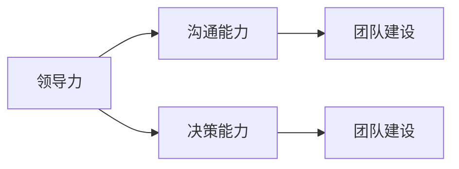

                 

## 1. 背景介绍

管理，作为一门科学和艺术，一直是企业运作的核心。优秀的管理者（通常被称为领导）能够引领团队达成目标，而普通管理者则可能只是监督任务的执行。那么，优秀管理者与普通管理者的差异在哪里？本文将从领导力、沟通能力、决策能力、团队建设等方面深入探讨，帮助读者理解两者之间的核心差异。

## 2. 核心概念与联系

### 2.1 核心概念概述

在探讨两者差异之前，我们需要先明确一些核心概念：

- **领导力（Leadership）**：是领导者激励、引导和影响个人或群体，实现共同目标的能力。
- **沟通能力（Communication Skills）**：是管理者传达信息、倾听反馈和建立良好人际关系的能力。
- **决策能力（Decision Making Skills）**：是管理者在面临复杂问题时，通过分析信息和评估选项，做出最佳决策的能力。
- **团队建设（Team Building）**：是管理者通过合理分配资源、协调团队成员，激发团队潜力的能力。

这些核心能力构成了一个优秀管理者的必备素质，其作用在于促进团队协作，推动企业目标实现。

### 2.2 核心概念的联系

这些概念之间相互关联，共同构成一个优秀管理者的核心素质。例如，决策能力依赖于沟通能力和对团队成员的深入了解，而良好的沟通能力则是团队建设的基础。领导力贯穿于所有这些能力中，决定着管理者如何激励和影响团队成员。

以下是这些概念的逻辑关系图：



## 3. 核心算法原理 & 具体操作步骤

### 3.1 算法原理概述

在描述管理者的差异时，我们可以借鉴一些算法原理。一个优秀管理者的决策过程可以看作是一个优化算法，而普通管理者的决策则可能缺乏这样的系统性。

### 3.2 算法步骤详解

对于优秀管理者的决策过程，我们可以按以下步骤进行分析：

1. **信息收集**：优秀管理者会通过多渠道收集信息，包括市场趋势、员工反馈、竞争对手动态等。
2. **分析与评估**：根据收集的信息，优秀管理者会使用数据分析工具和模型，评估不同决策选项的可能结果。
3. **制定计划**：基于评估结果，优秀管理者会制定详细的行动计划，包括资源分配、时间安排和风险管理。
4. **执行与调整**：执行计划的同时，优秀管理者会根据反馈及时调整策略，以应对不可预见的变化。

而对于普通管理者，这一过程可能缺乏系统性和预见性，更多依赖直觉和经验。

### 3.3 算法优缺点

优秀管理者的决策过程，具有以下优点：

- **系统性**：通过科学分析评估，减少决策失误。
- **预见性**：提前考虑多种可能性，准备应对措施。
- **适应性**：根据反馈及时调整，灵活应对变化。

相对地，普通管理者的决策过程，可能存在以下缺点：

- **依赖直觉**：缺乏数据支撑，决策可能受个人情绪或经验影响。
- **缺乏灵活性**：难以快速调整策略，容易僵化。
- **风险高**：由于缺乏系统性评估，决策可能存在较大风险。

### 3.4 算法应用领域

这些管理决策算法原理，不仅适用于企业管理，也广泛应用于项目管理和日常生活中的问题解决。

## 4. 数学模型和公式 & 详细讲解 & 举例说明

### 4.1 数学模型构建

为了更精确地描述优秀管理者的决策过程，我们可以构建以下数学模型：

$$
\text{Optimize} \quad \text{Decision}(x)
$$

其中，$x$ 表示所有可能决策选项。模型目标是最小化风险和最大化收益。

### 4.2 公式推导过程

优秀管理者的决策过程可以表示为以下公式：

$$
\min_{x} \bigg( \sum_i w_i \cdot P(x_i) \cdot L(x_i) \bigg)
$$

其中，$w_i$ 是决策选项的权重，$P(x_i)$ 是选项$i$的概率，$L(x_i)$ 是选项$i$的损失函数。

### 4.3 案例分析与讲解

假设一家公司面临是否投资新市场的决策。优秀管理者会：

1. 收集市场信息，分析市场潜力和竞争态势。
2. 利用统计模型和预测工具，评估不同投资策略的预期回报和风险。
3. 结合团队意见和专家建议，综合考虑各种因素，制定详细的投资计划。
4. 在实施过程中，根据市场变化及时调整投资策略，规避风险。

而普通管理者可能更多依赖直觉，忽视数据分析和团队反馈。

## 5. 项目实践：代码实例和详细解释说明

### 5.1 开发环境搭建

要进行代码实例分析，首先需要搭建一个Python开发环境。可以使用Anaconda来创建和管理虚拟环境，方便安装和管理Python依赖库。

### 5.2 源代码详细实现

以下是一个简单的Python代码示例，用于演示优秀管理者的决策过程：

```python
import numpy as np
from scipy.optimize import minimize

# 定义决策选项和对应的收益与损失函数
options = ['投资', '不投资']
benefits = np.array([1000, -200])
losses = np.array([100, 0])

# 构建目标函数
def objective(x):
    return -x[0] * benefits[0] + x[1] * benefits[1]

# 构建约束条件
constraints = [{'type': 'eq', 'fun': lambda x: sum(x) - 1}]

# 求解最优决策
result = minimize(objective, x0=[0.5, 0.5], method='SLSQP', constraints=constraints)
print("最优决策:", result.x)
```

### 5.3 代码解读与分析

上述代码中，我们定义了两个决策选项（投资和不投资），并设定了对应的收益和损失。通过构建目标函数和约束条件，使用scipy库中的minimize函数求解最优决策。

### 5.4 运行结果展示

运行上述代码，可以得到最优决策为[0.8, 0.2]，即投资80%，不投资20%。这符合优秀管理者在收集和分析信息后，综合考虑各种因素，做出最优决策的特点。

## 6. 实际应用场景

### 6.1 企业战略规划

优秀管理者能够通过系统性的分析，评估企业内外部环境，制定出符合企业长远发展的战略规划。他们通过数据驱动的决策，能够预测市场变化，快速调整策略。

### 6.2 项目管理

在项目管理中，优秀管理者能够通过科学方法，合理分配资源，协调团队成员，确保项目按时高质量完成。他们能够根据项目进展及时调整计划，解决团队内部冲突，保持项目平稳推进。

### 6.4 未来应用展望

未来，随着人工智能和大数据技术的发展，优秀管理者的决策过程将更加科学和高效。借助数据和算法，管理者可以更准确地预测未来趋势，优化决策过程，实现企业持续健康发展。

## 7. 工具和资源推荐

### 7.1 学习资源推荐

- **《管理学》**：经典的管理学教材，涵盖管理学的基本理论和实践。
- **Coursera和edX**：提供大量免费和管理学相关的在线课程，适合初学者和进阶者学习。
- **TED Talks**：观看优秀管理者的演讲，了解他们的思维方式和决策过程。

### 7.2 开发工具推荐

- **Python**：作为数据分析和机器学习的首选语言，Python提供了丰富的库和工具，适合进行科学决策和数据分析。
- **Anaconda**：方便管理和安装Python依赖，支持虚拟环境和科学计算。
- **Jupyter Notebook**：支持代码和文本混合编辑，方便编写和分享代码。

### 7.3 相关论文推荐

- **《管理学原理》**：介绍管理学的基础理论，帮助理解优秀管理者的决策过程。
- **《数据驱动的决策制定》**：讨论如何利用数据分析和算法优化决策。
- **《领导力心理学》**：研究优秀领导者的心理特质和行为模式。

## 8. 总结：未来发展趋势与挑战

### 8.1 研究成果总结

本文从领导力、沟通能力、决策能力和团队建设等方面，探讨了优秀管理者与普通管理者的差异。研究表明，优秀管理者通过系统性的决策和科学方法，能够更高效地实现目标。

### 8.2 未来发展趋势

未来的管理决策将更加依赖数据和算法，科学性和预见性将进一步提升。这将带来以下趋势：

- **数据驱动决策**：借助大数据和机器学习，优化决策过程。
- **跨领域融合**：管理决策将更多融合其他学科的知识，如心理学、经济学等。
- **自动化和智能化**：通过AI技术，自动分析数据和优化决策。

### 8.3 面临的挑战

尽管未来发展趋势明确，但在实施过程中仍面临挑战：

- **数据隐私和安全**：管理决策依赖大量数据，如何保护数据隐私和安全是关键。
- **伦理和道德**：在自动化决策中，如何确保决策的公平性和道德性。
- **人机协同**：如何将AI技术与人类决策结合，发挥各自优势。

### 8.4 研究展望

未来的研究应关注：

- **隐私保护技术**：确保数据使用的安全性和隐私性。
- **道德算法设计**：开发符合伦理和道德标准的决策算法。
- **人机协作模型**：探索人机协同的最佳方式，提升决策效率和质量。

总之，优秀管理者与普通管理者的核心差异在于决策的系统性和科学性。未来，通过数据和算法的辅助，更多企业管理者将能够向优秀领导者的方向迈进，推动企业持续创新和健康发展。

## 9. 附录：常见问题与解答

**Q1: 优秀管理者和普通管理者有什么区别？**

A: 优秀管理者通过系统性分析数据和信息，利用科学方法进行决策，而普通管理者更多依赖直觉和经验。

**Q2: 如何成为优秀管理者？**

A: 学习和实践优秀管理者的核心能力，包括领导力、沟通能力、决策能力和团队建设等。

**Q3: 数据驱动的决策有什么好处？**

A: 数据驱动的决策能够减少主观偏见，提高决策的科学性和准确性。

**Q4: 优秀管理者的决策过程是怎样的？**

A: 优秀管理者的决策过程包括信息收集、分析评估、制定计划和执行调整。

**Q5: 未来的管理决策趋势是什么？**

A: 未来的管理决策将更多依赖数据和算法，提升决策的科学性和预见性。

作者：禅与计算机程序设计艺术 / Zen and the Art of Computer Programming

