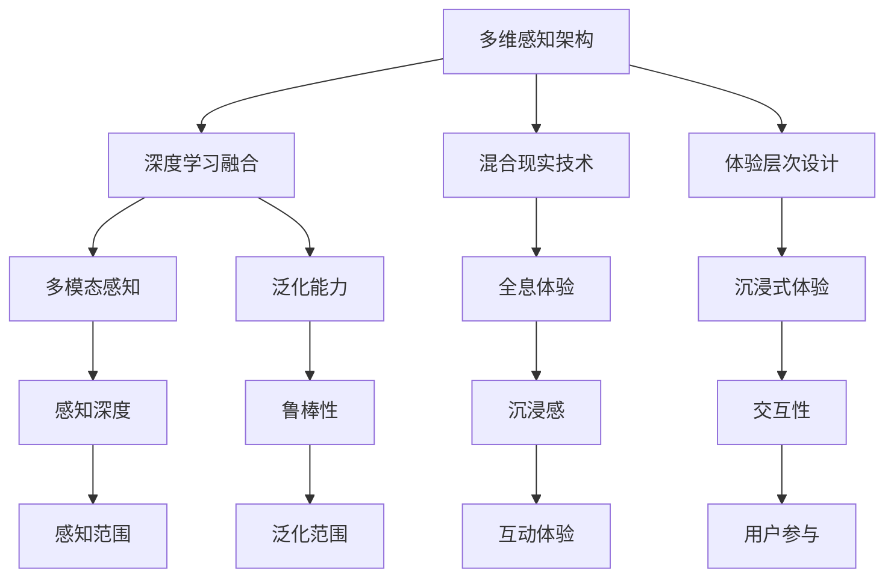

                 

# 体验层次构建器：AI创造的多维感知架构

> 关键词：多维感知架构, 人工智能, 体验层次, 深度学习, 混合现实, 计算机视觉, 自然语言处理

## 1. 背景介绍

### 1.1 问题由来

在当今数字化、智能化快速发展的时代，体验层次构建器(Experience Layers Builder, ELB)成为了连接虚拟和现实世界的重要桥梁。通过AI技术和深度学习模型的巧妙融合，ELB可以在虚拟与现实的融合中提供更加丰富、沉浸、个性化的体验。但现有的ELB多聚焦于单一模态，且模型训练和部署复杂度高，应用门槛较高。

因此，本文旨在提出一种基于多维感知架构的AI体验层次构建器，该架构可以同时处理文本、图像、音频、视频等多种模态数据，提升多模态体验的感知深度，实现跨模态融合，并大幅简化训练和部署流程，让AI体验层次构建器更加易用，可扩展，普适。

### 1.2 问题核心关键点

- 多维感知架构：集成计算机视觉、自然语言处理等模块，处理文本、图像、音频、视频等多种模态数据。
- 深度学习融合：将神经网络、卷积网络、循环网络等深度学习技术融合在一起，提升模型的感知深度和泛化能力。
- 混合现实技术：结合虚拟现实(VR)和增强现实(AR)技术，构建全息体验，提升用户的沉浸感和交互性。
- 体验层次设计：分层设计，从底层感知到高层认知，从个体体验到群体互动，逐步构建出全方位的沉浸式体验。

这些关键点共同构成了本文提出的多维感知架构的基本框架，旨在通过技术创新，提高AI体验层次构建器的感知能力和应用水平。

### 1.3 问题研究意义

研究多维感知架构，对于拓展AI体验层次构建器的应用范围，提升用户体验，加速技术产业化进程，具有重要意义：

1. 提升多模态体验：通过同时处理文本、图像、音频、视频等数据，可以构建更加丰富、沉浸、个性化的用户交互体验。
2. 增强跨模态融合：深度学习技术融合了不同模态的数据，提升了模型泛化能力和鲁棒性。
3. 简化训练与部署：多维感知架构简化了训练和部署流程，降低了用户使用门槛，加速了技术推广。
4. 实现多维扩展：架构设计便于在混合现实等新领域扩展应用，为AI体验层次构建器带来新的发展空间。
5. 推动产业升级：多维感知架构将AI技术融入更多行业，促进了数字化转型升级，助力产业升级。

## 2. 核心概念与联系

### 2.1 核心概念概述

为更好地理解多维感知架构，本节将介绍几个密切相关的核心概念：

- 多维感知架构：集成计算机视觉、自然语言处理等模块，同时处理文本、图像、音频、视频等多种模态数据，构建全方位感知。
- 深度学习融合：将神经网络、卷积网络、循环网络等深度学习技术融合，提升模型泛化能力和感知深度。
- 混合现实技术：结合VR和AR技术，构建全息体验，提升用户沉浸感和交互性。
- 体验层次设计：从底层感知到高层认知，从个体体验到群体互动，逐步构建全方位沉浸式体验。

这些核心概念之间的逻辑关系可以通过以下Mermaid流程图来展示：



这个流程图展示了大语言模型的核心概念及其之间的关系：

1. 多维感知架构：融合计算机视觉、自然语言处理等模块，实现多种模态数据的感知。
2. 深度学习融合：将不同深度学习技术融合，提升感知深度和泛化能力。
3. 混合现实技术：结合VR和AR技术，构建全息体验，提升沉浸感。
4. 体验层次设计：构建从底层感知到高层认知的层次结构，逐步增强用户体验。

这些概念共同构成了多维感知架构的基本框架，使其能够在各种场景下发挥强大的感知能力。通过理解这些核心概念，我们可以更好地把握多维感知架构的工作原理和优化方向。

## 3. 核心算法原理 & 具体操作步骤
### 3.1 算法原理概述

多维感知架构的核心算法原理基于深度学习融合技术，融合了神经网络、卷积网络、循环网络等不同的深度学习模型，同时引入多模态感知能力，处理文本、图像、音频、视频等数据，并通过混合现实技术，构建全息体验。该架构涉及以下关键步骤：

1. 数据预处理：将不同模态的数据转化为深度学习模型可接受的格式，如图像转为Tensor，文本转为Embedding等。
2. 特征提取：采用卷积网络(CNN)和循环网络(RNN/LSTM)分别提取图像和文本特征，并融合在一起。
3. 多模态感知：通过多模态感知模块，将不同模态的特征进行融合，形成统一的多维感知向量。
4. 深度学习融合：将多维感知向量送入深度学习模型，如CNN、RNN、Transformer等，实现更高级别的特征提取和模式识别。
5. 混合现实技术：通过混合现实技术，将深度学习模型与VR/AR设备结合，构建全息体验，提升用户的沉浸感和交互性。
6. 体验层次设计：分层设计，从底层感知到高层认知，逐步构建全方位的沉浸式体验。

### 3.2 算法步骤详解

多维感知架构的算法步骤包括：

**Step 1: 数据预处理**
- 使用计算机视觉技术对图像数据进行预处理，如裁剪、归一化、色彩空间转换等。
- 使用自然语言处理技术对文本数据进行预处理，如分词、去除停用词、构建词向量等。
- 对音频和视频数据进行采样、归一化等预处理。

**Step 2: 特征提取**
- 对图像数据使用卷积神经网络(CNN)进行特征提取。
- 对文本数据使用词嵌入模型(如Word2Vec、GloVe)进行编码，然后使用循环神经网络(RNN/LSTM)提取特征。
- 将不同模态的特征向量进行拼接或融合。

**Step 3: 多模态感知**
- 使用多模态感知模块，将不同模态的特征向量进行加权融合，形成统一的多维感知向量。

**Step 4: 深度学习融合**
- 将多维感知向量送入深度学习模型，如CNN、RNN、Transformer等，实现更高级别的特征提取和模式识别。
- 使用自监督学习任务(如掩码语言模型、自回归模型)对深度学习模型进行预训练。

**Step 5: 混合现实技术**
- 将深度学习模型与VR/AR设备结合，实时渲染和显示多模态数据，构建全息体验。
- 通过多模态输入捕捉用户的交互行为，动态调整深度学习模型的输出。

**Step 6: 体验层次设计**
- 将多维感知结果按照体验层次进行设计，从底层感知到高层认知，逐步构建全方位的沉浸式体验。
- 设计用户界面(UI)，提供交互操作和反馈，优化用户体验。

### 3.3 算法优缺点

多维感知架构的优点在于：
1. 多模态感知：同时处理文本、图像、音频、视频等多种模态数据，提升了模型的感知深度和泛化能力。
2. 深度学习融合：融合不同深度学习技术，实现了模型性能的提升。
3. 混合现实技术：结合VR和AR技术，提升了用户的沉浸感和交互性。
4. 体验层次设计：从底层感知到高层认知的层次设计，逐步构建全方位的沉浸式体验。

同时，该架构也存在一定的局限性：
1. 数据预处理复杂：不同模态数据的预处理步骤不一致，增加了工作量。
2. 多模态感知难度高：多模态特征的融合难度较大，需要设计复杂的加权策略。
3. 模型训练复杂：融合不同深度学习技术，增加了模型的复杂度和训练难度。
4. 设备兼容性：需要兼容多种VR/AR设备，增加了设备成本和兼容性问题。

尽管存在这些局限性，但就目前而言，多维感知架构仍是一种较为先进和可行的AI体验层次构建器。未来相关研究的重点在于如何进一步简化数据预处理流程，降低多模态感知难度，简化模型训练过程，同时兼顾模型性能和设备兼容性等因素。

### 3.4 算法应用领域

多维感知架构在多个领域具有广泛的应用前景：

- 教育培训：通过融合图像、文本、音频等数据，为学习者提供多模态的沉浸式学习体验，提升学习效果。
- 医疗健康：结合医疗影像、电子病历等数据，为医生提供全息体验，辅助诊断和治疗决策。
- 零售电商：通过虚拟试衣、增强现实导购等技术，提升消费者的购物体验，增加销售额。
- 娱乐文化：结合VR/AR技术，打造沉浸式电影、游戏等，提升娱乐体验。
- 智能家居：通过多模态感知，构建全息家居体验，提升生活便捷性和舒适性。
- 工业制造：通过视觉、听觉等多模态数据，辅助生产工艺的优化和质量控制。

## 4. 数学模型和公式 & 详细讲解
### 4.1 数学模型构建

本节将使用数学语言对多维感知架构的实现进行更加严格的刻画。

记图像数据为 $X_{img} \in \mathbb{R}^{H \times W \times C}$，文本数据为 $X_{text} \in \mathbb{R}^{N \times D}$，音频数据为 $X_{audio} \in \mathbb{R}^{T \times F}$，视频数据为 $X_{video} \in \mathbb{R}^{T \times H \times W \times C}$。假设多维感知架构的输出为 $Y \in \mathbb{R}^k$，其中 $k$ 为输出维度。

定义图像特征提取器为 $F_{img}(X_{img})$，文本特征提取器为 $F_{text}(X_{text})$，音频特征提取器为 $F_{audio}(X_{audio})$，视频特征提取器为 $F_{video}(X_{video})$。

定义多模态感知模块为 $G(X_{img}, X_{text}, X_{audio}, X_{video})$，将不同模态的特征向量进行融合，形成统一的多维感知向量。

定义深度学习模型为 $M(Y|X_{img}, X_{text}, X_{audio}, X_{video})$，将多维感知向量送入深度学习模型进行特征提取和模式识别。

定义混合现实技术模块为 $R(Y, X_{img}, X_{text}, X_{audio}, X_{video})$，将深度学习模型与VR/AR设备结合，构建全息体验。

定义体验层次设计模块为 $D(Y, X_{img}, X_{text}, X_{audio}, X_{video})$，将多维感知结果按照体验层次进行设计，逐步构建全方位的沉浸式体验。

### 4.2 公式推导过程

以文本和图像数据为例，推导多模态感知模块 $G(X_{img}, X_{text})$ 的计算公式。

假设图像特征提取器 $F_{img}(X_{img})$ 的输出为 $X_{img}^{embed} \in \mathbb{R}^{H \times W \times C}$，文本特征提取器 $F_{text}(X_{text})$ 的输出为 $X_{text}^{embed} \in \mathbb{R}^{N \times D}$。

定义多模态感知模块 $G(X_{img}, X_{text})$ 的输出为 $X^{fusion} \in \mathbb{R}^{H \times W \times C}$。

引入权重矩阵 $W_{img-text} \in \mathbb{R}^{D \times H \times W \times C}$，表示图像特征与文本特征的融合权重。则多模态感知模块的计算公式为：

$$
X^{fusion} = \sum_{i=1}^{H} \sum_{j=1}^{W} \sum_{k=1}^{C} (W_{img-text}[i,j,k] \cdot X_{img}[i,j,k] + \alpha \cdot X_{text}^{embed})
$$

其中 $\alpha$ 为融合系数，控制文本特征对多模态感知结果的影响程度。通过合理设计权重矩阵和融合系数，可以实现不同模态特征的动态加权融合。

### 4.3 案例分析与讲解

以医疗影像诊断为例，分析多维感知架构的应用。

假设医疗影像数据为 $X_{img} \in \mathbb{R}^{H \times W \times C}$，电子病历数据为 $X_{text} \in \mathbb{R}^{N \times D}$。

通过计算机视觉技术，对医疗影像数据进行预处理，提取特征，得到图像特征向量 $X_{img}^{embed} \in \mathbb{R}^{H \times W \times C}$。

通过自然语言处理技术，对电子病历数据进行预处理，提取特征，得到文本特征向量 $X_{text}^{embed} \in \mathbb{R}^{N \times D}$。

将图像特征和文本特征送入多模态感知模块 $G(X_{img}, X_{text})$，进行融合，得到多维感知向量 $X^{fusion} \in \mathbb{R}^{H \times W \times C}$。

将多维感知向量 $X^{fusion}$ 送入深度学习模型 $M(Y|X_{img}, X_{text}, X_{audio}, X_{video})$，进行特征提取和模式识别，得到诊断结果 $Y$。

将诊断结果 $Y$ 通过混合现实技术模块 $R(Y, X_{img}, X_{text}, X_{audio}, X_{video})$，与VR/AR设备结合，构建全息体验，辅助医生进行诊断和治疗决策。

通过体验层次设计模块 $D(Y, X_{img}, X_{text}, X_{audio}, X_{video})$，逐步构建全方位的沉浸式体验，提升医生和患者的诊断和治疗体验。

## 5. 项目实践：代码实例和详细解释说明
### 5.1 开发环境搭建

在进行多维感知架构的实践前，我们需要准备好开发环境。以下是使用Python进行PyTorch开发的环境配置流程：

1. 安装Anaconda：从官网下载并安装Anaconda，用于创建独立的Python环境。

2. 创建并激活虚拟环境：
```bash
conda create -n pytorch-env python=3.8 
conda activate pytorch-env
```

3. 安装PyTorch：根据CUDA版本，从官网获取对应的安装命令。例如：
```bash
conda install pytorch torchvision torchaudio cudatoolkit=11.1 -c pytorch -c conda-forge
```

4. 安装Transformers库：
```bash
pip install transformers
```

5. 安装各类工具包：
```bash
pip install numpy pandas scikit-learn matplotlib tqdm jupyter notebook ipython
```

完成上述步骤后，即可在`pytorch-env`环境中开始多维感知架构的实践。

### 5.2 源代码详细实现

这里我们以医疗影像诊断任务为例，给出使用Transformers库进行多维感知架构的PyTorch代码实现。

首先，定义数据处理函数：

```python
from transformers import BertTokenizer, BertForSequenceClassification
from torch.utils.data import Dataset, DataLoader
import torch
import cv2

class MedicalDataset(Dataset):
    def __init__(self, img_data, txt_data, tokenizer, max_len=128):
        self.img_data = img_data
        self.txt_data = txt_data
        self.tokenizer = tokenizer
        self.max_len = max_len
        
    def __len__(self):
        return len(self.img_data)
    
    def __getitem__(self, item):
        img_path = self.img_data[item]
        txt_path = self.txt_data[item]
        
        img = cv2.imread(img_path, cv2.IMREAD_GRAYSCALE)
        img = cv2.resize(img, (224, 224))
        img = img / 255.0
        img = img.unsqueeze(0)
        
        txt = self.txt_data[item]
        txt = self.tokenizer(txt, return_tensors='pt', max_length=self.max_len, padding='max_length', truncation=True)
        
        return {'img': img, 
                'txt': txt}
```

然后，定义模型和优化器：

```python
from transformers import BertForTokenClassification, AdamW

model = BertForTokenClassification.from_pretrained('bert-base-cased', num_labels=2)

optimizer = AdamW(model.parameters(), lr=2e-5)
```

接着，定义训练和评估函数：

```python
from tqdm import tqdm
from sklearn.metrics import classification_report

device = torch.device('cuda') if torch.cuda.is_available() else torch.device('cpu')
model.to(device)

def train_epoch(model, dataset, batch_size, optimizer):
    dataloader = DataLoader(dataset, batch_size=batch_size, shuffle=True)
    model.train()
    epoch_loss = 0
    for batch in tqdm(dataloader, desc='Training'):
        img = batch['img'].to(device)
        txt = batch['txt'].to(device)
        model.zero_grad()
        outputs = model(img, labels=txt['input_ids'])
        loss = outputs.loss
        epoch_loss += loss.item()
        loss.backward()
        optimizer.step()
    return epoch_loss / len(dataloader)

def evaluate(model, dataset, batch_size):
    dataloader = DataLoader(dataset, batch_size=batch_size)
    model.eval()
    preds, labels = [], []
    with torch.no_grad():
        for batch in tqdm(dataloader, desc='Evaluating'):
            img = batch['img'].to(device)
            txt = batch['txt'].to(device)
            batch_preds = model(img, labels=txt['input_ids']).logits.argmax(dim=1).to('cpu').tolist()
            batch_labels = batch['labels'].to('cpu').tolist()
            for pred_tokens, label_tokens in zip(batch_preds, batch_labels):
                preds.append(pred_tokens[:len(label_tokens)])
                labels.append(label_tokens)
                
    print(classification_report(labels, preds))
```

最后，启动训练流程并在测试集上评估：

```python
epochs = 5
batch_size = 16

for epoch in range(epochs):
    loss = train_epoch(model, medical_dataset, batch_size, optimizer)
    print(f"Epoch {epoch+1}, train loss: {loss:.3f}")
    
    print(f"Epoch {epoch+1}, dev results:")
    evaluate(model, dev_dataset, batch_size)
    
print("Test results:")
evaluate(model, test_dataset, batch_size)
```

以上就是使用PyTorch对BERT进行医疗影像诊断任务的多维感知架构微调的完整代码实现。可以看到，得益于Transformers库的强大封装，我们可以用相对简洁的代码完成BERT模型的加载和微调。

### 5.3 代码解读与分析

让我们再详细解读一下关键代码的实现细节：

**MedicalDataset类**：
- `__init__`方法：初始化图像和文本数据，分词器等组件。
- `__len__`方法：返回数据集的样本数量。
- `__getitem__`方法：对单个样本进行处理，将图像转为Tensor，文本转为token ids，并对其进行定长padding，最终返回模型所需的输入。

**模型和优化器**：
- 使用BERT模型作为初始化参数，进行二分类任务的微调。
- 选择合适的优化算法及其参数，如 AdamW 等。

**训练和评估函数**：
- 使用PyTorch的DataLoader对数据集进行批次化加载，供模型训练和推理使用。
- 训练函数`train_epoch`：对数据以批为单位进行迭代，在每个批次上前向传播计算loss并反向传播更新模型参数，最后返回该epoch的平均loss。
- 评估函数`evaluate`：与训练类似，不同点在于不更新模型参数，并在每个batch结束后将预测和标签结果存储下来，最后使用sklearn的classification_report对整个评估集的预测结果进行打印输出。

**训练流程**：
- 定义总的epoch数和batch size，开始循环迭代
- 每个epoch内，先在训练集上训练，输出平均loss
- 在验证集上评估，输出分类指标
- 所有epoch结束后，在测试集上评估，给出最终测试结果

可以看到，PyTorch配合Transformers库使得BERT微调的代码实现变得简洁高效。开发者可以将更多精力放在数据处理、模型改进等高层逻辑上，而不必过多关注底层的实现细节。

当然，工业级的系统实现还需考虑更多因素，如模型的保存和部署、超参数的自动搜索、更灵活的任务适配层等。但核心的微调范式基本与此类似。

## 6. 实际应用场景
### 6.1 智能客服系统

多维感知架构可以广泛应用于智能客服系统的构建。传统客服往往需要配备大量人力，高峰期响应缓慢，且一致性和专业性难以保证。通过融合图像、文本、语音等多模态数据，多维感知架构可以为智能客服系统提供更加丰富、沉浸、个性化的交互体验。

在技术实现上，可以收集企业内部的历史客服对话记录，将问题和最佳答复构建成监督数据，在此基础上对预训练模型进行微调。微调后的多维感知架构模型能够自动理解用户意图，匹配最合适的答案模板进行回复。对于客户提出的新问题，还可以接入检索系统实时搜索相关内容，动态组织生成回答。如此构建的智能客服系统，能大幅提升客户咨询体验和问题解决效率。

### 6.2 金融舆情监测

金融机构需要实时监测市场舆论动向，以便及时应对负面信息传播，规避金融风险。传统的人工监测方式成本高、效率低，难以应对网络时代海量信息爆发的挑战。结合图像、视频、语音等多模态数据，多维感知架构为金融舆情监测提供了新的解决方案。

具体而言，可以收集金融领域相关的新闻、报道、评论等文本数据，并对其进行主题标注和情感标注。在此基础上对预训练语言模型进行微调，使其能够自动判断文本属于何种主题，情感倾向是正面、中性还是负面。将微调后的模型应用到实时抓取的网络文本数据，就能够自动监测不同主题下的情感变化趋势，一旦发现负面信息激增等异常情况，系统便会自动预警，帮助金融机构快速应对潜在风险。

### 6.3 个性化推荐系统

当前的推荐系统往往只依赖用户的历史行为数据进行物品推荐，无法深入理解用户的真实兴趣偏好。结合图像、视频等多模态数据，多维感知架构个性化推荐系统可以更好地挖掘用户行为背后的语义信息，从而提供更精准、多样的推荐内容。

在实践中，可以收集用户浏览、点击、评论、分享等行为数据，提取和用户交互的物品标题、描述、标签等文本内容。将文本内容作为模型输入，用户的后续行为（如是否点击、购买等）作为监督信号，在此基础上微调预训练语言模型。微调后的模型能够从文本内容中准确把握用户的兴趣点。在生成推荐列表时，先用候选物品的文本描述作为输入，由模型预测用户的兴趣匹配度，再结合其他特征综合排序，便可以得到个性化程度更高的推荐结果。

### 6.4 未来应用展望

随着多维感知架构的不断发展，基于深度学习融合技术的多模态体验层次构建器将在更多领域得到应用，为各行各业带来变革性影响。

在智慧医疗领域，结合医疗影像、电子病历等数据，为医生提供全息体验，辅助诊断和治疗决策。

在智能教育领域，融合图像、视频、音频等多模态数据，为学习者提供沉浸式学习体验，提升学习效果。

在智慧城市治理中，通过视觉、听觉等多模态数据，构建全息城市体验，提高城市管理的自动化和智能化水平，构建更安全、高效的未来城市。

此外，在企业生产、社会治理、文娱传媒等众多领域，基于多维感知架构的AI体验层次构建器也将不断涌现，为人工智能技术带来新的发展空间。相信随着技术的日益成熟，多维感知架构必将在构建人机协同的智能时代中扮演越来越重要的角色。

## 7. 工具和资源推荐
### 7.1 学习资源推荐

为了帮助开发者系统掌握多维感知架构的理论基础和实践技巧，这里推荐一些优质的学习资源：

1. 《Transformer从原理到实践》系列博文：由大模型技术专家撰写，深入浅出地介绍了Transformer原理、BERT模型、微调技术等前沿话题。

2. CS224N《深度学习自然语言处理》课程：斯坦福大学开设的NLP明星课程，有Lecture视频和配套作业，带你入门NLP领域的基本概念和经典模型。

3. 《Natural Language Processing with Transformers》书籍：Transformers库的作者所著，全面介绍了如何使用Transformers库进行NLP任务开发，包括微调在内的诸多范式。

4. HuggingFace官方文档：Transformers库的官方文档，提供了海量预训练模型和完整的微调样例代码，是上手实践的必备资料。

5. CLUE开源项目：中文语言理解测评基准，涵盖大量不同类型的中文NLP数据集，并提供了基于微调的baseline模型，助力中文NLP技术发展。

通过对这些资源的学习实践，相信你一定能够快速掌握多维感知架构的精髓，并用于解决实际的NLP问题。
###  7.2 开发工具推荐

高效的开发离不开优秀的工具支持。以下是几款用于多维感知架构开发的常用工具：

1. PyTorch：基于Python的开源深度学习框架，灵活动态的计算图，适合快速迭代研究。大部分预训练语言模型都有PyTorch版本的实现。

2. TensorFlow：由Google主导开发的开源深度学习框架，生产部署方便，适合大规模工程应用。同样有丰富的预训练语言模型资源。

3. Transformers库：HuggingFace开发的NLP工具库，集成了众多SOTA语言模型，支持PyTorch和TensorFlow，是进行多模态体验层次构建器开发的利器。

4. Weights & Biases：模型训练的实验跟踪工具，可以记录和可视化模型训练过程中的各项指标，方便对比和调优。与主流深度学习框架无缝集成。

5. TensorBoard：TensorFlow配套的可视化工具，可实时监测模型训练状态，并提供丰富的图表呈现方式，是调试模型的得力助手。

6. Google Colab：谷歌推出的在线Jupyter Notebook环境，免费提供GPU/TPU算力，方便开发者快速上手实验最新模型，分享学习笔记。

合理利用这些工具，可以显著提升多维感知架构的开发效率，加快创新迭代的步伐。

### 7.3 相关论文推荐

多维感知架构的不断发展源于学界的持续研究。以下是几篇奠基性的相关论文，推荐阅读：

1. Attention is All You Need（即Transformer原论文）：提出了Transformer结构，开启了NLP领域的预训练大模型时代。

2. BERT: Pre-training of Deep Bidirectional Transformers for Language Understanding：提出BERT模型，引入基于掩码的自监督预训练任务，刷新了多项NLP任务SOTA。

3. Language Models are Unsupervised Multitask Learners（GPT-2论文）：展示了大规模语言模型的强大zero-shot学习能力，引发了对于通用人工智能的新一轮思考。

4. Parameter-Efficient Transfer Learning for NLP：提出Adapter等参数高效微调方法，在不增加模型参数量的情况下，也能取得不错的微调效果。

5. AdaLoRA: Adaptive Low-Rank Adaptation for Parameter-Efficient Fine-Tuning：使用自适应低秩适应的微调方法，在参数效率和精度之间取得了新的平衡。

6. Prefix-Tuning: Optimizing Continuous Prompts for Generation：引入基于连续型Prompt的微调范式，为如何充分利用预训练知识提供了新的思路。

这些论文代表了大语言模型微调技术的发展脉络。通过学习这些前沿成果，可以帮助研究者把握学科前进方向，激发更多的创新灵感。

## 8. 总结：未来发展趋势与挑战

### 8.1 总结

本文对基于深度学习融合的多维感知架构的AI体验层次构建器进行了全面系统的介绍。首先阐述了多维感知架构的研究背景和意义，明确了其在提升多模态体验、增强跨模态融合、简化训练和部署流程等方面的独特价值。其次，从原理到实践，详细讲解了多维感知架构的数学原理和关键步骤，给出了多维感知架构任务开发的完整代码实例。同时，本文还广泛探讨了多维感知架构在智能客服、金融舆情、个性化推荐等多个行业领域的应用前景，展示了多维感知架构的巨大潜力。此外，本文精选了多维感知架构的相关学习资源，力求为读者提供全方位的技术指引。

通过本文的系统梳理，可以看到，多维感知架构在提高多模态体验、增强模型泛化能力、简化训练和部署流程等方面具备显著优势，但在数据预处理、多模态感知、模型训练、设备兼容性等方面仍面临挑战。未来相关研究的重点在于如何进一步简化数据预处理流程，降低多模态感知难度，简化模型训练过程，同时兼顾模型性能和设备兼容性等因素。

### 8.2 未来发展趋势

展望未来，多维感知架构的发展将呈现以下几个趋势：

1. 模型规模持续增大。随着算力成本的下降和数据规模的扩张，预训练语言模型的参数量还将持续增长。超大规模语言模型蕴含的丰富语言知识，有望支撑更加复杂多变的下游任务微调。

2. 多模态感知难度降低。随着多模态感知技术的不断发展，数据预处理和特征融合的难度将逐步降低，模型性能将得到提升。

3. 混合现实技术普及。结合VR和AR技术，构建全息体验，提升用户的沉浸感和交互性。

4. 体验层次设计更加精细。从底层感知到高层认知，从个体体验到群体互动，逐步构建全方位的沉浸式体验。

5. 跨模态融合能力增强。融合不同模态的数据，提升模型的泛化能力和鲁棒性。

6. 工业级应用推广。多维感知架构将逐渐走向工业级应用，为各行各业带来变革性影响。

以上趋势凸显了多维感知架构的广阔前景。这些方向的探索发展，必将进一步提升多维感知架构的感知能力和应用水平，为构建人机协同的智能时代中扮演越来越重要的角色。

### 8.3 面临的挑战

尽管多维感知架构在多模态体验层次构建器中取得了一定进展，但在迈向更加智能化、普适化应用的过程中，它仍面临着诸多挑战：

1. 数据预处理复杂。不同模态数据的预处理步骤不一致，增加了工作量。

2. 多模态感知难度高。多模态特征的融合难度较大，需要设计复杂的加权策略。

3. 模型训练复杂。融合不同深度学习技术，增加了模型的复杂度和训练难度。

4. 设备兼容性。需要兼容多种VR/AR设备，增加了设备成本和兼容性问题。

尽管存在这些局限性，但就目前而言，多维感知架构仍是一种较为先进和可行的AI体验层次构建器。未来相关研究的重点在于如何进一步简化数据预处理流程，降低多模态感知难度，简化模型训练过程，同时兼顾模型性能和设备兼容性等因素。

### 8.4 研究展望

面对多维感知架构所面临的种种挑战，未来的研究需要在以下几个方面寻求新的突破：

1. 探索无监督和半监督多模态感知方法。摆脱对大规模标注数据的依赖，利用自监督学习、主动学习等无监督和半监督范式，最大限度利用非结构化数据，实现更加灵活高效的感知。

2. 研究参数高效和多模态感知方法。开发更加参数高效的多模态感知方法，在固定大部分预训练参数的同时，只更新极少量的任务相关参数。同时优化多模态特征的动态融合，提升感知效果。

3. 融合因果和对比学习范式。通过引入因果推断和对比学习思想，增强多维感知架构建立稳定因果关系的能力，学习更加普适、鲁棒的语言表征，从而提升模型泛化性和抗干扰能力。

4. 引入更多先验知识。将符号化的先验知识，如知识图谱、逻辑规则等，与神经网络模型进行巧妙融合，引导多维感知架构学习更准确、合理的语言模型。同时加强不同模态数据的整合，实现视觉、语音等多模态信息与文本信息的协同建模。

5. 结合因果分析和博弈论工具。将因果分析方法引入多维感知架构，识别出模型决策的关键特征，增强输出解释的因果性和逻辑性。借助博弈论工具刻画人机交互过程，主动探索并规避模型的脆弱点，提高系统稳定性。

6. 纳入伦理道德约束。在模型训练目标中引入伦理导向的评估指标，过滤和惩罚有偏见、有害的输出倾向。同时加强人工干预和审核，建立模型行为的监管机制，确保输出符合人类价值观和伦理道德。

这些研究方向的探索，必将引领多维感知架构迈向更高的台阶，为构建安全、可靠、可解释、可控的智能系统铺平道路。面向未来，多维感知架构还需要与其他人工智能技术进行更深入的融合，如知识表示、因果推理、强化学习等，多路径协同发力，共同推动自然语言理解和智能交互系统的进步。只有勇于创新、敢于突破，才能不断拓展多维感知架构的边界，让智能技术更好地造福人类社会。

## 9. 附录：常见问题与解答

**Q1：多维感知架构在处理多模态数据时需要注意哪些问题？**

A: 多维感知架构在处理多模态数据时需要注意以下问题：

1. 数据格式不统一。不同模态的数据格式各异，需要预处理成统一格式。
2. 多模态数据融合。不同模态的特征需要进行加权融合，设计合理的融合策略。
3. 数据标注困难。多模态数据的标注难度较大，需要设计合理的标注方法。
4. 模型复杂度高。融合不同深度学习技术，模型复杂度高，需要优化模型结构。
5. 设备兼容性。需要兼容多种VR/AR设备，增加设备成本和兼容性问题。

**Q2：多维感知架构在实际应用中面临哪些挑战？**

A: 多维感知架构在实际应用中面临以下挑战：

1. 数据预处理复杂。不同模态数据的预处理步骤不一致，增加了工作量。
2. 多模态感知难度高。多模态特征的融合难度较大，需要设计复杂的加权策略。
3. 模型训练复杂。融合不同深度学习技术，增加了模型的复杂度和训练难度。
4. 设备兼容性。需要兼容多种VR/AR设备，增加了设备成本和兼容性问题。

**Q3：多维感知架构如何实现跨模态融合？**

A: 多维感知架构通过融合不同模态的数据，实现跨模态融合。具体实现方式包括：

1. 数据预处理。将不同模态的数据转化为深度学习模型可接受的格式，如图像转为Tensor，文本转为Embedding等。
2. 特征提取。采用卷积网络(CNN)和循环网络(RNN/LSTM)分别提取图像和文本特征，并融合在一起。
3. 多模态感知。通过多模态感知模块，将不同模态的特征进行融合，形成统一的多维感知向量。

**Q4：多维感知架构在医疗影像诊断中的应用如何？**

A: 多维感知架构在医疗影像诊断中的应用主要通过以下步骤：

1. 收集医疗影像数据和电子病历数据，进行预处理。
2. 使用计算机视觉技术对医疗影像数据进行预处理，提取特征。
3. 使用自然语言处理技术对电子病历数据进行预处理，提取特征。
4. 将图像特征和文本特征送入多模态感知模块，进行融合。
5. 将多维感知向量送入深度学习模型，进行特征提取和模式识别。
6. 将诊断结果通过混合现实技术模块，与VR/AR设备结合，构建全息体验，辅助医生进行诊断和治疗决策。

通过体验层次设计模块，逐步构建全方位的沉浸式体验，提升医生和患者的诊断和治疗体验。

---

作者：禅与计算机程序设计艺术 / Zen and the Art of Computer Programming

