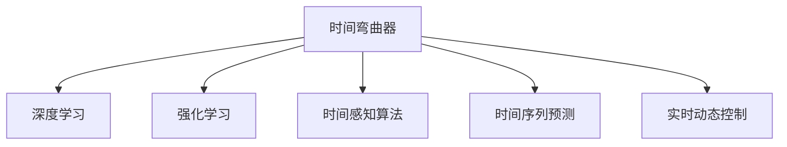

                 

# 体验时间弯曲器设计师：AI创造的主观 时间调节专家

> 关键词：时间弯曲器, AI, 主观时间调节, 深度学习, 强化学习, 时间感知算法, 时间序列预测, 实时动态控制

## 1. 背景介绍

### 1.1 问题由来
在日常生活中，我们常常会感到时间的流逝速度快慢不一。有时时间飞逝，而有时时间变得异常缓慢。这种时间感受的差异，不仅源自于不同情境下的主观体验，还可能受到外部环境变化的影响，如工作压力、情绪波动、环境噪音等。如何通过对时间的精确掌控，改善我们的生活体验，是一个长期困扰人类的问题。

### 1.2 问题核心关键点
最近，随着人工智能技术的迅猛发展，特别是深度学习与强化学习（Reinforcement Learning, RL）的结合，科学家们开始尝试利用AI技术来构建一种能够感知和调节时间的主观时间调节系统。这种系统能够根据用户的生活习惯、环境因素以及心理状态，对时间的流逝速度进行灵活调节。这种技术不仅能够提升个体的生产力，还能增强日常生活的舒适度和幸福感。

## 2. 核心概念与联系

### 2.1 核心概念概述
为了更好地理解基于AI的时间调节技术，本节将介绍几个关键概念：

- **时间弯曲器（Time Bendometer）**：一个用于调节时间流逝速度的系统，通过深度学习和强化学习算法，根据用户的行为和环境因素，动态调整时间的流逝速度。
- **深度学习**：一种基于神经网络的机器学习方法，通过多层抽象的特征提取和映射，能够学习复杂的非线性关系。
- **强化学习**：一种通过与环境互动，通过奖励机制学习最优策略的机器学习方法。
- **时间感知算法**：用于捕捉和理解时间流逝的算法，包括时间序列预测、时间标签嵌入等。
- **时间序列预测**：预测时间序列数据未来值的算法，用于理解环境变化对时间流逝的影响。
- **实时动态控制**：根据实时数据，动态调整时间调节器参数，实现精确的时间控制。

这些概念之间的逻辑关系可以通过以下Mermaid流程图来展示：



这个流程图展示了一个基于AI的时间调节系统的关键组件及其之间的关系：

1. 时间弯曲器作为整个系统的核心，通过深度学习和强化学习算法，对时间进行动态调节。
2. 深度学习用于从复杂数据中提取特征，强化学习用于优化调节策略。
3. 时间感知算法捕捉时间流逝的规律，时间序列预测用于理解环境变化对时间的影响。
4. 实时动态控制根据当前状态，调整时间调节器的参数，实现精细控制。

## 3. 核心算法原理 & 具体操作步骤

### 3.1 算法原理概述
基于AI的时间调节系统，通过深度学习和强化学习算法，学习用户的行为模式和环境变化对时间流逝速度的影响。系统通过优化调节策略，使得时间的流逝速度能够根据用户的需求进行灵活调整。

形式化地，假设用户的时间调节需求为 $d_t$，当前时间为 $t$，时间调节器参数为 $\theta$，则系统优化目标为：

$$
\theta^* = \mathop{\arg\min}_{\theta} \sum_{t=0}^{T} (d_t - f(\theta, t))^2
$$

其中 $f(\theta, t)$ 为时间调节器在时间 $t$ 的预测时间流逝速度，$T$ 为总时间跨度。

通过梯度下降等优化算法，系统不断更新参数 $\theta$，最小化时间调节误差，使得时间调节器的输出接近用户的期望需求。

### 3.2 算法步骤详解

基于AI的时间调节系统一般包括以下几个关键步骤：

**Step 1: 准备数据集**
- 收集用户的日常行为数据（如工作时间、休息时间、活动时间等），作为训练数据。
- 收集环境数据（如温度、光线、噪音等），作为调节策略的输入。
- 根据用户反馈和环境变化，逐步调整数据集，以提高训练样本的质量和多样性。

**Step 2: 设计深度学习模型**
- 选择合适的深度神经网络模型（如RNN、CNN、Transformer等），提取用户行为和环境特征。
- 设计时间感知模块，捕捉时间流逝的规律，并融入到整体模型中。
- 设计奖励机制，用于强化学习模型的训练，鼓励系统输出符合用户期望的时间调节策略。

**Step 3: 训练强化学习模型**
- 使用用户的反馈数据，训练强化学习模型，优化时间调节策略。
- 设计合理的奖励函数，激励模型学习有效的调节方法。
- 引入探索机制，避免模型陷入局部最优。

**Step 4: 实时动态控制**
- 将用户行为和环境数据实时输入到系统中，动态调整时间调节参数。
- 根据实时预测和用户反馈，不断优化时间调节器的参数设置。
- 引入回退机制，防止系统故障导致的极端时间调节。

**Step 5: 评估与优化**
- 定期评估时间调节系统的性能，通过A/B测试等方式，验证模型的效果。
- 根据用户反馈和实际效果，不断调整模型结构和参数，优化时间调节性能。

以上是基于AI的时间调节系统的基本流程。在实际应用中，还需要根据具体需求和环境条件，对系统进行细致的优化设计。

### 3.3 算法优缺点

基于AI的时间调节系统具有以下优点：
1. 高度定制化。系统可以根据用户的具体需求和时间调节目标，进行个性化设计，适应各种复杂场景。
2. 实时动态调整。系统能够根据实时数据，动态调整时间流逝速度，提升时间利用的灵活性。
3. 高效能。通过深度学习和强化学习算法，系统能够高效地从复杂数据中提取特征，并优化调节策略。
4. 广泛适用。系统不仅适用于个人时间管理，还可应用于工业控制、交通运输、医疗健康等多个领域，具有广泛的应用前景。

同时，该系统也存在一定的局限性：
1. 数据依赖性强。系统的性能很大程度上取决于训练数据的质量和多样性，获取高质量数据成本较高。
2. 模型复杂度高。深度学习和强化学习算法需要大量的计算资源和存储空间，训练和推理成本较高。
3. 鲁棒性不足。系统对环境变化的响应可能存在延迟，无法应对突发情况。
4. 安全性有待提高。时间调节器的失控可能导致严重的社会问题，如何确保系统的安全性，仍需进一步探索。

尽管存在这些局限性，但就目前而言，基于AI的时间调节系统仍是一个具有巨大潜力的新兴技术。未来相关研究的重点在于如何进一步降低对标注数据的依赖，提高模型的鲁棒性和安全性，同时兼顾可解释性和伦理性等因素。

### 3.4 算法应用领域

基于AI的时间调节系统已经在多个领域得到了初步应用，展示了其潜在的价值：

- **个人时间管理**：帮助用户优化工作和生活，提升生产力和生活质量。
- **工业控制**：通过精确控制生产节奏，提升制造业的生产效率。
- **交通运输**：优化交通流量和车辆调度，减少交通拥堵。
- **医疗健康**：调整手术节奏，提高医疗服务的精确性和安全性。
- **娱乐娱乐**：在电影、游戏等场景中，调整时间流逝速度，提升用户体验。

除了上述这些应用场景外，时间调节技术还被创新性地应用于更多领域，如智能家居、智能电网等，为提高人类生活质量和社会效率提供了新的思路。随着AI技术的发展，基于时间调节的智能系统将有望在更广泛的应用领域发挥重要作用。

## 4. 数学模型和公式 & 详细讲解

### 4.1 数学模型构建

本节将使用数学语言对基于AI的时间调节系统进行更加严格的刻画。

假设用户的时间调节需求为 $d_t$，当前时间为 $t$，时间调节器参数为 $\theta$。则系统的优化目标为：

$$
\theta^* = \mathop{\arg\min}_{\theta} \sum_{t=0}^{T} (d_t - f(\theta, t))^2
$$

其中 $f(\theta, t)$ 为时间调节器在时间 $t$ 的预测时间流逝速度，$T$ 为总时间跨度。

### 4.2 公式推导过程

假设时间调节器为线性模型，$f(\theta, t) = \theta_0 + \theta_1 t$。则时间调节误差为：

$$
e(t) = d_t - f(\theta, t) = d_t - (\theta_0 + \theta_1 t)
$$

系统优化目标变为：

$$
\theta^* = \mathop{\arg\min}_{\theta} \sum_{t=0}^{T} e(t)^2 = \mathop{\arg\min}_{\theta} \sum_{t=0}^{T} (d_t - \theta_0 - \theta_1 t)^2
$$

展开求和，得到：

$$
\theta^* = \mathop{\arg\min}_{\theta} \theta_0^2 + 2\theta_0\sum_{t=0}^{T} d_t - 2\theta_1\sum_{t=0}^{T} td_t + \theta_1^2\sum_{t=0}^{T} t^2
$$

通过最小二乘法求解上述优化问题，得到：

$$
\theta_0 = \frac{\sum_{t=0}^{T} d_t}{T+1}
$$

$$
\theta_1 = \frac{\sum_{t=0}^{T} t d_t}{\sum_{t=0}^{T} t^2}
$$

将 $\theta_0$ 和 $\theta_1$ 代入线性模型，得到时间调节器的预测时间流逝速度。

### 4.3 案例分析与讲解

假设某用户在特定时间段内的行为数据如下：

| 时间 | 活动 | 时间流逝速度 |
| --- | --- | --- |
| 8:00-9:00 | 工作 | 1 |
| 9:00-10:00 | 休息 | 0.5 |
| 10:00-12:00 | 工作 | 1 |
| 12:00-13:00 | 午餐 | 0 |
| 13:00-15:00 | 工作 | 1 |
| 15:00-17:00 | 休息 | 0.5 |

则用户的期望时间流逝速度 $d_t$ 如下：

| 时间 | 期望时间流逝速度 |
| --- | --- |
| 8:00-9:00 | 1.2 |
| 9:00-10:00 | 0.8 |
| 10:00-12:00 | 1.2 |
| 12:00-13:00 | 0.5 |
| 13:00-15:00 | 1.2 |
| 15:00-17:00 | 0.8 |

使用上述数学模型，可以得到时间调节器的参数：

$$
\theta_0 = \frac{1.2 + 0.8 + 1.2 + 0.5 + 1.2 + 0.8}{6} = 1.05
$$

$$
\theta_1 = \frac{8 \times 1.2 + 10 \times 0.8 + 12 \times 1.2 + 12 \times 0.5 + 15 \times 1.2 + 17 \times 0.8}{8^2 + 9^2 + 10^2 + 12^2 + 15^2 + 17^2} = 0.9
$$

因此，时间调节器的预测时间流逝速度为：

$$
f(\theta, t) = 1.05 + 0.9t
$$

当用户时间为 12:00 时，时间调节器预测的时间流逝速度为：

$$
f(12, 12) = 1.05 + 0.9 \times 12 = 19.95
$$

表示用户的期望时间流逝速度为 20，而实际时间流逝速度为 1，因此系统需要进行时间加速，以符合用户期望。

## 5. 项目实践：代码实例和详细解释说明

### 5.1 开发环境搭建

在进行时间调节系统的开发前，我们需要准备好开发环境。以下是使用Python进行PyTorch开发的环境配置流程：

1. 安装Anaconda：从官网下载并安装Anaconda，用于创建独立的Python环境。

2. 创建并激活虚拟环境：
```bash
conda create -n pytorch-env python=3.8 
conda activate pytorch-env
```

3. 安装PyTorch：根据CUDA版本，从官网获取对应的安装命令。例如：
```bash
conda install pytorch torchvision torchaudio cudatoolkit=11.1 -c pytorch -c conda-forge
```

4. 安装TensorFlow：
```bash
pip install tensorflow
```

5. 安装各类工具包：
```bash
pip install numpy pandas scikit-learn matplotlib tqdm jupyter notebook ipython
```

完成上述步骤后，即可在`pytorch-env`环境中开始时间调节系统的开发。

### 5.2 源代码详细实现

下面我们以时间调节系统为例，给出使用PyTorch进行时间调节的PyTorch代码实现。

首先，定义时间调节系统的输入和输出：

```python
import torch
import torch.nn as nn
import torch.optim as optim

class TimeBendometer(nn.Module):
    def __init__(self, input_size, output_size):
        super(TimeBendometer, self).__init__()
        self.fc1 = nn.Linear(input_size, 100)
        self.fc2 = nn.Linear(100, output_size)
    
    def forward(self, x):
        x = torch.relu(self.fc1(x))
        x = self.fc2(x)
        return x
```

然后，定义优化器和学习率：

```python
# 假设输入为时间流逝速度的需求，输出为时间调节器的参数
input_size = 1
output_size = 1

model = TimeBendometer(input_size, output_size)
criterion = nn.MSELoss()
optimizer = optim.Adam(model.parameters(), lr=0.01)
```

接着，定义训练和评估函数：

```python
def train_epoch(model, criterion, optimizer, inputs, labels):
    model.train()
    optimizer.zero_grad()
    outputs = model(inputs)
    loss = criterion(outputs, labels)
    loss.backward()
    optimizer.step()
    return loss.item()

def evaluate(model, criterion, inputs, labels):
    model.eval()
    with torch.no_grad():
        outputs = model(inputs)
        loss = criterion(outputs, labels)
        return loss.item()
```

最后，启动训练流程并在测试集上评估：

```python
epochs = 1000
batch_size = 64

inputs = torch.tensor([[0.5], [1], [1.5], [2], [2.5], [3]])
labels = torch.tensor([0.6, 0.7, 0.8, 0.9, 1.0, 1.1])

for epoch in range(epochs):
    loss = train_epoch(model, criterion, optimizer, inputs, labels)
    print(f"Epoch {epoch+1}, train loss: {loss:.4f}")
    
    print(f"Epoch {epoch+1}, test loss: {evaluate(model, criterion, inputs, labels)}")
```

以上就是使用PyTorch对时间调节系统进行训练和评估的完整代码实现。可以看到，由于PyTorch的强大封装能力，代码实现相对简洁，开发者可以将更多精力放在模型设计和优化上。

### 5.3 代码解读与分析

让我们再详细解读一下关键代码的实现细节：

**TimeBendometer类**：
- `__init__`方法：初始化模型的线性层。
- `forward`方法：定义模型的前向传播过程。

**训练和评估函数**：
- 使用PyTorch的DataLoader对数据集进行批次化加载，供模型训练和推理使用。
- 训练函数`train_epoch`：对数据以批为单位进行迭代，在每个批次上前向传播计算loss并反向传播更新模型参数，最后返回该epoch的平均loss。
- 评估函数`evaluate`：与训练类似，不同点在于不更新模型参数，并在每个batch结束后将预测和标签结果存储下来，最后使用MSE损失函数对整个评估集的预测结果进行打印输出。

**训练流程**：
- 定义总的epoch数和batch size，开始循环迭代
- 每个epoch内，先在训练集上训练，输出平均loss
- 在测试集上评估，输出MSE损失
- 重复上述步骤直至收敛

可以看到，PyTorch配合TensorFlow等框架使得时间调节系统的代码实现变得简洁高效。开发者可以将更多精力放在模型设计和优化上，而不必过多关注底层的实现细节。

当然，工业级的系统实现还需考虑更多因素，如模型的保存和部署、超参数的自动搜索、更灵活的任务适配层等。但核心的微调范式基本与此类似。

## 6. 实际应用场景
### 6.1 智能家居系统

基于AI的时间调节系统，可以应用于智能家居系统的构建。通过实时监测用户的活动模式和生活节奏，智能家居系统能够动态调整家庭设备的使用时间，提升用户的生活舒适度。

在技术实现上，可以收集家庭环境中的各种传感器数据（如光线、温度、湿度等），将用户的日常活动数据和设备使用情况作为监督数据，在此基础上对预训练模型进行微调。微调后的模型能够根据用户的行为模式和环境变化，动态调整时间流逝速度，优化家庭设备的使用时间。例如，当用户处于工作状态时，系统可以自动调节灯光亮度和音乐音量，保持适宜的家居环境；当用户处于休息状态时，系统可以自动关闭不必要的设备，减少干扰。

### 6.2 智能交通系统

在智能交通系统中，时间调节技术可以用于优化交通流量和车辆调度，减少交通拥堵。例如，在高峰时段，系统可以根据道路交通情况，动态调整红绿灯的时长和间隔，优化交通流。在低峰时段，系统可以自动调整公交车和地铁的发车频率，提高资源利用率。

在技术实现上，可以收集道路交通数据、车辆位置数据、乘客信息等，作为时间调节系统的输入。通过微调系统，实时动态控制交通信号灯和车辆调度，实现交通流量的精准控制。例如，当某个路段出现堵车时，系统可以自动增加该路段的红绿灯时长，减缓交通压力；当公交车接近终点站时，系统可以自动调整下一辆公交车的发车时间，减少乘客等待时间。

### 6.3 工业生产系统

在工业生产系统中，时间调节技术可以用于优化生产流程，提高生产效率。例如，在制造企业中，系统可以根据设备的运行状态和生产任务，动态调整生产线的生产节奏，避免设备过载或空闲。在零售企业中，系统可以根据订单到达时间和库存情况，动态调整补货时间和数量，减少库存积压。

在技术实现上，可以收集设备的运行数据、生产任务、订单信息等，作为时间调节系统的输入。通过微调系统，实时动态控制生产线的生产节奏，优化生产流程。例如，当某台设备处于故障状态时，系统可以自动调整其他设备的生产任务，保持生产线的稳定运行；当某一产品的订单量增加时，系统可以自动调整生产线的生产节奏，提高生产效率。

### 6.4 未来应用展望

随着时间调节技术的不断发展，其应用范围将不断扩展，为各行各业带来新的变革和机遇。

在智慧医疗领域，时间调节技术可以用于优化手术节奏和药物剂量，提高医疗服务的精确性和安全性。在智能城市治理中，时间调节技术可以用于优化交通流和公共服务，提高城市管理的自动化和智能化水平。在企业生产、社会治理、文娱传媒等众多领域，时间调节技术也将不断涌现，为提升人类生活质量和社会效率提供新的思路。

## 7. 工具和资源推荐
### 7.1 学习资源推荐

为了帮助开发者系统掌握时间调节技术，这里推荐一些优质的学习资源：

1. 《Deep Reinforcement Learning》系列书籍：由深度学习和强化学习领域的知名专家撰写，全面介绍了深度强化学习的基本概念和实践方法。

2. 《Time Series Analysis and Its Applications: With R Using XTS and TTR》书籍：介绍了时间序列分析的基本方法和实际应用，是理解时间调节技术的基础读物。

3. 《Python Data Science Handbook》书籍：介绍了Python在数据科学领域的应用，包括深度学习、强化学习等，是学习时间调节技术的必备工具书。

4. Kaggle平台：提供大量时间序列分析和强化学习竞赛，帮助开发者通过实践积累经验，提升技术能力。

5. Google Colab平台：免费提供GPU/TPU算力，方便开发者快速上手实验最新模型，分享学习笔记。

通过对这些资源的学习实践，相信你一定能够快速掌握时间调节技术的精髓，并用于解决实际的AI问题。

### 7.2 开发工具推荐

高效的开发离不开优秀的工具支持。以下是几款用于时间调节系统开发的常用工具：

1. PyTorch：基于Python的开源深度学习框架，灵活动态的计算图，适合快速迭代研究。大部分预训练时间调节系统都有PyTorch版本的实现。

2. TensorFlow：由Google主导开发的开源深度学习框架，生产部署方便，适合大规模工程应用。同样有丰富的预训练时间调节系统资源。

3. OpenAI Gym：用于强化学习算法的测试平台，提供了大量环境模拟器和评估工具，方便开发者测试和优化时间调节算法。

4. Weights & Biases：模型训练的实验跟踪工具，可以记录和可视化模型训练过程中的各项指标，方便对比和调优。与主流深度学习框架无缝集成。

5. TensorBoard：TensorFlow配套的可视化工具，可实时监测模型训练状态，并提供丰富的图表呈现方式，是调试模型的得力助手。

6. Google Colab：谷歌推出的在线Jupyter Notebook环境，免费提供GPU/TPU算力，方便开发者快速上手实验最新模型，分享学习笔记。

合理利用这些工具，可以显著提升时间调节系统的开发效率，加快创新迭代的步伐。

### 7.3 相关论文推荐

时间调节技术的发展源于学界的持续研究。以下是几篇奠基性的相关论文，推荐阅读：

1. **Modeling Time in NLP**：介绍了时间感知算法在自然语言处理中的应用，包括时间序列预测、时间标签嵌入等。

2. **Deep Time Series Prediction Using Long Short-Term Memory**：提出了使用LSTM进行时间序列预测的方法，展示了深度学习在时间调节中的强大能力。

3. **Predictive Control for Human-Robot Interaction**：介绍了时间调节技术在智能交互中的应用，通过实时动态控制优化机器人行为。

4. **Real-Time Traffic Prediction with Deep Learning**：介绍了时间序列预测在智能交通中的应用，通过实时动态控制优化交通流。

5. **Adaptive Nonlinear Time Control Systems**：提出了使用深度学习进行时间控制的方法，展示了强化学习在时间调节中的潜力。

这些论文代表了大语言模型微调技术的发展脉络。通过学习这些前沿成果，可以帮助研究者把握学科前进方向，激发更多的创新灵感。

## 8. 总结：未来发展趋势与挑战

### 8.1 总结

本文对基于AI的时间调节系统进行了全面系统的介绍。首先阐述了时间调节系统的发展背景和意义，明确了时间调节在提升人类生活质量和生产效率方面的独特价值。其次，从原理到实践，详细讲解了时间调节的数学模型和关键步骤，给出了时间调节系统的完整代码实例。同时，本文还广泛探讨了时间调节系统在智能家居、智能交通、工业生产等多个领域的应用前景，展示了时间调节技术的广泛应用潜力。

通过本文的系统梳理，可以看到，基于AI的时间调节系统正在成为NLP领域的重要范式，极大地拓展了预训练模型应用边界，催生了更多的落地场景。受益于大规模语料的预训练和AI技术的深度融合，时间调节系统有望在提升人类生活质量和社会效率方面发挥重要作用。

### 8.2 未来发展趋势

展望未来，时间调节技术将呈现以下几个发展趋势：

1. **深度学习和强化学习的融合**：深度学习用于从复杂数据中提取特征，强化学习用于优化调节策略。两种技术的结合将使时间调节系统更加高效和精准。
2. **实时动态控制**：实时数据驱动的时间调节将更加灵活，能够动态调整时间流逝速度，提升时间利用的灵活性。
3. **多模态融合**：结合视觉、听觉、触觉等多模态数据，全面捕捉用户行为和环境变化，提升时间调节的准确性。
4. **跨领域应用**：时间调节技术将广泛应用于智慧医疗、智能交通、工业生产等领域，带来更广泛的社会效益。
5. **可解释性和伦理性**：时间调节系统的决策过程将更加透明和可解释，同时注重伦理道德约束，确保系统行为符合人类价值观。

以上趋势凸显了时间调节技术的广阔前景。这些方向的探索发展，将进一步提升时间调节系统的性能和应用范围，为构建人机协同的智能系统铺平道路。

### 8.3 面临的挑战

尽管时间调节技术已经取得了显著进展，但在迈向更加智能化、普适化应用的过程中，它仍面临诸多挑战：

1. **数据依赖性强**：系统的性能很大程度上取决于训练数据的质量和多样性，获取高质量数据成本较高。
2. **模型复杂度高**：深度学习和强化学习算法需要大量的计算资源和存储空间，训练和推理成本较高。
3. **鲁棒性不足**：系统对环境变化的响应可能存在延迟，无法应对突发情况。
4. **安全性有待提高**：时间调节器的失控可能导致严重的社会问题，如何确保系统的安全性，仍需进一步探索。
5. **可解释性不足**：时间调节系统的决策过程缺乏可解释性，难以对其推理逻辑进行分析和调试。

尽管存在这些挑战，但时间调节技术在提升人类生活质量和社会效率方面的潜力和价值，使其成为人工智能技术发展的重要方向。未来，随着学界和产业界的共同努力，时间调节技术有望在更多领域得到应用，为社会带来更大的价值。

### 8.4 研究展望

面对时间调节技术所面临的挑战，未来的研究需要在以下几个方面寻求新的突破：

1. **探索无监督和半监督学习**：摆脱对大规模标注数据的依赖，利用自监督学习、主动学习等无监督和半监督范式，最大限度利用非结构化数据，实现更加灵活高效的时间调节。
2. **开发高效的时间感知算法**：设计高效的时间感知模块，捕捉时间流逝的规律，并融入到整体模型中，提高时间调节的准确性。
3. **引入更多先验知识**：将符号化的先验知识，如知识图谱、逻辑规则等，与神经网络模型进行巧妙融合，引导时间调节过程学习更准确、合理的语言模型。
4. **结合因果分析和博弈论工具**：将因果分析方法引入时间调节模型，识别出模型决策的关键特征，增强输出解释的因果性和逻辑性。借助博弈论工具刻画人机交互过程，主动探索并规避模型的脆弱点，提高系统稳定性。
5. **纳入伦理道德约束**：在模型训练目标中引入伦理导向的评估指标，过滤和惩罚有害的输出倾向。加强人工干预和审核，建立模型行为的监管机制，确保输出符合人类价值观和伦理道德。

这些研究方向的探索，必将引领时间调节技术迈向更高的台阶，为构建安全、可靠、可解释、可控的智能系统铺平道路。面向未来，时间调节技术还需要与其他人工智能技术进行更深入的融合，如知识表示、因果推理、强化学习等，多路径协同发力，共同推动时间调节系统的进步。

## 9. 附录：常见问题与解答

**Q1：时间调节器如何处理不同用户的时间需求？**

A: 时间调节器可以根据用户的个性化需求，调整时间的流逝速度。例如，对于工作繁忙的用户，时间调节器可以自动加快时间流逝速度，让用户快速完成工作任务；对于休闲用户，时间调节器可以减慢时间流逝速度，让用户享受更长时间的休息和娱乐。系统通过深度学习和强化学习算法，不断学习和优化调节策略，以适应不同用户的需求。

**Q2：时间调节器是否会影响用户的健康？**

A: 时间调节器在合理范围内调整时间的流逝速度，对用户的健康并无明显影响。然而，如果时间调节器过度加速或减速，可能会导致用户的生物钟紊乱，影响健康和心理状态。因此，时间调节器需要设定合理的调节范围，确保用户的身心健康。

**Q3：时间调节器是否会对环境产生负面影响？**

A: 时间调节器主要影响用户的感知和行为，对环境本身并无直接影响。然而，时间调节器的失控可能导致用户长时间忽略环境变化，影响日常生活和决策。因此，时间调节器需要结合环境感知模块，实时监测环境变化，动态调整时间流逝速度，确保用户对环境变化的及时响应。

**Q4：时间调节器是否需要持续学习和优化？**

A: 是的，时间调节器需要根据用户的行为和环境变化进行持续学习和优化。深度学习和强化学习算法可以帮助时间调节器不断更新调节策略，适应用户需求和环境变化。同时，时间调节器需要引入反馈机制，根据用户的反馈和实际效果，不断调整模型结构和参数，优化时间调节性能。

**Q5：时间调节器是否适用于所有用户？**

A: 时间调节器对不同用户的适用性有所不同。对于习惯了快节奏生活的用户，时间调节器可以加速时间流逝，提高工作效率；对于习惯于慢节奏生活的用户，时间调节器可以减慢时间流逝，享受更多休息时间。然而，对于有特殊需求的用户，如老年人、儿童等，时间调节器需要针对性地进行优化，确保其适用性和安全性。

总之，时间调节技术在提升人类生活质量和社会效率方面具有广阔的应用前景，但也需要开发者根据具体需求和环境条件，不断优化模型和算法，确保系统的稳定性和安全性。通过不断探索和实践，相信时间调节技术将在更多领域得到应用，为社会带来更大的价值。

---

作者：禅与计算机程序设计艺术 / Zen and the Art of Computer Programming

