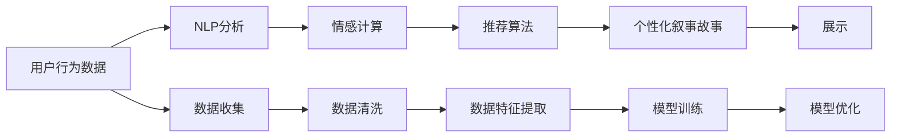

                 

# 体验的个人化叙事：AI驱动的生活故事

> 关键词：人工智能，个性化推荐，用户行为分析，自然语言处理，情感计算，情感分析

## 1. 背景介绍

### 1.1 问题由来
在当今数字化时代，人工智能(AI)技术正在深入到我们的日常生活和工作中。从智能音箱、智能手机到智能家居，无处不在的AI应用正在改变我们的生活方式。然而，随着AI技术的发展，人们对于个性化体验的需求也日益增长。如何将AI技术与个性化需求有机结合，成为当前科技前沿的重要课题。

个性化推荐系统作为AI技术的一个重要分支，通过对用户行为数据的分析，为用户推荐个性化内容，提高用户满意度和粘性。传统推荐系统主要基于用户历史行为数据，但难以捕捉用户真实偏好和潜在的兴趣变化。而结合自然语言处理(NLP)、情感计算等技术的个性化叙事系统，能够深入挖掘用户深层次的需求，提供更加精准和自然的人机交互体验。

### 1.2 问题核心关键点
个性化叙事系统利用自然语言处理和情感计算技术，通过对用户行为数据和自然语言文本的深度分析，构建用户个性化的叙事故事。这种系统不仅能推荐内容，还能生成自然流畅的文本，讲述用户的生活故事，使得AI驱动的生活体验更加丰富和个性化。

核心问题在于：
1. 如何从大量用户数据中提取出有用的信息？
2. 如何利用情感计算技术理解和生成情感丰富的文本？
3. 如何保证用户隐私和数据安全？

## 2. 核心概念与联系

### 2.1 核心概念概述

为了更好地理解AI驱动的个性化叙事系统，我们首先介绍几个关键概念：

- 自然语言处理(Natural Language Processing, NLP)：利用计算机技术处理和理解人类语言的技术，包括文本预处理、语言模型、情感分析等。
- 情感计算(Affective Computing)：利用AI技术理解、识别和生成人类情感，涉及情感识别、情感生成等子任务。
- 个性化推荐系统：根据用户行为数据和特征，为用户推荐个性化内容的技术，包括协同过滤、基于内容的推荐、深度学习推荐等方法。
- 用户行为数据：用户在平台上的浏览、搜索、购买等行为数据，是个性化推荐系统的重要数据来源。
- 推荐引擎：负责根据用户行为数据和特征，输出个性化推荐结果的系统，可以基于规则、基于内容的推荐、深度学习推荐等。

这些概念之间通过数据分析、建模和优化等环节紧密联系。NLP技术和情感计算技术是构建个性化推荐系统的基础，而个性化推荐系统则提供了解析用户需求和行为的工具。用户行为数据是整个系统的输入，最终通过推荐引擎输出个性化内容，并构建个性化叙事故事。

### 2.2 核心概念原理和架构的 Mermaid 流程图



这个流程图展示了从数据收集、清洗、特征提取、模型训练到展示的全流程。用户行为数据通过NLP分析和情感计算技术，得到用户兴趣和情感特征，并输入到推荐算法中生成个性化内容，最终构建出个性化叙事故事。

## 3. 核心算法原理 & 具体操作步骤

### 3.1 算法原理概述

个性化叙事系统基于用户行为数据和自然语言处理技术，通过情感计算技术生成情感丰富的文本，为用户提供个性化体验。其核心算法包括以下几个步骤：

1. 数据收集：从用户平台收集行为数据，包括浏览记录、搜索关键词、购买行为等。
2. NLP预处理：对收集到的数据进行预处理，如分词、去除停用词、词性标注等。
3. 特征提取：从预处理后的数据中提取关键特征，如用户兴趣标签、情感极性等。
4. 情感计算：利用情感计算技术，对用户文本数据进行情感分析，得到情感评分。
5. 推荐算法：结合用户特征和情感评分，使用推荐算法生成个性化推荐结果。
6. 叙事生成：利用生成式模型，根据用户兴趣和情感生成情感丰富的叙事故事。

### 3.2 算法步骤详解

#### 3.2.1 数据收集

数据收集是个性化叙事系统的基础。用户行为数据可以从各种渠道获取，包括浏览器、应用、社交媒体等。这些数据经过清洗和预处理后，成为推荐算法和叙事生成的输入。

#### 3.2.2 NLP预处理

自然语言处理技术是个性化叙事系统的核心。对于收集到的文本数据，需要经过分词、去除停用词、词性标注等预处理步骤。预处理后的文本数据可以输入到情感计算和推荐算法中，进行进一步分析。

#### 3.2.3 特征提取

特征提取是从预处理后的文本数据中提取关键特征的过程。特征可以包括用户兴趣标签、情感极性、话题等。这些特征是推荐算法和叙事生成的重要输入。

#### 3.2.4 情感计算

情感计算利用AI技术理解、识别和生成人类情感。对于用户文本数据，情感计算模型可以输出情感评分，表示用户情感极性和情感强度。情感计算的准确性直接影响叙事的情感表达。

#### 3.2.5 推荐算法

推荐算法是个性化叙事系统的核心，负责根据用户特征和情感评分，生成个性化推荐结果。推荐算法可以基于协同过滤、基于内容的推荐、深度学习推荐等。推荐算法输出的内容可以是文本、图片、视频等。

#### 3.2.6 叙事生成

叙事生成利用生成式模型，根据用户兴趣和情感生成情感丰富的叙事故事。常用的生成式模型包括Seq2Seq、GPT、BERT等。叙事生成的文本可以是短文、段落、故事等，用于展示个性化推荐结果。

### 3.3 算法优缺点

个性化叙事系统具有以下优点：
1. 提升用户体验：个性化叙事系统能够根据用户兴趣和情感生成个性化内容，提升用户满意度和粘性。
2. 丰富内容形式：叙事的生成使得推荐结果不仅限于文字，可以包括图片、视频等多媒体内容，丰富用户体验。
3. 多样化应用场景：个性化叙事系统可以应用于新闻推荐、社交媒体、电商等多个领域，具有广泛的应用前景。

同时，该系统也存在一些缺点：
1. 数据隐私问题：用户行为数据涉及隐私问题，需要在数据收集和处理过程中保证用户隐私。
2. 数据质量和标注问题：用户行为数据的准确性和标注的完备性直接影响推荐和叙事的效果。
3. 计算资源需求高：个性化叙事系统涉及大量文本处理和情感计算，对计算资源的需求较高。

### 3.4 算法应用领域

个性化叙事系统已经在多个领域得到了应用，例如：

- 新闻推荐系统：根据用户历史阅读记录和情感评分，推荐个性化新闻文章。
- 社交媒体平台：根据用户互动行为和情感分析，推荐个性化内容。
- 电商平台：根据用户购买行为和情感评分，推荐个性化商品和营销活动。
- 旅游推荐系统：根据用户历史浏览记录和情感评分，推荐个性化旅游路线和景点。

这些应用场景展示了个性化叙事系统在提升用户体验和丰富内容形式方面的强大能力。未来，随着技术的不断进步，个性化叙事系统将能够应用于更多领域，为各行各业带来变革性影响。

## 4. 数学模型和公式 & 详细讲解 & 举例说明

### 4.1 数学模型构建

我们以一个简单的文本情感分类模型为例，介绍数学模型的构建过程。假设文本数据为 $x=(x_1, x_2, ..., x_n)$，情感分类器为 $y=(y_1, y_2, ..., y_n)$，其中 $y_i \in \{0,1\}$，表示文本 $x_i$ 的情感极性，0表示负面，1表示正面。

我们的目标是最小化分类错误率，即最小化损失函数：

$$
\mathcal{L} = \frac{1}{N} \sum_{i=1}^N \mathbb{I}(y_i \neq f(x_i))
$$

其中 $\mathbb{I}(y_i \neq f(x_i))$ 表示分类错误的情况。我们使用的分类器 $f$ 是一个基于深度神经网络的情感分类器。

### 4.2 公式推导过程

对于一个深度神经网络分类器，其输出可以表示为 $f(x) = \sigma(Wx + b)$，其中 $\sigma$ 为激活函数，$W$ 为权重矩阵，$b$ 为偏置向量。对于二分类任务，我们通常使用 sigmoid 函数作为激活函数，即 $\sigma(z) = \frac{1}{1 + e^{-z}}$。

将 $f(x)$ 代入损失函数中，我们得到：

$$
\mathcal{L} = \frac{1}{N} \sum_{i=1}^N \mathbb{I}(y_i \neq \sigma(Wx_i + b))
$$

为了优化分类器的损失函数，我们通常使用梯度下降算法，计算损失函数对模型参数的梯度，并更新模型参数。优化过程可以表示为：

$$
W \leftarrow W - \eta \nabla_{W}\mathcal{L}, \quad b \leftarrow b - \eta \nabla_{b}\mathcal{L}
$$

其中 $\eta$ 为学习率。

### 4.3 案例分析与讲解

以一篇情感分析文章为例，介绍如何利用深度神经网络进行情感分类。假设我们有一篇新闻文章，内容如下：

```
疫情爆发期间，各国政府采取了多种措施应对疫情，其中包括封锁城市、关闭学校和限制人员流动等。尽管这些措施带来了很多不便，但它们有效遏制了疫情的蔓延。
```

我们将文章输入到预训练的BERT模型中，进行分词和向量化处理，得到文本向量 $x$。然后将其输入到情感分类器中，得到分类结果 $y$。具体的数学推导过程如下：

假设情感分类器为 $f(x) = \sigma(Wx + b)$，其中 $W$ 和 $b$ 为模型参数。对于上面的新闻文章，我们可以得到文本向量 $x$ 和分类结果 $y=1$（正面情感）。

将 $x$ 输入到分类器中，我们得到：

$$
f(x) = \sigma(Wx + b) = \sigma(Wx + b)
$$

假设 $\sigma(z) = \frac{1}{1 + e^{-z}}$，则：

$$
f(x) = \frac{1}{1 + e^{-Wx - b}}
$$

将 $y=1$ 代入损失函数中，我们得到：

$$
\mathcal{L} = \frac{1}{N} \mathbb{I}(y_i \neq f(x_i)) = \frac{1}{N} \mathbb{I}(1 \neq f(x))
$$

因此，我们得到梯度下降算法的更新公式：

$$
W \leftarrow W - \eta \nabla_{W}\mathcal{L}, \quad b \leftarrow b - \eta \nabla_{b}\mathcal{L}
$$

通过不断迭代更新模型参数，我们可以得到一个精确度较高的情感分类器，用于后续的个性化叙事生成。

## 5. 项目实践：代码实例和详细解释说明

### 5.1 开发环境搭建

在进行项目实践前，我们需要准备好开发环境。以下是使用Python进行TensorFlow开发的环境配置流程：

1. 安装Anaconda：从官网下载并安装Anaconda，用于创建独立的Python环境。

2. 创建并激活虚拟环境：
```bash
conda create -n tf-env python=3.8 
conda activate tf-env
```

3. 安装TensorFlow：根据CUDA版本，从官网获取对应的安装命令。例如：
```bash
conda install tensorflow tensorflow-cpu -c conda-forge
```

4. 安装TensorBoard：用于可视化训练过程和结果。
```bash
pip install tensorboard
```

5. 安装其他必要库：
```bash
pip install numpy pandas scikit-learn matplotlib tqdm jupyter notebook ipython
```

完成上述步骤后，即可在`tf-env`环境中开始项目实践。

### 5.2 源代码详细实现

下面我们以情感分类任务为例，给出使用TensorFlow实现情感分类模型的代码实现。

```python
import tensorflow as tf
from tensorflow.keras.datasets import imdb
from tensorflow.keras.preprocessing import sequence

# 加载IMDB电影评论数据集
(x_train, y_train), (x_test, y_test) = imdb.load_data(num_words=10000)

# 数据预处理
x_train = sequence.pad_sequences(x_train, maxlen=100)
x_test = sequence.pad_sequences(x_test, maxlen=100)

# 构建情感分类器
model = tf.keras.Sequential([
    tf.keras.layers.Embedding(input_dim=10000, output_dim=128),
    tf.keras.layers.Flatten(),
    tf.keras.layers.Dense(256, activation='relu'),
    tf.keras.layers.Dense(1, activation='sigmoid')
])

# 编译模型
model.compile(optimizer='adam', loss='binary_crossentropy', metrics=['accuracy'])

# 训练模型
model.fit(x_train, y_train, epochs=5, batch_size=32, validation_data=(x_test, y_test))

# 评估模型
model.evaluate(x_test, y_test)
```

### 5.3 代码解读与分析

**代码说明**：
1. 导入TensorFlow和必要的库。
2. 加载IMDB电影评论数据集，并将其分成训练集和测试集。
3. 对数据进行预处理，将文本数据转换为固定长度的序列。
4. 构建情感分类器，包含嵌入层、全连接层和sigmoid激活函数。
5. 编译模型，并指定优化器、损失函数和评估指标。
6. 训练模型，并使用测试集进行评估。

**代码分析**：
- `sequence.pad_sequences`：用于将文本序列填充到固定长度，以便于模型处理。
- `tf.keras.layers.Embedding`：用于将文本转换为向量表示，是情感分类的关键组件。
- `tf.keras.layers.Flatten`：用于将高维张量展平为一维向量，方便全连接层处理。
- `tf.keras.layers.Dense`：用于构建全连接层，其中256个神经元使用ReLU激活函数。
- `tf.keras.layers.Dense`：用于构建输出层，使用sigmoid激活函数输出情感分类结果。
- `model.compile`：用于编译模型，指定优化器、损失函数和评估指标。
- `model.fit`：用于训练模型，指定训练轮数和批量大小。
- `model.evaluate`：用于评估模型，计算模型在测试集上的准确率。

## 6. 实际应用场景

### 6.1 智能客服系统

智能客服系统是个性化叙事系统的重要应用场景之一。传统的客服系统依赖人工处理客户咨询，效率低下且一致性难以保证。而个性化叙事系统可以通过自然语言处理和情感计算技术，自动理解和回应客户咨询，提供高效、个性化的服务。

具体实现过程如下：
1. 收集历史客服对话记录，并对其进行自然语言处理，提取出关键信息。
2. 利用情感计算技术，对客户咨询进行情感分析，判断客户情绪。
3. 根据客户咨询和情感信息，利用推荐算法生成个性化回答。
4. 利用生成式模型，生成自然流畅的回复，增强客户体验。

### 6.2 金融舆情监测

金融舆情监测是个性化叙事系统的另一个重要应用场景。金融领域对于实时舆情监测的需求十分强烈，能够帮助金融机构及时应对负面信息，规避风险。

具体实现过程如下：
1. 收集金融新闻和社交媒体评论，进行自然语言处理和情感分析。
2. 利用情感计算技术，判断舆情情绪。
3. 根据舆情情绪和关键词，利用推荐算法生成预警信息。
4. 利用生成式模型，生成预警信息，帮助金融机构及时应对。

### 6.3 个性化推荐系统

个性化推荐系统是情感计算技术的典型应用之一。基于情感计算的推荐系统能够深入挖掘用户情感，生成情感丰富的推荐内容，提高用户满意度和粘性。

具体实现过程如下：
1. 收集用户历史行为数据，并进行自然语言处理和情感分析。
2. 利用情感计算技术，判断用户情感极性和情感强度。
3. 根据用户情感信息和兴趣标签，利用推荐算法生成个性化推荐结果。
4. 利用生成式模型，生成个性化推荐文本，提升用户体验。

### 6.4 未来应用展望

随着技术的不断进步，个性化叙事系统将拓展到更多领域，带来更丰富的人机交互体验。

- 医疗健康：基于个性化叙事系统，可以构建智能健康顾问，为用户提供健康建议和心理支持。
- 旅游出行：利用个性化叙事系统，可以生成个性化的旅游路线和行程建议，提升用户旅游体验。
- 教育和培训：基于个性化叙事系统，可以构建智能教育平台，为用户提供个性化学习内容和路径。

未来，个性化叙事系统将会在更多领域得到应用，为人类带来更加丰富和智能的生活体验。

## 7. 工具和资源推荐

### 7.1 学习资源推荐

为了帮助开发者系统掌握情感计算和个性化推荐技术，这里推荐一些优质的学习资源：

1. 《自然语言处理综述与实践》系列博文：由自然语言处理专家撰写，深入浅出地介绍了NLP技术和情感计算的最新进展。
2. Coursera《自然语言处理与深度学习》课程：由斯坦福大学开设的NLP明星课程，涵盖NLP和情感计算的基础知识和前沿技术。
3. 《深度学习情感分析》书籍：介绍了情感分析的算法和技术，并提供了大量实践案例。
4. PyTorch官方文档：提供了丰富的情感计算和推荐算法的样例代码，是学习的必备资料。
5. Kaggle情感分析竞赛：通过实际项目实践，提升情感分析模型的构建和优化能力。

通过学习这些资源，相信你一定能够掌握情感计算和个性化推荐技术的精髓，并将其应用于实际项目中。

### 7.2 开发工具推荐

高效的开发离不开优秀的工具支持。以下是几款用于情感计算和推荐系统开发的常用工具：

1. TensorFlow：基于Python的开源深度学习框架，灵活动态的计算图，适合快速迭代研究。
2. PyTorch：灵活的深度学习框架，提供了丰富的NLP和情感计算库。
3. TensorBoard：用于可视化训练过程和结果，帮助调试和优化模型。
4. Keras：高级神经网络API，易于使用的深度学习框架。
5. NLTK：自然语言处理库，提供了丰富的NLP工具和数据集。

合理利用这些工具，可以显著提升情感计算和推荐系统的开发效率，加快创新迭代的步伐。

### 7.3 相关论文推荐

情感计算和个性化推荐技术的发展源于学界的持续研究。以下是几篇奠基性的相关论文，推荐阅读：

1. Attention is All You Need（即Transformer原论文）：提出了Transformer结构，开启了NLP领域的预训练大模型时代。
2. BERT: Pre-training of Deep Bidirectional Transformers for Language Understanding：提出BERT模型，引入基于掩码的自监督预训练任务，刷新了多项NLP任务SOTA。
3. Deep Sentiment Analysis using a Hybrid of Lexicon and Machine Learning：提出了一种结合词典和机器学习的情感分析方法，成为情感分析领域的经典之作。
4. A Unified Approach to Transfer Learning for Named Entity Recognition：提出了一种基于迁移学习的命名实体识别方法，显著提高了模型效果。
5. Training a Text Generation Model with Limitations as Informative Priors：提出了一种利用限制作为先验知识的文本生成方法，适用于生成情感丰富的叙事故事。

这些论文代表了大语言模型微调技术的发展脉络。通过学习这些前沿成果，可以帮助研究者把握学科前进方向，激发更多的创新灵感。

## 8. 总结：未来发展趋势与挑战

### 8.1 总结

本文对AI驱动的个性化叙事系统进行了全面系统的介绍。首先阐述了情感计算和个性化推荐系统在提升用户体验方面的重要价值，明确了情感计算和推荐算法在构建个性化叙事故事中的核心作用。其次，从原理到实践，详细讲解了情感计算和推荐算法的数学原理和关键步骤，给出了推荐系统开发的完整代码实例。同时，本文还广泛探讨了情感计算和推荐系统在智能客服、金融舆情、个性化推荐等多个行业领域的应用前景，展示了情感计算和推荐算法的强大能力。

通过本文的系统梳理，可以看到，情感计算和个性化推荐技术正在成为AI技术的重要范式，极大地提升人机交互体验和应用效果。未来，伴随情感计算和推荐算法的不断进步，AI驱动的个性化叙事系统必将在更多领域得到应用，为各行各业带来变革性影响。

### 8.2 未来发展趋势

展望未来，情感计算和个性化推荐技术将呈现以下几个发展趋势：

1. 技术不断成熟：随着深度学习模型的不断发展，情感计算和推荐算法的准确性将不断提高，推荐系统的个性化程度也将不断增强。
2. 应用场景更加丰富：情感计算和个性化推荐技术将拓展到更多领域，如医疗健康、旅游出行、教育和培训等，带来更加丰富和智能的生活体验。
3. 多模态融合：未来的推荐系统将结合视觉、语音等多模态信息，提高模型的感知能力和泛化能力。
4. 模型透明性增强：情感计算和推荐算法的透明度将不断提高，用户将能够理解和解释模型的决策过程。
5. 伦理和隐私问题受到重视：未来推荐系统将更加注重伦理和隐私问题，保护用户数据和隐私，确保系统的公平性和安全性。

这些趋势展示了情感计算和个性化推荐技术的广阔前景。这些方向的探索发展，必将进一步提升人机交互的智能化水平，为人类带来更加便捷和舒适的生活体验。

### 8.3 面临的挑战

尽管情感计算和个性化推荐技术已经取得了瞩目成就，但在迈向更加智能化、普适化应用的过程中，它仍面临着诸多挑战：

1. 数据隐私问题：用户行为数据涉及隐私问题，如何在数据收集和处理过程中保护用户隐私是一个重要挑战。
2. 数据质量和标注问题：用户行为数据的准确性和标注的完备性直接影响推荐和叙事的效果，如何提高数据质量是一个难题。
3. 模型鲁棒性不足：情感计算和推荐算法的鲁棒性不足，容易受到噪声和干扰的影响，需要进一步优化模型。
4. 计算资源需求高：情感计算和推荐算法的计算资源需求高，如何优化模型结构和计算效率是一个重要课题。
5. 模型透明度不足：情感计算和推荐算法的透明度不足，用户难以理解和解释模型的决策过程。

### 8.4 研究展望

面对情感计算和个性化推荐技术所面临的种种挑战，未来的研究需要在以下几个方面寻求新的突破：

1. 探索无监督和半监督推荐方法。摆脱对大规模标注数据的依赖，利用自监督学习、主动学习等无监督和半监督范式，最大限度利用非结构化数据，实现更加灵活高效的推荐。
2. 研究参数高效和计算高效的推荐范式。开发更加参数高效的推荐方法，在固定大部分预训练参数的同时，只更新极少量的任务相关参数。同时优化推荐模型的计算图，减少前向传播和反向传播的资源消耗，实现更加轻量级、实时性的部署。
3. 引入更多先验知识。将符号化的先验知识，如知识图谱、逻辑规则等，与神经网络模型进行巧妙融合，引导推荐过程学习更准确、合理的语言模型。同时加强不同模态数据的整合，实现视觉、语音等多模态信息与文本信息的协同建模。
4. 结合因果分析和博弈论工具。将因果分析方法引入推荐模型，识别出推荐决策的关键特征，增强推荐过程的因果性和逻辑性。借助博弈论工具刻画用户与系统的交互过程，主动探索并规避系统的脆弱点，提高系统稳定性。
5. 纳入伦理道德约束。在推荐目标中引入伦理导向的评估指标，过滤和惩罚有偏见、有害的推荐结果。同时加强人工干预和审核，建立推荐行为的监管机制，确保推荐结果符合人类价值观和伦理道德。

这些研究方向的探索，必将引领情感计算和个性化推荐技术迈向更高的台阶，为构建安全、可靠、可解释、可控的智能系统铺平道路。面向未来，情感计算和个性化推荐技术还需要与其他人工智能技术进行更深入的融合，如知识表示、因果推理、强化学习等，多路径协同发力，共同推动自然语言理解和智能交互系统的进步。只有勇于创新、敢于突破，才能不断拓展情感计算和推荐算法的边界，让智能技术更好地造福人类社会。

## 9. 附录：常见问题与解答

**Q1：情感计算和个性化推荐系统是否适用于所有NLP任务？**

A: 情感计算和个性化推荐系统主要适用于需要情感理解和推荐的NLP任务，如情感分析、命名实体识别、问答系统等。但对于一些需要大量文本生成能力的任务，如机器翻译、文本摘要等，情感计算和个性化推荐系统可能不是最佳选择。

**Q2：如何提高情感计算模型的准确性？**

A: 提高情感计算模型的准确性可以从以下几个方面入手：
1. 使用更强大的模型：如BERT、GPT等预训练模型，可以提升情感分析的准确性。
2. 增加训练数据量：通过收集更多的情感标注数据，进行模型微调。
3. 引入多模态信息：将文本、图片、语音等多种模态信息融合，提升情感计算的泛化能力。
4. 优化模型结构：引入注意力机制、多层次网络结构等，提升模型的感知能力和泛化能力。

**Q3：如何保护用户隐私和数据安全？**

A: 保护用户隐私和数据安全可以从以下几个方面入手：
1. 数据匿名化：在数据收集和处理过程中，对用户数据进行匿名化处理。
2. 数据加密：对用户数据进行加密存储和传输，防止数据泄露。
3. 用户控制：让用户能够控制自己的数据使用权限，保护用户隐私。
4. 法律法规遵守：严格遵守相关法律法规，保护用户数据安全。

**Q4：推荐算法的计算资源需求高，如何优化？**

A: 优化推荐算法的计算资源需求可以从以下几个方面入手：
1. 参数高效推荐方法：如AdaLoRA等参数高效推荐方法，在固定大部分预训练参数的同时，只更新极少量的任务相关参数。
2. 模型并行：利用多GPU/TPU等硬件设备，实现模型并行，加速推荐过程。
3. 混合精度训练：将浮点模型转为定点模型，压缩存储空间，提高计算效率。
4. 模型压缩：使用剪枝、量化等技术，减小模型规模，降低计算资源需求。

**Q5：如何提升推荐系统的鲁棒性？**

A: 提升推荐系统的鲁棒性可以从以下几个方面入手：
1. 数据清洗：对用户数据进行清洗，去除噪声和异常值，提高数据质量。
2. 模型正则化：使用L2正则、Dropout等技术，防止模型过拟合。
3. 多模型集成：训练多个推荐模型，取平均输出，抑制过拟合。
4. 对抗训练：加入对抗样本，提高模型鲁棒性。

这些优化措施将帮助推荐系统提高鲁棒性，适应各种复杂的用户需求和场景。

---

作者：禅与计算机程序设计艺术 / Zen and the Art of Computer Programming

