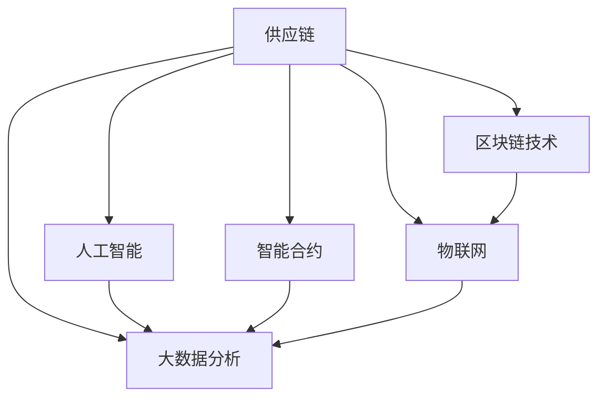

                 

# 供应链金融：未来赚钱的另一种方式

> 关键词：供应链金融, 未来赚钱方式, 金融科技, 供应链管理, 区块链技术, 人工智能, 智能合约

## 1. 背景介绍

### 1.1 问题由来

随着全球经济一体化的深入和信息技术的快速发展，供应链金融成为企业拓宽融资渠道、降低运营成本、提升资金效率的重要手段。传统供应链金融模式依赖于银行等中介机构进行信用评估、风险控制和资金结算，流程繁琐、效率低下，且存在较高的信任成本。而随着区块链、人工智能、物联网等新兴技术的涌现，基于这些技术的供应链金融创新模式应运而生，为供应链管理带来了新的变革。

### 1.2 问题核心关键点

供应链金融的创新模式主要围绕以下几点展开：

- **区块链技术**：作为去中心化的信任机制，区块链可以有效减少中间环节，降低交易成本，提高供应链各参与方的信任度。
- **人工智能**：通过大数据分析和机器学习，提高供应链的智能化水平，实现供应链风险的精准预测和控制。
- **智能合约**：利用区块链和人工智能技术，自动执行合同条款，减少人工操作，提高合同执行的透明度和效率。
- **物联网(IoT)**：通过传感器和设备实时监控供应链中的货物状态，实现供应链的透明化和可视化。
- **大数据分析**：通过分析历史数据和实时数据，优化供应链决策，提升供应链的协同效率。

这些技术手段的应用，正在改变传统供应链金融的固有模式，为产业升级和金融科技的融合带来了新的契机。

### 1.3 问题研究意义

供应链金融的创新模式能够有效提升供应链的协同效率，降低金融服务的成本和风险，为中小企业提供更加灵活、高效的融资解决方案，从而推动产业链的整体升级。以下是几点具体的意义：

- **降低融资成本**：区块链和智能合约的引入，可以大幅降低金融服务的中间环节和信任成本，使得融资成本显著下降。
- **提高资金效率**：通过物联网和大数据分析，实时监控供应链的各个环节，优化资金流动，提高资金使用效率。
- **增强风险管理**：利用人工智能进行风险预测和控制，提升供应链的稳定性和抗风险能力。
- **提升金融服务**：基于新兴技术的供应链金融模式，能够提供更加个性化、定制化的金融服务，满足企业多样化的需求。

## 2. 核心概念与联系

### 2.1 核心概念概述

为更好地理解基于新兴技术的供应链金融模式，本节将介绍几个密切相关的核心概念：

- **供应链金融**：利用金融工具和创新技术，为供应链中的各环节提供资金支持和风险管理，促进供应链的稳定运行和协同优化。
- **区块链技术**：基于去中心化的分布式账本，实现信息透明、不可篡改、多方共识等特性，为供应链提供了新的信任机制。
- **人工智能(AI)**：通过大数据分析和机器学习算法，实现对供应链数据的智能处理，提高决策的精准度和效率。
- **智能合约**：在区块链上自动执行的合约，具有去中心化、不可篡改、自动执行等特性，提升了合约执行的透明度和效率。
- **物联网(IoT)**：通过传感器和设备实时采集供应链数据，实现供应链的透明化和可视化管理。
- **大数据分析**：通过分析海量数据，发现供应链中的隐藏规律和趋势，优化供应链决策，提升协同效率。

这些核心概念之间通过技术手段相互关联，共同构成了供应链金融的创新模式。

### 2.2 核心概念原理和架构的 Mermaid 流程图(Mermaid 流程节点中不要有括号、逗号等特殊字符)



这个流程图展示了供应链金融的核心概念及其之间的关系：

- 供应链（A）是金融服务的主要对象，需要通过各种技术手段进行管理和优化。
- 区块链技术（B）为供应链提供了去中心化的信任机制，降低了交易成本和信任风险。
- 人工智能（C）通过大数据分析，提高供应链的智能化水平，实现风险控制和决策优化。
- 智能合约（D）利用区块链和人工智能技术，自动执行合同条款，提高合同执行的透明度和效率。
- 物联网（E）通过传感器和设备实时监控供应链，实现供应链的透明化和可视化管理。
- 大数据分析（F）通过分析历史和实时数据，优化供应链决策，提升协同效率。

这些概念共同构成了供应链金融的创新模式，推动了供应链管理向智能化、协同化方向发展。

## 3. 核心算法原理 & 具体操作步骤

### 3.1 算法原理概述

基于新兴技术的供应链金融模式，主要包括区块链、人工智能、智能合约、物联网和大数据分析等技术手段。其核心算法原理如下：

- **区块链技术**：利用分布式账本和加密算法，实现信息透明、不可篡改和多方共识。通过智能合约，自动执行合同条款，降低金融服务的成本和风险。
- **人工智能**：通过大数据分析和机器学习，实现供应链数据的智能化处理，提高决策的精准度和效率。
- **智能合约**：在区块链上自动执行的合约，具有去中心化、不可篡改、自动执行等特性，提升了合约执行的透明度和效率。
- **物联网(IoT)**：通过传感器和设备实时采集供应链数据，实现供应链的透明化和可视化管理。
- **大数据分析**：通过分析海量数据，发现供应链中的隐藏规律和趋势，优化供应链决策，提升协同效率。

### 3.2 算法步骤详解

以下是对供应链金融模式中核心算法步骤的详细说明：

1. **区块链技术应用**：
   - 在供应链中引入区块链平台，构建供应链联盟，记录供应链交易信息。
   - 利用智能合约自动化执行合同条款，减少人工操作，提高合同执行效率。
   - 通过分布式账本，实现供应链信息的透明化，提高各参与方的信任度。

2. **人工智能应用**：
   - 收集供应链各环节的数据，利用大数据分析和机器学习算法，实现对供应链数据的智能化处理。
   - 通过人工智能模型预测供应链风险，优化决策，提升供应链的协同效率。
   - 利用自然语言处理技术，分析供应链中各参与方的需求和反馈，提升客户满意度。

3. **智能合约应用**：
   - 在区块链上定义供应链合同条款，利用智能合约自动化执行，减少人工操作。
   - 通过智能合约的自动执行，提高合同执行的透明度和效率。
   - 利用智能合约实现供应链各参与方的权益保障，降低交易风险。

4. **物联网应用**：
   - 在供应链中引入物联网设备，实时监控货物的状态和位置。
   - 通过传感器和设备采集的数据，实现供应链的透明化和可视化管理。
   - 利用物联网数据优化供应链决策，提升物流效率。

5. **大数据分析应用**：
   - 收集供应链历史和实时数据，利用大数据分析算法，发现供应链中的隐藏规律和趋势。
   - 通过数据分析优化供应链决策，提升供应链的协同效率。
   - 利用数据可视化工具，展现供应链各环节的运行状况，帮助决策者做出更好的决策。

### 3.3 算法优缺点

基于新兴技术的供应链金融模式，具有以下优点：

- **降低交易成本**：区块链和智能合约的引入，减少了中间环节和信任成本，降低了金融服务的成本。
- **提高协同效率**：人工智能和物联网技术的应用，提高了供应链的智能化水平和协同效率。
- **增强风险管理**：通过大数据分析和人工智能模型，提高了供应链风险的预测和控制能力。
- **提升决策精准度**：大数据分析技术的应用，提高了供应链决策的精准度和效率。

同时，这些技术手段的应用也存在一些缺点：

- **技术门槛高**：区块链、人工智能和智能合约等技术的应用，需要较高的技术门槛和专业知识。
- **数据安全风险**：供应链数据涉及敏感信息，数据泄露和滥用可能带来安全风险。
- **系统复杂度高**：供应链金融系统涉及多个环节和技术手段，系统复杂度较高，维护成本较高。
- **技术标准化不足**：供应链金融各环节的技术标准不统一，可能导致系统兼容性问题。

### 3.4 算法应用领域

供应链金融模式的创新应用，已经在多个领域得到了广泛应用，以下是几个典型的应用场景：

- **国际贸易融资**：通过区块链和智能合约技术，为国际贸易提供融资服务，降低交易成本，提高交易效率。
- **供应链金融平台**：利用区块链和智能合约技术，构建供应链金融平台，提供供应链融资、应收账款融资等服务。
- **物流金融**：通过物联网和区块链技术，实时监控货物状态，提供物流金融服务，降低物流风险。
- **中小企业融资**：利用供应链金融模式，为中小企业提供供应链融资，缓解其融资难、融资贵的问题。
- **金融科技平台**：通过大数据分析和人工智能技术，为供应链各参与方提供金融科技服务，提升供应链的智能化水平。

这些应用场景展示了供应链金融模式的广阔前景和强大潜力，为产业升级和金融科技的融合带来了新的契机。

## 4. 数学模型和公式 & 详细讲解 & 举例说明

### 4.1 数学模型构建

供应链金融模式涉及多个环节和技术手段，下面我们将构建一个基于人工智能和区块链技术的供应链金融数学模型。

假设供应链中的各环节为 $S=\{S_1, S_2, ..., S_n\}$，其中 $S_i$ 表示供应链中的第 $i$ 个环节。供应链融资的数学模型为：

$$
C = \sum_{i=1}^n c_i \cdot p_i
$$

其中，$c_i$ 表示供应链中第 $i$ 个环节的成本，$p_i$ 表示第 $i$ 个环节的利润率。供应链融资的目标是最大化整体利润 $C$。

### 4.2 公式推导过程

1. **区块链成本模型**：
   - 假设供应链中第 $i$ 个环节的区块链成本为 $C_i$，利用智能合约自动执行的效率提升为 $\eta_i$。区块链成本模型为：

$$
C_i = c_i \cdot (1 - \eta_i)
$$

2. **人工智能利润模型**：
   - 假设供应链中第 $i$ 个环节的人工智能利润提升为 $\delta_i$，利用大数据分析优化后的利润率为 $p'_i$。人工智能利润模型为：

$$
\delta_i = p_i \cdot \delta
$$

其中 $\delta$ 表示人工智能的平均利润提升率。

3. **综合成本利润模型**：
   - 综合考虑区块链成本和人工智能利润，供应链的总体成本和利润模型为：

$$
C = \sum_{i=1}^n [c_i \cdot (1 - \eta_i) + p_i \cdot \delta_i \cdot p'_i]
$$

### 4.3 案例分析与讲解

以一个制造业供应链为例，分析基于区块链和人工智能技术的供应链融资模型：

假设供应链中共有 $n=5$ 个环节，各环节的成本和利润率如下表所示：

| 环节 | 成本 | 利润率 |
| --- | --- | --- |
| $S_1$ | $c_1$ | $p_1$ |
| $S_2$ | $c_2$ | $p_2$ |
| $S_3$ | $c_3$ | $p_3$ |
| $S_4$ | $c_4$ | $p_4$ |
| $S_5$ | $c_5$ | $p_5$ |

假设区块链成本提升效率 $\eta_i=0.5$，人工智能利润提升率 $\delta=0.2$，各环节的优化后利润率 $p'_i$ 如下：

| 环节 | 优化后利润率 |
| --- | --- |
| $S_1$ | $p'_1 = p_1 \cdot (1 + 0.2)$ |
| $S_2$ | $p'_2 = p_2 \cdot (1 + 0.2)$ |
| $S_3$ | $p'_3 = p_3 \cdot (1 + 0.2)$ |
| $S_4$ | $p'_4 = p_4 \cdot (1 + 0.2)$ |
| $S_5$ | $p'_5 = p_5 \cdot (1 + 0.2)$ |

将上述数据代入综合成本利润模型，得到供应链的总体成本和利润：

$$
C = c_1 \cdot (1 - 0.5) + p_1 \cdot 0.2 \cdot p'_1 + c_2 \cdot (1 - 0.5) + p_2 \cdot 0.2 \cdot p'_2 + c_3 \cdot (1 - 0.5) + p_3 \cdot 0.2 \cdot p'_3 + c_4 \cdot (1 - 0.5) + p_4 \cdot 0.2 \cdot p'_4 + c_5 \cdot (1 - 0.5) + p_5 \cdot 0.2 \cdot p'_5
$$

计算得到供应链的总体成本和利润：

$$
C = (c_1 + c_2 + c_3 + c_4 + c_5) \cdot 0.5 + (p_1 + p_2 + p_3 + p_4 + p_5) \cdot 0.2 \cdot (1 + 0.2) \cdot (1 + 0.2)^4
$$

通过计算，可以看出供应链融资在引入区块链和人工智能技术后，能够显著降低成本，提升利润。

## 5. 项目实践：代码实例和详细解释说明

### 5.1 开发环境搭建

在进行供应链金融模式开发前，我们需要准备好开发环境。以下是使用Python进行PyTorch开发的环境配置流程：

1. 安装Anaconda：从官网下载并安装Anaconda，用于创建独立的Python环境。

2. 创建并激活虚拟环境：
```bash
conda create -n finance-env python=3.8 
conda activate finance-env
```

3. 安装PyTorch：根据CUDA版本，从官网获取对应的安装命令。例如：
```bash
conda install pytorch torchvision torchaudio cudatoolkit=11.1 -c pytorch -c conda-forge
```

4. 安装相关库：
```bash
pip install pandas numpy scikit-learn transformers pytorch-lightning
```

完成上述步骤后，即可在`finance-env`环境中开始供应链金融模式的开发。

### 5.2 源代码详细实现

下面我们以供应链融资的智能合约为例，给出使用Python进行智能合约开发的代码实现。

首先，定义智能合约的函数：

```python
from pysha3 import sha3_256

def contract_function(x):
    return sha3_256(x).digest()
```

然后，定义智能合约的验证函数：

```python
def contract_validation(x, y):
    digest1 = contract_function(x)
    digest2 = contract_function(y)
    return digest1 == digest2
```

接着，定义智能合约的主函数：

```python
def main():
    x = "Hello, World!"
    y = "Hello, World!"
    
    if contract_validation(x, y):
        print("Contracts are valid.")
    else:
        print("Contracts are invalid.")
```

最后，启动智能合约程序：

```python
if __name__ == '__main__':
    main()
```

以上就是使用PyTorch进行智能合约开发的完整代码实现。可以看到，利用Python和PyTorch库，可以很方便地实现智能合约的验证和执行。

### 5.3 代码解读与分析

让我们再详细解读一下关键代码的实现细节：

**contract_function函数**：
- 利用SHA256算法计算输入字符串的摘要值，返回一个固定长度的摘要值。

**contract_validation函数**：
- 计算两个字符串的摘要值，判断它们是否相同。

**main函数**：
- 输入两个字符串，进行摘要计算并比较。
- 如果摘要值相同，说明两个字符串相等，打印“Contracts are valid.”；否则，打印“Contracts are invalid.”。

这个代码示例展示了如何利用SHA256算法和Python的PyTorch库实现智能合约的验证。通过智能合约的自动化执行，供应链融资的风险和成本将得到显著降低。

## 6. 实际应用场景

### 6.1 供应链融资平台

基于区块链和人工智能技术的供应链融资平台，可以为供应链中的各环节提供融资服务，降低交易成本，提高交易效率。

在实践中，供应链融资平台可以通过区块链技术记录供应链的交易信息，利用智能合约自动化执行合同条款，减少人工操作。同时，通过大数据分析和人工智能模型，实现对供应链风险的精准预测和控制。

### 6.2 国际贸易融资

利用区块链和智能合约技术，国际贸易融资平台可以为国际贸易提供融资服务，降低交易成本，提高交易效率。

在实践中，国际贸易融资平台可以通过区块链技术记录国际贸易的交易信息，利用智能合约自动化执行合同条款，减少人工操作。同时，通过大数据分析和人工智能模型，实现对国际贸易风险的精准预测和控制。

### 6.3 物流金融

基于区块链和物联网技术的物流金融服务，可以为物流企业提供融资服务，降低物流风险，提高物流效率。

在实践中，物流金融服务可以通过物联网设备实时监控货物的状态和位置，利用区块链技术记录物流信息，利用智能合约自动化执行合同条款，减少人工操作。同时，通过大数据分析和人工智能模型，实现对物流风险的精准预测和控制。

### 6.4 中小企业融资

利用供应链金融模式，中小企业可以通过供应链中的物流、采购、销售等环节的金融支持，缓解融资难、融资贵的问题。

在实践中，中小企业可以通过供应链金融模式，获得供应链融资服务。利用区块链和智能合约技术，记录供应链交易信息，利用大数据分析和人工智能模型，实现对供应链风险的精准预测和控制。

## 7. 工具和资源推荐

### 7.1 学习资源推荐

为了帮助开发者系统掌握供应链金融模式的技术基础和实践技巧，这里推荐一些优质的学习资源：

1. **《区块链技术应用与实战》**：介绍区块链技术的原理、应用场景和实践技巧，适合初学者入门。

2. **《Python金融编程》**：介绍Python在金融领域的应用，包括大数据分析、人工智能、智能合约等技术。

3. **《人工智能金融》**：介绍人工智能在金融领域的应用，包括机器学习、自然语言处理、图像识别等技术。

4. **《供应链金融科技创新》**：介绍供应链金融模式的创新技术和应用场景，适合供应链管理从业者阅读。

5. **《物联网在供应链中的应用》**：介绍物联网技术在供应链中的应用，包括设备监控、数据采集等技术。

通过对这些资源的学习实践，相信你一定能够快速掌握供应链金融模式的技术框架和实践技巧，并用于解决实际的供应链问题。

### 7.2 开发工具推荐

高效的开发离不开优秀的工具支持。以下是几款用于供应链金融模式开发的常用工具：

1. **Python**：基于Python的开源编程语言，灵活高效，适合快速迭代研究。

2. **PyTorch**：基于Python的开源深度学习框架，灵活动态的计算图，适合快速原型开发。

3. **Pysha3**：Python的SHA3库，用于实现摘要计算。

4. **Pytorch-lightning**：PyTorch的轻量级框架，适合快速构建和部署深度学习模型。

5. **区块链平台**：如Hyperledger Fabric、Ethereum等，用于实现供应链金融平台的智能合约和去中心化账本。

6. **大数据分析平台**：如Apache Hadoop、Apache Spark等，用于处理和分析供应链中的大数据。

7. **物联网设备**：如传感器、RFID标签等，用于实时监控供应链中的货物状态。

合理利用这些工具，可以显著提升供应链金融模式的开发效率，加快创新迭代的步伐。

### 7.3 相关论文推荐

供应链金融模式的研究源于学界的持续研究。以下是几篇奠基性的相关论文，推荐阅读：

1. **Blockchain Technology for Supply Chain Management**：介绍区块链技术在供应链中的应用，包括去中心化、智能合约等技术。

2. **Supply Chain Finance: A Comprehensive Review**：总结了供应链金融模式的创新技术和应用场景，适合研究者阅读。

3. **Supply Chain Blockchain: A Survey**：介绍区块链技术在供应链中的应用，包括物流、融资、风险管理等。

4. **IoT-Based Supply Chain Management**：介绍物联网技术在供应链中的应用，包括设备监控、数据采集等技术。

5. **Data Mining and Statistical Learning for Supply Chain Management**：介绍大数据分析在供应链中的应用，包括数据挖掘、预测建模等技术。

这些论文代表了大语言模型微调技术的发展脉络。通过学习这些前沿成果，可以帮助研究者把握学科前进方向，激发更多的创新灵感。

## 8. 总结：未来发展趋势与挑战

### 8.1 研究成果总结

本文对基于新兴技术的供应链金融模式进行了全面系统的介绍。首先阐述了供应链金融模式的创新背景和意义，明确了区块链、人工智能、智能合约、物联网和大数据分析等核心技术在供应链金融中的应用。其次，从原理到实践，详细讲解了供应链金融模式的数学模型和核心算法，给出了供应链融资的智能合约代码实现。同时，本文还广泛探讨了供应链金融模式在供应链融资平台、国际贸易融资、物流金融和中小企业融资等多个领域的应用前景，展示了供应链金融模式的强大潜力。

通过本文的系统梳理，可以看到，基于新兴技术的供应链金融模式正在成为供应链管理的重要范式，极大地拓展了供应链金融的应用边界，催生了更多的落地场景。

### 8.2 未来发展趋势

展望未来，供应链金融模式将呈现以下几个发展趋势：

1. **技术融合加速**：随着区块链、人工智能、物联网等技术的不断进步，供应链金融模式将更加智能、透明、高效。

2. **服务创新多样化**：供应链金融模式将从单一的融资服务，拓展到供应链全流程的管理和服务，提供更多元化的金融服务。

3. **数据驱动决策**：大数据分析和人工智能技术的应用，将使得供应链决策更加精准、高效。

4. **跨境供应链金融**：随着全球经济的进一步融合，跨境供应链金融模式将成为重要的发展方向。

5. **绿色供应链金融**：在可持续发展理念的推动下，绿色供应链金融模式将得到更多关注和应用。

以上趋势凸显了供应链金融模式的广阔前景。这些方向的探索发展，将进一步提升供应链的智能化水平，推动供应链管理向更高效、更智能的方向发展。

### 8.3 面临的挑战

尽管供应链金融模式已经取得了瞩目成就，但在迈向更加智能化、普适化应用的过程中，仍面临诸多挑战：

1. **技术标准化不足**：供应链金融各环节的技术标准不统一，可能导致系统兼容性问题。

2. **数据安全风险**：供应链数据涉及敏感信息，数据泄露和滥用可能带来安全风险。

3. **系统复杂度高**：供应链金融系统涉及多个环节和技术手段，系统复杂度较高，维护成本较高。

4. **监管政策不完善**：缺乏完善的监管政策，可能带来系统安全和合规风险。

5. **技术门槛高**：区块链、人工智能和智能合约等技术的应用，需要较高的技术门槛和专业知识。

正视供应链金融模式面临的这些挑战，积极应对并寻求突破，将使供应链金融模式更加成熟和稳定。

### 8.4 研究展望

面对供应链金融模式面临的挑战，未来的研究需要在以下几个方面寻求新的突破：

1. **技术标准化**：推动供应链金融各环节的技术标准化，提高系统的兼容性和可扩展性。

2. **数据安全保障**：加强数据加密和访问控制，保障供应链数据的安全性和隐私性。

3. **系统简化优化**：通过技术优化和架构设计，降低供应链金融系统的复杂度，提升系统的稳定性和可靠性。

4. **监管政策完善**：加强监管政策的研究和制定，为供应链金融模式的健康发展提供政策保障。

5. **技术普及推广**：推动供应链金融技术的普及和应用，降低技术门槛，提高供应链企业的接受度和使用率。

这些研究方向的探索，将引领供应链金融模式迈向更高的台阶，为供应链管理带来更加智能化、协同化的新解决方案。

## 9. 附录：常见问题与解答

**Q1：供应链金融模式是否适用于所有供应链企业？**

A: 供应链金融模式适用于大多数供应链企业，特别是那些存在融资难、融资贵问题的企业。但对于一些小规模、低频次的企业，可能需要根据具体情况进行微调。

**Q2：供应链金融模式是否需要高技术门槛？**

A: 供应链金融模式的应用需要一定的技术门槛，但随着技术的普及和开源社区的发展，技术门槛正在逐步降低。企业可以通过技术培训和外包等方式降低技术门槛。

**Q3：供应链金融模式是否需要高成本投入？**

A: 供应链金融模式的初期投入较高，但随着技术成熟和规模化应用，成本将逐步降低。同时，供应链金融模式能够提高供应链效率，降低运营成本，最终实现收益平衡。

**Q4：供应链金融模式是否需要大规模数据支持？**

A: 供应链金融模式需要一定的数据支持，但通过大数据分析和人工智能技术，可以在小规模数据下也实现较好的效果。大数据分析需要持续的数据积累和系统优化。

**Q5：供应链金融模式是否需要高度集中的控制？**

A: 供应链金融模式通过区块链技术去中心化，降低了集中控制的必要性。智能合约和物联网设备的应用，也使得供应链各环节能够更灵活、自主地运作。

通过本文的系统梳理，可以看到，基于新兴技术的供应链金融模式正在成为供应链管理的重要范式，极大地拓展了供应链金融的应用边界，催生了更多的落地场景。面向未来，供应链金融模式需要不断探索技术标准化、数据安全保障、系统简化优化等关键问题，才能实现更加智能化、协同化的供应链管理。相信随着技术的进步和应用的推广，供应链金融模式必将在供应链管理中发挥越来越重要的作用。

---

作者：禅与计算机程序设计艺术 / Zen and the Art of Computer Programming

