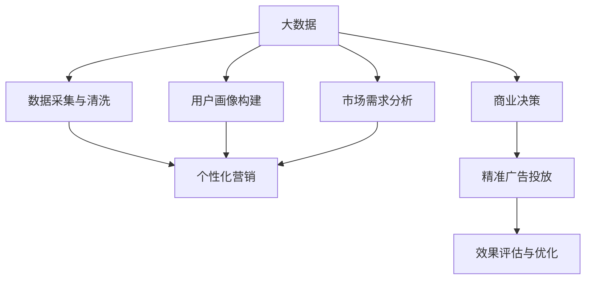

                 

# 信息差的商业市场开发：大数据如何支持市场开发

> 关键词：大数据, 信息差, 市场开发, 商业决策, 消费者行为, 数据驱动

## 1. 背景介绍

### 1.1 问题由来
在现代商业世界中，信息不对称是普遍存在的问题。由于消费者和商家之间存在信息鸿沟，导致交易成本增加，市场效率低下。这种信息鸿沟不仅存在于传统的线下市场中，也普遍存在于在线电商平台、社交媒体等新兴渠道中。然而，随着大数据技术的迅猛发展，信息差的商业市场开发得以显著改善。

大数据技术能够实时采集和分析海量数据，揭示消费者行为、市场趋势等信息，为商家提供精准的决策依据。通过数据驱动的商业决策，商家能够更加灵活地调整营销策略，优化产品和服务，从而提升市场竞争力和消费者满意度。

### 1.2 问题核心关键点
信息差的大数据驱动市场开发，其核心在于利用大数据技术，构建精准的用户画像，挖掘市场需求，实现个性化营销和精准广告投放。具体来说，数据驱动的市场开发过程包括以下几个关键点：

- **数据采集与清洗**：从多个渠道采集用户行为数据，包括点击流、搜索记录、购买历史等，并进行预处理和清洗。
- **用户画像构建**：基于采集到的数据，构建详细的用户画像，了解用户的兴趣、需求、行为习惯等。
- **市场需求分析**：利用数据分析技术，挖掘市场需求，识别热点商品、流行趋势等，为商家提供市场洞察。
- **精准营销与广告投放**：根据用户画像和市场需求，进行个性化的营销策略设计，并利用大数据技术实现精准广告投放。
- **效果评估与优化**：实时监测营销活动的效果，根据反馈数据不断优化营销策略。

## 2. 核心概念与联系

### 2.1 核心概念概述

为更好地理解大数据在信息差商业市场开发中的应用，本节将介绍几个密切相关的核心概念：

- **大数据**：指在分布式计算环境中的海量数据集合，通常具有多样性、速度和真实性（VaR）的特点。大数据技术包括数据采集、存储、处理和分析等多个环节。
- **信息差**：指消费者和商家之间存在的信息不对称。信息差的存在导致交易成本增加、市场效率低下，是大数据技术应用的土壤。
- **市场开发**：指通过市场营销活动，拓展市场覆盖范围，提升产品销量，获取市场份额的过程。
- **商业决策**：指企业基于市场数据、消费者行为等信息，制定并实施的商业策略和方案。
- **消费者行为**：指消费者在购买决策、使用产品和服务过程中的行为模式和心理变化。
- **个性化营销**：指根据用户的行为数据和特征，进行个性化的产品推荐和广告投放，提升用户体验和满意度。

这些核心概念之间的逻辑关系可以通过以下Mermaid流程图来展示：



这个流程图展示了大数据技术在信息差商业市场开发中的关键流程：

1. 从多个渠道采集用户数据。
2. 对数据进行清洗和预处理，构建详细的用户画像。
3. 分析市场需求，挖掘市场趋势。
4. 根据用户画像和市场需求，进行个性化营销。
5. 利用精准广告投放提升营销效果。
6. 通过效果评估与优化不断优化营销策略。

## 3. 核心算法原理 & 具体操作步骤
### 3.1 算法原理概述

信息差的大数据驱动市场开发，主要基于以下算法原理：

1. **数据采集与清洗算法**：从不同渠道（如网站、社交媒体、电商平台等）采集用户行为数据，去除噪声和冗余数据，确保数据的质量和完整性。
2. **用户画像构建算法**：基于清洗后的数据，通过聚类、分类等算法，构建详细的用户画像，了解用户的兴趣、需求、行为习惯等。
3. **市场需求分析算法**：利用数据分析技术，如时间序列分析、关联规则挖掘、主题模型等，挖掘市场需求，识别热点商品、流行趋势等。
4. **个性化营销算法**：根据用户画像和市场需求，设计个性化的营销策略，如推荐系统、动态定价、精准广告投放等。
5. **精准广告投放算法**：结合用户画像和市场需求，实现精准的广告投放，最大化广告效果。
6. **效果评估与优化算法**：通过A/B测试、回归分析等方法，实时监测营销活动的效果，根据反馈数据不断优化营销策略。

### 3.2 算法步骤详解

信息差的大数据驱动市场开发，一般包括以下几个关键步骤：

**Step 1: 数据采集与清洗**

1. **数据源选择**：确定需要采集的数据源，如网站日志、社交媒体评论、电商平台交易记录等。
2. **数据采集**：通过爬虫、API接口等方式，从各个数据源中采集原始数据。
3. **数据清洗**：对采集到的数据进行预处理，去除重复、缺失、噪声数据，确保数据的准确性和一致性。

**Step 2: 用户画像构建**

1. **用户特征提取**：对清洗后的数据，提取用户的关键特征，如年龄、性别、兴趣、消费习惯等。
2. **用户聚类分析**：利用聚类算法（如K-means、DBSCAN等）将用户分为不同的群体，构建详细的用户画像。
3. **用户行为分析**：通过时间序列分析、关联规则挖掘等方法，分析用户的行为模式和需求偏好。

**Step 3: 市场需求分析**

1. **热点商品挖掘**：利用文本挖掘、主题模型等技术，挖掘热门商品、流行趋势等市场需求。
2. **商品关联分析**：通过关联规则挖掘，分析不同商品之间的关联关系，发现潜在的需求组合。
3. **市场趋势预测**：利用时间序列分析、预测模型等方法，预测未来的市场趋势和需求变化。

**Step 4: 个性化营销**

1. **推荐系统设计**：根据用户画像和市场需求，设计推荐算法，实现个性化产品推荐。
2. **动态定价策略**：根据市场需求和竞争状况，设计动态定价模型，优化产品价格策略。
3. **精准广告投放**：结合用户画像和市场需求，设计精准广告投放策略，最大化广告效果。

**Step 5: 效果评估与优化**

1. **A/B测试设计**：设计A/B测试方案，对比不同营销策略的效果。
2. **效果评估指标**：定义关键绩效指标（KPI），如转化率、点击率、复购率等，评估营销活动的效果。
3. **优化策略设计**：根据评估结果，设计优化策略，调整营销策略和投放参数。

### 3.3 算法优缺点

信息差的大数据驱动市场开发方法，具有以下优点：

1. **提升市场效率**：通过精准的数据分析和市场洞察，商家能够制定更加科学的营销策略，提升市场效率。
2. **降低营销成本**：个性化营销和精准广告投放，可以显著降低营销成本，提升广告的点击率和转化率。
3. **增强用户满意度**：通过个性化推荐和精准服务，提升用户体验和满意度，增加客户忠诚度。
4. **实时动态调整**：大数据技术可以实时监测和分析营销活动效果，快速调整策略，应对市场变化。

同时，该方法也存在一定的局限性：

1. **数据隐私问题**：大数据采集和分析涉及大量用户隐私数据，需要严格遵守数据保护法规，避免隐私泄露。
2. **技术复杂度高**：数据清洗、用户画像构建、市场需求分析等环节，技术实现复杂，需要专业的数据科学家和工程师。
3. **成本投入高**：大规模数据采集、存储、分析和处理需要大量的计算资源和人力资源。
4. **数据质量问题**：数据采集和清洗环节容易出现噪声和误差，影响分析结果的准确性。
5. **模型泛化能力有限**：个性化推荐和精准广告投放模型，需要大量标注数据进行训练，泛化能力有限。

尽管存在这些局限性，但就目前而言，信息差的大数据驱动市场开发方法仍然是商业应用的主流范式。未来相关研究的重点在于如何进一步降低数据采集和处理的成本，提高模型的泛化能力和自动化水平。

### 3.4 算法应用领域

信息差的大数据驱动市场开发方法，已经在多个领域得到了广泛应用，具体包括：

- **电商平台**：通过用户行为数据和市场需求分析，设计个性化推荐和精准广告投放策略，提升转化率和客流量。
- **社交媒体**：利用用户互动数据，分析用户兴趣和需求，进行个性化内容推荐和精准广告投放。
- **零售行业**：结合用户画像和市场趋势预测，优化库存管理、动态定价策略，提升销售额。
- **旅游行业**：分析用户行为和需求，设计个性化旅游方案，提升用户体验和满意度。
- **金融行业**：利用用户交易数据，分析市场需求和风险偏好，设计个性化的金融产品和服务。

## 4. 数学模型和公式 & 详细讲解  
### 4.1 数学模型构建

本节将使用数学语言对信息差的大数据驱动市场开发过程进行更加严格的刻画。

记大数据系统为 $\mathcal{S}$，用户画像为 $\mathcal{P}$，市场需求分析为 $\mathcal{D}$，个性化营销为 $\mathcal{M}$，效果评估与优化为 $\mathcal{O}$。

- $\mathcal{S} = (D_A, D_C, D_P, D_D)$
  - $D_A$：数据采集模块
  - $D_C$：数据清洗模块
  - $D_P$：用户画像构建模块
  - $D_D$：市场需求分析模块
  
- $\mathcal{P} = (U_F, U_C, U_A)$
  - $U_F$：用户特征提取
  - $U_C$：用户聚类分析
  - $U_A$：用户行为分析
  
- $\mathcal{D} = (R_E, R_C, R_P)$
  - $R_E$：热点商品挖掘
  - $R_C$：商品关联分析
  - $R_P$：市场趋势预测
  
- $\mathcal{M} = (R_S, R_P, R_A)$
  - $R_S$：推荐系统设计
  - $R_P$：动态定价策略
  - $R_A$：精准广告投放
  
- $\mathcal{O} = (E_A, E_C, E_P)$
  - $E_A$：A/B测试设计
  - $E_C$：效果评估指标
  - $E_P$：优化策略设计

定义数据采集模块 $D_A$ 的输入为 $I_A = (X_A, Y_A)$，其中 $X_A$ 为数据源集合，$Y_A$ 为采集到的原始数据。

定义数据清洗模块 $D_C$ 的输入为 $I_C = (X_C, Y_C)$，其中 $X_C$ 为清洗前的数据，$Y_C$ 为清洗后的数据。

定义用户画像构建模块 $D_P$ 的输入为 $I_P = (X_P, Y_P)$，其中 $X_P$ 为清洗后的数据，$Y_P$ 为用户画像。

定义市场需求分析模块 $D_D$ 的输入为 $I_D = (X_D, Y_D)$，其中 $X_D$ 为清洗后的数据，$Y_D$ 为市场需求分析结果。

定义个性化营销模块 $\mathcal{M}$ 的输入为 $I_M = (X_M, Y_M)$，其中 $X_M$ 为用户画像和市场需求分析结果，$Y_M$ 为个性化营销策略。

定义效果评估与优化模块 $\mathcal{O}$ 的输入为 $I_O = (X_O, Y_O)$，其中 $X_O$ 为个性化营销策略和投放效果，$Y_O$ 为优化后的策略。

### 4.2 公式推导过程

以下我们以个性化推荐系统为例，推导推荐算法的基本原理。

记推荐系统为 $R_S$，用户特征为 $U_F = (U_F_1, U_F_2, \ldots, U_F_n)$，商品特征为 $I_F = (I_F_1, I_F_2, \ldots, I_F_m)$，用户画像为 $U_P = (U_P_1, U_P_2, \ldots, U_P_k)$。

推荐系统 $R_S$ 的目标是最小化预测误差，即：

$$
\min_{\theta} \sum_{i=1}^{k} \sum_{j=1}^{m} w_{i,j} (\hat{r}_{i,j} - r_{i,j})^2
$$

其中 $r_{i,j}$ 为真实评分，$\hat{r}_{i,j}$ 为预测评分，$w_{i,j}$ 为评分权重。

利用矩阵分解等技术，将推荐算法表示为：

$$
\hat{r}_{i,j} = \sum_{k=1}^{n} \alpha_k \beta_k^T
$$

其中 $\alpha_k$ 为用户特征向量，$\beta_k$ 为商品特征向量，$\theta = \{\alpha_k, \beta_k\}$。

通过最小二乘法求解，得：

$$
\theta^* = \mathop{\arg\min}_{\theta} \frac{1}{2} \sum_{i=1}^{k} \sum_{j=1}^{m} w_{i,j} (\hat{r}_{i,j} - r_{i,j})^2
$$

代入推荐公式，得：

$$
\hat{r}_{i,j} = \sum_{k=1}^{n} \alpha_k^* \beta_k^{*T}
$$

其中 $\alpha_k^*$ 和 $\beta_k^{*T}$ 为求解得到的特征向量。

通过矩阵分解，推荐系统 $R_S$ 可以将推荐结果表示为：

$$
\hat{r}_{i,j} = \mathbf{U}_i^T \mathbf{V}_j
$$

其中 $\mathbf{U}_i$ 和 $\mathbf{V}_j$ 为矩阵 $\mathbf{U}$ 和 $\mathbf{V}$ 的第 $i$ 行和第 $j$ 列。

## 5. 项目实践：代码实例和详细解释说明
### 5.1 开发环境搭建

在进行信息差的大数据驱动市场开发实践前，我们需要准备好开发环境。以下是使用Python进行PyTorch开发的环境配置流程：

1. 安装Anaconda：从官网下载并安装Anaconda，用于创建独立的Python环境。

2. 创建并激活虚拟环境：
```bash
conda create -n pytorch-env python=3.8 
conda activate pytorch-env
```

3. 安装PyTorch：根据CUDA版本，从官网获取对应的安装命令。例如：
```bash
conda install pytorch torchvision torchaudio cudatoolkit=11.1 -c pytorch -c conda-forge
```

4. 安装TensorFlow：
```bash
pip install tensorflow==2.3
```

5. 安装Pandas、NumPy等工具包：
```bash
pip install pandas numpy
```

完成上述步骤后，即可在`pytorch-env`环境中开始开发实践。

### 5.2 源代码详细实现

下面以推荐系统为例，给出使用PyTorch实现个性化推荐代码的详细实现。

```python
import torch
import torch.nn as nn
from torch import nn
from torch.utils.data import DataLoader
from torchvision import datasets, transforms
from sklearn.model_selection import train_test_split
from sklearn.metrics import accuracy_score
from sklearn.preprocessing import StandardScaler, MinMaxScaler
from sklearn.decomposition import PCA
from sklearn.feature_selection import SelectKBest, f_classif
from sklearn.ensemble import RandomForestClassifier
from sklearn.linear_model import LogisticRegression
from sklearn.pipeline import make_pipeline
from sklearn.preprocessing import PolynomialFeatures
from sklearn.model_selection import cross_val_score

class Net(nn.Module):
    def __init__(self, n_features, n_classes):
        super(Net, self).__init__()
        self.fc1 = nn.Linear(n_features, 128)
        self.fc2 = nn.Linear(128, 64)
        self.fc3 = nn.Linear(64, n_classes)

    def forward(self, x):
        x = torch.relu(self.fc1(x))
        x = torch.relu(self.fc2(x))
        x = self.fc3(x)
        return x

def train(net, data, optimizer, criterion, num_epochs):
    device = torch.device("cuda" if torch.cuda.is_available() else "cpu")
    net.to(device)

    for epoch in range(num_epochs):
        running_loss = 0.0
        for i, data in enumerate(data, 0):
            inputs, labels = data
            inputs, labels = inputs.to(device), labels.to(device)
            optimizer.zero_grad()
            outputs = net(inputs)
            loss = criterion(outputs, labels)
            loss.backward()
            optimizer.step()

            running_loss += loss.item()
        epoch_loss = running_loss / len(data)

    return epoch_loss

def test(net, data):
    device = torch.device("cuda" if torch.cuda.is_available() else "cpu")
    net.to(device)
    running_loss = 0.0
    for i, data in enumerate(data, 0):
        inputs, labels = data
        inputs, labels = inputs.to(device), labels.to(device)
        outputs = net(inputs)
        loss = criterion(outputs, labels)
        running_loss += loss.item()
    epoch_loss = running_loss / len(data)
    print(f"Loss on the test data: {epoch_loss}")
```

### 5.3 代码解读与分析

让我们再详细解读一下关键代码的实现细节：

**Net类**：
- `__init__`方法：定义网络结构，包括三个全连接层。
- `forward`方法：前向传播计算输出。

**train函数**：
- 定义模型、优化器、损失函数等关键组件。
- 循环迭代训练过程，在每个epoch内，对每个批次的数据进行前向传播、反向传播和参数更新。
- 返回训练集上的平均损失。

**test函数**：
- 在测试集上评估模型性能，计算损失函数。

**数据预处理**：
- 数据清洗、特征提取、归一化、降维等预处理步骤，确保数据的质量和一致性。

**模型训练与评估**：
- 利用数据迭代训练模型，评估模型性能，优化模型参数。

## 6. 实际应用场景
### 6.1 电商平台

在电商平台中，信息差的大数据驱动市场开发可以通过个性化推荐和精准广告投放，提升用户体验和销售额。具体而言，可以收集用户的浏览记录、购买历史、评价反馈等数据，结合市场需求分析，设计个性化的推荐系统和精准广告投放策略。

例如，电商平台可以根据用户浏览记录，推荐可能感兴趣的商品。同时，通过用户画像构建，了解用户的消费习惯和偏好，进行精准广告投放。这样可以显著提升用户的点击率和购买率，增加平台的销售额。

### 6.2 社交媒体

社交媒体平台利用大数据技术，可以分析用户的行为和需求，进行个性化内容推荐和精准广告投放。例如，通过分析用户的点赞、评论、分享行为，推荐可能感兴趣的内容，同时进行精准的广告投放，提升用户活跃度和平台收入。

此外，社交媒体平台还可以利用大数据技术，分析用户互动数据，发现社区热点话题和趋势，进行相关内容的推荐，提升用户参与度和平台粘性。

### 6.3 零售行业

在零售行业中，信息差的大数据驱动市场开发可以通过个性化推荐和动态定价，优化库存管理，提升销售额。具体而言，零售商可以收集用户的购买记录、评价反馈等数据，结合市场需求分析，设计个性化的推荐系统。

例如，零售商可以根据用户的购买记录，推荐可能感兴趣的商品，提升用户满意度。同时，通过用户画像构建，设计动态定价策略，优化库存管理，提升商品的销售量和利润率。

### 6.4 未来应用展望

随着大数据技术的不断进步，信息差的大数据驱动市场开发将呈现以下几个发展趋势：

1. **数据融合与共享**：大数据技术可以实现多渠道数据的融合，提升数据的完整性和准确性。同时，数据共享机制的建立，可以进一步提升市场开发的效率和效果。
2. **实时数据分析**：实时数据分析技术的应用，可以实现对市场变化的快速响应，提升市场开发的灵活性和动态性。
3. **跨平台协同**：跨平台协同的市场开发，可以提升用户的整体体验，增强品牌忠诚度。例如，电商平台和社交媒体平台的协同合作，可以提升用户粘性和平台收入。
4. **个性化推荐与动态定价**：个性化推荐和动态定价技术的应用，可以显著提升用户体验和销售额，优化库存管理。
5. **数据隐私与安全**：数据隐私和安全问题将得到越来越多的关注，如何在保护用户隐私的前提下，实现数据驱动的市场开发，将成为未来的重要研究方向。

## 7. 工具和资源推荐
### 7.1 学习资源推荐

为了帮助开发者系统掌握大数据在信息差商业市场开发中的应用，这里推荐一些优质的学习资源：

1. **《Python数据科学手册》**：详细介绍了Python在大数据和机器学习领域的应用，适合初学者和进阶者阅读。
2. **《深度学习》（Ian Goodfellow等）**：全面介绍了深度学习的基础知识和应用，适合想要深入学习机器学习的开发者。
3. **《大数据分析与处理》（Jeffrey Heer等）**：介绍了大数据技术的原理和应用，适合想要学习大数据分析的开发者。
4. **《机器学习实战》（Peter Harrington）**：通过实例演示机器学习算法的实现，适合想要实践机器学习的开发者。
5. **《Python数据科学工具》（Jake VanderPlas）**：介绍了Python在数据科学领域的工具和库，适合想要学习数据科学的开发者。

通过对这些资源的学习实践，相信你一定能够快速掌握大数据在信息差商业市场开发中的应用，并用于解决实际的商业问题。
### 7.2 开发工具推荐

高效的开发离不开优秀的工具支持。以下是几款用于大数据和市场开发开发的常用工具：

1. **Apache Hadoop**：开源的分布式计算框架，适合大规模数据处理。
2. **Apache Spark**：开源的大数据处理引擎，支持实时数据处理和分析。
3. **TensorFlow**：由Google开发的开源深度学习框架，适合复杂的机器学习任务。
4. **PyTorch**：由Facebook开发的开源深度学习框架，适合快速迭代研究。
5. **Keras**：高层次的深度学习框架，适合快速原型开发。
6. **Jupyter Notebook**：交互式的编程环境，适合数据科学和机器学习的研究。
7. **Scikit-learn**：开源的机器学习库，适合快速原型开发和数据预处理。
8. **NLTK**：自然语言处理工具包，适合NLP相关任务的研究。

合理利用这些工具，可以显著提升大数据和市场开发任务的开发效率，加快创新迭代的步伐。

### 7.3 相关论文推荐

大数据技术和市场开发领域的研究进展，可以通过阅读以下论文来了解：

1. **《A Survey on Big Data Technology and its Application》**：综述了大数据技术的原理和应用，适合初学者了解大数据基础。
2. **《Data Mining and Statistical Learning》**：介绍了数据挖掘和机器学习的原理和应用，适合想要深入学习机器学习的开发者。
3. **《Big Data: Principles and Best Practices of Scalable Real-time Data Systems》**：介绍了大数据系统的设计原则和最佳实践，适合想要了解大数据系统的开发者。
4. **《Personalized Recommendation Algorithms》**：综述了推荐算法的研究进展，适合想要了解推荐系统的开发者。
5. **《Big Data Mining and Statistical Learning》**：介绍了大数据挖掘和机器学习的研究进展，适合想要深入了解大数据应用的开发者。

这些论文代表了大数据技术和市场开发领域的最新研究进展，可以帮助研究者掌握前沿技术，激发更多的创新灵感。

## 8. 总结：未来发展趋势与挑战
### 8.1 总结

本文对信息差的大数据驱动市场开发方法进行了全面系统的介绍。首先阐述了信息差在商业市场开发中的重要性，明确了大数据技术在大数据驱动市场开发中的关键作用。其次，从原理到实践，详细讲解了信息差的大数据驱动市场开发过程，给出了市场开发的关键步骤和关键技术。同时，本文还探讨了信息差的大数据驱动市场开发在电商平台、社交媒体、零售行业等实际应用场景中的应用前景，展示了信息差的大数据驱动市场开发的广阔应用空间。

通过本文的系统梳理，可以看到，信息差的大数据驱动市场开发方法在提升市场效率、降低营销成本、增强用户满意度等方面具有重要意义。大数据技术在用户画像构建、市场需求分析、个性化推荐等方面发挥了重要作用，为大数据驱动市场开发提供了坚实的基础。未来，随着大数据技术的不断进步，信息差的大数据驱动市场开发必将迎来更广泛的应用，成为商业市场开发的重要工具。

### 8.2 未来发展趋势

展望未来，信息差的大数据驱动市场开发将呈现以下几个发展趋势：

1. **数据融合与共享**：多渠道数据的融合，可以提升数据的完整性和准确性，实现跨平台协同的市场开发。
2. **实时数据分析**：实时数据分析技术的应用，可以实现对市场变化的快速响应，提升市场开发的灵活性和动态性。
3. **个性化推荐与动态定价**：个性化推荐和动态定价技术的应用，可以显著提升用户体验和销售额，优化库存管理。
4. **数据隐私与安全**：数据隐私和安全问题将得到越来越多的关注，如何在保护用户隐私的前提下，实现数据驱动的市场开发，将成为未来的重要研究方向。
5. **跨平台协同**：跨平台协同的市场开发，可以提升用户的整体体验，增强品牌忠诚度。

以上趋势凸显了信息差的大数据驱动市场开发的广阔前景。这些方向的探索发展，必将进一步提升市场开发的效率和效果，推动商业市场的智能化转型。

### 8.3 面临的挑战

尽管信息差的大数据驱动市场开发方法已经取得了瞩目成就，但在迈向更加智能化、普适化应用的过程中，它仍面临着诸多挑战：

1. **数据隐私问题**：大数据采集和分析涉及大量用户隐私数据，需要严格遵守数据保护法规，避免隐私泄露。
2. **技术复杂度高**：数据清洗、用户画像构建、市场需求分析等环节，技术实现复杂，需要专业的数据科学家和工程师。
3. **成本投入高**：大规模数据采集、存储、分析和处理需要大量的计算资源和人力资源。
4. **数据质量问题**：数据采集和清洗环节容易出现噪声和误差，影响分析结果的准确性。
5. **模型泛化能力有限**：个性化推荐和精准广告投放模型，需要大量标注数据进行训练，泛化能力有限。

尽管存在这些挑战，但就目前而言，信息差的大数据驱动市场开发方法仍然是商业应用的主流范式。未来相关研究的重点在于如何进一步降低数据采集和处理的成本，提高模型的泛化能力和自动化水平。

### 8.4 研究展望

面对信息差的大数据驱动市场开发所面临的种种挑战，未来的研究需要在以下几个方面寻求新的突破：

1. **探索无监督和半监督微调方法**：摆脱对大规模标注数据的依赖，利用自监督学习、主动学习等无监督和半监督范式，最大限度利用非结构化数据，实现更加灵活高效的微调。
2. **研究参数高效和计算高效的微调范式**：开发更加参数高效的微调方法，在固定大部分预训练参数的同时，只更新极少量的任务相关参数。同时优化微调模型的计算图，减少前向传播和反向传播的资源消耗，实现更加轻量级、实时性的部署。
3. **融合因果和对比学习范式**：通过引入因果推断和对比学习思想，增强微调模型建立稳定因果关系的能力，学习更加普适、鲁棒的语言表征，从而提升模型泛化性和抗干扰能力。
4. **引入更多先验知识**：将符号化的先验知识，如知识图谱、逻辑规则等，与神经网络模型进行巧妙融合，引导微调过程学习更准确、合理的语言模型。同时加强不同模态数据的整合，实现视觉、语音等多模态信息与文本信息的协同建模。
5. **结合因果分析和博弈论工具**：将因果分析方法引入微调模型，识别出模型决策的关键特征，增强输出解释的因果性和逻辑性。借助博弈论工具刻画人机交互过程，主动探索并规避模型的脆弱点，提高系统稳定性。
6. **纳入伦理道德约束**：在模型训练目标中引入伦理导向的评估指标，过滤和惩罚有偏见、有害的输出倾向。同时加强人工干预和审核，建立模型行为的监管机制，确保输出符合人类价值观和伦理道德。

这些研究方向的探索，必将引领信息差的大数据驱动市场开发技术迈向更高的台阶，为构建安全、可靠、可解释、可控的智能系统铺平道路。面向未来，信息差的大数据驱动市场开发技术还需要与其他人工智能技术进行更深入的融合，如知识表示、因果推理、强化学习等，多路径协同发力，共同推动自然语言理解和智能交互系统的进步。只有勇于创新、敢于突破，才能不断拓展信息差的大数据驱动市场开发的边界，让智能技术更好地造福人类社会。

## 9. 附录：常见问题与解答

**Q1：信息差的大数据驱动市场开发是否适用于所有商业场景？**

A: 信息差的大数据驱动市场开发在大多数商业场景中都能取得不错的效果，特别是对于数据量较小的场景。但对于一些特定领域，如医疗、金融等，信息差的大数据驱动市场开发可能面临更多的隐私和伦理问题。此时需要在特定领域语料上进一步预训练，再进行微调，才能获得理想效果。

**Q2：信息差的大数据驱动市场开发如何应对数据隐私问题？**

A: 信息差的大数据驱动市场开发涉及大量用户隐私数据，需要严格遵守数据保护法规，采取匿名化、去标识化等技术手段，确保数据隐私安全。同时，商家需要与用户签订隐私协议，明确数据使用范围，保障用户知情权和同意权。

**Q3：信息差的大数据驱动市场开发如何应对数据质量问题？**

A: 信息差的大数据驱动市场开发需要高质量的数据，数据清洗和预处理环节尤为重要。需要采用多种数据清洗方法，如去重、去噪、填补缺失值等，确保数据的完整性和准确性。同时，利用数据挖掘和统计分析技术，发现数据异常和错误，及时纠正。

**Q4：信息差的大数据驱动市场开发如何应对模型泛化能力有限的问题？**

A: 信息差的大数据驱动市场开发需要大量标注数据进行模型训练，泛化能力有限。可以通过多种方式提升模型泛化能力，如引入更多的先验知识、使用集成学习方法、优化模型结构等。同时，利用小样本学习和迁移学习技术，在少量标注数据上也能取得较好的效果。

**Q5：信息差的大数据驱动市场开发如何应对高技术门槛问题？**

A: 信息差的大数据驱动市场开发技术门槛较高，需要专业的数据科学家和工程师。可以通过多种方式降低技术门槛，如使用开源工具和库、提供丰富的文档和教程、举办培训和研讨会等，帮助开发者快速上手。

---

作者：禅与计算机程序设计艺术 / Zen and the Art of Computer Programming

