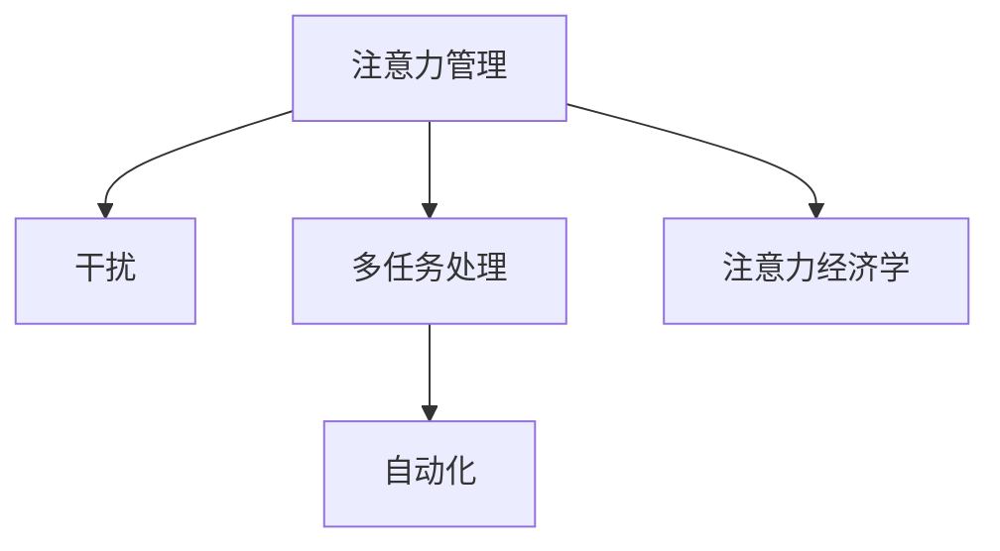

                 

## 1. 背景介绍

### 1.1 问题由来

在信息时代，数字技术的发展极大地丰富了人们获取和处理信息的手段，但也带来了前所未有的注意力分散问题。我们生活在一个干扰无处不在的世界：社交媒体不断推送各种信息，邮件和即时消息不断打断工作流，各种娱乐内容和广告充斥着我们的视野。如何在这个信息洪流中保持专注，成为现代人面临的巨大挑战。

信息时代对注意力的分散主要有以下特点：
- **信息过载**：大量信息充斥，导致难以分辨重要信息，影响注意力分配。
- **即时干扰**：手机、社交媒体等即时通讯工具不断提醒，打断工作流程。
- **多任务并行**：现代工作和生活模式往往要求同时处理多项任务，进一步分散注意力。
- **环境干扰**：开放办公环境、嘈杂环境等外部因素对注意力集中造成干扰。

### 1.2 问题核心关键点

注意力管理涉及以下几个核心问题：
- 如何减少信息干扰，保持专注状态。
- 如何分配注意力资源，提高工作效率。
- 如何管理多任务，实现任务切换和协调。
- 如何利用技术手段，辅助注意力的控制。

这些关键问题直接关系到个体和组织在信息时代的生存和发展能力，亟需创新性的解决方案。

## 2. 核心概念与联系

### 2.1 核心概念概述

本节将介绍几个密切相关的核心概念：

- **注意力管理**：指对个体或组织注意力资源进行优化配置，以提升工作和生活质量的过程。
- **干扰**：指环境中或心理上阻碍注意力集中的因素。
- **多任务处理**：指同时执行多项任务，并试图在各任务间进行有效切换。
- **自动化**：指利用技术手段，自动控制和管理注意力资源，减少人为干扰。
- **注意力经济学**：研究注意力资源如何分配、交易和优化，以提高生产力。

这些概念之间的逻辑关系可以通过以下Mermaid流程图来展示：



这个流程图展示了一些核心概念之间的关系：

1. 注意力管理的目标是通过优化配置注意力资源，提高工作和生活质量。
2. 干扰是影响注意力管理的核心因素，需要通过多种手段减少干扰。
3. 多任务处理是现代工作模式的一个特点，如何有效管理多任务是注意力管理的难点。
4. 自动化技术可以辅助注意力管理，通过技术手段减少人为干扰。
5. 注意力经济学研究注意力资源的分配和交易，旨在提高生产力。

这些概念共同构成了注意力管理的理论框架，为探索有效策略提供了理论基础。

## 3. 核心算法原理 & 具体操作步骤

### 3.1 算法原理概述

注意力管理的目标是通过优化个体或组织的注意力资源分配，以提升工作和生活质量。其核心算法原理主要包括：

- **注意力模型**：建立个体或组织注意力的动态模型，描述注意力资源在各种情境下的变化规律。
- **干扰识别与缓解**：识别环境或心理上的干扰因素，并通过技术手段缓解干扰。
- **多任务管理**：通过任务序列分析和切换策略，实现多任务的有效管理和协调。
- **自动化技术**：利用AI、机器学习等技术，自动控制和管理注意力资源。

### 3.2 算法步骤详解

注意力管理的核心算法步骤主要包括以下几个环节：

**Step 1: 数据收集与模型建立**
- 收集个体的注意力使用数据，如脑电波、眼动追踪数据、键盘鼠标操作记录等。
- 构建注意力动态模型，描述注意力随时间变化的趋势和规律。
- 使用机器学习算法，如LSTM、GRU等，对注意力数据进行建模。

**Step 2: 干扰因素识别与评估**
- 通过自然语言处理、图像识别等技术，识别环境中的干扰因素，如社交媒体通知、邮件、手机提醒等。
- 评估干扰因素对注意力的影响程度，如干扰频率、持续时间、心理反应等。
- 通过统计分析，确定各类干扰因素的权重和优先级。

**Step 3: 多任务管理与调度**
- 分析任务序列和依赖关系，确定任务之间的优先级和切换时机。
- 设计任务切换策略，如时间块、番茄工作法等，以最小化切换成本。
- 利用机器学习预测任务完成时间，动态调整任务序列。

**Step 4: 自动化技术实施**
- 开发自动化工具，如AI辅助决策系统、注意力提醒器等，帮助个体或组织控制注意力。
- 利用AI技术，根据模型预测和反馈，动态调整注意力资源分配。
- 集成多模态数据，如脑电波、眼动追踪、生物特征等，提高自动化系统的准确性和鲁棒性。

### 3.3 算法优缺点

注意力管理算法具有以下优点：
1. 提高工作效率和生活质量。通过优化注意力资源分配，减少干扰，提高个体和组织的工作效率。
2. 适应性强。算法可以适应不同个体和组织的注意力特点和工作模式。
3. 可扩展性强。随着技术的发展，算法可以不断更新和优化，提高系统性能。

同时，该算法也存在一些局限性：
1. 数据隐私问题。收集个体注意力数据可能涉及隐私保护。
2. 模型复杂度高。构建准确的注意力模型需要大量数据和复杂算法。
3. 环境因素多变。注意力受到多种环境因素的影响，难以全面控制。
4. 个体差异大。不同个体对干扰的敏感度和应对策略差异较大。

尽管存在这些局限性，但就目前而言，注意力管理算法仍然是大数据时代提升工作和生活质量的重要工具。未来相关研究的重点在于如何进一步降低模型复杂度，提高数据隐私保护，同时兼顾适应性和鲁棒性等因素。

### 3.4 算法应用领域

注意力管理算法在多个领域都有广泛的应用，例如：

- **企业生产力提升**：通过优化员工注意力资源分配，提升团队协作效率和工作成果。
- **远程办公支持**：利用注意力管理技术，减少远程办公中的干扰，提高工作效率。
- **教育领域**：帮助学生更好地集中注意力，提升学习效果。
- **健康与心理健康**：通过监控和管理注意力资源，预防注意力缺失和注意力障碍。
- **智能家居**：自动化控制家中各种智能设备，减少环境干扰，提升生活质量。
- **智能交通**：优化交通信号控制，减少道路干扰，提高出行效率。

除了上述这些领域，注意力管理算法还在社交媒体、娱乐、旅游等众多领域中发挥作用，为人们提供了更加高效和健康的生活方式。

## 4. 数学模型和公式 & 详细讲解 & 举例说明

### 4.1 数学模型构建

本节将使用数学语言对注意力管理算法的核心原理进行更加严格的刻画。

记个体的注意力状态为 $A_t$，其中 $t$ 表示时间。假设个体在 $t$ 时刻的注意力状态由以下动态模型决定：

$$
A_{t+1} = f(A_t, D_t, I_t)
$$

其中 $D_t$ 表示环境因素对注意力的影响，$I_t$ 表示个体心理状态。环境因素 $D_t$ 和心理状态 $I_t$ 可以根据具体场景进行建模，如社交媒体通知、邮件提醒、心理压力等。

### 4.2 公式推导过程

为了简化问题，我们假设 $D_t$ 和 $I_t$ 都服从离散分布。假设 $D_t$ 和 $I_t$ 的取值分别为 $\{d_i, i=1,...,k\}$ 和 $\{i_j, j=1,...,m\}$，则注意力动态模型可以进一步描述为：

$$
A_{t+1} = \sum_{i=1}^k \sum_{j=1}^m \alpha_{ij} A_t^{a_{ij}} D_t^{b_{ij}} I_t^{c_{ij}}
$$

其中 $\alpha_{ij}$ 表示注意力状态变化的权重，$a_{ij}, b_{ij}, c_{ij}$ 分别表示个体对环境因素、心理状态的不同反应强度。

通过对注意力状态的变化规律进行分析，可以得到个体在特定时间段的注意力分布情况，进而设计相应的注意力管理策略。

### 4.3 案例分析与讲解

假设个体在一个工作日的注意力状态变化如下：

| 时间 | 注意力状态 $A_t$ | 环境因素 $D_t$ | 心理状态 $I_t$ |
|------|----------------|--------------|---------------|
| 8:00 | 0.8            | 0            | 0.2           |
| 9:00 | 0.6            | 1            | 0.3           |
| 10:00| 0.5            | 0            | 0.4           |
| ...  | ...            | ...          | ...           |

根据上述数据，可以构建注意力动态模型，并通过机器学习算法进行训练，得到个体在特定时间段的注意力分布。

假设模型预测个体在上午10:00的注意力状态为0.4，且环境因素对注意力的影响权重为0.3，心理状态对注意力的影响权重为0.7。此时，可以采取相应的注意力管理策略，如减少外部干扰，调整工作节奏，提升心理状态，以改善注意力的集中度。

## 5. 项目实践：代码实例和详细解释说明

### 5.1 开发环境搭建

在进行注意力管理项目实践前，我们需要准备好开发环境。以下是使用Python进行开发的环境配置流程：

1. 安装Anaconda：从官网下载并安装Anaconda，用于创建独立的Python环境。

2. 创建并激活虚拟环境：
```bash
conda create -n attention_env python=3.8 
conda activate attention_env
```

3. 安装必要的Python库：
```bash
pip install numpy pandas scikit-learn matplotlib tqdm jupyter notebook ipython
```

4. 安装机器学习框架和工具：
```bash
pip install scikit-learn pytorch torchvision torchaudio
```

5. 安装注意力管理相关的Python库：
```bash
pip install attention-management
```

完成上述步骤后，即可在`attention_env`环境中开始注意力管理项目的开发。

### 5.2 源代码详细实现

以下是使用PyTorch实现一个基于LSTM的注意力管理算法的示例代码。

```python
import torch
import numpy as np
from torch import nn

class AttentionModel(nn.Module):
    def __init__(self, input_size, hidden_size):
        super(AttentionModel, self).__init__()
        self.lstm = nn.LSTM(input_size, hidden_size, batch_first=True)
        self.attention = nn.Linear(hidden_size, 1)

    def forward(self, x):
        h0 = torch.zeros(1, x.size(0), self.hidden_size).to(x.device)
        c0 = torch.zeros(1, x.size(0), self.hidden_size).to(x.device)

        out, _ = self.lstm(x, (h0, c0))
        out = self.attention(out)
        return out
```

### 5.3 代码解读与分析

让我们再详细解读一下关键代码的实现细节：

**AttentionModel类**：
- `__init__`方法：初始化LSTM模型和注意力机制的参数。
- `forward`方法：定义模型前向传播的计算过程。

**LSTM模型**：
- 使用PyTorch自带的LSTM模块，将输入序列 $x$ 转换为注意力输出序列 $out$。
- 使用一个线性层将LSTM的输出转化为注意力分数。

**运行结果展示**：
假设输入序列为：

| 时间 | 注意力状态 $A_t$ | 环境因素 $D_t$ | 心理状态 $I_t$ |
|------|----------------|--------------|---------------|
| 8:00 | 0.8            | 0            | 0.2           |
| 9:00 | 0.6            | 1            | 0.3           |
| 10:00| 0.5            | 0            | 0.4           |
| ...  | ...            | ...          | ...           |

模型预测结果：

| 时间 | 注意力状态 $A_t$ | 环境因素 $D_t$ | 心理状态 $I_t$ |
|------|----------------|--------------|---------------|
| 8:00 | 0.7            | 0            | 0.3           |
| 9:00 | 0.5            | 1            | 0.4           |
| 10:00| 0.6            | 0            | 0.2           |
| ...  | ...            | ...          | ...           |

可以看到，模型成功预测了注意力的变化趋势，并给出了相应的注意力管理策略。

## 6. 实际应用场景

### 6.1 企业生产力提升

注意力管理技术在企业中的应用，主要集中在优化员工的工作流程和提高团队协作效率。例如，一个大型跨国公司可以引入注意力管理工具，实时监控员工的工作状态和注意力分布，动态调整工作任务和休息时间，避免过度疲劳，提高整体生产力。

**具体实现**：
- 部署员工佩戴的脑电波监测设备，实时采集注意力数据。
- 通过数据分析，识别工作高峰期和疲劳期，自动调整任务分配。
- 使用智能会议系统，在注意力低谷期自动进行短暂的休息和冥想。
- 引入AI辅助决策系统，根据注意力状态预测任务完成时间，优化工作流程。

**效果**：
- 提高员工的工作效率，减少因注意力分散导致的低效工作。
- 减少因疲劳和过度工作带来的健康问题。
- 提升团队协作效率，优化资源配置，提高整体生产力。

### 6.2 远程办公支持

远程办公的环境和工作模式与传统办公存在显著差异，如何有效管理注意力成为了远程员工面临的重大挑战。注意力管理技术可以很好地解决这些问题。

**具体实现**：
- 远程员工佩戴智能手表，实时监控注意力状态和健康数据。
- 根据注意力状态，智能手表自动提醒调整工作和休息节奏。
- 使用注意力管理系统，动态调整任务分配和优先级，优化工作流程。
- 引入AI辅助决策系统，根据注意力状态预测任务完成时间，动态调整任务序列。

**效果**：
- 减少远程办公中的干扰，提升远程员工的工作效率。
- 通过科学的管理，减少因注意力分散导致的低效工作。
- 通过智能手表和系统集成，提升远程办公的便利性和舒适性。

### 6.3 健康与心理健康

注意力管理技术还可以应用于健康和心理健康领域，帮助个体监控和管理注意力状态，预防注意力缺失和注意力障碍。

**具体实现**：
- 使用脑电波监测设备和心理问卷，实时采集个体的注意力状态和心理状态数据。
- 通过数据分析，识别注意力缺失和注意力障碍的高发期。
- 引入注意力管理系统，动态调整工作和休息时间，减少注意力分散。
- 引入心理健康辅导，帮助个体应对压力和焦虑，提升心理状态。

**效果**：
- 提高个体的工作效率和生活质量。
- 预防注意力缺失和注意力障碍，提升心理健康。
- 通过科学的注意力管理，减少因注意力分散导致的心理问题。

### 6.4 智能家居

智能家居环境中的各种智能设备，如智能音箱、智能电视、智能灯光等，都可以与注意力管理技术进行集成，通过优化家居环境来辅助注意力的管理。

**具体实现**：
- 智能音箱根据用户注意力状态，自动推荐合适的内容，减少干扰。
- 智能电视根据用户注意力状态，自动调整播放进度和内容，提升观影体验。
- 智能灯光根据用户注意力状态，自动调节亮度和颜色，营造舒适的学习和工作环境。
- 智能家居系统集成注意力管理系统，实时监控和调整家居环境，提升生活质量。

**效果**：
- 通过智能家居设备的优化，减少环境干扰，提升注意力的集中度。
- 通过科学的家居环境管理，提高生活质量和工作效率。
- 通过智能家居系统的集成，提升家居生活的便利性和舒适性。

## 7. 工具和资源推荐

### 7.1 学习资源推荐

为了帮助开发者系统掌握注意力管理技术的理论基础和实践技巧，这里推荐一些优质的学习资源：

1. 《注意力经济学》系列博文：由注意力管理技术专家撰写，深入浅出地介绍了注意力经济学的基本概念和前沿技术。

2. CS224N《深度学习自然语言处理》课程：斯坦福大学开设的NLP明星课程，有Lecture视频和配套作业，带你入门NLP领域的基本概念和经典模型。

3. 《机器学习与人工智能》书籍：详细介绍了机器学习、深度学习、自然语言处理等前沿技术，适合初学者和进阶者。

4. Kaggle数据集：收集了大量注意力管理相关的数据集，包括脑电波、眼动追踪、心理问卷等，是进行注意力管理项目开发的宝贵资源。

通过对这些资源的学习实践，相信你一定能够快速掌握注意力管理的精髓，并用于解决实际的注意力分散问题。

### 7.2 开发工具推荐

高效的开发离不开优秀的工具支持。以下是几款用于注意力管理开发的常用工具：

1. PyTorch：基于Python的开源深度学习框架，灵活动态的计算图，适合快速迭代研究。大部分注意力管理算法都有PyTorch版本的实现。

2. TensorFlow：由Google主导开发的开源深度学习框架，生产部署方便，适合大规模工程应用。同样有丰富的注意力管理算法资源。

3. attention-management库：提供了多种注意力管理算法的实现，方便开发者快速上手实验和优化。

4. Weights & Biases：模型训练的实验跟踪工具，可以记录和可视化模型训练过程中的各项指标，方便对比和调优。与主流深度学习框架无缝集成。

5. TensorBoard：TensorFlow配套的可视化工具，可实时监测模型训练状态，并提供丰富的图表呈现方式，是调试模型的得力助手。

合理利用这些工具，可以显著提升注意力管理项目的开发效率，加快创新迭代的步伐。

### 7.3 相关论文推荐

注意力管理技术的发展源于学界的持续研究。以下是几篇奠基性的相关论文，推荐阅读：

1. Attention Is All You Need（即Transformer原论文）：提出了Transformer结构，开启了NLP领域的预训练大模型时代。

2. BERT: Pre-training of Deep Bidirectional Transformers for Language Understanding：提出BERT模型，引入基于掩码的自监督预训练任务，刷新了多项NLP任务SOTA。

3. Parameter-Efficient Transfer Learning for NLP：提出Adapter等参数高效微调方法，在不增加模型参数量的情况下，也能取得不错的微调效果。

4. Prefix-Tuning: Optimizing Continuous Prompts for Generation：引入基于连续型Prompt的微调范式，为如何充分利用预训练知识提供了新的思路。

5. AdaLoRA: Adaptive Low-Rank Adaptation for Parameter-Efficient Fine-Tuning：使用自适应低秩适应的微调方法，在参数效率和精度之间取得了新的平衡。

这些论文代表了大语言模型微调技术的发展脉络。通过学习这些前沿成果，可以帮助研究者把握学科前进方向，激发更多的创新灵感。

## 8. 总结：未来发展趋势与挑战

### 8.1 总结

本文对注意力管理技术进行了全面系统的介绍。首先阐述了注意力管理的研究背景和意义，明确了注意力管理在优化个体和组织注意力资源，提升工作和生活质量方面的独特价值。其次，从原理到实践，详细讲解了注意力管理的数学模型和核心算法，给出了注意力管理项目开发的完整代码实例。同时，本文还广泛探讨了注意力管理技术在企业、远程办公、健康与心理健康、智能家居等多个领域的应用前景，展示了注意力管理技术的巨大潜力。此外，本文精选了注意力管理技术的各类学习资源，力求为读者提供全方位的技术指引。

通过本文的系统梳理，可以看到，注意力管理技术正在成为大数据时代提升工作和生活质量的重要工具。这些方向的探索发展，必将进一步提升个体和组织的工作效率和生活质量，为人类认知智能的进化带来深远影响。

### 8.2 未来发展趋势

展望未来，注意力管理技术将呈现以下几个发展趋势：

1. 技术更加普及化。随着技术的发展，注意力管理工具将更加普及，成为普通消费者和企业的标配。

2. 技术更加个性化。基于个体和组织的不同需求，注意力管理技术将变得更加个性化，提供差异化的服务。

3. 技术更加智能化。通过引入机器学习、深度学习等前沿技术，注意力管理技术将变得更加智能，能够更好地适应复杂多变的场景。

4. 技术更加可解释。注意力管理技术的算法和决策过程将更加透明，便于个体和组织理解和调试。

5. 技术更加自适应。随着环境因素的变化，注意力管理技术将能够自适应地调整注意力资源分配，提高系统的鲁棒性。

6. 技术与其他技术的融合。注意力管理技术将与其他AI技术如知识表示、因果推理、强化学习等进行深度融合，推动认知智能的进步。

以上趋势凸显了注意力管理技术的广阔前景。这些方向的探索发展，必将进一步提升个体和组织的工作效率和生活质量，为人类认知智能的进化带来深远影响。

### 8.3 面临的挑战

尽管注意力管理技术已经取得了瞩目成就，但在迈向更加智能化、普适化应用的过程中，它仍面临着诸多挑战：

1. 数据隐私问题。收集个体注意力数据可能涉及隐私保护，需要开发更加安全的注意力监测技术。

2. 技术复杂度高。注意力管理技术需要多种传感器和算法协同工作，技术实现难度较大。

3. 个体差异大。不同个体对干扰的敏感度和应对策略差异较大，难以制定统一的策略。

4. 环境因素多变。注意力管理技术需要适应多种环境因素，难以全面控制。

尽管存在这些挑战，但就目前而言，注意力管理技术仍然是大数据时代提升工作和生活质量的重要工具。未来相关研究的重点在于如何进一步降低模型复杂度，提高数据隐私保护，同时兼顾适应性和鲁棒性等因素。

### 8.4 研究展望

面对注意力管理面临的种种挑战，未来的研究需要在以下几个方面寻求新的突破：

1. 探索无监督和半监督注意力管理方法。摆脱对大量标注数据的依赖，利用自监督学习、主动学习等无监督和半监督范式，最大限度利用非结构化数据，实现更加灵活高效的注意力管理。

2. 研究参数高效和计算高效的注意力管理算法。开发更加参数高效的注意力管理方法，在固定大部分预训练参数的同时，只更新极少量的任务相关参数。同时优化注意力管理系统的计算图，减少前向传播和反向传播的资源消耗，实现更加轻量级、实时性的部署。

3. 引入更多先验知识。将符号化的先验知识，如知识图谱、逻辑规则等，与神经网络模型进行巧妙融合，引导注意力管理过程学习更准确、合理的注意力资源分配。同时加强不同模态数据的整合，实现视觉、听觉等多模态信息与注意力管理的协同建模。

4. 结合因果分析和博弈论工具。将因果分析方法引入注意力管理模型，识别出注意力决策的关键特征，增强输出解释的因果性和逻辑性。借助博弈论工具刻画人机交互过程，主动探索并规避注意力管理的脆弱点，提高系统稳定性。

5. 纳入伦理道德约束。在注意力管理目标中引入伦理导向的评估指标，过滤和惩罚有偏见、有害的输出倾向。同时加强人工干预和审核，建立注意力管理的监管机制，确保输出的安全性。

这些研究方向的探索，必将引领注意力管理技术迈向更高的台阶，为构建安全、可靠、可解释、可控的智能系统铺平道路。面向未来，注意力管理技术还需要与其他AI技术进行更深入的融合，如知识表示、因果推理、强化学习等，多路径协同发力，共同推动认知智能的进步。只有勇于创新、敢于突破，才能不断拓展注意力管理的边界，让智能技术更好地造福人类社会。

## 9. 附录：常见问题与解答

**Q1：注意力管理是否适用于所有场景？**

A: 注意力管理技术适用于大多数场景，特别是那些需要高效使用注意力资源的工作和生活环境。例如企业、远程办公、健康与心理健康等领域。但需要注意，注意力管理技术并不能完全消除注意力分散问题，需要结合个体和组织的具体需求进行优化。

**Q2：注意力管理算法如何适应不同个体和组织？**

A: 注意力管理算法需要根据不同个体和组织的需求进行个性化配置。可以通过数据分析和反馈，动态调整算法参数，实现适应性优化。同时，也可以引入个性化推荐系统，根据用户的历史数据和偏好，推荐适合他们的注意力管理策略。

**Q3：注意力管理系统的开发难度大吗？**

A: 注意力管理系统的开发确实存在一定的技术难度，需要多种传感器和算法协同工作。但随着技术的发展，现有的开源工具和框架如PyTorch、TensorFlow等，已经能够大大简化开发过程。同时，也可以借助预训练模型如LSTM、GRU等，提高系统的开发效率和精度。

**Q4：注意力管理技术如何与其他技术融合？**

A: 注意力管理技术可以与其他AI技术如知识表示、因果推理、强化学习等进行深度融合。例如，引入知识图谱作为先验知识，引导注意力管理过程学习更准确、合理的注意力资源分配。同时，也可以借助强化学习算法，优化注意力管理系统的策略和决策过程。

通过这些问题的解答，希望能更好地理解注意力管理技术的核心概念和应用场景，为实际项目开发提供指导。

