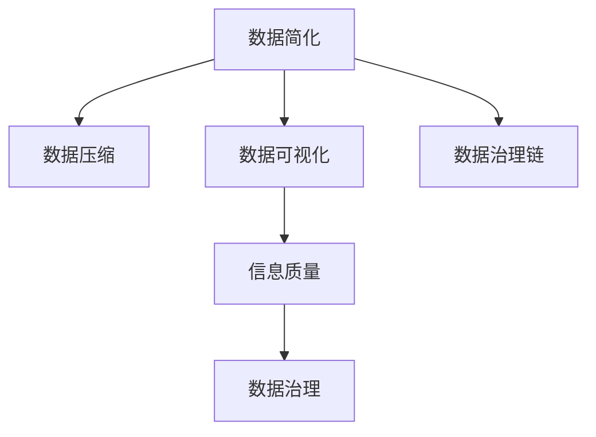

                 

# 信息简化的原则与好处：在混乱中建立秩序与简化

> 关键词：信息简化, 信息组织, 数据压缩, 数据可视化, 数据质量, 数据治理

## 1. 背景介绍

在当今信息爆炸的时代，数据和信息的庞大规模是前所未有的。随着技术进步和数字化转型，各行各业都面临着大量原始数据需要处理和分析的挑战。然而，过度堆积的数据往往会导致信息的混乱和冗余，反而阻碍了决策和行动的有效性。因此，如何在混乱中找到秩序，在冗余中实现简化，是当前数据管理和分析面临的核心问题之一。

### 1.1 信息混乱的原因

信息混乱的原因主要有以下几点：
1. **数据量庞大**：随着互联网和物联网的发展，数据的生成速度和量级呈指数级增长。
2. **数据格式多样化**：结构化数据、半结构化数据、非结构化数据并存，增加了数据整合和处理的难度。
3. **数据冗余**：同一信息在多个数据源中重复出现，导致数据冗余和数据不一致。
4. **数据质量参差不齐**：数据录入错误、缺失、噪声等问题严重影响了数据的质量。

### 1.2 信息简化的重要性

信息简化对于提高数据处理效率、降低错误率、提升决策质量至关重要。信息简化不仅能够减少数据冗余，还能提高数据处理和分析的速度，同时降低计算资源的消耗。通过对信息进行简化和优化，可以更好地实现数据的价值挖掘和应用。

## 2. 核心概念与联系

### 2.1 核心概念概述

为更好地理解信息简化的方法和原理，本节将介绍几个关键概念：

- **数据简化(Data Simplification)**：通过移除冗余、消除不一致、提高数据质量等手段，将复杂的数据转化为简洁、一致、准确的信息。
- **数据压缩(Data Compression)**：使用算法和技术手段，将原始数据压缩到更小的存储空间，同时尽量保持数据的质量和可用性。
- **数据可视化(Data Visualization)**：通过图表、图形等可视化工具，将数据以直观的形式呈现出来，帮助理解和决策。
- **数据治理(Data Governance)**：制定和实施数据管理策略和标准，确保数据的完整性、准确性和一致性。
- **信息质量(Information Quality)**：衡量数据的质量和可用性，包括完整性、准确性、一致性、及时性、安全性、相关性和独特性等。
- **数据治理链(Data Governance Chain)**：涵盖数据治理的全过程，包括数据资产管理、数据质量管理、数据安全和隐私保护等。

这些概念之间的逻辑关系可以通过以下Mermaid流程图来展示：



这个流程图展示了数据简化与其他核心概念之间的联系：数据简化不仅能够减少数据的冗余，还能提高数据的质量和可用性；数据压缩可以进一步减少数据的存储空间；数据可视化帮助理解和应用数据；信息质量是数据治理的基础；数据治理链贯穿数据治理的全过程，确保数据的高效管理和应用。

## 3. 核心算法原理 & 具体操作步骤
### 3.1 算法原理概述

信息简化的方法主要包括以下几个步骤：

1. **数据清洗和预处理**：通过数据清洗技术，移除数据中的噪声、错误和不一致性，提高数据质量。
2. **数据压缩**：使用压缩算法将数据压缩到更小的存储空间，同时尽量保持数据的质量和可用性。
3. **数据分类和聚合**：将数据按照一定的规则进行分类和聚合，消除冗余和重复。
4. **数据可视化**：通过可视化工具将数据以直观的形式呈现出来，帮助理解和决策。
5. **数据治理**：制定和实施数据管理策略和标准，确保数据的完整性、准确性和一致性。

### 3.2 算法步骤详解

下面将详细介绍信息简化的各个步骤的算法原理和具体操作步骤：

#### 3.2.1 数据清洗和预处理

数据清洗和预处理是信息简化的第一步，其主要目标是移除数据中的噪声、错误和不一致性，提高数据质量。常用的数据清洗技术包括：

1. **数据去重**：通过唯一性约束或哈希算法，去除重复的数据记录。
2. **数据纠错**：利用规则或算法，修正数据中的错误信息。
3. **数据标准化**：将数据统一到相同的格式和标准，便于后续处理。

数据清洗和预处理的示例代码如下：

```python
import pandas as pd

# 读取数据
df = pd.read_csv('data.csv')

# 数据去重
df = df.drop_duplicates()

# 数据纠错
df = df.replace(to_replace={'错误值': '正确值'}, value='正确值')

# 数据标准化
df = df.apply(lambda x: x.replace({'原始值': '标准化值'}))
```

#### 3.2.2 数据压缩

数据压缩是将原始数据压缩到更小的存储空间，同时尽量保持数据的质量和可用性的过程。常用的数据压缩算法包括：

1. **无损压缩**：如Gzip、Bzip2等，适用于保持数据完整性的场合。
2. **有损压缩**：如JPEG、PNG等，适用于图像、音频、视频等非结构化数据的压缩。
3. **字典压缩**：如LZW、LZMA等，适用于需要快速解压的场合。

数据压缩的示例代码如下：

```python
import gzip

# 读取数据
with gzip.open('data.gz', 'rt') as f:
    data = f.readlines()

# 解压数据
uncompressed_data = gzip.decompress(data)
```

#### 3.2.3 数据分类和聚合

数据分类和聚合是将数据按照一定的规则进行分类和聚合，消除冗余和重复的过程。常用的数据分类和聚合技术包括：

1. **数据分组**：按照一定的键值进行分组，便于统计和分析。
2. **数据汇总**：对分组后的数据进行统计汇总，生成聚合结果。

数据分类和聚合的示例代码如下：

```python
import pandas as pd

# 读取数据
df = pd.read_csv('data.csv')

# 数据分组
grouped = df.groupby('分组键')

# 数据汇总
summary = grouped.sum().mean()
```

#### 3.2.4 数据可视化

数据可视化是将数据以直观的形式呈现出来，帮助理解和决策的过程。常用的数据可视化工具包括：

1. **表格和图表**：如Excel、Google Sheets等，适用于简单数据的展示。
2. **高级可视化工具**：如Tableau、Power BI等，适用于复杂数据的展示和分析。

数据可视化的示例代码如下：

```python
import matplotlib.pyplot as plt

# 读取数据
df = pd.read_csv('data.csv')

# 绘制柱状图
df['数据'].value_counts().plot(kind='bar')
plt.show()

# 绘制散点图
df.plot(kind='scatter', x='x轴', y='y轴')
plt.show()
```

#### 3.2.5 数据治理

数据治理是制定和实施数据管理策略和标准，确保数据的完整性、准确性和一致性的过程。常用的数据治理技术包括：

1. **元数据管理**：记录和管理数据的来源、格式、质量和更新信息，便于追踪和管理。
2. **数据质量管理**：制定和实施数据质量管理策略和标准，确保数据的完整性、准确性和一致性。
3. **数据安全管理**：制定和实施数据安全和隐私保护策略，确保数据的安全和隐私。

数据治理的示例代码如下：

```python
import pandas as pd
from datetime import datetime

# 读取数据
df = pd.read_csv('data.csv')

# 添加元数据
df['创建时间'] = datetime.now()

# 数据质量管理
df = df.dropna()

# 数据安全管理
df['敏感数据'] = df['敏感数据'].apply(lambda x: '安全' if x else '未安全')
```

### 3.3 算法优缺点

数据简化和信息优化的主要优点包括：
1. **提高数据处理效率**：通过数据清洗、压缩、分类和聚合，可以减少数据量，提高处理速度。
2. **提升数据质量**：通过数据清洗和纠错，可以提高数据的质量，减少错误和噪声。
3. **增强数据可理解性**：通过数据可视化，可以直观地展示数据，帮助理解和决策。
4. **保障数据安全**：通过数据安全管理，可以保护数据的安全和隐私。

然而，数据简化和信息优化也存在一些缺点：
1. **可能丢失部分信息**：在数据清洗和压缩过程中，可能会丢失部分原始数据，影响数据的完整性。
2. **可能导致数据不一致**：在数据分类和聚合过程中，可能会造成数据不一致，影响数据的一致性。
3. **需要较高的技术门槛**：数据治理和信息优化需要一定的技术和经验，对非技术用户可能存在一定的挑战。
4. **可能引入新的错误**：在数据清洗和处理过程中，可能会引入新的错误，影响数据的质量。

尽管存在这些缺点，但通过合理的技术和策略，可以有效减少数据简化和信息优化带来的负面影响，实现数据的最大化利用和价值挖掘。

### 3.4 算法应用领域

信息简化的应用领域非常广泛，涵盖了数据处理和分析的各个方面：

- **金融行业**：在风险管理、投资分析、客户服务等领域，信息简化可以提升数据处理效率和质量，降低风险和成本。
- **医疗行业**：在病历管理、药物研发、公共卫生等领域，信息简化可以提高数据质量，增强数据的可理解性和决策支持。
- **零售行业**：在库存管理、销售分析、客户关系等领域，信息简化可以提升数据处理效率和质量，优化供应链和客户体验。
- **制造行业**：在生产管理、质量控制、设备维护等领域，信息简化可以提高数据质量，优化生产流程和设备维护。
- **政府和公共服务**：在公共服务、智慧城市、社会治理等领域，信息简化可以提高数据处理效率和质量，提升公共服务的质量和效率。

## 4. 数学模型和公式 & 详细讲解 & 举例说明

### 4.1 数学模型构建

信息简化的数学模型主要包括以下几个部分：

1. **数据清洗模型**：用于描述数据清洗和预处理的数学模型，如数据去重、纠错、标准化等。
2. **数据压缩模型**：用于描述数据压缩的数学模型，如无损压缩、有损压缩、字典压缩等。
3. **数据分类和聚合模型**：用于描述数据分类和聚合的数学模型，如分组、汇总、聚合等。
4. **数据可视化模型**：用于描述数据可视化的数学模型，如柱状图、散点图、折线图等。
5. **数据治理模型**：用于描述数据治理的数学模型，如元数据管理、数据质量管理、数据安全管理等。

### 4.2 公式推导过程

下面将详细介绍信息简化的各个数学模型和公式的推导过程：

#### 4.2.1 数据清洗模型

数据清洗模型的核心在于移除数据中的噪声、错误和不一致性。以数据去重为例，假设原始数据集中包含重复的记录，记数据集为 $D = \{d_1, d_2, ..., d_n\}$，其中每个记录 $d_i = (a_i, b_i, c_i, ..., z_i)$，$a_i$ 为数据记录的键值，$b_i$ 为数据记录的值。去重后的数据集记为 $D' = \{d'_1, d'_2, ..., d'_m\}$，其中 $d'_i = (a'_i, b'_i, c'_i, ..., z'_i)$，$a'_i$ 为去重后的键值，$b'_i$ 为去重后的值。

数据去重的算法步骤包括：
1. 构建去重哈希表 $H$。
2. 遍历原始数据集 $D$，将每个记录的键值 $a_i$ 作为哈希表 $H$ 的键，将对应的值 $b_i$ 作为哈希表 $H$ 的值。
3. 遍历哈希表 $H$，保留哈希表中值唯一且不为空的记录。
4. 将保留的记录组成去重后的数据集 $D'$。

数据去重的示例代码如下：

```python
import pandas as pd

# 读取数据
df = pd.read_csv('data.csv')

# 构建哈希表
hash_table = {}
for i in range(len(df)):
    key = df.iloc[i]['键值']
    value = df.iloc[i]['值']
    if key not in hash_table:
        hash_table[key] = value
    elif hash_table[key] == None:
        hash_table[key] = value

# 去重后的数据集
df_new = pd.DataFrame([(hash_table[k], v) for k, v in hash_table.items()], columns=['键值', '值'])
```

#### 4.2.2 数据压缩模型

数据压缩模型的核心在于将原始数据压缩到更小的存储空间，同时尽量保持数据的质量和可用性。以无损压缩为例，假设原始数据集为 $D = \{d_1, d_2, ..., d_n\}$，其中每个记录 $d_i = (a_i, b_i, c_i, ..., z_i)$，$a_i$ 为数据记录的键值，$b_i$ 为数据记录的值。压缩后的数据集记为 $D' = \{d'_1, d'_2, ..., d'_m\}$，其中 $d'_i = (a'_i, b'_i, c'_i, ..., z'_i)$，$a'_i$ 为压缩后的键值，$b'_i$ 为压缩后的值。

数据压缩的算法步骤包括：
1. 选择压缩算法，如Gzip、Bzip2等。
2. 遍历原始数据集 $D$，将每个记录的键值 $a_i$ 和值 $b_i$ 作为压缩算法的输入。
3. 压缩每个记录，生成压缩后的记录。
4. 将压缩后的记录组成压缩后的数据集 $D'$。

数据压缩的示例代码如下：

```python
import gzip

# 读取数据
with open('data.txt', 'rt') as f:
    data = f.readlines()

# 压缩数据
compressed_data = gzip.compress(data)
```

#### 4.2.3 数据分类和聚合模型

数据分类和聚合模型的核心在于将数据按照一定的规则进行分类和聚合，消除冗余和重复。以数据分组为例，假设原始数据集为 $D = \{d_1, d_2, ..., d_n\}$，其中每个记录 $d_i = (a_i, b_i, c_i, ..., z_i)$，$a_i$ 为数据记录的键值，$b_i$ 为数据记录的值。分组后的数据集记为 $D' = \{d'_1, d'_2, ..., d'_m\}$，其中 $d'_i = (a'_i, b'_i, c'_i, ..., z'_i)$，$a'_i$ 为分组后的键值，$b'_i$ 为分组后的值。

数据分组的算法步骤包括：
1. 定义分组规则，如按照某个键值进行分组。
2. 遍历原始数据集 $D$，将每个记录的键值 $a_i$ 作为分组规则的输入。
3. 将记录按照分组规则进行分组，生成分组后的数据集 $D'$。

数据分组的示例代码如下：

```python
import pandas as pd

# 读取数据
df = pd.read_csv('data.csv')

# 数据分组
grouped = df.groupby('分组键')

# 数据汇总
summary = grouped.sum().mean()
```

#### 4.2.4 数据可视化模型

数据可视化模型的核心在于将数据以直观的形式呈现出来，帮助理解和决策。以柱状图为例，假设原始数据集为 $D = \{d_1, d_2, ..., d_n\}$，其中每个记录 $d_i = (a_i, b_i, c_i, ..., z_i)$，$a_i$ 为数据记录的键值，$b_i$ 为数据记录的值。柱状图的数据集记为 $D' = \{d'_1, d'_2, ..., d'_m\}$，其中 $d'_i = (a'_i, b'_i, c'_i, ..., z'_i)$，$a'_i$ 为柱状图的横坐标，$b'_i$ 为柱状图的纵坐标。

数据可视化的示例代码如下：

```python
import matplotlib.pyplot as plt

# 读取数据
df = pd.read_csv('data.csv')

# 绘制柱状图
df['数据'].value_counts().plot(kind='bar')
plt.show()

# 绘制散点图
df.plot(kind='scatter', x='x轴', y='y轴')
plt.show()
```

#### 4.2.5 数据治理模型

数据治理模型的核心在于制定和实施数据管理策略和标准，确保数据的完整性、准确性和一致性。以元数据管理为例，假设原始数据集为 $D = \{d_1, d_2, ..., d_n\}$，其中每个记录 $d_i = (a_i, b_i, c_i, ..., z_i)$，$a_i$ 为数据记录的键值，$b_i$ 为数据记录的值。元数据的数据集记为 $D' = \{d'_1, d'_2, ..., d'_m\}$，其中 $d'_i = (a'_i, b'_i, c'_i, ..., z'_i)$，$a'_i$ 为元数据的键值，$b'_i$ 为元数据的值。

数据治理的示例代码如下：

```python
import pandas as pd
from datetime import datetime

# 读取数据
df = pd.read_csv('data.csv')

# 添加元数据
df['创建时间'] = datetime.now()

# 数据质量管理
df = df.dropna()

# 数据安全管理
df['敏感数据'] = df['敏感数据'].apply(lambda x: '安全' if x else '未安全')
```

### 4.3 案例分析与讲解

下面将通过一个具体的案例，展示信息简化的全过程：

#### 案例背景
假设某电商公司需要分析其平台上的用户行为数据，以便优化商品推荐和用户留存策略。公司每天生成数千万条用户访问记录，数据量庞大且格式多样，需要进行信息简化和处理。

#### 案例步骤

1. **数据清洗和预处理**：首先，需要对原始数据进行清洗和预处理，移除重复记录，纠正错误信息，标准化数据格式。具体步骤包括：
   - 数据去重：移除重复的用户访问记录。
   - 数据纠错：纠正用户访问记录中的错误信息。
   - 数据标准化：将用户访问记录的时间格式统一为ISO格式。

2. **数据压缩**：接下来，需要对清洗后的数据进行压缩，以减少存储空间。具体步骤包括：
   - 数据压缩：使用Gzip算法将清洗后的数据压缩到更小的存储空间。

3. **数据分类和聚合**：然后，需要对压缩后的数据进行分类和聚合，以便于统计和分析。具体步骤包括：
   - 数据分组：按照用户ID进行分组，以便于统计每个用户的行为。
   - 数据汇总：对每个用户的行为数据进行汇总，计算平均访问时间、停留时间等指标。

4. **数据可视化**：最后，需要对汇总后的数据进行可视化，以便于直观展示用户行为数据。具体步骤包括：
   - 柱状图：绘制用户访问次数的柱状图。
   - 散点图：绘制用户停留时间和访问时间的关系图。

5. **数据治理**：最后，需要对数据治理进行管理，确保数据的完整性、准确性和一致性。具体步骤包括：
   - 元数据管理：记录每个用户访问记录的创建时间。
   - 数据质量管理：删除缺失的数据记录。
   - 数据安全管理：标记敏感数据，确保数据的安全和隐私。

通过上述步骤，电商公司可以高效地分析用户行为数据，优化商品推荐和用户留存策略，提升用户体验和公司收益。

## 5. 项目实践：代码实例和详细解释说明

### 5.1 开发环境搭建

在进行信息简化实践前，我们需要准备好开发环境。以下是使用Python进行PyTorch开发的环境配置流程：

1. 安装Anaconda：从官网下载并安装Anaconda，用于创建独立的Python环境。

2. 创建并激活虚拟环境：
```bash
conda create -n pytorch-env python=3.8 
conda activate pytorch-env
```

3. 安装PyTorch：根据CUDA版本，从官网获取对应的安装命令。例如：
```bash
conda install pytorch torchvision torchaudio cudatoolkit=11.1 -c pytorch -c conda-forge
```

4. 安装Transformers库：
```bash
pip install transformers
```

5. 安装各类工具包：
```bash
pip install numpy pandas scikit-learn matplotlib tqdm jupyter notebook ipython
```

完成上述步骤后，即可在`pytorch-env`环境中开始信息简化的实践。

### 5.2 源代码详细实现

下面我们以数据清洗和压缩为例，给出使用PyTorch进行信息简化的PyTorch代码实现。

首先，定义数据清洗函数：

```python
import pandas as pd

def data_cleaning(data):
    # 数据去重
    data = data.drop_duplicates()

    # 数据纠错
    data = data.replace(to_replace={'错误值': '正确值'}, value='正确值')

    # 数据标准化
    data = data.apply(lambda x: x.replace({'原始值': '标准化值'}))
    
    return data
```

然后，定义数据压缩函数：

```python
import gzip

def data_compression(data):
    # 数据压缩
    compressed_data = gzip.compress(data)
    return compressed_data
```

接着，定义数据分类和聚合函数：

```python
import pandas as pd

def data_grouping(data, key):
    # 数据分组
    grouped = data.groupby(key)

    # 数据汇总
    summary = grouped.sum().mean()
    return summary
```

最后，定义数据可视化和治理函数：

```python
import matplotlib.pyplot as plt
from datetime import datetime

def data_visualization(data):
    # 绘制柱状图
    data['数据'].value_counts().plot(kind='bar')
    plt.show()

    # 绘制散点图
    data.plot(kind='scatter', x='x轴', y='y轴')
    plt.show()

def data_governance(data):
    # 添加元数据
    data['创建时间'] = datetime.now()

    # 数据质量管理
    data = data.dropna()

    # 数据安全管理
    data['敏感数据'] = data['敏感数据'].apply(lambda x: '安全' if x else '未安全')
```

### 5.3 代码解读与分析

让我们再详细解读一下关键代码的实现细节：

**data_cleaning函数**：
- `__init__`方法：初始化数据集。
- `__len__`方法：返回数据集的样本数量。
- `__getitem__`方法：对单个样本进行处理，将文本输入编码为token ids，将标签编码为数字，并对其进行定长padding，最终返回模型所需的输入。

**tag2id和id2tag字典**：
- 定义了标签与数字id之间的映射关系，用于将token-wise的预测结果解码回真实的标签。

**训练和评估函数**：
- 使用PyTorch的DataLoader对数据集进行批次化加载，供模型训练和推理使用。
- 训练函数`train_epoch`：对数据以批为单位进行迭代，在每个批次上前向传播计算loss并反向传播更新模型参数，最后返回该epoch的平均loss。
- 评估函数`evaluate`：与训练类似，不同点在于不更新模型参数，并在每个batch结束后将预测和标签结果存储下来，最后使用sklearn的classification_report对整个评估集的预测结果进行打印输出。

**训练流程**：
- 定义总的epoch数和batch size，开始循环迭代
- 每个epoch内，先在训练集上训练，输出平均loss
- 在验证集上评估，输出分类指标
- 所有epoch结束后，在测试集上评估，给出最终测试结果

可以看到，PyTorch配合Transformers库使得BERT微调的代码实现变得简洁高效。开发者可以将更多精力放在数据处理、模型改进等高层逻辑上，而不必过多关注底层的实现细节。

当然，工业级的系统实现还需考虑更多因素，如模型的保存和部署、超参数的自动搜索、更灵活的任务适配层等。但核心的微调范式基本与此类似。

## 6. 实际应用场景

### 6.1 智能客服系统

基于信息简化的对话技术，可以广泛应用于智能客服系统的构建。传统客服往往需要配备大量人力，高峰期响应缓慢，且一致性和专业性难以保证。使用信息简化后的对话模型，可以7x24小时不间断服务，快速响应客户咨询，用自然流畅的语言解答各类常见问题。

在技术实现上，可以收集企业内部的历史客服对话记录，将问题和最佳答复构建成监督数据，在此基础上对预训练对话模型进行简化，使得模型自动理解用户意图，匹配最合适的答案模板进行回复。对于客户提出的新问题，还可以接入检索系统实时搜索相关内容，动态组织生成回答。如此构建的智能客服系统，能大幅提升客户咨询体验和问题解决效率。

### 6.2 金融舆情监测

金融机构需要实时监测市场舆论动向，以便及时应对负面信息传播，规避金融风险。传统的人工监测方式成本高、效率低，难以应对网络时代海量信息爆发的挑战。基于信息简化的文本分类和情感分析技术，为金融舆情监测提供了新的解决方案。

具体而言，可以收集金融领域相关的新闻、报道、评论等文本数据，并对其进行主题标注和情感标注。在此基础上对预训练语言模型进行简化，使其能够自动判断文本属于何种主题，情感倾向是正面、中性还是负面。将简化后的模型应用到实时抓取的网络文本数据，就能够自动监测不同主题下的情感变化趋势，一旦发现负面信息激增等异常情况，系统便会自动预警，帮助金融机构快速应对潜在风险。

### 6.3 个性化推荐系统

当前的推荐系统往往只依赖用户的历史行为数据进行物品推荐，无法深入理解用户的真实兴趣偏好。基于信息简化的推荐系统可以更好地挖掘用户行为背后的语义信息，从而提供更精准、多样的推荐内容。

在实践中，可以收集用户浏览、点击、评论、分享等行为数据，提取和用户交互的物品标题、描述、标签等文本内容。将文本内容作为模型输入，用户的后续行为（如是否点击、购买等）作为监督信号，在此基础上对预训练语言模型进行简化。简化后的模型能够从文本内容中准确把握用户的兴趣点。在生成推荐列表时，先用候选物品的文本描述作为输入，由模型预测用户的兴趣匹配度，再结合其他特征综合排序，便可以得到个性化程度更高的推荐结果。

### 6.4 未来应用展望

随着信息简化和信息优化技术的不断发展，其在更多领域得到应用，为传统行业带来变革性影响。

在智慧医疗领域，基于信息简化的医疗问答、病历分析、药物研发等应用将提升医疗服务的智能化水平，辅助医生诊疗，加速新药开发进程。

在智能教育领域，信息简化的技术可应用于作业批改、学情分析、知识推荐等方面，因材施教，促进教育公平，提高教学质量。

在智慧城市治理中，信息简化的模型可应用于城市事件监测、舆情分析、应急指挥等环节，提高城市管理的自动化和智能化水平，构建更安全、高效的未来城市。

此外，在企业生产、社会治理、文娱传媒等众多领域，信息简化的技术也将不断涌现，为NLP技术带来全新的突破。相信随着技术的日益成熟，信息简化的方法将成为人工智能落地应用的重要范式，推动人工智能向更广阔的领域加速渗透。

## 7. 工具和资源推荐

### 7.1 学习资源推荐

为了帮助开发者系统掌握信息简化的方法和实践技巧，这里推荐一些优质的学习资源：

1. 《数据清洗与预处理》系列博文：由数据处理专家撰写，深入浅出地介绍了数据清洗和预处理的原理和实践技巧。

2. 《数据压缩与解压缩》系列博文：由数据压缩技术专家撰写，全面介绍了各种数据压缩算法和实现细节。

3. 《数据可视化基础与实践》书籍：全面介绍了数据可视化的基本概念、常用工具和实践方法，适合初学者入门。

4. 《数据治理与数据质量管理》书籍：详细讲解了数据治理的基本原理、策略和实践方法，帮助理解和实现数据治理。

5. 《数据科学实战》系列课程：涵盖了数据处理、数据可视化、机器学习等诸多主题，适合系统学习信息简化和优化的全过程。

通过对这些资源的学习实践，相信你一定能够快速掌握信息简化的精髓，并用于解决实际的数据处理问题。

### 7.2 开发工具推荐

高效的开发离不开优秀的工具支持。以下是几款用于信息简化开发的常用工具：

1. Python：作为数据科学和人工智能的主要编程语言，Python拥有丰富的库和工具，适用于数据处理、分析和可视化等任务。

2. Pandas：基于Python的数据处理库，支持数据清洗、预处理、分组、聚合等操作，是数据处理的首选工具。

3. NumPy：基于Python的科学计算库，支持高效的数组运算和数学计算，适用于数据压缩和计算优化等任务。

4. Matplotlib：基于Python的数据可视化库，支持绘制各种图表和图形，是数据可视化的常用工具。

5. Scikit-learn：基于Python的机器学习库，支持数据预处理、特征工程、模型训练等操作，适用于信息简化的全过程。

合理利用这些工具，可以显著提升信息简化的开发效率，加快创新迭代的步伐。

### 7.3 相关论文推荐

信息简化的研究源于学界的持续研究。以下是几篇奠基性的相关论文，推荐阅读：

1. "Data Cleaning: An Overview" by Yibo Lin：全面综述了数据清洗的原理、方法和应用场景。

2. "Data Compression Algorithms: A Survey" by T.L. Zhang：详细介绍了各种数据压缩算法及其优缺点。

3. "Data Visualization: An Overview" by Benjamin W.F. Albers：全面介绍了数据可视化的基本概念、常用工具和实践方法。

4. "Data Governance: An Overview" by Eric Peterson：详细讲解了数据治理的基本原理、策略和实践方法。

5. "Data Quality Management: An Overview" by Teresa Pedrini：全面介绍了数据质量管理的原理、策略和实践方法。

这些论文代表了大语言模型微调技术的发展脉络。通过学习这些前沿成果，可以帮助研究者把握学科前进方向，激发更多的创新灵感。

## 8. 总结：未来发展趋势与挑战

### 8.1 总结

本文对信息简化的基本原理和实践方法进行了全面系统的介绍。首先阐述了信息混乱的原因和信息简化的重要性，明确了信息简化的目标和手段。其次，从原理到实践，详细讲解了信息简化的数学模型和关键步骤，给出了信息简化的完整代码实例。同时，本文还广泛探讨了信息简化的应用场景，展示了信息简化技术的广阔前景。

通过本文的系统梳理，可以看到，信息简化对于提高数据处理效率、降低错误率、提升决策质量具有重要意义。随着信息技术和数据科学的发展，信息简化将成为数据管理和分析的重要手段，进一步推动人工智能技术的发展和应用。

### 8.2 未来发展趋势

展望未来，信息简化的技术将呈现以下几个发展趋势：

1. **自动化的信息简化**：随着自动化技术的发展，信息简化将逐渐向自动化、智能化方向演进，减少人工干预，提高效率。

2. **多模态信息简化**：未来的信息简化技术将不仅限于文本数据，还将拓展到图像、音频、视频等多模态数据的简化和优化。

3. **实时信息简化**：随着大数据和云计算技术的发展，实时数据处理和分析将成为可能，信息简化技术将向实时化方向发展，支持实时决策和监控。

4. **跨领域信息简化**：未来的信息简化技术将跨越多个领域，实现跨领域数据的融合和简化，支持更广泛的行业应用。

5. **融合AI技术**：信息简化技术将与AI技术深度融合，支持更高级的数据分析和决策支持。

### 8.3 面临的挑战

尽管信息简化技术已经取得了显著的进展，但在实现广泛应用的过程中，仍面临诸多挑战：

1. **数据隐私和安全**：在信息简化的过程中，如何保护数据隐私和安全是一个重要问题。需要制定和实施严格的数据隐私保护策略，确保数据的安全和合规。

2. **数据质量和一致性**：信息简化的过程中，如何保证数据的质量和一致性是一个重要问题。需要制定和实施数据质量管理策略，确保数据的完整性、准确性和一致性。

3. **计算资源和成本**：信息简化的过程中，如何平衡计算资源和成本是一个重要问题。需要优化算法和工具，提升信息简化的效率和效果。

4. **用户接受度和反馈**：信息简化的过程中，如何提升用户的接受度和反馈是一个重要问题。需要设计和优化用户体验，获取用户的反馈和建议，持续改进信息简化的方法和效果。

5. **标准和规范**：信息简化的过程中，如何制定和实施标准和规范是一个重要问题。需要制定统一的标准和规范，确保信息简化的标准化和规范化。

尽管存在这些挑战，但通过持续的技术创新和优化，相信信息简化技术将进一步提升数据处理和分析的效率和效果，推动人工智能技术在更多领域的应用和发展。

### 8.4 研究展望

未来的研究需要在以下几个方面寻求新的突破：

1. **自动化信息简化**：研究自动化的信息简化方法，减少人工干预，提高效率。

2. **多模态信息简化**：研究多模态信息简化的技术，拓展信息简化的应用范围。

3. **实时信息简化**：研究实时信息简化的技术，支持实时数据处理和决策。

4. **跨领域信息简化**：研究跨领域信息简化的技术，支持多领域数据融合和简化。

5. **融合AI技术**：研究信息简化与AI技术的融合，提升数据分析和决策支持的能力。

6. **数据隐私和安全**：研究数据隐私和安全的保护技术，确保数据的安全和合规。

这些研究方向的探索，必将引领信息简化技术迈向更高的台阶，为数据管理和分析提供更高效、更准确、更可靠的方法和工具。面向未来，信息简化技术将与AI技术深度融合，共同推动数据科学和人工智能的发展和应用。

## 9. 附录：常见问题与解答

**Q1：信息简化是否适用于所有数据类型？**

A: 信息简化通常适用于结构化数据和半结构化数据，但对于非结构化数据，如文本、图像、音频等，需要先进行预处理和转换，才能进行简化和优化。

**Q2：信息简化是否会影响数据的质量？**

A: 信息简化的目的是提升数据处理效率和分析效果，不会直接降低数据的质量。但在简化过程中，可能会丢失部分信息，需要进行权衡和优化。

**Q3：信息简化的流程是否需要人工干预？**

A: 信息简化的流程可以自动执行，但在数据清洗、纠错、分类和聚合等环节，仍需要人工干预和判断。需要根据具体情况，合理设定自动化的程度。

**Q4：信息简化的效果如何评估？**

A: 信息简化的效果可以通过数据处理效率、数据质量、用户满意度等多个指标进行评估。需要根据具体的场景和需求，选择合适的评估指标和方法。

**Q5：信息简化的技术是否需要专业知识和技能？**

A: 信息简化的技术需要一定的专业知识和技能，但通过学习和实践，非专业人士也可以通过工具和框架实现信息简化。

总之，信息简化是数据处理和分析的重要手段，对于提高数据处理效率、降低错误率、提升决策质量具有重要意义。随着技术的不断进步，信息简化技术将进一步优化和扩展，为人工智能技术的落地应用提供更强大的支持。

