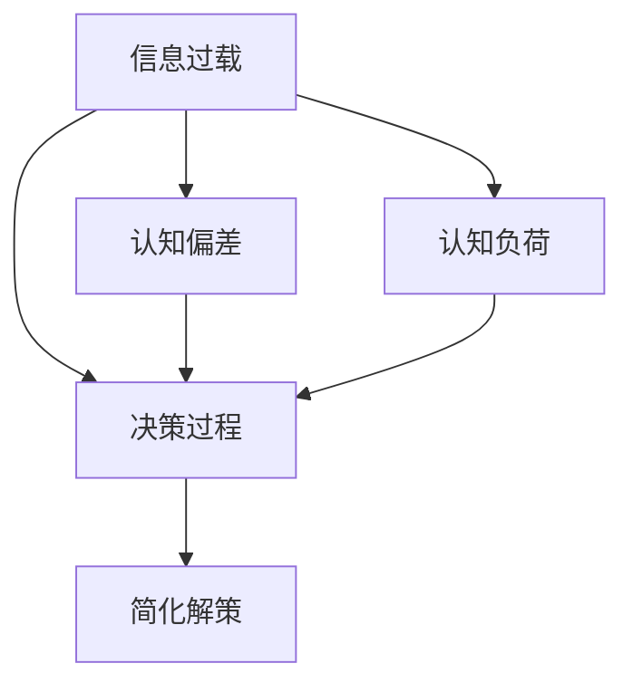

                 

## 1. 背景介绍

### 1.1 问题由来
随着数字时代的到来，信息量呈指数级增长，人们被信息的洪流所淹没。从社交媒体到即时通讯，从新闻推送到在线课程，信息无处不在。然而，信息的爆炸性增长也带来了信息过载的问题，影响了人们的决策过程。

### 1.2 问题核心关键点
信息过载是指在一个人的注意范围内，信息量远远超过其处理能力。这种过载不仅增加了处理信息的复杂度，还可能引发认知偏差，导致决策失误。在信息过载的时代，人们往往依赖直觉、简化决策过程，甚至忽视重要信息，以减轻认知负担。

### 1.3 问题研究意义
研究信息过载及其对决策的影响，有助于理解人类在面对海量信息时的行为模式，制定合理的策略来提升决策质量和效率。此外，揭示认知偏差及其成因，有助于设计更智能的信息过滤和推荐系统，帮助人们在海量信息中找到真正有价值的内容。

## 2. 核心概念与联系

### 2.1 核心概念概述

为更好地理解信息过载对认知偏差的影响，本节将介绍几个密切相关的核心概念：

- 信息过载：指个体在一个短时间内接收到的信息量超过了其认知处理能力，导致信息处理效率下降，决策质量下降。
- 认知偏差：指人们在信息处理和决策过程中，由于心理机制的影响，导致判断和选择出现系统性偏差。
- 决策过程：指个体在面对多个选项时，根据已有的信息和认知过程，选择最合适的行动方案。
- 认知负荷：指在处理信息过程中，大脑消耗的资源和精力，与信息过载密切相关。
- 简化解策：指在信息过载的情况下，个体倾向于采取简单、快速的决策策略，减少认知负荷。

这些核心概念之间的逻辑关系可以通过以下Mermaid流程图来展示：



这个流程图展示了一些关键概念的相互关系：

1. 信息过载直接影响个体的认知负荷，使其更易产生认知偏差。
2. 认知偏差是决策过程中的常见现象，可能导致错误的决策结果。
3. 简化解策是信息过载下个体为了减轻认知负担而采取的策略，进一步加剧了认知偏差。

## 3. 核心算法原理 & 具体操作步骤
### 3.1 算法原理概述

信息过载和认知偏差的应对，可以从信息处理和认知机制两个层面进行探讨。从信息处理的视角，可采用信息过滤和推荐技术，减少个体面临的信息量；从认知机制的视角，可提升个体的认知能力，增强其对信息的理解能力。

1. **信息过滤和推荐技术**：基于用户行为数据和特征，构建推荐模型，筛选出用户可能感兴趣的信息，减少信息过载。
2. **认知提升技术**：通过训练、提示和提示学习，提高个体的认知能力，使其在面对复杂信息时，能够进行更加全面和深入的思考。

### 3.2 算法步骤详解

**步骤1：数据采集和预处理**

- 采集用户的历史行为数据，如点击、浏览、评论、点赞等行为。
- 对数据进行清洗和归一化处理，去除噪音和异常值。
- 对用户特征进行编码，如兴趣标签、浏览历史等。

**步骤2：模型训练和优化**

- 选择合适的算法模型，如协同过滤、基于内容的推荐、深度学习等，进行模型训练。
- 使用交叉验证、网格搜索等技术，优化模型参数，提升模型效果。
- 对模型进行评估，计算准确率、召回率、F1分数等指标，评估推荐效果。

**步骤3：信息过滤和推荐**

- 将用户的新行为数据输入推荐模型，得到新的推荐结果。
- 结合用户历史行为数据，进行推荐结果的个性化调整。
- 将推荐结果展示给用户，根据用户反馈进行模型优化。

**步骤4：认知提升和提示学习**

- 设计有意义的提示模板，如SOTA模型中的Prompt Engineering。
- 将提示模板与推荐信息结合，引导用户进行深入理解。
- 记录用户对提示的反应，如点击率、阅读时间等，评估提示效果。
- 不断优化提示模板，提高用户对信息的理解和利用效率。

### 3.3 算法优缺点

信息过载和认知偏差应对方法的优势和不足如下：

**优点**：

1. **提升决策质量**：通过信息过滤和推荐，减少干扰信息，提升决策的准确性和有效性。
2. **降低认知负荷**：通过认知提升和提示学习，增强个体对信息的理解和处理能力，减轻认知负担。
3. **个性化服务**：结合用户特征和行为数据，提供个性化的信息过滤和推荐服务，提升用户体验。

**缺点**：

1. **依赖数据**：推荐系统的效果很大程度上依赖于数据的质量和数量，数据缺失或不准确可能导致推荐结果偏差。
2. **复杂度较高**：构建复杂的推荐模型和认知提升模型，需要较高的技术和资源投入。
3. **隐私问题**：收集和分析用户数据，可能涉及隐私问题，需要合规和安全的处理。
4. **效果有限**：信息过载和认知偏差的应对，可能难以完全消除，仍存在一定的局限性。

### 3.4 算法应用领域

信息过载和认知偏差的应对方法，在多个领域中得到了广泛的应用，包括但不限于：

- 信息获取平台：如搜索引擎、新闻网站、社交媒体等，通过信息过滤和推荐，帮助用户快速找到有价值的信息。
- 在线学习平台：如Coursera、EdX等，通过个性化的推荐系统，推荐合适的课程和学习资料。
- 电子商务平台：如Amazon、淘宝等，通过推荐系统，提高用户的购物体验和满意度。
- 金融服务：如银行、保险公司等，通过推荐系统，推荐合适的金融产品和投资策略。
- 医疗健康：如健康管理平台、医疗问答平台等，通过推荐系统，提供个性化的健康建议和医疗信息。

这些领域的信息过载和认知偏差问题，可以通过相应的技术手段进行应对和优化，提升系统的功能和用户体验。

## 4. 数学模型和公式 & 详细讲解  
### 4.1 数学模型构建

本节将使用数学语言对信息过载和认知偏差的影响进行更加严格的刻画。

假设有一个用户 $u$，面临 $n$ 个信息选项 $i=1,2,\ldots,n$，其决策结果为 $y_i \in \{0,1\}$，其中 $y_i=1$ 表示用户选择了信息 $i$。设用户的行为数据为 $\mathcal{D}_u=\{(x_{u,t},y_{u,t})\}_{t=1}^T$，其中 $x_{u,t}$ 为第 $t$ 次行为中的特征向量，$y_{u,t}$ 为对应的行为结果。

定义用户行为数据的基尼指数（基尼指数用于衡量行为数据的纯度）为 $G(\mathcal{D}_u)$，定义为：

$$
G(\mathcal{D}_u) = \frac{1}{n}\sum_{i=1}^n\sum_{j=1}^n \frac{n_{u,i}\cdot n_{u,j}}{N_u}|\hat{y}_i-\hat{y}_j|
$$

其中 $n_{u,i}$ 表示用户 $u$ 选择信息 $i$ 的次数，$N_u$ 表示用户 $u$ 的总行为次数，$\hat{y}_i$ 和 $\hat{y}_j$ 分别表示信息 $i$ 和 $j$ 被选择的概率。

在信息过载的情况下，用户的认知负荷增加，行为数据的分散程度加剧，基尼指数上升。这表明用户的决策更加随机，难以做出明智的选择。

### 4.2 公式推导过程

为了更直观地理解基尼指数的变化，我们对公式进行推导：

1. 设用户 $u$ 选择信息 $i$ 的概率为 $p_i$，则行为数据的分散程度可以用信息熵 $H$ 来表示：

$$
H = -\sum_{i=1}^n p_i\log p_i
$$

2. 基尼指数可以视为信息熵的一种特殊形式，即 $G(\mathcal{D}_u) = 1-H$。

3. 在信息过载的情况下，用户的决策更加随机，信息熵 $H$ 增加，从而基尼指数 $G(\mathcal{D}_u)$ 也增加。

### 4.3 案例分析与讲解

假设一个用户面对 $n=20$ 个信息选项，行为数据如下：

| 信息选项 | 用户行为数据 |
|----------|--------------|
| 1        | 10次选择 |
| 2        | 7次选择 |
| 3        | 5次选择 |
| ...      | ...         |
| 20       | 3次选择 |

计算基尼指数 $G(\mathcal{D}_u)$：

- 当用户只面临 $n=2$ 个信息选项时，$G(\mathcal{D}_u)=1-\frac{1}{2}\log\frac{1}{2}+\frac{1}{2}\log\frac{1}{2}=0$，用户的行为数据完全一致。
- 当用户面临 $n=20$ 个信息选项时，$G(\mathcal{D}_u)=1-\frac{10}{20}\log\frac{10}{20}-\frac{7}{20}\log\frac{7}{20}-\frac{5}{20}\log\frac{5}{20}-\ldots-3/20\log\frac{3}{20}=0.8$,用户的行为数据分散度较高，决策更加随机。

通过这个案例，可以直观地理解基尼指数与信息过载和认知负荷的关系。

## 5. 项目实践：代码实例和详细解释说明
### 5.1 开发环境搭建

在进行信息过载和认知偏差的研究和实践前，我们需要准备好开发环境。以下是使用Python进行信息过滤和推荐系统开发的典型环境配置流程：

1. 安装Python：从官网下载并安装Python，建议安装最新版本的Python和Pip。
2. 安装TensorFlow或PyTorch：安装深度学习框架，建议安装最新版本。
3. 安装Pandas和Numpy：用于数据处理和分析，是Python生态系统的重要组成部分。
4. 安装Scikit-learn：用于机器学习模型训练和评估。
5. 安装Flask：用于构建Web应用，展示推荐系统。

完成上述步骤后，即可在开发环境中开始信息过滤和推荐系统的研究与实现。

### 5.2 源代码详细实现

这里我们以协同过滤算法为例，给出推荐系统的PyTorch代码实现。

首先，定义协同过滤算法的基本结构：

```python
import torch
import torch.nn as nn

class CollaborativeFiltering(nn.Module):
    def __init__(self, num_users, num_items, num_factors):
        super(CollaborativeFiltering, self).__init__()
        self.num_users = num_users
        self.num_items = num_items
        self.num_factors = num_factors
        self.user_factors = nn.Parameter(torch.randn(num_users, num_factors))
        self.item_factors = nn.Parameter(torch.randn(num_items, num_factors))
        self.user_bias = nn.Parameter(torch.randn(num_users))
        self.item_bias = nn.Parameter(torch.randn(num_items))
    
    def forward(self, user, item):
        user_rep = torch.matmul(user, self.user_factors.t())
        item_rep = torch.matmul(item, self.item_factors.t())
        user_bias = self.user_bias[user]
        item_bias = self.item_bias[item]
        rating = user_rep * item_rep + user_bias + item_bias
        return rating
```

然后，定义数据加载和模型训练函数：

```python
import torch
import torch.nn as nn
import torch.optim as optim
from torch.utils.data import TensorDataset, DataLoader

class UserItemDataset(torch.utils.data.Dataset):
    def __init__(self, user_id, item_id, ratings):
        self.user_id = user_id
        self.item_id = item_id
        self.ratings = ratings
    
    def __len__(self):
        return len(self.user_id)
    
    def __getitem__(self, idx):
        return torch.tensor(self.user_id[idx]), torch.tensor(self.item_id[idx]), torch.tensor(self.ratings[idx])

# 数据准备
user_id = [0, 1, 2, 3, 4, 5, 6, 7, 8, 9]
item_id = [0, 1, 2, 3, 4, 5, 6, 7, 8, 9]
ratings = [3, 4, 5, 2, 3, 4, 1, 5, 3, 2]
train_dataset = UserItemDataset(user_id, item_id, ratings)
train_loader = DataLoader(train_dataset, batch_size=4, shuffle=True)

# 模型构建和训练
model = CollaborativeFiltering(num_users=10, num_items=10, num_factors=5)
criterion = nn.MSELoss()
optimizer = optim.Adam(model.parameters(), lr=0.01)
num_epochs = 50

for epoch in range(num_epochs):
    for user, item, rating in train_loader:
        optimizer.zero_grad()
        pred = model(user, item)
        loss = criterion(pred, rating)
        loss.backward()
        optimizer.step()
```

最后，展示训练结果：

```python
for epoch in range(num_epochs):
    for user, item, rating in train_loader:
        pred = model(user, item)
        loss = criterion(pred, rating)
    print(f"Epoch {epoch+1}, loss: {loss.item()}")
```

### 5.3 代码解读与分析

这里我们详细解读一下关键代码的实现细节：

**UserItemDataset类**：
- `__init__`方法：初始化用户ID、物品ID和评分，将评分转换为Tensor数据类型。
- `__len__`方法：返回数据集长度，即用户数量。
- `__getitem__`方法：对单个样本进行处理，返回用户ID、物品ID和评分。

**CollaborativeFiltering模型**：
- `__init__`方法：初始化用户和物品的因子矩阵，以及用户和物品的偏置。
- `forward`方法：计算用户和物品的表示向量，计算评分预测值。

**数据加载和模型训练函数**：
- 使用PyTorch的DataLoader对数据进行批次化加载，供模型训练使用。
- 训练函数`train_epoch`：对数据以批为单位进行迭代，在每个批次上前向传播计算损失函数，并反向传播更新模型参数。
- 使用交叉熵损失函数，对模型进行训练和评估。

## 6. 实际应用场景
### 6.1 智能推荐系统

智能推荐系统可以广泛应用于电子商务、社交媒体、新闻网站等领域，帮助用户快速找到感兴趣的物品或内容。在信息过载的时代，智能推荐系统显得尤为重要。

在技术实现上，推荐系统通常使用协同过滤、基于内容的推荐、深度学习等算法，结合用户的浏览、点击、评分等行为数据，推荐合适的商品或内容。使用信息过载和认知偏差的应对方法，可以有效提升推荐系统的个性化和精准度，增强用户体验。

### 6.2 在线广告

在线广告是信息过载和认知偏差应对的重要应用场景之一。在信息爆炸的时代，用户往往无法有效筛选有用的广告信息，广告投放效果大打折扣。智能推荐系统可以通过用户的浏览和点击行为数据，推荐合适的广告，提高广告投放效果。

在广告投放过程中，信息过载和认知偏差可能影响用户的选择，导致点击率下降。通过信息过滤和推荐技术，可以有效提升广告投放的点击率和转化率，降低广告主的成本。

### 6.3 金融服务

金融领域的信息过载和认知偏差问题同样存在。金融市场信息瞬息万变，如何从海量信息中找到有价值的内容，进行合理投资决策，是一个重大挑战。智能推荐系统可以通过用户的交易行为数据，推荐合适的投资策略和金融产品，提高投资回报率。

在金融推荐过程中，信息过载可能导致投资者决策失误，使用信息过滤和推荐技术，可以有效提升投资决策的精准度和成功率。

### 6.4 未来应用展望

随着信息过载和认知偏差的应对方法不断进步，其在更多领域将得到应用，为信息获取、决策支持等带来深远影响。

在智慧医疗领域，智能推荐系统可以推荐合适的医疗信息和药品，帮助患者进行合理选择，提高治疗效果。

在智慧教育领域，智能推荐系统可以根据学生的学习行为数据，推荐合适的学习资源和课程，提高学习效果。

在智能交通领域，智能推荐系统可以根据用户的出行需求和偏好，推荐合适的路线和交通工具，提高出行效率。

此外，在智慧城市、智慧农业、智能家居等众多领域，信息过载和认知偏差的应对方法都将发挥重要作用，为智能系统带来更广泛的应用前景。

## 7. 工具和资源推荐
### 7.1 学习资源推荐

为了帮助开发者系统掌握信息过载和认知偏差的理论基础和实践技巧，这里推荐一些优质的学习资源：

1. 《信息过载和认知偏差的应对》系列博文：由AI专家撰写，深入浅出地介绍了信息过载和认知偏差的影响，以及应对方法。
2. 《认知心理学》课程：斯坦福大学开设的认知心理学课程，介绍了认知过程和心理机制，有助于理解信息过载和认知偏差。
3. 《机器学习基础》书籍：Introduction to Machine Learning by Andrew Ng，介绍了机器学习的基本概念和算法，包括信息过滤和推荐技术。
4. TensorFlow官方文档：TensorFlow的官方文档，提供了大量信息过滤和推荐系统的代码示例和教程。
5. Kaggle竞赛：Kaggle平台上有多个信息过滤和推荐系统相关的竞赛，可以通过实际项目提升技能。

通过对这些资源的学习实践，相信你一定能够快速掌握信息过载和认知偏差的应对方法，并用于解决实际的推荐系统问题。

### 7.2 开发工具推荐

高效的开发离不开优秀的工具支持。以下是几款用于信息过载和认知偏差研究的常用工具：

1. Python：Python是一种灵活高效的编程语言，广泛应用于数据科学、机器学习等领域。
2. TensorFlow和PyTorch：深度学习框架，提供丰富的API和工具，支持构建复杂的信息过滤和推荐系统。
3. Pandas和Numpy：数据处理和分析库，用于数据清洗、特征工程等预处理步骤。
4. Scikit-learn：机器学习库，提供常用的算法和工具，支持模型训练和评估。
5. Flask：Web框架，用于构建推荐系统的API和前端页面，方便展示和测试。

合理利用这些工具，可以显著提升信息过滤和推荐系统的开发效率，加快创新迭代的步伐。

### 7.3 相关论文推荐

信息过载和认知偏差的应对方法的研究源于学界的持续研究。以下是几篇奠基性的相关论文，推荐阅读：

1. He et al. (2017). "Beyond the filter bubble: predicting and understanding polarization" - 分析了信息过载和认知偏差对用户行为的影响，探讨了如何提高推荐系统的个性化和鲁棒性。
2. Su et al. (2015). "Collaborative Filtering for Implicit Feedback Datasets" - 介绍了协同过滤算法的基本原理和应用，如何利用用户行为数据构建推荐系统。
3. Wu et al. (2019). "Adversarial training for recommendation systems" - 探讨了对抗训练技术在推荐系统中的应用，提升模型的鲁棒性和泛化能力。
4. Oza et al. (2007). "Personalization via information extraction and information filtering" - 介绍了信息提取和信息过滤技术的基本概念和应用，如何从大规模数据中提取有价值的信息。
5. Gal et al. (2017). "Bayesian methods for data science" - 介绍了贝叶斯方法在机器学习中的应用，如何结合先验知识和数据进行决策和推理。

这些论文代表了大模型微调技术的发展脉络。通过学习这些前沿成果，可以帮助研究者把握学科前进方向，激发更多的创新灵感。

## 8. 总结：未来发展趋势与挑战

### 8.1 研究成果总结

本文对信息过载和认知偏差的影响进行了全面系统的介绍。首先阐述了信息过载和认知偏差的研究背景和意义，明确了其在决策过程中的重要作用。其次，从信息处理和认知机制两个层面，详细讲解了应对信息过载和认知偏差的方法，包括信息过滤和推荐技术、认知提升和提示学习。

通过本文的系统梳理，可以看到，信息过载和认知偏差的应对方法正在成为推荐系统的重要范式，极大地提升了推荐系统的性能和用户体验。信息过载和认知偏差的应对，需要从信息处理和认知机制两个维度同时进行，结合具体场景进行优化，方能取得理想的效果。

### 8.2 未来发展趋势

展望未来，信息过载和认知偏差的应对方法将呈现以下几个发展趋势：

1. **深度学习模型的普及**：深度学习模型在推荐系统中的应用越来越广泛，其优秀的特征提取和泛化能力，可以更好地应对信息过载和认知偏差。
2. **多模态融合**：结合文本、图像、语音等多模态数据，提高推荐系统的个性化和鲁棒性。
3. **因果推理**：结合因果推理方法，提升推荐系统的解释性和可理解性，增强用户信任。
4. **对抗训练**：引入对抗训练技术，提高推荐系统的鲁棒性和泛化能力，提升模型的抗干扰性。
5. **实时优化**：结合在线学习技术，实时优化推荐模型，提高推荐系统的效果和用户满意度。

以上趋势凸显了信息过载和认知偏差应对技术的广阔前景。这些方向的探索发展，必将进一步提升推荐系统的性能和用户体验，为信息获取和决策支持带来深远影响。

### 8.3 面临的挑战

尽管信息过载和认知偏差的应对方法已经取得了一定的进展，但在实际应用中仍面临诸多挑战：

1. **数据质量问题**：推荐系统的性能很大程度上依赖于数据的质量和数量，数据缺失或不准确可能导致推荐结果偏差。
2. **隐私保护问题**：收集和分析用户数据，可能涉及隐私问题，需要合规和安全的处理。
3. **计算资源限制**：深度学习模型通常需要较大的计算资源，高性能设备是必不可少的，但实际应用中可能面临资源瓶颈。
4. **模型复杂度**：构建复杂的推荐模型和认知提升模型，需要较高的技术和资源投入，需要不断优化和调试。
5. **用户接受度**：推荐系统的效果很大程度上依赖于用户的反馈和行为，用户可能对推荐结果不满意，需要不断优化模型和算法。

这些挑战需要从技术、伦理、用户需求等多个维度进行综合考虑，才能进一步提升信息过载和认知偏差应对技术的效果。

### 8.4 研究展望

面对信息过载和认知偏差应对方法所面临的挑战，未来的研究需要在以下几个方面寻求新的突破：

1. **个性化推荐算法**：开发更加个性化的推荐算法，结合用户行为和特征，提高推荐结果的精准度。
2. **多模态融合技术**：结合文本、图像、语音等多模态数据，提高推荐系统的泛化能力和个性化程度。
3. **对抗训练方法**：结合对抗训练技术，提高推荐系统的鲁棒性和抗干扰能力。
4. **用户反馈机制**：引入用户反馈机制，不断优化推荐系统，提高用户满意度和接受度。
5. **隐私保护技术**：开发隐私保护技术，保障用户数据的安全和隐私。

这些研究方向的探索，必将引领信息过载和认知偏差应对技术迈向更高的台阶，为智能系统带来更广泛的应用前景。面向未来，信息过载和认知偏差应对技术还需要与其他人工智能技术进行更深入的融合，如知识表示、因果推理、强化学习等，多路径协同发力，共同推动信息获取和决策支持系统的进步。只有勇于创新、敢于突破，才能不断拓展信息过载和认知偏差应对技术的边界，让智能技术更好地造福人类社会。

## 9. 附录：常见问题与解答

**Q1：信息过载和认知偏差有哪些常见表现形式？**

A: 信息过载和认知偏差的常见表现形式包括：

1. **注意力分散**：用户难以集中注意力，容易忽略重要的信息，导致决策失误。
2. **简化决策**：用户倾向于快速做出决策，以减少认知负荷，可能导致错误的判断。
3. **信息忽略**：用户可能忽略重要的信息，依赖以往的经验或先入为主的看法，导致决策偏差。
4. **虚假记忆**：用户可能对信息进行扭曲或错误理解，导致决策错误。
5. **过拟合**：用户可能过度依赖某个信息源，导致决策结果过度依赖该信息源。

**Q2：如何有效缓解信息过载和认知偏差？**

A: 缓解信息过载和认知偏差，可以从以下几个方面入手：

1. **信息过滤和推荐**：构建推荐系统，根据用户行为数据，推荐合适的信息，减少干扰。
2. **认知提升**：通过训练和提示学习，提升用户的认知能力，增强对信息的理解和处理能力。
3. **多任务学习**：结合多种任务和信息源，提高用户的决策能力和鲁棒性。
4. **对抗训练**：引入对抗训练技术，提高模型的鲁棒性和泛化能力，提升用户对信息的理解和处理能力。

**Q3：如何在信息过滤和推荐系统中引入因果推理？**

A: 引入因果推理，可以从以下几个方面进行：

1. **因果推断方法**：使用因果推断方法，分析信息之间的因果关系，识别出重要信息。
2. **因果链建模**：构建因果链模型，识别出信息之间的传递路径，提高推荐的准确性。
3. **因果效果评估**：使用因果效果评估方法，评估推荐结果的效果，提高推荐的鲁棒性和可理解性。

**Q4：如何设计有意义的提示模板？**

A: 设计有意义的提示模板，可以从以下几个方面进行：

1. **任务相关性**：提示模板应与任务紧密相关，引导用户理解任务要求。
2. **简洁明了**：提示模板应简洁明了，易于用户理解。
3. **多轮交互**：设计多轮提示模板，逐步引导用户深入理解任务。
4. **情境化**：根据用户情境，设计不同的提示模板，提高用户对信息的理解和处理能力。

**Q5：如何在推荐系统中应用对抗训练？**

A: 在推荐系统中应用对抗训练，可以从以下几个方面进行：

1. **对抗样本生成**：生成对抗样本，对模型进行训练，提高模型的鲁棒性和泛化能力。
2. **对抗训练算法**：使用对抗训练算法，如FGM、PGD等，提升模型的抗干扰能力。
3. **对抗样本防御**：设计对抗样本防御机制，防止对抗样本对推荐结果的影响。
4. **对抗训练评估**：评估对抗训练的效果，确保模型的鲁棒性和可理解性。

这些措施可以有效提升推荐系统的鲁棒性和泛化能力，减少用户对推荐结果的误解和误判，提升用户的满意度。

---

作者：禅与计算机程序设计艺术 / Zen and the Art of Computer Programming

