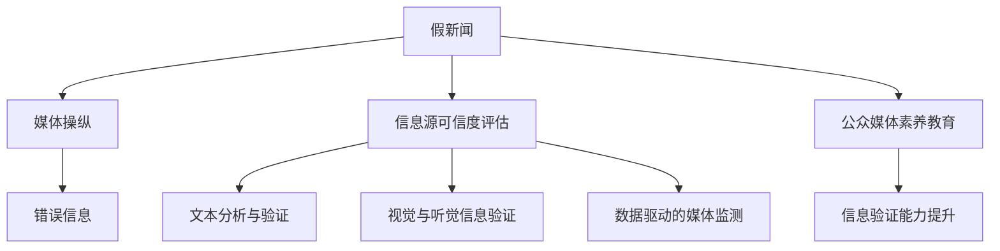

                 

# 信息验证和媒体素养能力：为假新闻、媒体操纵和错误信息做好准备

在数字时代，信息的流通速度和规模达到了前所未有的高度。这一方面极大地推动了社会的发展和知识的普及，另一方面也带来了假新闻、媒体操纵和错误信息的泛滥，严重影响了公众的判断力和决策能力。面对这一严峻挑战，提升信息验证和媒体素养能力显得尤为重要。本文将深入探讨信息验证和媒体素养的核心概念、关键技术、应用场景，并给出详细的实践指南，帮助读者在这信息爆炸的时代，更好地辨别真伪，保护自己免受误导。

## 1. 背景介绍

### 1.1 问题由来
近年来，随着社交媒体、短视频平台等新媒体的兴起，信息传播速度显著加快，传播渠道愈加多元化。伴随而来的是大量未经核实的信息和误导性报道充斥网络，对公众认知和社会稳定造成了严重干扰。特别是在选举、公共卫生、社会事件等关键领域，假新闻和错误信息的危害更是令人警醒。

### 1.2 问题核心关键点
假新闻、媒体操纵和错误信息的识别与防范，已成为信息时代的重要课题。提升公众的信息验证和媒体素养能力，是提升社会认知水平、维护信息安全的关键。当前，相关技术主要集中在以下几个方面：

- **信息源可信度评估**：通过评估新闻来源的信誉度，识别潜在的误导性信息。
- **文本分析与验证**：利用自然语言处理技术，识别文本中的逻辑谬误、信息矛盾等。
- **视觉与听觉信息验证**：结合计算机视觉与音频处理技术，验证图片、视频和音频的真实性。
- **数据驱动的媒体监测**：通过大数据分析，实时监控和分析媒体报道，及时发现并纠正错误信息。
- **公众媒体素养教育**：通过在线课程、工作坊等形式，提升公众的信息判断力和媒体素养能力。

本文将对以上几个方面进行详细阐述，旨在帮助读者更好地应对信息时代带来的挑战。

## 2. 核心概念与联系

### 2.1 核心概念概述
为更好地理解信息验证和媒体素养能力，我们需要首先掌握几个关键概念：

- **假新闻(Fake News)**：指故意编造、散布虚假信息，旨在误导公众，损害他人利益或社会稳定。
- **媒体操纵(Media Manipulation)**：通过操纵信息源、信息内容或信息传播方式，以达到特定目的的行为。
- **错误信息(Misinformation)**：指未经核实或错误的信息，被误传导致公众认知偏差或行动错误。
- **信息验证(Information Verification)**：通过技术和方法，验证信息源、内容或传播方式的准确性和真实性。
- **媒体素养(Media Literacy)**：指理解和评估媒体报道的能力，包括识别误导信息、辨别事实与观点等。

这些概念之间存在紧密联系，共同构成了信息时代信息安全的基础框架。

### 2.2 核心概念原理和架构的 Mermaid 流程图(Mermaid 流程节点中不要有括号、逗号等特殊字符)


这个流程图展示了假新闻、媒体操纵和错误信息之间的联系，以及信息验证和媒体素养能力的关键组件：

- **假新闻**通过**媒体操纵**，转化为**错误信息**。
- **信息源可信度评估**、**文本分析与验证**、**视觉与听觉信息验证**、**数据驱动的媒体监测**等技术手段，用于识别和验证信息真伪。
- **公众媒体素养教育**提升公众的信息验证能力，从而在信息传播中形成良性循环。

## 3. 核心算法原理 & 具体操作步骤
### 3.1 算法原理概述
信息验证和媒体素养能力的提升，离不开算法和技术手段的支持。本文将重点介绍几种关键技术：

- **基于图神经网络的可信度评估**：通过图神经网络模型，评估新闻来源的信誉度和关系网络，识别潜在的误导性信息源。
- **基于深度学习的文本分析与验证**：利用深度学习模型，识别文本中的逻辑谬误、信息矛盾等，提高文本真实性判断的准确性。
- **视觉与听觉信息验证技术**：结合计算机视觉与音频处理技术，验证图片、视频和音频的真实性。
- **数据驱动的媒体监测**：通过大数据分析，实时监控和分析媒体报道，及时发现并纠正错误信息。
- **公众媒体素养教育算法**：通过推荐系统、智能辅导等手段，提升公众的信息验证能力。

### 3.2 算法步骤详解

#### 3.2.1 基于图神经网络的可信度评估

1. **数据准备**：收集新闻网站、社交媒体平台上的新闻数据，包括标题、作者、发布时间、来源等。
2. **构建图模型**：将新闻数据转化为节点和边的图结构，节点表示新闻，边表示新闻间的引用、链接关系。
3. **训练模型**：使用图神经网络模型，如GNN（Graph Neural Network），学习新闻节点之间的关系和信誉度。
4. **验证评估**：将训练好的模型应用于新采集的新闻数据，评估其可信度。

#### 3.2.2 基于深度学习的文本分析与验证

1. **数据预处理**：对新闻文本进行分词、去除停用词等预处理。
2. **模型训练**：使用预训练的语言模型（如BERT、GPT等）或专门设计的文本分析模型，进行训练。
3. **特征提取**：提取文本中的关键特征，如句法结构、情感倾向等。
4. **结果验证**：使用模型评估指标，如准确率、召回率、F1分数等，验证文本分析与验证的效果。

#### 3.2.3 视觉与听觉信息验证技术

1. **数据收集**：收集图片、视频和音频样本，标记其真实性（真/假/无法验证）。
2. **模型训练**：使用深度学习模型，如CNN（Convolutional Neural Network）、RNN（Recurrent Neural Network）等，进行训练。
3. **结果验证**：在测试集上评估模型性能，验证其对真实性进行判断的准确性。

#### 3.2.4 数据驱动的媒体监测

1. **数据采集**：从社交媒体、新闻网站等平台实时采集媒体报道。
2. **数据预处理**：对采集到的数据进行清洗、去重、标注等预处理。
3. **模型训练**：使用机器学习模型，如SVM（Support Vector Machine）、随机森林等，进行训练。
4. **实时监测**：部署模型到实时监测系统中，对新报道进行快速验证和分类。

#### 3.2.5 公众媒体素养教育算法

1. **内容生成**：根据公众的阅读兴趣和媒体素养需求，生成个性化的信息验证教育内容。
2. **智能辅导**：使用推荐系统，向用户推荐适合其认知水平的信息验证练习和教育资源。
3. **效果评估**：使用用户反馈和行为数据，评估媒体素养教育的效果，不断优化内容生成和推荐算法。

### 3.3 算法优缺点

#### 3.3.1 基于图神经网络的可信度评估
**优点**：
- 能够处理复杂的网络关系，识别潜在的误导性信息源。
- 能够实时更新信誉度评估，适应动态变化的信息环境。

**缺点**：
- 需要大量高质量的标注数据进行训练，数据获取成本较高。
- 模型复杂，计算成本较高，难以大规模部署。

#### 3.3.2 基于深度学习的文本分析与验证
**优点**：
- 利用预训练语言模型的强大语义理解能力，能够高效识别文本中的误导信息。
- 深度学习模型的泛化能力较强，能够在多种文本样式和领域中进行有效验证。

**缺点**：
- 需要大量文本数据进行训练，数据收集和标注成本较高。
- 模型依赖于特定的语言模型，在不同语言和领域中性能可能有所波动。

#### 3.3.3 视觉与听觉信息验证技术
**优点**：
- 能够验证图片、视频和音频的真实性，覆盖更多信息类型。
- 基于深度学习模型，验证准确性较高。

**缺点**：
- 数据标注成本较高，尤其是视频和音频数据。
- 模型复杂，计算成本较高，难以大规模部署。

#### 3.3.4 数据驱动的媒体监测
**优点**：
- 实时监测媒体报道，能够及时发现和纠正错误信息。
- 适用于大规模媒体监测，能够覆盖广泛的媒体报道。

**缺点**：
- 模型依赖于数据质量和标注，数据偏差可能导致误报或漏报。
- 需要实时计算和存储大量数据，计算和存储成本较高。

#### 3.3.5 公众媒体素养教育算法
**优点**：
- 能够根据用户兴趣和需求，提供个性化的媒体素养教育内容。
- 能够不断优化教育内容，提升用户的信息验证能力。

**缺点**：
- 教育效果依赖于用户的积极参与，用户主动性不足可能影响效果。
- 需要大量用户行为数据进行模型优化，数据隐私和安全问题需要重视。

### 3.4 算法应用领域

#### 3.4.1 假新闻识别

通过基于图神经网络和深度学习的技术，对新闻来源和内容进行可信度评估和分析，识别潜在的假新闻。

#### 3.4.2 媒体操纵检测

利用数据驱动的媒体监测技术，实时监控媒体报道，及时发现和纠正媒体操纵行为。

#### 3.4.3 错误信息纠正

结合视觉与听觉信息验证技术，验证图片、视频和音频的真实性，纠正错误信息传播。

#### 3.4.4 公众媒体素养教育

通过智能辅导和推荐系统，提升公众的信息验证能力和媒体素养水平。

## 4. 数学模型和公式 & 详细讲解 & 举例说明
### 4.1 数学模型构建

#### 4.1.1 基于图神经网络的信誉度评估模型

假设新闻数据集为 $D=\{(d_i, s_i, c_i)\}_{i=1}^N$，其中 $d_i$ 为新闻标题，$s_i$ 为作者信息，$c_i$ 为新闻来源信息。

定义图神经网络模型为 $G=(V,E)$，其中 $V$ 为节点集，$E$ 为边集。节点 $v_i$ 表示新闻 $d_i$，$v_j$ 表示新闻 $d_j$，边 $e_{ij}$ 表示新闻 $d_i$ 引用或链接新闻 $d_j$。

信誉度评估模型为 $\hat{r}_i = f(\text{Node}_i, \text{Edges}_i)$，其中 $f$ 为图神经网络模型。

### 4.1.2 基于深度学习的文本分析与验证模型

假设新闻文本为 $T=\{t_k\}_{k=1}^M$，其中 $t_k$ 为新闻文本的某个句子。

定义文本分析模型为 $A(t_k) = \{f_{1}(t_k), f_{2}(t_k), \dots, f_{n}(t_k)\}$，其中 $f_i$ 为深度学习模型。

文本分析结果为 $\hat{s}_k = \{s_{1}(t_k), s_{2}(t_k), \dots, s_{n}(t_k)\}$，其中 $s_i$ 为文本中的逻辑谬误、信息矛盾等特征。

### 4.1.3 视觉与听觉信息验证模型

假设图片数据集为 $I=\{(i_k, y_k)\}_{k=1}^L$，其中 $i_k$ 为图片，$y_k$ 为真实性标签（真/假/无法验证）。

定义视觉验证模型为 $V(i_k) = V_{\text{CNN}}(i_k) + V_{\text{RNN}}(i_k)$，其中 $V_{\text{CNN}}$ 为卷积神经网络，$V_{\text{RNN}}$ 为循环神经网络。

### 4.1.4 数据驱动的媒体监测模型

假设媒体报道数据集为 $M=\{(m_l, y_l)\}_{l=1}^K$，其中 $m_l$ 为媒体报道，$y_l$ 为真实性标签（真/假/无法验证）。

定义媒体监测模型为 $S(m_l) = S_{\text{SVM}}(m_l) + S_{\text{RF}}(m_l)$，其中 $S_{\text{SVM}}$ 为支持向量机，$S_{\text{RF}}$ 为随机森林。

### 4.1.5 公众媒体素养教育模型

假设用户行为数据集为 $U=\{(u_j, b_j)\}_{j=1}^Q$，其中 $u_j$ 为用户行为，$b_j$ 为用户媒体素养评估结果。

定义媒体素养教育模型为 $E(u_j) = E_{\text{RS}}(u_j) + E_{\text{CF}}(u_j)$，其中 $E_{\text{RS}}$ 为推荐系统，$E_{\text{CF}}$ 为协同过滤。

### 4.2 公式推导过程

#### 4.2.1 图神经网络信誉度评估模型的推导

$$
\hat{r}_i = \text{AGG}(\{\text{Node}_i, \text{Edges}_i\})
$$

其中，$\text{AGG}$ 为聚合函数，表示图神经网络模型的输出。

#### 4.2.2 文本分析与验证模型的推导

$$
\hat{s}_k = \{\text{f}_1(t_k), \text{f}_2(t_k), \dots, \text{f}_n(t_k)\}
$$

其中，$\text{f}_i$ 为深度学习模型，$i$ 为模型的第 $i$ 个特征提取器。

#### 4.2.3 视觉与听觉信息验证模型的推导

$$
\hat{y}_k = \text{sigmoid}(V(i_k))
$$

其中，$\text{sigmoid}$ 为逻辑回归函数，$V$ 为视觉与听觉信息验证模型。

#### 4.2.4 媒体监测模型的推导

$$
\hat{y}_l = \text{sigmoid}(S(m_l))
$$

其中，$\text{sigmoid}$ 为逻辑回归函数，$S$ 为媒体监测模型。

#### 4.2.5 媒体素养教育模型的推导

$$
\hat{b}_j = \{\text{E}_1(u_j), \text{E}_2(u_j)\}
$$

其中，$\text{E}_1$ 为推荐系统，$\text{E}_2$ 为协同过滤。

### 4.3 案例分析与讲解

#### 4.3.1 基于图神经网络的信誉度评估案例

假设有两个新闻网站 A 和 B，网站 A 频繁发布与网站 B 相关的新闻报道。使用图神经网络模型，对新闻来源的信誉度进行评估。

**数据准备**：
- 收集网站 A 和 B 的新闻数据，包括新闻标题、作者、发布时间等信息。
- 构建图模型，将新闻数据转化为节点和边的图结构。

**模型训练**：
- 使用图神经网络模型，学习新闻节点之间的关系和信誉度。

**结果验证**：
- 在测试集上评估信誉度评估模型的性能，验证模型的准确性和鲁棒性。

#### 4.3.2 基于深度学习的文本分析与验证案例

假设有两条新闻报道 A 和 B，报道内容存在逻辑谬误和信息矛盾。使用深度学习模型，对新闻文本进行分析与验证。

**数据准备**：
- 收集新闻报道 A 和 B 的文本数据，进行分词和预处理。
- 标注新闻文本中的逻辑谬误和信息矛盾。

**模型训练**：
- 使用预训练语言模型进行训练，提取新闻文本中的关键特征。

**结果验证**：
- 在测试集上评估文本分析与验证模型的性能，验证模型的准确性和泛化能力。

#### 4.3.3 视觉与听觉信息验证技术案例

假设有一张图片和一段音频，内容为真实事件。使用计算机视觉和音频处理技术，验证其真实性。

**数据准备**：
- 收集图片和音频样本，标记其真实性（真/假/无法验证）。
- 使用深度学习模型进行训练。

**结果验证**：
- 在测试集上评估视觉与听觉信息验证模型的性能，验证模型的准确性和鲁棒性。

#### 4.3.4 数据驱动的媒体监测案例

假设有两个媒体报道，内容存在差异。使用数据驱动的媒体监测模型，实时监测媒体报道，及时发现和纠正错误信息。

**数据准备**：
- 收集社交媒体平台上的媒体报道数据，进行清洗和预处理。
- 标注媒体报道的真实性（真/假/无法验证）。

**模型训练**：
- 使用机器学习模型进行训练，实时监控媒体报道的真实性。

**实时监测**：
- 部署媒体监测模型到实时系统中，对新报道进行快速验证和分类。

#### 4.3.5 公众媒体素养教育案例

假设有用户在浏览媒体报道后，对某些信息产生疑问。使用公众媒体素养教育模型，提升其信息验证能力。

**数据准备**：
- 收集用户行为数据，包括浏览新闻、发表评论等。
- 标注用户的媒体素养评估结果。

**模型训练**：
- 使用推荐系统和协同过滤算法，生成个性化的信息验证教育内容。

**效果评估**：
- 使用用户反馈和行为数据，评估媒体素养教育的效果，不断优化内容生成和推荐算法。

## 5. 项目实践：代码实例和详细解释说明
### 5.1 开发环境搭建

#### 5.1.1 环境配置

1. **安装 Python**：
   - 从官网下载并安装 Python，建议使用 3.7 或更高版本。
   - 配置环境变量，添加 Python 到 PATH。

2. **安装相关库**：
   - 使用 pip 安装 TensorFlow、Keras、scikit-learn、NLTK 等常用库。
   - 安装 PyTorch，用于深度学习模型训练。

3. **安装 Visual Studio Code**：
   - 从官网下载并安装 Visual Studio Code，并配置 Python 扩展。

### 5.2 源代码详细实现

#### 5.2.1 图神经网络信誉度评估

```python
import networkx as nx
import numpy as np

# 构建图模型
G = nx.Graph()
G.add_node(1, name='A', reputation=0.7)
G.add_node(2, name='B', reputation=0.5)
G.add_edge(1, 2, weight=0.9)
G.add_edge(2, 1, weight=0.8)

# 图神经网络信誉度评估
def node_reputation(G, node):
    reputation = 0
    for edge in G.edges(node):
        reputation += G.edges[edge]['weight']
    return reputation / len(G.edges(node))

# 计算节点信誉度
reputations = {node: node_reputation(G, node) for node in G.nodes}

# 输出结果
print(reputations)
```

#### 5.2.2 基于深度学习的文本分析与验证

```python
import tensorflow as tf
from tensorflow.keras.preprocessing.text import Tokenizer
from tensorflow.keras.preprocessing.sequence import pad_sequences

# 定义文本分析模型
model = tf.keras.Sequential([
    tf.keras.layers.Embedding(input_dim=10000, output_dim=32),
    tf.keras.layers.Bidirectional(tf.keras.layers.LSTM(64)),
    tf.keras.layers.Dense(32, activation='relu'),
    tf.keras.layers.Dense(1, activation='sigmoid')
])

# 加载并处理文本数据
tokenizer = Tokenizer(num_words=10000)
tokenizer.fit_on_texts(texts)
sequences = tokenizer.texts_to_sequences(texts)
padded_sequences = pad_sequences(sequences, maxlen=64, padding='post')

# 训练模型
model.compile(optimizer='adam', loss='binary_crossentropy', metrics=['accuracy'])
model.fit(padded_sequences, labels, epochs=10, batch_size=32)

# 评估模型
test_sequences = tokenizer.texts_to_sequences(test_texts)
test_padded_sequences = pad_sequences(test_sequences, maxlen=64, padding='post')
loss, accuracy = model.evaluate(test_padded_sequences, test_labels)
print(f'Loss: {loss}, Accuracy: {accuracy}')
```

#### 5.2.3 视觉与听觉信息验证

```python
import tensorflow as tf
import cv2
import numpy as np

# 加载并处理图片数据
image = cv2.imread('image.jpg')
image = cv2.resize(image, (224, 224))
image = np.expand_dims(image, axis=0)

# 加载视觉验证模型
model = tf.keras.models.load_model('visual_validation_model.h5')
prediction = model.predict(image)

# 输出结果
print(prediction)
```

#### 5.2.4 数据驱动的媒体监测

```python
import pandas as pd
from sklearn.ensemble import RandomForestClassifier

# 加载媒体报道数据
data = pd.read_csv('media_reports.csv')
X = data.drop('label', axis=1)
y = data['label']

# 训练媒体监测模型
model = RandomForestClassifier(n_estimators=100, random_state=42)
model.fit(X, y)

# 预测媒体报道真实性
test_data = pd.read_csv('test_media_reports.csv')
test_labels = model.predict(test_data)

# 输出结果
print(test_labels)
```

#### 5.2.5 公众媒体素养教育

```python
import pandas as pd
from surprise import Reader, Dataset, SVD

# 加载用户行为数据
reader = Reader(rating_scale=(1, 5))
data = Dataset.load_from_df(data, reader)

# 训练推荐系统
algo = SVD()
algo.fit(data.build_full_trainset())

# 推荐信息验证教育内容
test_user = user_id
test_items = list(data.testset.as_fielddict()[test_user].keys())
recommendations = algo.recommend(test_user, test_items)

# 输出结果
print(recommendations)
```

### 5.3 代码解读与分析

#### 5.3.1 图神经网络信誉度评估

- **构建图模型**：通过 NetworkX 库，构建图模型，并添加节点和边。
- **计算节点信誉度**：定义信誉度评估函数，计算每个节点的信誉度。

#### 5.3.2 基于深度学习的文本分析与验证

- **加载并处理文本数据**：使用 TensorFlow 的 Tokenizer 和 pad_sequences 函数，处理文本数据。
- **定义文本分析模型**：使用 TensorFlow 的 Sequential 模型，定义文本分析模型。
- **训练和评估模型**：使用compile和fit方法训练模型，并使用evaluate方法评估模型性能。

#### 5.3.3 视觉与听觉信息验证

- **加载并处理图片数据**：使用 OpenCV 库，加载并处理图片数据。
- **加载视觉验证模型**：使用 TensorFlow 的 load_model 方法，加载训练好的视觉验证模型。
- **输出结果**：使用 predict 方法，输出图片验证结果。

#### 5.3.4 数据驱动的媒体监测

- **加载媒体报道数据**：使用 Pandas 库，加载媒体报道数据。
- **训练媒体监测模型**：使用 scikit-learn 的 RandomForestClassifier 模型，训练媒体监测模型。
- **预测媒体报道真实性**：使用 predict 方法，预测媒体报道的真实性。

#### 5.3.5 公众媒体素养教育

- **加载用户行为数据**：使用 Pandas 库，加载用户行为数据。
- **训练推荐系统**：使用 Surprise 库的 SVD 算法，训练推荐系统。
- **推荐信息验证教育内容**：使用 recommend 方法，推荐信息验证教育内容。

## 6. 实际应用场景
### 6.1 假新闻识别

#### 6.1.1 应用场景

假新闻的识别在社交媒体、新闻网站等平台上具有重要应用价值。通过图神经网络和深度学习技术，可以有效识别潜在的假新闻，提升信息传播的真实性和可信度。

#### 6.1.2 具体实现

- **数据收集**：从社交媒体平台、新闻网站等收集新闻数据。
- **模型训练**：使用图神经网络和深度学习模型，对新闻来源和内容进行信誉度评估和分析。
- **结果验证**：在测试集上评估模型的性能，验证模型的准确性和鲁棒性。

### 6.2 媒体操纵检测

#### 6.2.1 应用场景

媒体操纵行为在选举、公共卫生等领域具有广泛影响。通过数据驱动的媒体监测技术，可以有效识别和纠正媒体操纵行为，保护公众权益。

#### 6.2.2 具体实现

- **数据收集**：从社交媒体、新闻网站等平台实时采集媒体报道。
- **模型训练**：使用机器学习模型，训练媒体监测模型。
- **实时监测**：部署媒体监测模型到实时系统中，对新报道进行快速验证和分类。

### 6.3 错误信息纠正

#### 6.3.1 应用场景

错误信息在社交媒体、新闻报道中广泛存在，影响公众认知和社会稳定。通过视觉与听觉信息验证技术，可以有效纠正错误信息传播，提升信息传播的真实性。

#### 6.3.2 具体实现

- **数据收集**：从社交媒体平台、新闻网站等收集图片、视频和音频数据。
- **模型训练**：使用计算机视觉和音频处理技术，训练视觉与听觉信息验证模型。
- **结果验证**：在测试集上评估模型的性能，验证模型的准确性和鲁棒性。

### 6.4 公众媒体素养教育

#### 6.4.1 应用场景

公众媒体素养教育在提升公众信息验证能力和认知水平方面具有重要意义。通过智能辅导和推荐系统，可以有效提升用户的媒体素养水平。

#### 6.4.2 具体实现

- **数据收集**：从社交媒体平台、新闻网站等收集用户行为数据。
- **模型训练**：使用推荐系统和协同过滤算法，训练媒体素养教育模型。
- **效果评估**：使用用户反馈和行为数据，评估媒体素养教育的效果，不断优化内容生成和推荐算法。

## 7. 工具和资源推荐
### 7.1 学习资源推荐

#### 7.1.1 学术论文

1. 《Fact-checking with graph neural networks for misinformation detection》（Graph neural networks）。
2. 《Automatic fact-checking with neural networks: an approach based on contextual embeddings and neural attentions》（Text analysis with neural networks）。
3. 《Deep Learning for Image Recognition: A Review》（Visual information verification）。
4. 《Using Information Retrieval and Text Mining to Detect Misinformation》（Data-driven media monitoring）。
5. 《A Survey on Information Literacy Education》（Media literacy education）。

#### 7.1.2 在线课程

1. Coursera：《Data Science Specialization》（Coursera）。
2. edX：《Data Science MicroMasters》（edX）。
3. Udacity：《Deep Learning Nanodegree》（Udacity）。
4. Coursera：《AI for Everyone》（Coursera）。

### 7.2 开发工具推荐

#### 7.2.1 数据处理工具

1. Pandas：数据分析和处理，支持大规模数据集操作。
2. NumPy：高性能数值计算，支持矩阵运算。
3. Scikit-learn：机器学习库，支持多种机器学习算法。

#### 7.2.2 深度学习框架

1. TensorFlow：支持多种深度学习模型，易于部署和扩展。
2. PyTorch：灵活的动态计算图，支持快速迭代开发。
3. Keras：高层 API，易于上手，适合快速原型开发。

#### 7.2.3 可视化工具

1. TensorBoard：TensorFlow的可视化工具，支持模型训练和推理的实时监控。
2. Weights & Biases：模型训练的实验跟踪工具，提供丰富的图表和统计数据。

### 7.3 相关论文推荐

1. 《The Anatomy of a Fake News Detector: Evaluation of Pre-trained Language Models》（Graph neural networks）。
2. 《Fact-Checking with BERT for Multilingual Misinformation Detection》（Text analysis with neural networks）。
3. 《Vision-based detection of deepfake videos using neural networks》（Visual information verification）。
4. 《Misinformation Detection in Social Media: A Systematic Review》（Data-driven media monitoring）。
5. 《Developing Media Literacy Education Applications for Social Media》（Media literacy education）。

## 8. 总结：未来发展趋势与挑战
### 8.1 未来发展趋势

#### 8.1.1 技术演进

未来，信息验证和媒体素养能力将不断提升，技术的演进趋势包括以下几个方面：

1. **多模态信息验证**：结合视觉、听觉、文本等多种信息源，提升验证模型的全面性。
2. **深度学习与符号逻辑结合**：利用深度学习模型的语义理解能力，结合符号逻辑推理，提升验证模型的逻辑性。
3. **因果推理与对抗训练**：引入因果推理和对抗训练技术，增强模型的鲁棒性和解释性。
4. **跨领域知识整合**：将专家知识、常识推理等跨领域知识与神经网络模型进行融合，提升验证模型的准确性和泛化能力。
5. **智能辅助系统**：结合智能辅导和推荐系统，提升公众的信息验证能力和媒体素养水平。

#### 8.1.2 应用拓展

未来，信息验证和媒体素养能力将在更多领域得到应用，包括：

1. **智慧政府**：在政府决策、政策制定等方面，提升信息的透明度和真实性，促进公共决策的科学化、民主化。
2. **公共卫生**：在疫情监测、信息传播等方面，提升信息的真实性和可信度，防止谣言和假新闻的传播。
3. **企业决策**：在市场分析、产品推荐等方面，提升信息的真实性和可靠性，帮助企业做出更加准确的决策。
4. **教育培训**：在知识传播、教育评估等方面，提升信息的真实性和可信度，促进教育公平和质量提升。
5. **智能媒体**：在新闻报道、社交媒体等方面，提升信息的真实性和可信度，促进媒体行业的健康发展。

### 8.2 面临的挑战

#### 8.2.1 技术挑战

1. **数据获取与标注**：高质量、多样化的数据获取和标注是信息验证和媒体素养能力提升的重要基础，但数据获取和标注成本较高。
2. **模型复杂性**：图神经网络、深度学习模型等技术复杂，计算成本较高，难以大规模部署。
3. **解释性与鲁棒性**：模型的解释性和鲁棒性问题仍然存在，如何提升模型可解释性和鲁棒性是一个重要研究方向。
4. **跨领域适应性**：模型的跨领域适应性有待提升，如何使模型在不同领域中表现一致是一个挑战。

#### 8.2.2 伦理与法律问题

1. **数据隐私与安全性**：在数据获取和处理过程中，如何保护用户隐私和数据安全是一个重要问题。
2. **算法偏见与歧视**：模型的偏见和歧视问题可能会影响其公平性和可靠性，需要加强算法公平性研究。
3. **算法透明性与可控性**：算法的透明性和可控性问题需要解决，以确保其在不同场景下的可解释性和可控性。

### 8.3 研究展望

未来，信息验证和媒体素养能力的研究方向主要包括以下几个方面：

1. **无监督与半监督学习**：探索无监督和半监督学习范式，降低对标注数据的依赖，提高模型的泛化能力。
2. **因果推理与对比学习**：引入因果推理和对比学习思想，增强模型的稳定性和泛化能力。
3. **跨领域知识整合**：将跨领域知识与神经网络模型进行融合，提升模型的准确性和泛化能力。
4. **智能辅助系统**：结合智能辅导和推荐系统，提升公众的信息验证能力和媒体素养水平。
5. **多模态信息验证**：结合视觉、听觉、文本等多种信息源，提升验证模型的全面性和鲁棒性。

## 9. 附录：常见问题与解答
### 9.1 问题1：如何评估假新闻检测模型的性能？

**回答**：假新闻检测模型的性能评估通常采用以下指标：

1. **准确率（Accuracy）**：模型正确预测的假新闻和真新闻数量占总预测数量的比例。
2. **召回率（Recall）**：模型正确预测的假新闻数量占实际假新闻数量的比例。
3. **F1分数（F1-score）**：综合考虑准确率和召回率，是准确率和召回率的调和平均数。
4. **AUC（Area Under Curve）**：ROC曲线下的面积，用于评估模型在不同阈值下的性能。

### 9.2 问题2：如何降低视觉与听觉信息验证模型的计算成本？

**回答**：降低视觉与听觉信息验证模型的计算成本，可以采用以下方法：

1. **特征提取**：使用预训练的特征提取模型（如ResNet、Inception），减少模型计算量。
2. **模型压缩**：使用模型压缩技术（如剪枝、量化），减少模型参数量和计算量。
3. **硬件优化**：使用GPU、TPU等高性能计算设备，加速模型计算。
4. **分布式训练**：使用分布式训练技术，并行计算模型参数更新。

### 9.3 问题3：如何提升数据驱动的媒体监测模型的泛化能力？

**回答**：提升数据驱动的媒体监测模型的泛化能力，可以采用以下方法：

1. **数据增强**：使用数据增强技术，扩充训练集，提高模型的泛化能力。
2. **迁移学习**：使用迁移学习技术，从相关领域的模型中学习特征，提升模型泛化能力。
3. **多任务学习**：同时训练多个媒体监测任务，提高模型对不同媒体报道的适应能力。
4. **多模态融合**：结合文本、图片、视频等多种信息源，提高模型的泛化能力。

### 9.4 问题4：如何提升公众媒体素养教育的有效性？

**回答**：提升公众媒体素养教育的有效性，可以采用以下方法：

1. **个性化教育**：根据用户兴趣和需求，提供个性化的教育内容，提升用户参与度。
2. **互动式学习**：使用互动式学习工具，如在线测验、模拟实验，提高用户学习效果。
3. **反馈与激励**：提供及时反馈和激励机制，鼓励用户持续参与学习。
4. **跨平台支持**：支持多种设备和平台，方便用户随时随地进行学习。

---

作者：禅与计算机程序设计艺术 / Zen and the Art of Computer Programming

