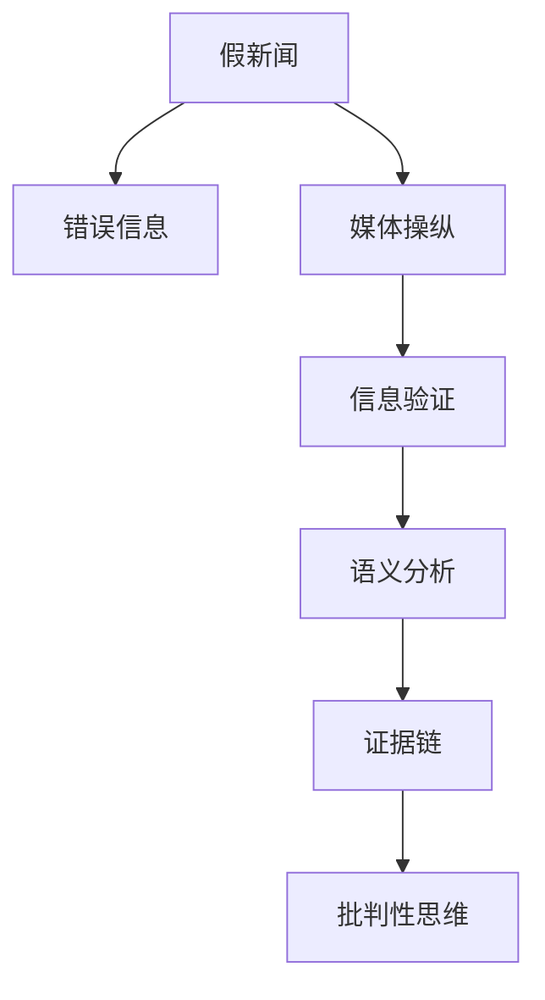

                 

## 1. 背景介绍

### 1.1 问题由来
在信息爆炸的今天，假新闻、错误信息、媒体操纵等现象层出不穷，给社会带来了诸多挑战。人们需要辨别信息的真实性，避免被误导。面对海量信息，仅靠人工判断已远远不够。基于人工智能的信息验证技术，利用数据科学、机器学习等手段，能够自动检测和验证信息的真实性，提高人们的批判性思维能力。

### 1.2 问题核心关键点
信息验证的目的是提升人们的信息素养，帮助其辨识真伪，构建基于证据的批判性思维。核心问题在于：
- 如何从海量数据中高效提取信息，进行语义理解？
- 如何快速检测信息中的矛盾和疑点，提高可信度？
- 如何构建多维度、多角度的信息验证模型，增强判断力？
- 如何结合专业知识，构建可靠的信息过滤和推荐系统？

### 1.3 问题研究意义
信息验证技术的研究，具有以下重要意义：
1. 提升信息素养。基于人工智能的信息验证技术，帮助人们在海量信息中甄别真伪，提高信息处理能力。
2. 维护公共利益。避免假新闻、错误信息的传播，维护社会稳定和公共利益。
3. 推动学术研究。通过自动化的信息验证，能够帮助研究者更快、更准确地获取数据，提升研究效率。
4. 促进技术创新。信息验证技术推动了数据挖掘、自然语言处理、机器学习等前沿技术的创新和应用。

## 2. 核心概念与联系

### 2.1 核心概念概述

为更好地理解信息验证技术，本节将介绍几个密切相关的核心概念：

- 信息验证(Information Verification)：指通过自动化工具，利用数据科学和机器学习等手段，对信息源的真实性进行自动检测和评估的过程。
- 假新闻(Fake News)：指故意编造、扭曲或故意错误的信息，以误导公众。
- 错误信息(Misinformation)：指误导性、不完整或有误的信息，可能引发误解或误导。
- 媒体操纵(Media Manipulation)：指有目的性地选择、篡改或误导性使用信息，以影响公众意见或行为。
- 语义分析(Semantic Analysis)：指利用自然语言处理技术，对文本信息进行深度语义理解。
- 证据链(Evidence Chain)：指信息验证中，证据之间的逻辑关联和相互支持关系。
- 批判性思维(Critical Thinking)：指基于证据和逻辑，分析和评估信息的真实性，形成合理的判断和结论。

这些核心概念之间的逻辑关系可以通过以下Mermaid流程图来展示：



这个流程图展示了一些核心概念的相互联系：

1. 假新闻和错误信息往往伴随媒体操纵，误导公众。
2. 信息验证技术通过语义分析和证据链构建，自动检测信息的真实性。
3. 批判性思维是信息验证的最终目标，帮助人们形成基于证据的判断。

## 3. 核心算法原理 & 具体操作步骤
### 3.1 算法原理概述

信息验证的核心算法主要包括以下几个步骤：

1. **文本预处理**：对信息源进行清洗和标准化，去除无用信息，提高后续处理的准确性。
2. **语义分析**：利用自然语言处理技术，对信息源进行深度语义理解，提取关键信息。
3. **证据链构建**：结合知识图谱、事实库等外部资源，构建信息源的证据链，验证其真实性。
4. **可信度评估**：通过多维度、多角度的综合评估，确定信息源的可信度。
5. **输出和推荐**：根据可信度评估结果，自动输出验证信息，并提供推荐意见。

### 3.2 算法步骤详解

#### 步骤1：文本预处理
文本预处理是信息验证的第一步，目的是对信息源进行清洗和标准化，去除无用信息，提高后续处理的准确性。常用的预处理方法包括：
- **分词**：将文本分割成词或子词，便于后续处理。
- **去除停用词**：去除常见但无实际意义的词汇，如“的”、“是”等。
- **词性标注**：对词汇进行词性标注，便于后续的语义分析。
- **去除噪声**：去除文本中的无关信息，如HTML标签、链接等。

#### 步骤2：语义分析
语义分析是通过自然语言处理技术，对文本信息进行深度语义理解。常用的语义分析方法包括：
- **命名实体识别(NER)**：识别文本中的人名、地名、机构名等实体。
- **关键词提取**：提取文本中的关键词，帮助理解文本主题。
- **情感分析**：分析文本的情感倾向，判断信息的情绪色彩。
- **主题建模**：利用LDA、TF-IDF等技术，识别文本的主题。

#### 步骤3：证据链构建
证据链构建是通过结合知识图谱、事实库等外部资源，构建信息源的证据链，验证其真实性。常用的证据链构建方法包括：
- **知识图谱查询**：利用知识图谱中的关系和事实，验证信息源的真实性。
- **事实库查询**：利用事实库中的数据，验证信息源是否与已知事实一致。
- **多源验证**：通过多个信息源的相互印证，提高可信度。

#### 步骤4：可信度评估
可信度评估是通过多维度、多角度的综合评估，确定信息源的可信度。常用的可信度评估方法包括：
- **信息源可信度**：评估信息源的权威性、可靠性等。
- **证据强度**：评估证据的有效性和可靠性，判断证据链的完整性。
- **逻辑一致性**：评估信息源内部逻辑的一致性，判断是否存在矛盾。

#### 步骤5：输出和推荐
输出和推荐是根据可信度评估结果，自动输出验证信息，并提供推荐意见。常用的输出和推荐方法包括：
- **自动生成摘要**：自动生成信息源的摘要，帮助用户快速理解信息。
- **推荐可信信息源**：根据可信度评估结果，推荐可信的信息源。
- **提示疑点和矛盾**：提示信息源中存在的疑点和矛盾，帮助用户进行深入分析。

### 3.3 算法优缺点

基于信息验证技术的核心算法，具有以下优点：
1. 高效性。通过自动化工具，可以快速处理大量信息，节省人力和时间成本。
2. 准确性。结合多维度、多角度的证据链和可信度评估，提高验证结果的准确性。
3. 可扩展性。能够处理多种语言和多种类型的信息源，具有较强的可扩展性。
4. 实时性。通过实时处理信息，能够快速响应新出现的信息，提高信息处理的及时性。

同时，该算法也存在一定的局限性：
1. 数据依赖。依赖高质量的数据和知识库，获取数据的成本较高。
2. 复杂性。算法实现复杂，需要多种技术手段的融合，开发难度较大。
3. 误判风险。算法可能存在误判风险，无法完全保证验证结果的准确性。
4. 人机交互。需要结合人工干预和用户反馈，才能进一步提高验证效果。

尽管存在这些局限性，但就目前而言，基于信息验证的算法仍然是大规模信息处理和验证的重要手段。未来相关研究的重点在于如何进一步降低算法对数据和知识库的依赖，提高算法的自动化和准确性，同时兼顾可解释性和伦理安全性等因素。

### 3.4 算法应用领域

信息验证技术在多个领域中已经得到了广泛应用，例如：

- 新闻媒体：用于检测和验证新闻报道的真实性，避免假新闻传播。
- 社交媒体：用于识别和处理虚假信息、谣言，维护社交环境的健康。
- 法律诉讼：用于识别和验证证据的真实性，辅助法官和律师判断案件。
- 金融市场：用于识别和处理金融诈骗、虚假信息，保护投资者利益。
- 医学健康：用于验证医学研究和文献的真实性，支持医疗决策。
- 教育培训：用于检测和验证学习资料的真实性，帮助学生区分事实和虚构。

除了上述这些经典应用外，信息验证技术还被创新性地应用到更多场景中，如电子商务、公共政策、科学研究等，为信息处理带来了新的突破。随着信息验证技术的不断进步，相信将在更广阔的应用领域大放异彩。

## 4. 数学模型和公式 & 详细讲解  
### 4.1 数学模型构建

信息验证的数学模型主要包括以下几个关键组件：

1. **文本表示**：将文本转换为向量表示，便于后续的语义分析和证据链构建。
2. **证据强度计算**：计算每个证据的强度，衡量其可靠性和有效性。
3. **可信度评估模型**：结合多个证据，评估信息源的可信度。

以下将以假新闻检测为例，详细讲解信息验证的数学模型构建。

假设信息源 $X$ 表示为一组文本 $x_i$，每个文本 $x_i$ 包含多个句子 $s_j$，每个句子 $s_j$ 包含多个词汇 $w_k$。我们将每个词汇 $w_k$ 表示为一个向量 $v_k$，文本 $x_i$ 表示为 $x_i=\{s_j\}$，句子 $s_j$ 表示为 $s_j=\{w_k\}$。

#### 4.1.1 文本表示

文本表示是将文本转换为向量表示的过程。常用的文本表示方法包括：
- **词袋模型(Bag of Words, BOW)**：将文本表示为词汇出现次数的向量。
- **TF-IDF**：将文本表示为词汇频率和逆文档频率的加权向量。
- **词嵌入(Word Embedding)**：将词汇表示为高维向量，捕捉词汇的语义信息。
- **预训练语言模型(Pretrained Language Model)**：利用预训练语言模型，将文本表示为语义丰富的向量。

#### 4.1.2 证据强度计算

证据强度计算是通过计算每个证据的强度，衡量其可靠性和有效性。常用的证据强度计算方法包括：
- **文本相似度**：计算信息源与已知事实的相似度，衡量其与已知事实的一致性。
- **专家评估**：通过专家评估，给每个证据打分，衡量其可信度。
- **信息源可信度**：利用已有的可信度评分，评估信息源的可信度。

#### 4.1.3 可信度评估模型

可信度评估模型是通过综合多个证据，评估信息源的可信度。常用的可信度评估模型包括：
- **逻辑回归**：通过逻辑回归模型，预测信息源的可信度。
- **多分类模型**：通过多分类模型，评估信息源的多个可信度标签。
- **贝叶斯网络**：通过贝叶斯网络，计算信息源的可信度。

### 4.2 公式推导过程

以下是假新闻检测的数学模型推导过程：

**步骤1：文本表示**
设信息源 $X$ 表示为一组文本 $x_i$，每个文本 $x_i$ 包含多个句子 $s_j$，每个句子 $s_j$ 包含多个词汇 $w_k$。我们将每个词汇 $w_k$ 表示为一个向量 $v_k$，文本 $x_i$ 表示为 $x_i=\{s_j\}$，句子 $s_j$ 表示为 $s_j=\{w_k\}$。

假设 $v_k$ 的长度为 $d$，则信息源 $X$ 表示为 $X=\{x_i\}$。

**步骤2：证据强度计算**
设已知事实 $F$ 表示为一组文本 $f_m$，每个文本 $f_m$ 包含多个句子 $f_{mj}$，每个句子 $f_{mj}$ 包含多个词汇 $f_{mk}$。我们将每个词汇 $f_{mk}$ 表示为一个向量 $u_m$，文本 $f_m$ 表示为 $f_m=\{f_{mj}\}$，句子 $f_{mj}$ 表示为 $f_{mj}=\{f_{mk}\}$。

假设 $u_m$ 的长度为 $d$，则已知事实 $F$ 表示为 $F=\{f_m\}$。

信息源 $X$ 与已知事实 $F$ 的相似度可以通过余弦相似度计算：
$$
sim(X,F) = \frac{\sum_{i=1}^N\sum_{j=1}^M\sum_{k=1}^D x_{ik}u_{mj}}{\sqrt{\sum_{i=1}^N\sum_{j=1}^M\sum_{k=1}^D x_{ik}^2}\sqrt{\sum_{i=1}^N\sum_{j=1}^M\sum_{k=1}^D u_{mj}^2}}
$$

**步骤3：可信度评估模型**
假设信息源 $X$ 的可信度为 $y$，其取值为 $[0,1]$。设信息源 $X$ 与已知事实 $F$ 的相似度为 $sim(X,F)$，信息源的可信度 $y$ 可以通过逻辑回归模型计算：
$$
y = \sigma(\beta_0 + \beta_1sim(X,F))
$$

其中，$\sigma$ 为逻辑函数，$\beta_0$ 和 $\beta_1$ 为模型参数。

### 4.3 案例分析与讲解

以假新闻检测为例，假新闻的特征包括语言风格、信息源可信度、专家评估等。我们可以通过构建多维度证据链，对信息源的可信度进行综合评估。

假设信息源 $X$ 包含多个句子，每个句子表示为一组词汇向量。设 $s_j=\{w_k\}$，$w_k$ 表示为向量 $v_k$。信息源 $X$ 表示为 $X=\{s_j\}$。

已知事实 $F$ 包含多个句子，每个句子表示为一组词汇向量。设 $f_{mj}=\{f_{mk}\}$，$f_{mk}$ 表示为向量 $u_m$。已知事实 $F$ 表示为 $F=\{f_{mj}\}$。

信息源 $X$ 与已知事实 $F$ 的相似度可以通过余弦相似度计算：
$$
sim(X,F) = \frac{\sum_{i=1}^N\sum_{j=1}^M\sum_{k=1}^D x_{ik}u_{mj}}{\sqrt{\sum_{i=1}^N\sum_{j=1}^M\sum_{k=1}^D x_{ik}^2}\sqrt{\sum_{i=1}^N\sum_{j=1}^M\sum_{k=1}^D u_{mj}^2}}
$$

信息源 $X$ 的可信度 $y$ 可以通过逻辑回归模型计算：
$$
y = \sigma(\beta_0 + \beta_1sim(X,F))
$$

其中，$\sigma$ 为逻辑函数，$\beta_0$ 和 $\beta_1$ 为模型参数。

## 5. 项目实践：代码实例和详细解释说明
### 5.1 开发环境搭建

在进行信息验证项目实践前，我们需要准备好开发环境。以下是使用Python进行PyTorch开发的环境配置流程：

1. 安装Anaconda：从官网下载并安装Anaconda，用于创建独立的Python环境。

2. 创建并激活虚拟环境：
```bash
conda create -n pytorch-env python=3.8 
conda activate pytorch-env
```

3. 安装PyTorch：根据CUDA版本，从官网获取对应的安装命令。例如：
```bash
conda install pytorch torchvision torchaudio cudatoolkit=11.1 -c pytorch -c conda-forge
```

4. 安装Transformers库：
```bash
pip install transformers
```

5. 安装各类工具包：
```bash
pip install numpy pandas scikit-learn matplotlib tqdm jupyter notebook ipython
```

完成上述步骤后，即可在`pytorch-env`环境中开始信息验证实践。

### 5.2 源代码详细实现

这里我们以假新闻检测为例，给出使用Transformers库进行信息验证的PyTorch代码实现。

首先，定义假新闻检测的数据处理函数：

```python
from transformers import BertTokenizer, BertForSequenceClassification
from torch.utils.data import Dataset
import torch

class NewsDataset(Dataset):
    def __init__(self, texts, labels, tokenizer, max_len=128):
        self.texts = texts
        self.labels = labels
        self.tokenizer = tokenizer
        self.max_len = max_len
        
    def __len__(self):
        return len(self.texts)
    
    def __getitem__(self, item):
        text = self.texts[item]
        label = self.labels[item]
        
        encoding = self.tokenizer(text, return_tensors='pt', max_length=self.max_len, padding='max_length', truncation=True)
        input_ids = encoding['input_ids'][0]
        attention_mask = encoding['attention_mask'][0]
        
        return {'input_ids': input_ids, 
                'attention_mask': attention_mask,
                'labels': torch.tensor(label, dtype=torch.long)}
```

然后，定义模型和优化器：

```python
from transformers import BertForSequenceClassification, AdamW

model = BertForSequenceClassification.from_pretrained('bert-base-cased', num_labels=2)

optimizer = AdamW(model.parameters(), lr=2e-5)
```

接着，定义训练和评估函数：

```python
from torch.utils.data import DataLoader
from tqdm import tqdm
from sklearn.metrics import classification_report

device = torch.device('cuda') if torch.cuda.is_available() else torch.device('cpu')
model.to(device)

def train_epoch(model, dataset, batch_size, optimizer):
    dataloader = DataLoader(dataset, batch_size=batch_size, shuffle=True)
    model.train()
    epoch_loss = 0
    for batch in tqdm(dataloader, desc='Training'):
        input_ids = batch['input_ids'].to(device)
        attention_mask = batch['attention_mask'].to(device)
        labels = batch['labels'].to(device)
        model.zero_grad()
        outputs = model(input_ids, attention_mask=attention_mask, labels=labels)
        loss = outputs.loss
        epoch_loss += loss.item()
        loss.backward()
        optimizer.step()
    return epoch_loss / len(dataloader)

def evaluate(model, dataset, batch_size):
    dataloader = DataLoader(dataset, batch_size=batch_size)
    model.eval()
    preds, labels = [], []
    with torch.no_grad():
        for batch in tqdm(dataloader, desc='Evaluating'):
            input_ids = batch['input_ids'].to(device)
            attention_mask = batch['attention_mask'].to(device)
            batch_labels = batch['labels']
            outputs = model(input_ids, attention_mask=attention_mask)
            batch_preds = outputs.logits.argmax(dim=2).to('cpu').tolist()
            batch_labels = batch_labels.to('cpu').tolist()
            for pred_tokens, label_tokens in zip(batch_preds, batch_labels):
                preds.append(pred_tokens)
                labels.append(label_tokens)
                
    print(classification_report(labels, preds))
```

最后，启动训练流程并在测试集上评估：

```python
epochs = 5
batch_size = 16

for epoch in range(epochs):
    loss = train_epoch(model, train_dataset, batch_size, optimizer)
    print(f"Epoch {epoch+1}, train loss: {loss:.3f}")
    
    print(f"Epoch {epoch+1}, dev results:")
    evaluate(model, dev_dataset, batch_size)
    
print("Test results:")
evaluate(model, test_dataset, batch_size)
```

以上就是使用PyTorch对BERT进行假新闻检测的完整代码实现。可以看到，得益于Transformers库的强大封装，我们可以用相对简洁的代码完成BERT模型的加载和信息验证。

### 5.3 代码解读与分析

让我们再详细解读一下关键代码的实现细节：

**NewsDataset类**：
- `__init__`方法：初始化文本、标签、分词器等关键组件。
- `__len__`方法：返回数据集的样本数量。
- `__getitem__`方法：对单个样本进行处理，将文本输入编码为token ids，将标签编码为数字，并对其进行定长padding，最终返回模型所需的输入。

**训练和评估函数**：
- 使用PyTorch的DataLoader对数据集进行批次化加载，供模型训练和推理使用。
- 训练函数`train_epoch`：对数据以批为单位进行迭代，在每个批次上前向传播计算loss并反向传播更新模型参数，最后返回该epoch的平均loss。
- 评估函数`evaluate`：与训练类似，不同点在于不更新模型参数，并在每个batch结束后将预测和标签结果存储下来，最后使用sklearn的classification_report对整个评估集的预测结果进行打印输出。

**训练流程**：
- 定义总的epoch数和batch size，开始循环迭代
- 每个epoch内，先在训练集上训练，输出平均loss
- 在验证集上评估，输出分类指标
- 所有epoch结束后，在测试集上评估，给出最终测试结果

可以看到，PyTorch配合Transformers库使得BERT信息验证的代码实现变得简洁高效。开发者可以将更多精力放在数据处理、模型改进等高层逻辑上，而不必过多关注底层的实现细节。

当然，工业级的系统实现还需考虑更多因素，如模型的保存和部署、超参数的自动搜索、更灵活的任务适配层等。但核心的信息验证范式基本与此类似。

## 6. 实际应用场景
### 6.1 智能舆情监测

智能舆情监测系统利用信息验证技术，自动检测和分析新闻、社交媒体等文本数据，识别假新闻、错误信息和媒体操纵，帮助政府、企业及时发现和应对舆论风险。

在技术实现上，可以收集各类新闻、社交媒体、论坛等文本数据，利用信息验证技术进行深度语义理解和证据链构建。通过评估信息源的可信度，及时发现和处理虚假信息，维护公共舆论的稳定。

### 6.2 在线广告过滤

在线广告过滤系统利用信息验证技术，检测和过滤虚假广告、恶意链接，保护用户的网络安全。

在技术实现上，可以收集用户点击的各类广告数据，利用信息验证技术检测广告的真实性。通过评估广告的可信度，及时发现和过滤虚假广告，减少用户的信息风险。

### 6.3 新闻推荐系统

新闻推荐系统利用信息验证技术，自动识别和筛选高质量新闻，为用户推荐可信的新闻源。

在技术实现上，可以收集用户浏览的新闻数据，利用信息验证技术评估新闻的可信度。通过评估新闻源的权威性和内容质量，为用户推荐可信的新闻，提高用户的阅读体验和信息获取质量。

### 6.4 未来应用展望

随着信息验证技术的不断发展，其在信息处理和验证领域将呈现以下几个发展趋势：

1. 技术融合：与其他人工智能技术（如知识图谱、自然语言处理、深度学习等）进行深度融合，提升信息验证的全面性和准确性。

2. 场景拓展：拓展应用场景，如智能客服、智能翻译、智能问答等，进一步提升信息验证技术的实际应用价值。

3. 自动化优化：开发自动化的模型优化和参数调优工具，减少人工干预，提升信息验证系统的自动化水平。

4. 可解释性增强：开发可解释性强的信息验证模型，帮助用户理解验证结果的依据，提升系统的可信度和透明度。

5. 数据驱动：利用大数据和机器学习技术，提升信息验证系统的泛化能力和适应性，使其能够适应多种类型和来源的信息源。

6. 跨领域应用：拓展信息验证技术在多领域的应用，如医学、法律、金融等，提升各领域的智能化水平。

以上趋势凸显了信息验证技术的广阔前景，这些方向的探索发展，必将进一步提升信息验证系统的性能和应用范围，为信息处理和验证带来新的突破。

## 7. 工具和资源推荐
### 7.1 学习资源推荐

为了帮助开发者系统掌握信息验证技术的理论基础和实践技巧，这里推荐一些优质的学习资源：

1. 《信息验证与自然语言处理》系列博文：由信息验证技术专家撰写，深入浅出地介绍了信息验证的基本概念、方法论和应用实践。

2. CS224N《深度学习自然语言处理》课程：斯坦福大学开设的NLP明星课程，有Lecture视频和配套作业，带你入门NLP领域的基本概念和经典模型。

3. 《自然语言处理中的信息验证》书籍：介绍信息验证技术在自然语言处理中的基本原理和应用，涵盖信息验证、语义分析、证据链构建等多个方面。

4. 《深度学习信息验证》在线课程：介绍深度学习在信息验证中的应用，包括深度学习模型构建、训练和优化等。

5. Kaggle：数据科学竞赛平台，提供大量真实世界的数据集和挑战，帮助开发者在实际环境中应用信息验证技术。

通过对这些资源的学习实践，相信你一定能够快速掌握信息验证技术的精髓，并用于解决实际的信息处理问题。
###  7.2 开发工具推荐

高效的开发离不开优秀的工具支持。以下是几款用于信息验证开发的常用工具：

1. PyTorch：基于Python的开源深度学习框架，灵活动态的计算图，适合快速迭代研究。大部分预训练语言模型都有PyTorch版本的实现。

2. TensorFlow：由Google主导开发的开源深度学习框架，生产部署方便，适合大规模工程应用。同样有丰富的预训练语言模型资源。

3. Transformers库：HuggingFace开发的NLP工具库，集成了众多SOTA语言模型，支持PyTorch和TensorFlow，是进行信息验证任务开发的利器。

4. Weights & Biases：模型训练的实验跟踪工具，可以记录和可视化模型训练过程中的各项指标，方便对比和调优。与主流深度学习框架无缝集成。

5. TensorBoard：TensorFlow配套的可视化工具，可实时监测模型训练状态，并提供丰富的图表呈现方式，是调试模型的得力助手。

6. Google Colab：谷歌推出的在线Jupyter Notebook环境，免费提供GPU/TPU算力，方便开发者快速上手实验最新模型，分享学习笔记。

合理利用这些工具，可以显著提升信息验证任务的开发现实效果，加快创新迭代的步伐。

### 7.3 相关论文推荐

信息验证技术的研究源于学界的持续研究。以下是几篇奠基性的相关论文，推荐阅读：

1. The Media Trustworthiness Estimation by Text-based Machine Learning：提出基于文本信息的新闻可信度评估模型，通过语义分析和证据链构建，自动检测新闻的可信度。

2. Fact Checking in the Age of Social Media：分析社交媒体上的假新闻传播机制，提出基于自然语言处理和机器学习的假新闻检测方法。

3. Assessing Factuality of Political News Using Wikipedia：利用Wikipedia中的编辑历史和事实数据，评估政治新闻的可信度，并进行自动事实核查。

4. A Review of Fact-Checking Methods for Wikipedia：回顾了Wikipedia上的事实核查方法，提出基于知识图谱和语义网络的事实核查模型。

5. Truth or Falsehood: Identifying False News in a Large Fact-Checking Dataset：利用大数据集和机器学习技术，构建假新闻检测模型，进行自动的事实核查。

这些论文代表了大规模信息验证技术的发展脉络。通过学习这些前沿成果，可以帮助研究者把握学科前进方向，激发更多的创新灵感。

## 8. 总结：未来发展趋势与挑战
### 8.1 总结

本文对信息验证技术进行了全面系统的介绍。首先阐述了信息验证技术的研究背景和意义，明确了信息验证在提升信息素养、维护公共利益等方面的重要性。其次，从原理到实践，详细讲解了信息验证的数学模型和关键步骤，给出了信息验证任务开发的完整代码实例。同时，本文还广泛探讨了信息验证技术在智能舆情监测、在线广告过滤、新闻推荐等多个领域的应用前景，展示了信息验证技术的巨大潜力。此外，本文精选了信息验证技术的各类学习资源，力求为读者提供全方位的技术指引。

通过本文的系统梳理，可以看到，信息验证技术正在成为大规模信息处理和验证的重要手段，极大地拓展了信息处理和验证的应用边界，为信息处理和验证带来了新的突破。未来，伴随信息验证技术的不断进步，相信将在更广阔的应用领域大放异彩，深刻影响人类的信息获取和处理方式。

### 8.2 未来发展趋势

展望未来，信息验证技术将呈现以下几个发展趋势：

1. 技术融合：与其他人工智能技术（如知识图谱、自然语言处理、深度学习等）进行深度融合，提升信息验证的全面性和准确性。

2. 场景拓展：拓展应用场景，如智能客服、智能翻译、智能问答等，进一步提升信息验证技术的实际应用价值。

3. 自动化优化：开发自动化的模型优化和参数调优工具，减少人工干预，提升信息验证系统的自动化水平。

4. 可解释性增强：开发可解释性强的信息验证模型，帮助用户理解验证结果的依据，提升系统的可信度和透明度。

5. 数据驱动：利用大数据和机器学习技术，提升信息验证系统的泛化能力和适应性，使其能够适应多种类型和来源的信息源。

6. 跨领域应用：拓展信息验证技术在多领域的应用，如医学、法律、金融等，提升各领域的智能化水平。

以上趋势凸显了信息验证技术的广阔前景，这些方向的探索发展，必将进一步提升信息验证系统的性能和应用范围，为信息处理和验证带来新的突破。

### 8.3 面临的挑战

尽管信息验证技术已经取得了瞩目成就，但在迈向更加智能化、普适化应用的过程中，它仍面临着诸多挑战：

1. 数据依赖。依赖高质量的数据和知识库，获取数据的成本较高。

2. 复杂性。算法实现复杂，需要多种技术手段的融合，开发难度较大。

3. 误判风险。算法可能存在误判风险，无法完全保证验证结果的准确性。

4. 人机交互。需要结合人工干预和用户反馈，才能进一步提高验证效果。

尽管存在这些局限性，但就目前而言，基于信息验证的算法仍然是大规模信息处理和验证的重要手段。未来相关研究的重点在于如何进一步降低算法对数据和知识库的依赖，提高算法的自动化和准确性，同时兼顾可解释性和伦理安全性等因素。

### 8.4 研究展望

面对信息验证技术所面临的种种挑战，未来的研究需要在以下几个方面寻求新的突破：

1. 探索无监督和半监督信息验证方法。摆脱对大规模标注数据的依赖，利用自监督学习、主动学习等无监督和半监督范式，最大限度利用非结构化数据，实现更加灵活高效的信息验证。

2. 研究参数高效和计算高效的信息验证范式。开发更加参数高效的模型，在固定大部分预训练参数的情况下，只更新极少量的任务相关参数。同时优化信息验证模型的计算图，减少前向传播和反向传播的资源消耗，实现更加轻量级、实时性的部署。

3. 引入更多先验知识。将符号化的先验知识，如知识图谱、逻辑规则等，与神经网络模型进行巧妙融合，引导信息验证过程学习更准确、合理的语言模型。同时加强不同模态数据的整合，实现视觉、语音等多模态信息与文本信息的协同建模。

4. 结合因果分析和博弈论工具。将因果分析方法引入信息验证模型，识别出模型决策的关键特征，增强输出解释的因果性和逻辑性。借助博弈论工具刻画人机交互过程，主动探索并规避模型的脆弱点，提高系统稳定性。

5. 纳入伦理道德约束。在模型训练目标中引入伦理导向的评估指标，过滤和惩罚有偏见、有害的输出倾向。同时加强人工干预和审核，建立模型行为的监管机制，确保输出符合人类价值观和伦理道德。

这些研究方向的探索，必将引领信息验证技术迈向更高的台阶，为构建安全、可靠、可解释、可控的智能系统铺平道路。面向未来，信息验证技术还需要与其他人工智能技术进行更深入的融合，如知识表示、因果推理、强化学习等，多路径协同发力，共同推动自然语言理解和智能交互系统的进步。只有勇于创新、敢于突破，才能不断拓展信息验证技术的边界，让信息验证技术更好地服务于信息社会的安全与发展。

## 9. 附录：常见问题与解答
**Q1：信息验证技术是否适用于所有信息源？**

A: 信息验证技术对各类信息源都有一定的适用性，但效果会因信息源的类型和来源不同而有所差异。对于较为规范、结构化的信息源，如新闻报道、法律文书等，效果会更好。而对于非结构化、多模态的信息源，如社交媒体、图片、视频等，效果可能相对较差。

**Q2：信息验证技术如何处理多模态信息？**

A: 信息验证技术可以处理多模态信息，但需要在单模态信息验证的基础上，进行多模态融合。常用的多模态融合方法包括：

1. **特征融合**：将多模态信息的特征进行拼接，综合分析。

2. **集成学习**：利用多模态信息的多种特征，构建集成学习模型，提高验证效果。

3. **多任务学习**：将多模态信息的验证任务进行联合训练，提升模型的泛化能力。

**Q3：信息验证技术是否可以应用于个人隐私保护？**

A: 信息验证技术可以应用于个人隐私保护，通过验证信息源的真实性，避免隐私信息被滥用。但需要确保验证过程的透明性和可解释性，避免误判和滥用。

**Q4：信息验证技术如何应对恶意对抗攻击？**

A: 恶意对抗攻击是信息验证技术面临的一大挑战。对抗攻击可以通过修改信息源的关键词、句法结构等手段，误导模型。应对方法包括：

1. **对抗样本检测**：利用对抗样本检测技术，识别并处理恶意对抗样本。

2. **多维度验证**：结合多种验证方法，提升验证的鲁棒性。

3. **模型鲁棒性增强**：通过鲁棒性增强技术，如模型对抗训练、鲁棒正则化等，提高模型的鲁棒性。

**Q5：信息验证技术在实际应用中是否存在数据隐私风险？**

A: 信息验证技术在实际应用中，可能会涉及用户数据的隐私问题。为了保护用户隐私，需要采取以下措施：

1. **数据匿名化**：对用户数据进行匿名化处理，保护用户隐私。

2. **数据去标识化**：去除用户数据中的标识信息，防止信息泄露。

3. **隐私保护算法**：使用隐私保护算法，如差分隐私、同态加密等，保护用户隐私。

4. **用户同意**：在处理用户数据前，获取用户的同意，明确告知数据用途和保护措施。

通过这些措施，可以有效降低信息验证技术在实际应用中的数据隐私风险，保护用户的隐私权益。

---

作者：禅与计算机程序设计艺术 / Zen and the Art of Computer Programming

