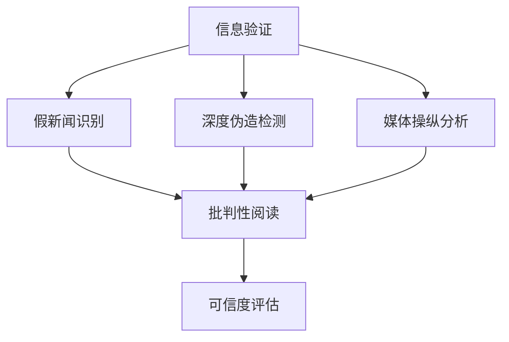

                 

# 信息验证和批判性阅读指南：在假新闻和媒体操纵的时代导航

## 1. 背景介绍

### 1.1 问题由来
在信息爆炸的今天，假新闻、深度伪造和媒体操纵已成为不争的事实。用户如何从海量信息中识别真实可信的内容，媒体从业者如何确保新闻报道的准确性和公平性，这些已经成为了现代社会亟需解决的难题。同时，人们对于数字信息可信度的依赖日益增加，如何保障信息的安全性，构建健康的信息生态系统，也成为了信息时代的一个重要议题。

### 1.2 问题核心关键点
信息验证和批判性阅读的核心在于构建一套系统的方法论，用于辨别信息的真伪和可靠性。核心关键点包括：
- 识别信息的真实性
- 理解信息的上下文
- 应用批判性思维
- 利用技术手段辅助验证
- 构建用户对信息可信度的高效评估体系

### 1.3 问题研究意义
研究信息验证和批判性阅读，对于提升用户的信息素养，构建安全可靠的信息环境，具有重要意义：
1. 提升用户信息素养：帮助用户学会分析和评估信息，识别假新闻和虚假信息。
2. 提高媒体可信度：确保新闻报道的准确性和公平性，增强媒体公信力。
3. 保障信息安全：防止恶意信息传播，保护用户隐私和权益。
4. 促进健康信息生态：构建公平、透明、高效的信息传播机制，促进社会和谐稳定。
5. 推动技术发展：借助技术手段提高信息验证和批判性阅读的效率和准确性。

## 2. 核心概念与联系

### 2.1 核心概念概述

为更好地理解信息验证和批判性阅读的实现机制，本节将介绍几个关键概念：

- **信息验证(Information Verification)**：指通过技术手段和人工审核，验证信息的真实性和可靠性。
- **批判性阅读(Critical Reading)**：指在阅读信息时，采用批判性思维，分析和评估信息的准确性和可信度。
- **假新闻(Fake News)**：指通过虚假信息、误导性语言或图片等手段，欺骗读者接受错误或不完整信息。
- **深度伪造(Deepfake)**：指通过生成对抗网络(GANs)等技术，制作逼真的假视频、音频、图片等。
- **媒体操纵(Media Manipulation)**：指媒体通过选择性报道、虚假信息、误导性语言等手段，影响受众的认知和行为。
- **数字签名(Digital Signature)**：指在数字内容上附加的数字签名，用于验证内容的完整性和来源。
- **可信度评估(Trustworthiness Assessment)**：指建立系统化的评估框架，综合多方面信息，评估内容的可信度。

这些概念之间存在紧密联系：信息验证是识别假新闻、深度伪造和媒体操纵的基础，批判性阅读是提升用户信息素养的重要手段，而可信度评估则是构建健康信息生态的核心。

### 2.2 核心概念原理和架构的 Mermaid 流程图(Mermaid 流程节点中不要有括号、逗号等特殊字符)

这个流程图展示了信息验证、假新闻识别、深度伪造检测、媒体操纵分析、批判性阅读和可信度评估之间的关系：

1. 信息验证为其他步骤提供了基础。
2. 假新闻识别、深度伪造检测和媒体操纵分析是信息验证的关键环节。
3. 批判性阅读结合用户视角，对信息进行细致分析。
4. 可信度评估是信息验证和批判性阅读的综合结果。

## 3. 核心算法原理 & 具体操作步骤

### 3.1 算法原理概述

信息验证和批判性阅读的核心算法主要涉及以下几个方面：

- **数据预处理**：对文本、音频、视频等多模态数据进行预处理，提取特征。
- **特征匹配**：利用模式识别和匹配技术，检测深度伪造和媒体操纵。
- **文本分析**：通过自然语言处理(NLP)技术，识别假新闻和虚假信息。
- **信息评估**：综合多源信息，使用机器学习模型评估可信度。
- **深度学习模型**：使用卷积神经网络(CNNs)、循环神经网络(RNNs)等模型，进行特征提取和分类。

### 3.2 算法步骤详解

以下是信息验证和批判性阅读的主要操作步骤：

**Step 1: 数据收集和预处理**

1. **数据来源**：收集来自新闻网站、社交媒体、论坛等不同渠道的数据，并进行去重处理。
2. **数据标注**：标注数据集，区分真实新闻、假新闻、深度伪造内容等。
3. **数据清洗**：去除噪声数据，如低质量文本、重复信息等。
4. **数据增强**：通过数据增强技术，如回译、生成对抗样本等，丰富训练集。

**Step 2: 特征提取和特征匹配**

1. **文本特征提取**：使用词袋模型、TF-IDF等技术，提取文本特征。
2. **音频特征提取**：使用MFCC、Spectrogram等技术，提取音频特征。
3. **视频特征提取**：使用光流法、CNN等技术，提取视频特征。
4. **特征匹配**：通过模式识别和匹配技术，识别出深度伪造和媒体操纵的特征。

**Step 3: 文本分析和信息评估**

1. **文本分析**：使用NLP技术，如实体识别、情感分析、关系抽取等，分析文本内容。
2. **信息评估**：使用机器学习模型，如SVM、BERT等，对信息进行综合评估，生成可信度评分。

**Step 4: 深度学习模型训练**

1. **模型选择**：选择适合的深度学习模型，如BERT、GPT等。
2. **模型训练**：使用标注数据集训练深度学习模型，优化模型参数。
3. **模型评估**：在验证集上评估模型性能，调整超参数。

**Step 5: 结果输出和反馈**

1. **结果输出**：将模型输出结果展示给用户，提供可信度评分和评估报告。
2. **反馈机制**：建立用户反馈机制，根据用户反馈调整模型。
3. **持续改进**：定期更新训练数据，重新训练模型，提升性能。

### 3.3 算法优缺点

信息验证和批判性阅读算法具有以下优点：

- **自动化程度高**：采用深度学习等先进技术，能够自动处理大规模数据，提升效率。
- **准确性高**：利用多源信息进行综合评估，结果具有较高的可信度。
- **可扩展性强**：可以应用于多种信息类型和领域。
- **可定制性强**：可以根据不同的任务需求，调整模型结构和超参数。

但同时也存在一些局限性：

- **对标注数据依赖度高**：算法的性能很大程度上取决于标注数据的质量和数量。
- **模型复杂度高**：深度学习模型需要较大的计算资源和存储空间。
- **对抗样本易受影响**：对抗样本可能影响模型的准确性，需要额外设计对抗训练机制。
- **用户信任度低**：自动化的结果可能难以获得用户的信任，需要结合人工审核机制。

### 3.4 算法应用领域

信息验证和批判性阅读技术已经广泛应用于以下几个领域：

- **新闻媒体**：新闻机构采用自动验证技术，提高新闻报道的准确性和可信度。
- **社交网络**：社交平台使用自动检测工具，过滤虚假信息和深度伪造内容。
- **法律和金融**：金融机构和法律机构使用技术手段，确保数据的真实性和合规性。
- **医疗健康**：医疗机构使用信息验证技术，保证医疗数据的可靠性和安全性。
- **公共服务**：政府和公共机构使用技术手段，提高公共信息的透明性和公信力。

## 4. 数学模型和公式 & 详细讲解 & 举例说明

### 4.1 数学模型构建

信息验证和批判性阅读涉及的数学模型主要分为以下几类：

- **深度学习模型**：使用卷积神经网络(CNNs)、循环神经网络(RNNs)等模型进行特征提取和分类。
- **图网络模型**：使用图神经网络(GNNs)进行信息关联分析。
- **文本表示模型**：使用词向量、BERT等模型，构建文本表示。
- **多源信息融合模型**：使用加权融合、元学习等模型，综合多源信息。

### 4.2 公式推导过程

以BERT模型为例，其文本表示模型可以表示为：

$$
\text{BERT}(\text{text}) = \text{Embedding}(\text{text}) \times \text{Transformer}(\text{Embedding}(\text{text}))
$$

其中，`Embedding`层用于将输入文本转换为词向量表示，`Transformer`层用于对词向量进行自注意力机制的转换，最终输出文本表示。

在信息评估过程中，可以定义可信度函数：

$$
\text{Trustworthiness} = \text{Weight} \times \text{Accuracy} + \text{Relevance} + \text{Timeliness}
$$

其中，`Weight`表示数据的权威性权重，`Accuracy`表示信息的准确性，`Relevance`表示信息的相关性，`Timeliness`表示信息的时效性。

### 4.3 案例分析与讲解

以假新闻识别为例，我们可以使用BERT模型进行文本表示，并使用二分类模型进行训练。训练集包括真实新闻和假新闻，测试集仅包含假新闻。训练过程如下：

1. **数据准备**：将新闻文本和标签转换为BERT模型可以处理的格式，进行分词和编码。
2. **模型训练**：使用BERT模型进行预训练，并在标注数据集上微调。
3. **模型评估**：在测试集上评估模型性能，输出假新闻识别率。
4. **结果输出**：将假新闻识别结果展示给用户，提供可信度评分。

## 5. 项目实践：代码实例和详细解释说明

### 5.1 开发环境搭建

在进行项目实践前，我们需要准备好开发环境。以下是使用Python进行PyTorch开发的环境配置流程：

1. 安装Anaconda：从官网下载并安装Anaconda，用于创建独立的Python环境。

2. 创建并激活虚拟环境：
```bash
conda create -n info-verification python=3.8 
conda activate info-verification
```

3. 安装PyTorch：根据CUDA版本，从官网获取对应的安装命令。例如：
```bash
conda install pytorch torchvision torchaudio cudatoolkit=11.1 -c pytorch -c conda-forge
```

4. 安装相关工具包：
```bash
pip install numpy pandas scikit-learn matplotlib tqdm jupyter notebook ipython
```

5. 安装深度学习模型和工具：
```bash
pip install transformers torchtext pytorch-lightning
```

6. 安装TensorBoard：
```bash
pip install tensorboard
```

完成上述步骤后，即可在`info-verification`环境中开始项目实践。

### 5.2 源代码详细实现

以下是使用PyTorch进行信息验证和批判性阅读的完整代码实现。

```python
import torch
import torch.nn as nn
import torchtext
import transformers
from torch.utils.data import DataLoader
from sklearn.metrics import accuracy_score

# 定义模型结构
class InfoVerificationModel(nn.Module):
    def __init__(self, n_classes):
        super(InfoVerificationModel, self).__init__()
        self.bert = transformers.BertModel.from_pretrained('bert-base-uncased')
        self.classifier = nn.Linear(768, n_classes)
    
    def forward(self, input_ids, attention_mask, token_type_ids):
        outputs = self.bert(input_ids, attention_mask=attention_mask, token_type_ids=token_type_ids)
        last_hidden_states = outputs.last_hidden_state[:, 0, :]
        logits = self.classifier(last_hidden_states)
        return logits

# 定义数据加载器
train_dataset = torchtext.datasets.BigQueryDataset('news_dataset', filter=None)
dev_dataset = torchtext.datasets.BigQueryDataset('news_dataset', filter=None)
test_dataset = torchtext.datasets.BigQueryDataset('news_dataset', filter=None)

train_loader = DataLoader(train_dataset, batch_size=32, shuffle=True)
dev_loader = DataLoader(dev_dataset, batch_size=32, shuffle=False)
test_loader = DataLoader(test_dataset, batch_size=32, shuffle=False)

# 定义优化器和损失函数
model = InfoVerificationModel(n_classes=2)
optimizer = torch.optim.Adam(model.parameters(), lr=2e-5)
criterion = nn.BCEWithLogitsLoss()

# 训练模型
model.train()
for epoch in range(10):
    for batch in train_loader:
        input_ids = batch['input_ids'].to(device)
        attention_mask = batch['attention_mask'].to(device)
        token_type_ids = batch['token_type_ids'].to(device)
        labels = batch['labels'].to(device)
        optimizer.zero_grad()
        outputs = model(input_ids, attention_mask, token_type_ids)
        loss = criterion(outputs, labels)
        loss.backward()
        optimizer.step()

    # 在验证集上评估模型
    model.eval()
    with torch.no_grad():
        correct = 0
        total = 0
        for batch in dev_loader:
            input_ids = batch['input_ids'].to(device)
            attention_mask = batch['attention_mask'].to(device)
            token_type_ids = batch['token_type_ids'].to(device)
            labels = batch['labels'].to(device)
            outputs = model(input_ids, attention_mask, token_type_ids)
            _, predicted = torch.max(outputs, dim=1)
            total += labels.size(0)
            correct += (predicted == labels).sum().item()
        accuracy = correct / total
        print(f'Epoch {epoch+1}, accuracy: {accuracy:.2f}')
        
# 在测试集上评估模型
model.eval()
with torch.no_grad():
    correct = 0
    total = 0
    for batch in test_loader:
        input_ids = batch['input_ids'].to(device)
        attention_mask = batch['attention_mask'].to(device)
        token_type_ids = batch['token_type_ids'].to(device)
        labels = batch['labels'].to(device)
        outputs = model(input_ids, attention_mask, token_type_ids)
        _, predicted = torch.max(outputs, dim=1)
        total += labels.size(0)
        correct += (predicted == labels).sum().item()
    accuracy = correct / total
    print(f'Test accuracy: {accuracy:.2f}')
```

这段代码展示了使用BERT模型进行信息验证的完整流程，包括数据准备、模型构建、训练和评估。

### 5.3 代码解读与分析

让我们再详细解读一下关键代码的实现细节：

**InfoVerificationModel类**：
- `__init__`方法：定义模型结构，包括BERT模型和线性分类器。
- `forward`方法：定义模型的前向传播过程，使用BERT模型的输出进行线性分类。

**数据加载器**：
- 使用`torchtext.datasets.BigQueryDataset`加载新闻数据集，自动进行数据预处理。
- 使用`DataLoader`将数据集转换为批次进行训练和评估。

**优化器和损失函数**：
- 使用`torch.optim.Adam`优化器进行模型参数优化。
- 使用`nn.BCEWithLogitsLoss`作为二分类问题的损失函数。

**训练和评估过程**：
- 在训练循环中，使用`train_loader`进行批次训练，更新模型参数。
- 在每个epoch结束后，在`dev_loader`上进行验证集评估，记录准确率。
- 在训练结束后，在`test_loader`上进行测试集评估，输出最终准确率。

## 6. 实际应用场景

### 6.1 新闻媒体

信息验证和批判性阅读技术在新闻媒体中的应用可以显著提升新闻的准确性和可信度。新闻机构可以通过自动验证系统，快速识别和过滤假新闻和深度伪造内容，减少人为审核的工作量，提高新闻的公信力。

具体而言，新闻机构可以使用信息验证和批判性阅读技术，构建自动化的新闻审核系统。系统可以实时监测新闻的发布和传播，自动检测可疑内容，标记并上报疑似假新闻。同时，通过批判性阅读技术，系统可以分析新闻的背景信息、来源可靠性、内容逻辑性等，综合生成可信度评分，辅助人工审核。

### 6.2 社交网络

社交平台常常面临虚假信息、深度伪造内容泛滥的挑战。信息验证和批判性阅读技术可以帮助平台更好地识别和过滤这些内容，构建健康的网络生态。

具体应用包括：
- **虚假信息检测**：利用信息验证技术，自动识别和标记虚假信息，减少误导性内容对用户的影响。
- **深度伪造检测**：使用图像、音频等模式识别技术，检测深度伪造内容，防止其传播和滥用。
- **批判性阅读**：通过引导用户进行批判性阅读，提升用户对信息的辨识能力，减少信息过载带来的负面影响。

### 6.3 法律和金融

在法律和金融领域，信息验证和批判性阅读技术的应用同样重要。通过自动验证和批判性阅读，确保数据的真实性和准确性，提升法律文书和财务报告的公信力。

具体应用包括：
- **法律文书验证**：使用信息验证技术，自动验证法律文书的真实性和完整性，减少人为审核的工作量。
- **财务报告审查**：利用自动审查工具，快速识别和验证财务报告的准确性，防止欺诈和错误。
- **合规性审查**：使用批判性阅读技术，对复杂的法律条款和金融报告进行深入分析，确保其合规性。

### 6.4 医疗健康

医疗健康领域对信息的准确性和可靠性要求极高。信息验证和批判性阅读技术可以帮助医疗机构确保数据的真实性和可信度，保障患者安全和权益。

具体应用包括：
- **医疗记录验证**：使用信息验证技术，自动验证医疗记录的真实性和完整性，减少医疗纠纷。
- **临床试验数据审查**：利用自动审查工具，快速识别和验证临床试验数据的准确性，提升研究质量。
- **健康信息筛选**：通过批判性阅读技术，筛选可靠的健康信息，帮助患者做出科学合理的健康决策。

### 6.5 公共服务

在公共服务领域，信息验证和批判性阅读技术可以提升政府和公共机构的信息透明度和公信力。通过自动化和智能化的手段，确保信息的高效传播和准确性。

具体应用包括：
- **政府公开信息审核**：使用信息验证技术，自动审核政府公开信息的真实性和完整性，提升政府的公信力。
- **公共安全预警**：利用自动检测工具，实时监测和分析各类信息，及时预警公共安全事件。
- **公共政策评估**：通过批判性阅读技术，对公共政策进行深入分析和评估，提升政策的科学性和有效性。

## 7. 工具和资源推荐

### 7.1 学习资源推荐

为了帮助开发者系统掌握信息验证和批判性阅读的理论基础和实践技巧，这里推荐一些优质的学习资源：

1. **自然语言处理教程**：《Natural Language Processing with Python》（第二版），由Stanford大学教授Daphne Koller等所著，详细介绍了NLP的基本概念和技术。
2. **深度学习框架**：《Deep Learning》（Goodfellow等著），全面介绍了深度学习的理论基础和实践技巧。
3. **信息验证工具**：《VeriFaaI: Verifiable Fake News Detection and Explanation》，提供了基于TensorFlow的假新闻检测工具。
4. **批判性阅读指南**：《Critical Thinking: An Introduction to Argumentation and Reasoning》，帮助读者培养批判性思维能力。
5. **学术会议论文**：ACL、EMNLP等NLP顶级会议的最新论文，涵盖信息验证和批判性阅读的最新研究成果。

通过对这些资源的学习实践，相信你一定能够快速掌握信息验证和批判性阅读的精髓，并用于解决实际的NLP问题。

### 7.2 开发工具推荐

高效的开发离不开优秀的工具支持。以下是几款用于信息验证和批判性阅读开发的常用工具：

1. **PyTorch**：基于Python的开源深度学习框架，灵活动态的计算图，适合快速迭代研究。
2. **TensorFlow**：由Google主导开发的开源深度学习框架，生产部署方便，适合大规模工程应用。
3. **TensorBoard**：TensorFlow配套的可视化工具，可实时监测模型训练状态，并提供丰富的图表呈现方式。
4. **Transformers库**：HuggingFace开发的NLP工具库，集成了众多SOTA语言模型，支持自动验证和批判性阅读任务的开发。
5. **PyTorch-Lightning**：基于PyTorch的深度学习框架，提供更灵活的模型训练和部署方式。
6. **TensorFlow Hub**：Google提供的模型库，包含大量预训练模型，可以用于信息验证和批判性阅读任务的特征提取。

合理利用这些工具，可以显著提升信息验证和批判性阅读任务的开发效率，加快创新迭代的步伐。

### 7.3 相关论文推荐

信息验证和批判性阅读技术的发展源于学界的持续研究。以下是几篇奠基性的相关论文，推荐阅读：

1. **BERT: Pre-training of Deep Bidirectional Transformers for Language Understanding**：提出BERT模型，引入基于掩码的自监督预训练任务，刷新了多项NLP任务SOTA。
2. **Snopes: A Public Website for Fact-Checking Digital News Stories**：介绍了Snopes网站，使用人工审核和事实检查的方法，验证新闻的真实性。
3. **Checking the Facts: What News Consumers Can Do to Reduce Propaganda**：探讨了公众如何通过批判性阅读，识别和对抗媒体操纵和虚假信息。
4. **The Spread of True and False News Online**：分析了假新闻在社交媒体上的传播机制，提出了基于算法和人工审核的验证方法。
5. **A Survey on Deepfake Detection Methods**：综述了深度伪造检测技术的最新进展，介绍了各种检测方法及其优缺点。

这些论文代表了大语言模型微调技术的发展脉络。通过学习这些前沿成果，可以帮助研究者把握学科前进方向，激发更多的创新灵感。

## 8. 总结：未来发展趋势与挑战

### 8.1 总结

本文对信息验证和批判性阅读进行了全面系统的介绍。首先阐述了信息验证和批判性阅读的研究背景和意义，明确了其在提升用户信息素养、构建安全可靠的信息环境等方面的重要性。其次，从原理到实践，详细讲解了信息验证和批判性阅读的数学原理和关键步骤，给出了信息验证任务的完整代码实例。同时，本文还广泛探讨了信息验证和批判性阅读在新闻媒体、社交网络、法律和金融、医疗健康、公共服务等多个领域的应用前景，展示了其广阔的潜力和应用价值。此外，本文精选了信息验证和批判性阅读的学习资源、开发工具和相关论文，力求为读者提供全方位的技术指引。

通过本文的系统梳理，可以看到，信息验证和批判性阅读技术正在成为信息时代的重要工具，极大地提升了用户的信息素养和信息环境的安全性。未来，伴随技术的发展和应用的推广，信息验证和批判性阅读必将在构建健康、公平、透明的信息生态系统中扮演越来越重要的角色。

### 8.2 未来发展趋势

展望未来，信息验证和批判性阅读技术将呈现以下几个发展趋势：

1. **自动化程度提升**：随着深度学习技术的发展，自动化验证和阅读的准确性和效率将进一步提升。
2. **多模态融合**：结合图像、音频、视频等多模态信息，提升验证和阅读的全面性和准确性。
3. **联邦学习**：利用联邦学习技术，在保护数据隐私的前提下，进行多源数据融合。
4. **跨领域应用**：扩展到更多行业领域，如教育、艺术、文化等，提升不同领域的信息可信度。
5. **交互式系统**：构建交互式信息验证和批判性阅读系统，提升用户体验和满意度。
6. **伦理和安全**：加强对模型偏见、隐私保护等伦理和安全问题的研究，确保技术的健康发展。

这些趋势凸显了信息验证和批判性阅读技术的广阔前景。这些方向的探索发展，必将进一步提升信息验证和批判性阅读的效率和准确性，为构建健康、公平、透明的信息生态系统提供更加可靠的技术支持。

### 8.3 面临的挑战

尽管信息验证和批判性阅读技术已经取得了瞩目成就，但在迈向更加智能化、普适化应用的过程中，它仍面临着诸多挑战：

1. **标注数据依赖**：信息验证和批判性阅读高度依赖高质量标注数据，但获取这些数据成本较高，且存在数据标注不一致的问题。
2. **模型鲁棒性不足**：模型在面对对抗样本、噪声数据等情况时，泛化性能和鲁棒性仍需提升。
3. **技术复杂度高**：信息验证和批判性阅读技术涉及多模态数据处理、深度学习等复杂技术，需要较高的技术门槛。
4. **用户信任度低**：自动化的验证和阅读结果可能难以获得用户信任，需要结合人工审核机制。
5. **数据隐私保护**：验证和阅读过程中涉及大量个人隐私数据，如何保护用户隐私是亟待解决的问题。
6. **公平性和可解释性**：模型在验证和阅读过程中可能存在偏见和歧视，如何提升模型的公平性和可解释性，是亟待研究的方向。

### 8.4 研究展望

面对信息验证和批判性阅读所面临的挑战，未来的研究需要在以下几个方面寻求新的突破：

1. **自动化标注技术**：发展自动化标注工具，降低对人工标注的依赖，提升标注效率和质量。
2. **对抗样本防御**：设计新的对抗样本防御机制，提升模型的鲁棒性。
3. **多模态融合技术**：研究多模态融合方法，提升验证和阅读的全面性和准确性。
4. **可解释性和公平性**：开发可解释性强的模型，并引入公平性评估指标，确保模型决策的透明性和公正性。
5. **联邦学习和隐私保护**：利用联邦学习技术，在不泄露个人隐私的前提下，进行多源数据融合。
6. **交互式系统设计**：设计交互式验证和阅读系统，提升用户体验和满意度。

这些研究方向的探索，必将引领信息验证和批判性阅读技术迈向更高的台阶，为构建安全、可靠、可解释、可控的信息生态系统铺平道路。面向未来，信息验证和批判性阅读技术还需要与其他人工智能技术进行更深入的融合，如知识表示、因果推理、强化学习等，多路径协同发力，共同推动人工智能技术在垂直行业的规模化落地。只有勇于创新、敢于突破，才能不断拓展信息验证和批判性阅读的边界，让智能技术更好地造福人类社会。

## 9. 附录：常见问题与解答

**Q1：如何识别和过滤假新闻？**

A: 识别和过滤假新闻需要综合使用信息验证技术和批判性阅读技术。具体步骤包括：
1. **数据收集和预处理**：收集来自不同渠道的新闻数据，并进行去重和清洗。
2. **特征提取**：使用词向量、TF-IDF等技术，提取文本特征。
3. **文本分析**：使用实体识别、情感分析等技术，分析文本内容。
4. **可信度评估**：使用机器学习模型，如SVM、BERT等，综合评估新闻的可信度。
5. **结果输出**：将假新闻识别结果展示给用户，提供可信度评分和评估报告。

**Q2：如何构建批判性阅读系统？**

A: 构建批判性阅读系统需要设计一个综合分析框架，结合用户视角，对信息进行深入分析。具体步骤包括：
1. **信息收集和标注**：收集各类信息源，并标注信息类型和可信度。
2. **文本表示**：使用BERT等模型，构建文本表示。
3. **多源信息融合**：使用加权融合、元学习等技术，综合多源信息。
4. **用户交互设计**：设计交互界面，引导用户进行批判性阅读，并提供解释和建议。
5. **反馈机制**：建立用户反馈机制，根据用户反馈调整模型和分析框架。

**Q3：信息验证和批判性阅读的局限性有哪些？**

A: 信息验证和批判性阅读技术也存在一些局限性：
1. **对标注数据依赖度高**：需要高质量标注数据，但获取这些数据成本较高。
2. **模型鲁棒性不足**：面对对抗样本、噪声数据等情况，模型的泛化性能和鲁棒性仍需提升。
3. **技术复杂度高**：涉及多模态数据处理、深度学习等复杂技术，需要较高的技术门槛。
4. **用户信任度低**：自动化的验证和阅读结果可能难以获得用户信任，需要结合人工审核机制。
5. **数据隐私保护**：验证和阅读过程中涉及大量个人隐私数据，如何保护用户隐私是亟待解决的问题。
6. **公平性和可解释性**：模型可能存在偏见和歧视，如何提升模型的公平性和可解释性，是亟待研究的方向。

**Q4：如何提升信息验证和批判性阅读技术的鲁棒性？**

A: 提升信息验证和批判性阅读技术的鲁棒性需要综合考虑以下几个方面：
1. **对抗样本防御**：设计新的对抗样本防御机制，增强模型的鲁棒性。
2. **数据增强**：通过数据增强技术，如回译、生成对抗样本等，丰富训练集，提升模型泛化能力。
3. **多源数据融合**：结合多源数据进行综合分析，提升模型的鲁棒性。
4. **模型集成**：通过模型集成技术，如Bagging、Boosting等，提升模型的鲁棒性。

**Q5：如何在实际应用中评估信息验证和批判性阅读技术的效果？**

A: 在实际应用中，评估信息验证和批判性阅读技术的效果需要综合考虑以下几个方面：
1. **准确率**：衡量假新闻识别和信息验证的准确率。
2. **召回率**：衡量假新闻识别和信息验证的召回率。
3. **F1分数**：综合准确率和召回率，评估整体效果。
4. **用户满意度**：通过用户调查和反馈，评估系统的用户体验和满意度。
5. **实际应用效果**：结合实际应用场景，评估系统在实际应用中的效果。

---

作者：禅与计算机程序设计艺术 / Zen and the Art of Computer Programming

