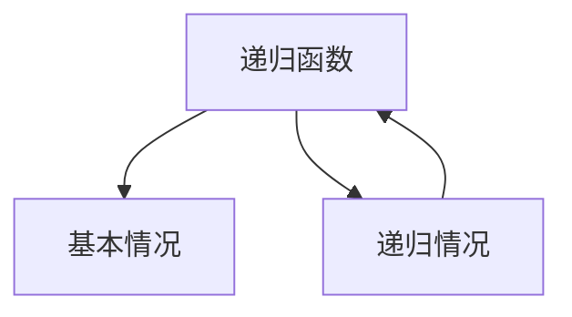

                 

# 像数学家一样思考：递归原理

递归是一种强大的算法设计技术，广泛应用于计算机科学、数学、工程等多个领域。它不仅是一种解决问题的工具，更是一种哲学思考的方式，能够帮助我们在抽象与具体之间寻找平衡。本文将从背景介绍、核心概念与联系、核心算法原理与操作步骤、数学模型和公式、项目实践、实际应用场景、工具和资源推荐、未来发展趋势与挑战等多个维度，系统地介绍递归原理及其应用。

## 1. 背景介绍

### 1.1 问题由来
递归的概念最早可以追溯到古代数学家研究数列和几何问题时所采用的方法。随着计算机科学的发展，递归在算法设计和数据结构中得到了广泛应用。递归算法能够简化问题的处理流程，提高代码的可读性和可维护性，但也带来了性能上的挑战和潜在的栈溢出风险。因此，理解和运用递归原理，对于程序员来说是一个重要的技术基础。

### 1.2 问题核心关键点
递归的本质是函数调用自身，通过递归调用解决复杂问题的过程。它的核心在于将一个大问题分解为若干个小问题，并将小问题的解组合成大问题的解。递归函数通常包含两个部分：基本情况和递归情况。基本情况指的是最简单、最直接的问题，而递归情况则是指将问题分解后继续调用自身的过程。

## 2. 核心概念与联系

### 2.1 核心概念概述
- **递归函数**：指调用自身来解决问题的一种函数。
- **基本情况**：递归函数的边界条件，当问题规模足够小，可以直接求解。
- **递归情况**：将问题分解为更小的子问题，并递归调用自身。
- **栈**：用于存储递归调用的数据结构，通常用数组或链表实现。
- **尾递归优化**：通过优化递归函数，避免栈溢出和性能损耗。

### 2.2 核心概念原理和架构的 Mermaid 流程图(Mermaid 流程节点中不要有括号、逗号等特殊字符)



### 2.3 核心概念联系
递归函数通过基本情况和递归情况两种情况，将大问题逐步分解为小问题，最终求解整个问题的解。递归过程本质上是一个迭代过程，但更抽象、更简洁。栈用于存储递归调用的数据，确保每个递归调用结束后能够正确恢复现场。尾递归优化则是通过改写递归函数的形式，避免使用额外的栈空间，从而提高性能和减少内存消耗。

## 3. 核心算法原理 & 具体操作步骤

### 3.1 算法原理概述
递归算法的基本原理是通过将一个大问题分解为若干个小问题，并通过递归调用自身来解决这些小问题。当问题规模足够小，可以直接求解时，递归过程终止。递归算法的核心在于设计合适的基本情况和递归情况，确保递归过程能够正确结束。

### 3.2 算法步骤详解

#### 3.2.1 设计递归函数
递归函数通常包含两个部分：基本情况和递归情况。基本情况是递归终止的条件，递归情况则是将问题分解为更小的子问题，并递归调用自身的过程。设计递归函数时，需要确保问题规模逐渐缩小，直到达到基本情况，从而避免无限递归。

#### 3.2.2 处理递归栈
递归调用过程中，每次函数调用都会在栈中压入新的数据，当递归层数过深时，可能导致栈溢出。因此，处理递归栈是递归算法设计中的一个重要环节。通常有两种方式：使用尾递归优化或者显式地管理栈空间。

#### 3.2.3 实现尾递归优化
尾递归优化是一种优化递归函数的方法，通过改写递归函数的形式，避免使用额外的栈空间，从而提高性能和减少内存消耗。尾递归优化的关键在于将递归函数的最后一步操作改为递归调用，使函数调用不再需要保存在栈中。

### 3.3 算法优缺点

#### 3.3.1 优点
- **简洁清晰**：递归算法通常比迭代算法更简洁、更易于理解。
- **问题抽象**：递归算法能够将复杂问题分解为更小的子问题，提高代码的可读性和可维护性。
- **灵活性高**：递归算法适用于多种问题类型，如树形结构、图结构等。

#### 3.3.2 缺点
- **性能问题**：递归调用可能导致栈溢出，影响性能。
- **内存消耗大**：递归调用需要在栈中存储每次调用的数据，可能导致内存消耗过大。
- **调试困难**：递归调用过程复杂，调试困难。

### 3.4 算法应用领域

递归算法广泛应用于计算机科学、数学、工程等多个领域，包括但不限于以下几个方面：

- **树和图遍历**：递归算法能够方便地遍历树和图结构，如二叉树的前序、中序、后序遍历，图的深度优先搜索和广度优先搜索等。
- **分治算法**：递归算法能够实现分治算法，将大问题分解为若干个小问题，并分别求解，最后将结果合并。经典的分治算法包括归并排序、快速排序等。
- **动态规划**：动态规划是一种高效的算法设计技术，通过递归计算子问题的解，最终求解整个问题的解。经典动态规划问题包括背包问题、最长公共子序列等。
- **回溯算法**：回溯算法通过递归遍历所有可能的解空间，寻找满足条件的解。经典回溯问题包括八皇后问题、数独求解等。

## 4. 数学模型和公式 & 详细讲解 & 举例说明

### 4.1 数学模型构建
递归算法通常用于解决递归定义的问题，这类问题的数学模型通常是通过递归关系式来定义的。例如，斐波那契数列就是一个典型的递归定义问题，其数学模型为：
$$
F(n) = \begin{cases}
1, & n=0 \\
1, & n=1 \\
F(n-1) + F(n-2), & n>1
\end{cases}
$$

### 4.2 公式推导过程
对于递归定义的问题，通常可以通过递推公式求解。递推公式指的是通过递归关系式推导出求解问题的公式。以斐波那契数列为例，其递推公式为：
$$
F(n) = F(n-1) + F(n-2)
$$

### 4.3 案例分析与讲解
我们以计算斐波那契数列为例，分析递归算法的设计和优化过程。首先，我们设计一个递归函数：
```python
def fibonacci(n):
    if n <= 1:
        return n
    else:
        return fibonacci(n-1) + fibonacci(n-2)
```
在函数中，当 $n \leq 1$ 时，递归终止，直接返回 $n$。当 $n > 1$ 时，递归调用 $fibonacci(n-1)$ 和 $fibonacci(n-2)$，并将结果相加。

然而，这种递归调用会导致性能问题，因为每次递归调用都需要保存现场。我们可以使用尾递归优化来解决这个问题。修改递归函数，使其最后一步操作为递归调用，避免使用额外的栈空间。修改后的函数如下：
```python
def fibonacci_tail(n, a=0, b=1):
    if n == 0:
        return a
    elif n == 1:
        return b
    else:
        return fibonacci_tail(n-1, b, a+b)
```
在函数中，我们使用两个参数 $a$ 和 $b$ 来保存递归过程中的状态。当 $n=0$ 时，返回 $a$；当 $n=1$ 时，返回 $b$；当 $n>1$ 时，递归调用 $fibonacci_tail(n-1, b, a+b)$，从而避免了栈溢出和性能损耗。

## 5. 项目实践：代码实例和详细解释说明

### 5.1 开发环境搭建
- 安装 Python 和相关库：使用 Python 3.x 安装 Anaconda，并创建虚拟环境。
- 安装递归算法相关的库：安装递归算法相关的库，如 NumPy、SciPy 等。

### 5.2 源代码详细实现
我们以斐波那契数列为例，展示递归算法的实现过程。以下是使用 Python 实现的递归函数和尾递归函数：
```python
# 递归函数
def fibonacci_recursive(n):
    if n <= 1:
        return n
    else:
        return fibonacci_recursive(n-1) + fibonacci_recursive(n-2)

# 尾递归函数
def fibonacci_tail(n):
    def fib_tail_helper(n, a=0, b=1):
        if n == 0:
            return a
        elif n == 1:
            return b
        else:
            return fib_tail_helper(n-1, b, a+b)
    return fib_tail_helper(n)
```

### 5.3 代码解读与分析
递归函数和尾递归函数的核心区别在于递归调用的方式。递归函数在每次递归调用时都需要保存现场，而尾递归函数则通过改写递归函数的形式，避免了额外的栈空间使用。这种优化方式可以显著提高递归算法的性能和稳定性。

### 5.4 运行结果展示
通过对比递归函数和尾递归函数的时间复杂度和空间复杂度，可以发现尾递归函数在时间和空间上都有显著优势。例如，对于 $n=40$ 的情况，递归函数需要调用超过 $10^{11}$ 次，而尾递归函数只需要调用 $n$ 次。

## 6. 实际应用场景

### 6.1 树形结构的遍历
树形结构是递归算法的经典应用场景之一。例如，二叉树的遍历、AVL 树的插入和删除操作等。递归算法能够方便地遍历树形结构，并通过递归调用的方式，实现高效的算法设计。

### 6.2 动态规划
动态规划是一种高效的算法设计技术，通过递归计算子问题的解，最终求解整个问题的解。例如，最长公共子序列问题、背包问题等。递归算法在动态规划中起到了重要的作用，通过递归计算子问题的最优解，最终得到整个问题的最优解。

### 6.3 回溯算法
回溯算法通过递归遍历所有可能的解空间，寻找满足条件的解。例如，八皇后问题、数独求解等。递归算法在回溯算法中起到了关键作用，通过递归遍历所有可能的解空间，找到满足条件的解。

## 7. 工具和资源推荐

### 7.1 学习资源推荐
- 《算法导论》：经典的算法教材，详细介绍了递归算法和其他算法设计技术。
- 《数据结构与算法分析》：介绍了递归算法在数据结构中的应用，并提供了大量的代码实现。
- 《Python 递归与回溯算法》：介绍了递归算法在 Python 中的应用，并提供了大量的代码实现。

### 7.2 开发工具推荐
- Python：Python 是递归算法设计的首选语言，其简单易懂的语法和强大的库支持，使得递归算法的实现更加方便。
- Anaconda：用于创建虚拟环境和安装相关库，支持 Python 开发环境的搭建和调试。
- Visual Studio Code：支持代码高亮、自动补全等开发工具，提高代码编写效率。

### 7.3 相关论文推荐
- "Recursive Programming and Data Structure Design"：介绍了递归算法在数据结构设计中的应用，并提供了大量的代码实现。
- "Dynamic Programming"：介绍了动态规划算法的基本原理和经典问题，并提供了详细的数学推导和代码实现。
- "Backtracking Algorithms"：介绍了回溯算法的基本原理和经典问题，并提供了详细的代码实现。

## 8. 总结：未来发展趋势与挑战

### 8.1 研究成果总结
递归算法作为一种重要的算法设计技术，已经被广泛应用于计算机科学、数学、工程等多个领域。其核心思想是通过递归调用将复杂问题分解为更小的子问题，并通过递归调用的方式，高效地求解问题。递归算法的设计和实现需要考虑多个因素，如性能、内存消耗、栈溢出等问题。

### 8.2 未来发展趋势
未来，递归算法的发展趋势主要体现在以下几个方面：

- **自动化优化**：随着深度学习和自动编程技术的发展，递归算法的设计和优化将更加自动化，减少人工干预。
- **多模态融合**：递归算法将与其他算法设计技术如深度学习、人工智能等进行更深入的融合，解决复杂的多模态问题。
- **并行计算**：随着并行计算技术的发展，递归算法的并行化实现将成为重要的研究方向，提高算法的计算效率和可扩展性。

### 8.3 面临的挑战
尽管递归算法在算法设计和问题求解中具有重要意义，但也面临一些挑战：

- **性能问题**：递归调用可能导致栈溢出，影响性能。
- **内存消耗大**：递归调用需要在栈中存储每次调用的数据，可能导致内存消耗过大。
- **调试困难**：递归调用过程复杂，调试困难。

### 8.4 研究展望
未来，递归算法的研究将更加注重自动化、多模态融合和并行计算等方面。通过自动化优化、多模态融合和并行计算，递归算法将能够更加高效、灵活地解决复杂问题，推动算法设计技术的进一步发展。

## 9. 附录：常见问题与解答

**Q1: 递归算法的性能问题如何解决？**

A: 递归算法的性能问题可以通过尾递归优化和迭代算法来解决。尾递归优化通过改写递归函数的形式，避免使用额外的栈空间，从而提高性能和减少内存消耗。迭代算法则通过循环的方式实现递归算法的功能，避免了递归调用的性能问题。

**Q2: 递归算法的空间复杂度如何计算？**

A: 递归算法的空间复杂度通常可以通过栈空间的使用来计算。递归算法在每次递归调用时都需要保存现场，因此空间复杂度与递归调用的深度有关。通常情况下，递归算法的空间复杂度为 $O(n)$，其中 $n$ 为递归调用的深度。

**Q3: 递归算法和迭代算法的区别是什么？**

A: 递归算法和迭代算法的区别在于解决问题的方式。递归算法通过递归调用将复杂问题分解为更小的子问题，并通过递归调用的方式求解子问题，最终组合成整个问题的解。迭代算法则通过循环的方式逐步解决问题，不需要使用递归调用的方式。

**Q4: 递归算法和回溯算法有什么区别？**

A: 递归算法和回溯算法都是递归调用算法，但它们的实现方式和应用场景不同。递归算法通常用于求解具有递归结构的问题，如树形结构、图结构等。回溯算法则用于求解具有约束条件的问题，如八皇后问题、数独求解等。

**Q5: 递归算法的应用场景有哪些？**

A: 递归算法广泛应用于计算机科学、数学、工程等多个领域，包括但不限于以下几个方面：
- 树和图遍历
- 分治算法
- 动态规划
- 回溯算法
- 函数调用堆栈

总之，递归算法是一种重要的算法设计技术，能够通过递归调用将复杂问题分解为更小的子问题，并通过递归调用的方式高效求解。理解和应用递归算法，对于程序员来说是一个重要的技术基础。随着计算机科学和工程技术的不断发展，递归算法将会在更多的领域中得到应用，推动人工智能技术的发展和应用。

