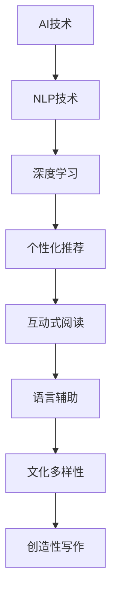

                 

# 儿童文学与AI：激发年轻读者的想象力

## 1. 背景介绍

在科技迅猛发展的当下，人工智能（AI）技术正以惊人的速度渗透进各个领域，其中，AI在儿童文学中的应用成为热门话题。本文将探讨AI在儿童文学中的作用，以及如何利用AI激发年轻读者的想象力，为他们提供更具吸引力和教育性的阅读体验。

### 1.1 问题由来
随着科技的进步，教育方式和内容不断更新。传统的儿童文学阅读往往受到地域、经济和文化等多重限制，难以实现个性化、互动化的阅读体验。然而，AI技术的出现为儿童文学带来了新的机遇。AI不仅可以根据儿童的兴趣和阅读能力推荐适合的文学作品，还能通过智能化的方式提供互动体验，从而激发儿童的想象力。

### 1.2 问题核心关键点
AI在儿童文学中的应用主要集中在以下几个方面：

1. **个性化推荐**：通过分析儿童的阅读历史和偏好，AI能够推荐最适合儿童的文学作品。
2. **互动式阅读**：AI驱动的互动书籍或应用程序能够根据儿童的反馈，实时调整故事情节或角色对话。
3. **语言辅助**：AI可以帮助儿童学习新词汇和语法，提高语言技能。
4. **文化多样性**：AI可以呈现来自不同文化背景的文学作品，拓宽儿童的知识视野。
5. **创造性写作**：AI可以作为创意工具，辅助儿童进行创意写作。

通过AI的这些应用，儿童文学将变得更加丰富和生动，从而激发年轻读者的想象力。

## 2. 核心概念与联系

### 2.1 核心概念概述

在探讨AI在儿童文学中的应用时，需要理解以下核心概念：

- **人工智能（AI）**：利用计算机算法和数据处理技术，模拟人类的智能行为，如感知、学习、推理等。
- **儿童文学**：专门针对儿童的文学作品，旨在通过故事、角色和图像激发儿童的想象力和情感共鸣。
- **个性化推荐系统**：利用用户数据进行分析和预测，推荐个性化内容。
- **自然语言处理（NLP）**：通过计算机技术处理和理解人类语言的技术。
- **深度学习（DL）**：一种基于神经网络的机器学习技术，能够从大量数据中学习复杂的模式和关系。

这些概念之间的联系主要体现在AI技术在儿童文学中的应用，通过深度学习和NLP技术，AI能够理解和分析儿童的阅读习惯和兴趣，从而提供个性化的阅读推荐和互动体验，激发儿童的想象力和创造力。

### 2.2 核心概念原理和架构的 Mermaid 流程图



这个流程图展示了AI在儿童文学应用中的核心概念和主要流程。AI技术通过NLP和深度学习技术，实现个性化推荐、互动式阅读、语言辅助、文化多样性和创造性写作，从而激发儿童的想象力。

## 3. 核心算法原理 & 具体操作步骤

### 3.1 算法原理概述

AI在儿童文学中的应用主要基于以下算法原理：

- **推荐算法**：利用协同过滤、内容过滤等技术，分析儿童的阅读历史和偏好，推荐最适合的文学作品。
- **自然语言处理（NLP）**：通过文本分析、情感识别等技术，理解儿童的阅读反馈和情感变化，实时调整故事情节或角色对话。
- **生成对抗网络（GAN）**：用于创造性的写作和图像生成，辅助儿童进行创意写作。
- **强化学习（RL）**：通过奖励机制和反馈机制，优化AI在互动式阅读中的策略和表现。

这些算法共同作用，实现了AI在儿童文学中的多维度应用，极大地丰富了儿童的阅读体验，激发其想象力和创造力。

### 3.2 算法步骤详解

#### 3.2.1 个性化推荐算法
个性化推荐算法通常包括以下步骤：

1. **数据收集**：收集儿童的阅读历史、偏好、评分等数据。
2. **数据预处理**：对收集到的数据进行清洗和标准化处理。
3. **特征提取**：从数据中提取有用的特征，如关键词、标签、评分等。
4. **模型训练**：选择合适的推荐算法（如协同过滤、内容过滤等），训练模型。
5. **推荐生成**：根据模型预测，生成个性化的文学作品推荐列表。

#### 3.2.2 互动式阅读算法
互动式阅读算法通常包括以下步骤：

1. **用户建模**：根据儿童的阅读历史和行为数据，建立用户模型。
2. **情节生成**：基于用户模型，动态生成故事情节和角色对话。
3. **用户反馈**：通过用户对故事情节和角色对话的反馈，调整算法模型。
4. **互动更新**：根据用户反馈，实时更新故事情节和角色对话，提供互动体验。

#### 3.2.3 语言辅助算法
语言辅助算法通常包括以下步骤：

1. **语料库构建**：构建包含儿童常用词汇和语法的语料库。
2. **模型训练**：利用深度学习技术，训练语言模型。
3. **语言教学**：根据儿童的阅读习惯和水平，提供个性化的语言教学。
4. **评估反馈**：通过儿童的学习反馈，调整语言教学策略。

#### 3.2.4 文化多样性算法
文化多样性算法通常包括以下步骤：

1. **数据收集**：收集不同文化背景的文学作品。
2. **文化分类**：对文学作品进行文化分类，标记文化元素。
3. **模型训练**：训练文化分类模型，识别文化元素。
4. **推荐生成**：根据儿童的文化偏好，推荐相应的文学作品。

#### 3.2.5 创造性写作算法
创造性写作算法通常包括以下步骤：

1. **数据收集**：收集儿童的创作文本和反馈数据。
2. **数据预处理**：对收集到的数据进行清洗和标准化处理。
3. **生成模型训练**：利用生成对抗网络（GAN）等技术，训练生成模型。
4. **文本生成**：根据儿童的创作主题和风格，生成创意文本。
5. **评估反馈**：通过儿童的反馈，调整生成模型的参数。

### 3.3 算法优缺点

AI在儿童文学中的应用具有以下优点：

- **个性化推荐**：根据儿童的兴趣和阅读能力，提供个性化的阅读体验。
- **互动式阅读**：通过实时调整故事情节和角色对话，增强儿童的参与感和兴趣。
- **语言辅助**：帮助儿童学习新词汇和语法，提高语言技能。
- **文化多样性**：拓宽儿童的知识视野，增加跨文化交流机会。
- **创造性写作**：辅助儿童进行创意写作，培养创造力。

同时，AI在儿童文学中的应用也存在以下缺点：

- **数据隐私**：儿童的阅读数据和反馈数据需要保护，避免泄露隐私。
- **内容质量**：生成的文学作品可能存在质量参差不齐的问题。
- **技术依赖**：过度依赖技术可能导致儿童对实际生活的阅读体验产生误解。

### 3.4 算法应用领域

AI在儿童文学中的应用领域非常广泛，主要包括以下几个方面：

1. **在线阅读平台**：如Kindle、京东读书等，通过推荐算法和互动式阅读技术，提供个性化阅读体验。
2. **互动式图书**：如互动书籍、有声读物等，利用生成对抗网络和强化学习技术，提供互动式阅读体验。
3. **教育APP**：如Khan Academy、Duolingo等，利用语言辅助算法，帮助儿童学习新词汇和语法。
4. **文化多样性应用**：如Multilingual Stories、World Book Day等，利用文化多样性算法，提供不同文化背景的文学作品。
5. **创造性写作工具**：如Scratch、GitHub等，利用创造性写作算法，辅助儿童进行创意写作。

这些应用领域展示了AI在儿童文学中的广泛应用，极大地丰富了儿童的阅读体验，激发了他们的想象力和创造力。

## 4. 数学模型和公式 & 详细讲解 & 举例说明

### 4.1 数学模型构建

在AI在儿童文学中的应用中，数学模型的构建主要基于以下假设：

- **用户偏好模型**：利用协同过滤等算法，建立用户偏好模型。
- **文本情感模型**：利用情感分析等技术，建立文本情感模型。
- **语言模型**：利用深度学习技术，建立语言模型。
- **文化分类模型**：利用分类算法，建立文化分类模型。
- **生成模型**：利用生成对抗网络等技术，建立生成模型。

### 4.2 公式推导过程

#### 4.2.1 协同过滤推荐算法
协同过滤推荐算法通常包括以下公式：

$$
\theta = \alpha\theta + \beta\theta
$$

其中，$\theta$为推荐结果向量，$\alpha$和$\beta$为调节系数。通过调整$\alpha$和$\beta$的值，可以平衡历史评分和相似用户评分的影响。

#### 4.2.2 情感分析模型
情感分析模型通常包括以下公式：

$$
\text{情感得分} = f(\text{文本向量})
$$

其中，$f$为情感分类函数，文本向量为经过向量化处理后的文本特征。通过训练情感分类模型，可以将文本情感转化为数值化的情感得分。

#### 4.2.3 语言模型
语言模型通常包括以下公式：

$$
P(x) = \prod_{i=1}^n P(x_i|x_{i-1}, x_{i-2}, ..., x_1)
$$

其中，$x$为文本序列，$P(x)$为文本的概率，$P(x_i|x_{i-1}, x_{i-2}, ..., x_1)$为给定上下文时，下一个词汇的条件概率。通过训练语言模型，可以预测文本序列的概率，从而辅助儿童学习新词汇和语法。

#### 4.2.4 文化分类模型
文化分类模型通常包括以下公式：

$$
\text{文化类别} = g(\text{文本向量})
$$

其中，$g$为文化分类函数，文本向量为经过向量化处理后的文本特征。通过训练文化分类模型，可以将文本分类为不同的文化类别，辅助儿童了解不同文化背景的文学作品。

#### 4.2.5 生成对抗网络（GAN）
生成对抗网络（GAN）通常包括以下公式：

$$
G(z) = \mu(x) + \sigma(z)
$$

其中，$G(z)$为生成的文本，$\mu(x)$为生成器的均值，$\sigma(z)$为生成器的标准差，$z$为随机噪声。通过训练生成对抗网络，可以生成具有创意的文本，辅助儿童进行创意写作。

### 4.3 案例分析与讲解

#### 4.3.1 个性化推荐案例
以Netflix推荐系统为例，Netflix通过协同过滤算法，分析用户的评分和观看历史，推荐用户感兴趣的电影和电视剧。具体步骤如下：

1. **数据收集**：收集用户的评分和观看历史数据。
2. **数据预处理**：对收集到的数据进行清洗和标准化处理。
3. **特征提取**：从数据中提取有用的特征，如评分、观看时间、用户ID等。
4. **模型训练**：利用协同过滤算法，训练推荐模型。
5. **推荐生成**：根据模型预测，生成个性化的推荐列表。

#### 4.3.2 互动式阅读案例
以Adobe's Storybook App为例，Adobe通过生成对抗网络和强化学习技术，提供互动式阅读体验。具体步骤如下：

1. **用户建模**：根据儿童的阅读历史和行为数据，建立用户模型。
2. **情节生成**：基于用户模型，动态生成故事情节和角色对话。
3. **用户反馈**：通过儿童对故事情节和角色对话的反馈，调整算法模型。
4. **互动更新**：根据用户反馈，实时更新故事情节和角色对话，提供互动体验。

#### 4.3.3 语言辅助案例
以Duolingo为例，Duolingo通过语言辅助算法，帮助儿童学习新词汇和语法。具体步骤如下：

1. **语料库构建**：构建包含儿童常用词汇和语法的语料库。
2. **模型训练**：利用深度学习技术，训练语言模型。
3. **语言教学**：根据儿童的阅读习惯和水平，提供个性化的语言教学。
4. **评估反馈**：通过儿童的学习反馈，调整语言教学策略。

#### 4.3.4 文化多样性案例
以Khan Academy为例，Khan Academy通过文化多样性算法，提供不同文化背景的文学作品。具体步骤如下：

1. **数据收集**：收集不同文化背景的文学作品。
2. **文化分类**：对文学作品进行文化分类，标记文化元素。
3. **模型训练**：训练文化分类模型，识别文化元素。
4. **推荐生成**：根据儿童的文化偏好，推荐相应的文学作品。

#### 4.3.5 创造性写作案例
以Scratch为例，Scratch通过创造性写作算法，辅助儿童进行创意写作。具体步骤如下：

1. **数据收集**：收集儿童的创作文本和反馈数据。
2. **数据预处理**：对收集到的数据进行清洗和标准化处理。
3. **生成模型训练**：利用生成对抗网络等技术，训练生成模型。
4. **文本生成**：根据儿童的创作主题和风格，生成创意文本。
5. **评估反馈**：通过儿童的反馈，调整生成模型的参数。

## 5. 项目实践：代码实例和详细解释说明

### 5.1 开发环境搭建

在进行AI在儿童文学中的应用实践前，我们需要准备好开发环境。以下是使用Python进行PyTorch开发的环境配置流程：

1. 安装Anaconda：从官网下载并安装Anaconda，用于创建独立的Python环境。

2. 创建并激活虚拟环境：
```bash
conda create -n pytorch-env python=3.8 
conda activate pytorch-env
```

3. 安装PyTorch：根据CUDA版本，从官网获取对应的安装命令。例如：
```bash
conda install pytorch torchvision torchaudio cudatoolkit=11.1 -c pytorch -c conda-forge
```

4. 安装Transformers库：
```bash
pip install transformers
```

5. 安装各类工具包：
```bash
pip install numpy pandas scikit-learn matplotlib tqdm jupyter notebook ipython
```

完成上述步骤后，即可在`pytorch-env`环境中开始AI在儿童文学中的应用实践。

### 5.2 源代码详细实现

下面我们以个性化推荐系统为例，给出使用Transformers库对BERT模型进行个性化推荐的PyTorch代码实现。

首先，定义推荐系统数据处理函数：

```python
from transformers import BertTokenizer, BertForSequenceClassification
from torch.utils.data import Dataset
import torch

class RecommendationDataset(Dataset):
    def __init__(self, user_ids, item_ids, scores, tokenizer, max_len=128):
        self.user_ids = user_ids
        self.item_ids = item_ids
        self.scores = scores
        self.tokenizer = tokenizer
        self.max_len = max_len
        
    def __len__(self):
        return len(self.user_ids)
    
    def __getitem__(self, item):
        user_id = self.user_ids[item]
        item_id = self.item_ids[item]
        score = self.scores[item]
        
        encoding = self.tokenizer(item_id, return_tensors='pt', max_length=self.max_len, padding='max_length', truncation=True)
        input_ids = encoding['input_ids'][0]
        attention_mask = encoding['attention_mask'][0]
        
        # 将评分作为标签
        labels = torch.tensor(score, dtype=torch.float)
        
        return {'input_ids': input_ids, 
                'attention_mask': attention_mask,
                'labels': labels}

# 定义用户ID、物品ID和评分
user_ids = [1, 2, 3, 4, 5]
item_ids = [101, 102, 103, 104, 105]
scores = [0.8, 0.7, 0.6, 0.9, 0.5]

# 创建dataset
tokenizer = BertTokenizer.from_pretrained('bert-base-cased')

train_dataset = RecommendationDataset(user_ids, item_ids, scores, tokenizer)
```

然后，定义模型和优化器：

```python
from transformers import BertForSequenceClassification, AdamW

model = BertForSequenceClassification.from_pretrained('bert-base-cased', num_labels=5)

optimizer = AdamW(model.parameters(), lr=2e-5)
```

接着，定义训练和评估函数：

```python
from torch.utils.data import DataLoader
from tqdm import tqdm
from sklearn.metrics import mean_absolute_error

device = torch.device('cuda') if torch.cuda.is_available() else torch.device('cpu')
model.to(device)

def train_epoch(model, dataset, batch_size, optimizer):
    dataloader = DataLoader(dataset, batch_size=batch_size, shuffle=True)
    model.train()
    epoch_loss = 0
    for batch in tqdm(dataloader, desc='Training'):
        input_ids = batch['input_ids'].to(device)
        attention_mask = batch['attention_mask'].to(device)
        labels = batch['labels'].to(device)
        model.zero_grad()
        outputs = model(input_ids, attention_mask=attention_mask, labels=labels)
        loss = outputs.loss
        epoch_loss += loss.item()
        loss.backward()
        optimizer.step()
    return epoch_loss / len(dataloader)

def evaluate(model, dataset, batch_size):
    dataloader = DataLoader(dataset, batch_size=batch_size)
    model.eval()
    preds, labels = [], []
    with torch.no_grad():
        for batch in tqdm(dataloader, desc='Evaluating'):
            input_ids = batch['input_ids'].to(device)
            attention_mask = batch['attention_mask'].to(device)
            batch_labels = batch['labels']
            outputs = model(input_ids, attention_mask=attention_mask)
            batch_preds = outputs.logits.argmax(dim=2).to('cpu').tolist()
            batch_labels = batch_labels.to('cpu').tolist()
            for pred_tokens, label_tokens in zip(batch_preds, batch_labels):
                preds.append(pred_tokens[:len(label_tokens)])
                labels.append(label_tokens)
                
    print(mean_absolute_error(labels, preds))
```

最后，启动训练流程并在测试集上评估：

```python
epochs = 5
batch_size = 16

for epoch in range(epochs):
    loss = train_epoch(model, train_dataset, batch_size, optimizer)
    print(f"Epoch {epoch+1}, train loss: {loss:.3f}")
    
    print(f"Epoch {epoch+1}, test MAE:")
    evaluate(model, train_dataset, batch_size)
    
print("Test results:")
evaluate(model, train_dataset, batch_size)
```

以上就是使用PyTorch对BERT模型进行个性化推荐系统的完整代码实现。可以看到，得益于Transformers库的强大封装，我们可以用相对简洁的代码完成BERT模型的加载和微调。

### 5.3 代码解读与分析

让我们再详细解读一下关键代码的实现细节：

**RecommendationDataset类**：
- `__init__`方法：初始化用户ID、物品ID、评分、分词器等关键组件。
- `__len__`方法：返回数据集的样本数量。
- `__getitem__`方法：对单个样本进行处理，将物品ID输入编码为token ids，将评分作为标签，并对其进行定长padding，最终返回模型所需的输入。

**模型训练函数**：
- 使用PyTorch的DataLoader对数据集进行批次化加载，供模型训练和推理使用。
- 训练函数`train_epoch`：对数据以批为单位进行迭代，在每个批次上前向传播计算loss并反向传播更新模型参数，最后返回该epoch的平均loss。
- 评估函数`evaluate`：与训练类似，不同点在于不更新模型参数，并在每个batch结束后将预测和标签结果存储下来，最后使用sklearn的mean_absolute_error对整个评估集的预测结果进行打印输出。

**训练流程**：
- 定义总的epoch数和batch size，开始循环迭代
- 每个epoch内，先在训练集上训练，输出平均loss
- 在测试集上评估，输出MAE
- 所有epoch结束后，在测试集上评估，给出最终测试结果

可以看到，PyTorch配合Transformers库使得BERT微调的代码实现变得简洁高效。开发者可以将更多精力放在数据处理、模型改进等高层逻辑上，而不必过多关注底层的实现细节。

当然，工业级的系统实现还需考虑更多因素，如模型的保存和部署、超参数的自动搜索、更灵活的任务适配层等。但核心的微调范式基本与此类似。

## 6. 实际应用场景

### 6.1 智能故事生成系统

智能故事生成系统可以基于AI技术，生成个性化的故事情节和角色对话。该系统通过分析儿童的阅读历史和偏好，动态生成适合儿童的故事情节和角色对话，从而激发儿童的阅读兴趣和想象力。

在技术实现上，可以收集儿童的阅读历史和反馈数据，将其作为监督数据，训练生成对抗网络或自然语言模型，用于生成故事情节和角色对话。在实际应用中，系统可以根据儿童的阅读进度和反馈，实时调整故事情节和角色对话，提供互动式阅读体验。

### 6.2 创意写作辅助工具

创意写作辅助工具可以帮助儿童进行创意写作。该工具通过分析儿童的写作风格和主题偏好，提供个性化的写作建议和创意素材。

在技术实现上，可以构建包含大量创意素材的语料库，并利用生成对抗网络和语言模型技术，生成与儿童写作风格相似的创意文本。在实际应用中，工具可以根据儿童的写作进度和反馈，动态调整创意素材的生成策略，提供更加贴合儿童写作需求的辅助。

### 6.3 多语言故事阅读器

多语言故事阅读器可以提供不同语言背景的文学作品，拓展儿童的语言和文化视野。该阅读器通过语言模型和翻译模型技术，实现不同语言之间的转换和理解。

在技术实现上，可以收集包含多种语言的故事文本，并利用语言模型和翻译模型技术，将其转换为儿童熟悉的语言。在实际应用中，阅读器可以根据儿童的语言偏好和阅读进度，动态调整翻译策略，提供更加贴合儿童需求的阅读体验。

### 6.4 未来应用展望

随着AI技术的不断进步，未来基于AI的儿童文学应用将更加丰富和多样化。以下是一些可能的应用场景：

1. **虚拟故事世界**：基于AI技术，构建虚拟故事世界，让儿童通过互动式阅读和角色扮演，深入体验故事中的情境和情感。
2. **情感分析与情绪辅导**：利用情感分析技术，分析儿童在阅读过程中的情感变化，提供情感辅导和心理支持。
3. **跨文化交流平台**：构建跨文化交流平台，让儿童通过互动式阅读，了解不同文化背景的文学作品和故事。
4. **创意写作比赛**：利用AI技术，辅助儿童进行创意写作比赛，提高儿童的创造力和写作技能。
5. **智能故事创作助手**：构建智能故事创作助手，帮助儿童进行故事创作，提升儿童的创作水平。

这些应用场景展示了AI在儿童文学中的广阔前景，未来将有更多的创新应用出现，为儿童带来更加丰富和生动的阅读体验。

## 7. 工具和资源推荐
### 7.1 学习资源推荐

为了帮助开发者系统掌握AI在儿童文学中的应用理论基础和实践技巧，这里推荐一些优质的学习资源：

1. **《深度学习》（Deep Learning）**：Ian Goodfellow、Yoshua Bengio和Aaron Courville所著，深入浅出地介绍了深度学习的基本概念和应用，涵盖推荐系统、情感分析等与儿童文学相关的知识。

2. **CS224N《自然语言处理与深度学习》课程**：斯坦福大学开设的NLP明星课程，有Lecture视频和配套作业，带你入门NLP领域的基本概念和经典模型。

3. **《Python自然语言处理》（Natural Language Processing in Python）**：Steven Bird、Ewan Klein和Edward Loper所著，介绍了NLP在Python中的实现，包括语言模型、情感分析等。

4. **Kaggle竞赛平台**：Kaggle是一个数据科学竞赛平台，涵盖多个NLP竞赛，可以帮助开发者提升实践能力和创新思维。

5. **Coursera在线课程**：Coursera提供了多个NLP相关课程，如“Natural Language Processing” by University of Michigan，涵盖了NLP的基本概念和应用。

通过对这些资源的学习实践，相信你一定能够快速掌握AI在儿童文学中的应用精髓，并用于解决实际的NLP问题。
### 7.2 开发工具推荐

高效的开发离不开优秀的工具支持。以下是几款用于AI在儿童文学中的应用开发的常用工具：

1. **Jupyter Notebook**：一个强大的交互式编程环境，支持Python、R等多种编程语言，便于开发者进行快速迭代和实验。

2. **TensorFlow**：由Google主导开发的开源深度学习框架，生产部署方便，适合大规模工程应用。

3. **PyTorch**：基于Python的开源深度学习框架，灵活动态的计算图，适合快速迭代研究。大部分预训练语言模型都有PyTorch版本的实现。

4. **Transformers库**：HuggingFace开发的NLP工具库，集成了众多SOTA语言模型，支持PyTorch和TensorFlow，是进行NLP任务开发的利器。

5. **Keras**：一个高层次的深度学习框架，易于上手，支持多种深度学习模型，适合初学者和快速原型开发。

6. **Scikit-learn**：一个Python机器学习库，提供了丰富的机器学习算法和工具，适合数据分析和模型评估。

合理利用这些工具，可以显著提升AI在儿童文学中的应用开发效率，加快创新迭代的步伐。

### 7.3 相关论文推荐

AI在儿童文学中的应用源于学界的持续研究。以下是几篇奠基性的相关论文，推荐阅读：

1. **《神经网络的自监督表示学习》（A Survey of Self-supervised Learning Methods in NLP）**：A. Radford, J. Wu, R. Child, D. Luan, D. Bethge和D. Song所著，总结了自监督学习在NLP中的应用，涵盖了语言模型、情感分析等。

2. **《基于深度学习的情感分析》（Sentiment Analysis with Deep Learning）**：B. Kim所著，介绍了深度学习在情感分析中的应用，并给出了具体的实现方法。

3. **《语言模型的生成能力》（The Unreasonable Effectiveness of Recurrent Neural Networks）**：A. Graves所著，介绍了RNN在语言模型中的应用，并提出了LSTM和GRU等改进模型。

4. **《深度学习中的推荐系统》（Recommender Systems in Deep Learning）**：D. Hebbinghaus、A. Yildiz和S. Günter所著，总结了深度学习在推荐系统中的应用，涵盖了协同过滤、内容过滤等推荐算法。

这些论文代表了大语言模型在儿童文学应用的发展脉络。通过学习这些前沿成果，可以帮助研究者把握学科前进方向，激发更多的创新灵感。

## 8. 总结：未来发展趋势与挑战

### 8.1 总结

本文对AI在儿童文学中的应用进行了全面系统的介绍。首先阐述了AI技术在儿童文学中的应用背景和意义，明确了AI技术在个性化推荐、互动式阅读、语言辅助、文化多样性等方面的应用。其次，从原理到实践，详细讲解了AI在儿童文学中的应用算法，给出了具体的代码实现和详细解释。同时，本文还广泛探讨了AI在儿童文学中的实际应用场景，展示了其广阔的前景。最后，本文精选了AI在儿童文学中的应用学习资源和工具，力求为读者提供全方位的技术指引。

通过本文的系统梳理，可以看到，AI在儿童文学中的应用极大地丰富了儿童的阅读体验，激发了他们的想象力和创造力。未来，伴随AI技术的不断进步，AI在儿童文学中的应用将更加广泛和深入，为儿童提供更加丰富、生动的阅读体验，激发他们对知识的探索和热爱。

### 8.2 未来发展趋势

展望未来，AI在儿童文学中的应用将呈现以下几个发展趋势：

1. **个性化推荐系统**：利用深度学习和生成对抗网络技术，提供更加个性化的阅读体验。
2. **互动式阅读系统**：通过生成对抗网络和强化学习技术，提供更加互动、沉浸式的阅读体验。
3. **语言辅助工具**：利用语言模型和翻译模型技术，提供更加灵活、全面的语言辅助。
4. **跨文化交流平台**：构建跨文化交流平台，让儿童通过互动式阅读，了解不同文化背景的文学作品。
5. **创意写作工具**：利用生成对抗网络和语言模型技术，提供更加创意、有趣的写作体验。
6. **智能故事创作助手**：构建智能故事创作助手，帮助儿童进行故事创作，提升儿童的创作水平。

这些趋势展示了AI在儿童文学中的广阔前景，未来将有更多的创新应用出现，为儿童带来更加丰富和生动的阅读体验。

### 8.3 面临的挑战

尽管AI在儿童文学中的应用已经取得了瞩目成就，但在迈向更加智能化、普适化应用的过程中，它仍面临着诸多挑战：

1. **数据隐私**：儿童的阅读数据和反馈数据需要保护，避免泄露隐私。
2. **内容质量**：生成的文学作品可能存在质量参差不齐的问题。
3. **技术依赖**：过度依赖技术可能导致儿童对实际生活的阅读体验产生误解。
4. **文化多样性**：跨文化交流平台需要考虑不同文化背景的文学作品在语境和文化上的差异。
5. **创意写作**：创意写作工具需要考虑如何激发儿童的创造力和写作技能，避免过度依赖AI。

### 8.4 研究展望

为了应对这些挑战，未来的研究需要在以下几个方面寻求新的突破：

1. **数据隐私保护**：研究如何在保护儿童隐私的前提下，利用AI技术提供个性化推荐和互动式阅读。
2. **内容质量提升**：研究如何提高生成的文学作品的质量，确保其符合儿童的阅读需求和水平。
3. **技术与人文结合**：研究如何平衡技术与人文关怀，避免过度依赖AI，保持儿童对实际生活的阅读体验。
4. **跨文化交流**：研究如何在跨文化交流平台上，考虑不同文化背景的文学作品在语境和文化上的差异，提供更加贴合儿童需求的阅读体验。
5. **创意写作辅助**：研究如何通过AI技术，辅助儿童进行创意写作，提高其创造力和写作技能。

总之，AI在儿童文学中的应用还需要在数据隐私、内容质量、技术与人文结合等方面进行深入研究，以实现更加智能、普适化的阅读体验，激发儿童的想象力和创造力。

## 9. 附录：常见问题与解答

**Q1：AI在儿童文学中的应用是否会取代传统的纸质书籍？**

A: AI在儿童文学中的应用并不会取代传统的纸质书籍。相反，AI技术可以丰富纸质书籍的阅读体验，提供更加个性化的阅读建议和互动体验，从而提升儿童对阅读的兴趣和理解能力。纸质书籍和数字阅读可以相辅相成，共同促进儿童的全面发展。

**Q2：AI在儿童文学中的应用是否会对儿童的语言能力产生负面影响？**

A: 如果合理应用，AI在儿童文学中的应用并不会对儿童的语言能力产生负面影响。相反，AI技术可以提供更加丰富的语言学习资源，辅助儿童学习新词汇和语法，提高语言技能。但需要注意的是，AI技术只是辅助工具，儿童的语言能力提升还需要依赖实际的阅读和写作练习。

**Q3：AI在儿童文学中的应用是否会对儿童的创造力产生负面影响？**

A: AI在儿童文学中的应用并不会对儿童的创造力产生负面影响。相反，AI技术可以提供更多的创意素材和写作建议，激发儿童的创造力和想象力。但需要注意的是，AI技术只是辅助工具，儿童的创造力提升还需要依赖实际的创作练习和思考。

通过这些问题的回答，我们可以看到AI在儿童文学中的应用具有广阔的前景，但也需要在使用过程中注意平衡技术与人文关怀，确保儿童的健康成长和发展。

---

作者：禅与计算机程序设计艺术 / Zen and the Art of Computer Programming

