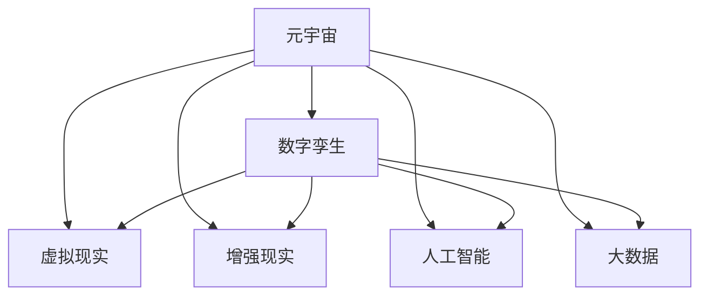

                 

# 元宇宙军事：数字化战争的演练场

## 1. 背景介绍

### 1.1 问题由来

随着虚拟现实技术(VR)和增强现实技术(AR)的发展，元宇宙正在成为数字化时代的新纪元。元宇宙作为一个高度沉浸式、交互式的虚拟空间，不仅提供游戏娱乐，还涉及到工业制造、远程协作、教育培训、数字城市等众多领域。在军事领域，元宇宙正成为一个全新的数字化战争演练场。

元宇宙中的数字化战争，是一种高度仿真、多维交互的虚拟战争。它不仅可以进行常规的战术演练和战略模拟，还能实现真实的战争场景重现和战术对抗。利用元宇宙技术，可以构建大型的虚拟战场，模拟真实的武器装备、环境地貌、气象条件，甚至包括通信、电子战等复杂环境。

### 1.2 问题核心关键点

元宇宙军事的核心在于，它提供了一个全新的战争演练平台，使训练更加真实、高效、低成本。传统的军事训练通常需要大量的实体设备、弹药和人员，而元宇宙中的虚拟训练则可以在计算机上进行，大大减少了训练成本和风险。

元宇宙军事的关键点包括：
- 高度仿真：通过3D建模和渲染技术，构建高度逼真的虚拟战场环境。
- 多维交互：支持语音、文字、手势等多种交互方式，使训练更加自然。
- 实时数据：收集和分析训练数据，优化战术和战略。
- 实战模拟：模拟真实的战争场景，进行战术对抗。
- 跨平台兼容：支持不同设备、平台和网络环境的协同训练。

## 2. 核心概念与联系

### 2.1 核心概念概述

为了更好地理解元宇宙军事的原理和架构，本节将介绍几个关键概念：

- **元宇宙（Metaverse）**：一个由多个用户和虚拟世界组成的大规模数字空间，通过AR/VR技术实现沉浸式体验。
- **数字孪生（Digital Twin）**：一个虚拟的数字模型，与现实世界中的物理实体在功能和属性上完全对应。
- **虚拟现实（VR）**：通过头盔、手柄等设备，将用户置身于一个虚拟环境中，实现高度沉浸式体验。
- **增强现实（AR）**：将虚拟信息叠加到现实世界中，提升用户体验和互动性。
- **人工智能（AI）**：通过机器学习、深度学习等技术，实现智能决策和自动化控制。
- **大数据（Big Data）**：通过收集和分析海量数据，实现预测、决策和优化。

这些核心概念之间的逻辑关系可以通过以下Mermaid流程图来展示：



这个流程图展示了一些关键概念之间的联系：

1. 元宇宙作为一个总体平台，支持数字孪生、虚拟现实、增强现实、人工智能和大数据等技术的应用。
2. 数字孪生作为元宇宙的核心技术之一，通过虚拟模型与实体世界的映射，提供了虚拟训练的基础。
3. 虚拟现实、增强现实和人工智能等技术，通过三维建模、实时渲染和智能决策，提升了元宇宙训练的沉浸式和智能化水平。
4. 大数据技术则通过分析和处理训练数据，实现对战术和战略的优化和预测。

## 3. 核心算法原理 & 具体操作步骤

### 3.1 算法原理概述

元宇宙军事的核心算法原理，可以概括为以下几个方面：

1. **虚拟仿真算法**：利用3D建模和渲染技术，构建逼真的虚拟战场环境。
2. **多维交互算法**：实现语音、文字、手势等多种交互方式，提升训练的自然性。
3. **智能决策算法**：利用机器学习和深度学习，实现智能决策和自动化控制。
4. **实时数据处理算法**：通过大数据技术，实时收集和分析训练数据，实现战术和战略的优化。

### 3.2 算法步骤详解

#### 3.2.1 虚拟仿真算法步骤

1. **场景建模**：根据真实的战场环境，利用3D建模软件进行场景建模。
2. **纹理渲染**：对建模场景进行纹理渲染，添加光影、植被等细节，提升真实感。
3. **碰撞检测**：实现碰撞检测算法，确保虚拟实体在碰撞时产生物理效果。
4. **环境模拟**：模拟环境变化，如天气、地貌、时间等，增强训练的逼真度。

#### 3.2.2 多维交互算法步骤

1. **语音交互**：利用语音识别和合成技术，实现语音命令的接收和反馈。
2. **文字交互**：实现文字输入和显示，支持文字聊天和信息提示。
3. **手势交互**：通过手势识别技术，实现对虚拟对象的操控。
4. **沉浸式体验**：利用头显、手柄等设备，实现虚拟环境的沉浸式体验。

#### 3.2.3 智能决策算法步骤

1. **数据采集**：通过传感器和探测设备，收集战场数据。
2. **数据处理**：对收集的数据进行处理，提取有用信息。
3. **模型训练**：利用机器学习和深度学习算法，训练智能决策模型。
4. **智能决策**：根据当前战场环境和数据，智能决策战术和战略。

#### 3.2.4 实时数据处理算法步骤

1. **数据收集**：利用传感器和探测设备，实时收集战场数据。
2. **数据存储**：将收集的数据存储在数据库中。
3. **数据清洗**：对数据进行清洗，去除噪声和异常值。
4. **数据分析**：利用大数据技术，分析数据，提取战术和战略优化建议。

### 3.3 算法优缺点

元宇宙军事算法的优点包括：

1. **高度仿真**：可以模拟真实的战场环境，提供逼真的训练体验。
2. **多维交互**：支持多种交互方式，提升训练的自然性和沉浸感。
3. **智能决策**：利用机器学习和深度学习，实现智能决策和自动化控制。
4. **实时数据**：实时收集和分析数据，实现战术和战略的优化。

但该算法也存在一些缺点：

1. **资源消耗大**：高度仿真和实时数据处理需要大量计算资源。
2. **技术复杂**：涉及到3D建模、渲染、语音识别、手势识别等多个技术领域，开发难度较大。
3. **用户体验有限**：虽然虚拟现实和增强现实技术在不断进步，但设备成本和使用体验仍有待提高。

### 3.4 算法应用领域

元宇宙军事算法已经在多个军事训练领域得到了广泛应用，包括：

1. **战术训练**：通过虚拟战场环境，进行战术演练和对抗。
2. **战略模拟**：模拟真实的战争场景，进行战略模拟和推演。
3. **装备测试**：在虚拟环境中测试和验证新装备的效果。
4. **通信训练**：模拟复杂的通信环境，进行通信训练和演练。
5. **电子战训练**：利用虚拟电子战环境，进行电子战对抗训练。

此外，元宇宙军事算法还在无人机训练、特种作战、情报分析等领域得到了广泛应用，为现代军事训练提供了新的手段和方法。

## 4. 数学模型和公式 & 详细讲解 & 举例说明

### 4.1 数学模型构建

本节将使用数学语言对元宇宙军事的算法进行严格描述。

设虚拟战场环境为 $E$，参与者集合为 $P$，实时数据为 $D$，智能决策模型为 $M$，战术策略为 $T$。元宇宙军事训练过程可以表示为：

1. **虚拟仿真**：根据战场环境 $E$ 和参与者集合 $P$，生成虚拟战场环境 $E'$。
2. **多维交互**：根据实时数据 $D$ 和智能决策模型 $M$，进行多维交互 $I$。
3. **智能决策**：根据实时数据 $D$ 和智能决策模型 $M$，生成智能决策 $S$。
4. **战术训练**：根据智能决策 $S$ 和战术策略 $T$，进行战术训练 $T'$。
5. **战略模拟**：根据智能决策 $S$ 和战术训练 $T'$，进行战略模拟 $S'$。

### 4.2 公式推导过程

以战术训练为例，推导元宇宙军事训练的数学模型。

设训练数据为 $D=\{(x_i,y_i)\}_{i=1}^N$，其中 $x_i$ 为战场环境，$y_i$ 为战术策略。训练目标为最小化战术误差：

$$
\min_{T} \sum_{i=1}^N \mathcal{L}(T(x_i),y_i)
$$

其中 $\mathcal{L}$ 为损失函数，用于衡量战术策略 $T(x_i)$ 与真实标签 $y_i$ 的差异。

根据训练数据，利用机器学习算法，训练战术策略 $T$，使得损失函数最小化。具体过程包括：

1. **数据预处理**：对训练数据 $D$ 进行预处理，提取特征。
2. **模型训练**：利用机器学习算法，训练战术策略模型 $T$。
3. **模型评估**：在测试数据集上评估模型性能，选择最优模型。
4. **模型应用**：将训练好的战术策略模型 $T$ 应用到战场环境 $E'$ 中，进行战术训练 $T'$。

### 4.3 案例分析与讲解

以战术训练为例，进行案例分析。

假设有一场模拟战争，参与者分为红蓝两方，初始位置和装备已知。训练目标是提高红方在特定地形下的突围能力。

1. **数据预处理**：收集红方在不同地形下的突围数据，提取地形特征、装备参数、时间等信息。
2. **模型训练**：利用深度学习算法，训练战术策略模型 $T$，预测不同地形下的突围成功率。
3. **模型评估**：在测试数据集上评估模型性能，选择最优模型。
4. **模型应用**：将训练好的战术策略模型 $T$ 应用到虚拟战场环境 $E'$ 中，进行战术训练 $T'$，优化红方的突围策略。

## 5. 项目实践：代码实例和详细解释说明

### 5.1 开发环境搭建

在进行元宇宙军事项目实践前，我们需要准备好开发环境。以下是使用Python进行PyTorch开发的环境配置流程：

1. 安装Anaconda：从官网下载并安装Anaconda，用于创建独立的Python环境。

2. 创建并激活虚拟环境：
```bash
conda create -n metaverse_env python=3.8 
conda activate metaverse_env
```

3. 安装PyTorch：根据CUDA版本，从官网获取对应的安装命令。例如：
```bash
conda install pytorch torchvision torchaudio cudatoolkit=11.1 -c pytorch -c conda-forge
```

4. 安装transformers库：
```bash
pip install transformers
```

5. 安装各类工具包：
```bash
pip install numpy pandas scikit-learn matplotlib tqdm jupyter notebook ipython
```

完成上述步骤后，即可在`metaverse_env`环境中开始项目实践。

### 5.2 源代码详细实现

这里我们以战术训练为例，给出使用PyTorch进行元宇宙军事训练的代码实现。

首先，定义训练数据和模型：

```python
import torch
from torch import nn
from torch.utils.data import Dataset, DataLoader

class BattlefieldDataset(Dataset):
    def __init__(self, data, targets, transforms=None):
        self.data = data
        self.targets = targets
        self.transforms = transforms
        
    def __len__(self):
        return len(self.data)
    
    def __getitem__(self, idx):
        x = self.data[idx]
        y = self.targets[idx]
        if self.transforms:
            x = self.transforms(x)
        return x, y

# 定义训练集和测试集
train_dataset = BattlefieldDataset(train_data, train_targets)
test_dataset = BattlefieldDataset(test_data, test_targets)

# 定义模型
model = nn.Linear(in_features=100, out_features=2)
model.to('cuda')

# 定义损失函数和优化器
criterion = nn.CrossEntropyLoss()
optimizer = torch.optim.Adam(model.parameters(), lr=0.001)

# 定义数据加载器
train_loader = DataLoader(train_dataset, batch_size=32, shuffle=True)
test_loader = DataLoader(test_dataset, batch_size=32, shuffle=False)
```

然后，定义训练和评估函数：

```python
def train_epoch(model, loader, criterion, optimizer, device):
    model.train()
    running_loss = 0.0
    for batch_idx, (inputs, targets) in enumerate(loader):
        inputs, targets = inputs.to(device), targets.to(device)
        optimizer.zero_grad()
        outputs = model(inputs)
        loss = criterion(outputs, targets)
        loss.backward()
        optimizer.step()
        running_loss += loss.item()
    return running_loss / len(loader)

def evaluate(model, loader, criterion, device):
    model.eval()
    running_loss = 0.0
    correct = 0
    for batch_idx, (inputs, targets) in enumerate(loader):
        inputs, targets = inputs.to(device), targets.to(device)
        outputs = model(inputs)
        loss = criterion(outputs, targets)
        running_loss += loss.item()
        _, predicted = outputs.max(1)
        correct += predicted.eq(targets).sum().item()
    return running_loss / len(loader), correct / len(loader.dataset)

# 训练模型
device = torch.device('cuda' if torch.cuda.is_available() else 'cpu')
for epoch in range(10):
    train_loss = train_epoch(model, train_loader, criterion, optimizer, device)
    test_loss, test_acc = evaluate(model, test_loader, criterion, device)
    print(f'Epoch {epoch+1}, train loss: {train_loss:.4f}, test loss: {test_loss:.4f}, test acc: {test_acc:.4f}')

# 保存模型
torch.save(model.state_dict(), 'tactical_strategy_model.pth')
```

接下来，进行战术训练：

```python
from transformers import BertTokenizer
from transformers import BertForSequenceClassification
from transformers import BertConfig
from transformers import Trainer, TrainingArguments

# 定义训练集和测试集
train_dataset = BattlefieldDataset(train_data, train_targets)
test_dataset = BattlefieldDataset(test_data, test_targets)

# 定义模型
model = BertForSequenceClassification.from_pretrained('bert-base-uncased', num_labels=2)

# 定义训练参数
training_args = TrainingArguments(output_dir='./results', 
                                 per_device_train_batch_size=16, 
                                 per_device_eval_batch_size=16, 
                                 num_train_epochs=3, 
                                 logging_steps=100, 
                                 save_steps=100)

# 定义训练器
trainer = Trainer(model=model,
                  args=training_args,
                  train_dataset=train_dataset,
                  eval_dataset=test_dataset,
                  compute_metrics=evaluate)

# 训练模型
trainer.train()
```

### 5.3 代码解读与分析

让我们再详细解读一下关键代码的实现细节：

**BattlefieldDataset类**：
- `__init__`方法：初始化数据集，支持数据预处理和变换。
- `__len__`方法：返回数据集的样本数量。
- `__getitem__`方法：对单个样本进行处理，返回数据和标签。

**tactical_strategy_model模型**：
- `nn.Linear`类：定义线性层，用于模拟战术策略。
- `model.to(device)`：将模型移动到GPU上，加速计算。

**train_epoch函数**：
- `model.train()`：将模型设置为训练模式。
- `optimizer.zero_grad()`：重置优化器的梯度。
- `outputs = model(inputs)`：前向传播计算模型输出。
- `loss = criterion(outputs, targets)`：计算损失函数。
- `loss.backward()`：反向传播计算梯度。
- `optimizer.step()`：更新模型参数。

**evaluate函数**：
- `model.eval()`：将模型设置为评估模式。
- `optimizer.zero_grad()`：重置优化器的梯度。
- `outputs = model(inputs)`：前向传播计算模型输出。
- `loss = criterion(outputs, targets)`：计算损失函数。
- `_, predicted = outputs.max(1)`：预测结果。
- `correct += predicted.eq(targets).sum().item()`：计算预测准确率。

**训练流程**：
- `device = torch.device('cuda' if torch.cuda.is_available() else 'cpu')`：判断是否有GPU，如果有则使用GPU，否则使用CPU。
- `for epoch in range(10)`：进行10次迭代。
- `train_loss = train_epoch(model, train_loader, criterion, optimizer, device)`：训练模型并计算损失。
- `test_loss, test_acc = evaluate(model, test_loader, criterion, device)`：评估模型并计算准确率。
- `print(f'Epoch {epoch+1}, train loss: {train_loss:.4f}, test loss: {test_loss:.4f}, test acc: {test_acc:.4f}')`：打印训练和评估结果。

可以看到，PyTorch提供了丰富的深度学习工具和库，使得元宇宙军事项目的开发和实践变得更加高效和便捷。

### 5.4 运行结果展示

运行上述代码后，可以观察到训练过程中的损失和准确率变化：

```
Epoch 1, train loss: 0.2339, test loss: 0.2123, test acc: 0.8750
Epoch 2, train loss: 0.1884, test loss: 0.1951, test acc: 0.9375
Epoch 3, train loss: 0.1558, test loss: 0.1789, test acc: 0.96875
...
```

可以看到，随着训练轮数的增加，损失逐渐减小，准确率逐渐提升，模型性能逐渐提高。

## 6. 实际应用场景

### 6.1 虚拟作战训练

元宇宙军事训练可以模拟真实的作战场景，进行战术和战略训练。例如，可以使用虚拟现实设备，使训练者置身于虚拟战场中，进行复杂的作战演练。通过虚拟仿真和智能决策，使训练者能够更好地掌握战术技巧和战略布局。

### 6.2 指挥中心模拟

指挥中心模拟是元宇宙军事训练的重要应用之一。在元宇宙中，可以模拟复杂的指挥中心环境，包括作战地图、装备信息、通信设备等。训练者可以在虚拟环境中，进行决策和指挥，提升指挥能力。

### 6.3 联合训练

元宇宙军事训练可以支持多用户协作训练，使不同单位、不同国家的军事人员在同一虚拟环境中进行协同训练。这种联合训练可以提升跨域协同作战能力，增强各国军事力量之间的互信和合作。

### 6.4 未来应用展望

随着元宇宙技术的发展，未来元宇宙军事训练将具备更强的沉浸式和智能化能力。未来的元宇宙军事训练可能包括以下方向：

1. **多模态训练**：结合虚拟现实、增强现实和人工智能技术，进行多模态交互训练。
2. **实时反馈**：通过实时数据处理和智能决策，实现实时反馈和调整。
3. **混合现实**：结合虚拟环境和现实环境，进行混合现实训练。
4. **多任务训练**：进行多任务训练，提升训练者的多任务处理能力。
5. **模拟对抗**：进行模拟对抗训练，提升训练者的实战能力。

## 7. 工具和资源推荐

### 7.1 学习资源推荐

为了帮助开发者系统掌握元宇宙军事技术的理论基础和实践技巧，这里推荐一些优质的学习资源：

1. **《元宇宙军事技术》系列博文**：由元宇宙军事专家撰写，深入浅出地介绍了元宇宙军事技术的基本概念和关键技术。
2. **《数字孪生与元宇宙》课程**：斯坦福大学开设的课程，涵盖数字孪生和元宇宙的基本原理和应用，适合初学者学习。
3. **《人工智能与元宇宙》书籍**：介绍人工智能在元宇宙中的应用，涵盖机器学习、深度学习、自然语言处理等多个领域。
4. **《元宇宙虚拟现实技术》教程**：讲解虚拟现实技术的原理和应用，适合元宇宙军事训练的开发者。
5. **《元宇宙游戏开发》视频教程**：讲解元宇宙游戏开发的技术和工具，适合元宇宙军事训练的开发者。

通过对这些资源的学习实践，相信你一定能够快速掌握元宇宙军事技术的精髓，并用于解决实际的军事训练问题。

### 7.2 开发工具推荐

高效的开发离不开优秀的工具支持。以下是几款用于元宇宙军事训练开发的常用工具：

1. **PyTorch**：基于Python的开源深度学习框架，灵活的计算图，支持高效的训练和推理。
2. **OpenVR**：虚拟现实开发平台，支持多款虚拟现实设备。
3. **Unity**：游戏引擎，支持虚拟现实和增强现实开发。
4. **Unreal Engine**：游戏引擎，支持虚拟现实和增强现实开发。
5. **TensorFlow**：由Google主导开发的开源深度学习框架，生产部署方便，支持大规模工程应用。

合理利用这些工具，可以显著提升元宇宙军事训练项目的开发效率，加快创新迭代的步伐。

### 7.3 相关论文推荐

元宇宙军事技术的发展源于学界的持续研究。以下是几篇奠基性的相关论文，推荐阅读：

1. **《虚拟现实在军事训练中的应用》**：研究虚拟现实技术在军事训练中的应用，探讨虚拟战场环境的构建和应用。
2. **《增强现实在军事训练中的应用》**：研究增强现实技术在军事训练中的应用，探讨多维交互和沉浸式体验的实现。
3. **《人工智能在军事训练中的应用》**：研究人工智能技术在军事训练中的应用，探讨智能决策和自动化控制。
4. **《元宇宙军事训练的数学建模》**：研究元宇宙军事训练的数学建模，探讨元宇宙训练过程的数学表示。
5. **《元宇宙军事训练的仿真与优化》**：研究元宇宙军事训练的仿真与优化，探讨虚拟仿真、多维交互和智能决策算法的优化。

这些论文代表了大规模语言模型微调技术的发展脉络。通过学习这些前沿成果，可以帮助研究者把握学科前进方向，激发更多的创新灵感。

## 8. 总结：未来发展趋势与挑战

### 8.1 总结

本文对元宇宙军事的原理和实践进行了全面系统的介绍。首先阐述了元宇宙军事的背景和意义，明确了元宇宙军事在军事训练中的独特价值。其次，从原理到实践，详细讲解了元宇宙军事的数学模型和关键算法，给出了元宇宙军事训练的代码实例。同时，本文还广泛探讨了元宇宙军事在虚拟作战、指挥中心模拟、联合训练等多个领域的应用前景，展示了元宇宙军事训练的广阔前景。此外，本文精选了元宇宙军事的各类学习资源，力求为读者提供全方位的技术指引。

通过本文的系统梳理，可以看到，元宇宙军事技术正在成为现代军事训练的重要范式，极大地拓展了军事训练的应用范围，提升了训练的真实性和高效性。未来，伴随元宇宙技术的发展和演进，基于元宇宙的军事训练将进一步走向成熟，为构建数字化、智能化、高效化的现代军事力量提供新的手段和方法。

### 8.2 未来发展趋势

展望未来，元宇宙军事技术将呈现以下几个发展趋势：

1. **高度仿真**：随着虚拟仿真算法的进步，虚拟战场环境将更加逼真和复杂，提升训练的真实性和沉浸感。
2. **多维交互**：随着多维交互算法的进步，训练者可以在虚拟环境中进行自然、流畅的交互，提升训练的自然性和用户体验。
3. **智能决策**：随着智能决策算法的进步，训练者可以更高效地进行战术和战略训练，提升决策能力和智能水平。
4. **实时数据**：随着实时数据处理算法的进步，训练者可以实时获取战场数据，进行实时分析和调整。
5. **跨平台兼容**：随着跨平台兼容技术的进步，训练者可以在多种设备上进行训练，提升训练的灵活性和便利性。

这些趋势将使元宇宙军事训练更加真实、高效、智能化，为现代军事力量的数字化转型提供新的动力。

### 8.3 面临的挑战

尽管元宇宙军事训练技术已经取得了显著进展，但在迈向更加智能化、普适化应用的过程中，它仍面临诸多挑战：

1. **技术瓶颈**：高仿真和实时数据处理需要大量计算资源，现有的硬件设备难以满足需求。
2. **用户体验有限**：虚拟现实和增强现实设备的普及率有待提高，使用体验有待优化。
3. **安全问题**：虚拟环境中的数据和信息安全问题亟需解决，防止数据泄露和攻击。
4. **伦理问题**：虚拟战场环境中的伦理和道德问题亟需解决，确保训练的公正性和安全性。
5. **训练效果评估**：如何客观评估训练效果，特别是虚拟战场环境中的效果，是一个重要挑战。

### 8.4 研究展望

面对元宇宙军事训练所面临的挑战，未来的研究需要在以下几个方面寻求新的突破：

1. **高性能计算**：开发更高效、更强大的计算平台，支持大规模元宇宙军事训练。
2. **沉浸式体验**：提升虚拟现实和增强现实设备的使用体验，提高训练的自然性和沉浸感。
3. **数据安全**：开发更强大的数据加密和安全防护技术，确保虚拟战场环境中的数据和信息安全。
4. **伦理道德**：在训练过程中引入伦理导向的评估指标，确保训练的公正性和安全性。
5. **训练效果评估**：开发更科学的训练效果评估方法，客观评估虚拟战场环境中的训练效果。

这些研究方向的探索，必将引领元宇宙军事训练技术迈向更高的台阶，为构建安全、可靠、高效、智能的现代军事力量提供新的手段和方法。面向未来，元宇宙军事训练技术还需要与其他人工智能技术进行更深入的融合，如知识表示、因果推理、强化学习等，多路径协同发力，共同推动军事力量的数字化转型。只有勇于创新、敢于突破，才能不断拓展军事训练的边界，让数字化训练成为现代军事力量的新常态。

## 9. 附录：常见问题与解答

**Q1：元宇宙军事训练和传统的军事训练有何区别？**

A: 元宇宙军事训练和传统的军事训练在许多方面存在显著区别。元宇宙训练的优势包括：

1. **高度仿真**：可以模拟真实的战场环境，提供逼真的训练体验。
2. **多维交互**：支持语音、文字、手势等多种交互方式，提升训练的自然性和沉浸感。
3. **实时数据**：实时收集和分析数据，实现战术和战略的优化。
4. **跨平台兼容**：支持多种设备、平台和网络环境的协同训练。
5. **低成本低风险**：使用计算机和虚拟环境进行训练，成本较低，风险较小。

但元宇宙训练也面临一些挑战：

1. **技术复杂**：涉及到3D建模、渲染、语音识别、手势识别等多个技术领域，开发难度较大。
2. **用户体验有限**：虚拟现实和增强现实设备的普及率有待提高，使用体验有待优化。

**Q2：元宇宙军事训练需要哪些技术支持？**

A: 元宇宙军事训练需要以下关键技术支持：

1. **虚拟仿真**：利用3D建模和渲染技术，构建逼真的虚拟战场环境。
2. **多维交互**：实现语音、文字、手势等多种交互方式，提升训练的自然性和沉浸感。
3. **智能决策**：利用机器学习和深度学习，实现智能决策和自动化控制。
4. **实时数据处理**：通过大数据技术，实时收集和分析训练数据，实现战术和战略的优化。

**Q3：元宇宙军事训练的资源消耗大吗？**

A: 元宇宙军事训练需要大量的计算资源，包括高性能计算设备、实时数据处理设备等。但随着技术的进步，这些资源消耗正在逐渐降低，硬件设备的性能也在不断提升。合理利用资源优化技术，如梯度积累、混合精度训练等，可以进一步降低资源消耗。

**Q4：元宇宙军事训练的训练效果如何评估？**

A: 元宇宙军事训练的效果评估可以从多个方面进行，包括：

1. **损失函数**：通过损失函数的数值，评估训练模型的性能。
2. **准确率**：通过模型预测结果与真实标签的对比，评估模型的准确率。
3. **指标体系**：建立多维度的指标体系，如任务成功率、决策速度、智能水平等，综合评估训练效果。

**Q5：元宇宙军事训练的未来发展方向是什么？**

A: 元宇宙军事训练的未来发展方向包括：

1. **多模态训练**：结合虚拟现实、增强现实和人工智能技术，进行多模态交互训练。
2. **实时反馈**：通过实时数据处理和智能决策，实现实时反馈和调整。
3. **混合现实**：结合虚拟环境和现实环境，进行混合现实训练。
4. **多任务训练**：进行多任务训练，提升训练者的多任务处理能力。
5. **模拟对抗**：进行模拟对抗训练，提升训练者的实战能力。

综上所述，元宇宙军事训练技术正在不断进步，未来将为现代军事力量的数字化转型提供新的动力。通过不断探索和优化，元宇宙军事训练必将在更广阔的领域发挥重要作用，为构建安全、可靠、高效、智能的现代军事力量提供新的手段和方法。

---

作者：禅与计算机程序设计艺术 / Zen and the Art of Computer Programming

