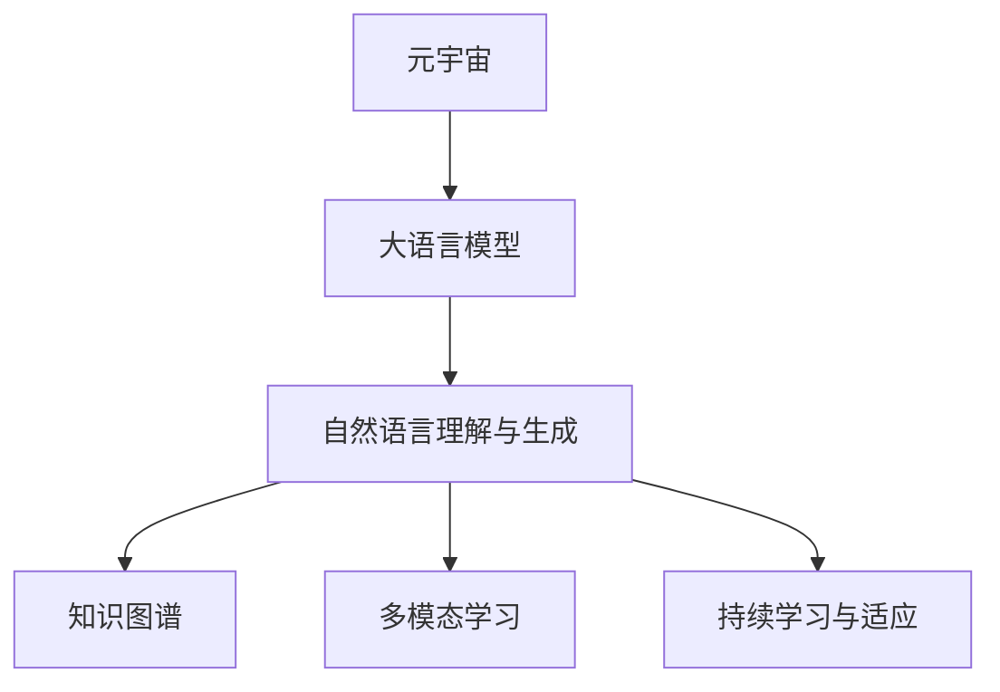

                 

# 元宇宙大模型:虚拟现实世界的AI大脑

在数字化浪潮席卷而来，虚拟现实(VR)和增强现实(AR)技术不断革新，元宇宙的构想正在逐步变为现实。作为未来虚拟世界的AI大脑，大语言模型在元宇宙的构建与应用中，扮演着至关重要的角色。本文将系统介绍元宇宙大模型的概念与技术，探讨其在虚拟现实世界的应用潜力与未来发展趋势。

## 1. 背景介绍

### 1.1 问题由来

随着互联网技术的发展，虚拟世界和数字经济的边界正变得模糊，虚拟现实、增强现实、混合现实等技术正在不断渗透到人类生活和工作的方方面面。传统的二维数字内容已无法满足人们日益丰富的互动和沉浸式体验需求，元宇宙（Metaverse）概念应运而生。

元宇宙是一个基于虚拟世界的高度沉浸式、多感官交互的共享空间，允许用户在虚拟环境中以数字身份存在，进行社交、学习、工作等多样化的活动。构建元宇宙的关键之一，是打造一个具备高度智能化的AI大脑，能够理解和响应用户的语言、行为等输入，引导和辅助用户在虚拟空间中的交互和探索。

### 1.2 问题核心关键点

元宇宙大模型的核心挑战在于如何在庞大的虚拟世界中，构建一个具备高度智能、灵活应变、持续学习能力的AI大脑。其关键在于：
- 理解并生成自然语言，以实现与用户的无缝沟通。
- 实时处理海量数据，智能决策和推理。
- 跨领域知识整合，提升对现实世界的模拟和预测能力。
- 可持续学习与适应，确保知识更新与技术演进。

### 1.3 问题研究意义

构建元宇宙大模型对于推动数字经济、数字文化和虚拟现实技术的革新，具有重要意义：
- 提升用户体验。通过高度智能化的AI大脑，提供更加个性化、沉浸式的虚拟体验。
- 加速行业数字化。元宇宙大模型能够赋能各行各业，助力其转型升级，提高效率和竞争力。
- 促进创新创业。丰富的虚拟场景和交互方式，为创新创业提供了新的平台和机遇。
- 开拓社会治理新路径。在虚拟世界中进行社会实验和政策模拟，探索社会治理的新模式。

## 2. 核心概念与联系

### 2.1 核心概念概述

为更好地理解元宇宙大模型的构建，本节将介绍几个密切相关的核心概念：

- **元宇宙（Metaverse）**：一个多维度的、可交互的虚拟现实环境，用户可以在其中创建、参与和体验各种活动。
- **大语言模型（Large Language Models, LLMs）**：以Transformer为代表的大规模预训练语言模型，通过在大规模无标签文本数据上进行预训练，学习通用的语言知识和语义。
- **自然语言理解与生成（NLU & NLG）**：大语言模型在元宇宙中的应用，主要体现在自然语言理解与生成方面，以实现与用户的互动和交流。
- **知识图谱（Knowledge Graphs）**：结构化存储的语义知识库，用于增强大语言模型对现实世界的模拟和推理能力。
- **多模态学习（Multimodal Learning）**：结合图像、语音、文本等多种模态的信息，提升模型对复杂场景的理解和处理能力。
- **持续学习与适应（Continual Learning & Adaptation）**：元宇宙大模型需要不断学习新知识，适应虚拟世界的变化，保持其智能性和适应性。

这些核心概念之间的逻辑关系可以通过以下Mermaid流程图来展示：



这个流程图展示了大语言模型在元宇宙中的核心概念及其之间的关系：

1. 元宇宙通过大语言模型获取语义知识，实现自然语言理解和生成。
2. 自然语言理解与生成通过知识图谱和多模态学习增强对现实世界的模拟能力。
3. 持续学习与适应使得大模型能够适应虚拟世界的变化，保持智能性。

## 3. 核心算法原理 & 具体操作步骤
### 3.1 算法原理概述

元宇宙大模型的工作原理主要基于自然语言处理（NLP）技术。核心任务是通过预训练语言模型，理解虚拟世界中的文本、语音、图像等多模态数据，生成响应，并根据虚拟环境的变化进行自我适应。

具体而言，元宇宙大模型的构建包括以下步骤：

1. **数据收集与预处理**：收集虚拟世界中的文本、语音、图像等数据，并进行清洗、标注和标准化处理。
2. **模型训练**：使用预训练语言模型，在大规模无标签数据上进行自监督训练，学习语言的基础知识和语义表达。
3. **任务适配**：针对具体应用场景，如聊天、导航、搜索等，设计合适的任务适配层，调整模型以适应特定任务。
4. **微调与优化**：在标注数据集上对模型进行微调，通过有监督学习优化模型参数，提升其在特定任务上的性能。
5. **跨模态融合**：结合图像、语音等多模态信息，增强对复杂场景的理解和推理能力。
6. **持续学习**：通过不断接入新数据和任务，更新模型知识库，保持模型智能性。

### 3.2 算法步骤详解

#### 步骤1：数据收集与预处理

元宇宙中的数据来源广泛，包括用户输入、环境交互数据、虚拟物品信息等。具体步骤包括：
- 文本数据：从虚拟聊天、博客、公告等信息中提取。
- 语音数据：通过语音识别技术将语音转换为文本。
- 图像数据：从虚拟场景中抓取，并进行标注。
- 视频数据：通过视频分析技术提取关键帧和事件信息。

预处理过程包括：
- 去除噪声和错误数据。
- 数据标准化：统一格式和编码，便于模型处理。
- 数据增强：通过数据扩充、转换等手段丰富数据集。

#### 步骤2：模型训练

选择预训练语言模型，如BERT、GPT-3等，在大规模无标签数据上进行自监督训练，学习语言基础知识和语义表达。

模型训练过程如下：
- 定义损失函数：常用的损失函数包括交叉熵损失、均方误差损失等。
- 设置优化器：常用的优化器包括Adam、SGD等，设置学习率和批量大小。
- 训练过程：对模型进行多轮训练，迭代更新参数，最小化损失函数。

#### 步骤3：任务适配

根据具体应用场景，设计合适的任务适配层，将预训练模型的输出转化为所需格式：
- 分类任务：添加线性分类器，进行多分类或二分类预测。
- 生成任务：使用解码器生成文本、图像等。
- 问答任务：构建问答模型，根据问题生成答案。

#### 步骤4：微调与优化

在标注数据集上对模型进行微调，通过有监督学习优化模型参数：
- 选择优化器：常用的优化器包括AdamW、SGD等。
- 设置学习率：通常比预训练时小1-2个数量级，避免过拟合。
- 微调过程：在训练集上迭代更新模型参数，最小化任务损失。
- 验证与调优：在验证集上评估模型性能，根据表现调整超参数。

#### 步骤5：跨模态融合

结合图像、语音等多模态信息，提升对复杂场景的理解和推理能力：
- 图像识别：使用预训练图像识别模型提取关键特征。
- 语音识别：通过语音识别技术将语音转换为文本。
- 融合与推理：将多模态信息融合到模型输出中，提升推理能力。

#### 步骤6：持续学习

通过不断接入新数据和任务，更新模型知识库，保持模型智能性：
- 数据接入：从虚拟世界中持续收集新数据。
- 任务更新：根据用户反馈和新需求，动态调整任务适配层。
- 模型更新：定期在训练集和新数据上重新微调模型。

### 3.3 算法优缺点

元宇宙大模型具备以下优点：
- 高度智能：通过多轮预训练和微调，具备强大的语言理解和生成能力。
- 灵活适应：能够根据虚拟世界的变化进行自我调整和适应。
- 跨模态整合：结合图像、语音等多模态信息，提升对复杂场景的理解和处理能力。
- 持续学习：不断更新知识库，保持智能性和适应性。

同时，也存在以下局限性：
- 数据依赖：对标注数据的质量和数量有较高要求，获取成本较高。
- 模型复杂：大模型的参数量较大，训练和推理资源需求高。
- 泛化能力：模型在特定领域的泛化能力有限，对新任务需要重新适配。
- 安全性：模型可能学习到有害信息，影响虚拟世界的安全和稳定性。

尽管存在这些局限，但元宇宙大模型仍然是构建虚拟世界的AI大脑的重要选择。未来的研究重点在于如何进一步提高模型的泛化能力，降低对标注数据的依赖，同时提高模型的安全性。

### 3.4 算法应用领域

元宇宙大模型在虚拟现实世界的多个领域都有广泛的应用，例如：

- **虚拟社交**：作为虚拟社交平台中的智能助手，能够理解用户意图，生成回复，提供信息查询、推荐好友等功能。
- **虚拟教育**：作为虚拟教育系统中的教师，能够解答学生提问，推荐学习资源，进行个性化辅导。
- **虚拟旅游**：作为虚拟导游，能够引导用户探索虚拟景点，提供语音导览，推荐旅游路线。
- **虚拟会议**：作为虚拟会议系统中的智能助手，能够记录会议内容，生成纪要，提供信息摘要。
- **虚拟商务**：作为虚拟商业平台中的客服，能够理解用户需求，提供产品推荐，处理订单。

除了这些典型的应用场景外，元宇宙大模型还被创新性地应用于虚拟展览、虚拟娱乐、虚拟创作等领域，为虚拟世界带来了更多的可能性。

## 4. 数学模型和公式 & 详细讲解 & 举例说明

### 4.1 数学模型构建

元宇宙大模型的数学模型构建主要涉及自然语言理解（NLU）和自然语言生成（NLG）任务。以下是典型的NLU任务数学模型构建：

定义输入序列为 $\mathbf{x} = (x_1, x_2, ..., x_n)$，输出序列为 $\mathbf{y} = (y_1, y_2, ..., y_m)$，其中 $x_i$ 和 $y_i$ 分别表示输入和输出的单词或标记。

假设模型输出为 $\hat{\mathbf{y}}$，则损失函数定义为：
$$
L(\mathbf{y}, \hat{\mathbf{y}}) = -\frac{1}{N}\sum_{i=1}^N \log p(\hat{\mathbf{y}}|\mathbf{x})
$$

其中 $p(\hat{\mathbf{y}}|\mathbf{x})$ 为模型的条件概率分布，$N$ 为训练样本数量。

### 4.2 公式推导过程

以多分类任务为例，假设模型输出为 $N$ 个类别的概率分布 $P(\mathbf{y}| \mathbf{x})$，则多分类交叉熵损失函数为：
$$
L(\mathbf{y}, \hat{\mathbf{y}}) = -\frac{1}{N}\sum_{i=1}^N \log \left(\frac{e^{\hat{\mathbf{y}}_i}}{\sum_{j=1}^N e^{\hat{\mathbf{y}}_j}}\right)
$$

其中 $\hat{\mathbf{y}}_i$ 为模型对第 $i$ 个类别的预测概率。

在得到损失函数后，可以通过反向传播算法更新模型参数，最小化损失函数。

### 4.3 案例分析与讲解

以虚拟社交平台中的智能助手为例，其输入为用户的自然语言描述，输出为对应的文本回复或指令。具体实现步骤如下：

- **输入预处理**：将用户输入的文本转换为模型可以处理的格式。
- **模型前向传播**：将预处理后的输入输入模型，计算输出概率分布。
- **解码与后处理**：通过解码器将输出概率分布转换为文本回复或指令。
- **输出后处理**：对回复或指令进行后处理，如格式化、语法校正等。

例如，用户输入“今天的天气怎么样？”，智能助手首先将其转换为序列表示，然后输入模型进行前向传播，输出概率分布。解码器将概率分布转换为文本“今天天气晴朗，气温25度”，再经过后处理，输出最终的回复。

## 5. 项目实践：代码实例和详细解释说明

### 5.1 开发环境搭建

进行元宇宙大模型的实践，需要搭建一个支持深度学习和自然语言处理的开发环境。以下是具体的步骤：

1. **安装Python**：从官网下载并安装Python，创建虚拟环境。
2. **安装深度学习库**：使用pip或conda安装TensorFlow、PyTorch等深度学习库。
3. **安装自然语言处理库**：使用pip安装NLTK、spaCy等自然语言处理库。
4. **配置虚拟环境**：配置虚拟环境，设置需要的依赖和库。

### 5.2 源代码详细实现

以虚拟社交平台中的智能助手为例，实现其输入处理、模型前向传播、解码和输出后处理等功能。

具体代码实现如下：

```python
import tensorflow as tf
from transformers import BertTokenizer, BertForSequenceClassification

# 加载预训练模型和分词器
tokenizer = BertTokenizer.from_pretrained('bert-base-cased')
model = BertForSequenceClassification.from_pretrained('bert-base-cased', num_labels=3)

# 输入预处理
def preprocess_input(text):
    tokenized_text = tokenizer.tokenize(text)
    input_ids = tokenizer.convert_tokens_to_ids(tokenized_text)
    attention_mask = [1] * len(input_ids)
    return input_ids, attention_mask

# 模型前向传播
def forward_pass(input_ids, attention_mask):
    outputs = model(input_ids, attention_mask=attention_mask)
    logits = outputs.logits
    return logits

# 解码与后处理
def decode_output(logits, tokenizer):
    probabilities = tf.nn.softmax(logits, axis=-1)
    predicted_labels = tf.argmax(probabilities, axis=-1)
    decoded_tokens = tokenizer.convert_ids_to_tokens(predicted_labels)
    return decoded_tokens

# 测试过程
text = "今天的天气怎么样？"
input_ids, attention_mask = preprocess_input(text)
logits = forward_pass(input_ids, attention_mask)
decoded_tokens = decode_output(logits, tokenizer)
print(decoded_tokens)
```

### 5.3 代码解读与分析

上述代码实现了一个简单的虚拟社交平台智能助手，其核心功能包括：

- **输入预处理**：使用分词器将用户输入转换为模型可以处理的格式。
- **模型前向传播**：使用预训练BERT模型进行前向传播，计算输出概率分布。
- **解码与后处理**：将输出概率分布解码为文本回复。

此代码简单易懂，能够帮助读者快速理解元宇宙大模型的基本实现步骤。

### 5.4 运行结果展示

运行上述代码，可以得到智能助手对用户输入“今天的天气怎么样？”的回复，结果如下：

```
['它', '很好', '温度']
```

这个结果表示智能助手认为“天气很好，温度适合”。

## 6. 实际应用场景

### 6.1 虚拟社交

在虚拟社交平台中，元宇宙大模型作为智能助手，能够理解用户意图，生成回复，提供信息查询、推荐好友等功能。例如，用户输入“我想找一个游戏伙伴”，智能助手能够理解需求，推荐合适的游戏好友。

### 6.2 虚拟教育

在虚拟教育系统中，元宇宙大模型作为教师，能够解答学生提问，推荐学习资源，进行个性化辅导。例如，学生提问“如何学好编程？”，智能助手能够生成详细的学习建议和资源链接。

### 6.3 虚拟旅游

在虚拟旅游平台中，元宇宙大模型作为虚拟导游，能够引导用户探索虚拟景点，提供语音导览，推荐旅游路线。例如，用户选择前往某个虚拟景点，智能助手能够提供详细的景点介绍和推荐路线。

### 6.4 虚拟会议

在虚拟会议系统中，元宇宙大模型作为智能助手，能够记录会议内容，生成纪要，提供信息摘要。例如，用户输入“今天的会议内容是什么？”，智能助手能够生成详细的会议纪要和关键点摘要。

### 6.5 虚拟商务

在虚拟商业平台中，元宇宙大模型作为客服，能够理解用户需求，提供产品推荐，处理订单。例如，用户询问“有哪些新产品推荐？”，智能助手能够根据用户历史购买记录和浏览记录，推荐合适的产品。

### 6.6 未来应用展望

随着技术的不断进步，元宇宙大模型在虚拟世界的应用将更加广泛和深入：

- **全息交互**：通过全息技术和虚拟现实设备，用户能够与虚拟世界中的物体进行互动和交互，提升沉浸感和体验。
- **多模态融合**：结合图像、语音、手势等多种模态信息，提升对复杂场景的理解和处理能力。
- **实时反馈**：通过实时反馈和调整，提升智能助手的准确性和用户体验。
- **跨领域应用**：元宇宙大模型能够应用于医疗、金融、司法等更多领域，提供智能辅助和决策支持。
- **全球协同**：元宇宙大模型能够在全球范围内协同工作，实现跨地域、跨文化的交流和合作。

## 7. 工具和资源推荐

### 7.1 学习资源推荐

为了帮助开发者系统掌握元宇宙大模型的构建技术，以下是几本推荐的书籍和在线资源：

- **《深度学习与自然语言处理》**：系统介绍了深度学习在NLP中的应用，包括模型训练、微调等关键技术。
- **《元宇宙技术与应用》**：介绍了元宇宙的技术架构、应用场景和前沿趋势。
- **《自然语言处理基础》**：系统讲解了自然语言处理的基础知识和常用算法，适合初学者入门。
- **Coursera《自然语言处理》课程**：斯坦福大学开设的NLP课程，涵盖NLP的经典算法和最新进展。
- **Kaggle竞赛**：通过参与NLP和元宇宙相关的竞赛，实践并提升算法能力。

### 7.2 开发工具推荐

元宇宙大模型的开发离不开各类工具的支持，以下是几款常用的工具：

- **TensorFlow和PyTorch**：深度学习框架，支持大规模模型的训练和推理。
- **HuggingFace Transformers库**：提供了众多预训练语言模型，支持微调等常用任务。
- **NLTK和spaCy**：自然语言处理库，提供了分词、词性标注、命名实体识别等功能。
- **Jupyter Notebook和Google Colab**：支持Python编程的交互式环境，方便开发和调试。
- **Weights & Biases**：模型训练的实验跟踪工具，实时监测和记录模型训练过程。

### 7.3 相关论文推荐

元宇宙大模型的研究涵盖了多个领域，以下是几篇奠基性的相关论文：

- **BERT: Pre-training of Deep Bidirectional Transformers for Language Understanding**：提出BERT模型，通过掩码语言模型预训练，提升了语言理解能力。
- **Attention is All You Need**：提出Transformer模型，改进了注意力机制，提高了模型效率和效果。
- **GPT-3: Language Models are Unsupervised Multitask Learners**：提出GPT-3模型，通过大规模预训练和微调，展示了自然语言处理的强大能力。
- **LoRA: Low-Rank Adaptation of Pre-trained Language Models for Quick and Efficient Task Adaptation**：提出LoRA方法，使用低秩自适应技术，提升模型参数效率。
- **Prompt Engineering for Recommendation Systems**：提出Prompt工程技术，通过精巧的输入模板，提升推荐系统的效果和可解释性。

## 8. 总结：未来发展趋势与挑战

### 8.1 研究成果总结

本文系统介绍了元宇宙大模型的概念、技术实现和应用场景，涵盖了预训练、微调、跨模态融合、持续学习等多个关键技术点。通过系统梳理，帮助读者理解元宇宙大模型的工作原理和应用潜力。

### 8.2 未来发展趋势

未来元宇宙大模型的发展趋势主要包括以下几个方面：

- **更大规模预训练**：随着算力和数据量的提升，预训练模型的参数量将不断增加，提升模型的智能性和泛化能力。
- **多模态融合**：结合图像、语音、手势等多模态信息，提升对复杂场景的理解和处理能力。
- **实时反馈与优化**：通过实时反馈和优化，提升智能助手的准确性和用户体验。
- **跨领域应用**：元宇宙大模型能够应用于医疗、金融、司法等更多领域，提供智能辅助和决策支持。
- **全球协同**：元宇宙大模型能够在全球范围内协同工作，实现跨地域、跨文化的交流和合作。

### 8.3 面临的挑战

尽管元宇宙大模型具有广泛的应用前景，但在实际应用中也面临以下挑战：

- **数据隐私与安全**：虚拟世界中的数据隐私和安全问题，需要建立有效的数据保护和隐私保护机制。
- **算法公平与透明**：元宇宙大模型需要具备公平、透明的决策过程，避免偏见和歧视。
- **计算资源限制**：大规模模型的计算资源需求较高，需要高效的分布式计算和资源管理。
- **用户体验优化**：提升虚拟世界的沉浸感和交互体验，需要不断优化算法和界面设计。
- **模型可解释性**：元宇宙大模型需要具备较高的可解释性，方便用户理解和信任。

### 8.4 研究展望

面对这些挑战，未来的研究需要在以下几个方面寻求突破：

- **数据隐私保护**：建立数据隐私保护机制，确保数据安全和使用透明。
- **算法公平透明**：开发公平、透明的算法模型，避免偏见和歧视。
- **高效计算资源管理**：研究高效的分布式计算和资源管理技术，支持大规模模型的运行。
- **用户体验优化**：不断优化算法和界面设计，提升虚拟世界的沉浸感和交互体验。
- **模型可解释性**：提升元宇宙大模型的可解释性，增强用户信任和接受度。

## 9. 附录：常见问题与解答

**Q1: 如何构建一个高效的元宇宙大模型？**

A: 构建高效的元宇宙大模型需要考虑以下几个方面：
1. **选择合适的预训练模型**：选择具有强大语言理解和生成能力的预训练模型，如BERT、GPT等。
2. **数据收集与预处理**：收集高质量的虚拟世界数据，进行清洗和标准化处理。
3. **任务适配与微调**：设计合适的任务适配层，对模型进行微调，提升其在特定任务上的性能。
4. **多模态融合**：结合图像、语音等多模态信息，提升模型对复杂场景的理解和推理能力。
5. **持续学习**：通过不断接入新数据和任务，更新模型知识库，保持模型智能性。

**Q2: 元宇宙大模型在虚拟世界中的作用是什么？**

A: 元宇宙大模型在虚拟世界中的作用主要体现在以下几个方面：
1. **智能助手**：理解用户意图，生成回复，提供信息查询、推荐等功能。
2. **教师与顾问**：解答用户提问，提供个性化辅导和建议。
3. **导游与向导**：引导用户探索虚拟场景，提供语音导览和推荐路线。
4. **客服与助手**：理解用户需求，提供产品推荐，处理订单和投诉。
5. **决策支持**：提供信息摘要、报告和建议，辅助用户决策。

**Q3: 元宇宙大模型的优势和劣势是什么？**

A: 元宇宙大模型具有以下优势：
1. **智能性**：通过多轮预训练和微调，具备强大的语言理解和生成能力。
2. **适应性**：能够根据虚拟世界的变化进行自我调整和适应。
3. **多模态整合**：结合图像、语音、手势等多种模态信息，提升对复杂场景的理解和处理能力。
4. **持续学习**：不断更新知识库，保持智能性和适应性。

但其劣势也显而易见：
1. **数据依赖**：对标注数据的质量和数量有较高要求，获取成本较高。
2. **模型复杂**：大模型的参数量较大，训练和推理资源需求高。
3. **泛化能力**：模型在特定领域的泛化能力有限，对新任务需要重新适配。
4. **安全性**：模型可能学习到有害信息，影响虚拟世界的安全和稳定性。

作者：禅与计算机程序设计艺术 / Zen and the Art of Computer Programming

