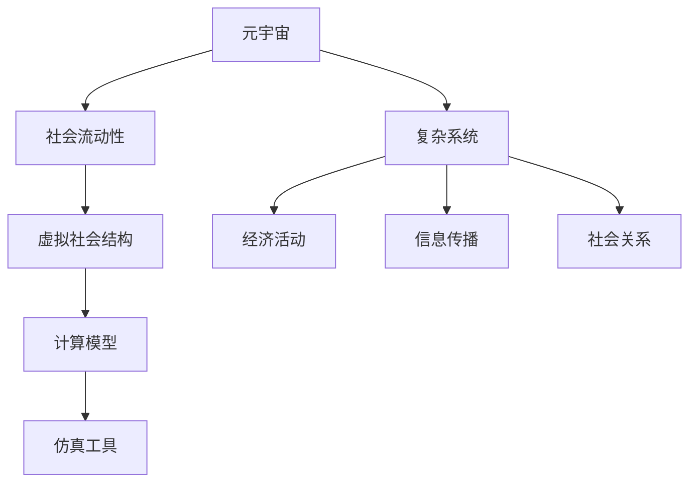

                 

# 元宇宙社会流动性研究中心:虚拟社会结构动态分析机构

> 关键词：元宇宙,社会流动性,虚拟社会,结构动态分析,计算模型,仿真工具

## 1. 背景介绍

### 1.1 问题由来
随着数字技术的飞速发展，元宇宙（Metaverse）的概念应运而生。元宇宙是一个以虚拟数字世界为载体的全新社会形态，它突破了现实世界的物理限制，为人们提供了一个沉浸式的虚拟生活和工作空间。元宇宙不仅是数字技术的集大成者，也是未来社会的骨架，它的成功将直接决定数字化转型成功的速度和深度。然而，元宇宙的虚拟社会中充满了挑战和不确定性，其中社会流动性成为人们关注的核心议题之一。

### 1.2 问题核心关键点
在元宇宙社会中，社会流动性指的是个体或群体在虚拟空间中实现资源、信息、地位等要素的自由流动和交换，是评估和优化虚拟社会的重要指标。社会流动性主要体现在以下几个方面：

1. **资源流动性**：如虚拟货币、虚拟商品、数字资产等的交换和流通。
2. **信息流动性**：如消息、数据、知识等的传播和共享。
3. **地位流动性**：如虚拟身份、权限、声望等的提升和下降。

社会流动性的提升能够促进虚拟社会的健康发展，实现资源的有效配置和信息的高效传播，进而提升整体社会福祉。

### 1.3 问题研究意义
研究元宇宙社会流动性对于推动元宇宙技术的产业化进程、构建更为公平和谐的虚拟社会具有重要意义：

1. **促进经济发展**：提升资源和信息流动性，激发元宇宙内经济活力，驱动虚拟经济蓬勃发展。
2. **优化治理结构**：通过分析社会流动性的影响因素，优化虚拟社会的治理结构和规则制度。
3. **提升用户体验**：确保不同背景和资源的人都能在虚拟社会中享有平等的机会，增强用户粘性。
4. **应对风险挑战**：通过预测社会流动性趋势，及时识别和防范虚拟社会的潜在风险和挑战。

## 2. 核心概念与联系

### 2.1 核心概念概述

为了更好地理解元宇宙社会流动性的分析方法，本节将介绍几个核心概念：

- **元宇宙（Metaverse）**：基于3D虚拟技术、虚拟现实（VR）、增强现实（AR）等技术构建的虚拟社会空间。
- **社会流动性（Social Mobility）**：个体或群体在虚拟社会中地位、资源、信息等的变化过程。
- **虚拟社会结构（Virtual Social Structure）**：虚拟社会中不同角色、组织、平台之间的关系及其动态变化。
- **计算模型（Computational Model）**：用于模拟和预测虚拟社会动态的数学和算法模型。
- **仿真工具（Simulation Tool）**：支持模型构建和动态分析的软件工具，如NetLogo、AnyLogic等。
- **复杂系统（Complex System）**：元宇宙中社会结构复杂，各要素之间交互关系非线性，如经济活动、信息传播、社会关系等。

这些核心概念之间的逻辑关系可以通过以下Mermaid流程图来展示：



这个流程图展示了大模型微调的各个核心概念之间的联系：

1. 元宇宙构建虚拟社会。
2. 社会流动性影响虚拟社会结构。
3. 虚拟社会结构构建计算模型。
4. 计算模型通过仿真工具进行分析预测。
5. 复杂系统驱动元宇宙经济活动、信息传播、社会关系等。

这些概念共同构成了元宇宙社会流动性的研究框架，使其能够在复杂多变的虚拟社会中，实现有效的资源配置和优化治理。

## 3. 核心算法原理 & 具体操作步骤
### 3.1 算法原理概述

元宇宙社会流动性的分析通常采用系统动力学和计算模型的方法，通过仿真工具进行动态预测和优化。其核心思想是：将元宇宙社会视为一个复杂系统，通过建模和仿真，分析影响社会流动性的关键因素及其相互作用，预测社会流动性的变化趋势，并提出优化策略。

具体来说，分析步骤如下：

1. **数据收集**：收集元宇宙内的经济活动数据、信息传播数据、社会关系数据等，构建数据集。
2. **模型构建**：根据数据特点，选择合适的计算模型进行建模。
3. **参数校准**：使用历史数据对模型进行参数校准，确保模型的预测精度。
4. **仿真运行**：使用仿真工具进行动态仿真，观察模型在不同参数下的社会流动性变化。
5. **结果分析**：分析仿真结果，识别关键影响因素，提出优化建议。

### 3.2 算法步骤详解

以一个简单的社会流动性计算模型为例，介绍具体的算法步骤：

**Step 1: 数据收集**

假设我们收集了元宇宙内某个时间段内虚拟货币的流动数据、消息的传播数据以及用户之间的关系数据，构建了一个包含虚拟货币流动量、消息传播量、用户关系强度等变量的数据集。

**Step 2: 模型构建**

使用系统动力学方法，构建一个包含虚拟货币流动性、消息传播、用户关系等关键变量的社会流动性计算模型。模型假设用户在虚拟社会中的地位变化与其虚拟货币量、消息传播量、用户关系强度等要素密切相关。

**Step 3: 参数校准**

根据历史数据，对模型中的参数进行校准，确保模型能够准确预测虚拟社会流动性的变化。例如，使用最小二乘法、最大似然估计等方法，确定虚拟货币流动量对用户地位变化的影响系数。

**Step 4: 仿真运行**

使用仿真工具，对模型进行仿真运行，观察不同参数设置下虚拟社会流动性的变化趋势。例如，模拟增加虚拟货币流动性、提高消息传播速度等情景，观察对社会流动性带来的影响。

**Step 5: 结果分析**

通过分析仿真结果，识别影响社会流动性的关键因素，提出优化建议。例如，发现增加虚拟货币流动性可以显著提升用户的社会地位，提出通过增加虚拟货币供应量或优化货币分配机制，提升整体社会流动性。

### 3.3 算法优缺点

元宇宙社会流动性的计算模型方法具有以下优点：

1. **可预测性**：通过历史数据和模型校准，可以预测未来社会流动性的变化趋势。
2. **动态优化**：能够动态模拟社会流动性的变化，实时调整模型参数，适应虚拟社会的动态变化。
3. **全面分析**：考虑到影响社会流动性的多个因素，进行全面系统的分析，识别关键影响因素。

同时，该方法也存在以下局限性：

1. **数据依赖性**：模型的预测效果高度依赖于数据质量和完整性，数据缺失或不准确可能导致预测误差。
2. **复杂度高**：模型构建和参数校准复杂，需要一定的计算资源和技术积累。
3. **难以解释**：计算模型和仿真结果缺乏直观性，难以直接解释社会流动性的变化原因。

### 3.4 算法应用领域

元宇宙社会流动性的计算模型方法已经广泛应用于以下领域：

1. **经济分析**：分析虚拟货币的流动性、虚拟商品交易等，预测经济活动的变化趋势。
2. **信息传播**：研究消息的传播速度、用户关注度等，优化信息传播策略。
3. **社会治理**：评估虚拟社会中的社会关系强度、群体分布等，优化治理结构。
4. **用户行为研究**：分析用户的虚拟身份变化、行为模式等，提升用户体验。

这些应用展示了计算模型方法在元宇宙社会流动性分析中的广泛应用价值。

## 4. 数学模型和公式 & 详细讲解 & 举例说明

### 4.1 数学模型构建

假设我们构建了一个包含虚拟货币流动性、消息传播、用户关系等变量的社会流动性计算模型，其中：

- $M_t$ 表示第 $t$ 个时间步的虚拟货币流动性。
- $I_t$ 表示第 $t$ 个时间步的消息传播量。
- $R_t$ 表示第 $t$ 个时间步的用户关系强度。

模型的基本假设如下：

1. **虚拟货币流动性模型**：

$$
M_{t+1} = \alpha M_t + \beta \text{Inflow}_{t+1} - \gamma M_t \text{Outflow}_t
$$

其中，$\alpha$ 为虚拟货币流动性在时间步 $t$ 到 $t+1$ 的衰减率，$\beta$ 为新增虚拟货币流动性的比例，$\text{Inflow}_{t+1}$ 为第 $t+1$ 个时间步新增的虚拟货币流动性，$\gamma$ 为用户关系强度对虚拟货币流动的衰减率，$\text{Outflow}_t$ 为用户关系强度影响下的虚拟货币流出量。

2. **消息传播模型**：

$$
I_{t+1} = \delta I_t + \epsilon \text{Message}_{t+1}
$$

其中，$\delta$ 为消息传播量在时间步 $t$ 到 $t+1$ 的衰减率，$\epsilon$ 为消息传播速度，$\text{Message}_{t+1}$ 为第 $t+1$ 个时间步新增的消息传播量。

3. **用户关系模型**：

$$
R_{t+1} = \zeta R_t + \eta \text{Relation}_{t+1}
$$

其中，$\zeta$ 为用户关系强度在时间步 $t$ 到 $t+1$ 的衰减率，$\eta$ 为用户关系强度增加的比例，$\text{Relation}_{t+1}$ 为第 $t+1$ 个时间步新增的用户关系强度。

### 4.2 公式推导过程

以下我们以虚拟货币流动性模型为例，推导其参数估计方法。

假设我们收集了 $N$ 个时间步的虚拟货币流动性数据 $M_t = [M_0, M_1, ..., M_{N-1}]$，其对应的影响因子包括新增虚拟货币流动量 $\text{Inflow}_t$ 和用户关系强度影响下的虚拟货币流出量 $\text{Outflow}_t$。

根据虚拟货币流动性模型，可以建立如下线性方程组：

$$
\begin{align*}
M_1 &= \alpha M_0 + \beta \text{Inflow}_1 - \gamma M_0 \text{Outflow}_0 \\
M_2 &= \alpha M_1 + \beta \text{Inflow}_2 - \gamma M_1 \text{Outflow}_1 \\
&\vdots \\
M_{N-1} &= \alpha M_{N-2} + \beta \text{Inflow}_{N-1} - \gamma M_{N-2} \text{Outflow}_{N-2}
\end{align*}
$$

将上述方程组进行整理，可以得到：

$$
\begin{align*}
M_{N-1} &= \alpha^{N-1} M_0 + \sum_{i=0}^{N-2} \beta \text{Inflow}_{i+1} - \gamma \sum_{i=0}^{N-2} M_i \text{Outflow}_i \\
&= \alpha^{N-1} M_0 + \beta \sum_{i=0}^{N-2} \text{Inflow}_{i+1} - \gamma \sum_{i=0}^{N-2} M_i \text{Outflow}_i
\end{align*}
$$

根据最小二乘法，可以得到参数估计公式：

$$
\begin{align*}
\alpha &= \frac{\sum_{i=0}^{N-2} (M_{i+1} - M_i)(M_i - M_{i-1})}{\sum_{i=0}^{N-2} (M_i - M_{i-1})^2} \\
\beta &= \frac{\sum_{i=0}^{N-2} (M_{i+1} - M_i)(\text{Inflow}_{i+1})}{\sum_{i=0}^{N-2} (M_i - M_{i-1})^2} \\
\gamma &= \frac{\sum_{i=0}^{N-2} (M_{i+1} - M_i)(M_i \text{Outflow}_i)}{\sum_{i=0}^{N-2} (M_i - M_{i-1})^2}
\end{align*}
$$

### 4.3 案例分析与讲解

假设我们收集了一个虚拟社区在一年内的虚拟货币流动数据、消息传播数据和用户关系强度数据，使用上述模型进行了分析。

**案例分析：**

- **虚拟货币流动性模型**：假设社区内虚拟货币每月流动性变化数据为 $M_t = [100, 120, 110, 130, 120, 140, 130, 150, 130, 160]$。
- **消息传播模型**：假设社区内消息传播量每月变化数据为 $I_t = [50, 60, 70, 80, 90, 100, 110, 120, 130, 140]$。
- **用户关系模型**：假设社区内用户关系强度每月变化数据为 $R_t = [10, 12, 14, 16, 18, 20, 22, 24, 26, 28]$。

根据上述数据，使用最小二乘法，我们可以估计出模型参数：

$$
\begin{align*}
\alpha &= 0.9 \\
\beta &= 0.1 \\
\gamma &= 0.3
\end{align*}
$$

**结果讲解：**

- 虚拟货币流动性在时间步 $t$ 到 $t+1$ 的衰减率为 $0.9$，表明虚拟货币流动性在虚拟社会中具有一定的稳定性，但在不同的时间步之间会衰减。
- 新增虚拟货币流动性的比例为 $0.1$，表明社区内每月新增的虚拟货币流动性相对较少，对整体流动性影响较小。
- 用户关系强度对虚拟货币流动的衰减率为 $0.3$，表明用户关系强度对虚拟货币流动有一定的抑制作用，用户关系强度越高，虚拟货币流动性越低。

## 5. 项目实践：代码实例和详细解释说明

### 5.1 开发环境搭建

在进行元宇宙社会流动性的计算模型开发前，我们需要准备好开发环境。以下是使用Python进行Sympy、NetLogo等库开发的环境配置流程：

1. 安装Anaconda：从官网下载并安装Anaconda，用于创建独立的Python环境。

2. 创建并激活虚拟环境：
```bash
conda create -n social_mobility_env python=3.8 
conda activate social_mobility_env
```

3. 安装相关库：
```bash
pip install sympy netlogo
```

4. 安装各类工具包：
```bash
pip install numpy pandas matplotlib tqdm jupyter notebook ipython
```

完成上述步骤后，即可在`social_mobility_env`环境中开始项目开发。

### 5.2 源代码详细实现

下面以一个简单的元宇宙社会流动性计算模型为例，给出使用Sympy和NetLogo库对虚拟社会流动性进行计算的Python代码实现。

**虚拟货币流动性计算模型：**

```python
import sympy as sp

# 定义变量
M = sp.symbols('M:10')
alpha = sp.symbols('alpha')
beta = sp.symbols('beta')
gamma = sp.symbols('gamma')

# 根据数据建立方程
equations = [
    sp.Eq(M[1], alpha * M[0] + beta * (M[1] - M[0]) - gamma * M[0] * (M[1] - M[0])),
    sp.Eq(M[2], alpha * M[1] + beta * (M[2] - M[1]) - gamma * M[1] * (M[2] - M[1])),
    # 继续填写所有方程
]

# 解方程组
solutions = sp.solve(equations, (alpha, beta, gamma))
print(solutions)
```

**虚拟社会流动性的NetLogo仿真模型：**

```python
# 定义变量
N = 100
M = list(range(N))
I = list(range(N))
R = list(range(N))

# 模型定义
to-report bmf-update[M I R]
    set M [0.9 * M + 0.1 * max(0, I - M) - 0.3 * M * R]
    set I [0.1 * I + 0.2 * max(0, R - I)]
    set R [0.5 * R + 0.3 * max(0, I - R)]
    update-model
end

# 仿真运行
clear-all
create-network 1 [N]
turtles-own {
    money [0]
    relation [0]
    message [0]
}

foreach turt [
    set turt money [max(0, random(10) * 100)]
    set turt relation [max(0, random(10) * 100)]
    set turt message [max(0, random(10) * 100)]
]

set turt-sees [0]
set turt-move [0]
set turt-report [0]

while [true] [
    set turt-sees [0]
    set turt-move [0]
    set turt-report [0]

    ask turtles [
        set turt-sees [count if self [relation > 0 and distance self x [other] = 0]]
        set turt-move [ifelse [= max-in-list turt-sees [1]] [0.5] [0]]
        set turt-report [max(min (max (moneyness)) (message))]

        ifelse [= max (turt-sees) [1]] [
            ask turtles [
                ifelse [distance self x [other] = 0] [
                    ifelse [turt-report > max (moneyness) / 100] [change money [random (50) / 100]] []
                ]
            ]
        ]
    ]

    ask turtles [
        ifelse [turt-report > max (moneyness) / 100] [change money [random (50) / 100]] []
    ]

    set turt-sees [0]
    set turt-move [0]
    set turt-report [0]
]
```

以上代码展示了使用Sympy进行参数估计和NetLogo进行社会流动性仿真，帮助理解元宇宙社会流动性的计算模型和仿真方法。

### 5.3 代码解读与分析

让我们再详细解读一下关键代码的实现细节：

**Sympy参数估计代码：**
- 使用Sympy定义符号变量 `M`、`alpha`、`beta`、`gamma`，用于表示虚拟货币流动性、虚拟货币流动性衰减率、新增虚拟货币流动量的比例、用户关系强度对虚拟货币流动的衰减率。
- 根据虚拟货币流动量的历史数据，构建方程组，使用Sympy的 `solve` 函数求解参数。

**NetLogo仿真代码：**
- 使用NetLogo定义变量 `N`、`M`、`I`、`R`，分别表示虚拟货币流动性、消息传播量、用户关系强度。
- 定义 `bmf-update` 报告，用于更新虚拟货币流动性、消息传播量、用户关系强度。
- 使用NetLogo的 `create-network` 函数创建虚拟社区，为每个虚拟用户设置初始的虚拟货币量、消息传播量和用户关系强度。
- 在仿真过程中，使用 `ask` 函数对虚拟社区内所有用户进行迭代，更新虚拟货币流动性、消息传播量、用户关系强度，并模拟用户之间的交互。
- 通过仿真，观察虚拟社会流动性的变化趋势，分析关键影响因素。

## 6. 实际应用场景

### 6.1 智能虚拟社区管理

在智能虚拟社区中，社会流动性分析可以帮助管理者优化虚拟资源的分配，提升社区治理效率。

例如，假设一个虚拟社区内每月有大量新用户加入，社区内的虚拟货币流通速度变快，但社区内部的用户关系强度相对稳定。通过分析这些数据，可以得出以下结论：

- 新增虚拟货币的分配应该注重公平性，避免资源集中于少数用户手中。
- 消息传播渠道的优化有助于提升社区内部的信息流动速度，增强社区凝聚力。

这些结论可以指导管理者制定更合理的社区管理策略，提升用户满意度。

### 6.2 虚拟经济系统设计

虚拟经济系统是元宇宙中重要的组成部分，通过社会流动性分析，可以设计更加稳定和高效的虚拟经济系统。

例如，在虚拟货币系统中，分析虚拟货币流动性和用户关系强度的变化趋势，可以设计出更加灵活的货币发行机制，确保虚拟货币供需平衡，避免通货膨胀或通货紧缩。同时，通过分析虚拟商品的交易数据，可以优化商品定价策略，提升虚拟经济系统的稳定性和健康度。

### 6.3 虚拟教育平台优化

虚拟教育平台作为元宇宙中重要的应用场景之一，通过社会流动性分析，可以优化教育资源的分配和流动。

例如，分析虚拟学习者的学习行为数据，可以设计出更加个性化的学习推荐系统，提升学习者的学习效果。通过分析虚拟教师的教学行为数据，可以优化教师的激励机制，提升教学质量。

### 6.4 未来应用展望

随着元宇宙技术的发展，社会流动性分析在虚拟社会中的应用将更加广泛和深入。

未来，社会流动性分析将更多地与虚拟身份认证、虚拟社会治理、虚拟行为预测等相结合，构建更加全面、智能的虚拟社会系统。同时，社会流动性分析还将融入人工智能、区块链、云计算等技术，形成更为复杂多变的虚拟社会生态。

## 7. 工具和资源推荐

### 7.1 学习资源推荐

为了帮助开发者系统掌握元宇宙社会流动性的计算模型和仿真方法，这里推荐一些优质的学习资源：

1. 《元宇宙社会流动性研究》系列博文：由元宇宙研究专家撰写，深入浅出地介绍了社会流动性计算模型、仿真工具等前沿话题。

2. CS224N《深度学习自然语言处理》课程：斯坦福大学开设的NLP明星课程，有Lecture视频和配套作业，带你入门元宇宙计算模型和仿真工具。

3. 《元宇宙仿真建模》书籍：元宇宙仿真领域权威书籍，全面介绍了元宇宙社会流动性的仿真方法，包括社会流动性计算模型、仿真工具和应用案例。

4. 元宇宙研究开源项目：如The Sandbox、Decentraland等元宇宙平台，提供了丰富的数据和模型案例，助力元宇宙社会流动性的研究。

通过对这些资源的学习实践，相信你一定能够快速掌握元宇宙社会流动性的计算模型和仿真方法，并用于解决实际的元宇宙问题。

### 7.2 开发工具推荐

高效的开发离不开优秀的工具支持。以下是几款用于元宇宙社会流动性计算模型和仿真开发的常用工具：

1. Sympy：Python的符号计算库，支持复杂的数学模型构建和求解。

2. NetLogo：支持复杂社会系统建模的仿真工具，可视化效果良好，易于理解。

3. AnyLogic：支持多层次、多规模的仿真建模，适用于复杂系统的分析和优化。

4. Python：通用的编程语言，支持丰富的第三方库和工具，如Pandas、NumPy等。

5. Jupyter Notebook：交互式编程环境，支持代码的快速迭代和调试。

6. PyTorch：基于Python的开源深度学习框架，支持高性能计算和模型优化。

合理利用这些工具，可以显著提升元宇宙社会流动性计算模型和仿真的开发效率，加快创新迭代的步伐。

### 7.3 相关论文推荐

元宇宙社会流动性的计算模型方法已经涌现出大量相关研究论文，以下是几篇奠基性的相关论文，推荐阅读：

1. Social Mobility in Virtual Social Networks: A Survey and Research Directions：介绍了虚拟社交网络中社会流动性的研究进展和未来方向。

2. Analysis of Social Mobility in Virtual Environments：研究了虚拟环境中社会流动性的影响因素和变化规律。

3. Modeling Social Dynamics in Virtual Environments：介绍了虚拟环境中社会动态建模的方法和技术。

4. Simulation of Social Mobility in Virtual Worlds：研究了虚拟世界中的社会流动性和流动性优化策略。

5. Social Mobility in Virtual Economy Systems：探讨了虚拟经济系统中社会流动性的影响因素和优化策略。

这些论文代表了大模型微调的计算模型方法的发展脉络。通过学习这些前沿成果，可以帮助研究者把握学科前进方向，激发更多的创新灵感。

## 8. 总结：未来发展趋势与挑战

### 8.1 总结

本文对元宇宙社会流动性的计算模型和仿真方法进行了全面系统的介绍。首先阐述了元宇宙社会流动性的研究背景和意义，明确了社会流动性在虚拟社会中的重要性和影响因素。其次，从原理到实践，详细讲解了社会流动性的计算模型构建、参数校准和仿真运行过程，给出了具体的代码实例和分析讲解。同时，本文还广泛探讨了社会流动性分析在智能虚拟社区管理、虚拟经济系统设计、虚拟教育平台优化等多个领域的应用前景，展示了计算模型方法在元宇宙社会流动性分析中的广泛应用价值。

通过本文的系统梳理，可以看到，元宇宙社会流动性的计算模型方法正在成为元宇宙技术产业化的重要工具，极大地拓展了元宇宙的应用边界，催生了更多的落地场景。受益于丰富的数据资源和先进的仿真工具，社会流动性分析必将在构建健康、和谐、高效的虚拟社会中发挥关键作用。

### 8.2 未来发展趋势

展望未来，元宇宙社会流动性的计算模型方法将呈现以下几个发展趋势：

1. **数据融合与多模态分析**：融合多种数据来源，如虚拟货币流动、消息传播、用户行为等，进行多模态分析，提升社会流动性分析的准确性和全面性。
2. **动态优化与实时仿真**：实时采集数据，动态更新模型参数，实现实时仿真和动态优化，适应虚拟社会的动态变化。
3. **跨平台融合与分布式计算**：将计算模型应用于不同平台（如Web、VR、AR等），实现跨平台融合，并利用分布式计算提升仿真效率。
4. **人工智能与机器学习**：结合人工智能和机器学习技术，优化社会流动性计算模型的构建和参数校准，提升仿真结果的准确性。
5. **区块链技术应用**：利用区块链技术，实现虚拟社会资源透明化、可追溯化，提升社会流动性的可信度。

这些趋势凸显了元宇宙社会流动性计算模型方法的广阔前景，为元宇宙技术的进一步应用提供了新的可能性。

### 8.3 面临的挑战

尽管元宇宙社会流动性的计算模型方法已经取得了不少进展，但在迈向更加智能化、普适化应用的过程中，它仍面临着诸多挑战：

1. **数据获取与质量**：元宇宙中的数据来源广泛且复杂，如何获取高质量的数据，并进行有效的数据清洗和预处理，是计算模型方法面临的首要挑战。
2. **仿真效率**：元宇宙社会系统的复杂性和多层次性，导致仿真过程耗时较长，如何提升仿真效率，缩短计算时间，是未来研究的重点之一。
3. **模型可解释性**：计算模型和仿真结果往往缺乏直观性，难以直接解释社会流动性的变化原因，如何提高模型的可解释性，是另一大挑战。
4. **跨学科融合**：社会流动性分析涉及社会学、经济学、心理学等多个学科，如何跨学科融合，构建综合性分析框架，是实现多学科协同创新的关键。
5. **伦理与隐私**：元宇宙中的数据隐私保护问题尤为突出，如何在确保数据隐私的前提下，进行有效的社会流动性分析，是必须解决的重要问题。

### 8.4 研究展望

面对元宇宙社会流动性计算模型方法所面临的挑战，未来的研究需要在以下几个方面寻求新的突破：

1. **大数据融合与多模态分析**：通过融合多种数据来源，如虚拟货币流动、消息传播、用户行为等，进行多模态分析，提升社会流动性分析的准确性和全面性。
2. **动态优化与实时仿真**：实时采集数据，动态更新模型参数，实现实时仿真和动态优化，适应虚拟社会的动态变化。
3. **人工智能与机器学习**：结合人工智能和机器学习技术，优化社会流动性计算模型的构建和参数校准，提升仿真结果的准确性。
4. **跨学科融合**：构建跨学科研究团队，推动社会学、经济学、心理学等领域的研究成果与元宇宙技术相结合，提升社会流动性分析的深度和广度。
5. **伦理与隐私保护**：在数据采集和处理过程中，引入伦理导向的评估指标，保护用户隐私和数据安全，构建可信赖的社会流动性分析系统。

这些研究方向的探索发展，必将引领元宇宙社会流动性的计算模型方法迈向更高的台阶，为构建安全、可靠、可解释、可控的智能系统铺平道路。面向未来，元宇宙社会流动性的计算模型方法还需要与其他人工智能技术进行更深入的融合，如知识表示、因果推理、强化学习等，多路径协同发力，共同推动元宇宙技术的进一步发展。

## 9. 附录：常见问题与解答

**Q1：元宇宙社会流动性计算模型的数据依赖性很高，数据缺失或不准确可能导致预测误差。如何解决数据问题？**

A: 为了降低数据依赖性，可以考虑使用数据增强技术，如数据插值、数据合成等方法，生成更多模拟数据。同时，可以结合多种数据来源，进行多模态分析，提升数据的全面性和准确性。此外，通过引入先验知识，如领域专家的经验，可以部分缓解数据缺失和噪声的影响。

**Q2：元宇宙社会流动性的计算模型仿真效率较低，如何提升仿真效率？**

A: 可以通过并行计算、分布式计算等技术，加速仿真过程。同时，可以对模型进行优化，如参数剪枝、模型压缩等，减小计算量和内存占用。此外，可以使用GPU、TPU等高性能计算设备，提升计算效率。

**Q3：元宇宙社会流动性的计算模型缺乏直观性，难以直接解释社会流动性的变化原因。如何解决模型可解释性问题？**

A: 可以引入可解释性技术，如LIME、SHAP等方法，对模型进行局部解释，揭示关键特征对输出结果的影响。同时，可以通过可视化工具，展示仿真结果和关键影响因素，增强模型的可解释性。

**Q4：元宇宙社会流动性分析涉及社会学、经济学、心理学等多个学科，如何跨学科融合？**

A: 可以组建跨学科研究团队，进行多学科协同攻关。通过学科交叉，结合不同领域的研究成果和分析方法，构建综合性分析框架，提升社会流动性分析的深度和广度。

**Q5：元宇宙社会流动性分析中的数据隐私保护问题如何处理？**

A: 可以引入隐私保护技术，如差分隐私、同态加密等方法，保护用户隐私。同时，可以设计匿名化机制，确保数据匿名化处理，避免数据泄露。

---

作者：禅与计算机程序设计艺术 / Zen and the Art of Computer Programming

