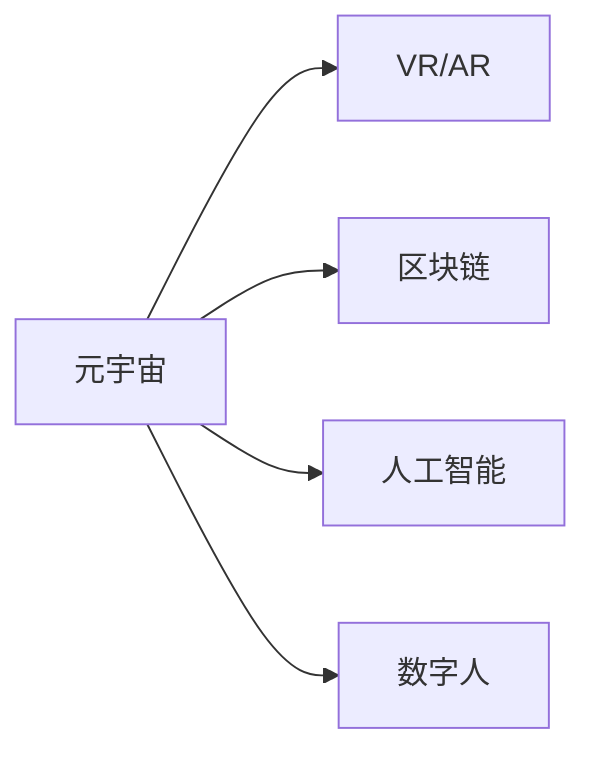

                 

# 元宇宙营销：数字化品牌建设的新阵地

## 1. 背景介绍

### 1.1 问题由来

随着数字化的加速，品牌建设正进入一个新的纪元。传统的线下品牌营销活动越来越难以为继，一方面实体店铺的成本越来越高，另一方面消费者的消费习惯也在发生变化，越来越青睐线上购物。在这种背景下，品牌如何在数字化时代站稳脚跟，成为每个品牌商的迫切需求。

### 1.2 问题核心关键点

元宇宙营销作为品牌数字化建设的新方向，通过构建虚拟空间，将品牌元素与数字化互动结合，给品牌建设带来革命性变化。主要体现在以下几个方面：

- **沉浸式体验**：通过虚拟现实(VR)、增强现实(AR)等技术，为消费者提供沉浸式的品牌体验。
- **互动性增强**：在元宇宙中，品牌与消费者可以实时互动，建立更紧密的联系。
- **数字化传播**：元宇宙可以无限复制，将品牌传播到全球各地，极大拓宽了品牌的传播范围。
- **动态可扩展性**：品牌可以根据自己的需求，动态地扩展和修改元宇宙空间，不断创新品牌体验。

### 1.3 问题研究意义

研究元宇宙营销的策略和方法，对于拓展品牌数字化传播的边界，增强品牌影响力，具有重要意义：

- 提升品牌竞争力。利用元宇宙的高互动性和沉浸式体验，提高品牌吸引力和忠诚度。
- 促进跨界融合。品牌可以在元宇宙中与多种形态的内容互动，促进跨界合作，打造多维品牌生态。
- 加速数字化转型。元宇宙营销让品牌通过数字化手段触及更多消费者，加速数字化转型进程。
- 构建未来新业态。元宇宙带来了全新的消费场景和交互方式，为品牌提供新的创新机会。

## 2. 核心概念与联系

### 2.1 核心概念概述

在讨论元宇宙营销之前，我们需要先了解几个核心概念：

- **元宇宙(Metaverse)**：一个通过虚拟现实技术构建的持久而全面的网络共生环境，用户在其中可以进行虚拟互动和体验。
- **虚拟现实(VR)**：通过虚拟现实头盔等设备，将用户置于一个由计算机生成的三维环境中。
- **增强现实(AR)**：将虚拟信息叠加在现实世界中，为用户提供混合现实体验。
- **区块链(BC)**：提供去中心化的身份认证和资产管理，保障元宇宙中的交互和交易安全。
- **人工智能(AI)**：利用AI算法生成智能内容，提升元宇宙中的互动和体验。
- **数字人(Digital Human)**：利用AI驱动的数字人，与用户进行交互，提供个性化服务。

这些核心概念之间有着紧密的联系，共同构成了元宇宙营销的基础。

### 2.2 核心概念原理和架构的 Mermaid 流程图(Mermaid 流程节点中不要有括号、逗号等特殊字符)



## 3. 核心算法原理 & 具体操作步骤

### 3.1 算法原理概述

元宇宙营销的算法原理主要集中在如何通过虚拟空间和数字化手段，实现品牌与消费者的深度互动和有效沟通。核心包括：

- **虚拟空间构建**：利用VR/AR技术，构建虚拟品牌空间，用户可以进入其中进行互动。
- **内容生成与交互**：利用AI算法生成智能内容，如虚拟角色、商品、活动等，与用户进行实时互动。
- **身份认证与交易**：通过区块链技术，实现用户在元宇宙中的身份认证和资产交易，保障安全性。
- **数据分析与优化**：利用数据挖掘和机器学习，分析用户行为和反馈，不断优化品牌体验和互动效果。

### 3.2 算法步骤详解

元宇宙营销的算法步骤主要包括：

**Step 1: 规划元宇宙空间**

- 设计品牌主题和场景，如品牌历史、文化、产品展示区等。
- 选择合适的VR/AR工具和平台，如Unity、Unreal Engine等。

**Step 2: 构建虚拟角色和环境**

- 利用AI技术，生成虚拟角色，如虚拟导购、虚拟模特等。
- 设计虚拟环境和品牌元素，如虚拟展馆、虚拟货架等。

**Step 3: 生成智能内容**

- 利用自然语言处理(NLP)和计算机视觉(CV)技术，生成智能导购、智能问答等功能。
- 利用机器学习算法，根据用户行为和反馈，不断优化智能内容。

**Step 4: 实现身份认证与交易**

- 利用区块链技术，实现用户身份的认证和虚拟资产的管理。
- 提供虚拟物品的购买和交易，如虚拟商品、虚拟货币等。

**Step 5: 收集与分析数据**

- 利用数据分析工具，如Google Analytics、Mixpanel等，收集用户在元宇宙中的行为数据。
- 利用数据挖掘和机器学习算法，分析用户反馈，优化品牌体验。

### 3.3 算法优缺点

元宇宙营销的优势在于其沉浸式和互动性，劣势在于技术门槛高、成本高。主要体现在：

- **优势**：
  - 提升用户互动体验。元宇宙中的互动性强于传统网站，能够增强品牌用户的忠诚度。
  - 拓展品牌传播范围。元宇宙可以无限复制，快速传播到全球各地。
  - 促进品牌创新。元宇宙提供了一个创新的平台，可以不断尝试新的营销手段。

- **劣势**：
  - 技术门槛高。需要掌握VR/AR、AI、区块链等多项技术，对技术团队要求较高。
  - 开发成本高。元宇宙的构建和维护需要大量人力和财力投入。
  - 安全性风险。元宇宙中的交易和互动可能面临安全风险，需要严格的防范措施。

### 3.4 算法应用领域

元宇宙营销的应用领域非常广泛，主要包括以下几个方面：

- **品牌宣传**：通过元宇宙空间进行品牌宣传，展示品牌历史、文化和产品。
- **客户互动**：利用虚拟角色和智能内容，与消费者进行实时互动，提高用户参与度。
- **活动策划**：在元宇宙中举办虚拟活动，如新品发布会、品牌主题活动等。
- **社交功能**：利用元宇宙中的社交功能，增强品牌社区的凝聚力和忠诚度。
- **教育培训**：在元宇宙中创建虚拟教室，进行品牌知识的教育培训。

## 4. 数学模型和公式 & 详细讲解

### 4.1 数学模型构建

元宇宙营销中的数学模型主要关注用户体验和品牌互动的效果。下面以虚拟角色的行为分析为例，建立一个简单的数学模型。

设用户对虚拟角色的互动频率为 $f$，品牌商品的交易转化率为 $c$，品牌在元宇宙中的曝光率 $e$。

数学模型为：

$$
P = f \times c \times e
$$

其中 $P$ 为品牌在元宇宙中的整体营销效果。

### 4.2 公式推导过程

上述模型中，$f$、$c$、$e$ 分别代表了虚拟角色的互动频率、交易转化率和品牌曝光率。

推导过程如下：

1. **互动频率 $f$**：通过AI算法，生成虚拟角色与用户的互动，每小时的平均互动次数为 $f$。
2. **交易转化率 $c$**：用户在虚拟空间中完成交易的概率，可以通过用户行为数据进行统计。
3. **品牌曝光率 $e$**：品牌在元宇宙中出现的频率，可以通过品牌内容的发布次数进行计算。

### 4.3 案例分析与讲解

假设某品牌在元宇宙空间中，每小时虚拟角色与用户的平均互动次数为 $f=10$，交易转化率为 $c=0.01$，品牌在元宇宙中的曝光率 $e=0.5$。

代入上述公式：

$$
P = 10 \times 0.01 \times 0.5 = 0.05
$$

即该品牌在元宇宙中的整体营销效果为0.05，即品牌在元宇宙中每100次互动，会有一次交易转化。

## 5. 项目实践：代码实例和详细解释说明

### 5.1 开发环境搭建

要实现元宇宙营销，首先需要搭建开发环境。以下是搭建环境的步骤：

1. **选择开发工具**：
   - Unity或Unreal Engine等3D引擎。
   - 相应的VR/AR开发工具。
   - 区块链开发平台。

2. **环境配置**：
   - 安装Unity或Unreal Engine。
   - 安装相应的VR/AR硬件设备。
   - 安装区块链平台，如Ethereum、TRON等。

### 5.2 源代码详细实现

下面以Unity为例，给出元宇宙营销的代码实现。

**Step 1: 构建虚拟环境**

```csharp
using UnityEngine;
using UnityEngine.UI;

public class VirtualEnvironment : MonoBehaviour
{
    public GameObject[] virtualCharacters;
    public GameObject[] virtualShelves;

    public void Start()
    {
        // 初始化虚拟角色和虚拟货架
        foreach (var character in virtualCharacters)
        {
            character.SetActive(true);
        }

        foreach (var shelf in virtualShelves)
        {
            shelf.SetActive(true);
        }
    }
}
```

**Step 2: 实现虚拟角色行为**

```csharp
public class VirtualCharacter : MonoBehaviour
{
    public Animator animator;

    public void Interact(User user)
    {
        // 根据用户行为，生成虚拟角色的互动
        animator.SetTrigger("Interact");
    }
}
```

**Step 3: 生成智能内容**

```csharp
public class SmartContent : MonoBehaviour
{
    public GameObject[] smartItems;
    public GameObject[] smartIcons;

    public void ShowItems()
    {
        // 生成智能商品
        foreach (var item in smartItems)
        {
            item.SetActive(true);
        }

        foreach (var icon in smartIcons)
        {
            icon.SetActive(true);
        }
    }
}
```

### 5.3 代码解读与分析

在上述代码中，`VirtualEnvironment` 负责初始化虚拟环境和虚拟角色，`VirtualCharacter` 负责虚拟角色的行为，`SmartContent` 负责智能内容的生成。

- **VirtualEnvironment**：定义虚拟环境和虚拟角色的初始化逻辑，通过脚本控制对象的显示和隐藏。
- **VirtualCharacter**：定义虚拟角色的行为逻辑，根据用户行为生成互动。
- **SmartContent**：定义智能内容的生成逻辑，生成虚拟商品和图标。

### 5.4 运行结果展示

在Unity编辑器中，可以通过场景视图，模拟用户进入虚拟环境，与虚拟角色互动，查看智能内容生成的效果。


## 6. 实际应用场景

### 6.1 品牌宣传

在元宇宙空间中，品牌可以通过虚拟场景和虚拟角色，向用户展示品牌历史、文化和产品。用户可以在虚拟环境中自由浏览，与虚拟角色互动，深入了解品牌信息。


### 6.2 客户互动

品牌可以在元宇宙中创建虚拟客服，与用户实时互动，解答用户问题。同时，利用AI算法生成智能问答系统，提升用户体验。


### 6.3 活动策划

品牌可以在元宇宙中举办虚拟发布会、新品发布会等活动，邀请用户参加，与用户进行互动。


### 6.4 未来应用展望

随着技术的发展，元宇宙营销将带来更多的创新和应用场景：

- **虚拟试穿**：用户可以在虚拟环境中试穿品牌商品，提升购物体验。
- **虚拟展会**：品牌可以在元宇宙中举办虚拟展会，展示最新产品和技术。
- **虚拟体验店**：用户可以在元宇宙中开设虚拟体验店，体验品牌商品。
- **虚拟旅游**：用户可以在元宇宙中游览品牌主题公园，感受品牌文化。

## 7. 工具和资源推荐

### 7.1 学习资源推荐

1. **《元宇宙营销指南》**：由营销专家撰写，全面介绍元宇宙营销的理论和实践方法。
2. **《数字人技术》**：由AI专家撰写，深入讲解数字人的技术原理和应用场景。
3. **《虚拟现实开发入门》**：由Unity或Unreal Engine官方文档，提供详细的开发指南和代码示例。
4. **《区块链技术基础》**：由区块链专家撰写，全面介绍区块链技术的基本概念和应用场景。
5. **《AI在元宇宙中的应用》**：由AI专家撰写，介绍AI在元宇宙中的创新应用和研究进展。

### 7.2 开发工具推荐

1. **Unity**：Unity是全球领先的3D游戏引擎，支持虚拟现实和增强现实开发。
2. **Unreal Engine**：Unreal Engine是业界领先的3D引擎，支持高质量的虚拟现实和增强现实开发。
3. **Hugging Face**：Hugging Face提供的预训练模型和工具，支持NLP任务开发。
4. **Ethereum**：以太坊是领先的区块链平台，支持智能合约和去中心化应用开发。
5. **Mixpanel**：Mixpanel是数据分析工具，支持用户行为分析，优化元宇宙体验。

### 7.3 相关论文推荐

1. **《虚拟现实中的用户体验设计》**：研究虚拟现实环境中的用户体验设计方法。
2. **《元宇宙中的智能营销》**：探讨元宇宙中的智能营销策略和应用。
3. **《虚拟现实中的交互设计》**：研究虚拟现实环境中的交互设计原理。
4. **《区块链技术在元宇宙中的应用》**：探讨区块链技术在元宇宙中的应用前景。
5. **《元宇宙中的自然语言处理》**：研究自然语言处理技术在元宇宙中的应用。

## 8. 总结：未来发展趋势与挑战

### 8.1 研究成果总结

元宇宙营销作为数字化品牌建设的新方向，正在迅速崛起。其沉浸式和互动性，为品牌提供了新的发展机遇，但也面临技术门槛高、成本高、安全性风险等挑战。

### 8.2 未来发展趋势

未来，元宇宙营销将呈现以下几个发展趋势：

- **沉浸式体验的提升**：通过VR/AR技术，不断提升用户的沉浸式体验，提供更加真实和生动的品牌体验。
- **互动性的增强**：利用AI技术，提升虚拟角色的智能性，提供更加个性化的用户互动。
- **内容的多样化**：利用区块链技术，实现内容的动态扩展和更新，满足用户的多种需求。
- **应用的普及化**：元宇宙营销将不断渗透到各个行业，成为品牌数字化建设的重要手段。

### 8.3 面临的挑战

尽管元宇宙营销发展迅速，但仍面临以下挑战：

- **技术门槛高**：元宇宙营销需要掌握VR/AR、AI、区块链等多项技术，对技术团队要求较高。
- **成本高**：元宇宙的构建和维护需要大量人力和财力投入。
- **安全性风险**：元宇宙中的交易和互动可能面临安全风险，需要严格的防范措施。

### 8.4 研究展望

未来的元宇宙营销研究将集中在以下几个方面：

- **技术的普及化和标准化**：推动元宇宙技术的普及和标准化，降低技术门槛。
- **内容的智能化和多样化**：提升AI技术，实现内容的智能化和多样化。
- **安全性的保障**：加强元宇宙中的安全防护，保障用户和品牌的安全。
- **应用的广泛化**：推动元宇宙营销的应用普及，覆盖更多行业和场景。

## 9. 附录：常见问题与解答

**Q1: 元宇宙营销是否适用于所有品牌？**

A: 元宇宙营销适用于大多数品牌，特别是那些具有虚拟体验和互动需求的品牌。但需要根据品牌的性质和市场定位，选择适合的元宇宙空间和内容。

**Q2: 如何降低元宇宙营销的成本？**

A: 可以通过以下方式降低成本：
1. 选择合适的3D引擎和平台，降低开发成本。
2. 利用开源资源和工具，降低技术门槛。
3. 通过数据驱动，优化用户体验和内容生成。

**Q3: 如何提高元宇宙营销的安全性？**

A: 可以通过以下方式提高安全性：
1. 利用区块链技术，实现用户身份和交易的安全保障。
2. 通过数据加密和访问控制，保障用户数据的安全。
3. 定期进行安全审计和风险评估，发现和解决潜在问题。

**Q4: 如何评估元宇宙营销的效果？**

A: 可以通过以下方式评估效果：
1. 利用数据分析工具，收集用户行为数据，进行用户分析。
2. 通过A/B测试，比较不同方案的效果。
3. 定期进行用户调查，收集用户反馈。

---

作者：禅与计算机程序设计艺术 / Zen and the Art of Computer Programming

