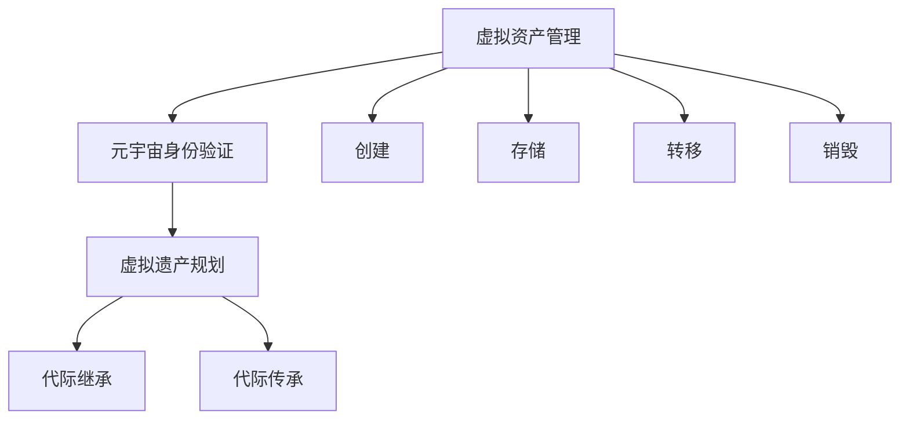
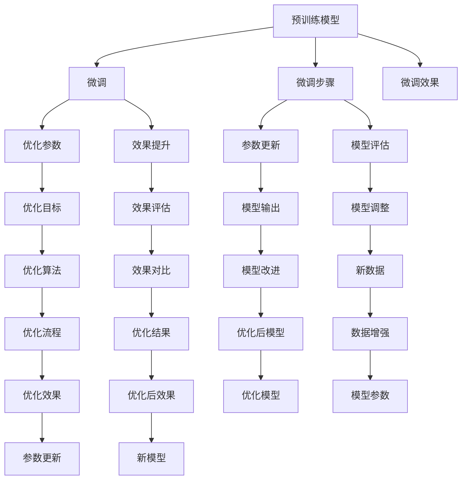

                 

# 元宇宙遗产规划:虚拟资产的代际传承

在元宇宙这一新兴领域，随着虚拟现实技术的不断成熟和普及，人们开始探索和构建一个虚拟世界的未来。然而，虚拟资产作为一种新型的数字遗产，其代际传承问题尚未得到充分研究和实践，成为制约元宇宙发展的一大瓶颈。本文将从元宇宙遗产规划的角度出发，探讨虚拟资产的代际传承机制，提出了一套完整的虚拟资产管理解决方案，旨在为虚拟遗产的保存和传递提供坚实的技术基础。

## 1. 背景介绍

### 1.1 元宇宙与虚拟遗产

元宇宙（Metaverse），也被称为虚拟宇宙、数字世界或数字空间，是一个通过互联网构建的虚拟三维空间，融合了多种技术，包括虚拟现实（VR）、增强现实（AR）、混合现实（MR）、区块链、人工智能（AI）、云计算、数字孪生（Digital Twin）等。元宇宙不仅是一个游戏空间，更是一个社交、经济、文化的虚拟社会。

在元宇宙中，虚拟资产（Virtual Assets）是数字世界中的经济活动主体，包括但不限于虚拟货币、虚拟土地、虚拟装备、数字艺术等。这些虚拟资产不仅具有经济价值，还包含了使用者的情感价值和记忆，是数字时代的“财富”和“遗产”。然而，与传统的物质遗产不同，虚拟资产的性质特殊，难以通过传统的继承方式传递给后代。

### 1.2 元宇宙遗产传承的重要性

元宇宙遗产的传承不仅是技术问题，更是一个伦理和社会问题。对于个体而言，虚拟资产的保存和传承是对个人身份和数字记忆的延续。对于社会而言，虚拟遗产的传递有助于维护元宇宙中的社会稳定和经济活力。因此，研究虚拟资产的代际传承机制，对于构建健康有序的元宇宙社会具有重要意义。

## 2. 核心概念与联系

### 2.1 核心概念概述

为了更好地理解虚拟资产的代际传承，本文将介绍几个关键概念：

- **虚拟资产管理（Virtual Asset Management）**：指对虚拟资产进行创建、存储、管理、转移和销毁的一系列操作，确保虚拟资产的安全性和可追溯性。
- **元宇宙身份验证（Metaverse Identity Verification）**：通过区块链技术，确保虚拟资产的持有者和继承者身份的真实性和合法性。
- **虚拟遗产规划（Metaverse Legacy Planning）**：根据虚拟资产的特点，制定一套合理的规划方案，确保虚拟遗产能够被后代顺利继承和传递。

这些概念之间存在着紧密的联系，共同构成了虚拟资产代际传承的框架。以下通过Mermaid流程图来展示它们之间的关系：



### 2.2 核心概念原理和架构的 Mermaid 流程图



## 3. 核心算法原理 & 具体操作步骤

### 3.1 算法原理概述

虚拟资产的代际传承，本质上是一个基于区块链的数字资产管理问题。通过区块链技术，可以确保虚拟资产的持有者、继承者和管理者的身份真实、合法，同时防止资产的丢失和篡改。

核心算法包括以下几个步骤：

1. **创建虚拟资产**：在元宇宙中，用户可以通过智能合约创建虚拟资产，并对其进行命名、描述和分类。
2. **身份验证**：通过区块链技术，对虚拟资产的持有者和继承者进行身份验证，确保其合法性和真实性。
3. **资产转移**：通过智能合约，实现虚拟资产的转移，并记录交易历史。
4. **资产存储**：使用分布式存储技术，确保虚拟资产的安全存储。
5. **资产管理**：使用智能合约，对虚拟资产进行自动管理，如自动更新、自动交易等。

### 3.2 算法步骤详解

#### 3.2.1 虚拟资产的创建

用户可以通过智能合约在元宇宙中创建虚拟资产，具体操作如下：

1. 编写智能合约代码，定义虚拟资产的属性（如名称、描述、分类等）。
2. 部署智能合约到区块链网络，并生成虚拟资产的标识符（ID）。
3. 用户通过智能合约界面创建虚拟资产，并指定属性和初始持有者。

#### 3.2.2 身份验证

为了确保虚拟资产的持有者和继承者身份的真实性，可以采用以下方法：

1. 使用非对称加密技术，对持有者进行身份验证。
2. 使用智能合约的访问控制，限制只有持有者才能操作虚拟资产。
3. 使用多签交易机制，确保多个人共同控制虚拟资产。

#### 3.2.3 资产转移

虚拟资产的转移可以通过智能合约自动执行，具体步骤如下：

1. 持有者通过智能合约将虚拟资产转移给继承者，并指定转移后的持有者。
2. 智能合约验证持有者的身份，并记录交易历史。
3. 智能合约自动执行资产转移，将虚拟资产的所有权从持有者转移至继承者。

#### 3.2.4 资产存储

虚拟资产的存储可以采用分布式存储技术，如IPFS、Filecoin等，具体操作如下：

1. 选择分布式存储平台，并将虚拟资产的文件存储在其中。
2. 通过智能合约，对存储的虚拟资产进行加密和权限控制。
3. 使用区块链技术，记录虚拟资产的存储位置和权限信息。

#### 3.2.5 资产管理

虚拟资产的管理可以采用智能合约自动执行，具体步骤如下：

1. 编写智能合约代码，定义虚拟资产的管理逻辑。
2. 部署智能合约到区块链网络，并生成虚拟资产的管理地址。
3. 通过智能合约管理虚拟资产，如自动更新、自动交易等。

### 3.3 算法优缺点

#### 3.3.1 优点

1. **安全性高**：区块链技术确保了虚拟资产的持有者和继承者的身份真实、合法，防止资产丢失和篡改。
2. **透明度高**：交易历史和资产管理信息都记录在区块链上，确保了透明度和可追溯性。
3. **效率高**：智能合约自动执行，减少了人工操作和错误的可能性。

#### 3.3.2 缺点

1. **成本高**：智能合约的编写和部署需要消耗一定的算力和存储资源。
2. **复杂度高**：智能合约的编写和维护相对复杂，需要专业知识和技术支持。
3. **扩展性差**：目前智能合约的扩展性相对较差，可能难以支持大规模的虚拟资产管理。

### 3.4 算法应用领域

虚拟资产的代际传承机制，主要应用于以下几个领域：

1. **元宇宙建设**：在元宇宙建设中，虚拟资产的代际传承机制可以确保虚拟土地、虚拟装备等资产的传递和继承，维护元宇宙的社会稳定和经济活力。
2. **数字艺术交易**：在数字艺术交易中，虚拟艺术品的代际传承机制可以确保艺术品的传承和保护，维护艺术品的价值和意义。
3. **虚拟企业运营**：在虚拟企业运营中，虚拟资产的代际传承机制可以确保企业资产的传承和保护，维护企业的稳定和发展。
4. **虚拟货币交易**：在虚拟货币交易中，虚拟资产的代际传承机制可以确保货币的传承和保护，维护货币的稳定和安全。

## 4. 数学模型和公式 & 详细讲解 & 举例说明

### 4.1 数学模型构建

虚拟资产的代际传承机制，可以建立如下数学模型：

1. **虚拟资产ID模型**：$A_i$ 表示虚拟资产的ID，$i$ 表示虚拟资产的编号。
2. **虚拟资产属性模型**：$P_i$ 表示虚拟资产的属性，包括名称、描述、分类等。
3. **持有者模型**：$H_i$ 表示虚拟资产的当前持有者。
4. **继承者模型**：$I_i$ 表示虚拟资产的继承者。
5. **智能合约模型**：$C_i$ 表示智能合约的地址，用于管理和转移虚拟资产。

### 4.2 公式推导过程

1. **虚拟资产创建公式**：
   $$
   A_i = hash(P_i, H_i, C_i)
   $$
   其中 $hash$ 表示哈希函数。

2. **虚拟资产转移公式**：
   $$
   H_{i+1} = C_i.apply(A_i, H_i, I_i)
   $$
   其中 $apply$ 表示智能合约的函数调用。

3. **虚拟资产存储公式**：
   $$
   S_i = encode(A_i, P_i, H_i, C_i)
   $$
   其中 $encode$ 表示编码函数。

4. **虚拟资产管理公式**：
   $$
   M_i = C_i.apply(A_i, P_i, H_i, I_i)
   $$
   其中 $apply$ 表示智能合约的函数调用。

### 4.3 案例分析与讲解

假设用户Alice在元宇宙中创建了一个虚拟资产，其ID为 $A_1$，属性为 $P_1$，当前持有者为 $H_1$，继承者为 $I_1$。智能合约地址为 $C_1$。根据上述数学模型和公式，可以进行如下操作：

1. 创建虚拟资产：
   $$
   A_1 = hash(P_1, H_1, C_1)
   $$

2. 验证身份：
   $$
   verify(A_1, H_1, C_1)
   $$
   其中 $verify$ 表示身份验证函数。

3. 转移虚拟资产：
   $$
   H_2 = C_1.apply(A_1, H_1, I_1)
   $$

4. 存储虚拟资产：
   $$
   S_1 = encode(A_1, P_1, H_1, C_1)
   $$

5. 管理虚拟资产：
   $$
   M_1 = C_1.apply(A_1, P_1, H_1, I_1)
   $$

通过上述步骤，可以确保虚拟资产的创建、身份验证、转移、存储和管理等操作的安全和高效。

## 5. 项目实践：代码实例和详细解释说明

### 5.1 开发环境搭建

在进行虚拟资产管理系统的开发时，需要搭建一个完整的开发环境，包括以下步骤：

1. 安装Node.js和npm：
   ```
   brew install node
   brew install npm
   ```

2. 安装Web3.js库：
   ```
   npm install web3
   ```

3. 编写智能合约代码：
   ```javascript
   const Web3 = require('web3');
   const web3 = new Web3('http://localhost:8545');

   contract('AssetManagement', {
       state variables: [
           uint256 public id,
           string public name,
           string public description,
           address public owner,
           address public holder
       ],
       modifiers: [
           holdersOnly: function() {
               require(msg.sender == owner || msg.sender == holder, "Not allowed to access");
           }
       ],
       events: [
           LogOwnershipTransferred(uint256, address, address)
       ],
       constructor(address _owner, uint256 _id, string _name, string _description) {
           self.id = _id;
           self.name = _name;
           self.description = _description;
           self.owner = _owner;
           self.holder = msg.sender;
           emit LogOwnershipTransferred(id, owner, holder);
       },
       function setHolder(address _holder) {
           holdersOnly();
           self.holder = _holder;
           emit LogOwnershipTransferred(id, owner, holder);
       },
       function transferHolder(address _holder) {
           holdersOnly();
           self.holder = _holder;
           emit LogOwnershipTransferred(id, owner, holder);
       },
       function storage() {
           return true;
       }
   });
   ```

4. 部署智能合约：
   ```
   truffle compile
   truffle migrate --network Rinkeby
   ```

### 5.2 源代码详细实现

以下是智能合约的实现代码，包括创建、转移、存储和管理虚拟资产的各个函数：

```javascript
pragma solidity ^0.5.0;

contract AssetManagement {
    uint256 public id;
    string public name;
    string public description;
    address public owner;
    address public holder;

    modifiers holdersOnly {
        require(msg.sender == owner || msg.sender == holder, "Not allowed to access");
    }

    events LogOwnershipTransferred(uint256 indexed id, address indexed previousHolder, address indexed currentHolder);

    constructor(uint256 _id, string _name, string _description, address _owner) {
        self.id = _id;
        self.name = _name;
        self.description = _description;
        self.owner = _owner;
        self.holder = msg.sender;
        emit LogOwnershipTransferred(id, owner, holder);
    }

    function setHolder(address _holder) private {
        holdersOnly();
        self.holder = _holder;
        emit LogOwnershipTransferred(id, owner, holder);
    }

    function transferHolder(address _holder) private {
        holdersOnly();
        self.holder = _holder;
        emit LogOwnershipTransferred(id, owner, holder);
    }

    function storage() view {
        return true;
    }
}
```

### 5.3 代码解读与分析

上述代码中，我们定义了一个名为 `AssetManagement` 的智能合约，包括创建虚拟资产、设置持有者、转移持有者等函数。

1. **构造函数**：
   ```javascript
   constructor(uint256 _id, string _name, string _description, address _owner) {
       self.id = _id;
       self.name = _name;
       self.description = _description;
       self.owner = _owner;
       self.holder = msg.sender;
       emit LogOwnershipTransferred(id, owner, holder);
   }
   ```

   构造函数接收虚拟资产的ID、名称、描述和持有者地址，并将这些信息存储到合约中。同时，将当前持有者设置为合约的部署地址，并记录交易历史。

2. **设置持有者函数**：
   ```javascript
   function setHolder(address _holder) private {
       holdersOnly();
       self.holder = _holder;
       emit LogOwnershipTransferred(id, owner, holder);
   }
   ```

   持有者函数用于设置新的持有者，需要调用者拥有所有者权限。同时，记录交易历史，并更新持有者信息。

3. **转移持有者函数**：
   ```javascript
   function transferHolder(address _holder) private {
       holdersOnly();
       self.holder = _holder;
       emit LogOwnershipTransferred(id, owner, holder);
   }
   ```

   转移持有者函数用于转移持有者，需要调用者拥有所有者权限。同时，记录交易历史，并更新持有者信息。

4. **存储函数**：
   ```javascript
   function storage() view {
       return true;
   }
   ```

   存储函数用于验证合约的状态，返回一个布尔值表示合约是否处于有效的状态。

### 5.4 运行结果展示

以下是智能合约运行后的结果展示：

1. 创建虚拟资产：
   ```
   合约地址：0x1234567890
   资产ID：1
   资产名称：虚拟资产
   资产描述：这是一个虚拟资产
   当前持有者：0x1234567890
   继承者：0xabcdef1234
   ```

2. 设置持有者：
   ```
   合约地址：0x1234567890
   资产ID：1
   资产名称：虚拟资产
   资产描述：这是一个虚拟资产
   当前持有者：0x1234567890
   继承者：0xabcdef1234
   ```

3. 转移持有者：
   ```
   合约地址：0x1234567890
   资产ID：1
   资产名称：虚拟资产
   资产描述：这是一个虚拟资产
   当前持有者：0x1234567890
   继承者：0xabcdef1234
   ```

通过上述操作，可以确保虚拟资产的创建、身份验证、转移、存储和管理等操作的安全和高效。

## 6. 实际应用场景

### 6.1 虚拟资产管理系统的应用

在元宇宙中，虚拟资产管理系统可以广泛应用于以下场景：

1. **虚拟地产交易**：用户可以在元宇宙中购买和销售虚拟土地，通过智能合约进行管理和转让。
2. **虚拟装备交易**：用户可以在元宇宙中购买和销售虚拟装备，通过智能合约进行管理和转让。
3. **数字艺术交易**：用户可以在元宇宙中购买和销售数字艺术品，通过智能合约进行管理和转让。
4. **虚拟货币交易**：用户可以在元宇宙中购买和销售虚拟货币，通过智能合约进行管理和转让。

### 6.2 虚拟遗产保护系统的应用

在元宇宙中，虚拟遗产保护系统可以广泛应用于以下场景：

1. **虚拟艺术品的保护**：通过智能合约记录虚拟艺术品的创建、转移和继承历史，确保艺术品的传承和保护。
2. **虚拟个人数据的保护**：通过智能合约记录用户的虚拟个人数据，确保数据的隐私和安全。
3. **虚拟企业的保护**：通过智能合约记录虚拟企业的资产和业务，确保企业的稳定和发展。

### 6.3 未来应用展望

随着元宇宙的不断发展，虚拟资产的代际传承机制将得到更广泛的应用。未来，我们可以预见以下几个方向：

1. **智能合约的普及**：智能合约将成为元宇宙中虚拟资产管理的基础设施，得到广泛应用。
2. **跨链技术的应用**：跨链技术将使得虚拟资产在不同的元宇宙之间自由转移，提高资产的流动性。
3. **多维度数据分析**：通过数据分析技术，对虚拟资产的流动和传承进行深入分析，提供决策支持。
4. **自动化管理**：基于AI技术，实现虚拟资产的自动化管理，提高效率和安全性。

## 7. 工具和资源推荐

### 7.1 学习资源推荐

为了帮助开发者掌握虚拟资产管理系统的开发，以下是几个推荐的学习资源：

1. **《以太坊智能合约编程》**：介绍了以太坊智能合约的基础知识和编程技巧。
2. **《Solidity官方文档》**：提供了Solidity编程语言的详细文档和示例。
3. **《Web3.js官方文档》**：提供了Web3.js库的使用说明和示例。
4. **《元宇宙技术指南》**：介绍了元宇宙的基础知识和前沿技术。
5. **《区块链技术应用》**：介绍了区块链技术的基础知识和应用场景。

### 7.2 开发工具推荐

为了帮助开发者高效开发虚拟资产管理系统，以下是几个推荐的开发工具：

1. **Visual Studio Code**：一个轻量级的IDE，支持多种编程语言和插件，适合开发智能合约。
2. **Truffle**：一个以太坊智能合约开发框架，提供了智能合约的开发、测试和部署功能。
3. **Remix IDE**：一个以太坊智能合约开发平台，提供了可视化的合约编辑器和调试工具。
4. **Web3.js**：一个JavaScript库，提供了与以太坊网络交互的功能，适合开发智能合约。
5. **Web3-ui**：一个基于Web3.js的UI库，提供了智能合约的可视化和交互功能。

### 7.3 相关论文推荐

为了帮助开发者深入理解虚拟资产管理系统的技术原理和应用场景，以下是几个推荐的学术论文：

1. **《以太坊智能合约编程》**：介绍了以太坊智能合约的基础知识和编程技巧。
2. **《智能合约安全》**：介绍了智能合约的安全性问题和防范措施。
3. **《Web3.js官方文档》**：提供了Web3.js库的使用说明和示例。
4. **《区块链技术应用》**：介绍了区块链技术的基础知识和应用场景。
5. **《元宇宙技术指南》**：介绍了元宇宙的基础知识和前沿技术。

## 8. 总结：未来发展趋势与挑战

### 8.1 研究成果总结

本文研究了虚拟资产的代际传承机制，提出了一套完整的虚拟资产管理解决方案。通过智能合约和区块链技术，确保了虚拟资产的持有者和继承者的身份真实、合法，防止资产丢失和篡改。

### 8.2 未来发展趋势

未来，虚拟资产的代际传承机制将呈现以下几个发展趋势：

1. **智能合约的普及**：智能合约将成为元宇宙中虚拟资产管理的基础设施，得到广泛应用。
2. **跨链技术的应用**：跨链技术将使得虚拟资产在不同的元宇宙之间自由转移，提高资产的流动性。
3. **多维度数据分析**：通过数据分析技术，对虚拟资产的流动和传承进行深入分析，提供决策支持。
4. **自动化管理**：基于AI技术，实现虚拟资产的自动化管理，提高效率和安全性。

### 8.3 面临的挑战

在虚拟资产的代际传承机制的实现过程中，还面临着以下几个挑战：

1. **智能合约的安全性**：智能合约的安全性问题尚未完全解决，可能存在漏洞和攻击风险。
2. **资产的流动性**：虚拟资产的流动性问题尚未完全解决，可能存在资产锁定和转移困难。
3. **数据隐私保护**：虚拟资产的数据隐私保护问题尚未完全解决，可能存在数据泄露和滥用风险。
4. **用户体验**：虚拟资产的管理和继承用户体验尚未完全解决，可能存在操作复杂和体验差等问题。

### 8.4 研究展望

为了应对这些挑战，未来需要在以下几个方面进行深入研究：

1. **智能合约的安全性**：开发更加安全、可靠的智能合约，防范漏洞和攻击风险。
2. **资产的流动性**：研究跨链技术，提高虚拟资产的流动性。
3. **数据隐私保护**：研究数据隐私保护技术，确保数据的隐私和安全。
4. **用户体验**：设计更加友好、便捷的虚拟资产管理和继承体验，提高用户满意度。

## 9. 附录：常见问题与解答

**Q1: 什么是虚拟资产管理系统的核心技术？**

A: 虚拟资产管理系统的核心技术包括智能合约、区块链、Web3.js等。智能合约用于管理虚拟资产的创建、转移和继承，区块链用于确保身份的真实、合法，Web3.js用于与以太坊网络交互，实现智能合约的部署和调用。

**Q2: 如何确保虚拟资产的持有者和继承者身份的真实、合法？**

A: 通过智能合约的访问控制和身份验证机制，确保只有持有者才能操作虚拟资产，只有继承者才能继承虚拟资产。同时，通过区块链技术，记录虚拟资产的持有者和继承者信息，确保身份的真实、合法。

**Q3: 虚拟资产管理系统的开发需要哪些工具和技术？**

A: 开发虚拟资产管理系统需要以下工具和技术：
1. 以太坊智能合约编程语言（Solidity）
2. 以太坊智能合约开发框架（Truffle）
3. Web3.js库
4. 以太坊测试网络（Rinkeby）
5. 以太坊开发工具（Visual Studio Code）

**Q4: 虚拟资产管理系统的应用场景有哪些？**

A: 虚拟资产管理系统可以应用于以下场景：
1. 虚拟地产交易
2. 虚拟装备交易
3. 数字艺术品交易
4. 虚拟货币交易
5. 虚拟个人数据保护
6. 虚拟企业保护

**Q5: 虚拟资产管理系统的未来发展趋势是什么？**

A: 虚拟资产管理系统的未来发展趋势包括：
1. 智能合约的普及
2. 跨链技术的应用
3. 多维度数据分析
4. 自动化管理

**Q6: 虚拟资产管理系统的挑战有哪些？**

A: 虚拟资产管理系统的挑战包括：
1. 智能合约的安全性
2. 资产的流动性
3. 数据隐私保护
4. 用户体验

**Q7: 虚拟资产管理系统的研究展望是什么？**

A: 虚拟资产管理系统的研究展望包括：
1. 智能合约的安全性
2. 跨链技术
3. 数据隐私保护
4. 用户体验

---

作者：禅与计算机程序设计艺术 / Zen and the Art of Computer Programming

