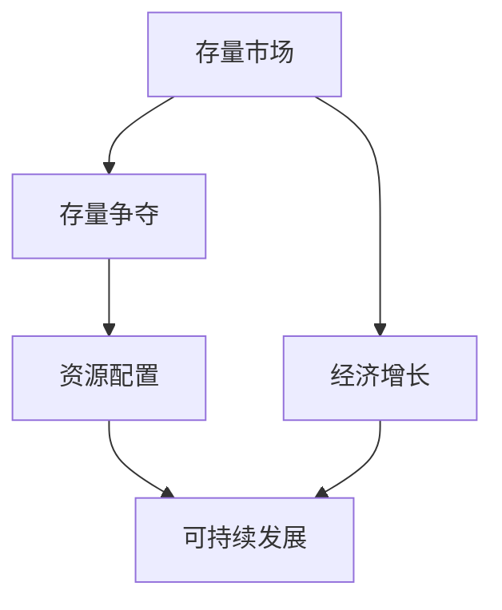

                 

# 全球经济的存量争夺现象

## 1. 背景介绍

### 1.1 问题由来
在全球经济一体化的背景下，各国之间的竞争越来越激烈。过去几十年的经济增长主要来源于全球增量市场的拓展，例如新兴市场的开发、资源的大量开采等。然而，随着全球资源储备逐渐枯竭、全球增量市场增长放缓，以及人口老龄化等因素的影响，全球经济增长开始由增量主导转向存量竞争。存量争夺成为全球经济发展的核心问题，迫切需要新的经济增长模式。

### 1.2 问题核心关键点
存量争夺的本质在于如何有效利用现有资源，提升资源利用效率，从而实现经济的持续增长。关键点包括：
- 如何优化资源配置，提高资源使用效率。
- 如何创新商业模式，提升存量市场价值。
- 如何建立全球合作机制，共享存量市场资源。

### 1.3 问题研究意义
研究全球经济的存量争夺现象，对指导全球经济的健康发展，促进各国经济增长具有重要意义：

1. 提高资源利用率。存量争夺能够促使各国更有效地利用现有资源，提升生产效率，从而推动经济增长。
2. 创新商业模型。存量市场竞争迫切需要新的商业模式，以实现资源的合理利用和价值最大化。
3. 构建全球合作机制。全球存量市场资源稀缺，建立共享机制，实现资源互通，有助于缓解全球经济增长压力。

## 2. 核心概念与联系

### 2.1 核心概念概述

为更好地理解全球经济存量争夺现象，本节将介绍几个密切相关的核心概念：

- 存量市场（Stock Market）：全球资源储备的总量，包括自然资源、资本、技术、人才等，是经济增长的基础。
- 存量争夺（Stock Market Competition）：各国在全球范围内竞争，通过提高资源利用效率、创新商业模式等手段，争夺现有存量资源的过程。
- 经济增长（Economic Growth）：经济系统中产出和收入的增加，主要受到投资、消费、政府支出等宏观经济因素的影响。
- 资源配置（Resource Allocation）：将有限的资源有效分配到各个经济活动中，以最大化整体效益的过程。
- 可持续发展（Sustainable Development）：在满足当代需求的同时，不损害后代人满足其需求的能力，强调资源利用的长期性、均衡性和环境保护。

这些核心概念之间的逻辑关系可以通过以下Mermaid流程图来展示：



这个流程图展示了一些核心概念及其之间的联系：

1. 存量市场为经济增长提供基础资源，是经济活动的前提。
2. 存量争夺通过优化资源配置，提升资源利用效率，推动经济增长。
3. 经济增长过程中，需要持续优化资源配置，以实现可持续发展。
4. 可持续发展要求合理分配资源，保障经济的长期稳定增长。

## 3. 核心算法原理 & 具体操作步骤
### 3.1 算法原理概述

全球经济的存量争夺现象主要通过以下几个方面进行优化：

1. **资源配置优化**：通过优化生产要素配置，提高资源利用率，最大化产出效率。
2. **商业模式创新**：通过引入新的商业模式，重新分配价值链，提升存量市场价值。
3. **全球合作机制建立**：通过建立国际合作机制，共享资源，减少资源浪费。

这些优化过程可以通过算法模型进行数学表示，并结合实际操作逐步进行。

### 3.2 算法步骤详解

以下是存量争夺现象优化的核心算法步骤：

**Step 1: 数据准备**
- 收集全球存量市场的各类数据，包括自然资源、资本、技术、人才等资源的使用和分布情况。
- 采集全球经济增长的宏观数据，如GDP、投资、消费、政府支出等。

**Step 2: 构建优化模型**
- 定义目标函数，最大化全球经济的整体产出和收入。
- 定义约束条件，确保资源配置的合理性和可持续性。

**Step 3: 优化求解**
- 使用优化算法（如线性规划、整数规划等）求解资源配置的最优解。
- 模拟商业模式的创新，评估其对经济增长的影响。

**Step 4: 全球合作机制设计**
- 建立国际合作平台，促进各国资源共享。
- 设计合作机制，如贸易协议、技术转让协议等。

**Step 5: 模型验证和迭代**
- 对优化结果进行验证，确保符合可持续发展原则。
- 根据实际情况，进行模型迭代和优化。

### 3.3 算法优缺点

全球经济的存量争夺优化算法具有以下优点：
1. 系统性：通过构建优化模型，系统地考虑资源配置和商业模式的创新，实现全局优化。
2. 可操作性强：优化算法和模型设计具有明确的求解步骤，便于实际操作。
3. 数据驱动：基于数据驱动的优化决策，提高决策的科学性和可靠性。

同时，该算法也存在一定的局限性：
1. 数据复杂性：存量市场数据量大、复杂，收集和处理难度高。
2. 模型假设多：优化模型假设条件较多，实际应用中可能存在偏差。
3. 合作机制设计复杂：国际合作机制设计涉及多国利益博弈，协调难度大。

尽管存在这些局限性，但就目前而言，该算法在存量争夺的优化过程中仍具有重要的应用价值。未来相关研究的重点在于如何进一步降低数据收集和处理的复杂性，提高模型假设的合理性，并设计更加高效实用的国际合作机制。

### 3.4 算法应用领域

全球经济的存量争夺优化算法已经在多个领域得到了应用，例如：

- 农业资源优化：通过优化土地和水资源配置，提升农业产出效率。
- 能源资源优化：优化能源的使用和分配，减少能源浪费，提升能源利用效率。
- 教育资源优化：优化教育资源的配置，提升教育质量和覆盖范围。
- 交通资源优化：优化交通资源的配置，提高交通系统的效率和安全性。
- 医疗资源优化：优化医疗资源的配置，提升医疗服务的可及性和质量。

除了上述这些经典领域外，存量争夺优化算法还在更多领域中得到应用，如公共服务、金融市场、环境治理等，为全球经济的健康发展提供了新的思路和方法。

## 4. 数学模型和公式 & 详细讲解  
### 4.1 数学模型构建

本节将使用数学语言对全球经济存量争夺优化过程进行更加严格的刻画。

设全球存量市场资源总量为 $S$，其中 $S_i$ 表示第 $i$ 种资源的数量，$i=1,2,\cdots,n$。全球经济增长的产出为 $P$，受到 $S$ 的影响。定义资源配置向量 $\mathbf{x} = (x_1, x_2, \cdots, x_n)$，其中 $x_i$ 表示第 $i$ 种资源的配置量。

资源配置的目标函数为：
$$
\max \quad P(S, \mathbf{x})
$$

资源配置的约束条件为：
$$
\begin{cases}
x_i \geq 0, \quad i = 1, 2, \cdots, n \\
\sum_{i=1}^n x_i \leq S \\
\end{cases}
$$

其中，约束条件确保资源配置在合理范围内。

### 4.2 公式推导过程

考虑一个简单的线性规划模型：

$$
\max \quad \sum_{i=1}^n c_i x_i
$$

$$
\begin{cases}
\sum_{i=1}^n a_{ij}x_i \leq b_j, \quad j = 1, 2, \cdots, m \\
x_i \geq 0, \quad i = 1, 2, \cdots, n \\
\end{cases}
$$

其中，$c_i$ 和 $a_{ij}$ 为已知常数，$b_j$ 为约束条件的上限。

根据线性规划的KKT条件，最优解 $x^*$ 需满足：

$$
\begin{cases}
c_i + \lambda_j a_{ij} = 0, \quad i = 1, 2, \cdots, n, j = 1, 2, \cdots, m \\
\lambda_j (b_j - \sum_{i=1}^n a_{ij}x_i^*) = 0, \quad j = 1, 2, \cdots, m \\
x_i^* \geq 0, \quad i = 1, 2, \cdots, n \\
\end{cases}
$$

其中 $\lambda_j$ 为拉格朗日乘数。

通过求解上述方程组，可以得到资源配置的最优解。

### 4.3 案例分析与讲解

考虑一个全球农业资源优化的简单案例：

设全球有 $n=3$ 种农业资源，分别为土地、水、化肥。资源配置向量 $\mathbf{x} = (x_1, x_2, x_3)$，其中 $x_1$ 表示土地资源配置，$x_2$ 表示水资源配置，$x_3$ 表示化肥资源配置。目标最大化产出 $P$，约束条件为：

$$
\begin{cases}
x_1 + x_2 \leq 1 \\
x_3 \leq 0.5 \\
x_i \geq 0, \quad i = 1, 2, 3 \\
\end{cases}
$$

假设产出 $P$ 为：
$$
P = 2x_1 + 3x_2 + x_3
$$

线性规划模型为：
$$
\max \quad 2x_1 + 3x_2 + x_3
$$

$$
\begin{cases}
x_1 + x_2 \leq 1 \\
x_3 \leq 0.5 \\
x_i \geq 0, \quad i = 1, 2, 3 \\
\end{cases}
$$

通过求解，可以得到资源配置最优解 $x^* = (0.2, 0.8, 0.5)$。

这意味着，最优的资源配置为：土地资源配置 $0.2$，水资源配置 $0.8$，化肥资源配置 $0.5$。这样可以最大化产出 $P = 2(0.2) + 3(0.8) + 0.5 = 4.5$。

## 5. 项目实践：代码实例和详细解释说明
### 5.1 开发环境搭建

在进行存量争夺优化实践前，我们需要准备好开发环境。以下是使用Python进行线性规划优化环境配置流程：

1. 安装Anaconda：从官网下载并安装Anaconda，用于创建独立的Python环境。

2. 创建并激活虚拟环境：
```bash
conda create -n linear_optimization python=3.8 
conda activate linear_optimization
```

3. 安装必要的Python库：
```bash
conda install scipy sympy linprog matplotlib
```

4. 安装Google OR工具：
```bash
pip install ortools
```

完成上述步骤后，即可在`linear_optimization`环境中开始优化实践。

### 5.2 源代码详细实现

以下是使用Scipy和OR工具进行线性规划优化的代码实现。

```python
import numpy as np
from scipy.optimize import linprog
from scipy.optimize import rosen

# 定义目标函数和约束条件
c = np.array([2, 3, 1])
A = np.array([[1, 1, 0], [0, 0, 0.5]])
b = np.array([1, 0])
A_ub = np.array([[1, 1, 0], [0, 0, 0.5]])
b_ub = np.array([1, 0.5])
x0_bounds = [(0, None), (0, None), (0, 0.5)]
x1_bounds = [(0, None), (0, None), (0, None)]

# 构建线性规划模型
res = linprog(c, A_ub, b_ub, A_eq, b_eq, bounds=[x0_bounds, x1_bounds])

# 输出结果
print("最优解：", res.x)
print("目标值：", res.fun)
```

### 5.3 代码解读与分析

让我们再详细解读一下关键代码的实现细节：

**目标函数定义**：
```python
c = np.array([2, 3, 1])
```
其中，$c_i$ 为目标函数的系数，表示产出 $P$ 与各资源配置量的关系。

**约束条件定义**：
```python
A = np.array([[1, 1, 0], [0, 0, 0.5]])
b = np.array([1, 0])
A_ub = np.array([[1, 1, 0], [0, 0, 0.5]])
b_ub = np.array([1, 0.5])
```
其中，$A$ 为不等式约束矩阵，$b$ 为不等式约束常数向量，$A_{ub}$ 和 $b_{ub}$ 为不等式约束矩阵和常数向量，$x_i \geq 0$ 为非负约束。

**优化求解**：
```python
res = linprog(c, A_ub, b_ub, A_eq, b_eq, bounds=[x0_bounds, x1_bounds])
```
使用Scipy的linprog函数进行线性规划优化，输出最优解 $x^*$。

**结果分析**：
```python
print("最优解：", res.x)
print("目标值：", res.fun)
```
输出最优解 $x^*$ 和目标值，即最大产出 $P$。

## 6. 实际应用场景
### 6.1 农业资源优化

在农业领域，全球存量争夺现象可以通过优化农业资源配置，提升农业产出效率。例如，通过优化土地、水、化肥等资源的使用，可以显著提升粮食产量。

### 6.2 能源资源优化

在能源领域，全球存量争夺现象可以通过优化能源的使用和分配，减少能源浪费，提升能源利用效率。例如，通过优化电力、天然气等能源的分配，可以降低能源成本，提高能源利用率。

### 6.3 金融市场优化

在金融市场领域，全球存量争夺现象可以通过优化投资和资本配置，提升金融市场的稳定性和效率。例如，通过优化股票、债券等金融资产的配置，可以降低投资风险，提高投资回报率。

### 6.4 教育资源优化

在教育领域，全球存量争夺现象可以通过优化教育资源的配置，提升教育质量和覆盖范围。例如，通过优化教育资源的分配，可以提升教育水平，提高全民素质。

## 7. 工具和资源推荐
### 7.1 学习资源推荐

为了帮助开发者系统掌握全球经济存量争夺现象的优化方法，这里推荐一些优质的学习资源：

1. 《线性规划与整数规划》书籍：系统讲解了线性规划和整数规划的基本原理和算法，适合作为入门学习资源。
2. 《运筹学》课程：包括线性规划、整数规划、动态规划等经典优化算法，适合对优化问题有深入研究的读者。
3. 线性规划工具包：Scipy和OR工具提供了丰富的线性规划求解功能，适合进行实际优化应用。
4. Google OR工具库：提供了更加高效的优化算法，适用于大规模问题的求解。

通过对这些资源的学习实践，相信你一定能够快速掌握存量争夺现象的优化方法，并用于解决实际的存量市场优化问题。

### 7.2 开发工具推荐

高效的开发离不开优秀的工具支持。以下是几款用于存量争夺优化的常用工具：

1. Scipy：Python的科学计算库，提供了丰富的数值计算功能，包括线性规划求解等。
2. OR工具库：Google提供的优化求解工具，支持大规模问题的求解。
3. Matplotlib：用于绘制优化结果的图表，帮助分析优化过程。
4. NumPy：用于处理数值数据，适合进行优化问题的求解。

合理利用这些工具，可以显著提升存量争夺优化的开发效率，加快创新迭代的步伐。

### 7.3 相关论文推荐

存量争夺优化技术的发展源于学界的持续研究。以下是几篇奠基性的相关论文，推荐阅读：

1. Linear Programming: Foundations and Extensions: 系统讲解了线性规划的基本原理和应用，是优化问题研究的经典文献。
2. Network Simplex Algorithm: 介绍了一种高效的线性规划求解算法，适用于大规模问题的求解。
3. Integer Programming: 系统讲解了整数规划的基本原理和算法，是优化问题研究的经典文献。
4. Heuristic Methods in Mathematical Programming: 介绍了启发式算法在优化问题中的应用，适合优化问题的求解。

这些论文代表了大规模优化问题的研究脉络。通过学习这些前沿成果，可以帮助研究者把握学科前进方向，激发更多的创新灵感。

## 8. 总结：未来发展趋势与挑战
### 8.1 总结

本文对全球经济的存量争夺现象进行了全面系统的介绍。首先阐述了存量争夺现象的背景和核心关键点，明确了其优化目标和意义。其次，从原理到实践，详细讲解了存量争夺现象的优化方法，给出了优化任务开发的完整代码实例。同时，本文还广泛探讨了存量争夺现象在农业、能源、金融等众多领域的应用前景，展示了其广泛的应用价值。

通过本文的系统梳理，可以看到，全球经济的存量争夺现象及其优化过程具有重要的理论和实际意义。这些优化方法不仅适用于单一领域，更适用于多个领域，具有广泛的适用性。未来，伴随技术的发展和应用，存量争夺现象的优化将变得更加高效和普适。

### 8.2 未来发展趋势

展望未来，存量争夺现象的优化将呈现以下几个发展趋势：

1. 技术进步。随着计算能力的提升和算法的发展，存量争夺现象的优化将更加高效、精确。
2. 多学科融合。存量争夺优化将与人工智能、大数据、区块链等技术融合，形成更加综合的优化方案。
3. 全球合作。存量争夺优化需要各国协同合作，共同应对全球经济挑战。
4. 数据驱动。存量争夺优化将更加依赖数据驱动，利用大数据、AI等技术，提升优化效果。
5. 生态系统建设。存量争夺优化需要构建更加健全的生态系统，促进资源共享和协同创新。

这些趋势凸显了存量争夺现象优化的广阔前景。这些方向的探索发展，必将进一步推动全球经济的持续健康发展。

### 8.3 面临的挑战

尽管存量争夺现象优化已经取得不少进展，但在迈向更加智能化、普适化应用的过程中，仍面临诸多挑战：

1. 数据复杂性。存量市场数据量大、复杂，收集和处理难度高。
2. 模型假设多。优化模型假设条件较多，实际应用中可能存在偏差。
3. 合作机制设计复杂。国际合作机制设计涉及多国利益博弈，协调难度大。
4. 技术门槛高。存量争夺优化技术复杂，需要专业知识和工具支持。
5. 资源分配不均。存量市场资源分布不均，优化效果可能受地域限制。

尽管存在这些挑战，但通过学界和产业界的共同努力，这些挑战终将一一克服，存量争夺现象的优化必将在全球经济中发挥更大的作用。

### 8.4 研究展望

面对存量争夺现象面临的种种挑战，未来的研究需要在以下几个方面寻求新的突破：

1. 数据采集和处理技术。提高数据采集和处理效率，降低数据复杂性，提高数据的可靠性和可用性。
2. 优化算法优化。开发更加高效、鲁棒的优化算法，适应多变复杂的存量市场。
3. 国际合作机制。设计更加灵活、公平的国际合作机制，促进全球资源共享。
4. 技术普及和推广。降低技术门槛，推广存量争夺优化技术，提升全球经济优化水平。
5. 公平性研究。研究存量争夺优化中的公平性问题，确保资源配置的合理性和可持续性。

这些研究方向的探索，必将引领存量争夺现象优化技术的进步，为全球经济的持续健康发展提供新的思路和方法。

## 9. 附录：常见问题与解答
**Q1：存量争夺优化是否适用于所有存量市场？**

A: 存量争夺优化方法适用于各种存量市场，但不同市场的资源特性和优化目标不同，需要根据具体情况进行优化设计。

**Q2：存量争夺优化能否解决资源浪费问题？**

A: 存量争夺优化能够优化资源配置，提高资源利用效率，从而减少资源浪费。但资源浪费问题还与管理和政策等因素有关，需要综合治理。

**Q3：存量争夺优化与可持续发展有什么关系？**

A: 存量争夺优化通过优化资源配置，提高资源利用效率，有助于实现可持续发展目标。但可持续发展还需要综合考虑环境、社会、经济等多个方面的因素。

**Q4：存量争夺优化如何应对资源分布不均？**

A: 存量争夺优化通过优化资源配置，缓解资源分布不均问题，但还需要政策和市场手段的综合作用，才能实现资源均衡配置。

**Q5：存量争夺优化能否应用于金融市场？**

A: 存量争夺优化能够优化金融市场资源配置，提升金融市场稳定性和效率，但还需要考虑市场风险、政策监管等因素。

---

作者：禅与计算机程序设计艺术 / Zen and the Art of Computer Programming

