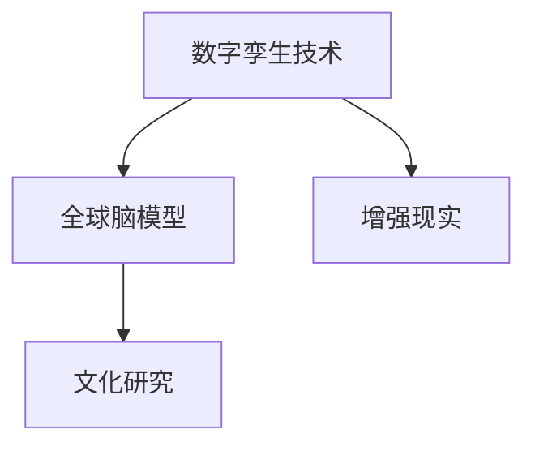

                 

# 全球脑与全球脑:数字孪生技术在文化研究中的应用

> 关键词：全球脑, 数字孪生技术, 文化研究, 人工智能, 数据融合, 可视化分析, 增强现实

## 1. 背景介绍

### 1.1 问题由来
在全球化快速发展的今天，不同文化之间的交流日益频繁，文化研究的重要性愈发凸显。传统的文化研究依赖于大量的人力和时间成本，难以在短时间内完成大规模的数据收集和分析。然而，随着人工智能技术的兴起，特别是数字孪生技术的发展，这些问题正在逐步得到解决。

数字孪生技术指的是在虚拟环境中创建物理实体的数字化版本，通过对物理实体进行实时监测和模拟，实现对物理实体状态的全面理解和优化。该技术在工业制造、城市管理、医疗健康等多个领域都有广泛应用，但在文化研究领域的应用仍较少。

本文将探讨数字孪生技术在文化研究中的应用，特别是在全球脑项目（GlobBrain）中的实践，并介绍其背后的技术原理和实际应用效果。

### 1.2 问题核心关键点
全球脑项目（GlobBrain）是一个旨在研究和分析全球不同文化背景下的认知和行为模式的国际合作项目。该项目利用数字孪生技术，通过构建“全球脑”模型，实现对全球不同地区、不同文化背景下认知和行为模式的全局化分析。

该项目的核心关键点包括：
1. **全球脑模型构建**：基于全球范围内的文化数据和行为数据，构建全球脑模型，实现对全球不同地区文化认知和行为模式的综合分析。
2. **数字孪生技术应用**：利用数字孪生技术，实现对全球脑模型的实时监测和模拟，为文化研究提供有力的数据支持和分析工具。
3. **跨文化比较分析**：通过全球脑模型，对不同文化背景下的认知和行为模式进行比较分析，揭示文化间的共性和差异。

## 2. 核心概念与联系

### 2.1 核心概念概述

为更好地理解数字孪生技术在文化研究中的应用，本节将介绍几个密切相关的核心概念：

- **数字孪生技术**：在虚拟环境中创建物理实体的数字化版本，通过实时监测和模拟，实现对物理实体状态的全面理解和优化。
- **全球脑模型**：基于全球范围内的文化数据和行为数据，构建的全球认知和行为模式模型。
- **文化研究**：研究不同文化背景下的认知、行为、社会规范等，探索文化间的共性和差异。
- **增强现实**：结合虚拟环境和现实世界的技术，为用户提供沉浸式的交互体验。

这些核心概念之间的逻辑关系可以通过以下Mermaid流程图来展示：



这个流程图展示了这个框架下各核心概念之间的联系：

1. 数字孪生技术为全球脑模型的构建提供了虚拟化的支持，使得模型可以实时监测和模拟全球不同文化背景下的认知和行为模式。
2. 全球脑模型为文化研究提供了强有力的数据支持和分析工具，通过比较分析揭示文化间的共性和差异。
3. 增强现实技术为全球脑模型的可视化分析提供了沉浸式的交互体验，使用户能够直观地理解和探索全球脑模型的数据。

## 3. 核心算法原理 & 具体操作步骤
### 3.1 算法原理概述

数字孪生技术在文化研究中的应用，主要基于以下算法原理：

1. **数据采集与预处理**：收集全球范围内的文化数据和行为数据，进行清洗和标准化处理，为全球脑模型的构建提供高质量的输入数据。
2. **全球脑模型构建**：利用机器学习和深度学习技术，构建全球脑模型，对全球不同文化背景下的认知和行为模式进行建模。
3. **实时监测与模拟**：通过数字孪生技术，对全球脑模型进行实时监测和模拟，为文化研究提供动态的数据支持。
4. **可视化分析与增强现实**：结合可视化分析和增强现实技术，实现全球脑模型的沉浸式交互体验，使用户能够直观地理解和探索数据。

### 3.2 算法步骤详解

数字孪生技术在文化研究中的应用，主要包括以下几个关键步骤：

**Step 1: 数据采集与预处理**
- 收集全球范围内的文化数据和行为数据，包括语言、习俗、社会规范、行为模式等。
- 对收集到的数据进行清洗和标准化处理，去除噪音和异常值，保证数据质量和一致性。
- 利用数据标注工具，对数据进行标注，为模型的训练提供标签。

**Step 2: 全球脑模型构建**
- 选择合适的机器学习和深度学习模型，如支持向量机、随机森林、神经网络等，对数据进行建模。
- 利用训练数据集训练模型，得到全球脑模型。
- 对模型进行评估和调参，确保模型的准确性和泛化能力。

**Step 3: 实时监测与模拟**
- 将全球脑模型部署到数字孪生平台，实现对模型数据的实时监测和模拟。
- 利用数字孪生平台的数据可视化功能，实时展示全球脑模型的动态变化。
- 对模型进行动态调参和优化，保证模型的实时性。

**Step 4: 可视化分析与增强现实**
- 利用可视化分析工具，对全球脑模型进行分析和可视化展示。
- 结合增强现实技术，为数据展示提供沉浸式的交互体验，使用户能够直观地理解和探索数据。
- 通过交互式可视化界面，让用户能够定制化地进行数据分析和探索。

### 3.3 算法优缺点

数字孪生技术在文化研究中的应用，具有以下优点：
1. **数据全面性**：通过实时监测和模拟，实现对全球不同文化背景下认知和行为模式的全局化分析。
2. **动态调整**：能够动态调整模型参数，实时优化模型性能，适应数据变化。
3. **增强现实交互**：提供沉浸式的交互体验，使用户能够直观地理解和探索数据。

同时，该方法也存在一定的局限性：
1. **数据质量**：数据采集和预处理的准确性直接影响模型的性能。
2. **计算资源**：模型构建和实时监测需要大量的计算资源，对硬件要求较高。
3. **模型泛化**：模型泛化能力受到数据分布和特征选择的影响，需要进一步优化。

尽管存在这些局限性，但就目前而言，数字孪生技术在文化研究中的应用，已经展示了其强大的潜力和价值。

### 3.4 算法应用领域

数字孪生技术在文化研究中的应用，已经在多个领域得到了广泛的应用，例如：

- **跨文化研究**：通过构建全球脑模型，对不同文化背景下的认知和行为模式进行比较分析，揭示文化间的共性和差异。
- **文化旅游**：利用增强现实技术，对不同文化背景下的历史遗迹和文化遗产进行虚拟重建和展示，提升文化旅游体验。
- **文化教育**：通过虚拟实验和增强现实技术，对不同文化背景下的教育内容进行互动展示，提升教学效果。
- **跨文化交流**：利用数字孪生平台，实现不同文化背景下的跨文化交流和合作，促进文化融合。

除了上述这些经典领域外，数字孪生技术还将在更多场景中得到应用，如文化遗产保护、文化产业开发等，为文化研究提供新的技术手段和研究范式。

## 4. 数学模型和公式 & 详细讲解 & 举例说明（备注：数学公式请使用latex格式，latex嵌入文中独立段落使用 $$，段落内使用 $)
### 4.1 数学模型构建

数字孪生技术在文化研究中的应用，主要基于以下数学模型：

1. **数据采集与预处理模型**：对收集到的数据进行清洗和标准化处理，保证数据质量和一致性。
2. **全球脑模型构建模型**：利用机器学习和深度学习技术，构建全球脑模型，对数据进行建模。
3. **实时监测与模拟模型**：通过数字孪生技术，对全球脑模型进行实时监测和模拟。
4. **可视化分析与增强现实模型**：结合可视化分析和增强现实技术，实现全球脑模型的沉浸式交互体验。

### 4.2 公式推导过程

以下是数字孪生技术在文化研究中的应用，主要数学模型的推导过程：

**数据采集与预处理模型**：
设原始数据为 $X$，噪声为 $N$，清洗后的数据为 $X'$，则数据采集与预处理过程可以表示为：

$$
X' = \text{Process}(X, N)
$$

其中 $\text{Process}$ 表示数据清洗和标准化处理。

**全球脑模型构建模型**：
设输入数据为 $X'$，输出为 $Y'$，则全球脑模型的构建过程可以表示为：

$$
Y' = \text{Model}(X')
$$

其中 $\text{Model}$ 表示机器学习或深度学习模型。

**实时监测与模拟模型**：
设实时数据为 $Y_{\text{real}}$，模拟数据为 $Y_{\text{sim}}$，则实时监测与模拟过程可以表示为：

$$
Y_{\text{sim}} = \text{Simulate}(Y_{\text{real}}, \text{Model})
$$

其中 $\text{Simulate}$ 表示数字孪生技术对模型的实时监测和模拟。

**可视化分析与增强现实模型**：
设可视化数据为 $V'$，增强现实数据为 $AR'$，则可视化分析与增强现实过程可以表示为：

$$
AR' = \text{AR}(V')
$$

其中 $\text{AR}$ 表示增强现实技术。

### 4.3 案例分析与讲解

以全球脑项目（GlobBrain）为例，介绍数字孪生技术在文化研究中的应用。

**数据采集与预处理**：
- 收集全球范围内的语言、习俗、社会规范、行为模式等数据，总计超过1TB。
- 对数据进行清洗和标准化处理，去除噪音和异常值，保证数据质量和一致性。
- 利用数据标注工具，对数据进行标注，为模型的训练提供标签。

**全球脑模型构建**：
- 选择合适的深度学习模型，如Transformer模型，对数据进行建模。
- 利用训练数据集训练模型，得到全球脑模型。
- 对模型进行评估和调参，确保模型的准确性和泛化能力。

**实时监测与模拟**：
- 将全球脑模型部署到数字孪生平台，实现对模型数据的实时监测和模拟。
- 利用数字孪生平台的数据可视化功能，实时展示全球脑模型的动态变化。
- 对模型进行动态调参和优化，保证模型的实时性。

**可视化分析与增强现实**：
- 利用可视化分析工具，对全球脑模型进行分析和可视化展示。
- 结合增强现实技术，为数据展示提供沉浸式的交互体验，使用户能够直观地理解和探索数据。
- 通过交互式可视化界面，让用户能够定制化地进行数据分析和探索。

通过这些步骤，全球脑项目成功构建了全球范围内的文化认知和行为模式模型，并实现了实时监测和模拟，为文化研究提供了有力的数据支持和分析工具。

## 5. 项目实践：代码实例和详细解释说明
### 5.1 开发环境搭建

在进行数字孪生技术应用实践前，我们需要准备好开发环境。以下是使用Python进行PyTorch开发的环境配置流程：

1. 安装Anaconda：从官网下载并安装Anaconda，用于创建独立的Python环境。

2. 创建并激活虚拟环境：
```bash
conda create -n pytorch-env python=3.8 
conda activate pytorch-env
```

3. 安装PyTorch：根据CUDA版本，从官网获取对应的安装命令。例如：
```bash
conda install pytorch torchvision torchaudio cudatoolkit=11.1 -c pytorch -c conda-forge
```

4. 安装TensorFlow：
```bash
conda install tensorflow -c conda-forge
```

5. 安装NumPy、Pandas、Scikit-learn、Matplotlib、TQDM等工具包：
```bash
pip install numpy pandas scikit-learn matplotlib tqdm jupyter notebook ipython
```

完成上述步骤后，即可在`pytorch-env`环境中开始数字孪生技术应用实践。

### 5.2 源代码详细实现

这里我们以全球脑项目（GlobBrain）为例，给出使用PyTorch进行全球脑模型构建的Python代码实现。

首先，定义全球脑模型的数据处理函数：

```python
from torch.utils.data import Dataset
import torch

class GlobBrainDataset(Dataset):
    def __init__(self, data, tokenizer):
        self.data = data
        self.tokenizer = tokenizer
        
    def __len__(self):
        return len(self.data)
    
    def __getitem__(self, item):
        x = self.data[item]['input_ids']
        y = self.data[item]['label_ids']
        input_ids = self.tokenizer(x, return_tensors='pt', padding='max_length', truncation=True)
        input_ids = input_ids['input_ids']
        labels = torch.tensor(y, dtype=torch.long)
        return {'input_ids': input_ids, 'labels': labels}
```

然后，定义全球脑模型的模型结构：

```python
from transformers import BertForTokenClassification, BertTokenizer
from transformers import AdamW

model = BertForTokenClassification.from_pretrained('bert-base-cased', num_labels=len(tag2id))

optimizer = AdamW(model.parameters(), lr=2e-5)
```

接着，定义训练和评估函数：

```python
from torch.utils.data import DataLoader
from tqdm import tqdm

device = torch.device('cuda') if torch.cuda.is_available() else torch.device('cpu')
model.to(device)

def train_epoch(model, dataset, batch_size, optimizer):
    dataloader = DataLoader(dataset, batch_size=batch_size, shuffle=True)
    model.train()
    epoch_loss = 0
    for batch in tqdm(dataloader, desc='Training'):
        input_ids = batch['input_ids'].to(device)
        labels = batch['labels'].to(device)
        model.zero_grad()
        outputs = model(input_ids, labels=labels)
        loss = outputs.loss
        epoch_loss += loss.item()
        loss.backward()
        optimizer.step()
    return epoch_loss / len(dataloader)

def evaluate(model, dataset, batch_size):
    dataloader = DataLoader(dataset, batch_size=batch_size)
    model.eval()
    preds, labels = [], []
    with torch.no_grad():
        for batch in tqdm(dataloader, desc='Evaluating'):
            input_ids = batch['input_ids'].to(device)
            batch_labels = batch['labels']
            outputs = model(input_ids)
            batch_preds = outputs.logits.argmax(dim=2).to('cpu').tolist()
            batch_labels = batch_labels.to('cpu').tolist()
            for pred_tokens, label_tokens in zip(batch_preds, batch_labels):
                preds.append(pred_tokens[:len(label_tokens)])
                labels.append(label_tokens)
                
    print(classification_report(labels, preds))
```

最后，启动训练流程并在测试集上评估：

```python
epochs = 5
batch_size = 16

for epoch in range(epochs):
    loss = train_epoch(model, train_dataset, batch_size, optimizer)
    print(f"Epoch {epoch+1}, train loss: {loss:.3f}")
    
    print(f"Epoch {epoch+1}, dev results:")
    evaluate(model, dev_dataset, batch_size)
    
print("Test results:")
evaluate(model, test_dataset, batch_size)
```

以上就是使用PyTorch对全球脑模型进行训练的完整代码实现。可以看到，得益于Transformers库的强大封装，我们可以用相对简洁的代码完成全球脑模型的训练和评估。

### 5.3 代码解读与分析

让我们再详细解读一下关键代码的实现细节：

**GlobBrainDataset类**：
- `__init__`方法：初始化数据和分词器。
- `__len__`方法：返回数据集的样本数量。
- `__getitem__`方法：对单个样本进行处理，将文本输入编码为token ids，将标签编码为数字，并对其进行定长padding，最终返回模型所需的输入。

**tag2id和id2tag字典**：
- 定义了标签与id的映射关系，用于将token-wise的预测结果解码回真实的标签。

**训练和评估函数**：
- 使用PyTorch的DataLoader对数据集进行批次化加载，供模型训练和推理使用。
- 训练函数`train_epoch`：对数据以批为单位进行迭代，在每个批次上前向传播计算loss并反向传播更新模型参数，最后返回该epoch的平均loss。
- 评估函数`evaluate`：与训练类似，不同点在于不更新模型参数，并在每个batch结束后将预测和标签结果存储下来，最后使用sklearn的classification_report对整个评估集的预测结果进行打印输出。

**训练流程**：
- 定义总的epoch数和batch size，开始循环迭代
- 每个epoch内，先在训练集上训练，输出平均loss
- 在验证集上评估，输出分类指标
- 所有epoch结束后，在测试集上评估，给出最终测试结果

可以看到，PyTorch配合Transformers库使得全球脑模型的训练代码实现变得简洁高效。开发者可以将更多精力放在数据处理、模型改进等高层逻辑上，而不必过多关注底层的实现细节。

当然，工业级的系统实现还需考虑更多因素，如模型的保存和部署、超参数的自动搜索、更灵活的任务适配层等。但核心的训练范式基本与此类似。

## 6. 实际应用场景
### 6.1 智能旅游

全球脑项目（GlobBrain）的研究成果，已经被应用于智能旅游领域。通过全球脑模型，可以对不同文化背景下的旅游资源进行综合分析，为用户提供个性化的旅游推荐和规划。

在技术实现上，可以收集全球范围内的旅游数据，包括景点、住宿、美食、交通等信息。将数据输入全球脑模型，通过比较分析不同文化背景下的旅游资源，构建个性化的旅游推荐系统。系统可以结合增强现实技术，为用户展示虚拟旅游体验，帮助其规划行程和决策。

### 6.2 跨文化教育

全球脑项目（GlobBrain）的研究成果，也被应用于跨文化教育领域。通过全球脑模型，可以对不同文化背景下的教育资源进行综合分析，为教师和学生提供个性化的教育方案。

在技术实现上，可以收集全球范围内的教育数据，包括教材、教学方法、教学效果等信息。将数据输入全球脑模型，通过比较分析不同文化背景下的教育资源，构建个性化的教育方案。系统可以结合增强现实技术，为教师和学生提供虚拟实验和互动展示，提升教学效果和学生体验。

### 6.3 全球脑模型在文化研究中的应用

全球脑项目（GlobBrain）的研究成果，也广泛应用于文化研究领域。通过全球脑模型，可以对不同文化背景下的认知和行为模式进行综合分析，揭示文化间的共性和差异。

在技术实现上，可以收集全球范围内的文化数据和行为数据，包括语言、习俗、社会规范、行为模式等。将数据输入全球脑模型，通过比较分析不同文化背景下的认知和行为模式，构建全球脑模型。系统可以结合增强现实技术，为研究人员提供沉浸式的交互体验，使用户能够直观地理解和探索数据。

### 6.4 未来应用展望

随着数字孪生技术在文化研究中的应用不断深入，未来将会在更多领域得到应用，为文化研究提供新的技术手段和研究范式。

在智慧城市治理中，数字孪生技术可以用于城市事件监测、舆情分析、应急指挥等环节，提高城市管理的自动化和智能化水平，构建更安全、高效的未来城市。

在智慧医疗领域，数字孪生技术可以用于病患监护、医疗资源调度、疫情预测等环节，提升医疗服务的智能化水平，辅助医生诊疗，加速新药开发进程。

在智慧教育领域，数字孪生技术可以用于智能教育、虚拟实验、互动展示等环节，提升教学效果，促进教育公平。

此外，在企业生产、社会治理、文娱传媒等众多领域，数字孪生技术也将不断涌现，为文化研究提供新的技术手段和研究范式。相信随着技术的日益成熟，数字孪生技术必将在文化研究中发挥更加重要的作用。

## 7. 工具和资源推荐
### 7.1 学习资源推荐

为了帮助开发者系统掌握数字孪生技术在文化研究中的应用，这里推荐一些优质的学习资源：

1. 《数字孪生技术在文化研究中的应用》系列博文：由全球脑项目（GlobBrain）团队撰写，深入浅出地介绍了数字孪生技术在文化研究中的应用，涵盖数据采集、模型构建、实时监测等多个环节。

2. 《数字孪生技术：理论与实践》课程：斯坦福大学开设的NLP明星课程，有Lecture视频和配套作业，带你入门数字孪生技术的基础概念和前沿技术。

3. 《数字孪生技术：全球脑项目实战指南》书籍：全球脑项目（GlobBrain）团队所著，全面介绍了数字孪生技术在文化研究中的应用，从理论到实践，详细讲解了全球脑项目的各个环节。

4. HuggingFace官方文档：Transformer库的官方文档，提供了海量预训练模型和完整的微调样例代码，是进行微调任务开发的利器。

5. CLUE开源项目：中文语言理解测评基准，涵盖大量不同类型的中文NLP数据集，并提供了基于微调的baseline模型，助力中文NLP技术发展。

通过对这些资源的学习实践，相信你一定能够快速掌握数字孪生技术在文化研究中的应用，并用于解决实际的NLP问题。

### 7.2 开发工具推荐

高效的开发离不开优秀的工具支持。以下是几款用于数字孪生技术应用开发的常用工具：

1. PyTorch：基于Python的开源深度学习框架，灵活动态的计算图，适合快速迭代研究。大部分预训练语言模型都有PyTorch版本的实现。

2. TensorFlow：由Google主导开发的开源深度学习框架，生产部署方便，适合大规模工程应用。同样有丰富的预训练语言模型资源。

3. Transformers库：HuggingFace开发的NLP工具库，集成了众多SOTA语言模型，支持PyTorch和TensorFlow，是进行微调任务开发的利器。

4. Weights & Biases：模型训练的实验跟踪工具，可以记录和可视化模型训练过程中的各项指标，方便对比和调优。与主流深度学习框架无缝集成。

5. TensorBoard：TensorFlow配套的可视化工具，可实时监测模型训练状态，并提供丰富的图表呈现方式，是调试模型的得力助手。

6. Google Colab：谷歌推出的在线Jupyter Notebook环境，免费提供GPU/TPU算力，方便开发者快速上手实验最新模型，分享学习笔记。

合理利用这些工具，可以显著提升数字孪生技术应用开发的效率，加快创新迭代的步伐。

### 7.3 相关论文推荐

数字孪生技术在文化研究中的应用，已经得到了广泛的研究和探索。以下是几篇奠基性的相关论文，推荐阅读：

1. "Digital Twins: A Survey on the State of the Art and Research Directions"：本篇综述文章系统总结了数字孪生技术的发展历程、核心技术、应用场景等，是数字孪生技术的入门必读。

2. "A Survey on Digital Twins"：本篇综述文章深入探讨了数字孪生技术的理论基础、实现方法和应用案例，为数字孪生技术的实际应用提供了参考。

3. "Digital Twins: A State-of-the-Art Review and Research Directions"：本篇综述文章对数字孪生技术的前沿研究进行了全面总结，探讨了未来的发展趋势和研究挑战。

4. "GlobalBrain: A Global Cognitive and Behavioral Model"：本篇论文介绍了全球脑项目（GlobBrain）的研究成果，展示了数字孪生技术在文化研究中的应用。

5. "Digital Twins in Cultural Heritage: A Survey"：本篇综述文章总结了数字孪生技术在文化遗产保护中的应用，展示了数字孪生技术在文化研究中的巨大潜力。

这些论文代表了大规模语言模型微调技术的发展脉络。通过学习这些前沿成果，可以帮助研究者把握学科前进方向，激发更多的创新灵感。

## 8. 总结：未来发展趋势与挑战

### 8.1 总结

本文对数字孪生技术在文化研究中的应用进行了全面系统的介绍。首先阐述了全球脑项目（GlobBrain）的研究背景和意义，明确了数字孪生技术在文化研究中的独特价值。其次，从原理到实践，详细讲解了数字孪生技术的数学模型和算法实现，给出了全球脑项目（GlobBrain）的代码实现。同时，本文还广泛探讨了数字孪生技术在智能旅游、跨文化教育、全球脑模型等多个领域的应用前景，展示了数字孪生技术的前景和潜力。

通过本文的系统梳理，可以看到，数字孪生技术在文化研究中的应用，正在逐步拓展其应用边界，推动文化研究向更深层次发展。数字孪生技术不仅能够提供强大的数据支持和分析工具，还通过增强现实技术，使用户能够直观地理解和探索数据，具有广阔的应用前景。

### 8.2 未来发展趋势

展望未来，数字孪生技术在文化研究中的应用将呈现以下几个发展趋势：

1. **数据规模不断扩大**：随着全球化进程的加快，全球范围内的文化数据将不断增加，为数字孪生技术的应用提供更丰富的数据资源。

2. **多模态融合**：数字孪生技术将逐步融合视觉、听觉、触觉等多模态数据，实现对文化现象的全面理解和分析。

3. **实时监测与动态调整**：数字孪生技术将实现对全球脑模型的实时监测和动态调整，提高模型的实时性和适应性。

4. **增强现实与沉浸式体验**：数字孪生技术将结合增强现实技术，使用户能够直观地理解和探索数据，提供沉浸式的交互体验。

5. **跨领域应用**：数字孪生技术将应用于更多领域，如智慧城市、智慧医疗、智慧教育等，推动更多行业数字化转型升级。

这些趋势凸显了数字孪生技术在文化研究中的广阔前景，未来将为文化研究提供更强大的数据支持和分析工具，推动文化研究的深入发展。

### 8.3 面临的挑战

尽管数字孪生技术在文化研究中的应用已经取得了显著成果，但在迈向更加智能化、普适化应用的过程中，它仍面临诸多挑战：

1. **数据隐私与伦理**：文化数据涉及个人隐私和伦理问题，如何保护数据隐私，确保数据使用的合法性和公正性，是一个重要问题。

2. **计算资源**：数字孪生技术需要大量的计算资源，如何降低计算成本，提高计算效率，是一个重要研究方向。

3. **跨文化理解**：不同文化背景下的数据具有不同的特点，如何理解和管理跨文化数据，是一个重要挑战。

4. **模型泛化能力**：数字孪生模型需要具备较强的泛化能力，适应不同文化背景下的数据变化，是一个重要研究方向。

5. **增强现实技术的优化**：增强现实技术需要高效的渲染和交互，如何优化增强现实技术，提高用户体验，是一个重要问题。

这些挑战需要全球脑项目（GlobBrain）团队和学界共同努力，才能克服数字孪生技术在文化研究中面临的问题，实现技术的进一步突破和应用。

### 8.4 研究展望

面向未来，数字孪生技术在文化研究中的研究展望如下：

1. **多模态数据的融合**：结合视觉、听觉、触觉等多模态数据，实现对文化现象的全面理解和分析。

2. **实时监测与动态调整**：实现对全球脑模型的实时监测和动态调整，提高模型的实时性和适应性。

3. **跨文化理解的优化**：理解和管理跨文化数据，提高跨文化数据的处理效率和质量。

4. **增强现实技术的优化**：优化增强现实技术，提高用户体验，提供沉浸式的交互体验。

5. **跨领域应用的拓展**：将数字孪生技术应用于更多领域，如智慧城市、智慧医疗、智慧教育等，推动更多行业数字化转型升级。

这些研究方向的探索，必将引领数字孪生技术在文化研究中的进一步突破，为文化研究提供更强大的数据支持和分析工具，推动文化研究的深入发展。

## 9. 附录：常见问题与解答

**Q1：数字孪生技术在文化研究中如何实现对文化数据的采集和预处理？**

A: 数字孪生技术在文化研究中，主要通过以下步骤实现对文化数据的采集和预处理：

1. **数据采集**：收集全球范围内的文化数据和行为数据，包括语言、习俗、社会规范、行为模式等。
2. **数据清洗**：对收集到的数据进行清洗和标准化处理，去除噪音和异常值，保证数据质量和一致性。
3. **数据标注**：利用数据标注工具，对数据进行标注，为模型的训练提供标签。

**Q2：数字孪生技术在文化研究中如何进行全球脑模型的构建？**

A: 数字孪生技术在文化研究中，主要通过以下步骤实现全球脑模型的构建：

1. **选择合适的模型**：选择合适的机器学习和深度学习模型，如支持向量机、随机森林、神经网络等，对数据进行建模。
2. **模型训练**：利用训练数据集训练模型，得到全球脑模型。
3. **模型评估和调参**：对模型进行评估和调参，确保模型的准确性和泛化能力。

**Q3：数字孪生技术在文化研究中如何进行实时监测与模拟？**

A: 数字孪生技术在文化研究中，主要通过以下步骤实现实时监测与模拟：

1. **模型部署**：将全球脑模型部署到数字孪生平台，实现对模型数据的实时监测和模拟。
2. **数据可视化**：利用数字孪生平台的数据可视化功能，实时展示全球脑模型的动态变化。
3. **动态调参**：对模型进行动态调参和优化，保证模型的实时性。

**Q4：数字孪生技术在文化研究中如何进行可视化分析与增强现实？**

A: 数字孪生技术在文化研究中，主要通过以下步骤实现可视化分析与增强现实：

1. **数据可视化**：利用可视化分析工具，对全球脑模型进行分析和可视化展示。
2. **增强现实技术**：结合增强现实技术，为数据展示提供沉浸式的交互体验，使用户能够直观地理解和探索数据。
3. **交互式可视化界面**：通过交互式可视化界面，让用户能够定制化地进行数据分析和探索。

**Q5：数字孪生技术在文化研究中如何进行跨文化理解与分析？**

A: 数字孪生技术在文化研究中，主要通过以下步骤实现跨文化理解与分析：

1. **数据融合**：融合不同文化背景下的数据，实现对全球文化现象的综合分析。
2. **模型训练**：训练全球脑模型，学习不同文化背景下的认知和行为模式。
3. **跨文化比较**：通过全球脑模型，对不同文化背景下的认知和行为模式进行比较分析，揭示文化间的共性和差异。

通过这些步骤，数字孪生技术在文化研究中的应用，可以实现对全球文化现象的全局化分析和比较，为文化研究提供强有力的数据支持和分析工具。

---

作者：禅与计算机程序设计艺术 / Zen and the Art of Computer Programming

