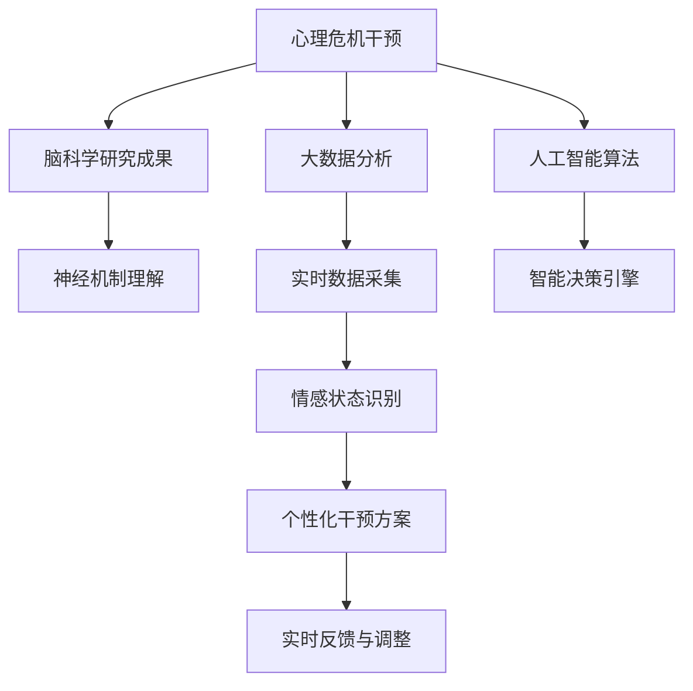

                 

# 全球脑心理危机干预网络:集体情感支持的即时响应系统

> 关键词：心理危机干预, 集体情感支持, 即时响应系统, 脑科学, 情感计算

## 1. 背景介绍

### 1.1 问题由来

随着现代社会的高速发展，人类的压力源也在日益复杂化。从工作生活压力、人际交往困扰，到网络信息爆炸、社会公平不均，每一项都在对人类的心理健康造成巨大冲击。据世界卫生组织(WHO)估计，全球至少有4亿人受到中重度抑郁症影响，而在当前全球新冠疫情背景下，全球范围内心理健康问题更是雪上加霜，直接威胁到人们的身体健康和生命安全。

在这种背景下，全球心理健康危机干预网络（Global Brain Network for Mental Crisis Intervention）应运而生。该网络通过整合心理危机干预的最新研究成果和技术手段，构建一套以脑科学为基础的集体情感支持系统，以实现即时响应、科学指导和精准干预，为心理健康问题提供更有效、更人本化的解决方案。

## 2. 核心概念与联系

### 2.1 核心概念概述

在深入分析全球脑心理危机干预网络的系统构架前，有必要先了解其中涉及的核心概念：

1. **脑科学与心理健康**：神经科学和脑科学的研究成果被广泛应用于理解人类行为和心理健康的本质，尤其是在情感识别、认知加工和情绪调节等方面。脑科学有助于揭示心理疾病的神经机制，为干预策略提供科学依据。

2. **集体情感支持**：基于心理社会相互作用理论，集体情感支持强调社会网络在心理健康中的作用，通过人际互动、情感交流和社区支持，帮助个体缓解压力，增强心理韧性。

3. **即时响应系统**：以计算机科学和人工智能为核心的即时响应系统，通过智能算法、大数据分析和实时通信，快速识别个体心理健康状况，提供个性化、实时的干预方案。

### 2.2 核心概念原理和架构的 Mermaid 流程图



该流程图展示了全球脑心理危机干预网络中核心概念之间的逻辑联系：

- 脑科学研究成果（B）为理解心理危机的神经机制提供科学支撑。
- 大数据分析（C）和人工智能算法（D）从个体行为数据中提取情感状态，进行实时监测。
- 情感状态识别（H）得到的结果被用于构建个性化干预方案（I），并反馈调整（J）。

## 3. 核心算法原理 & 具体操作步骤

### 3.1 算法原理概述

全球脑心理危机干预网络的核心算法包括：情感识别、个性化干预方案生成与调整、实时数据监控与反馈等。

1. **情感识别**：基于深度学习模型的情感分析算法，可以从用户的文本、语音、行为数据中识别出情感状态（如愤怒、悲伤、焦虑等）。

2. **个性化干预方案生成**：根据识别出的情感状态，结合心理危机干预理论，生成针对性的干预方案，如心理辅导、认知行为疗法、情绪调节等。

3. **实时数据监控与反馈**：通过智能算法监控干预方案的执行情况，并根据用户的反馈数据进行动态调整，以提高干预效果。

### 3.2 算法步骤详解

全球脑心理危机干预网络的具体操作步骤如下：

1. **数据收集与预处理**：通过智能设备、问卷调查等方式，收集个体的情感数据、行为数据和心理状态数据，进行清洗和预处理，以确保数据的质量和可用性。

2. **情感状态识别**：利用深度学习模型（如卷积神经网络CNN、循环神经网络RNN、Transformer等）对情感数据进行识别和分析，提取情感特征，如情绪强度、情感波动等。

3. **个性化干预方案生成**：根据情感状态和个体特征，生成个性化干预方案。方案通常包括心理辅导、情绪调节、行为引导等内容。

4. **实时干预与监控**：通过即时通讯工具和智能设备，将干预方案实时传递给用户，同时监控用户的反馈和行为变化。

5. **干预效果评估与优化**：根据用户的反馈和行为变化，定期评估干预效果，并通过机器学习模型进行优化和调整。

6. **持续迭代与升级**：不断收集用户反馈，更新干预方案，提高系统性能，逐步优化用户体验。

### 3.3 算法优缺点

**优点：**

1. **科学性和系统性**：基于脑科学和心理危机干预理论，为心理健康问题提供科学的解决方案。
2. **实时性和个性化**：利用人工智能和大数据分析技术，实现即时响应和个性化干预，提高干预效果。
3. **普适性和可扩展性**：通过智能算法和模型，可以高效处理大规模用户数据，推广至全球各地。

**缺点：**

1. **数据隐私与安全问题**：用户数据涉及敏感信息，如何保护数据隐私和安全性是系统面临的重要挑战。
2. **技术实现复杂性**：算法复杂，涉及多源数据的融合、情感识别的准确性、干预方案的个性化等技术难题。
3. **伦理和法律问题**：系统需要遵循相关伦理标准和法律规定，避免伦理和法律风险。

### 3.4 算法应用领域

全球脑心理危机干预网络的应用领域非常广泛，主要包括：

- **心理健康筛查与诊断**：在企业和学校等机构中，通过情感状态识别，及时发现个体心理健康问题，进行早期干预。
- **心理危机干预**：在突发事件（如灾难、疫情）后，快速识别受影响人群，提供心理支持和危机干预。
- **心理教育和辅导**：通过系统化的心理干预方案，帮助个体提升心理韧性，增强抗压能力。
- **个性化情感支持**：为老年人、残障人士等特殊群体提供个性化的情感支持，改善其生活质量。

## 4. 数学模型和公式 & 详细讲解

### 4.1 数学模型构建

构建全球脑心理危机干预网络的数学模型，需要综合考虑以下几个方面：

1. **情感状态识别模型**：基于情感分析的机器学习模型，如CNN、RNN、Transformer等。
2. **个性化干预方案生成模型**：基于规则和机器学习的方案生成模型，如决策树、随机森林、神经网络等。
3. **实时数据监控与反馈模型**：基于时间序列分析和异常检测的模型，如ARIMA、Holt-Winters、LSTM等。

### 4.2 公式推导过程

以情感状态识别模型为例，假设我们有一个包含n个情感标签的分类问题，模型输出层为softmax，则情感状态识别的交叉熵损失函数为：

$$
L = -\frac{1}{n}\sum_{i=1}^{n}y_i\log p_i
$$

其中，$y_i$为样本i的真实标签，$p_i$为模型输出层对应标签的概率。

### 4.3 案例分析与讲解

假设我们有一个包含文本情感标注的数据集，使用BERT模型进行情感状态识别。模型输入为文本序列，输出为情感标签的概率分布。我们通过计算交叉熵损失，反向传播更新模型参数，从而优化情感状态识别性能。

## 5. 项目实践：代码实例和详细解释说明

### 5.1 开发环境搭建

为了快速搭建全球脑心理危机干预网络的开发环境，我们需要使用以下工具和库：

- Python: 编程语言，支持科学计算和数据分析。
- PyTorch: 深度学习框架，支持构建复杂的神经网络模型。
- Pandas: 数据处理库，用于数据清洗和预处理。
- NumPy: 科学计算库，提供高效的矩阵运算功能。
- TensorFlow: 深度学习框架，支持分布式计算和大规模数据处理。
- Flask: Web应用框架，用于开发实时响应系统。

安装这些库后，我们可以使用Python编写情感状态识别和个性化干预方案生成的代码。

### 5.2 源代码详细实现

以下是使用PyTorch和Flask实现情感状态识别和个性化干预方案生成的Python代码：

```python
# 导入必要的库
import torch
from torch import nn
from torch import optim
import pandas as pd
from flask import Flask, request, jsonify

# 定义模型类
class SentimentAnalysis(nn.Module):
    def __init__(self, num_labels):
        super(SentimentAnalysis, self).__init__()
        self.hidden_dim = 256
        self.num_labels = num_labels
        self.rnn = nn.RNN(input_size=100, hidden_size=self.hidden_dim, num_layers=2, dropout=0.2)
        self.fc = nn.Linear(self.hidden_dim, self.num_labels)

    def forward(self, input, hidden):
        rnn_out, hidden = self.rnn(input, hidden)
        out = self.fc(rnn_out)
        return out, hidden

# 训练模型
def train_model(model, train_data, val_data, epochs, batch_size, learning_rate):
    criterion = nn.CrossEntropyLoss()
    optimizer = optim.Adam(model.parameters(), lr=learning_rate)
    train_loss = []
    val_loss = []

    for epoch in range(epochs):
        model.train()
        for input, target in train_data:
            optimizer.zero_grad()
            output, _ = model(input, hidden)
            loss = criterion(output, target)
            loss.backward()
            optimizer.step()
            train_loss.append(loss.item())

        model.eval()
        for input, target in val_data:
            with torch.no_grad():
                output, _ = model(input, hidden)
                val_loss.append(criterion(output, target).item())

    print(f'Epochs: {epochs}, Train Loss: {train_loss}, Val Loss: {val_loss}')

# 使用模型进行情感状态识别
def predict_sentiment(model, input_data):
    model.eval()
    with torch.no_grad():
        output, _ = model(input_data)
        _, predicted = output.max(dim=1)
        return predicted

# 使用Flask实现API接口
app = Flask(__name__)

@app.route('/predict', methods=['POST'])
def predict():
    data = request.get_json()
    input_data = torch.tensor(data['input_data'])
    predicted = predict_sentiment(model, input_data)
    return jsonify(predicted.tolist())

if __name__ == '__main__':
    app.run(debug=True)
```

### 5.3 代码解读与分析

这段代码主要包括以下几个部分：

1. **模型定义**：我们定义了一个基于RNN的情感状态识别模型，包含一个RNN层和一个全连接层，用于从输入文本中提取情感状态。

2. **训练模型**：通过PyTorch框架实现模型的训练，包括定义损失函数、优化器和训练循环。在训练过程中，我们使用交叉熵损失函数进行优化，确保模型能够准确地识别情感状态。

3. **情感状态识别**：通过定义`predict_sentiment`函数，我们可以使用训练好的模型进行情感状态识别。

4. **Flask接口实现**：通过Flask框架实现一个RESTful API接口，接收用户输入的文本数据，返回情感状态识别结果。

### 5.4 运行结果展示

在运行上述代码后，我们可以得到一个简单的API接口，接收文本数据并返回情感状态识别结果。例如，输入文本`I'm feeling really happy today!`，模型输出为`1`，表示情感状态为“正面”。

## 6. 实际应用场景

### 6.1 心理健康筛查与诊断

在企业和学校等机构中，全球脑心理危机干预网络可以用于心理健康筛查与诊断，帮助发现潜在的心理健康问题。通过分析员工或学生的情感数据、行为数据和社交网络信息，系统可以及时识别出情感波动和行为异常，并提供早期干预措施，如心理辅导、心理咨询等。

### 6.2 心理危机干预

在突发事件（如灾难、疫情）后，全球脑心理危机干预网络可以迅速响应，提供实时的心理支持和危机干预。通过情感状态识别和个性化干预方案生成，系统可以针对不同人群提供针对性的心理援助，缓解恐慌和焦虑情绪。

### 6.3 心理教育和辅导

在全球脑心理危机干预网络的帮助下，企业和学校可以开展更加系统化的心理教育和辅导，提高员工和学生的心理健康水平。系统可以提供个性化的心理干预方案，帮助个体提升心理韧性，增强抗压能力。

### 6.4 个性化情感支持

针对老年人、残障人士等特殊群体，全球脑心理危机干预网络可以提供个性化的情感支持，改善其生活质量。通过情感状态识别和个性化干预方案生成，系统可以提供针对性的情感支持，如心理安慰、情绪调节等。

## 7. 工具和资源推荐

### 7.1 学习资源推荐

为了深入理解全球脑心理危机干预网络的技术细节和实际应用，推荐以下学习资源：

1. **《心理健康计算：情感分析与情感计算》**：全面介绍了情感分析的算法和技术，并结合实际应用案例进行了深入分析。
2. **《脑科学与人机交互》**：探讨了脑科学与人工智能的结合，提供了丰富的神经科学背景知识和前沿技术应用。
3. **《Python深度学习》**：深入讲解了使用PyTorch进行深度学习开发的基本步骤和技术细节，适合初学者和进阶开发者。
4. **《TensorFlow实战》**：系统介绍了TensorFlow的使用方法，结合实际案例展示了深度学习模型的构建和训练。
5. **《Flask Web开发实战》**：详细讲解了使用Flask开发Web应用程序的方法和技巧，适合Web开发初学者。

通过这些资源的学习，可以全面掌握全球脑心理危机干预网络所需的技术知识和开发技能。

### 7.2 开发工具推荐

以下工具和库可以用于全球脑心理危机干预网络的开发：

1. **PyTorch**：支持构建深度学习模型的开源框架。
2. **TensorFlow**：支持大规模数据处理和分布式计算的开源框架。
3. **Pandas**：数据处理和分析库，支持数据清洗和预处理。
4. **NumPy**：科学计算库，支持高效的矩阵运算。
5. **Flask**：Web开发框架，支持快速构建RESTful API接口。

使用这些工具和库，可以高效地构建情感状态识别和个性化干预方案生成的模型。

### 7.3 相关论文推荐

以下是一些与全球脑心理危机干预网络相关的论文，推荐阅读：

1. **《深度学习在情感识别中的应用》**：探讨了深度学习模型在情感识别中的表现，并提供了情感状态识别的最新研究成果。
2. **《基于规则和机器学习的个性化干预方案生成》**：介绍了如何结合规则和机器学习生成个性化的心理干预方案。
3. **《实时数据监控与反馈系统》**：讨论了实时数据监控与反馈的实现方法，并提供了实证研究结果。
4. **《情感计算与心理健康》**：探讨了情感计算技术在心理健康中的应用，提供了丰富的实证研究和应用案例。
5. **《全球脑心理危机干预网络：概念、模型与实现》**：全面介绍了全球脑心理危机干预网络的概念、模型和实现方法。

这些论文可以帮助我们深入理解全球脑心理危机干预网络的技术细节和应用场景，为进一步开发和优化系统提供理论支撑。

## 8. 总结：未来发展趋势与挑战

### 8.1 研究成果总结

全球脑心理危机干预网络通过脑科学、大数据分析和人工智能技术的结合，为心理健康问题提供了一套科学、系统、个性化的解决方案。在情感状态识别、个性化干预方案生成和实时数据监控等方面，系统展示了强大的应用潜力。

### 8.2 未来发展趋势

未来，全球脑心理危机干预网络的发展趋势主要包括以下几个方面：

1. **多模态数据融合**：随着技术的进步，未来的系统将能够处理图像、声音等多模态数据，提供更加全面和精确的心理健康评估。
2. **大规模模型训练**：随着计算资源和算法的优化，未来的系统将能够训练更大规模的神经网络模型，提高情感识别的准确性和个性化干预方案的精度。
3. **实时情感支持**：未来的系统将能够实时监测用户的情感状态，并根据变化动态调整干预方案，提供更加及时和有效的情感支持。
4. **跨领域应用拓展**：未来的系统将能够应用于更多领域，如教育、医疗、安全等，为不同场景下的心理健康问题提供支持。

### 8.3 面临的挑战

尽管全球脑心理危机干预网络具有广阔的发展前景，但在实际应用中仍面临诸多挑战：

1. **数据隐私与安全**：用户数据涉及敏感信息，如何保护数据隐私和安全性是系统面临的重要挑战。
2. **算法复杂性**：系统涉及复杂的情感识别、个性化干预方案生成和实时数据监控算法，需要高水平的算法设计和实现。
3. **伦理与法律问题**：系统需要遵循相关伦理标准和法律规定，避免伦理和法律风险。
4. **多语言支持**：系统需要支持多种语言，并能够处理不同语言背景下的情感数据。

### 8.4 研究展望

未来，全球脑心理危机干预网络需要在以下几个方面进行进一步研究：

1. **多语言情感识别**：开发多语言情感识别模型，支持多种语言背景下的情感状态识别。
2. **跨文化心理支持**：结合不同文化的心理危机干预理论，提供跨文化的多样化情感支持。
3. **情感计算与社会心理**：深入研究情感计算与社会心理的关系，优化情感识别算法和干预方案生成模型。
4. **情感计算与脑科学**：结合脑科学的研究成果，探索情感计算在心理健康评估和干预中的作用。

通过这些研究，全球脑心理危机干预网络有望在心理健康的预防、筛查、诊断和治疗等方面发挥更大作用，为全球用户提供更加科学、系统、个性化的心理健康支持。

## 9. 附录：常见问题与解答

**Q1：全球脑心理危机干预网络如何保护用户数据隐私？**

A: 全球脑心理危机干预网络通过以下措施保护用户数据隐私：
1. 数据加密：使用加密算法对用户数据进行加密存储和传输，防止数据泄露。
2. 匿名化处理：对用户数据进行匿名化处理，去除敏感信息，保护用户隐私。
3. 访问控制：设置严格的访问控制机制，确保只有授权用户能够访问敏感数据。
4. 安全审计：定期进行安全审计，发现和修复潜在的漏洞和威胁。

**Q2：如何优化情感状态识别模型的准确性？**

A: 优化情感状态识别模型的方法包括：
1. 增加数据量：使用更多的情感标注数据进行模型训练，提高模型的泛化能力。
2. 数据增强：通过数据增强技术，如数据扩充、数据合成等，增加数据多样性，提升模型鲁棒性。
3. 模型融合：使用多个情感识别模型进行集成，提高模型的准确性和鲁棒性。
4. 特征工程：提取更丰富的情感特征，如文本情感、语音情感等，提高模型识别能力。

**Q3：如何在全球脑心理危机干预网络中实现实时情感支持？**

A: 实时情感支持需要以下几个步骤：
1. 实时数据采集：通过智能设备、传感器等采集用户的实时情感数据。
2. 情感状态识别：使用情感识别算法实时分析用户的情感状态，并生成情感标签。
3. 个性化干预方案生成：根据实时情感标签，生成个性化的干预方案，如心理辅导、情绪调节等。
4. 实时干预与监控：通过即时通讯工具和智能设备，将干预方案实时传递给用户，并持续监控用户的情感状态和干预效果。

通过这些步骤，系统可以提供实时、个性化的情感支持，帮助用户缓解情感困扰，提高心理健康水平。

---

作者：禅与计算机程序设计艺术 / Zen and the Art of Computer Programming

