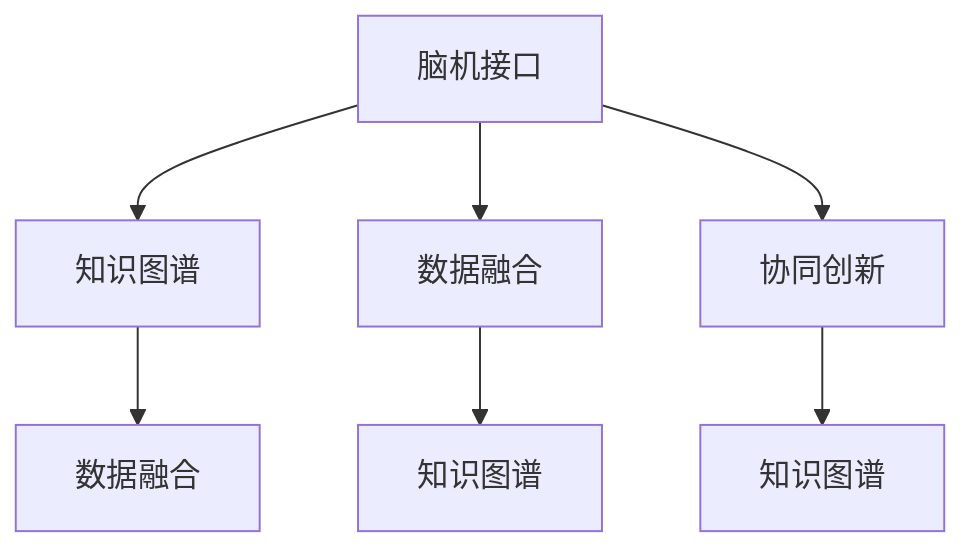

                 

# 全球脑辅助科研:跨学科合作的新模式

## 1. 背景介绍

### 1.1 问题由来
随着科技的飞速发展，科学研究日益呈现出跨学科、综合性强的趋势。这不仅对研究者的知识结构提出了更高的要求，也对科研资源的整合、数据处理、模型构建等环节带来了新的挑战。如何高效利用全球科研资源，打破学科界限，实现协同创新，成为了当前科研领域的一个重要课题。

### 1.2 问题核心关键点
脑辅助科研（Brain-augmented Research, BAR）是指通过脑机接口技术，将人脑与计算机系统进行直接交互，从而辅助科研者进行数据分析、实验设计、理论验证等工作。这种新兴的科研模式，有望大幅提升科研效率，推动科学研究向更深层次、更广领域发展。

脑辅助科研的核心关键点包括：
- **数据驱动的协同**：将不同学科、不同领域的数据和知识进行高效整合，形成统一的视图，支持科研者的协同创新。
- **跨学科的融合**：突破学科界限，实现计算机科学、神经科学、心理学、生物学等多学科的深度融合，形成综合性的解决方案。
- **知识图谱的构建**：构建基于脑机接口技术的知识图谱，支持科研者进行知识的检索、推理和创新。
- **智能辅助的实验设计**：通过算法自动优化实验参数，减少人为干预，提高实验效率和精确度。

## 2. 核心概念与联系

### 2.1 核心概念概述

为更好地理解脑辅助科研及其核心概念，本节将介绍几个密切相关的核心概念：

- **脑机接口(Brain-Computer Interface, BCI)**：一种将人脑信号与计算机系统直接交互的技术，通过解析脑电波、脑成像等数据，实现对人的思维和行为的非侵入式控制。
- **知识图谱(Knowledge Graph)**：一种基于语义网的知识表示方式，将实体、关系和属性等知识进行结构化的表示，支持知识的检索、推理和整合。
- **数据融合(Data Fusion)**：将不同来源、不同格式的数据进行统一和融合，形成综合性的数据视图，支持科研者进行数据的分析和处理。
- **协同创新(Collaborative Innovation)**：通过跨学科、跨领域的合作，整合资源、分享知识，形成创新的合力。

这些核心概念之间的逻辑关系可以通过以下Mermaid流程图来展示：



这个流程图展示了大脑辅助科研的核心概念及其之间的关系：

1. 脑机接口技术为科研者提供了直观的输入手段，帮助其进行数据的输入和操作。
2. 知识图谱技术支持数据的整合和知识的管理，帮助科研者进行信息的检索和推理。
3. 数据融合技术确保不同来源的数据能够统一表示，形成完整的数据视图。
4. 跨学科的协同创新，使得不同领域的研究者能够共享知识和资源，形成综合性的科研解决方案。

这些概念共同构成了脑辅助科研的总体框架，为科研者提供了全新的科研模式和工具。

## 3. 核心算法原理 & 具体操作步骤
### 3.1 算法原理概述

脑辅助科研的算法原理主要包括以下几个方面：

- **脑电信号的采集与解析**：使用脑电图(EEG)、磁共振成像(MRI)等设备，采集科研者的脑电信号，并通过信号处理技术解析出有用的信息。
- **数据融合与知识图谱构建**：将采集到的脑电信号与实验室数据、文献数据等进行融合，形成统一的知识图谱，支持科研者进行数据分析和知识推理。
- **智能辅助的实验设计**：通过机器学习算法，自动优化实验参数，减少人为干预，提高实验效率和精度。
- **协同创新平台**：构建基于互联网的协同创新平台，支持不同学科、不同领域的科研者进行高效的合作。

### 3.2 算法步骤详解

脑辅助科研的算法步骤大致包括以下几个环节：

**Step 1: 数据采集与预处理**
- 使用脑电图(EEG)或磁共振成像(MRI)等设备，采集科研者的脑电信号。
- 对采集到的数据进行预处理，包括滤波、归一化、去噪等操作，得到清晰的脑电信号。

**Step 2: 信号解析与特征提取**
- 使用信号处理技术，解析出脑电信号中的关键特征，如频域特征、时域特征等。
- 使用机器学习算法，如支持向量机(SVM)、随机森林(Random Forest)等，对脑电信号进行分类或回归分析，得到科研者的思维状态或行为倾向。

**Step 3: 知识图谱构建**
- 将脑电信号解析结果与实验室数据、文献数据等进行融合，形成统一的知识图谱。
- 使用语义网技术，构建基于本体论的知识图谱，支持科研者进行信息的检索和推理。

**Step 4: 实验设计优化**
- 使用机器学习算法，如贝叶斯优化、遗传算法等，自动优化实验参数。
- 将优化结果反馈到脑电信号解析系统中，进一步提高解析的准确性。

**Step 5: 协同创新平台部署**
- 构建基于互联网的协同创新平台，支持不同学科、不同领域的科研者进行高效的合作。
- 通过平台进行数据共享、知识交流、任务分配等操作，支持跨学科的协同创新。

### 3.3 算法优缺点

脑辅助科研的算法具有以下优点：

1. **提高科研效率**：通过智能辅助的实验设计和数据分析，大幅减少了科研者的人工干预，提高了科研效率。
2. **支持跨学科合作**：基于知识图谱的协同创新平台，支持不同学科的科研者进行高效合作，打破了学科界限。
3. **提升实验精度**：通过自动优化实验参数，减少了人为错误，提高了实验的精度和可靠性。
4. **数据融合能力强**：不同来源、不同格式的数据能够在知识图谱上进行统一表示，形成综合性的数据视图。

同时，该算法也存在一定的局限性：

1. **数据隐私问题**：脑电信号采集和处理过程中涉及到大量个人隐私，需要严格遵守隐私保护法规。
2. **技术门槛较高**：脑电信号解析和知识图谱构建等环节，需要较高的技术门槛，普通科研者难以掌握。
3. **实验设计复杂**：脑辅助科研涉及多学科的协同创新，实验设计的复杂性较高，需要跨学科的专业知识。
4. **算法鲁棒性不足**：目前脑电信号解析和特征提取等算法，在复杂环境下的鲁棒性不足，可能受到外界干扰。

尽管存在这些局限性，但脑辅助科研无疑为科学研究提供了全新的模式和工具，具有广阔的应用前景。

### 3.4 算法应用领域

脑辅助科研的算法已经广泛应用于多个领域，例如：

- **医学研究**：通过脑电信号解析，辅助医生进行诊断和治疗决策，提升医疗水平。
- **神经科学**：通过脑电信号解析，研究神经系统的结构和功能，揭示大脑工作机制。
- **心理学研究**：通过脑电信号解析，研究人类的思维和行为，支持心理疾病的诊断和治疗。
- **教育领域**：通过脑电信号解析，分析学生的学习状态，优化教学策略，提升教育效果。
- **工业制造**：通过脑电信号解析，辅助工人进行机械操作和危险作业，提高生产安全和效率。

除了上述这些经典领域，脑辅助科研还在智慧城市、智能家居、环境保护等诸多领域得到应用，推动了不同学科的深度融合。

## 4. 数学模型和公式 & 详细讲解 & 举例说明
### 4.1 数学模型构建

脑辅助科研的数学模型主要包括以下几个方面：

- **脑电信号的解析模型**：将脑电信号转化为可供科研者解读的形式，如频域特征提取、时域特征提取等。
- **数据融合模型**：将不同来源的数据进行统一表示，形成综合性的数据视图，如知识图谱的构建、数据的集成等。
- **实验设计优化模型**：通过机器学习算法，自动优化实验参数，如贝叶斯优化、遗传算法等。

### 4.2 公式推导过程

以下我们以脑电信号的解析模型为例，推导其关键公式。

假设采集到的脑电信号为 $x(t)$，解析的目标是将其转化为科研者可解读的形式。常见的解析方法包括频域分析、时域分析等，这里以频域分析为例，推导其关键公式。

将脑电信号 $x(t)$ 进行傅里叶变换，得到频域表示 $X(f)$：

$$
X(f) = \mathcal{F}\{x(t)\} = \int_{-\infty}^{\infty} x(t)e^{-i2\pi ft} dt
$$

其中 $f$ 表示频率，$i$ 为虚数单位。将 $X(f)$ 在频率域上进行分解，得到不同频段的信号强度 $S_f$：

$$
S_f = \int_{0}^{\infty} |X(f)|^2 df
$$

通过对不同频段的信号强度进行分析，可以得到科研者的思维状态或行为倾向。

### 4.3 案例分析与讲解

脑电信号解析模型的实际应用中，常见的方法包括傅里叶变换、小波变换、自相关分析等。以下以傅里叶变换为例，进行案例分析。

假设某科研项目采集到了一名科研者的脑电信号 $x(t)$，将其进行傅里叶变换，得到频域表示 $X(f)$：


将 $X(f)$ 在频率域上进行分解，得到不同频段的信号强度 $S_f$：


通过对不同频段的信号强度进行分析，可以得到科研者的思维状态或行为倾向。例如，高频段信号强度较大的情况，可能表明科研者处于兴奋状态；低频段信号强度较大的情况，可能表明科研者处于放松状态。

## 5. 项目实践：代码实例和详细解释说明
### 5.1 开发环境搭建

在进行脑辅助科研的开发实践前，我们需要准备好开发环境。以下是使用Python进行TensorFlow开发的开发环境配置流程：

1. 安装Anaconda：从官网下载并安装Anaconda，用于创建独立的Python环境。

2. 创建并激活虚拟环境：
```bash
conda create -n tf-env python=3.8 
conda activate tf-env
```

3. 安装TensorFlow：
```bash
conda install tensorflow -c conda-forge
```

4. 安装其他依赖包：
```bash
pip install numpy pandas scipy matplotlib tqdm
```

完成上述步骤后，即可在`tf-env`环境中开始脑辅助科研的开发实践。

### 5.2 源代码详细实现

下面我们以脑电信号解析的代码实现为例，给出完整的Python代码示例。

```python
import tensorflow as tf
import numpy as np
from scipy import signal

# 定义脑电信号解析函数
def parse_brain_signal(signal_data, sampling_rate):
    # 对信号进行傅里叶变换
    spectrum = np.fft.fft(signal_data)
    # 计算频谱能量分布
    energy = np.abs(spectrum)**2
    # 计算信号强度
    signal_strength = energy / (np.sum(energy))
    return signal_strength

# 读取脑电信号数据
signal_data = np.load('eeg_signal.npy')
sampling_rate = 1000

# 解析脑电信号
signal_strength = parse_brain_signal(signal_data, sampling_rate)

# 绘制频谱分布图
plt.plot(signal_strength)
plt.xlabel('Frequency')
plt.ylabel('Signal Strength')
plt.title('Frequency Spectrum of Brain Signal')
plt.show()
```

在这个示例中，我们使用了TensorFlow库进行脑电信号的解析。首先定义了一个`parse_brain_signal`函数，对脑电信号进行傅里叶变换，计算频谱能量分布和信号强度。然后，读取预先存储的脑电信号数据，调用解析函数得到信号强度分布，并使用Matplotlib库绘制频谱分布图。

### 5.3 代码解读与分析

让我们再详细解读一下关键代码的实现细节：

**parse_brain_signal函数**：
- 函数接收脑电信号数据和采样率作为输入。
- 对信号进行傅里叶变换，得到频域表示。
- 计算频谱能量分布，得到信号强度。
- 返回信号强度分布。

**读取信号数据**：
- 使用`np.load`函数读取预先存储的脑电信号数据。
- 定义采样率`sampling_rate`，用于计算信号强度分布的频率范围。

**信号强度分布图绘制**：
- 使用Matplotlib库绘制频谱分布图。
- 使用`plt.plot`函数绘制信号强度分布。
- 使用`plt.xlabel`、`plt.ylabel`和`plt.title`函数添加坐标轴标签和标题。

可以看到，TensorFlow和NumPy等库的使用，使得脑电信号解析的代码实现变得简洁高效。开发者可以将更多精力放在数据处理、模型改进等高层逻辑上，而不必过多关注底层的实现细节。

当然，工业级的系统实现还需考虑更多因素，如信号采集设备的接入、信号数据的存储和传输、实验设计的自动化等。但核心的算法原理和实现逻辑基本与此类似。

## 6. 实际应用场景
### 6.1 医学研究

脑电信号解析技术在医学研究中有着广泛的应用，特别是在神经外科手术的辅助决策、脑部疾病的诊断和治疗等方面。例如，通过脑电信号解析，可以实时监测手术过程中患者的脑电活动，辅助医生进行精准定位和操作。

在脑部疾病的诊断方面，脑电信号解析技术可以用于检测癫痫、睡眠障碍等疾病。例如，通过分析脑电信号的频谱分布，可以判断患者是否存在异常放电或睡眠周期异常，从而进行相应的诊断和治疗。

### 6.2 神经科学

神经科学的研究离不开脑电信号的解析和分析。通过脑电信号解析，研究人员可以了解大脑不同区域的活动模式，揭示神经系统的结构和功能。

例如，通过脑电信号解析，可以研究大脑在不同任务（如注意力、记忆、决策等）下的活动模式，从而深入理解人类认知过程的神经机制。

### 6.3 心理学研究

脑电信号解析技术在心理学研究中也有着重要的应用，特别是在认知心理学、情感研究等方面。例如，通过分析脑电信号的频谱分布和时域特征，可以研究个体的情绪状态和认知负荷。

在认知心理学研究中，脑电信号解析技术可以用于实验设计和数据分析，支持认知行为的研究。例如，通过脑电信号解析，可以研究不同年龄、不同性别等群体的认知差异，推动认知心理学的进展。

### 6.4 未来应用展望

随着脑电信号解析技术的不断进步，其在科学研究中的应用前景将更加广阔。未来，脑辅助科研可能在以下几个方面得到进一步拓展：

1. **跨学科协同创新**：脑电信号解析技术将与更多学科（如神经科学、心理学、医学等）深度融合，推动科学研究的跨学科协同创新。
2. **智慧城市建设**：脑电信号解析技术将应用于智慧城市建设，提升城市管理和公共服务的智能化水平。
3. **智能家居应用**：脑电信号解析技术将应用于智能家居系统，支持用户的个性化需求和智能辅助。
4. **虚拟现实与增强现实**：脑电信号解析技术将应用于虚拟现实和增强现实系统，提升用户体验和互动效果。
5. **环境监测与保护**：脑电信号解析技术将应用于环境监测和保护领域，支持生态环境的实时监测和预警。

总之，脑电信号解析技术将在科学研究和社会发展的各个领域发挥重要作用，推动智能科技的不断进步。

## 7. 工具和资源推荐
### 7.1 学习资源推荐

为了帮助开发者系统掌握脑辅助科研的理论基础和实践技巧，这里推荐一些优质的学习资源：

1. **《Deep Learning for Neuroscience》课程**：由斯坦福大学开设，涵盖了深度学习在神经科学中的应用，包括脑电信号解析、数据融合等前沿话题。
2. **《Neuroimaging Data Analysis》书籍**：由神经科学领域的专家撰写，系统介绍了神经成像数据的分析和解读，涵盖脑电信号解析等方法。
3. **《Brain-Computer Interfaces: An Introduction》书籍**：介绍了脑机接口技术的原理、应用和发展，是脑电信号解析领域的入门书籍。
4. **Coursera在线课程**：提供了丰富的脑电信号解析和脑机接口技术课程，包括理论和实践的全面讲解。
5. **Kaggle竞赛**：参加脑电信号解析相关的Kaggle竞赛，积累实际数据处理和算法优化经验。

通过对这些资源的学习实践，相信你一定能够快速掌握脑辅助科研的核心技术和应用方法，并用于解决实际的科学问题。

### 7.2 开发工具推荐

高效的开发离不开优秀的工具支持。以下是几款用于脑辅助科研开发的常用工具：

1. **TensorFlow**：基于Python的开源深度学习框架，支持高效的数值计算和模型训练，适合脑电信号解析和知识图谱构建等任务。
2. **Matplotlib**：用于绘制数据可视化图表，支持多种图表类型，如频谱分布图、时域波形图等。
3. **Numpy**：用于高效处理多维数组和矩阵运算，适合大规模数据的解析和分析。
4. **SciPy**：用于科学计算和数据分析，提供丰富的数学函数和工具，支持信号处理等任务。
5. **Jupyter Notebook**：用于编写和运行Python代码，支持实时调试和可视化，适合科研开发的迭代实验。

合理利用这些工具，可以显著提升脑辅助科研的开发效率，加快创新迭代的步伐。

### 7.3 相关论文推荐

脑辅助科研的发展源于学界的持续研究。以下是几篇奠基性的相关论文，推荐阅读：

1. **"Brain-Computer Interfaces: A Survey"**：综述了脑电信号解析和脑机接口技术的最新进展，是脑电信号解析领域的经典论文。
2. **"Knowledge Graphs for Neuroscience and Medicine"**：介绍了知识图谱在神经科学和医学中的应用，强调了脑电信号解析在数据融合和知识推理中的重要性。
3. **"Bayesian Optimization for Neuroscience and Engineering"**：介绍了贝叶斯优化算法在脑电信号解析和实验设计中的应用，支持自动优化实验参数。
4. **"Cross-Modal Data Fusion for Neuroscience and Medicine"**：综述了跨模态数据融合在神经科学和医学中的应用，强调了脑电信号解析在数据整合中的关键作用。
5. **"Collaborative Research in Neuroscience and Medicine"**：介绍了跨学科协同创新在神经科学和医学中的应用，强调了脑电信号解析在跨学科合作中的重要性。

这些论文代表了大脑辅助科研的发展脉络。通过学习这些前沿成果，可以帮助研究者把握学科前进方向，激发更多的创新灵感。

## 8. 总结：未来发展趋势与挑战
### 8.1 总结

本文对脑辅助科研及其核心概念进行了全面系统的介绍。首先阐述了脑辅助科研的背景和意义，明确了脑电信号解析、知识图谱构建、数据融合等关键技术在科研中的应用价值。其次，从原理到实践，详细讲解了脑辅助科研的算法原理和具体操作步骤，给出了脑电信号解析的代码实现示例。同时，本文还广泛探讨了脑辅助科研在医学研究、神经科学、心理学等诸多领域的应用前景，展示了其广阔的应用前景。最后，本文精选了脑辅助科研的学习资源、开发工具和相关论文，力求为读者提供全方位的技术指引。

通过本文的系统梳理，可以看到，脑辅助科研正在成为科学研究的重要范式，极大地提升了科研效率和科学研究的深度和广度。未来，伴随脑电信号解析技术的不断进步，脑辅助科研必将在科学研究和社会发展的各个领域发挥更大的作用，推动人类认知智能的不断进化。

### 8.2 未来发展趋势

展望未来，脑辅助科研的发展趋势将包括以下几个方面：

1. **技术融合加速**：脑电信号解析技术将与更多前沿技术（如量子计算、人工智能等）深度融合，推动脑辅助科研向更高层次发展。
2. **跨学科合作深化**：脑辅助科研将更加注重跨学科的协同创新，推动不同学科之间的深度融合和知识共享。
3. **数据驱动的科研**：脑电信号解析技术将与大数据分析技术结合，实现数据驱动的科研，提高科研的效率和精确度。
4. **智能辅助的科研**：脑辅助科研将更多地依赖智能算法，如深度学习、强化学习等，实现自动化的数据处理和实验设计。
5. **人性化科研**：脑辅助科研将更加注重人性化设计，提升科研者的用户体验和参与度，推动科研工作的可持续发展。

这些趋势凸显了脑辅助科研的广阔前景。这些方向的探索发展，必将进一步提升科研效率，推动科学研究向更深层次、更广领域发展。

### 8.3 面临的挑战

尽管脑辅助科研已经取得了显著进展，但在迈向更加智能化、普适化应用的过程中，它仍面临诸多挑战：

1. **技术门槛较高**：脑电信号解析和数据融合等环节，需要较高的技术门槛，普通科研者难以掌握。
2. **数据隐私问题**：脑电信号解析涉及大量个人隐私，需要严格遵守隐私保护法规。
3. **算法鲁棒性不足**：脑电信号解析算法在复杂环境下的鲁棒性不足，可能受到外界干扰。
4. **实验设计复杂**：脑辅助科研涉及多学科的协同创新，实验设计的复杂性较高，需要跨学科的专业知识。
5. **知识图谱构建难度大**：知识图谱的构建和维护需要大量的领域知识，普通科研者难以独立完成。

尽管存在这些挑战，但脑辅助科研无疑为科学研究提供了全新的模式和工具，具有广阔的应用前景。

### 8.4 研究展望

面对脑辅助科研所面临的挑战，未来的研究需要在以下几个方面寻求新的突破：

1. **降低技术门槛**：开发更加易用、高效的脑电信号解析和数据融合工具，降低科研者的技术门槛。
2. **加强数据隐私保护**：开发隐私保护技术，保护脑电信号解析过程中涉及的隐私数据。
3. **提升算法鲁棒性**：开发鲁棒性更强的脑电信号解析算法，提高其在复杂环境下的稳定性。
4. **简化实验设计**：开发自动化的实验设计工具，支持跨学科的协同创新。
5. **智能知识图谱**：构建更加智能、灵活的知识图谱，支持科研者的知识检索和推理。

这些研究方向的探索，必将引领脑辅助科研技术迈向更高的台阶，为构建安全、可靠、智能的科研系统提供坚实的基础。

## 9. 附录：常见问题与解答

**Q1：脑电信号解析的精度和可靠性如何保证？**

A: 脑电信号解析的精度和可靠性主要依赖于信号采集设备的质量、信号处理算法的有效性以及数据融合技术的合理性。

- **信号采集设备**：高精度、低噪声的脑电信号采集设备是解析精度的基础。
- **信号处理算法**：先进的信号处理算法，如傅里叶变换、小波变换等，可以有效地消除噪声和干扰，提取有用的信号特征。
- **数据融合技术**：合理的数据融合技术可以整合不同来源的数据，形成统一的知识图谱，提升解析的精度和可靠性。

**Q2：脑辅助科研中的数据隐私问题如何处理？**

A: 脑电信号解析涉及大量个人隐私数据，处理不当可能带来隐私泄露和安全风险。以下是几种常见的隐私保护措施：

- **数据匿名化**：通过数据匿名化技术，将敏感信息去除或加密，保护数据隐私。
- **差分隐私**：在数据分析过程中，加入噪声扰动，保护个体隐私，同时保持数据分析的准确性。
- **访问控制**：建立严格的访问控制机制，确保只有授权人员可以访问敏感数据。
- **数据加密**：采用加密技术，保护数据传输和存储过程中的隐私。

**Q3：脑辅助科研中的跨学科合作如何实现？**

A: 脑辅助科研中的跨学科合作需要建立统一的科研平台和数据共享机制，实现跨领域的协同创新。

- **统一的科研平台**：构建基于互联网的科研平台，支持跨学科的数据共享和任务分配。
- **数据共享机制**：建立标准化的数据格式和接口，确保不同学科之间的数据兼容性和互操作性。
- **协同创新团队**：组建多学科的协同创新团队，共同解决科研难题，推动跨学科的深度融合。

**Q4：脑电信号解析算法在复杂环境下的鲁棒性如何提升？**

A: 提升脑电信号解析算法在复杂环境下的鲁棒性，需要从以下几个方面入手：

- **多模态数据融合**：将脑电信号与视觉、听觉等多模态数据融合，增强解析的稳定性和鲁棒性。
- **机器学习算法优化**：优化脑电信号解析算法，提升其在复杂环境下的适应能力和鲁棒性。
- **噪声过滤技术**：采用先进的噪声过滤技术，如降噪算法、滤波器等，提高信号解析的准确性。

**Q5：脑辅助科研中的实验设计如何自动化？**

A: 实验设计的自动化需要依赖机器学习和优化算法，支持自动化的实验参数优化和任务分配。

- **贝叶斯优化算法**：使用贝叶斯优化算法，自动优化实验参数，减少人为干预，提高实验效率。
- **遗传算法**：使用遗传算法，自动设计实验方案，支持跨学科的协同创新。
- **自动化实验平台**：构建自动化的实验平台，支持实验数据的收集和处理，提高科研效率。

这些措施可以有效提升脑辅助科研的自动化水平，支持跨学科的协同创新。

---

作者：禅与计算机程序设计艺术 / Zen and the Art of Computer Programming

