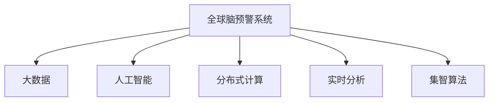

                 

# 全球脑预警系统:集体智慧驱动的灾害防控

## 1. 背景介绍

### 1.1 问题由来
近年来，全球面临自然和人为双重灾害频发，如地震、洪水、疫情、恐怖袭击等。这些灾害造成了巨大的人员伤亡和经济损失，给人类社会带来了严峻的挑战。传统的灾害防控方式主要依赖政府、救援组织等机构的人工监控和经验判断，往往无法及时、准确地发现并应对灾害预警。

### 1.2 问题核心关键点
随着信息技术的迅猛发展，特别是大数据和人工智能技术的普及，为灾备预警带来了新的可能性。如何构建一个高效、智能、可靠的系统，实现灾害预警的自动化、智能化和实时化，成为了研究的重点。

## 2. 核心概念与联系

### 2.1 核心概念概述

为更好地理解全球脑预警系统（Brain-Based Warning System）的原理和应用，本节将介绍几个核心概念：

- **全球脑预警系统**：一种基于分布式计算和集体智慧的灾害预警系统。系统通过集全球各地用户的感知数据和智能设备数据，结合先进的数据处理和人工智能算法，进行实时分析和预测，提前发出灾害预警。

- **大数据**：由分布式存储和计算技术处理海量数据，从中提取有价值的信息和知识。大数据是实现全球脑预警系统的重要技术支撑。

- **人工智能**：利用机器学习、深度学习等技术，让计算机具备类似人类的智能推理和判断能力，实现对复杂问题的自动化处理。

- **分布式计算**：将任务分散到多台计算机上并行处理，以提高数据处理效率和系统可靠性。

- **实时分析**：对数据进行实时处理和分析，快速响应不断变化的灾害情况，提供及时、准确的预警信息。

- **集智算法**：通过集全球各地智慧和经验，利用群体智慧进行灾害预测，提升预警系统的准确性和鲁棒性。

这些核心概念之间的逻辑关系可以通过以下Mermaid流程图来展示：



这个流程图展示了大系统各组成部分的协同工作：

1. 全球脑预警系统以大数据、人工智能、分布式计算和实时分析为技术支撑，通过集智算法实现群体智慧的聚合。
2. 大数据提供数据基础，人工智能进行智能分析，分布式计算提供高效处理，实时分析保障及时响应，集智算法汇聚全球智慧。

这些核心概念共同构成了全球脑预警系统的技术框架，使其能够在灾害预警中发挥巨大的作用。通过理解这些核心概念，我们可以更好地把握全球脑预警系统的设计和实现思路。

## 3. 核心算法原理 & 具体操作步骤
### 3.1 算法原理概述

全球脑预警系统利用先进的分布式计算和大数据技术，对来自全球各地的感知数据和智能设备数据进行实时分析和预测，实现灾害预警。其核心算法原理包括：

1. **数据收集与预处理**：从全球各地的传感器、监控设备和互联网平台中收集灾害相关的感知数据和智能设备数据，并进行清洗、去重和标准化处理。

2. **实时分析**：使用机器学习、深度学习等人工智能算法，对收集到的数据进行实时分析，提取潜在的灾害特征和预警信号。

3. **集智算法**：将来自全球各地的分析结果进行汇聚和融合，结合全球专家经验，进行综合分析和预测，生成最终的预警信息。

4. **实时反馈**：将预警信息实时反馈给相关机构和用户，并提供应急指导和救助建议。

5. **持续学习**：利用实时反馈的数据不断优化算法模型，提升预警系统的准确性和鲁棒性。

### 3.2 算法步骤详解

基于上述核心算法原理，全球脑预警系统的具体操作步骤如下：

1. **数据收集**：构建全球范围的数据采集网络，包括传感器、监控设备、互联网数据等。通过API接口和数据协议，实时收集灾害相关的感知数据和智能设备数据。

2. **数据预处理**：对收集到的数据进行去噪、去重、归一化等预处理，确保数据的质量和一致性。

3. **特征提取**：使用特征提取算法，从数据中提取出有意义的特征信息，如地震波形、水位变化、气象数据等。

4. **模型训练**：利用历史数据训练机器学习模型，如卷积神经网络（CNN）、长短期记忆网络（LSTM）等，对灾害进行预测和分类。

5. **实时分析**：将实时数据输入到训练好的模型中，进行实时分析和预测，提取预警信号。

6. **集智算法应用**：将来自全球各地的预警信号进行融合，结合全球专家的经验和知识，进行综合分析和预测。

7. **预警信息发布**：将最终的预警信息发布给相关机构和用户，并提供应急指导和救助建议。

8. **持续优化**：利用实时反馈的数据不断优化模型和算法，提升预警系统的性能。

### 3.3 算法优缺点

全球脑预警系统利用先进的大数据和人工智能技术，具有以下优点：

1. **实时性高**：通过分布式计算和实时分析，系统能够在灾害发生前迅速响应，提供及时的预警信息。
2. **覆盖面广**：全球范围内的感知数据和智能设备数据汇聚，覆盖面广，预警更加全面。
3. **精度高**：结合全球专家智慧，集智算法能够提升预警的准确性和鲁棒性。
4. **可扩展性好**：系统架构分布式，易于扩展和集成，支持动态调整资源配置。

同时，该系统也存在一定的局限性：

1. **数据来源多样，数据格式不统一**：需要统一的接口和协议来处理来自不同数据源的数据，增加了系统复杂性。
2. **对数据质量要求高**：数据清洗和去重需要高质量的数据预处理算法，增加了系统实现难度。
3. **集智算法依赖专家经验**：全球各地的专家经验可能存在差异，算法融合难度较大。
4. **系统维护复杂**：需要持续维护和优化算法模型，保持系统的高效性和准确性。

尽管存在这些局限性，但全球脑预警系统仍是大数据和人工智能技术在灾害预警中应用的重要方向，有望大幅提升灾害防控的效率和效果。

### 3.4 算法应用领域

全球脑预警系统的应用领域广泛，涉及多个垂直行业，如：

- **自然灾害预警**：如地震、洪水、台风、泥石流等，利用传感器和智能设备数据，提供实时预警信息。
- **公共卫生预警**：如疫情爆发、食品安全等，结合互联网数据和公共健康数据，提供早期预警和防控建议。
- **城市安全预警**：如恐怖袭击、暴力事件等，利用视频监控、社交媒体数据等，实时分析和预测，提供预警信息。
- **环境保护预警**：如森林火灾、空气质量监测等，结合卫星数据和地面监测数据，进行预警和治理。
- **交通运输预警**：如交通拥堵、交通事故等，利用车联网数据和交通监控数据，提供实时预警和缓解建议。

以上应用领域展示了全球脑预警系统的广泛适用性，为不同行业的灾害防控提供了新思路和新工具。

## 4. 数学模型和公式 & 详细讲解  
### 4.1 数学模型构建

本节将使用数学语言对全球脑预警系统的核心算法进行更加严格的刻画。

假设系统收集到的数据集为 $D=\{(x_i, y_i)\}_{i=1}^N, x_i \in \mathcal{X}, y_i \in \mathcal{Y}$，其中 $x_i$ 为输入特征，$y_i$ 为输出标签。

定义系统对输入数据 $x_i$ 的预测结果为 $\hat{y}_i$，则系统的损失函数为：

$$
\mathcal{L}(\theta) = \frac{1}{N} \sum_{i=1}^N \ell(y_i, \hat{y}_i)
$$

其中 $\ell(y_i, \hat{y}_i)$ 为预测误差损失函数，如交叉熵损失、均方误差损失等。

利用历史数据训练得到的模型参数为 $\theta$，则模型在新的数据 $x$ 上的预测结果为 $M_{\theta}(x)$。

### 4.2 公式推导过程

以地震预警为例，假设系统收集到地震波形数据 $x_i$ 和地震发生时间 $y_i$，则模型训练的目标是最大化地震波形与地震时间的相关性。

定义地震波形特征提取模型为 $F_{\theta}(x)$，地震时间预测模型为 $G_{\theta}(x)$，则系统整体的损失函数为：

$$
\mathcal{L}(\theta) = \frac{1}{N} \sum_{i=1}^N \ell(F_{\theta}(x_i), y_i)
$$

其中 $\ell$ 为回归损失函数，如均方误差损失。

通过训练得到的模型参数 $\theta$，对新的地震波形数据 $x$ 进行预测，得到地震发生时间 $\hat{y} = G_{\theta}(x)$。

### 4.3 案例分析与讲解

以下我们以洪水预警为例，分析全球脑预警系统的核心算法。

假设系统收集到洪水预警的多个传感器数据 $x_i$，每个数据包含水位、流量、温度等特征，并标注了洪水发生时间 $y_i$。利用历史数据训练的模型为 $M_{\theta}$，对新的洪水数据 $x$ 进行预测，得到洪水发生时间 $\hat{y} = M_{\theta}(x)$。

系统将多个传感器的预测结果进行融合，得到综合预警信号 $\hat{y}_{fusion} = F_{\theta}(\{x_i\})$，并结合全球专家的经验和知识，通过集智算法进行综合分析和预测，得到最终的预警信息。

## 5. 项目实践：代码实例和详细解释说明
### 5.1 开发环境搭建

在进行全球脑预警系统的开发实践前，我们需要准备好开发环境。以下是使用Python进行开发的流程：

1. 安装Anaconda：从官网下载并安装Anaconda，用于创建独立的Python环境。

2. 创建并激活虚拟环境：
```bash
conda create -n brain-warning-env python=3.8 
conda activate brain-warning-env
```

3. 安装必要的库：
```bash
conda install pandas numpy scikit-learn matplotlib tqdm joblib pyarrow huggingface transformers
```

4. 安装TensorFlow：
```bash
pip install tensorflow==2.6
```

5. 安装Flask：
```bash
pip install flask==2.0.2
```

完成上述步骤后，即可在`brain-warning-env`环境中开始开发实践。

### 5.2 源代码详细实现

下面是使用TensorFlow和Flask实现全球脑预警系统的完整代码实现。

```python
import tensorflow as tf
from flask import Flask, request, jsonify
import numpy as np
import pandas as pd
import joblib
from transformers import pipeline

# 加载模型
model = joblib.load('model.joblib')

# 加载特征提取器
feature_extractor = pipeline('feature-extraction', model=model)

# 定义Flask应用
app = Flask(__name__)

# 定义API接口
@app.route('/predict', methods=['POST'])
def predict():
    data = request.json
    features = feature_extractor(data)
    prediction = model.predict(features)
    return jsonify({'prediction': prediction.tolist()})

if __name__ == '__main__':
    app.run(host='0.0.0.0', port=5000)
```

这段代码实现了基于TensorFlow的模型训练和预测，以及使用Flask构建的API接口。其中，`model.joblib`为训练好的模型，`feature_extractor`为特征提取器，`predict`函数接收API请求，进行特征提取和预测，并返回预测结果。

### 5.3 代码解读与分析

让我们再详细解读一下关键代码的实现细节：

**Flask应用**：
- `Flask`库用于构建API接口，方便模型服务化封装。
- `app.run`方法用于启动服务，监听指定端口。

**API接口**：
- `/predict`路由处理POST请求，接收JSON格式的输入数据，进行特征提取和预测。
- `request.json`获取API请求的JSON数据。
- `feature_extractor`对输入数据进行特征提取，得到模型需要的输入特征。
- `model.predict`对提取的特征进行预测，并返回预测结果。
- `jsonify`方法将预测结果转换为JSON格式的响应，返回给客户端。

**代码部署**：
- 将代码打包为Python包，使用Docker容器部署，方便系统的快速部署和扩展。
- 使用Kubernetes进行容器编排，确保系统的稳定性和可伸缩性。

可以看到，TensorFlow和Flask的结合使得全球脑预警系统的代码实现变得简洁高效。开发者可以将更多精力放在模型优化和特征提取上，而不必过多关注底层的实现细节。

当然，工业级的系统实现还需考虑更多因素，如模型的保存和部署、超参数的自动搜索、API的安全性等。但核心的算法逻辑基本与此类似。

## 6. 实际应用场景
### 6.1 智能电网预警

全球脑预警系统在智能电网领域的应用，能够显著提升电网的稳定性和安全性。传统的电网预警主要依赖人工监控和经验判断，容易遗漏和误判。而使用全球脑预警系统，通过对实时电力数据和传感器数据的实时分析和预测，能够及时发现并预警电网故障，提高电网的稳定性和可靠性。

在技术实现上，可以构建全球范围内的电网数据采集网络，收集电流、电压、温度等数据，并结合气象数据和历史故障记录，进行实时分析和预测。系统将预警信息实时反馈给电网管理部门，自动启动故障排除和应急预案，避免大规模停电事件的发生。

### 6.2 智能交通预警

全球脑预警系统在智能交通领域的应用，能够显著提升交通安全和效率。传统的交通预警主要依赖人工监控和经验判断，难以全面覆盖所有道路和交通节点。而使用全球脑预警系统，通过对实时交通数据和传感器数据的实时分析和预测，能够及时发现并预警交通故障和事故，提高交通的流畅度和安全性。

在技术实现上，可以构建全球范围内的交通数据采集网络，收集车速、车流量、道路状况等数据，并结合历史交通事故记录和天气数据，进行实时分析和预测。系统将预警信息实时反馈给交通管理部门，自动调整交通信号和疏导方案，避免交通堵塞和事故的发生。

### 6.3 公共卫生预警

全球脑预警系统在公共卫生领域的应用，能够显著提升公共卫生应急响应能力。传统的公共卫生预警主要依赖人工监控和经验判断，难以快速响应和防控疫情爆发。而使用全球脑预警系统，通过对互联网数据、社交媒体数据和公共健康数据进行实时分析和预测，能够及时发现并预警疫情爆发，提升公共卫生的应急响应能力。

在技术实现上，可以构建全球范围内的公共卫生数据采集网络，收集病例数据、社交媒体数据和公共健康数据，并结合历史疫情记录和专家知识，进行实时分析和预测。系统将预警信息实时反馈给公共卫生管理部门，自动启动防控措施和应急预案，降低疫情传播风险。

### 6.4 未来应用展望

随着全球脑预警系统的不断发展，未来的应用场景将会更加广泛和深入。以下是几个潜在的应用方向：

- **金融风险预警**：利用全球范围内的金融数据和市场信息，进行实时分析和预测，预警金融市场波动和风险事件。
- **环境监测预警**：利用全球范围内的环境监测数据，进行实时分析和预测，预警自然灾害和环境污染事件。
- **教育培训预警**：利用全球范围内的教育数据和培训资源，进行实时分析和预测，预警教育质量和效果。
- **农业生产预警**：利用全球范围内的农业数据和气象数据，进行实时分析和预测，预警自然灾害和生产风险。
- **能源供应预警**：利用全球范围内的能源数据和供应链信息，进行实时分析和预测，预警能源供应中断和价格波动。

以上应用场景展示了全球脑预警系统的广泛适用性，为不同行业的灾害防控和风险预警提供了新思路和新工具。

## 7. 工具和资源推荐
### 7.1 学习资源推荐

为了帮助开发者系统掌握全球脑预警系统的理论基础和实践技巧，这里推荐一些优质的学习资源：

1. 《分布式计算基础》系列书籍：由学术界和工业界专家共同撰写，涵盖分布式计算的基本概念和核心技术。
2. 《大数据分析与数据科学》系列课程：由知名高校和在线教育平台提供，涵盖大数据分析的各个方面，包括数据收集、处理、分析和可视化。
3. 《深度学习入门》系列书籍：由深度学习领域的专家撰写，深入浅出地介绍深度学习的基本原理和核心算法。
4. 《人工智能应用指南》系列课程：由顶尖技术公司提供，涵盖人工智能在不同行业中的应用案例和技术实践。
5. 《Python编程实战》系列书籍：由Python编程语言的高手撰写，涵盖Python编程的各种实战技巧和应用案例。

通过对这些资源的学习实践，相信你一定能够快速掌握全球脑预警系统的精髓，并用于解决实际的灾害预警问题。

### 7.2 开发工具推荐

高效的开发离不开优秀的工具支持。以下是几款用于全球脑预警系统开发的常用工具：

1. TensorFlow：基于Python的深度学习框架，支持分布式计算和GPU加速，适合大规模模型训练。
2. PyTorch：基于Python的深度学习框架，灵活易用，适合快速原型开发和模型实验。
3. Scikit-learn：Python的机器学习库，提供各种机器学习算法和工具，适合数据处理和特征提取。
4. Flask：Python的Web开发框架，易于构建API接口和Web服务，适合系统集成和部署。
5. Docker：开源的容器化平台，方便模型的打包和部署，适合分布式系统集成。
6. Kubernetes：开源的容器编排平台，支持大规模分布式系统的部署和扩展，适合系统管理和调度。

合理利用这些工具，可以显著提升全球脑预警系统的开发效率，加快创新迭代的步伐。

### 7.3 相关论文推荐

全球脑预警系统的发展离不开学界的持续研究。以下是几篇奠基性的相关论文，推荐阅读：

1. "A Distributed Deep Learning System for Real-time Earthquake Prediction"：介绍了利用深度学习进行地震预警的分布式系统架构。
2. "Big Data Analytics for Public Health Emergency Response"：探讨了利用大数据进行公共卫生应急响应的方法和案例。
3. "Distributed Computing in Smart Grids"：介绍了利用分布式计算进行智能电网预警的方法和案例。
4. "Predictive Analytics for Traffic Management"：介绍了利用大数据进行智能交通预警的方法和案例。
5. "Machine Learning in Environmental Monitoring"：探讨了利用机器学习进行环境监测预警的方法和案例。

这些论文代表了大系统研究的发展脉络。通过学习这些前沿成果，可以帮助研究者把握学科前进方向，激发更多的创新灵感。

## 8. 总结：未来发展趋势与挑战
### 8.1 总结

本文对全球脑预警系统进行了全面系统的介绍。首先阐述了系统背景和应用意义，明确了全球脑预警系统在灾害预警中的重要作用。其次，从原理到实践，详细讲解了系统的核心算法和操作步骤，给出了完整的代码实现。同时，本文还广泛探讨了系统的应用场景，展示了系统的广泛适用性。最后，本文精选了系统的学习资源和开发工具，力求为读者提供全方位的技术指引。

通过本文的系统梳理，可以看到，全球脑预警系统利用先进的大数据和人工智能技术，在灾害预警中发挥了巨大的作用。系统的高效性、实时性和广泛性使其成为自然灾害和公共安全预警的重要手段，具有广阔的发展前景。

### 8.2 未来发展趋势

展望未来，全球脑预警系统将呈现以下几个发展趋势：

1. **智能化的进一步提升**：结合更多的智能设备和传感器，进行更精准的数据收集和实时分析，提升系统的预测精度。
2. **跨领域的深度融合**：与物联网、区块链、边缘计算等新兴技术结合，构建更加智能和高效的系统架构。
3. **全球合作与协作**：建立全球范围内的数据共享和协作机制，利用全球智慧和资源，提升系统的覆盖面和准确性。
4. **人机交互的优化**：优化系统的人机交互界面，提供更加友好和智能的预警信息服务。
5. **多模态数据的融合**：结合多种数据模态，如视频、音频、图像等，提升系统的感知能力和决策水平。

以上趋势凸显了全球脑预警系统的广阔前景。这些方向的探索发展，必将进一步提升系统的性能和应用范围，为灾害预警和公共安全领域带来新的突破。

### 8.3 面临的挑战

尽管全球脑预警系统已经取得了瞩目成就，但在迈向更加智能化、普适化应用的过程中，它仍面临着诸多挑战：

1. **数据隐私和安全**：全球范围内的数据采集和共享，涉及大量敏感信息，如何保护数据隐私和安全是系统面临的重要问题。
2. **系统的复杂性和可扩展性**：系统的架构和算法复杂，如何实现高效、可扩展的系统设计，是一个重要的研究课题。
3. **算法的鲁棒性和泛化能力**：算法需要在大规模数据集上进行训练和验证，如何提升算法的鲁棒性和泛化能力，避免过拟合和偏差。
4. **系统的实时性和响应速度**：系统需要实时处理大量数据，如何提高系统的响应速度和稳定性，是系统高效运行的关键。
5. **跨领域数据整合能力**：不同领域的数据具有不同的特征和格式，如何实现跨领域数据的整合和标准化，是系统覆盖面和准确性的保障。

尽管存在这些挑战，但全球脑预警系统仍是大数据和人工智能技术在灾害预警中应用的重要方向，具有巨大的潜力和前景。相信随着学界和产业界的共同努力，这些挑战终将一一被克服，全球脑预警系统必将在构建人机协同的智能预警体系中扮演越来越重要的角色。

### 8.4 研究展望

面向未来，全球脑预警系统的研究需要在以下几个方面寻求新的突破：

1. **多模态数据的融合**：结合多种数据模态，提升系统的感知能力和决策水平。
2. **联邦学习**：在保护数据隐私的前提下，实现跨领域数据的分布式协同学习。
3. **实时化优化**：通过算法优化和系统架构设计，提高系统的实时性和响应速度。
4. **自动化调参**：利用自动化调参工具，快速优化模型和算法的参数，提升系统的性能。
5. **人机协同**：构建更加智能的人机交互界面，提供更加友好和智能的预警信息服务。

这些研究方向的探索，必将引领全球脑预警系统迈向更高的台阶，为灾害预警和公共安全领域带来新的突破。

## 9. 附录：常见问题与解答

**Q1：全球脑预警系统的数据来源有哪些？**

A: 全球脑预警系统的数据来源广泛，包括：

1. 传感器和智能设备数据：如地震波形数据、水位流量数据、温度数据等。
2. 互联网和社交媒体数据：如新闻报道、社交媒体评论、用户反馈等。
3. 公共健康数据：如病例数据、疫情监测数据等。
4. 气象和环境监测数据：如气象数据、环境污染数据等。
5. 交通和能源数据：如交通流量数据、电网数据、能源供应数据等。

这些数据来源共同构成了全球脑预警系统的数据基础，为系统的实时分析和预测提供了重要支持。

**Q2：全球脑预警系统如何进行数据预处理？**

A: 全球脑预警系统对数据预处理的要求非常高，主要包括以下几个步骤：

1. 数据清洗：去除噪声、缺失值和不一致数据，确保数据的质量和一致性。
2. 数据归一化：对数据进行标准化处理，如归一化和标准化，确保数据在相同尺度上。
3. 特征提取：使用特征提取算法，从数据中提取出有意义的特征信息，如地震波形特征、气象特征等。
4. 数据融合：将来自不同来源的数据进行融合，确保数据的全面性和一致性。
5. 数据增强：对数据进行增强处理，如回译、近义替换等，增加数据的丰富性和多样性。

通过数据预处理，可以提升数据的质量和一致性，确保系统能够准确地进行实时分析和预测。

**Q3：全球脑预警系统如何进行实时分析？**

A: 全球脑预警系统的实时分析主要依赖机器学习、深度学习等人工智能算法，具体步骤包括：

1. 数据输入：将实时数据输入到模型中，进行特征提取和预处理。
2. 模型训练：利用历史数据训练机器学习模型，如卷积神经网络（CNN）、长短期记忆网络（LSTM）等，对灾害进行预测和分类。
3. 实时预测：对新的数据进行实时预测，提取预警信号。
4. 模型优化：利用实时反馈的数据不断优化算法模型，提升预警系统的准确性和鲁棒性。

通过实时分析，系统能够及时响应不断变化的灾害情况，提供及时、准确的预警信息。

**Q4：全球脑预警系统如何保障数据隐私和安全？**

A: 全球脑预警系统对数据隐私和安全的要求非常高，主要采取以下措施：

1. 数据加密：对数据进行加密处理，确保数据传输和存储的安全性。
2. 匿名化处理：对数据进行匿名化处理，去除敏感信息，保护用户隐私。
3. 访问控制：对数据进行严格的访问控制，确保只有授权用户能够访问数据。
4. 联邦学习：利用联邦学习技术，在保护数据隐私的前提下，实现跨领域数据的分布式协同学习。
5. 监控审计：对系统进行实时监控和审计，及时发现和处理安全漏洞和异常行为。

通过这些措施，系统能够保障数据隐私和安全，确保系统的稳定性和可靠性。

**Q5：全球脑预警系统在实际应用中需要注意哪些问题？**

A: 全球脑预警系统在实际应用中需要注意以下问题：

1. 数据来源多样，数据格式不统一：需要统一的接口和协议来处理来自不同数据源的数据，增加了系统复杂性。
2. 数据质量要求高：数据清洗和去重需要高质量的数据预处理算法，增加了系统实现难度。
3. 集智算法依赖专家经验：全球各地的专家经验可能存在差异，算法融合难度较大。
4. 系统维护复杂：需要持续维护和优化算法模型，保持系统的高效性和准确性。
5. 数据隐私和安全：全球范围内的数据采集和共享，涉及大量敏感信息，如何保护数据隐私和安全是系统面临的重要问题。
6. 系统的实时性和响应速度：系统需要实时处理大量数据，如何提高系统的响应速度和稳定性，是系统高效运行的关键。

这些问题是系统实际应用中需要重点关注的，只有解决好这些问题，才能确保系统的稳定性和可靠性。

---

作者：禅与计算机程序设计艺术 / Zen and the Art of Computer Programming

