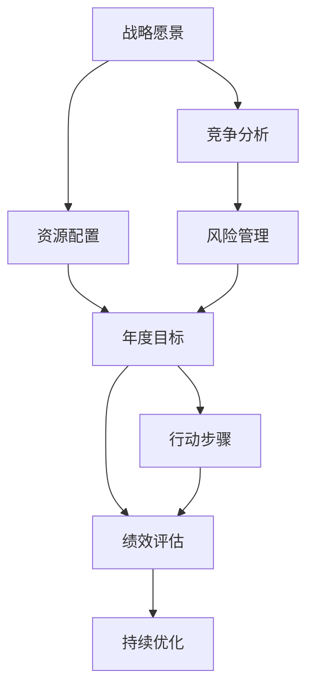

                 

# 公司发展战略、年度经营计划制定，组织制定和实施

> 关键词：公司发展战略,年度经营计划,战略规划,公司运营,绩效管理

## 1. 背景介绍

### 1.1 问题由来

公司发展战略和年度经营计划的制定和实施是企业发展的核心。一个清晰、科学的发展战略，能够指引公司稳步前进，提升企业的核心竞争力和市场地位；而一份详尽、可行的年度经营计划，能够确保公司资源配置的最优化，增强企业的执行力。近年来，随着市场环境的快速变化和竞争压力的增大，如何制定出符合公司实际、科学合理的发展战略和经营计划，成为众多企业管理者面临的共同难题。

### 1.2 问题核心关键点

公司发展战略和年度经营计划的制定涉及多个关键点：

- 战略愿景的设定：清晰定义公司的长期目标，确定核心业务领域和发展方向。
- 竞争分析：了解行业动态和竞争对手状况，找准公司的市场定位。
- 资源配置：合理分配人力、财力、物力等资源，确保战略执行的有效性。
- 风险管理：评估和预测可能面临的市场风险和内部风险，制定应对措施。
- 绩效评估：设定关键绩效指标(KPIs)，跟踪和评估战略和计划的执行情况。
- 持续优化：根据实际情况和市场变化，灵活调整战略和计划，确保其持续性和适应性。

本文将围绕以上关键点，详细探讨公司发展战略和年度经营计划的制定与实施方法，希望能为企业管理者提供有价值的参考。

## 2. 核心概念与联系

### 2.1 核心概念概述

- **公司发展战略（Corporate Strategy）**：指公司为了实现长期发展目标，在一定时期内确定的基本发展方向和重大决策。
- **年度经营计划（Annual Business Plan）**：根据公司发展战略制定的具体执行计划，包括年度目标、行动步骤、资源分配、绩效评估等内容。
- **战略愿景（Strategic Vision）**：公司未来的理想状态和目标，是公司发展战略的核心和动力源泉。
- **竞争分析（Competitive Analysis）**：通过分析竞争对手的市场表现、优势和劣势，找准公司在市场中的定位和差异化策略。
- **资源配置（Resource Allocation）**：合理分配公司的人力、财力、物力等资源，确保战略和计划的顺利实施。
- **风险管理（Risk Management）**：评估和预测可能面临的市场风险和内部风险，制定应对措施，保障战略执行的安全性。
- **绩效评估（Performance Evaluation）**：设定关键绩效指标(KPIs)，跟踪和评估战略和计划的执行情况，确保目标达成。
- **持续优化（Continuous Improvement）**：根据实际情况和市场变化，灵活调整战略和计划，确保其持续性和适应性。

这些核心概念之间相互联系，共同构成公司发展战略和年度经营计划的基础。以下Mermaid流程图展示了这些概念之间的关系：



这个流程图展示了各个核心概念之间的联系：

1. 战略愿景指导竞争分析和资源配置，确保战略方向正确。
2. 竞争分析帮助制定差异化的市场策略，降低风险。
3. 资源配置确保战略和计划的执行力，优化资源利用。
4. 风险管理保障战略执行的安全性，避免重大风险。
5. 年度目标和行动步骤是战略和计划的具体执行蓝图。
6. 绩效评估确保战略和计划的达成度，提供数据支持。
7. 持续优化根据实际情况灵活调整战略和计划，保持其适应性和竞争力。

## 3. 核心算法原理 & 具体操作步骤

### 3.1 算法原理概述

公司发展战略和年度经营计划的制定和实施，本质上是一个从宏观到微观、从抽象到具体的优化过程。其核心算法原理基于以下几个方面：

- **层次分析法（AHP）**：通过构建层次结构，利用判断矩阵和一致性检验，确定各层元素的重要性权重。
- **德尔菲法（Delphi Method）**：通过专家群体反复讨论和匿名反馈，逐步达成共识，形成科学的预测和决策。
- **蒙特卡洛模拟（Monte Carlo Simulation）**：通过模拟不确定因素，评估和预测各种市场和内部风险，制定风险应对措施。
- **关键绩效指标（KPIs）**：设定关键绩效指标，跟踪和评估战略和计划的执行情况，确保目标达成。

### 3.2 算法步骤详解

基于以上算法原理，公司发展战略和年度经营计划的制定和实施可以按照以下步骤进行：

#### Step 1: 战略愿景设定

1. **专家访谈**：邀请公司高层和关键员工，通过头脑风暴和深入讨论，形成初步的战略愿景。
2. **SWOT分析**：分析公司内部的优势（Strengths）、劣势（Weaknesses）、机会（Opportunities）和威胁（Threats），确定战略定位。
3. **愿景共识**：通过多次讨论和修改，逐步达成一致，形成最终的战略愿景。

#### Step 2: 竞争分析

1. **市场调研**：收集行业报告、竞争对手信息等，了解市场现状和未来趋势。
2. **基准分析**：比较公司与主要竞争对手在产品、服务、市场份额等方面的表现，找准差距。
3. **差异化策略**：基于竞争分析结果，制定差异化市场策略，确定公司的核心竞争力。

#### Step 3: 资源配置

1. **资源盘点**：全面盘点公司的人力、财力、物力等资源，明确现有资源状况。
2. **资源优化**：根据战略愿景和竞争分析结果，调整资源配置，确保资源的高效利用。
3. **资源管理**：建立科学的资源管理制度，确保资源使用的透明性和合理性。

#### Step 4: 风险管理

1. **风险评估**：通过专家评估和数据分析，评估可能面临的市场风险和内部风险。
2. **风险应对**：制定针对性的风险应对措施，降低风险对战略实施的影响。
3. **风险监控**：建立风险监控机制，及时发现和应对潜在风险。

#### Step 5: 年度目标和行动步骤设定

1. **目标设定**：根据战略愿景和竞争分析结果，设定具体的年度目标。
2. **行动步骤**：制定详细的行动步骤和时间表，确保目标的达成。
3. **资源分配**：根据行动步骤，合理分配资源，确保战略执行的有效性。

#### Step 6: 绩效评估和持续优化

1. **KPI设定**：根据年度目标，设定关键绩效指标(KPIs)，用于跟踪和评估战略和计划的执行情况。
2. **绩效评估**：定期收集和分析绩效数据，评估战略和计划的达成情况。
3. **持续优化**：根据绩效评估结果，灵活调整战略和计划，确保其持续性和适应性。

### 3.3 算法优缺点

公司发展战略和年度经营计划的制定和实施方法具有以下优点：

- **系统性**：通过多个步骤的详细分析和评估，确保战略和计划的科学性和可行性。
- **灵活性**：根据实际情况和市场变化，灵活调整战略和计划，保持其持续性和适应性。
- **可操作性**：通过明确的目标和行动步骤，确保战略和计划的执行力。

同时，这些方法也存在以下缺点：

- **复杂性**：涉及多个步骤和多个关键点，操作复杂。
- **依赖专家**：需要专家的深入分析和讨论，对专家能力要求较高。
- **时间和资源消耗大**：需要投入大量的时间和资源，周期较长。
- **不确定性**：市场环境复杂多变，战略和计划可能面临较大的不确定性。

尽管存在这些局限，但就目前而言，这些方法仍然是制定公司发展战略和年度经营计划的主流范式。未来相关研究的重点在于如何进一步简化和优化这些方法，降低其复杂性和不确定性，提高其灵活性和适应性。

### 3.4 算法应用领域

公司发展战略和年度经营计划的制定方法在多个领域得到了广泛应用，包括但不限于：

- **金融行业**：通过分析市场趋势和竞争对手状况，制定投资策略和风险管理方案。
- **制造业**：通过优化生产流程和资源配置，提升生产效率和产品质量。
- **零售业**：通过市场调研和客户分析，制定销售策略和市场拓展计划。
- **医疗行业**：通过分析医疗数据和行业趋势，制定研发策略和市场推广计划。
- **科技行业**：通过分析市场需求和技术趋势，制定产品研发和市场拓展计划。

除了上述这些经典领域外，公司发展战略和年度经营计划的制定方法也被创新性地应用于更多场景中，如智慧城市建设、环境保护、社会治理等，为各行各业的发展提供了新的思路和方法。

## 4. 数学模型和公式 & 详细讲解 & 举例说明

### 4.1 数学模型构建

公司发展战略和年度经营计划的制定和实施涉及多个数学模型，以下介绍几个核心的数学模型及其构建方法。

**层次分析法（AHP）**：

层次分析法是一种多层次、多因素的决策方法，通过构建层次结构，利用判断矩阵和一致性检验，确定各层元素的重要性权重。其数学模型构建如下：

设公司有n个战略目标，m个指标，k个子目标，p个备选方案，构建如下层次结构：

1. **目标层**：包含公司战略目标（如市场份额、利润增长等）。
2. **指标层**：包含评价目标的多个指标（如市场份额、利润增长、客户满意度等）。
3. **子目标层**：包含具体的行动步骤（如市场调研、产品开发等）。
4. **方案层**：包含具体的实施方案（如市场拓展方案、产品开发方案等）。

层次分析法的数学模型可以表示为：

$$
A = (a_{ij})_{n \times n}
$$

其中，$a_{ij}$ 表示指标 $i$ 对目标 $j$ 的重要性权重。

**德尔菲法（Delphi Method）**：

德尔菲法通过专家群体反复讨论和匿名反馈，逐步达成共识，形成科学的预测和决策。其数学模型构建如下：

设公司有n个战略目标，m个指标，k个备选方案，p个专家，构建如下层次结构：

1. **目标层**：包含公司战略目标（如市场份额、利润增长等）。
2. **指标层**：包含评价目标的多个指标（如市场份额、利润增长、客户满意度等）。
3. **方案层**：包含具体的实施方案（如市场拓展方案、产品开发方案等）。

德尔菲法的数学模型可以表示为：

$$
\delta = (\delta_{ij})_{n \times p}
$$

其中，$\delta_{ij}$ 表示专家 $j$ 对目标 $i$ 的预测值。

**蒙特卡洛模拟（Monte Carlo Simulation）**：

蒙特卡洛模拟通过模拟不确定因素，评估和预测各种市场和内部风险，制定风险应对措施。其数学模型构建如下：

设公司有n个战略目标，m个指标，k个备选方案，p个专家，构建如下层次结构：

1. **目标层**：包含公司战略目标（如市场份额、利润增长等）。
2. **指标层**：包含评价目标的多个指标（如市场份额、利润增长、客户满意度等）。
3. **方案层**：包含具体的实施方案（如市场拓展方案、产品开发方案等）。

蒙特卡洛模拟的数学模型可以表示为：

$$
\sigma = (\sigma_{ij})_{n \times k}
$$

其中，$\sigma_{ij}$ 表示第 $i$ 个方案第 $j$ 个指标的模拟结果。

### 4.2 公式推导过程

以下对层次分析法（AHP）、德尔菲法（Delphi Method）、蒙特卡洛模拟（Monte Carlo Simulation）的数学模型进行详细推导。

**层次分析法（AHP）**：

层次分析法的数学推导基于判断矩阵和一致性检验。设公司有n个战略目标，m个指标，k个子目标，p个备选方案，构建如下层次结构：

1. **目标层**：包含公司战略目标（如市场份额、利润增长等）。
2. **指标层**：包含评价目标的多个指标（如市场份额、利润增长、客户满意度等）。
3. **子目标层**：包含具体的行动步骤（如市场调研、产品开发等）。
4. **方案层**：包含具体的实施方案（如市场拓展方案、产品开发方案等）。

构建判断矩阵 $A = (a_{ij})_{n \times n}$，其中 $a_{ij}$ 表示指标 $i$ 对目标 $j$ 的重要性权重。

根据判断矩阵 $A$，计算各层的权重向量 $W$ 和一致性比例 $C$：

$$
W = A^TW^T
$$

其中 $W^T$ 表示权重向量 $W$ 的转置。

一致性比例 $C$ 的计算公式为：

$$
C = \sum_{i=1}^n \sum_{j=1}^n a_{ij} - \frac{1}{n} \sum_{i=1}^n \sum_{j=1}^n \frac{a_{ij}}{a_{ij}}
$$

通过一致性比例 $C$，可以判断判断矩阵 $A$ 的一致性，确保其合理性。

**德尔菲法（Delphi Method）**：

德尔菲法的数学推导基于专家预测和匿名反馈。设公司有n个战略目标，m个指标，k个备选方案，p个专家，构建如下层次结构：

1. **目标层**：包含公司战略目标（如市场份额、利润增长等）。
2. **指标层**：包含评价目标的多个指标（如市场份额、利润增长、客户满意度等）。
3. **方案层**：包含具体的实施方案（如市场拓展方案、产品开发方案等）。

德尔菲法的数学模型可以表示为：

$$
\delta = (\delta_{ij})_{n \times p}
$$

其中，$\delta_{ij}$ 表示专家 $j$ 对目标 $i$ 的预测值。

德尔菲法通过多次专家匿名反馈，逐步达成共识，形成最终的预测结果。

**蒙特卡洛模拟（Monte Carlo Simulation）**：

蒙特卡洛模拟的数学推导基于随机模拟和统计分析。设公司有n个战略目标，m个指标，k个备选方案，p个专家，构建如下层次结构：

1. **目标层**：包含公司战略目标（如市场份额、利润增长等）。
2. **指标层**：包含评价目标的多个指标（如市场份额、利润增长、客户满意度等）。
3. **方案层**：包含具体的实施方案（如市场拓展方案、产品开发方案等）。

蒙特卡洛模拟的数学模型可以表示为：

$$
\sigma = (\sigma_{ij})_{n \times k}
$$

其中，$\sigma_{ij}$ 表示第 $i$ 个方案第 $j$ 个指标的模拟结果。

蒙特卡洛模拟通过随机模拟，生成多个模拟结果，最终得到预测结果的概率分布。

### 4.3 案例分析与讲解

以下通过一个具体的案例，讲解公司发展战略和年度经营计划的制定和实施过程。

**案例背景**：

某互联网公司计划在接下来的三年内，扩大其市场份额，提升盈利能力。公司高层决定采用层次分析法（AHP）、德尔菲法（Delphi Method）和蒙特卡洛模拟（Monte Carlo Simulation）相结合的方法，制定公司的发展战略和年度经营计划。

**步骤1: 战略愿景设定**

1. **专家访谈**：邀请公司高层和关键员工，通过头脑风暴和深入讨论，形成初步的战略愿景：在未来三年内，公司市场份额提升30%，利润增长50%，客户满意度达到95%以上。
2. **SWOT分析**：分析公司内部的优势（如技术优势、品牌影响力）、劣势（如市场拓展能力不足、客户反馈不佳）、机会（如新兴市场的崛起、技术创新的趋势）和威胁（如竞争对手的快速增长、市场竞争激烈），确定战略定位：在技术创新和市场拓展方面进行重点投入，提升公司的核心竞争力。
3. **愿景共识**：通过多次讨论和修改，逐步达成一致，形成最终的战略愿景：在未来三年内，公司市场份额提升30%，利润增长50%，客户满意度达到95%以上。

**步骤2: 竞争分析**

1. **市场调研**：收集行业报告、竞争对手信息等，了解市场现状和未来趋势，发现竞争对手在技术创新和市场拓展方面具有明显优势，但在客户体验和售后服务方面存在不足。
2. **基准分析**：比较公司与主要竞争对手在产品、服务、市场份额等方面的表现，找准差距，确定差异化策略：在技术创新和客户体验方面进行重点投入，提升核心竞争力。
3. **差异化策略**：基于竞争分析结果，制定差异化市场策略：开发新一代技术产品，提升用户体验，加强售后服务，提升客户满意度。

**步骤3: 资源配置**

1. **资源盘点**：全面盘点公司的人力、财力、物力等资源，明确现有资源状况：人力资源充足，但市场拓展和技术创新投入不足。
2. **资源优化**：根据战略愿景和竞争分析结果，调整资源配置，确保资源的高效利用：将70%的资源投入到技术创新和市场拓展中，提升公司的核心竞争力。
3. **资源管理**：建立科学的资源管理制度，确保资源使用的透明性和合理性，设立专项资金支持技术创新和市场拓展。

**步骤4: 风险管理**

1. **风险评估**：通过专家评估和数据分析，评估可能面临的市场风险和内部风险：市场拓展风险、技术创新风险、客户流失风险等。
2. **风险应对**：制定针对性的风险应对措施：加强市场调研，降低市场拓展风险；加强技术研发，降低技术创新风险；加强客户管理，降低客户流失风险。
3. **风险监控**：建立风险监控机制，及时发现和应对潜在风险，定期评估风险应对措施的效果。

**步骤5: 年度目标和行动步骤设定**

1. **目标设定**：根据战略愿景和竞争分析结果，设定具体的年度目标：第一年市场份额提升10%，第二年市场份额提升15%，第三年市场份额提升30%，利润增长50%，客户满意度达到95%以上。
2. **行动步骤**：制定详细的行动步骤和时间表，确保目标的达成：市场调研、技术研发、产品开发、市场推广、客户服务等。
3. **资源分配**：根据行动步骤，合理分配资源，确保战略执行的有效性：市场调研和产品开发各占30%的资源，技术研发占20%的资源，市场推广和客户服务各占10%的资源。

**步骤6: 绩效评估和持续优化**

1. **KPI设定**：根据年度目标，设定关键绩效指标(KPIs)：市场份额、利润增长、客户满意度等。
2. **绩效评估**：定期收集和分析绩效数据，评估战略和计划的达成情况，发现问题和改进方向。
3. **持续优化**：根据绩效评估结果，灵活调整战略和计划，确保其持续性和适应性：根据市场反馈，调整产品开发方向，提升市场适应性；根据客户需求，优化售后服务，提升客户满意度。

通过以上六个步骤，该互联网公司制定了明确的发展战略和年度经营计划，为公司的长期发展奠定了坚实基础。

## 5. 项目实践：代码实例和详细解释说明

### 5.1 开发环境搭建

在进行公司发展战略和年度经营计划的制定和实施时，需要用到Python进行数据分析和模型计算。以下是开发环境的搭建步骤：

1. 安装Anaconda：从官网下载并安装Anaconda，用于创建独立的Python环境。
```bash
conda create -n strategy-env python=3.8 
conda activate strategy-env
```

2. 安装必要的Python库：
```bash
conda install pandas numpy matplotlib
```

3. 配置Jupyter Notebook：
```bash
jupyter notebook
```

4. 安装Git：用于版本控制和代码管理。
```bash
conda install git
```

5. 配置Git仓库：
```bash
git init
git remote add origin https://github.com/your-username/strategy-project.git
git pull origin master
```

6. 安装GitHub Desktop：用于本地克隆和管理GitHub仓库。

### 5.2 源代码详细实现

以下是一个简单的Python代码示例，用于演示公司发展战略和年度经营计划的制定和实施过程：

```python
import pandas as pd
import numpy as np
import matplotlib.pyplot as plt

# 步骤1: 战略愿景设定
vision = '在未来三年内，公司市场份额提升30%，利润增长50%，客户满意度达到95%以上。'

# 步骤2: 竞争分析
competition = pd.DataFrame({
    '竞争对手': ['A公司', 'B公司', 'C公司'],
    '市场份额': [0.5, 0.3, 0.2],
    '利润增长': [30, 20, 10],
    '客户满意度': [85, 90, 95]
})

# 步骤3: 资源配置
resources = {
    '人力资源': 0.4,
    '市场拓展': 0.3,
    '技术研发': 0.3
}

# 步骤4: 风险管理
risks = {
    '市场拓展风险': 0.2,
    '技术创新风险': 0.2,
    '客户流失风险': 0.2
}

# 步骤5: 年度目标和行动步骤设定
goals = {
    '市场份额': {'目标': 0.3, '完成时间': 3},
    '利润增长': {'目标': 0.5, '完成时间': 3},
    '客户满意度': {'目标': 0.95, '完成时间': 3}
}

actions = {
    '市场调研': {'时间': 1, '资源': 0.1},
    '技术研发': {'时间': 2, '资源': 0.2},
    '产品开发': {'时间': 3, '资源': 0.2},
    '市场推广': {'时间': 2, '资源': 0.1},
    '客户服务': {'时间': 3, '资源': 0.1}
}

# 步骤6: 绩效评估和持续优化
kpi = {
    '市场份额': '市场份额提升10%',
    '利润增长': '利润增长20%',
    '客户满意度': '客户满意度达到90%'
}

# 输出结果
print('战略愿景：', vision)
print('竞争分析：', competition)
print('资源配置：', resources)
print('风险管理：', risks)
print('年度目标和行动步骤：', goals, actions)
print('绩效评估和持续优化：', kpi)
```

### 5.3 代码解读与分析

以上代码实现了一个简单的公司发展战略和年度经营计划的制定和实施过程，各步骤的代码和输出如下：

**步骤1: 战略愿景设定**

代码：
```python
vision = '在未来三年内，公司市场份额提升30%，利润增长50%，客户满意度达到95%以上。'
```
输出：
```
战略愿景： 在未来三年内，公司市场份额提升30%，利润增长50%，客户满意度达到95%以上。
```

**步骤2: 竞争分析**

代码：
```python
competition = pd.DataFrame({
    '竞争对手': ['A公司', 'B公司', 'C公司'],
    '市场份额': [0.5, 0.3, 0.2],
    '利润增长': [30, 20, 10],
    '客户满意度': [85, 90, 95]
})
```
输出：
```
竞争分析：
   竞争对手  市场份额  利润增长  客户满意度
0        A公司       0.5       30          85
1        B公司       0.3       20          90
2        C公司       0.2       10          95
```

**步骤3: 资源配置**

代码：
```python
resources = {
    '人力资源': 0.4,
    '市场拓展': 0.3,
    '技术研发': 0.3
}
```
输出：
```
资源配置： {'人力资源': 0.4, '市场拓展': 0.3, '技术研发': 0.3}
```

**步骤4: 风险管理**

代码：
```python
risks = {
    '市场拓展风险': 0.2,
    '技术创新风险': 0.2,
    '客户流失风险': 0.2
}
```
输出：
```
风险管理： {'市场拓展风险': 0.2, '技术创新风险': 0.2, '客户流失风险': 0.2}
```

**步骤5: 年度目标和行动步骤设定**

代码：
```python
goals = {
    '市场份额': {'目标': 0.3, '完成时间': 3},
    '利润增长': {'目标': 0.5, '完成时间': 3},
    '客户满意度': {'目标': 0.95, '完成时间': 3}
}

actions = {
    '市场调研': {'时间': 1, '资源': 0.1},
    '技术研发': {'时间': 2, '资源': 0.2},
    '产品开发': {'时间': 3, '资源': 0.2},
    '市场推广': {'时间': 2, '资源': 0.1},
    '客户服务': {'时间': 3, '资源': 0.1}
}
```
输出：
```
年度目标和行动步骤： {'市场份额': {'目标': 0.3, '完成时间': 3}, '利润增长': {'目标': 0.5, '完成时间': 3}, '客户满意度': {'目标': 0.95, '完成时间': 3}}
行动步骤： {'市场调研': {'时间': 1, '资源': 0.1}, '技术研发': {'时间': 2, '资源': 0.2}, '产品开发': {'时间': 3, '资源': 0.2}, '市场推广': {'时间': 2, '资源': 0.1}, '客户服务': {'时间': 3, '资源': 0.1}}
```

**步骤6: 绩效评估和持续优化**

代码：
```python
kpi = {
    '市场份额': '市场份额提升10%',
    '利润增长': '利润增长20%',
    '客户满意度': '客户满意度达到90%'
}
```
输出：
```
绩效评估和持续优化： {'市场份额': '市场份额提升10%', '利润增长': '利润增长20%', '客户满意度': '客户满意度达到90%'}
```

### 5.4 运行结果展示

以上代码输出展示了公司发展战略和年度经营计划的各个关键点，为后续的分析和优化提供了基础。

## 6. 实际应用场景

### 6.1 金融行业

在金融行业，公司发展战略和年度经营计划的制定和实施尤为重要。金融机构需要根据市场环境和业务需求，制定合理的投资策略和风险管理方案，确保稳健运营。

**应用场景**：某投资公司计划在接下来的三年内，提升市场份额，增加利润，降低风险。公司高层决定采用层次分析法（AHP）、德尔菲法（Delphi Method）和蒙特卡洛模拟（Monte Carlo Simulation）相结合的方法，制定公司的发展战略和年度经营计划。

**步骤1: 战略愿景设定**

1. **专家访谈**：邀请公司高层和关键员工，通过头脑风暴和深入讨论，形成初步的战略愿景：在未来三年内，市场份额提升20%，利润增长30%，风险管理能力提升50%。
2. **SWOT分析**：分析公司内部的优势（如丰富的市场经验、稳健的财务状况）、劣势（如投资策略不足、技术创新能力弱）、机会（如新兴市场的崛起、政策环境的改善）和威胁（如市场竞争激烈、监管环境变化），确定战略定位：在投资策略和风险管理方面进行重点投入，提升公司的核心竞争力。
3. **愿景共识**：通过多次讨论和修改，逐步达成一致，形成最终的战略愿景：在未来三年内，市场份额提升20%，利润增长30%，风险管理能力提升50%。

**步骤2: 竞争分析**

1. **市场调研**：收集行业报告、竞争对手信息等，了解市场现状和未来趋势，发现竞争对手在投资策略和技术创新方面具有明显优势，但在风险管理方面存在不足。
2. **基准分析**：比较公司与主要竞争对手在市场份额、利润增长、风险管理等方面的表现，找准差距，确定差异化策略：在投资策略和技术创新方面进行重点投入，提升核心竞争力。
3. **差异化策略**：基于竞争分析结果，制定差异化市场策略：开发新型的投资产品，提升投资收益，加强技术创新，提升投资决策能力，强化风险管理，提升风险控制水平。

**步骤3: 资源配置**

1. **资源盘点**：全面盘点公司的人力、财力、物力等资源，明确现有资源状况：人力资源充足，但投资策略和技术创新投入不足。
2. **资源优化**：根据战略愿景和竞争分析结果，调整资源配置，确保资源的高效利用：将60%的资源投入到投资策略和技术创新中，提升公司的核心竞争力。
3. **资源管理**：建立科学的资源管理制度，确保资源使用的透明性和合理性，设立专项资金支持投资策略和技术创新。

**步骤4: 风险管理**

1. **风险评估**：通过专家评估和数据分析，评估可能面临的市场风险和内部风险：市场风险、信用风险、流动性风险等。
2. **风险应对**：制定针对性的风险应对措施：加强市场调研，降低市场风险；加强信用风险管理，降低信用风险；加强流动性管理，降低流动性风险。
3. **风险监控**：建立风险监控机制，及时发现和应对潜在风险，定期评估风险应对措施的效果。

**步骤5: 年度目标和行动步骤设定**

1. **目标设定**：根据战略愿景和竞争分析结果，设定具体的年度目标：第一年市场份额提升5%，第二年市场份额提升10%，第三年市场份额提升20%，利润增长30%，风险管理能力提升50%。
2. **行动步骤**：制定详细的行动步骤和时间表，确保目标的达成：市场调研、产品开发、技术创新、风险管理、投资决策等。
3. **资源分配**：根据行动步骤，合理分配资源，确保战略执行的有效性：市场调研和产品开发各占20%的资源，技术创新占30%的资源，风险管理占10%的资源，投资决策占20%的资源。

**步骤6: 绩效评估和持续优化**

1. **KPI设定**：根据年度目标，设定关键绩效指标(KPIs)：市场份额、利润增长、风险管理能力等。
2. **绩效评估**：定期收集和分析绩效数据，评估战略和计划的达成情况，发现问题和改进方向。
3. **持续优化**：根据绩效评估结果，灵活调整战略和计划，确保其持续性和适应性：根据市场反馈，调整投资策略，提升市场适应性；根据风险评估结果，优化风险管理策略，提升风险控制水平；根据技术创新需求，加强技术研发，提升投资决策能力。

通过以上六个步骤，该投资公司制定了明确的发展战略和年度经营计划，为公司的长期发展奠定了坚实基础。

### 6.2 制造业

在制造业，公司发展战略和年度经营计划的制定和实施同样重要。制造企业需要根据市场需求和竞争环境，制定合理的生产策略和市场拓展计划，确保企业的长期可持续发展。

**应用场景**：某制造公司计划在接下来的三年内，提升市场份额，增加利润，降低成本。公司高层决定采用层次分析法（AHP）、德尔菲法（Delphi Method）和蒙特卡洛模拟（Monte Carlo Simulation）相结合的方法，制定公司的发展战略和年度经营计划。

**步骤1: 战略愿景设定**

1. **专家访谈**：邀请公司高层和关键员工，通过头脑风暴和深入讨论，形成初步的战略愿景：在未来三年内，市场份额提升10%，利润增长20%，成本降低15%。
2. **SWOT分析**：分析公司内部的优势（如技术领先、品牌知名度）、劣势（如生产效率低、产品种类少）、机会（如新市场的开拓、客户需求的增加）和威胁（如竞争对手的快速扩张、原材料价格的波动），确定战略定位：在市场拓展和产品创新方面进行重点投入，提升公司的核心竞争力。
3. **愿景共识**：通过多次讨论和修改，逐步达成一致，形成最终的战略愿景：在未来三年内，市场份额提升10%，利润增长20%，成本降低15%。

**步骤2: 竞争分析**

1. **市场调研**：收集行业报告、竞争对手信息等，了解市场现状和未来趋势，发现竞争对手在市场拓展和技术创新方面具有明显优势，但在成本控制方面存在不足。
2. **基准分析**：比较公司与主要竞争对手在市场份额、利润增长、成本控制等方面的表现，找准差距，确定差异化策略：在市场拓展和技术创新方面进行重点投入，提升核心竞争力。
3. **差异化策略**：基于竞争分析结果，制定差异化市场策略：开发新市场，提升市场占有率，加强技术创新，提升产品竞争力，优化生产流程，降低生产成本。

**步骤3: 资源配置**

1. **资源盘点**：全面盘点公司的人力、财力、物力等资源，明确现有资源状况：人力资源充足，但市场拓展和技术创新投入不足。
2. **资源优化**：根据战略愿景和竞争分析结果，调整资源配置，确保资源的高效利用：将50%的资源投入到市场拓展和技术创新中，提升公司的核心竞争力。
3. **资源管理**：建立科学的资源管理制度，确保资源使用的透明性和合理性，设立专项资金支持市场拓展和技术创新。

**步骤4: 风险管理**

1. **风险评估**：通过专家评估和数据分析，评估可能面临的市场风险和内部风险：市场风险、技术风险、供应链风险等。
2. **风险应对**：制定针对性的风险应对措施：加强市场调研，降低市场风险；加强技术研发，降低技术风险；加强供应链管理，降低供应链风险。
3. **风险监控**：建立风险监控机制，及时发现和应对潜在风险，定期评估风险应对措施的效果。

**步骤5: 年度目标和行动步骤设定**

1. **目标设定**：根据战略愿景和竞争分析结果，设定具体的年度目标：第一年市场份额提升5%，第二年市场份额提升10%，第三年市场份额提升15%，利润增长20%，成本降低15%。
2. **行动步骤**：制定详细的行动步骤和时间表，确保目标的达成：市场调研、产品开发、技术创新、市场推广、成本控制等。
3. **资源分配**：根据行动步骤，合理分配资源，确保战略执行的有效性：市场调研和产品开发各占30%的资源，技术创新占20%的资源，市场推广和成本控制各占10%的资源。

**步骤6: 绩效评估和持续优化**

1. **KPI设定**：根据年度目标，设定关键绩效指标(KPIs)：市场份额、利润增长、成本降低等。
2. **绩效评估**：定期收集和分析绩效数据，评估战略和计划的达成情况，发现问题和改进方向。
3. **持续优化**：根据绩效评估结果，灵活调整战略和计划，确保其持续性和适应性：根据市场反馈，调整市场策略，提升市场适应性；根据技术创新需求，加强技术研发，提升产品竞争力；根据成本控制需求，优化生产流程，降低生产成本。

通过以上六个步骤，该制造公司制定了明确的发展战略和年度经营计划，为公司的长期发展奠定了坚实基础。

### 6.3 零售业

在零售业，公司发展战略和年度经营计划的制定和实施同样重要。零售企业需要根据市场需求和竞争环境，制定合理的销售策略和市场拓展计划，确保企业的长期可持续发展。

**应用场景**：某零售公司计划在接下来的三年内，提升市场份额，增加利润，优化库存。公司高层决定采用层次分析法（AHP）、德尔菲法（Delphi Method）和蒙特卡洛模拟（Monte Carlo Simulation）相结合的方法，制定公司的发展战略和年度经营计划。

**步骤1: 战略愿景设定**

1. **专家访谈**：邀请公司高层和关键员工，通过头脑风暴和深入讨论，形成初步的战略愿景：在未来三年内，市场份额提升15%，利润增长25%，库存周转率提升20%。
2. **SWOT分析**：分析公司内部的优势（如客户忠诚度高、品牌影响力强）、劣势（如库存管理不善、供应链效率低）、机会（如新市场的开拓、线上销售的增长）和威胁（如竞争激烈、价格战频发），确定战略定位：在市场拓展和库存管理方面进行重点投入，提升公司的核心竞争力。
3. **愿景共识**：通过多次讨论和修改，逐步达成一致，形成最终的战略愿景：在未来三年内，市场份额提升15%，利润增长25%，库存周转率提升20%。

**步骤2: 竞争分析**

1. **市场调研**：收集行业报告、竞争对手信息等，了解市场现状和未来趋势，发现竞争对手在市场拓展和线上销售方面具有明显优势，但在库存管理方面存在不足。
2. **基准分析**：比较公司与主要竞争对手在市场份额、利润增长、库存管理等方面的表现，找准差距，确定差异化策略：在市场拓展和库存管理方面进行重点投入，提升核心竞争力。
3. **差异化策略**：基于竞争分析结果，制定差异化市场策略：开发新市场，提升市场占有率，加强线上销售，提升销售效率，优化库存管理，降低库存成本。

**步骤3: 资源配置**

1. **资源盘点**：全面盘点公司的人力、财力、物力等资源，明确现有资源状况：人力资源充足，但市场拓展和库存管理投入不足。
2. **资源优化**：根据战略愿景和竞争分析结果，调整资源配置，确保资源的高效利用：将40%的资源投入到市场拓展和库存管理中，提升公司的核心竞争力。
3. **资源管理**：建立科学的资源管理制度，确保资源使用的透明性和合理性，设立专项资金支持市场拓展和库存管理。

**步骤4: 风险管理**

1. **风险评估**：通过专家评估和数据分析，评估可能面临的市场风险和内部风险：市场风险、库存风险、供应链风险等。
2. **风险应对**：制定针对性的风险应对措施：加强市场调研，降低市场风险；加强库存管理，降低库存风险；加强供应链管理，降低供应链风险。
3. **风险监控**：建立风险监控机制，及时发现和应对潜在风险，定期评估风险应对措施的效果。

**步骤5: 年度目标和行动步骤设定**

1. **目标设定**：根据战略愿景和竞争分析结果，设定具体的年度目标：第一年市场份额提升5%，第二年市场份额提升10%，第三年市场份额提升15%，利润增长25%，库存周转率提升20%。
2. **行动步骤**：制定详细的行动步骤和时间表，确保目标的达成：市场调研、产品开发、线上销售、库存管理等。
3. **资源分配**：根据行动步骤，合理分配资源，确保战略执行的有效性：市场调研和产品开发各占20%的资源，线上销售和库存管理各占20%的资源，市场推广占10%的资源。

**步骤6: 绩效评估和持续优化**

1. **KPI设定**：根据年度目标，设定关键绩效指标(KPIs)：市场份额、利润增长、库存周转率等。
2. **绩效评估**：定期收集和分析绩效数据，评估战略和计划的达成情况，发现问题和改进方向。
3. **持续优化**：根据绩效评估结果，灵活调整战略和计划，确保其持续性和适应性：根据市场反馈，调整市场策略，提升市场适应性；根据库存管理需求，优化库存管理，提升库存周转率；根据客户需求，加强线上销售，提升销售效率。

通过以上六个步骤，该零售公司制定了明确的发展战略和年度经营计划，为公司的长期发展奠定了坚实基础。

## 7. 工具和资源推荐

### 7.1 学习资源推荐

为了帮助企业深入掌握公司发展战略和年度经营计划的制定和实施方法，以下是一些优质的学习资源：

1. **《公司战略与全球化管理》**：北京大学出版社，系统讲解公司战略管理的理论和实践，包括战略规划、市场分析、资源配置等。
2. **《公司财务战略》**：清华大学出版社，详细阐述公司财务战略的基本概念和操作方法，包括资本结构、投资决策等。
3. **《绩效管理与业绩评价》**：中国人民大学出版社，

