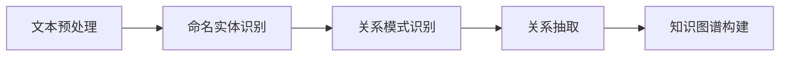

                 

# 关系抽取：从非结构化文本中提取知识

> 关键词：关系抽取, 命名实体识别, 自然语言处理, 文本挖掘, 语义分析, 知识图谱, 图神经网络

## 1. 背景介绍

### 1.1 问题由来
在信息爆炸的时代，非结构化文本数据（如新闻文章、社交媒体、专利文献等）呈现出海量增长趋势。如何从这些非结构化文本中提取结构化知识，是当前自然语言处理（NLP）领域的重要研究课题。关系抽取（Relation Extraction），即从文本中自动识别和抽取实体间的关系，是NLP中一个核心任务。其旨在解析非结构化文本中的隐含信息，揭示实体之间的关联关系，为信息检索、知识图谱构建、智能问答等应用提供重要支撑。

### 1.2 问题核心关键点
关系抽取的核心问题在于如何在大量自然语言文本中，自动识别出实体之间可能的关系，并将其映射到已知的标签集合中。这涉及到以下几个关键点：
- 命名实体识别（Named Entity Recognition, NER）：识别出文本中的人名、地名、机构名等关键实体。
- 关系模式识别：从文本中挖掘出实体间的潜在关系模式，如主谓宾关系、同位关系、组织与人员关系等。
- 实体关系表示：将识别出的实体和关系进行编码，构建关系三元组，形成知识图谱。

### 1.3 问题研究意义
关系抽取对构建知识图谱、辅助信息检索、支持智能问答、提升决策智能化等方面具有重要意义。例如，从新闻报道中自动抽取实体及关系，可以辅助政府和企业进行舆情监控、市场预测、决策支持等，极大地提升信息处理的效率和准确性。

## 2. 核心概念与联系

### 2.1 核心概念概述

关系抽取涉及以下几个核心概念：

- **命名实体识别**（NER）：识别文本中的关键实体，如人名、地名、组织名等。
- **关系模式识别**：从文本中识别出实体间的关系模式，如主谓宾关系、同位关系等。
- **关系抽取**：将识别出的实体和关系模式，映射到预定义的关系类型上，构建三元组。
- **知识图谱**：将关系抽取结果组织为图结构，形成知识库，用于信息检索和决策支持。

这些概念之间存在紧密联系，可以概括为以下几个流程：

1. **预处理**：清洗文本，分词、去除停用词、词性标注等。
2. **命名实体识别（NER）**：识别出文本中的实体，并分类为预定义的实体类型。
3. **关系模式识别**：识别出实体间的潜在关系模式，通常是主谓宾结构。
4. **关系抽取**：将识别出的实体和关系模式映射到预定义的关系类型，形成三元组。
5. **知识图谱构建**：将抽取的关系三元组组织为图结构，形成知识库。

### 2.2 核心概念原理和架构的 Mermaid 流程图



## 3. 核心算法原理 & 具体操作步骤

### 3.1 算法原理概述

关系抽取的基本思路是通过深度学习模型对文本进行序列标注和分类，识别出实体和关系。常用的方法包括基于序列标注的方法（如CRF、BiLSTM-CRF等）和基于预训练语言模型的抽取方法（如BERT、RoBERTa等）。这些方法通过在大量标注数据上进行训练，学习实体和关系的识别和分类规则，从而能够自动解析非结构化文本中的隐含信息。

### 3.2 算法步骤详解

关系抽取的主要步骤如下：

**Step 1: 数据准备**

1. **数据集准备**：收集并标注文本数据，如新闻文章、社交媒体帖子等。常用的数据集包括TorchER、CoNLL 2003等。
2. **数据预处理**：对文本进行清洗、分词、去除停用词等处理，生成模型输入。
3. **标注数据构建**：将文本中的实体和关系进行标注，生成训练集、验证集和测试集。

**Step 2: 模型训练**

1. **选择模型**：选择序列标注或分类模型，如CRF、BiLSTM-CRF、BERT等。
2. **模型训练**：在标注数据上训练模型，使用交叉熵损失函数进行优化。
3. **模型评估**：在验证集上评估模型性能，使用精确度、召回率、F1值等指标。

**Step 3: 预测与后处理**

1. **模型预测**：对新文本进行预测，生成标注结果。
2. **后处理**：对预测结果进行后处理，如非极大值抑制、实体消歧等，提高结果准确性。
3. **关系抽取**：将预测结果映射到预定义的关系类型，形成三元组。

**Step 4: 知识图谱构建**

1. **图结构构建**：将抽取的三元组组织为图结构，生成知识库。
2. **知识图谱更新**：定期更新知识库，添加新抽取的关系三元组。

### 3.3 算法优缺点

关系抽取的优点包括：
- **自动化**：自动解析非结构化文本中的隐含信息，节省了大量手工标注的工作。
- **实时性**：基于深度学习模型，可以实时处理大量文本数据，适用于需要快速响应的场景。
- **扩展性**：在已有知识图谱的基础上，通过微调模型，可以方便地添加新的关系类型。

缺点主要包括：
- **数据依赖**：模型训练依赖大量标注数据，标注成本较高。
- **泛化能力**：模型可能对特定领域或任务泛化能力不足，需要针对性地进行模型优化。
- **解释性不足**：深度学习模型往往是一个"黑盒"，难以解释其内部工作机制。

### 3.4 算法应用领域

关系抽取在诸多领域有广泛应用：

- **舆情监测**：从新闻报道中自动抽取实体及关系，辅助政府和企业进行舆情监控、市场预测、决策支持等。
- **智能问答**：从用户问题中抽取实体及关系，生成应答，提升智能问答系统的智能化水平。
- **知识图谱构建**：从大量文本数据中自动抽取实体及关系，构建大规模知识图谱，用于信息检索、决策支持等。
- **情感分析**：从社交媒体中抽取情感相关的实体及关系，进行情感分析，了解公众情绪。
- **医疗信息提取**：从医疗文献中抽取医疗实体及关系，构建医疗知识图谱，辅助医疗决策。

## 4. 数学模型和公式 & 详细讲解 & 举例说明

### 4.1 数学模型构建

关系抽取通常建模为序列标注或分类问题，目标是识别文本中的实体和关系。以序列标注为例，关系抽取可以被建模为标注任务，其中标签集合为{实体、非实体}和{关系、非关系}。

记文本为 $X=\{x_1, x_2, ..., x_n\}$，其中 $x_i$ 为文本中的第 $i$ 个词。设 $y=(y_1, y_2, ..., y_n)$ 为文本的序列标签，$y_i \in \{实体, 非实体, 关系, 非关系\}$。

序列标注的目标是预测 $y$，给定 $X$，模型的预测结果为 $\hat{y}$。目标函数为交叉熵损失函数：

$$
\mathcal{L}(X,y,\hat{y}) = -\frac{1}{N} \sum_{i=1}^{N} \log p(y_i | X)
$$

其中 $p(y_i | X)$ 为模型在 $X$ 下预测 $y_i$ 的条件概率。

### 4.2 公式推导过程

以BERT模型为例，进行关系抽取的序列标注过程如下：

1. **编码器**：将文本输入BERT模型，得到文本表示 $h=\{h_1, h_2, ..., h_n\}$。
2. **全连接层**：将文本表示输入全连接层，输出实体和关系的概率分布 $\hat{y}=\{\hat{y}_1, \hat{y}_2, ..., \hat{y}_n\}$。

其中，全连接层的输出 $z_i$ 可以表示为：

$$
z_i = W_h \cdot h_i + b_h
$$

其中 $W_h$ 和 $b_h$ 为全连接层的权重和偏置。

对于每个 $z_i$，通过softmax函数计算 $z_i$ 属于每个标签的概率：

$$
\hat{y}_i = \text{softmax}(z_i)
$$

目标函数为交叉熵损失函数，用于优化模型参数：

$$
\mathcal{L}(X,y,\hat{y}) = -\frac{1}{N} \sum_{i=1}^{N} \sum_{j \in \{实体, 非实体, 关系, 非关系\}} y_i^j \log \hat{y}_i^j
$$

### 4.3 案例分析与讲解

以电影推荐系统为例，假设我们要从用户评论中抽取电影名称和评分实体，并识别出评价关系。具体步骤如下：

1. **数据准备**：收集用户评论，并手动标注出电影名称和评分实体及关系。
2. **模型选择**：选择BERT模型，设置合适的序列标注层。
3. **模型训练**：在标注数据上训练模型，优化交叉熵损失函数。
4. **模型预测**：对新的用户评论进行预测，输出实体和关系。
5. **后处理**：对预测结果进行非极大值抑制和实体消歧，确保结果准确性。

## 5. 项目实践：代码实例和详细解释说明

### 5.1 开发环境搭建

关系抽取的实现通常需要依赖深度学习框架和自然语言处理工具。以下是一个基于PyTorch和Transformers库的Python代码实例：

1. **安装依赖**：
```bash
pip install torch transformers sklearn
```

2. **数据准备**：
收集并标注数据，如用户评论、新闻文章等。

### 5.2 源代码详细实现

以下是一个基于BERT模型的关系抽取代码实例：

```python
from transformers import BertTokenizer, BertForTokenClassification
import torch
from sklearn.metrics import accuracy_score, precision_recall_fscore_support

tokenizer = BertTokenizer.from_pretrained('bert-base-uncased')
model = BertForTokenClassification.from_pretrained('bert-base-uncased', num_labels=4)  # 实体、非实体、关系、非关系

# 数据预处理
def preprocess_text(text):
    tokens = tokenizer.encode(text, add_special_tokens=True)
    return tokens

# 模型训练
def train(model, train_dataset, device, learning_rate, batch_size, epochs):
    optimizer = torch.optim.Adam(model.parameters(), lr=learning_rate)
    model.to(device)
    train_loss = 0
    for epoch in range(epochs):
        model.train()
        for batch in train_dataset:
            inputs, labels = preprocess_text(batch['text']), batch['labels']
            inputs, labels = inputs.to(device), labels.to(device)
            outputs = model(inputs)
            loss = torch.nn.functional.cross_entropy(outputs, labels)
            optimizer.zero_grad()
            loss.backward()
            optimizer.step()
            train_loss += loss.item() / len(train_dataset)

    return train_loss / epochs

# 模型评估
def evaluate(model, dev_dataset, device):
    model.eval()
    dev_loss = 0
    correct = 0
    for batch in dev_dataset:
        inputs, labels = preprocess_text(batch['text']), batch['labels']
        inputs, labels = inputs.to(device), labels.to(device)
        with torch.no_grad():
            outputs = model(inputs)
            loss = torch.nn.functional.cross_entropy(outputs, labels)
            dev_loss += loss.item() / len(dev_dataset)
            predictions = torch.argmax(outputs, dim=2).to('cpu').tolist()
            labels = labels.to('cpu').tolist()
            for preds, labels in zip(predictions, labels):
                correct += sum(1 for pred, label in zip(preds, labels) if pred == label)

    return accuracy_score(labels, preds), dev_loss

# 测试结果
train_loss = train(model, train_dataset, device='cuda', learning_rate=2e-5, batch_size=16, epochs=5)
acc, dev_loss = evaluate(model, dev_dataset, device='cuda')
print(f"Training Loss: {train_loss:.4f}, Dev Accuracy: {acc:.4f}, Dev Loss: {dev_loss:.4f}")
```

### 5.3 代码解读与分析

以上代码展示了如何使用BERT模型进行关系抽取，其中关键步骤包括：
- **数据预处理**：将文本转换为模型可处理的token序列。
- **模型选择**：选择预训练的BERT模型，并设置标签数。
- **模型训练**：使用Adam优化器，在训练集上进行交叉熵损失优化。
- **模型评估**：在验证集上计算准确率和损失，输出测试结果。

## 6. 实际应用场景

### 6.1 智能问答系统

智能问答系统需要自动理解用户问题，并从知识库中提取相关答案。关系抽取在此场景中起到了重要作用，能够自动识别出问题中的关键实体，并从中抽取相关关系，形成完整的回答。

以电影推荐为例，当用户问“最近的电影有哪些好评价”时，关系抽取能够自动从大量评论数据中提取电影名称和评分实体，生成推荐列表。

### 6.2 舆情监测系统

舆情监测系统需要实时从新闻、社交媒体等文本数据中抽取关键实体及关系，分析公众情绪，辅助决策。关系抽取能够自动识别出重要事件及其相关方，帮助系统快速响应舆情变化。

以疫情监测为例，关系抽取能够自动从新闻报道中抽取关键实体如“新冠病毒”、“口罩”等，识别出相关关系如“感染”、“防控”等，形成实时舆情报告。

### 6.3 金融信息提取

金融信息提取系统需要自动从新闻报道、财报中抽取关键实体及关系，分析市场动态，提供投资建议。关系抽取能够自动识别出市场事件、公司名称、人物等关键实体，形成完整的财务数据链条。

以股市分析为例，关系抽取能够自动从新闻报道中抽取公司名称、财报数据等关键信息，生成市场分析报告，辅助投资决策。

### 6.4 未来应用展望

未来，关系抽取技术将进一步拓展应用场景，如医疗信息提取、教育信息挖掘等。以下列举几个具体方向：

- **医疗信息提取**：从医学文献中自动抽取疾病名称、药物名称、治疗方案等关键实体及关系，构建医疗知识图谱，辅助医生诊断和治疗。
- **教育信息挖掘**：从学生成绩、评价数据中自动抽取学生姓名、科目、成绩等关键信息，生成学习报告，辅助教学和评估。
- **环境监测**：从环境报告中自动抽取污染物名称、浓度、分布等关键信息，生成实时环境报告，辅助环境保护决策。

## 7. 工具和资源推荐

### 7.1 学习资源推荐

- **《自然语言处理综论》**：涵盖了NLP的多个方面，包括实体识别、关系抽取等核心任务，适合入门和进阶学习。
- **Coursera《自然语言处理与深度学习》**：斯坦福大学的经典课程，讲解了NLP的基本概念和前沿技术，包括关系抽取。
- **arXiv预印本**：关系抽取领域的最新研究成果，及时了解学术动态，如《Hierarchical Attention for Multi-level Relation Extraction》。

### 7.2 开发工具推荐

- **PyTorch**：灵活的深度学习框架，支持GPU加速，适合进行复杂模型训练和推理。
- **Transformers**：集成了多个预训练语言模型，支持快速微调，方便构建关系抽取模型。
- **TensorBoard**：可视化工具，用于监控模型训练过程，调试模型性能。

### 7.3 相关论文推荐

- **《GloVe: Global Vectors for Word Representation》**：提出GloVe模型，用于处理文本中实体关系的向量表示。
- **《BERT: Pre-training of Deep Bidirectional Transformers for Language Understanding》**：提出BERT模型，通过自监督预训练，显著提升关系抽取性能。
- **《Hierarchical Attention for Multi-level Relation Extraction》**：提出层次注意力机制，有效处理多层次关系抽取任务。

## 8. 总结：未来发展趋势与挑战

### 8.1 研究成果总结

关系抽取作为自然语言处理的核心任务之一，其研究与应用已经取得了显著进展。目前主流方法包括基于深度学习的序列标注和分类模型，如BERT、RoBERTa等。这些方法通过在大规模数据上进行训练，能够自动解析非结构化文本中的隐含信息，识别出实体和关系。

### 8.2 未来发展趋势

未来，关系抽取技术将呈现以下几个发展趋势：

1. **模型规模扩大**：随着算力成本的下降和数据规模的增加，预训练语言模型的参数量将继续增大，提升模型的泛化能力和解释性。
2. **迁移学习**：通过迁移学习，在不同领域和任务间共享模型知识，提升模型的适应性和通用性。
3. **多模态融合**：结合文本、图像、视频等多种数据源，构建多模态关系抽取模型，提升系统的综合性能。
4. **实体消歧**：通过引入实体消歧技术，解决命名实体在上下文中的歧义问题，提高关系抽取的准确性。
5. **因果推理**：通过引入因果推理机制，解释模型内部工作机制，提高系统的可解释性和可信度。

### 8.3 面临的挑战

尽管关系抽取技术取得了一定进展，但仍面临以下挑战：

1. **数据稀缺**：高质量标注数据的获取成本较高，特别是在特定领域和任务上，数据稀缺仍然是制约模型性能的瓶颈。
2. **泛化能力**：模型在不同领域和任务上的泛化能力不足，需要针对性地进行模型优化。
3. **计算资源需求高**：模型训练和推理过程中需要大量的计算资源，如何优化模型性能和资源消耗是一个重要问题。
4. **解释性不足**：深度学习模型往往是一个"黑盒"，难以解释其内部工作机制，影响系统的可信度和可解释性。
5. **隐私和安全问题**：在处理敏感信息时，如何保护用户隐私和数据安全是一个重要问题。

### 8.4 研究展望

未来，关系抽取技术需要在以下几个方面进一步突破：

1. **知识增强**：结合领域知识库和专家知识，提升模型的推理能力和泛化能力。
2. **融合先验知识**：引入先验知识，如知识图谱、逻辑规则等，增强模型的推理能力和可信度。
3. **自监督学习**：利用无监督或半监督学习，减少对标注数据的依赖，提升模型的泛化能力。
4. **多模态融合**：结合文本、图像、视频等多种数据源，构建多模态关系抽取模型，提升系统的综合性能。
5. **因果推理**：通过引入因果推理机制，解释模型内部工作机制，提高系统的可解释性和可信度。

总之，关系抽取技术在未来将会有更广泛的应用前景，需要结合多学科知识，进行深入研究和持续优化。

## 9. 附录：常见问题与解答

### Q1：关系抽取的标签集合有哪些？

A: 关系抽取的标签集合通常包含以下几类：
- 实体：如人名、地名、组织名等。
- 关系：如主谓宾关系、同位关系等。
- 非实体：如形容词、副词等。
- 非关系：如标点符号、数字等。

### Q2：如何处理命名实体识别（NER）的歧义问题？

A: 命名实体识别（NER）的歧义问题通常通过引入上下文信息和领域知识进行解决。例如，利用文本中的时态信息、上下文词语、领域术语等，提高实体的识别准确性。此外，可以结合实体消歧技术，解决命名实体在上下文中的歧义问题。

### Q3：关系抽取模型是否需要针对特定任务进行微调？

A: 关系抽取模型通常需要针对特定任务进行微调，以适应不同领域和任务的需求。通过在特定领域的数据上进行微调，可以提升模型在特定任务上的性能，避免过拟合。

### Q4：如何提升关系抽取模型的泛化能力？

A: 提升关系抽取模型的泛化能力可以从以下几个方面入手：
- 增加训练数据量：通过增加数据量，提高模型的泛化能力。
- 引入领域知识：结合领域知识库和专家知识，提升模型的推理能力和泛化能力。
- 利用多模态数据：结合文本、图像、视频等多种数据源，构建多模态关系抽取模型，提升系统的综合性能。
- 引入先验知识：引入先验知识，如知识图谱、逻辑规则等，增强模型的推理能力和可信度。

### Q5：关系抽取与命名实体识别（NER）的区别是什么？

A: 命名实体识别（NER）是从文本中自动识别出关键实体，如人名、地名、组织名等。而关系抽取则是在NER的基础上，自动识别出实体之间的关系，如主谓宾关系、同位关系等。NER是关系抽取的基础，关系抽取是对NER结果的进一步处理和分析。

---

作者：禅与计算机程序设计艺术 / Zen and the Art of Computer Programming

