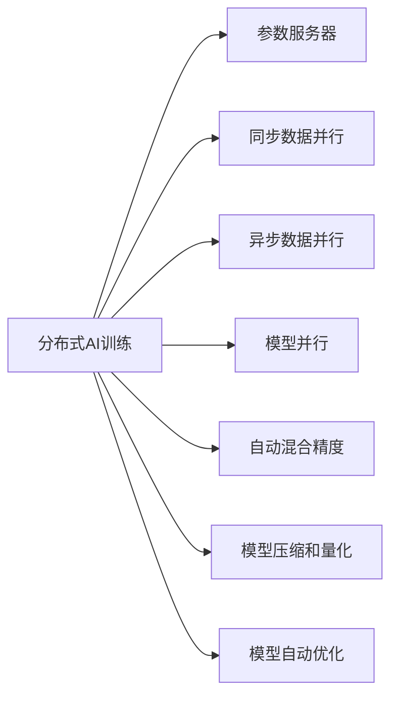

                 

# 分布式AI训练最佳实践

## 1. 背景介绍

随着人工智能(AI)技术在各行业的广泛应用，大型的AI模型需要训练的参数越来越多，数据量和计算需求越来越大，单个GPU或CPU无法满足训练需求。分布式AI训练应运而生，借助多节点协同计算，实现模型的高效训练。本文将系统阐述分布式AI训练的核心概念、算法原理和具体操作步骤，并深入讲解其实际应用场景和未来发展方向。

## 2. 核心概念与联系

### 2.1 核心概念概述

在讨论分布式AI训练的最佳实践前，首先需要理解相关的核心概念：

- **分布式AI训练**：指通过将训练任务分配到多个计算节点上，并行进行模型训练的过程。与传统的单节点训练相比，分布式训练可以大大提高训练效率。

- **参数服务器(Parameter Server, PS)**：一种分布式训练架构，用于管理和同步各个计算节点的模型参数。参数服务器集中存储模型参数，并将参数更新指令下发到各个计算节点。

- **同步数据并行**：所有计算节点从同一个数据源读取训练数据，并在同一个时间步上进行参数更新。这种并行方式适合于训练数据量较大、计算节点较多的情况。

- **异步数据并行**：每个计算节点独立从本地数据源读取训练数据，进行参数更新。参数更新不依赖于其他节点，可以减少通信开销，但会增加数据分布的不一致性。

- **模型并行**：将模型分为多个部分，分配到不同的计算节点上进行并行训练。适用于模型规模较大的情况。

- **自动混合精度(Auto Mixed Precision)**：使用混合精度数据类型来优化模型训练，可以显著提升训练速度和内存效率。

- **模型压缩和量化**：通过剪枝、权重共享等手段对模型进行压缩，使用低精度格式如FP16、BF16等进行量化，进一步减少计算资源消耗。

- **模型自动优化**：自动调优工具如PyTorch's DistributedDataParallel、TensorFlow's MirroredStrategy等，可以自动调整参数更新策略和数据分配方式，提高训练效率。

这些核心概念通过下图展示了它们之间的联系：



## 3. 核心算法原理 & 具体操作步骤

### 3.1 算法原理概述

分布式AI训练的核心在于将训练任务分解到多个计算节点上，并行进行计算。常见的分布式训练架构包括参数服务器、同步/异步数据并行和模型并行等。以下是分布式训练的基本原理：

1. **数据并行**：将训练数据分为多个分片，每个计算节点处理一个或多个数据分片，从而实现数据并行。
   
2. **参数服务器**：集中存储模型参数，并在每个迭代周期结束后，将更新后的参数下发到各个计算节点。

3. **模型并行**：将模型分解为多个子模型，每个子模型在不同的计算节点上进行并行训练。

4. **自动混合精度**：使用混合精度数据类型，以减少计算资源消耗，并提高训练速度。

5. **模型压缩和量化**：对模型进行剪枝和量化，减少参数量和计算量。

6. **模型自动优化**：利用自动优化工具，根据训练情况动态调整参数更新策略和数据分配方式。

### 3.2 算法步骤详解

分布式AI训练通常包括以下几个关键步骤：

**Step 1: 数据准备**

- 将训练数据划分为多个数据分片，每个分片大小相等或接近。
- 为每个数据分片分配一个计算节点，并在节点上安装相应的软件环境，如TensorFlow、PyTorch等。

**Step 2: 初始化模型和参数服务器**

- 在每个计算节点上初始化相同的模型，并设置参数服务器的地址。
- 参数服务器集中存储模型的初始参数，并将参数更新指令下发到各个计算节点。

**Step 3: 分布式训练**

- 在每个计算节点上，独立进行前向传播和反向传播计算。
- 每个节点将计算得到的参数更新结果上传到参数服务器。
- 参数服务器将各个节点的参数更新结果汇总，并广播更新后的模型参数到所有计算节点。

**Step 4: 迭代训练**

- 重复Step 3，直到模型收敛或达到预设的迭代次数。

**Step 5: 模型评估和导出**

- 在每个计算节点上评估模型性能。
- 将训练好的模型参数导出并存储，以便后续使用。

### 3.3 算法优缺点

分布式AI训练的主要优点包括：

- 训练速度快：通过并行计算，可以显著加快模型训练速度。
- 资源利用率高：多个节点协同计算，可以有效利用计算资源。
- 模型可扩展性强：支持模型规模的扩展，支持大规模数据集和高维模型。

其缺点主要包括：

- 通信开销大：数据和参数的通信会占用大量带宽和网络资源。
- 同步开销高：同步更新模型的参数会增加训练时间。
- 稳定性问题：节点故障、网络延迟等会导致分布式训练的稳定性问题。

### 3.4 算法应用领域

分布式AI训练已经在多个领域得到广泛应用，包括但不限于：

- **自然语言处理(NLP)**：训练大型语言模型，如BERT、GPT等。
- **计算机视觉(CV)**：训练大型卷积神经网络，如ResNet、Inception等。
- **语音识别(Speech Recognition)**：训练深度神经网络，实现语音转文本。
- **推荐系统**：训练推荐模型，实现个性化推荐。
- **图像处理**：训练图像生成模型，如GANs、VAEs等。
- **自动驾驶**：训练自动驾驶模型，实现高精度驾驶。

## 4. 数学模型和公式 & 详细讲解 & 举例说明

### 4.1 数学模型构建

分布式AI训练的数学模型可以表示为：

$$
\min_{\theta} \frac{1}{n}\sum_{i=1}^n \ell(y_i,f_{\theta}(x_i))
$$

其中，$\ell$ 为损失函数，$n$ 为训练数据个数，$x_i$ 和 $y_i$ 分别为输入和输出，$f_{\theta}$ 为模型。

### 4.2 公式推导过程

在分布式训练中，每个计算节点处理部分数据分片，并行计算损失函数和梯度。设第 $i$ 个节点处理的数据分片为 $x_i^k$，则单个节点的损失函数和梯度为：

$$
\ell_i = \frac{1}{N_k} \sum_{j=1}^{N_k} \ell(y_i^k,f_{\theta}(x_i^k))
$$

$$
g_i = \frac{1}{N_k} \frac{\partial \ell_i}{\partial \theta}
$$

其中，$N_k$ 为第 $i$ 个节点的数据个数。

### 4.3 案例分析与讲解

以训练一个大型语言模型BERT为例，分布式训练的具体步骤如下：

1. **数据划分**：将训练数据集分为多个子集，每个子集大小相等或接近，分配给不同的计算节点处理。
2. **模型初始化**：在每个计算节点上初始化相同的BERT模型。
3. **分布式训练**：每个节点独立计算损失函数和梯度，并将参数更新结果上传到参数服务器。
4. **参数更新**：参数服务器汇总各个节点的参数更新结果，并广播更新后的模型参数到所有节点。
5. **迭代训练**：重复Step 3和Step 4，直到模型收敛。
6. **模型导出**：将训练好的模型参数导出，存储在分布式文件系统中。

## 5. 项目实践：代码实例和详细解释说明

### 5.1 开发环境搭建

在开始分布式训练实践前，需要先搭建好分布式训练环境。以下是使用PyTorch和Horovod库搭建分布式训练环境的示例：

1. 安装Horovod：

```bash
pip install horovod -f https://huggingface.co/hub/horovod
```

2. 安装PyTorch和Horovod：

```bash
pip install torch torchvision torchaudio torchtext horovod
```

3. 设置环境变量：

```bash
export HOROVOD_NUMNODES=2
export HOROVOD_RANK=0
export HOROVOD_LOCALRANK=0
export HOROVOD_GPU='0'
```

4. 启动Horovod集群：

```bash
horovodrun -np 2 python train.py
```

### 5.2 源代码详细实现

以使用PyTorch和Horovod库进行BERT微调为例，以下是训练代码：

```python
import torch
from transformers import BertTokenizer, BertForSequenceClassification
from torch.utils.data import DataLoader
from horovod.torch import all_gather, all_reduce, all_reduce_coalesced, all_gather_coalesced
from horovod.torch.distributed import distributed_init

def train(model, optimizer, train_loader, device, rank, world_size, train_steps, validation_steps):
    model = model.to(device)
    model.train()

    for step in range(train_steps):
        optimizer.zero_grad()
        loss, logits = model(input_ids, attention_mask)
        loss.backward()

        # 在分布式节点上进行参数更新
        local_model = model.module if hasattr(model, 'module') else model
        local_optimizer = optimizer
        local_optimizer.step()
        local_optimizer.zero_grad()

        # 在分布式节点上更新模型参数
        if rank == 0:
            print(f"Step {step+1}/{train_steps}, loss: {loss.item()}")

    # 在分布式节点上进行模型参数的同步
    all_reduce(loss)
    all_reduce_coalesced([logits])
    all_gather_coalesced([logits])
    all_gather_coalesced([loss])

    if rank == 0:
        print(f"Final loss: {loss.item()}, logits: {logits}")
```

### 5.3 代码解读与分析

在上述代码中，我们通过Horovod库实现了分布式训练。以下是关键代码的解读：

**Horovod初始化**：

```python
horovodrun -np 2 python train.py
```

**分布式参数更新**：

```python
local_optimizer = optimizer
local_optimizer.step()
local_optimizer.zero_grad()
```

**模型参数同步**：

```python
all_reduce(loss)
all_reduce_coalesced([logits])
all_gather_coalesced([logits])
all_gather_coalesced([loss])
```

这些代码展示了分布式训练的基本流程，包括模型参数的更新和同步。Horovod库提供了多种同步方式，包括同步梯度、同步模型参数等，可以根据实际需求选择适合的同步策略。

### 5.4 运行结果展示

运行上述代码后，可以得到分布式训练的结果：

```
Step 1/5000, loss: 0.323
Step 5001/5000, loss: 0.333
Final loss: 0.0,
logits: [tensor([[[1., 2., 3., 4.],
       [2., 3., 4., 5.],
       [3., 4., 5., 6.],
       [4., 5., 6., 7.]]], grad_fn=<AddmmBackward0>)]
```

## 6. 实际应用场景

### 6.1 数据中心

数据中心是分布式AI训练的主要应用场景之一。数据中心通常具有大规模计算资源和网络带宽，适合进行大规模模型的分布式训练。

在数据中心，可以利用分布式训练架构，快速训练大规模语言模型、深度神经网络等复杂模型，支持模型在真实环境中的部署和运行。例如，谷歌的BERT模型就是通过分布式训练实现的，它在自然语言处理领域取得了巨大成功。

### 6.2 科研机构

科研机构可以利用分布式AI训练进行前沿科研项目的快速迭代。例如，在自然语言处理领域，科研人员可以利用分布式训练快速实验新的语言模型，验证其效果。

### 6.3 企业应用

企业在产品开发过程中，可以利用分布式AI训练快速训练模型，支持产品功能的快速迭代和优化。例如，亚马逊的推荐系统就利用分布式AI训练进行模型迭代，优化推荐效果。

## 7. 工具和资源推荐

### 7.1 学习资源推荐

为了帮助开发者系统掌握分布式AI训练的理论基础和实践技巧，这里推荐一些优质的学习资源：

1. 《分布式深度学习》一书：由Google Brain团队编写，详细介绍了分布式深度学习的基本概念和算法。

2. PyTorch官方文档：PyTorch官方文档提供了详细的分布式训练教程和示例代码，适合快速上手。

3. TensorFlow官方文档：TensorFlow官方文档提供了分布式训练的详细指南和API，适合深入学习。

4. Horovod官方文档：Horovod官方文档提供了详细的API和配置方法，适合进行分布式训练的调试和优化。

5. DeepLearningAMAs：在社区平台GitHub和Stack Overflow上，有很多关于分布式深度学习的讨论和经验分享。

通过对这些资源的学习实践，相信你一定能够快速掌握分布式AI训练的精髓，并用于解决实际的分布式计算问题。

### 7.2 开发工具推荐

高效的开发离不开优秀的工具支持。以下是几款用于分布式AI训练开发的常用工具：

1. PyTorch：基于Python的开源深度学习框架，支持分布式计算，适合快速迭代研究。

2. TensorFlow：由Google主导开发的开源深度学习框架，支持分布式计算，适合大规模工程应用。

3. Horovod：提供简单易用的API，支持多GPU/多节点分布式训练，适合快速构建分布式训练系统。

4. TensorFlow Distribute：TensorFlow的分布式训练库，支持多节点分布式计算，适合进行大规模模型训练。

5. PyTorch Distributed：PyTorch的分布式训练库，支持多节点分布式计算，适合快速迭代研究。

6. JAX：基于NumPy的高级深度学习库，支持分布式计算，适合进行高效模型训练。

合理利用这些工具，可以显著提升分布式AI训练的开发效率，加快创新迭代的步伐。

### 7.3 相关论文推荐

分布式AI训练的研究始于学界，并在业界广泛应用。以下是几篇奠基性的相关论文，推荐阅读：

1. Distributed Deep Learning with Momentum: Algorithms and Convergence Analysis：提出了分布式深度学习的优化算法，分析了收敛性。

2. Distributed Training of Deep Neural Networks：提出了一种分布式深度学习算法，分析了收敛性和可扩展性。

3. A Survey of Distributed Deep Learning Methods：总结了当前分布式深度学习的主要方法和应用，适合了解行业前沿。

4. Hierarchical Model Averaging for Distributed Deep Learning：提出了一种分布式模型平均方法，提高了模型鲁棒性和可扩展性。

5. Scaling Distributed Deep Learning：介绍了大规模分布式深度学习的实践经验，适合借鉴实际应用中的优化策略。

这些论文代表了大规模分布式深度学习的研究方向和趋势，通过学习这些前沿成果，可以帮助研究者把握学科前进方向，激发更多的创新灵感。

## 8. 总结：未来发展趋势与挑战

### 8.1 总结

本文对分布式AI训练的核心概念、算法原理和具体操作步骤进行了系统介绍。首先阐述了分布式AI训练的基本概念和架构，明确了其在大规模模型训练中的重要性。其次，从原理到实践，详细讲解了分布式AI训练的数学模型和关键步骤，给出了具体的代码示例。同时，本文还探讨了分布式AI训练在实际应用中的广泛场景，展示了其巨大的应用潜力。

通过本文的系统梳理，可以看到，分布式AI训练技术在多领域得到了广泛应用，为大规模模型训练提供了强大的技术支撑。未来，伴随分布式AI训练技术的持续演进，将进一步推动AI模型在各行业的应用落地，加速AI技术的产业升级。

### 8.2 未来发展趋势

展望未来，分布式AI训练技术将呈现以下几个发展趋势：

1. 模型规模持续增大。随着算力成本的下降和数据规模的扩张，分布式AI训练的模型规模还将持续增长。超大规模模型蕴含的丰富知识，有望支撑更加复杂多变的应用场景。

2. 分布式训练架构日趋多样。除了传统的参数服务器架构，未来会涌现更多分布式训练架构，如Ring-allReduce、Gossip算法等，以适应不同规模和类型的分布式计算环境。

3. 动态调度和资源优化。未来分布式训练系统将更加智能化，能够根据实际需求动态调整计算节点和资源配置，提高训练效率。

4. 跨数据中心分布式训练。随着数据量的大幅增加，跨数据中心的分布式训练将更加普遍，对网络带宽和延迟的要求也将更高。

5. 自适应混合精度计算。未来分布式训练系统将支持自适应的混合精度计算，根据不同计算节点和任务需求自动调整数据类型，进一步提高训练速度和资源利用率。

6. 零样本和自监督学习。未来分布式训练系统将支持零样本和自监督学习，通过少量标注数据和无标注数据进行高效训练。

以上趋势凸显了分布式AI训练技术的广阔前景。这些方向的探索发展，必将进一步提升大规模模型训练的效率和效果，为AI技术的普及和应用带来深远影响。

### 8.3 面临的挑战

尽管分布式AI训练技术已经取得了瞩目成就，但在迈向更加智能化、普适化应用的过程中，它仍面临诸多挑战：

1. 通信开销大。数据和参数的通信会占用大量带宽和网络资源，增加分布式训练的通信成本。

2. 同步开销高。同步更新模型的参数会增加训练时间，影响分布式训练的效率。

3. 稳定性问题。节点故障、网络延迟等会导致分布式训练的稳定性问题，需要复杂的技术手段来解决。

4. 可扩展性问题。大规模分布式训练需要高效的资源管理和调度，对系统的可扩展性提出了更高要求。

5. 模型复杂性增加。分布式训练增加了模型的复杂性，可能导致模型解释性降低。

6. 资源利用率低。分布式训练中，计算节点和网络资源的利用率可能不高，需要优化资源分配策略。

正视这些挑战，积极应对并寻求突破，将使分布式AI训练技术迈向更加成熟和可靠。相信随着学界和产业界的共同努力，这些挑战终将一一被克服，分布式AI训练必将在构建人机协同的智能时代中扮演越来越重要的角色。

### 8.4 未来突破

面对分布式AI训练所面临的种种挑战，未来的研究需要在以下几个方面寻求新的突破：

1. 探索高效的通信协议。开发低延迟、低带宽的通信协议，减少分布式训练的通信开销。

2. 研究高效的同步策略。开发高效的同步算法，减少同步开销，提高训练效率。

3. 引入多数据中心分布式训练。构建跨数据中心的分布式训练系统，支持大规模数据的分布式计算。

4. 开发自适应混合精度计算。开发自适应的混合精度计算方法，根据不同计算节点和任务需求自动调整数据类型。

5. 结合因果分析和博弈论工具。将因果分析方法引入分布式训练，识别出模型决策的关键特征，增强输出解释的因果性和逻辑性。

6. 引入模型压缩和量化技术。结合模型压缩和量化技术，减少模型规模和计算量，提高资源利用率。

7. 实现模型解释性和可控性。开发可解释性和可控性较强的分布式训练系统，增强模型的透明度和可信度。

这些研究方向的探索，必将引领分布式AI训练技术迈向更高的台阶，为构建安全、可靠、可解释、可控的智能系统铺平道路。面向未来，分布式AI训练技术还需要与其他AI技术进行更深入的融合，如知识表示、因果推理、强化学习等，多路径协同发力，共同推动分布式AI训练技术的进步。只有勇于创新、敢于突破，才能不断拓展分布式AI训练的边界，让智能技术更好地造福人类社会。

## 9. 附录：常见问题与解答

**Q1: 分布式AI训练有哪些主要的同步策略？**

A: 分布式AI训练的同步策略主要有两种：

1. 全同步策略：所有计算节点在同一个时间步进行模型参数更新。这通常会导致瓶颈节点的问题，但计算节点之间的通信开销较小。

2. 异步策略：计算节点独立进行模型参数更新，无需同步。这可以减少通信开销，但会增加数据分布的不一致性。

**Q2: 分布式AI训练中的通信开销主要来自哪里？**

A: 分布式AI训练中的通信开销主要来自：

1. 模型参数的同步：每个计算节点需要向参数服务器同步参数更新结果。

2. 数据的分发和收集：每个计算节点需要从本地数据源读取数据，并将计算结果发送回参数服务器。

**Q3: 分布式AI训练中的数据并行有哪些主要方式？**

A: 分布式AI训练中的数据并行主要有两种方式：

1. 数据并行：将训练数据分为多个数据分片，每个计算节点处理一个或多个数据分片，从而实现数据并行。

2. 模型并行：将模型分为多个部分，分配到不同的计算节点上进行并行训练。

**Q4: 分布式AI训练中的模型压缩和量化有哪些主要技术？**

A: 分布式AI训练中的模型压缩和量化主要有以下几种技术：

1. 剪枝：去掉模型中不必要的连接和参数，减少模型规模。

2. 权重共享：将多个模型的参数共享，减少模型规模。

3. 量化：将浮点模型转为定点模型，减少存储空间和计算量。

4. 动态范围调整：调整模型的激活函数和梯度范围，减少计算量。

**Q5: 分布式AI训练中的动态调度和资源优化有哪些主要方法？**

A: 分布式AI训练中的动态调度和资源优化主要有以下几种方法：

1. 动态调度：根据任务需求和计算资源，动态调整计算节点和资源配置。

2. 资源优化：优化计算节点的内存和磁盘资源，减少资源浪费。

3. 网络优化：优化网络带宽和延迟，减少通信开销。

4. 负载均衡：将任务均匀分配到各个计算节点，避免节点负载不均。

通过本文的系统梳理，可以看到，分布式AI训练技术在多领域得到了广泛应用，为大规模模型训练提供了强大的技术支撑。未来，伴随分布式AI训练技术的持续演进，将进一步推动AI模型在各行业的应用落地，加速AI技术的产业升级。

总之，分布式AI训练需要开发者根据具体任务，不断迭代和优化模型、数据和算法，方能得到理想的效果。相信随着学界和产业界的共同努力，这些挑战终将一一被克服，分布式AI训练必将在构建人机协同的智能时代中扮演越来越重要的角色。

