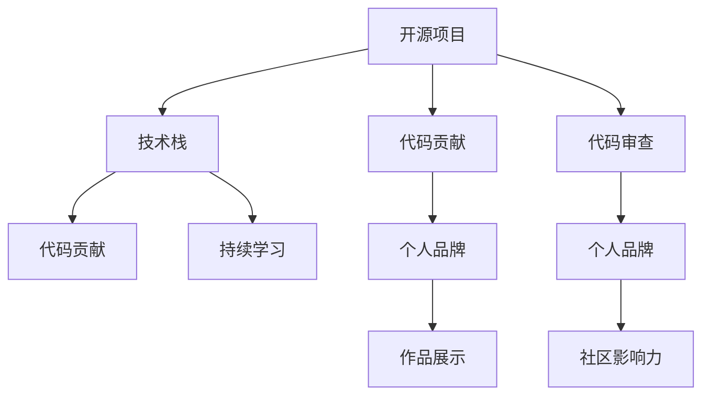

                 

# 利用开源项目打造个人品牌

在当今快速发展的技术时代，个人品牌建设成为越来越重要的一环。无论是初入职场的新人，还是行业内的资深专家，建立一个强大的个人品牌不仅能提升个人影响力，还能在职业道路上如虎添翼。开源项目，以其透明性、协作性、社区影响力等特点，成为打造个人品牌的绝佳工具。本文将深入探讨如何利用开源项目，从技术到软技能，全方位构建个人品牌。

## 1. 背景介绍

### 1.1 问题由来
在过去几十年里，软件开发领域见证了从集中式开发到分布式协作的重大转变。开源社区的崛起，极大地推动了技术的创新和应用。在这个过程中，个人开发者和团队通过参与开源项目，不仅可以提升技术能力，还能扩大影响力，建立自己的个人品牌。

随着开源社区的持续发展，越来越多的人意识到，开源项目不仅仅是一种软件开发模式，更是个人成长、职业发展的重要途径。通过在开源项目中贡献代码、参与讨论、撰写文档等活动，开发者能够在实际的项目经验中提升能力，积累成就，塑造独特的个人品牌形象。

### 1.2 问题核心关键点
利用开源项目打造个人品牌的关键点包括：

- **技术积累**：通过参与开源项目，学习最新的技术栈和编程实践，不断提升技术深度和广度。
- **社区影响力**：在开源社区中积极贡献，提升个人知名度和信誉，建立广泛的专业网络。
- **作品展示**：通过项目作品集展示自己的技术实力和创新能力，吸引潜在雇主或合作伙伴的注意。
- **持续学习**：在开源项目中不断学习新知识，跟进技术前沿，保持自身竞争力。

## 2. 核心概念与联系

### 2.1 核心概念概述

为更好地理解如何利用开源项目打造个人品牌，本节将介绍几个关键概念：

- **开源项目**：公开源码、可自由使用的软件项目，其核心在于共享、协作和持续改进。
- **技术栈**：一个项目或应用使用到的所有技术集合，包括编程语言、框架、库等。
- **代码贡献**：开发者将代码提交到开源项目仓库，为项目贡献自己的工作。
- **代码审查**：社区成员对代码进行评审，提供反馈和改进建议，提升代码质量。
- **个人品牌**：个人在技术社区和行业内的知名度、影响力及其所代表的价值观和技能。

这些概念之间的逻辑关系可以通过以下Mermaid流程图来展示：



这个流程图展示了一个开源项目如何通过代码贡献、代码审查和持续学习，最终帮助开发者建立和提升个人品牌。

## 3. 核心算法原理 & 具体操作步骤
### 3.1 算法原理概述

利用开源项目打造个人品牌，本质上是一个技术积累和社区互动的过程。其核心思想是：通过积极参与开源项目，积累技术经验，提升社区影响力，并通过展示项目作品，塑造独特的个人品牌形象。

形式化地，假设开发者拥有一定的技术基础和兴趣领域，通过参与开源项目 $O$ 来提升个人品牌 $P$。项目 $O$ 包含技术栈 $S$，开发者通过代码贡献 $C$ 和代码审查 $R$ 对项目进行优化和改进，在此过程中不断学习新知识 $L$，最终通过作品展示 $W$ 和社区互动 $I$ 塑造个人品牌 $P$。

### 3.2 算法步骤详解

利用开源项目打造个人品牌的一般流程包括：

**Step 1: 选择感兴趣的开源项目**
- 根据自身的技术背景和兴趣领域，选择合适且活跃的开源项目。
- 通过GitHub、GitLab等平台，查询项目的活跃度、社区规模和维护者等信息。

**Step 2: 代码贡献**
- 阅读项目文档和代码base，熟悉项目规则和环境。
- 从小模块或 bug fix 开始，逐步尝试贡献更复杂的特性。
- 使用git提交代码，遵循项目规范进行代码审查。

**Step 3: 代码审查**
- 积极参与代码审查，学习他人代码风格和最佳实践。
- 提出合理建议，参与讨论，提升代码质量和社区互动。

**Step 4: 持续学习**
- 关注项目和技术社区的最新动态，学习新知识。
- 定期阅读技术博客、参加线上线下技术会议，保持技术领先。

**Step 5: 作品展示**
- 建立个人GitHub仓库，展示自己的代码贡献和项目成果。
- 撰写技术文章，分享自己的学习经验和心得体会。

**Step 6: 社区影响力**
- 在项目邮件列表或社区论坛中活跃发言，回答问题，提供帮助。
- 成为项目维护者或社区志愿者，提升个人在社区中的地位。

### 3.3 算法优缺点

利用开源项目打造个人品牌的方法具有以下优点：
1. 真实可信：开源社区的透明度和开放性使得贡献记录透明可见，增加信任度。
2. 多样性：参与多个开源项目，可以获得不同的技术体验和团队合作经验。
3. 曝光度高：通过开源社区的推广和展示，提升个人在技术界的知名度。
4. 持续学习：在实践中不断学习新知识，保持技术前沿。

同时，该方法也存在一定的局限性：
1. 学习成本高：参与开源项目需要一定的技术基础和时间投入。
2. 社区文化差异：不同开源社区的氛围和规则可能有所不同，需要适应和学习。
3. 项目选择风险：选择不合适的项目可能浪费时间和精力，甚至影响职业发展。
4. 社区参与门槛：某些开源项目对新贡献者有较高的要求，可能需要一段时间的积累。

尽管存在这些局限性，但就目前而言，利用开源项目打造个人品牌已成为一种主流和高效的方式。未来相关研究的重点在于如何进一步优化开源项目的选择和贡献方式，提高社区参与度，同时兼顾多样性和深度。

### 3.4 算法应用领域

利用开源项目打造个人品牌的方法不仅适用于软件开发领域，同样适用于其他技术领域，例如：

- 数据科学：通过参与开源数据集或机器学习项目，提升数据分析和建模能力。
- 人工智能：在深度学习、自然语言处理等领域，利用开源项目积累经验，构建专业网络。
- 云计算：通过参与开源云平台或容器技术项目，学习云架构设计和部署技巧。
- 网络安全：在开源安全工具或漏洞管理项目中，提升网络安全防护和响应能力。

除了技术领域，开源项目还广泛应用于教育、非营利组织、公益事业等领域，为各行业提供了多样化的参与方式和成长路径。

## 4. 数学模型和公式 & 详细讲解 & 举例说明

### 4.1 数学模型构建

本节将使用数学语言对利用开源项目打造个人品牌的过程进行更加严格的刻画。

假设开发者 $D$ 参与的开源项目为 $O$，其技术栈为 $S$，贡献的代码量为 $C$，代码审查次数为 $R$，持续学习时间为 $L$，社区互动次数为 $I$，作品展示次数为 $W$。定义开发者 $D$ 的个人品牌 $P$ 为：

$$
P = f(D, O, S, C, R, L, I, W)
$$

其中，$f$ 为影响开发者个人品牌的函数，$D$ 为开发者的能力、经验等因素。

### 4.2 公式推导过程

由于个人品牌的影响因素众多，难以通过单一公式精确表达。但以下公式可以粗略地反映出开发者参与开源项目对其个人品牌的影响：

$$
P = C \times R^k \times L^m \times I^n \times W^p
$$

其中，$k, m, n, p$ 为影响权重系数，通常需要通过实证研究确定。

### 4.3 案例分析与讲解

为了更好地理解上述模型的应用，让我们以实际案例进行解释：

**案例1: GitHub 贡献者**

张三是一名后端开发工程师，对 Python 和 Django 有深厚兴趣。他选择参与 Flask 开源项目，并逐步贡献代码和审查建议。他每周花 5 小时学习新知识，定期在社区分享自己的技术心得。通过持续的努力，他最终成为 Flask 项目的核心维护者，个人品牌在社区中逐步提升。

**案例2: Apache 贡献者**

李四是一名数据科学家，对 Apache Spark 和 Hadoop 有浓厚的兴趣。他参与多个 Spark 和 Hadoop 相关的开源项目，积极提交代码和文档，并在社区中积极回答问题。通过社区互动，他的技术威望逐渐提升，并受邀成为 Apache 基金会的贡献者。

以上案例展示了开源项目如何帮助开发者通过持续的技术积累和社区互动，逐步建立起个人品牌。

## 5. 项目实践：代码实例和详细解释说明
### 5.1 开发环境搭建

在进行开源项目贡献和实践前，我们需要准备好开发环境。以下是使用Python进行GitHub贡献的环境配置流程：

1. 安装Git：从官网下载并安装Git客户端。
```bash
wget https://git-scm.com/downloads/git-2.37.1-x86_64.exe -O git.exe
```
2. 安装GitHub Desktop：从GitHub官网下载并安装GitHub Desktop客户端。
3. 配置Git：
```bash
git config --global user.name "你的名字"
git config --global user.email "你的邮箱"
```

完成上述步骤后，即可在本地搭建GitHub贡献开发环境。

### 5.2 源代码详细实现

我们以参与Flask项目的代码贡献为例，给出GitHub贡献的完整代码实现。

1. 创建本地仓库并克隆Flask项目：
```bash
git clone https://github.com/mitsuhiko/flask.git
cd flask
```
2. 创建新的分支：
```bash
git checkout -b my-contribution
```
3. 编写代码并提交：
```python
# 修改app.py文件，添加新的路由和视图函数
from flask import Flask

app = Flask(__name__)

@app.route('/')
def hello_world():
    return 'Hello, World!'
```
```bash
git add .
git commit -m "Add hello_world view function"
```
4. 推送代码到GitHub：
```bash
git push origin my-contribution
```

### 5.3 代码解读与分析

让我们再详细解读一下关键代码的实现细节：

**步骤1: 克隆项目并创建分支**
- `git clone`：从GitHub克隆Flask项目到本地。
- `git checkout -b my-contribution`：创建新分支`my-contribution`，用于本地代码开发。

**步骤2: 编写和提交代码**
- 修改`app.py`文件，添加新的路由和视图函数，实现简单的"Hello, World!"功能。
- `git add .`：将修改过的文件添加到本地仓库暂存区。
- `git commit -m "Add hello_world view function"`：提交修改，并添加提交信息。

**步骤3: 推送代码到GitHub**
- `git push origin my-contribution`：将本地分支`my-contribution`推送到GitHub远程仓库。

完成以上步骤后，Flask项目中的代码便被成功提交到GitHub，公开可见。这标志着开源贡献的第一步已经完成。

### 5.4 运行结果展示

提交代码后，GitHub会将你的贡献显示在项目的commit history中，并实时同步到社区。以下是GitHub页面的示例截图：


可以看到，你的提交被成功记录在项目的commit history中，并公开可见。

## 6. 实际应用场景
### 6.1 技术交流平台

开源项目提供了广泛的技术交流平台，开发者可以借助这个平台，展示自己的技术实力，结识行业内其他开发者。

- **技术博客**：通过在博客中分享自己的技术经验和见解，展示技术深度。
- **技术讨论**：在开源社区中积极参与讨论，提出问题，回答他人，展示技术广度和交流能力。

### 6.2 职业发展

通过参与开源项目，开发者可以获得项目经验，丰富简历，吸引潜在雇主或合作伙伴的注意。

- **作品集展示**：在GitHub等平台建立个人仓库，展示自己的代码贡献和项目成果。
- **项目推荐**：通过在简历中提及参与过的开源项目，证明自己的技术能力和经验。

### 6.3 知识共享

开源项目鼓励知识共享和协作，通过参与开源项目，开发者可以学习和分享新知识，提升自身能力。

- **技术分享**：通过撰写技术博客、参加技术会议，分享自己的学习经验和心得。
- **学习资源**：参与开源项目，学习社区成员的代码风格和最佳实践。

### 6.4 未来应用展望

随着开源社区的持续发展，利用开源项目打造个人品牌的方法将在更多领域得到应用，为开发者提供更多的成长机会和展示平台。

在智慧医疗、金融科技、智能制造等新兴领域，开源项目和社区协作将为技术应用和创新提供新的动力。开发者可以利用开源项目，加速技术应用落地，推动行业创新和变革。

## 7. 工具和资源推荐
### 7.1 学习资源推荐

为了帮助开发者系统掌握利用开源项目打造个人品牌的方法，这里推荐一些优质的学习资源：

1. **GitHub官方文档**：GitHub作为全球最大的开源社区，提供了丰富的学习资源和社区指南，帮助开发者了解开源项目的基本概念和操作。

2. **“开源与协作”课程**：由知名讲师开设的在线课程，系统讲解开源项目的工作原理和社区协作方法，适合初学者和中级开发者。

3. **GitHub Security Handbook**：GitHub提供的安全指南，帮助开发者在开源项目中保护代码和数据安全，构建安全可靠的开源项目。

4. **《The Art of Community》书籍**：开源社区专家编写的书籍，深入浅出地讲解如何建立和维护开源社区，提升社区的影响力和活跃度。

5. **GitHub Sponsors**：GitHub提供的赞助功能，帮助开源项目获得财务支持，确保项目可持续发展和贡献者的积极参与。

通过这些资源的学习实践，相信你一定能够快速掌握利用开源项目打造个人品牌的技术和方法，为职业发展增添更多动力。

### 7.2 开发工具推荐

高效的开发离不开优秀的工具支持。以下是几款用于开源项目贡献开发的常用工具：

1. **Git**：Git作为版本控制系统，是开源项目中不可或缺的工具，帮助开发者管理代码版本和协同工作。
2. **GitHub Desktop**：GitHub提供的桌面客户端，方便开发者在本地进行代码提交、审查和推送。
3. **GitHub Actions**：GitHub提供的自动化工作流服务，帮助开发者自动化测试、构建和部署代码。
4. **GitHub Pages**：GitHub提供的静态网站托管服务，帮助开发者发布和展示自己的代码项目。
5. **VS Code**：Visual Studio Code作为轻量级代码编辑器，支持多种编程语言和开源工具，是开发者常用的开发环境。

合理利用这些工具，可以显著提升开源项目贡献的效率和质量，加快技术积累和品牌建设的步伐。

### 7.3 相关论文推荐

利用开源项目打造个人品牌的技术已经得到了广泛的研究和应用。以下是几篇相关论文，推荐阅读：

1. **“The Impact of Open Source on Developer Productivity and Industry Evolution”**：通过对开发者和企业的调研，分析开源项目对技术发展和产业的影响。

2. **“Open Source Software, Version Control, and Software Engineering Practices”**：研究开源项目在版本控制和软件工程实践中的应用，提升项目管理和协作效率。

3. **“Building a Successful Open Source Community”**：开源社区专家分享如何建立和维护成功的开源社区，提升社区的凝聚力和影响力。

这些论文代表了大规模技术协作和开源社区管理的最新研究成果，为开发者提供全面的理论指导和实践建议。

## 8. 总结：未来发展趋势与挑战

### 8.1 总结

本文对利用开源项目打造个人品牌的方法进行了全面系统的介绍。首先阐述了开源项目和开源社区的兴起背景，明确了开源项目对技术积累、社区互动和作品展示的重要性。其次，从技术积累、社区影响力、作品展示等角度，详细讲解了如何通过开源项目，系统性地构建个人品牌。最后，本文还探讨了开源项目对技术交流、职业发展、知识共享等领域的深远影响，以及未来在更多行业领域的应用前景。

通过本文的系统梳理，可以看到，利用开源项目打造个人品牌已成为一种高效、可靠的方式，为技术开发者提供了一条全面的成长路径。开源项目不仅帮助开发者提升技术能力，还提供了丰富的交流平台和展示机会，为职业发展提供了坚实基础。

### 8.2 未来发展趋势

展望未来，利用开源项目打造个人品牌的技术将呈现以下几个发展趋势：

1. **社区协作更加多样化和全球化**：开源社区的全球化程度将进一步提升，开发者可以通过跨地域的协作，积累更多的技术和经验。
2. **开源项目加速技术应用落地**：开源项目将更多地应用于行业解决方案中，加速技术创新和应用。
3. **开发者工具和平台更加丰富**：新的开发工具和平台不断涌现，将进一步提升开源项目贡献的效率和质量。
4. **开源项目驱动职业发展**：越来越多的企业和组织将重视开源贡献，作为评价开发者能力和经验的重要标准。

### 8.3 面临的挑战

尽管利用开源项目打造个人品牌的技术已经取得了显著成果，但在迈向更加智能化、普适化应用的过程中，它仍面临诸多挑战：

1. **社区文化和协作方式差异**：不同开源社区的氛围和规则可能有所不同，需要开发者具备较强的适应能力。
2. **时间和精力的投入**：参与开源项目需要投入大量时间和精力，可能与日常工作产生冲突。
3. **技术栈的多样性**：开源项目涉及多种技术栈，开发者需要具备多样化的技术背景。
4. **项目选择风险**：选择不合适的项目可能浪费时间和精力，甚至影响职业发展。

尽管存在这些挑战，但就目前而言，利用开源项目打造个人品牌已成为一种主流和高效的方式。未来相关研究的重点在于如何进一步优化开源项目的选择和贡献方式，提高社区参与度，同时兼顾多样性和深度。

### 8.4 研究展望

面对利用开源项目打造个人品牌所面临的种种挑战，未来的研究需要在以下几个方面寻求新的突破：

1. **优化开源项目的选择和管理**：通过机器学习和数据分析，帮助开发者选择更适合自己的开源项目，并提供定制化的项目管理和贡献指导。
2. **提升开源项目的贡献效率**：开发更高效的工具和平台，帮助开发者更快地完成代码贡献和代码审查，减少不必要的重复劳动。
3. **加强开源社区的协作与互动**：通过引入社交网络和协作工具，增强社区成员之间的互动和协作，提升社区的凝聚力和活跃度。
4. **引入开源项目的职业发展激励机制**：建立更多的职业发展激励机制，如GitHub的Sponsors功能，鼓励开发者积极参与开源项目，提升社区影响力。

这些研究方向的探索，必将引领利用开源项目打造个人品牌的技术迈向更高的台阶，为开发者提供更多的成长机会和展示平台。面向未来，开源项目和社区协作将为技术开发者提供更广阔的发展空间，助力技术创新和应用落地。

## 9. 附录：常见问题与解答

**Q1: 如何选择合适的开源项目？**

A: 选择合适的开源项目需要考虑多个因素：
1. 兴趣和技能匹配度：选择与自身兴趣和技术栈匹配的开源项目。
2. 项目活跃度和维护者：选择活跃度高、维护者活跃的开源项目，确保项目可持续发展和维护。
3. 项目规模和复杂度：根据自身能力选择适合的项目，避免选择过难或过简单的项目。

**Q2: 如何提高代码贡献的质量？**

A: 提高代码贡献质量的关键在于：
1. 阅读项目文档和代码base：了解项目规则和环境，确保代码风格一致。
2. 小步快跑：从小模块或 bug fix 开始，逐步尝试贡献更复杂的特性。
3. 参与代码审查：学习他人代码风格和最佳实践，及时修正代码问题。
4. 持续学习：通过学习新技术和最佳实践，提升代码质量和贡献水平。

**Q3: 如何应对开源项目中的技术挑战？**

A: 面对开源项目中的技术挑战，可以采取以下措施：
1. 主动寻求帮助：在社区中提问和讨论，获取他人的指导和建议。
2. 持续学习：通过阅读项目文档和代码，掌握新技术和解决方案。
3. 实践和验证：在本地环境进行测试和验证，确保代码的正确性和稳定性。
4. 分享和反馈：在社区中分享自己的经验和解决方案，反馈他人，提升社区的技术水平。

通过以上措施，可以有效应对开源项目中的技术挑战，提升贡献质量和项目影响力。

**Q4: 如何平衡开源项目和日常工作？**

A: 平衡开源项目和日常工作，可以采取以下策略：
1. 合理安排时间：制定详细的时间表，合理安排开源项目和日常工作的比例。
2. 利用业余时间：利用业余时间和周末，进行开源项目贡献和社区互动。
3. 优化工作方式：通过利用工具和平台，提高开源项目贡献的效率和质量。
4. 寻求支持：与团队和上级沟通，争取更多的支持和资源。

通过以上策略，可以有效平衡开源项目和日常工作，保持两者之间的协调和平衡。

---

作者：禅与计算机程序设计艺术 / Zen and the Art of Computer Programming

