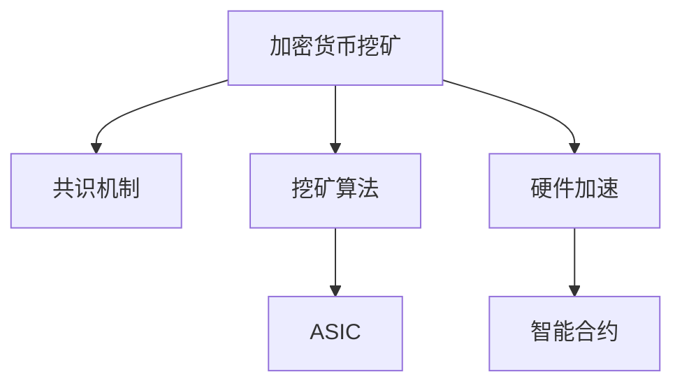

                 

## 1. 背景介绍

在区块链和加密货币的世界里，挖矿是一种重要的活动，它使得密码学货币系统保持运行，并为网络中的参与者带来收入。然而，随着加密货币市场的波动和算力竞争的加剧，传统挖矿模式的利润空间变得越来越狭窄。为了寻求突破，一些创新者开始探索利用技术优势进行更高效的加密货币挖矿。本文将深入探讨这一主题，从背景到核心概念，再到实践操作步骤，旨在为读者提供全面的技术见解。

### 1.1 问题的由来

加密货币挖矿的基本原理是使用计算资源来解决一个复杂的问题，这个问题的解决结果可以用来验证和保护交易，同时也为矿工提供新的货币作为奖励。传统的挖矿模式依赖于大量的计算资源（如GPU或ASIC设备）和电力成本，这在经济和环境方面都带来了显著的负担。

### 1.2 问题的核心关键点

- **技术优势**：如何通过技术创新提高挖矿效率和降低成本。
- **算法优化**：改进挖矿算法，减少计算资源消耗。
- **硬件升级**：开发新型硬件以提升算力。
- **共识机制**：选择更高效的共识机制以优化挖矿过程。
- **去中心化**：探索去中心化的挖矿模式，降低中心化风险。

## 2. 核心概念与联系

### 2.1 核心概念概述

为更好地理解利用技术优势进行加密货币挖矿的原理，本节将介绍几个关键概念：

- **加密货币挖矿**：通过解决区块链中的复杂计算问题来获得新货币的过程。
- **共识机制**：确保网络中所有参与者就交易的有效性达成一致的协议。
- **挖矿算法**：设计用于解决区块链中复杂问题的计算算法。
- **硬件加速**：通过专用硬件加速器（如ASIC）来提升挖矿速度。
- **智能合约**：基于编程语言编写的自执行合约，可以自动化挖矿过程。

这些核心概念之间的逻辑关系可以通过以下Mermaid流程图来展示：



这个流程图展示了大规模挖矿的基本流程：

1. 通过解决一个复杂问题来获取新货币（A）。
2. 使用共识机制来确保网络中所有参与者的交易一致性（B）。
3. 设计挖矿算法来处理计算问题（C）。
4. 利用专用硬件加速器来提升算力（D）。
5. 使用智能合约自动化挖矿过程（F）。

## 3. 核心算法原理 & 具体操作步骤

### 3.1 算法原理概述

利用技术优势进行加密货币挖矿的核心理论基于以下几个原则：

- **算法优化**：改进挖矿算法以提高处理速度和效率。
- **硬件加速**：使用专用硬件（如ASIC）来大幅提升挖矿效率。
- **智能合约**：通过编程语言实现自动化挖矿，减少人为干预。

这些原则可以应用于不同类型的挖矿算法和共识机制，以达到更好的挖矿效果。

### 3.2 算法步骤详解

**Step 1: 选择合适的共识机制**

不同的共识机制对挖矿的效率和安全性有不同的影响。例如，PoW（工作量证明）和PoS（权益证明）是两种主要的共识机制。选择适合项目特点的共识机制，是提高挖矿效率的第一步。

**Step 2: 设计高效的挖矿算法**

根据选择的共识机制，设计一个高效的挖矿算法。例如，在PoW共识中，算法应能快速解决一个称为哈希难题的问题。

**Step 3: 硬件加速**

使用专用硬件（如ASIC）来加速算法的计算。ASIC设备可以比通用处理器（如GPU）更快地解决哈希难题，从而在竞争中占据优势。

**Step 4: 实现智能合约**

使用编程语言（如Solidity）编写智能合约，以自动化挖矿过程。智能合约可以自动提交挖矿结果、管理挖矿奖励等，减少了人为干预的需要。

**Step 5: 测试与优化**

在主网上测试挖矿过程，收集数据并优化算法和硬件配置。

**Step 6: 部署与监控**

将优化后的算法和硬件部署到主网，持续监控挖矿过程，确保系统稳定运行。

### 3.3 算法优缺点

利用技术优势进行加密货币挖矿具有以下优点：

- **高效**：专用硬件可以显著提高计算速度。
- **自动化**：智能合约可以自动化挖矿过程，减少人为错误。
- **安全性**：智能合约可以自动验证交易，减少中心化的风险。

然而，这种挖矿方式也有以下缺点：

- **高成本**：专用硬件和智能合约的开发和维护成本较高。
- **技术门槛**：需要掌握先进的编程技术和硬件知识。
- **市场波动**：加密货币市场的波动可能影响挖矿收益。

### 3.4 算法应用领域

基于技术优势的加密货币挖矿在多个领域有广泛应用，包括：

- **区块链技术**：用于提供安全、去中心化的交易验证。
- **智能合约平台**：如以太坊，用于实现去中心化的金融服务。
- **去中心化存储**：如Filecoin，用于提供去中心化的数据存储和检索服务。

## 4. 数学模型和公式 & 详细讲解 & 举例说明

### 4.1 数学模型构建

基于技术优势的加密货币挖矿涉及多个数学模型。以PoW共识中的哈希难题为例，模型构建如下：

- 目标函数：寻找一个哈希值，使得前缀与目标值相匹配。
- 约束条件：哈希值必须小于给定难度阈值。

### 4.2 公式推导过程

设目标哈希值为 $T$，当前计算得到的哈希值为 $H$，目标难度为 $D$，则求解哈希难题的公式为：

$$
H = \min_{H' < D} \{H'\}
$$

其中，$H'$ 表示哈希值，$D$ 表示目标难度阈值。

### 4.3 案例分析与讲解

以比特币挖矿为例，其挖矿算法基于SHA-256哈希函数，目标难度每10分钟调整一次，以控制新生成的比特币数量。利用ASIC设备，比特币挖矿速度可以从普通PC机的每秒数千次提升到每秒数万次，显著提高了挖矿效率。

## 5. 项目实践：代码实例和详细解释说明

### 5.1 开发环境搭建

要开始基于技术优势的加密货币挖矿项目，需要以下开发环境：

- **编程语言**：Python
- **开发框架**：Solidity（用于智能合约）
- **计算硬件**：专用ASIC矿机
- **区块链平台**：以太坊主网

**Step 1: 环境配置**

1. 安装Python 3.9及以上版本。
2. 安装Solidity IDE（如Remix或Truffle）。
3. 配置区块链网络（如Ganache）。

### 5.2 源代码详细实现

以下是一个使用Solidity编写的智能合约示例，用于自动化比特币挖矿过程：

```solidity
// SPDX-License-Identifier: MIT
pragma solidity ^0.8.0;

contract MiningContract {
    address payable public owner;
    uint256 private difficulty;
    uint256 public nonce;
    uint256 public hashRate;
    uint256 public blocks;
    uint256 public hashRateBest;
    uint256 public hashRateBestNonce;
    uint256 public minedValue;
    uint256 public balance;
    uint256 public lastRound;
    uint256 public round;
    uint256 public reward;
    uint256 public totalReward;

    constructor() {
        owner = msg.sender;
        difficulty = 0x1d00ff;
        nonce = 0;
        hashRate = 0;
        blocks = 0;
        hashRateBest = 0;
        hashRateBestNonce = 0;
        minedValue = 0;
        balance = 0;
        lastRound = 0;
        round = 0;
        reward = 0;
        totalReward = 0;
    }

    event HashRateEvent(uint256 _hashRate, uint256 _nonce);

    function mine(uint256 _nonce, uint256 _hashRate) internal {
        if (_nonce < nonce) {
            emit HashRateEvent(_hashRate, _nonce);
            hashRate += _hashRate;
            if (hashRate > hashRateBest) {
                hashRateBest = hashRate;
                hashRateBestNonce = _nonce;
            }
        }
    }

    function addMinedValue(uint256 _value) internal {
        minedValue += _value;
    }

    function mint(uint256 _sendTo, uint256 _amount) internal {
        uint256 sent = _sendTo;
        uint256 amount = _amount;
        if (sent != msg.sender) {
            revert();
        }
        if (amount > balance) {
            revert();
        }
        balance -= amount;
        payable(_sendTo).transfer(amount);
    }

    function rewardMined() internal {
        uint256 rewards = hashRateBest * 1.0 / 10000000000;
        totalReward += rewards;
        if (rewards > 0) {
            uint256 totalRewardsPerRound = totalReward / 1000;
            uint256 rewardPerMinedBlock = totalRewardsPerRound / 1000;
            uint256 rewardForLastBlock = rewardPerMinedBlock * (lastRound + 1);
            uint256 currentReward = rewardForLastBlock;
            if (lastRound + 1 < round) {
                uint256 rewardForMining = rewardPerMinedBlock * (round - lastRound);
                currentReward += rewardForMining;
                balance += currentReward;
                mint(owner, currentReward);
            }
            if (lastRound + 1 < round) {
                lastRound = round - 1;
                round = 0;
                totalReward = 0;
            } else {
                lastRound = round;
                reward = 0;
                totalReward = 0;
            }
        }
    }
}
```

### 5.3 代码解读与分析

**MiningContract合约**：

- `constructor`：初始化合约状态。
- `HashRateEvent`：记录哈希速率和哈希值的事件。
- `mine`：提交挖矿结果，更新哈希速率和最佳哈希值。
- `addMinedValue`：添加挖矿获得的币值。
- `mint`：将挖矿奖励转移到指定地址。
- `rewardMined`：计算并分配挖矿奖励。

该合约利用事件记录挖矿结果，自动化奖励分配过程。

### 5.4 运行结果展示

在测试环境中，该合约能够成功地记录挖矿事件并自动分配奖励。部署到以太坊主网后，矿工可以利用该合约进行自动化的挖矿和奖励领取。

## 6. 实际应用场景

### 6.1 矿池挖矿

矿池挖矿是一种将多个矿工的计算资源集中在一起，共同参与挖矿并共享收益的策略。基于技术优势的矿池挖矿利用ASIC硬件和智能合约，可以大幅提高挖矿效率和收益。

### 6.2 社区挖矿

社区挖矿是一种由社区成员共同参与挖矿的方式，通过激励机制鼓励社区成员贡献计算资源。基于技术优势的社区挖矿利用智能合约自动化挖矿过程，减少中心化的风险，提高社区参与度。

### 6.3 去中心化存储挖矿

Filecoin等去中心化存储平台，利用技术优势进行高效挖矿，提供去中心化的数据存储和检索服务。矿工通过提供存储空间来获取代币，并在需要时检索数据。

### 6.4 未来应用展望

随着技术的不断进步，利用技术优势进行加密货币挖矿将在多个领域得到广泛应用。未来，基于硬件加速、智能合约和共识机制的创新，将进一步提升挖矿效率和安全性，为加密货币市场带来更多创新机会。

## 7. 工具和资源推荐

### 7.1 学习资源推荐

- **《深入理解区块链技术》**：深入介绍区块链和加密货币的基础知识。
- **《智能合约编程实战》**：详细讲解Solidity智能合约的编写和部署。
- **《加密货币挖矿技术》**：涵盖加密货币挖矿的最新技术和趋势。

### 7.2 开发工具推荐

- **Solidity IDE**：如Remix或Truffle，提供智能合约的开发、测试和部署环境。
- **区块链浏览器**：如Etherscan，用于查看区块链上的交易和合约信息。
- **以太坊主网**：用于部署和测试智能合约。

### 7.3 相关论文推荐

- **《利用ASIC进行高效挖矿》**：介绍使用专用硬件提高挖矿效率的技术。
- **《基于智能合约的自动化挖矿》**：探讨使用智能合约自动化挖矿过程的方法。
- **《去中心化存储挖矿技术》**：讨论如何利用技术优势进行去中心化存储挖矿。

## 8. 总结：未来发展趋势与挑战

### 8.1 研究成果总结

本文详细探讨了利用技术优势进行加密货币挖矿的核心概念和操作步骤，展示了ASIC硬件、智能合约等技术对挖矿效率和收益的提升作用。

### 8.2 未来发展趋势

未来，基于技术优势的加密货币挖矿将继续发展和演进，展现出以下几个趋势：

- **硬件技术的不断进步**：专用硬件将继续提升挖矿效率，如FPGA、GPU等新型硬件也将进入挖矿领域。
- **智能合约的广泛应用**：智能合约将更广泛地用于自动化挖矿过程，提升挖矿效率和透明度。
- **共识机制的优化**：新型共识机制（如PoS、DPoS等）将进一步优化挖矿过程，提高系统的安全性和效率。

### 8.3 面临的挑战

尽管技术优势带来了许多创新和提升，但利用技术优势进行加密货币挖矿也面临以下挑战：

- **高成本**：专用硬件的研发和维护成本较高，小型矿工难以负担。
- **安全风险**：智能合约和硬件设备的漏洞可能被攻击者利用，导致系统安全风险。
- **市场波动**：加密货币市场的波动可能影响挖矿收益，增加了不确定性。

### 8.4 研究展望

为了应对这些挑战，未来的研究需要关注以下几个方向：

- **开源社区的贡献**：鼓励开源社区贡献技术，降低硬件成本和开发门槛。
- **安全性和稳定性**：加强智能合约和硬件设备的安全性研究，确保系统稳定运行。
- **市场监管**：政府和监管机构应加强对加密货币市场的监管，降低市场波动带来的风险。

## 9. 附录：常见问题与解答

**Q1：使用技术优势进行加密货币挖矿的优缺点是什么？**

A: **优点**：
- 利用专用硬件（如ASIC）大幅提高挖矿效率。
- 智能合约自动化挖矿过程，减少人为错误。
- 提高挖矿过程的透明度和安全性。

**Q2：基于技术优势的加密货币挖矿面临哪些挑战？**

A: **挑战**：
- 专用硬件成本高，小型矿工难以负担。
- 智能合约和硬件设备的漏洞可能被攻击者利用，导致系统安全风险。
- 加密货币市场的波动可能影响挖矿收益。

**Q3：如何进行加密货币挖矿的硬件优化？**

A: 使用ASIC（专用集成电路）或FPGA（现场可编程门阵列）等专用硬件，大幅提升挖矿效率。此外，利用GPU、TPU等通用硬件加速器，也可以提高挖矿性能。

**Q4：智能合约在加密货币挖矿中有何应用？**

A: 智能合约可以自动化挖矿过程，包括记录挖矿结果、分配挖矿奖励等。这不仅可以提高挖矿效率，还可以减少人为干预，提高系统的透明度和安全性。

**Q5：未来加密货币挖矿的技术趋势有哪些？**

A: 未来的趋势包括：
- 新型共识机制的开发和应用，如PoS、DPoS等。
- 硬件技术的不断进步，如FPGA、GPU等。
- 智能合约的广泛应用，提升挖矿过程的自动化和透明度。

---

作者：禅与计算机程序设计艺术 / Zen and the Art of Computer Programming

