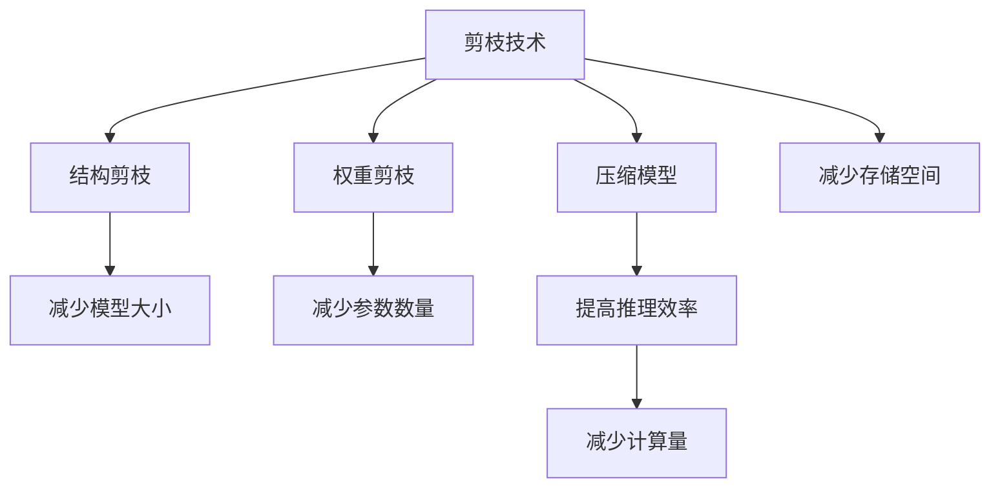

                 

## 1. 背景介绍

随着人工智能技术的不断发展，边缘计算设备的智能化程度越来越高。边缘设备在处理数据时，受到计算资源和存储空间的限制，不能像中心服务器那样无限制地使用高性能的计算和存储资源。为了提高边缘设备上人工智能应用的效率和性能，剪枝技术（Pruning）成为了一种有效的解决方案。剪枝技术可以通过去除模型中的冗余权重，减少计算量和存储空间，从而在资源受限的边缘设备上实现高效的人工智能推理。

## 2. 核心概念与联系

### 2.1 核心概念概述

剪枝技术（Pruning）是一种压缩模型的方法，通过删除模型中不必要的参数，来减小模型的复杂度和计算量，从而降低边缘设备上的计算和存储成本。剪枝可以分为结构剪枝（Structural Pruning）和权重剪枝（Weight Pruning）。结构剪枝是指去掉模型中不必要的层或神经元，而权重剪枝则是指去掉模型中权重值较小且不影响模型性能的参数。

- **结构剪枝（Structural Pruning）**：删除模型中的冗余层或神经元，减少模型大小。
- **权重剪枝（Weight Pruning）**：通过保留权重值较大的神经元，移除权重值较小的神经元，减少模型参数数量。

这些核心概念之间的关系可以通过以下Mermaid流程图来展示：



这个流程图展示了剪枝技术从不同角度对模型的压缩效果，以及其对边缘AI设备应用的影响。

### 2.2 核心概念原理和架构的 Mermaid 流程图


在这个流程图中，剪枝技术首先对模型进行结构剪枝和权重剪枝，减小模型的复杂度和参数数量。然后，通过减少计算量和存储空间，提高模型的推理效率，从而在边缘AI设备上实现高效的应用。

## 3. 核心算法原理 & 具体操作步骤

### 3.1 算法原理概述

剪枝技术的核心原理是通过对模型进行压缩，去除冗余参数，从而提高边缘AI设备的计算和存储效率。剪枝的效率和效果受到多种因素的影响，如剪枝策略、剪枝比例、剪枝方法等。常用的剪枝策略包括L1范数、L2范数、最小绝对误差（MAE）等。

### 3.2 算法步骤详解

剪枝技术的基本步骤如下：

1. **选择剪枝策略**：根据具体的应用场景和需求，选择适合的剪枝策略。
2. **确定剪枝比例**：根据模型大小和性能要求，确定需要保留的参数比例。
3. **执行剪枝操作**：根据选择的剪枝策略，对模型进行剪枝操作。
4. **优化模型性能**：对剪枝后的模型进行微调或优化，确保其性能不受影响。
5. **评估剪枝效果**：通过测试或评估，验证剪枝后模型的效果和性能。

### 3.3 算法优缺点

**剪枝技术的优点**：
- **减少计算量和存储空间**：通过去除冗余参数，减少计算和存储需求。
- **提高推理效率**：剪枝后的模型在边缘设备上可以更快地进行推理计算。
- **降低能耗**：减少计算和存储需求，降低了设备的能耗。

**剪枝技术的缺点**：
- **可能影响模型性能**：剪枝后模型可能会失去部分信息，影响模型性能。
- **需要额外的处理和优化**：剪枝后的模型需要进行额外的处理和优化，确保性能不受影响。

### 3.4 算法应用领域

剪枝技术可以广泛应用于边缘AI设备的模型压缩和优化，提高其计算和存储效率。主要应用领域包括：

- **图像处理**：在边缘设备上进行图像分类、物体检测等任务。
- **语音识别**：在移动设备上进行实时语音识别和自然语言处理。
- **智能家居**：在智能家居设备上进行行为识别和环境监控。
- **自动驾驶**：在自动驾驶车辆上进行感知和决策。
- **工业物联网**：在工业物联网设备上进行异常检测和预测维护。

## 4. 数学模型和公式 & 详细讲解 & 举例说明

### 4.1 数学模型构建

剪枝技术的数学模型主要涉及以下参数：
- **模型大小**：表示模型中所有参数的数量。
- **剪枝比例**：表示需要保留的参数比例。
- **剪枝策略**：表示选择何种方式进行剪枝操作。

### 4.2 公式推导过程

剪枝过程中，通过选择剪枝策略，计算每个参数的重要性，并根据剪枝比例保留最重要的参数。常用的剪枝策略包括L1范数、L2范数、MAE等。以下是L1范数剪枝的公式推导过程：

$$
W = \sum_{i=1}^n w_i
$$

其中，$w_i$ 表示第 $i$ 个参数的权重值，$n$ 表示参数总数。L1范数剪枝的基本思想是保留权重值大于阈值的参数，去除权重值小于等于阈值的参数。

$$
\begin{aligned}
\text{threshold} &= \frac{W}{\text{剪枝比例}} \\
\text{剪枝后的权重} &= \begin{cases}
w_i, & \text{if } w_i > \text{threshold} \\
0, & \text{if } w_i \leq \text{threshold}
\end{cases}
\end{aligned}
$$

### 4.3 案例分析与讲解

假设有一个包含1000个参数的模型，剪枝比例为50%，使用L1范数剪枝策略。按照上述公式计算，阈值为500，保留权重值大于500的参数，去除权重值小于等于500的参数。最终保留500个参数，模型大小减小了一半。

## 5. 项目实践：代码实例和详细解释说明

### 5.1 开发环境搭建

为了实现剪枝技术，需要安装TensorFlow、PyTorch等深度学习框架，以及相应的剪枝工具。以下是TensorFlow环境搭建的步骤：

1. 安装TensorFlow：
```bash
pip install tensorflow
```

2. 安装TensorFlow剪枝工具：
```bash
pip install tensorflow-pruning
```

### 5.2 源代码详细实现

以下是使用TensorFlow进行剪枝的示例代码：

```python
import tensorflow as tf
import tensorflow_pruning as pruning

# 定义模型
model = tf.keras.Sequential([
    tf.keras.layers.Dense(64, activation='relu'),
    tf.keras.layers.Dense(10, activation='softmax')
])

# 定义剪枝比例
pruning_ratio = 0.5

# 使用L1范数剪枝
pruning_callback = pruning.L1Pruning(
    pruning_ratio=pruning_ratio, weight_name='kernel', metrics=['accuracy'])

# 训练模型
model.compile(optimizer='adam', loss='sparse_categorical_crossentropy', metrics=['accuracy'])
model.fit(x_train, y_train, callbacks=[pruning_callback])

# 验证模型
pruning_callback.on_test_end()
```

### 5.3 代码解读与分析

在这个示例代码中，我们使用TensorFlow的`Sequential`模型定义了一个简单的神经网络。然后，我们定义了剪枝比例为50%，使用L1范数剪枝策略。最后，我们将剪枝回调函数`L1Pruning`添加到模型训练过程中，并在测试集上验证剪枝效果。

## 6. 实际应用场景

### 6.1 边缘AI设备上的图像处理

边缘AI设备在处理图像时，计算和存储资源有限。通过剪枝技术，可以显著减少图像处理模型的计算量和存储空间。例如，在边缘设备上进行实时物体检测，可以将卷积神经网络模型进行剪枝，保留重要的特征提取层，从而在资源受限的设备上实现高效物体检测。

### 6.2 移动设备上的语音识别

在移动设备上进行语音识别时，剪枝技术可以提高模型的推理效率。例如，在智能手机上进行实时语音翻译，可以通过剪枝技术减少模型的计算量，从而提高翻译速度和响应时间。

### 6.3 智能家居设备上的行为识别

智能家居设备需要实时处理大量数据，剪枝技术可以减少模型的计算量，提高设备的响应速度和可靠性。例如，通过剪枝技术对行为识别模型进行优化，可以在智能家居设备上进行实时行为监测和异常检测。

### 6.4 自动驾驶车辆上的感知和决策

自动驾驶车辆需要实时处理大量的感知数据，剪枝技术可以减少模型的计算量，提高车辆的响应速度和安全性。例如，在自动驾驶车辆上对感知模型进行剪枝，可以提高车辆对道路环境的感知能力，从而提高驾驶安全性和舒适度。

### 6.5 工业物联网设备上的异常检测和预测维护

在工业物联网设备上进行异常检测和预测维护时，剪枝技术可以减少模型的计算量，提高设备的响应速度和可靠性。例如，对设备状态监测模型进行剪枝，可以提高设备故障检测的及时性和准确性，从而提高生产效率和设备维护的及时性。

## 7. 工具和资源推荐

### 7.1 学习资源推荐

- **TensorFlow官方文档**：提供了详细的剪枝工具使用指南和示例。
- **TensorFlow剪枝教程**：提供了详细的剪枝步骤和代码示例。
- **Pruning Techniques for Deep Neural Networks**：介绍了各种剪枝技术和应用场景。

### 7.2 开发工具推荐

- **TensorFlow剪枝工具**：提供了丰富的剪枝策略和模型优化功能。
- **PyTorch剪枝工具**：提供了灵活的剪枝接口和应用场景。

### 7.3 相关论文推荐

- **Pruning Neural Networks for Efficient Edge AI**：介绍了在边缘AI设备上进行剪枝技术的应用。
- **Efficient and Accurate Image Classification via Pruning**：介绍了剪枝技术在图像分类中的应用。
- **Pruning Techniques for Deep Neural Networks**：介绍了各种剪枝技术和应用场景。

## 8. 总结：未来发展趋势与挑战

### 8.1 研究成果总结

剪枝技术在边缘AI设备中得到了广泛应用，通过减少模型的计算量和存储空间，提高了设备的计算和存储效率。剪枝技术可以应用于各种边缘设备上的图像处理、语音识别、行为识别、感知和决策、异常检测和预测维护等任务，具有广泛的应用前景。

### 8.2 未来发展趋势

剪枝技术的未来发展趋势主要包括以下几个方面：

- **多模态剪枝**：将剪枝技术应用于多模态数据处理，如图像、语音、文本等。
- **动态剪枝**：在模型推理过程中动态剪枝，根据输入数据的特征进行调整，提高剪枝效果。
- **自动化剪枝**：通过自动化剪枝工具，实现自动化的剪枝操作和优化。
- **剪枝与量化结合**：将剪枝技术与量化技术结合，进一步降低计算量和存储空间。
- **混合剪枝**：结合结构剪枝和权重剪枝，实现更高效的模型压缩。

### 8.3 面临的挑战

剪枝技术在实现过程中面临以下挑战：

- **剪枝后模型性能下降**：剪枝后模型可能会失去部分信息，影响模型性能。
- **剪枝策略选择**：选择合适的剪枝策略是剪枝技术的关键。
- **剪枝比例确定**：确定合适的剪枝比例需要经验和实验验证。
- **剪枝工具复杂**：现有的剪枝工具复杂，需要一定的技术门槛。

### 8.4 研究展望

未来的研究需要解决剪枝技术在边缘AI设备上的应用问题，包括：

- **多模态数据处理**：将剪枝技术应用于多模态数据处理，提高模型的适应性和应用范围。
- **自动化剪枝工具**：开发自动化剪枝工具，降低技术门槛，提高剪枝效果。
- **混合剪枝技术**：结合结构剪枝和权重剪枝，实现更高效的模型压缩。
- **剪枝与量化结合**：将剪枝技术与量化技术结合，进一步降低计算量和存储空间。

## 9. 附录：常见问题与解答

**Q1：剪枝技术能否提高模型性能？**

A: 剪枝技术可以在一定程度上提高模型的性能。剪枝技术通过去除冗余参数，减少计算量和存储空间，从而提高模型的推理效率和计算速度。但是，剪枝后模型可能会失去部分信息，影响模型性能。因此，需要选择合适的剪枝策略和剪枝比例，确保剪枝后模型性能不受影响。

**Q2：剪枝技术是否适用于所有模型？**

A: 剪枝技术适用于大多数模型，尤其是神经网络模型。剪枝技术可以显著减少模型的计算量和存储空间，从而提高边缘AI设备的计算和存储效率。但是对于一些特殊的模型，如卷积神经网络、循环神经网络等，剪枝技术可能不太适用。

**Q3：剪枝技术是否需要额外的处理和优化？**

A: 剪枝技术需要对剪枝后的模型进行额外的处理和优化，以确保其性能不受影响。通常情况下，剪枝后的模型需要进行微调或优化，以恢复其性能。同时，剪枝后的模型需要进行量化处理，以进一步降低计算量和存储空间。

**Q4：剪枝技术是否会导致模型过拟合？**

A: 剪枝技术不会导致模型过拟合。剪枝技术通过去除冗余参数，减少模型的复杂度，从而提高模型的泛化能力和鲁棒性。剪枝后模型可以更好地适应新数据，避免过拟合问题。

**Q5：剪枝技术如何应用于多模态数据处理？**

A: 剪枝技术可以应用于多模态数据处理，如图像、语音、文本等。将多模态数据进行融合，再进行剪枝操作，可以进一步降低计算量和存储空间。

作者：禅与计算机程序设计艺术 / Zen and the Art of Computer Programming

