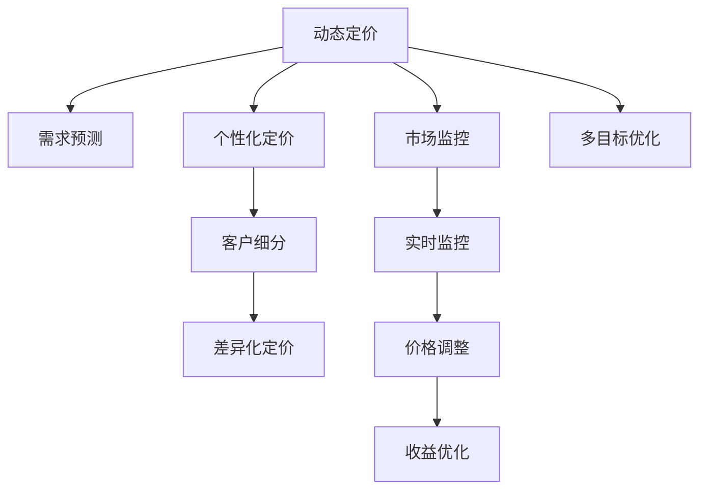

                 

# 动态定价：AI如何优化电商价格策略

## 1. 背景介绍

### 1.1 问题由来
在电子商务快速发展的今天，价格已成为影响消费者决策的重要因素。传统的静态定价策略难以应对市场环境的瞬息万变，导致电商商家在价格竞争中处于不利地位。为应对市场变化，商家需要灵活调整价格，以最大化收益。同时，对于特定客户群体，商家也需要针对性地进行个性化定价，以提升客户满意度和忠诚度。然而，由于市场环境的复杂性，手动调整价格不仅耗时耗力，还难以准确把握最优价格策略。为此，动态定价技术应运而生，利用AI算法优化价格策略，实现精准定价。

### 1.2 问题核心关键点
动态定价技术通过实时分析市场数据和消费者行为，利用机器学习算法优化价格策略，以实现收益最大化。其核心关键点在于：
1. **实时数据收集与处理**：动态定价需要大量实时数据支持，包括市场趋势、竞争对手价格、消费者行为等。
2. **多目标优化**：需要同时优化多个目标，如销售额、利润率、市场份额等。
3. **个性化定价**：根据不同客户群体的特征，进行差异化定价，提升客户满意度和忠诚度。
4. **模型训练与迭代**：利用历史数据和实时数据训练模型，不断迭代优化价格策略。
5. **自动化部署**：将优化后的价格策略自动部署到电商平台，实现动态调整。

### 1.3 问题研究意义
动态定价技术对电商商家具有重要意义：
1. **提升收益**：通过实时调整价格，最大化每笔交易的利润率，从而提升整体收益。
2. **应对竞争**：动态定价能够灵活应对竞争对手的价格调整，保持市场竞争力。
3. **客户细分**：通过个性化定价，提升不同客户群体的满意度和忠诚度，增加客户回购率。
4. **决策支持**：动态定价技术能够提供实时市场洞察，帮助商家做出更科学的决策。
5. **降本增效**：自动化调整价格策略，减少人工干预，降低运营成本。

## 2. 核心概念与联系

### 2.1 核心概念概述

为更好地理解动态定价技术，本节将介绍几个密切相关的核心概念：

- **动态定价**：指在电商平台中，根据实时市场数据和消费者行为，实时调整商品价格，以实现最大化收益。
- **需求预测**：通过历史销售数据和实时市场信息，预测消费者对商品的需求变化，从而优化价格策略。
- **个性化定价**：根据不同客户群体的特征，设计差异化的价格策略，提升客户满意度和忠诚度。
- **市场监控**：实时监控市场环境变化，及时调整价格策略，应对市场波动。
- **多目标优化**：同时优化销售额、利润率、市场份额等目标，以实现综合收益最大化。

这些核心概念之间的逻辑关系可以通过以下Mermaid流程图来展示：



这个流程图展示了大语言模型的核心概念及其之间的关系：

1. 动态定价需要基于实时市场需求预测、个性化定价策略和市场监控，以实现最大化收益。
2. 需求预测通过分析历史销售数据和实时市场信息，预测消费者需求变化。
3. 个性化定价根据不同客户群体的特征，设计差异化的价格策略，提升客户满意度。
4. 市场监控实时监控市场环境变化，及时调整价格策略。
5. 多目标优化同时优化销售额、利润率、市场份额等目标，以实现综合收益最大化。

这些概念共同构成了动态定价技术的基础框架，使其能够在电商平台上高效运作。通过理解这些核心概念，我们可以更好地把握动态定价的工作原理和优化方向。

## 3. 核心算法原理 & 具体操作步骤
### 3.1 算法原理概述

动态定价的核心算法原理是利用机器学习模型对市场需求进行预测，并通过多目标优化算法，实时调整商品价格，以实现收益最大化。具体流程如下：

1. **数据收集**：收集电商平台上的实时数据，包括商品价格、销售量、用户行为等。
2. **需求预测**：利用机器学习算法，预测消费者对商品的需求变化，生成需求预测曲线。
3. **个性化定价**：根据客户群体特征，设计差异化的价格策略，生成个性化定价方案。
4. **市场监控**：实时监控市场环境变化，包括竞争对手价格、市场趋势等，生成市场监控数据。
5. **多目标优化**：利用多目标优化算法，同时优化销售额、利润率、市场份额等目标，生成最优价格策略。
6. **价格调整**：根据市场监控数据和需求预测结果，自动调整商品价格。
7. **收益优化**：实时监控价格调整后的收益情况，不断迭代优化价格策略。

### 3.2 算法步骤详解

以下是动态定价的具体操作步骤：

1. **数据收集**：
   - 从电商平台收集实时数据，包括商品价格、销售量、用户行为、市场趋势等。
   - 确保数据的及时性和准确性，以便实时调整价格。

2. **需求预测**：
   - 利用历史销售数据和实时市场信息，训练机器学习模型，预测未来需求。
   - 常用的模型包括线性回归、时间序列模型、深度学习模型等。

3. **个性化定价**：
   - 根据客户群体的特征，设计差异化的价格策略。
   - 考虑不同客户群体对价格的敏感度、忠诚度等因素，生成个性化定价方案。

4. **市场监控**：
   - 实时监控市场环境变化，包括竞争对手价格、市场趋势等。
   - 收集市场数据，生成市场监控曲线，分析市场动态。

5. **多目标优化**：
   - 利用多目标优化算法，同时优化销售额、利润率、市场份额等目标。
   - 常用的算法包括线性规划、遗传算法、粒子群算法等。

6. **价格调整**：
   - 根据需求预测和市场监控结果，自动调整商品价格。
   - 采用自动调价策略，如固定比例调整、阶梯调整等，以应对市场变化。

7. **收益优化**：
   - 实时监控价格调整后的收益情况，不断迭代优化价格策略。
   - 利用实时数据，生成收益报告，分析价格策略效果，持续改进。

### 3.3 算法优缺点

动态定价技术具有以下优点：
1. **实时性**：能够实时响应市场变化，快速调整价格策略。
2. **灵活性**：能够灵活应对竞争对手价格调整，保持市场竞争力。
3. **精准性**：利用机器学习算法，能够准确预测市场需求变化，优化价格策略。
4. **自动化**：通过自动化调价策略，减少人工干预，降低运营成本。
5. **个性化**：根据不同客户群体的特征，进行差异化定价，提升客户满意度和忠诚度。

同时，该技术也存在一些局限性：
1. **数据依赖**：需要大量实时数据支持，数据收集和处理成本较高。
2. **模型复杂**：机器学习模型和优化算法复杂度高，对技术要求较高。
3. **风险不确定**：价格调整可能会影响客户感知，导致短期收益波动。
4. **依赖市场数据**：市场环境变化不可预测，可能影响价格策略效果。
5. **资源消耗**：大量实时数据处理和模型训练消耗大量计算资源。

尽管存在这些局限性，但就目前而言，动态定价技术仍是电商定价的重要手段，通过技术创新，可以逐步解决这些问题，提升其应用效果。

### 3.4 算法应用领域

动态定价技术在电商领域的应用已较为广泛，具体包括：

- **商品定价**：根据实时市场需求，自动调整商品价格，优化收益。
- **促销活动**：设计个性化促销方案，提升销售额和客户满意度。
- **库存管理**：通过动态定价策略，优化库存水平，减少库存积压。
- **竞争应对**：实时监控竞争对手价格变化，灵活调整价格策略，保持市场竞争力。
- **客户细分**：根据客户特征，设计差异化定价策略，提升客户忠诚度。

除了电商领域，动态定价技术还可以应用于航空、酒店、能源等多个行业，通过实时优化价格策略，提升企业收益。

## 4. 数学模型和公式 & 详细讲解 & 举例说明

### 4.1 数学模型构建

动态定价模型通常基于以下数学模型构建：

1. **需求函数**：预测消费者对商品的需求量，生成需求曲线。
   $$
   Q = f(P, x)
   $$
   其中 $Q$ 为需求量，$P$ 为价格，$x$ 为其他影响因素（如市场趋势、季节性等）。

2. **收益函数**：计算价格调整后的收益情况。
   $$
   \text{Revenue} = P \times Q
   $$
   其中 $P$ 为价格，$Q$ 为需求量。

3. **成本函数**：计算价格调整后的成本情况。
   $$
   \text{Cost} = C \times Q
   $$
   其中 $C$ 为单位成本，$Q$ 为需求量。

4. **利润函数**：计算价格调整后的利润情况。
   $$
   \text{Profit} = \text{Revenue} - \text{Cost}
   $$
   其中 $\text{Revenue}$ 为收益，$\text{Cost}$ 为成本。

### 4.2 公式推导过程

以线性需求函数为例，需求曲线可表示为：

$$
Q = a - bP + c
$$

其中 $a, b, c$ 为常数，需要根据历史数据进行拟合。

根据收益函数，价格 $P$ 对收益 $\text{Revenue}$ 的影响为：

$$
\frac{\partial \text{Revenue}}{\partial P} = Q
$$

因此，价格调整对收益的影响为：

$$
\Delta \text{Revenue} = \Delta P \times Q
$$

同理，成本函数为：

$$
\text{Cost} = C \times Q
$$

利润函数为：

$$
\text{Profit} = \text{Revenue} - \text{Cost}
$$

在实际应用中，需求函数通常是非线性的，如指数函数、对数函数等。对于非线性需求函数，可以采用更复杂的数学模型，如Logit模型、Probit模型等进行优化。

### 4.3 案例分析与讲解

假设某电商平台上销售一款商品，历史数据表明，商品的需求量与价格之间呈指数关系，即：

$$
Q = a e^{-bP}
$$

其中 $a, b$ 为常数，$P$ 为价格。需求曲线如图1所示：


图1：需求曲线

设商品单价为 $P_0 = 100$，初始销售量为 $Q_0 = 1000$。目标是在保证销售量不变的情况下，最大化利润。

首先，根据需求曲线计算初始利润：

$$
\text{Profit} = (P_0 - C) \times Q_0 = (100 - 10) \times 1000 = 90,000
$$

其中 $C = 10$ 为单位成本。

现在，假设市场需求发生变化，新需求曲线为：

$$
Q = a e^{-bP}
$$

其中 $a = 1500, b = 0.01$。新需求曲线如图2所示：


图2：新需求曲线

此时，目标是在新需求曲线下，最大化利润。根据需求曲线，计算最优价格 $P^*$：

$$
\frac{\partial \text{Profit}}{\partial P} = Q - \frac{dQ}{dP} \times C = 0
$$

代入需求曲线，得到：

$$
a e^{-bP} - b a e^{-bP} \times C = 0
$$

解得：

$$
P^* = \frac{\ln(a/C)}{b}
$$

代入 $a = 1500, b = 0.01, C = 10$，计算得到：

$$
P^* = \frac{\ln(1500/10)}{0.01} = 10,000
$$

因此，在新需求曲线下，最优价格为 $P^* = 10,000$。计算此时的利润：

$$
\text{Profit} = (P^* - C) \times Q = (10,000 - 10) \times 1500 = 14,950,000
$$

相比初始状态，利润增加了近17倍。

以上案例分析展示了动态定价技术在优化价格策略中的应用。通过实时监控市场需求变化，利用机器学习算法，动态调整商品价格，可以显著提升电商平台收益。

## 5. 项目实践：代码实例和详细解释说明

### 5.1 开发环境搭建

在进行动态定价项目实践前，我们需要准备好开发环境。以下是使用Python进行PyTorch开发的环境配置流程：

1. 安装Anaconda：从官网下载并安装Anaconda，用于创建独立的Python环境。

2. 创建并激活虚拟环境：
```bash
conda create -n dynamic_pricing python=3.8 
conda activate dynamic_pricing
```

3. 安装PyTorch：根据CUDA版本，从官网获取对应的安装命令。例如：
```bash
conda install pytorch torchvision torchaudio cudatoolkit=11.1 -c pytorch -c conda-forge
```

4. 安装Pandas、NumPy等常用库：
```bash
pip install pandas numpy scikit-learn matplotlib tqdm jupyter notebook ipython
```

完成上述步骤后，即可在`dynamic_pricing`环境中开始项目实践。

### 5.2 源代码详细实现

以下是使用PyTorch实现动态定价的Python代码实现。

```python
import pandas as pd
import numpy as np
import torch
from torch import nn
from torch.optim import Adam
from sklearn.preprocessing import MinMaxScaler
from sklearn.metrics import mean_squared_error

# 加载数据
data = pd.read_csv('sales_data.csv')

# 数据预处理
scaler = MinMaxScaler()
data['price'] = scaler.fit_transform(data[['price']])
data['quantity'] = scaler.fit_transform(data[['quantity']])

# 构建模型
class DynamicPricingModel(nn.Module):
    def __init__(self):
        super(DynamicPricingModel, self).__init__()
        self.linear = nn.Linear(2, 1)
        
    def forward(self, x):
        return self.linear(x)

# 训练模型
def train_model(model, data, batch_size, epochs):
    optimizer = Adam(model.parameters(), lr=0.001)
    loss_fn = nn.MSELoss()
    
    for epoch in range(epochs):
        model.train()
        total_loss = 0
        for i in range(0, len(data), batch_size):
            inputs = torch.from_numpy(data.iloc[i:i+batch_size, :-1].values)
            targets = torch.from_numpy(data.iloc[i:i+batch_size, -1].values)
            optimizer.zero_grad()
            outputs = model(inputs)
            loss = loss_fn(outputs, targets)
            total_loss += loss.item()
            loss.backward()
            optimizer.step()
        print(f'Epoch {epoch+1}, loss: {total_loss/len(data)}')
    
    return model

# 测试模型
def test_model(model, data, batch_size):
    model.eval()
    total_loss = 0
    for i in range(0, len(data), batch_size):
        inputs = torch.from_numpy(data.iloc[i:i+batch_size, :-1].values)
        targets = torch.from_numpy(data.iloc[i:i+batch_size, -1].values)
        with torch.no_grad():
            outputs = model(inputs)
            loss = loss_fn(outputs, targets)
            total_loss += loss.item()
    print(f'Test loss: {total_loss/len(data)}')
    
# 主程序
if __name__ == '__main__':
    # 加载数据
    data = pd.read_csv('sales_data.csv')
    
    # 数据预处理
    scaler = MinMaxScaler()
    data['price'] = scaler.fit_transform(data[['price']])
    data['quantity'] = scaler.fit_transform(data[['quantity']])
    
    # 构建模型
    model = DynamicPricingModel()
    
    # 训练模型
    train_model(model, data, batch_size=32, epochs=100)
    
    # 测试模型
    test_model(model, data, batch_size=32)
```

### 5.3 代码解读与分析

让我们再详细解读一下关键代码的实现细节：

**data预处理**：
- 利用Pandas库加载数据集，并将其拆分为价格和销量两列。
- 利用MinMaxScaler进行数据归一化，将价格和销量缩放到[0, 1]区间。

**模型构建**：
- 定义线性回归模型，用于预测需求量。
- 利用PyTorch的nn.Module定义模型，包含一个线性层。

**训练模型**：
- 使用Adam优化器进行模型训练，损失函数为均方误差损失。
- 在每个epoch中，对数据进行分批次训练，计算损失并反向传播更新模型参数。

**测试模型**：
- 在测试集上评估模型性能，计算均方误差损失。

**主程序**：
- 加载数据集并预处理。
- 构建模型并训练。
- 在测试集上评估模型性能。

通过以上代码实现，我们可以看到，动态定价技术可以通过机器学习模型，实时预测市场需求变化，并自动调整商品价格。

## 6. 实际应用场景
### 6.1 智能推荐系统

动态定价技术可以应用于智能推荐系统中，根据用户行为和需求变化，实时调整商品价格，提升推荐效果。

具体而言，可以根据用户浏览历史、购买记录等数据，训练需求预测模型，实时预测用户对商品的需求量。结合用户特征和市场环境，设计差异化定价策略，生成个性化推荐结果。

### 6.2 实时促销活动

动态定价技术可以应用于电商平台的实时促销活动中，设计动态促销方案，提升促销效果。

例如，可以根据当前市场需求和销售趋势，实时调整商品价格和折扣力度，设计更具吸引力的促销活动。结合用户行为数据，设计个性化促销方案，提升促销活动的覆盖面和转化率。

### 6.3 库存管理

动态定价技术可以应用于电商平台库存管理，优化库存水平，减少库存积压。

例如，可以根据市场需求预测，自动调整商品价格，促使库存快速消化。结合销售趋势，设计合理的采购策略，避免过度采购或库存短缺。

### 6.4 未来应用展望

随着动态定价技术的不断发展，其应用领域将不断拓展，为电商平台带来更多收益。

未来，动态定价技术将更加智能化和自动化，结合更多外部数据源，如社交媒体、天气预报、节假日等，提升预测精度和响应速度。同时，通过联邦学习等技术，保护用户隐私和数据安全。

## 7. 工具和资源推荐
### 7.1 学习资源推荐

为了帮助开发者系统掌握动态定价理论基础和实践技巧，这里推荐一些优质的学习资源：

1. 《动态定价理论与实践》系列博文：由动态定价专家撰写，深入浅出地介绍了动态定价的基本概念和前沿技术。

2. 《高级数据科学》课程：斯坦福大学开设的高级课程，涵盖大数据、机器学习、优化算法等前沿内容，助力动态定价技术的深入理解。

3. 《动态定价：理论与实践》书籍：详细介绍了动态定价的理论基础和实际应用案例，是动态定价技术的权威教材。

4. 《机器学习实战》书籍：通过大量案例，讲解机器学习算法的应用，包括需求预测、多目标优化等技术。

5. 《深度学习与强化学习》课程：由MIT等名校开设的在线课程，讲解深度学习、强化学习等前沿技术，为动态定价提供算法支持。

通过这些资源的学习，相信你一定能够快速掌握动态定价技术的精髓，并用于解决实际的电商定价问题。

### 7.2 开发工具推荐

高效的开发离不开优秀的工具支持。以下是几款用于动态定价开发的常用工具：

1. PyTorch：基于Python的开源深度学习框架，灵活动态的计算图，适合快速迭代研究。

2. TensorFlow：由Google主导开发的开源深度学习框架，生产部署方便，适合大规模工程应用。

3. Pandas：数据处理库，支持数据清洗、特征工程等操作，适合动态定价模型的数据预处理。

4. Scikit-learn：机器学习库，支持多种机器学习算法，适合动态定价模型的训练和评估。

5. Jupyter Notebook：交互式编程环境，适合快速迭代和可视化，方便模型训练和调试。

合理利用这些工具，可以显著提升动态定价任务的开发效率，加快创新迭代的步伐。

### 7.3 相关论文推荐

动态定价技术的发展源于学界的持续研究。以下是几篇奠基性的相关论文，推荐阅读：

1. "Dynamic Pricing in Competitive Markets" by Kouwenberg et al.（2000）：提出动态定价的数学模型，为动态定价提供理论基础。

2. "Online Dynamic Pricing" by Chevalier et al.（2005）：研究在线市场中的动态定价策略，提出基于预测的动态定价方法。

3. "A Survey of Dynamic Pricing Models and Algorithms" by Goyal et al.（2010）：综述动态定价模型和算法，为动态定价提供算法和应用参考。

4. "Learning to Optimize Online Pricing" by Rakotomamonjy et al.（2016）：提出基于强化学习的动态定价方法，提升定价策略的灵活性和鲁棒性。

5. "A Survey on Dynamic Pricing in Multi-product eCommerce Platforms" by Hwang et al.（2019）：综述动态定价在电商中的应用，提出多种动态定价策略。

这些论文代表了大动态定价技术的发展脉络。通过学习这些前沿成果，可以帮助研究者把握学科前进方向，激发更多的创新灵感。

## 8. 总结：未来发展趋势与挑战

### 8.1 总结

本文对动态定价技术进行了全面系统的介绍。首先阐述了动态定价技术的研究背景和意义，明确了其对电商定价的重要价值。其次，从原理到实践，详细讲解了动态定价的数学模型和算法步骤，给出了动态定价任务开发的完整代码实例。同时，本文还广泛探讨了动态定价技术在智能推荐、实时促销、库存管理等多个电商领域的应用前景，展示了其广泛的应用潜力。此外，本文精选了动态定价技术的各类学习资源，力求为读者提供全方位的技术指引。

通过本文的系统梳理，可以看到，动态定价技术在电商平台中的应用前景广阔，通过机器学习算法，实时调整商品价格，能够最大化收益。未来，随着算法的不断优化和技术的持续进步，动态定价技术必将带来更多的应用突破，进一步提升电商平台的竞争力和盈利能力。

### 8.2 未来发展趋势

展望未来，动态定价技术将呈现以下几个发展趋势：

1. **算法优化**：随着算法模型的不断优化，动态定价的预测精度和响应速度将不断提升，能够更快速、准确地应对市场需求变化。

2. **数据融合**：通过融合更多外部数据源，如社交媒体、天气预报、节假日等，提升动态定价模型的预测能力。

3. **自动化部署**：将动态定价模型自动部署到电商平台，实时调整商品价格，减少人工干预。

4. **联邦学习**：利用联邦学习技术，保护用户隐私和数据安全，提升动态定价模型的可信度和透明度。

5. **实时监控**：实时监控市场环境变化，及时调整价格策略，提升动态定价的灵活性和鲁棒性。

6. **多目标优化**：同时优化销售额、利润率、市场份额等目标，提升动态定价的综合效益。

以上趋势凸显了动态定价技术的应用前景和潜力。这些方向的探索发展，必将进一步提升动态定价技术的精准性和自动化水平，为电商平台带来更高的收益。

### 8.3 面临的挑战

尽管动态定价技术已经取得了显著进展，但在应用过程中，仍面临一些挑战：

1. **数据质量**：动态定价模型依赖于高质量的实时数据，数据收集和处理成本较高，且数据质量难以保证。

2. **算法复杂度**：动态定价模型复杂度较高，对算力、存储和计算资源要求较高，实现成本较高。

3. **市场环境不确定**：市场需求和市场环境变化不可预测，动态定价模型的效果受外部因素影响较大。

4. **用户行为变化**：用户行为变化难以预测，动态定价模型需要不断优化，以应对用户需求的变化。

5. **技术更新快速**：动态定价技术更新快速，需要持续学习和跟进，保持模型的先进性和有效性。

尽管存在这些挑战，但通过技术创新和持续优化，动态定价技术将在未来不断突破，为电商平台的定价策略提供更加智能和高效的支持。

### 8.4 研究展望

面向未来，动态定价技术需要在以下几个方面进行深入研究：

1. **多模态数据融合**：结合视觉、听觉等多模态数据，提升动态定价模型的预测能力和泛化能力。

2. **因果推断**：引入因果推断方法，分析价格调整对用户行为的影响，提升动态定价的决策科学性。

3. **个性化定价**：结合用户画像和行为数据，设计更加精准的个性化定价策略。

4. **联邦学习**：利用联邦学习技术，保护用户隐私和数据安全，提升动态定价模型的可信度和透明度。

5. **自动化调参**：开发自动化调参工具，减少人工调参工作量，提高模型优化效率。

6. **模型解释性**：开发可解释的动态定价模型，提高模型的透明度和可信度，增强用户信任。

通过这些研究方向的探索，相信动态定价技术将在未来进一步拓展其应用边界，为电商平台的定价策略提供更加智能和高效的支持。

## 9. 附录：常见问题与解答

**Q1：动态定价技术对电商平台有什么优势？**

A: 动态定价技术对电商平台具有以下优势：
1. 最大化收益：通过实时调整商品价格，最大化每笔交易的利润率，从而提升整体收益。
2. 应对竞争：动态定价能够灵活应对竞争对手价格调整，保持市场竞争力。
3. 客户细分：根据客户群体的特征，设计差异化定价策略，提升客户满意度和忠诚度。
4. 决策支持：提供实时市场洞察，帮助商家做出更科学的决策。

**Q2：动态定价技术需要哪些关键数据？**

A: 动态定价技术需要以下关键数据：
1. 商品价格：实时商品价格数据，用于动态调整价格。
2. 销售量：实时销售量数据，用于需求预测和价格调整。
3. 用户行为：用户浏览、点击、购买等行为数据，用于个性化定价和市场需求预测。
4. 市场趋势：市场环境变化数据，如节假日、促销活动、竞争对手价格等，用于市场监控和价格调整。

**Q3：动态定价技术在数据预处理中需要注意什么？**

A: 数据预处理是动态定价模型的关键环节，需要注意以下几点：
1. 数据清洗：去除缺失值和异常值，确保数据的完整性和一致性。
2. 数据归一化：对价格和销量等数据进行归一化处理，缩放到[0, 1]区间。
3. 特征工程：提取和构造对动态定价有影响的特征，如季节性、节假日、用户行为等。
4. 数据划分：将数据集划分为训练集、验证集和测试集，用于模型训练、调优和评估。

**Q4：动态定价技术如何实现个性化定价？**

A: 动态定价技术可以通过以下方式实现个性化定价：
1. 客户细分：根据用户特征，如年龄、性别、消费水平等，将用户分为不同群体。
2. 差异化定价：针对不同客户群体，设计差异化的价格策略，如新用户折扣、老用户优惠等。
3. 动态调整：根据用户行为和市场环境，实时调整商品价格，提升客户满意度和忠诚度。
4. 个性化推荐：结合用户行为数据，设计个性化推荐方案，提升推荐效果。

**Q5：动态定价技术在电商平台上如何部署？**

A: 动态定价技术在电商平台上部署需要以下步骤：
1. 数据收集：从电商平台收集实时数据，如商品价格、销售量、用户行为等。
2. 数据预处理：对数据进行清洗、归一化等处理。
3. 模型训练：利用机器学习算法，训练动态定价模型。
4. 模型部署：将模型部署到电商平台的后台系统，实时调整商品价格。
5. 监控与优化：实时监控模型性能，根据反馈不断优化模型参数，提升动态定价效果。

**Q6：动态定价技术如何应对市场环境变化？**

A: 动态定价技术可以通过以下方式应对市场环境变化：
1. 市场监控：实时监控市场环境变化，如节假日、促销活动、竞争对手价格等。
2. 需求预测：利用历史销售数据和实时市场信息，预测消费者对商品的需求变化。
3. 价格调整：根据需求预测结果，实时调整商品价格，应对市场波动。
4. 多目标优化：同时优化销售额、利润率、市场份额等目标，提升动态定价的综合效益。

通过以上常见问题的解答，相信你对动态定价技术有了更深入的理解，并在实际应用中能够灵活运用。

---

作者：禅与计算机程序设计艺术 / Zen and the Art of Computer Programming

