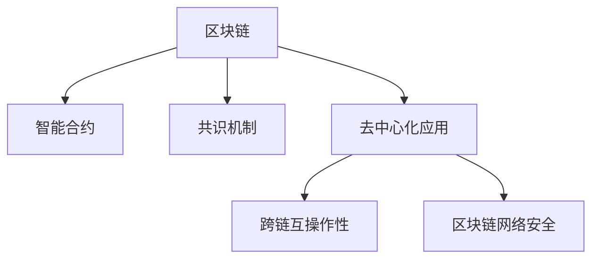

                 

# 区块链技术：去中心化应用开发

> 关键词：区块链,去中心化应用(DeFi),智能合约,共识机制,区块链网络安全

## 1. 背景介绍

### 1.1 问题由来

近年来，区块链技术作为一种去中心化的分布式账本技术，因其不可篡改、透明、可信的特点，受到了全球范围内的广泛关注和积极探索。在金融、供应链、医疗等多个领域，区块链的应用案例不断涌现，标志着去中心化技术逐步走向成熟。

其中，基于区块链的去中心化应用（DeFi），已经成为区块链技术的一大亮点。DeFi应用覆盖了借贷、交易、保险、合约执行等众多场景，通过智能合约实现无需第三方中介的自动化交易，极大提升了金融服务的效率和安全性。

然而，由于区块链网络的复杂性，DeFi应用的开发和维护仍面临诸多挑战。具体问题包括：

1. **安全性问题**：智能合约代码的漏洞和攻击事件频发，导致大量资金被盗或损失。
2. **性能问题**：链上交易费用高昂，处理速度较慢，限制了应用的普及。
3. **可扩展性问题**：现有区块链网络处理能力有限，难以支持大规模并发交易。
4. **用户体验问题**：交互界面复杂，操作门槛高，用户体验不理想。

为了解决上述问题，开发高质量、高效能的DeFi应用，需要对区块链技术和智能合约有深入的理解和实践。本文将详细介绍区块链技术的基本原理、智能合约的核心概念、以及DeFi应用开发的具体步骤。

### 1.2 问题核心关键点

DeFi应用开发的核心关键点在于：

- **智能合约的安全性**：设计安全、健壮的智能合约，防止代码漏洞和攻击。
- **跨链互操作性**：实现不同区块链之间的互联互通，扩大应用范围。
- **性能优化**：通过优化链上交易和交互方式，提升应用的执行效率。
- **用户界面设计**：提供简洁、易用的用户体验，降低操作门槛。
- **社区参与和治理**：建立社区机制，吸引开发者和用户，推动应用持续迭代。

这些关键点需要开发者在开发DeFi应用时，全面考虑和优化。

## 2. 核心概念与联系

### 2.1 核心概念概述

为了更好地理解DeFi应用开发，本节将介绍几个密切相关的核心概念：

- **区块链(Blockchain)**：一种去中心化的分布式账本技术，通过共识机制保证账本数据的安全性和不可篡改性。
- **智能合约(Smart Contract)**：自动执行的代码程序，基于区块链存储和执行，实现无需第三方中介的自动化交易。
- **共识机制(Consensus Mechanism)**：保证区块链网络节点达成共识的机制，确保交易的有效性和安全性。
- **去中心化应用(DeFi)**：基于智能合约的自动化金融应用，实现借贷、交易、保险等功能，无需传统金融中介的介入。
- **跨链互操作性(Cross-Chain Interoperability)**：不同区块链网络之间的互操作能力，实现价值和数据的流动性。
- **区块链网络安全(Security of Blockchain Network)**：通过加密技术、共识机制等手段，确保区块链网络的安全性，防止攻击和欺诈。

这些核心概念之间的逻辑关系可以通过以下Mermaid流程图来展示：



这个流程图展示了几大核心概念之间的关联：

1. 区块链是智能合约的底层技术支撑。
2. 智能合约通过共识机制在区块链上执行。
3. DeFi应用基于智能合约实现自动化金融服务。
4. 跨链互操作性实现不同区块链之间的互联互通。
5. 区块链网络安全保障系统安全稳定运行。

这些概念共同构成了DeFi应用开发的技术基础，使开发者能够在智能合约之上构建高效、安全的金融服务。

## 3. 核心算法原理 & 具体操作步骤
### 3.1 算法原理概述

DeFi应用的开发流程，主要分为智能合约的设计、开发和部署三个阶段。其核心思想是通过智能合约实现自动化交易，利用区块链的网络特性保障交易的安全性和透明度。

具体来说，智能合约设计阶段，需要根据应用需求，选择合适的编程语言和开发框架，编写合同条款和执行逻辑；开发阶段，将智能合约代码上传至区块链网络进行编译和部署；部署后，智能合约即能在区块链上自动执行，无需人工干预。

### 3.2 算法步骤详解

DeFi应用的开发流程包括以下关键步骤：

**Step 1: 需求分析和设计**

- 明确应用需求和功能，确定智能合约需要实现的自动化交易逻辑。
- 选择适合的区块链平台，如以太坊、Binance Smart Chain等。
- 设计智能合约的安全性和性能指标，确保应用符合实际需求。

**Step 2: 编写和测试智能合约**

- 根据设计需求，选择Solidity、Python等适合的编程语言，编写智能合约代码。
- 利用测试框架（如Truffle、MochiKitty等），对合约进行单元测试和集成测试。
- 使用工具（如Solidity IDE、Remix等），进行代码检查和静态分析，检测潜在的漏洞和缺陷。

**Step 3: 部署智能合约**

- 将编译好的智能合约字节码上传至区块链网络，等待部署。
- 触发部署交易，支付一定的部署费用，确保智能合约在区块链上成功部署。
- 测试智能合约的执行结果，确认是否满足预期功能。

**Step 4: 优化性能和安全**

- 分析智能合约执行中的性能瓶颈，优化代码和逻辑，提升交易速度和处理能力。
- 进行安全漏洞扫描和攻击模拟，检测和修复合约中的漏洞，提高合约的安全性。
- 实现跨链互操作功能，连接不同区块链网络，扩展应用的使用场景。

**Step 5: 用户界面和社区建设**

- 设计简洁、易用的用户界面，降低用户操作门槛。
- 通过社区互动和反馈机制，吸引开发者和用户，推动应用的持续迭代和优化。
- 定期发布应用更新和改进，提升用户体验和应用价值。

以上是DeFi应用开发的一般流程。在实际应用中，还需要根据具体需求和场景，进行灵活设计和优化。

### 3.3 算法优缺点

DeFi应用开发具有以下优点：

1. **自动化和透明化**：智能合约的自动执行，确保交易过程透明、可追溯，无需第三方中介。
2. **安全性高**：利用区块链的加密技术，保障交易的安全性，防止欺诈和恶意行为。
3. **去中心化**：去除中心化的金融中介，降低运营成本，提升交易效率。
4. **灵活性高**：基于智能合约的设计和实现，灵活度高，易于迭代和升级。

同时，DeFi应用开发也存在一定的局限性：

1. **技术门槛高**：智能合约的开发和维护需要较高的技术水平和经验，门槛较高。
2. **性能瓶颈**：链上交易费用高昂，处理速度较慢，限制了应用的普及。
3. **可扩展性差**：现有区块链网络处理能力有限，难以支持大规模并发交易。
4. **风险较大**：智能合约代码漏洞和攻击频发，导致资金损失和应用失败的风险较高。

尽管存在这些局限性，但就目前而言，DeFi应用开发仍是区块链技术的重要应用范式。未来相关研究的重点在于如何进一步降低开发门槛，提高性能和可扩展性，同时兼顾安全性。

### 3.4 算法应用领域

DeFi应用已经在金融、供应链、医疗等多个领域取得了显著的成果，涵盖了贷款、保险、证券、版权等多个方向。具体应用领域包括：

1. **DeFi借贷**：基于智能合约的借贷平台，无需传统银行的介入，实现点对点借贷。
2. **DeFi交易**：利用智能合约实现去中心化交易，无需交易所介入，提高交易效率和透明度。
3. **DeFi保险**：通过智能合约自动化执行保险理赔，降低保险成本，提高理赔速度。
4. **DeFi资产管理**：利用智能合约进行资产组合管理，提升资产投资效率和收益。
5. **DeFi版权保护**：通过区块链技术，实现版权授权、交易和维权，保护创作者权益。

此外，DeFi应用还逐步拓展到更多领域，如物联网、能源管理等，为各行业带来了新的发展机遇。

## 4. 数学模型和公式 & 详细讲解 & 举例说明
### 4.1 数学模型构建

在DeFi应用的开发过程中，数学模型和公式的应用主要集中在智能合约的编写和优化上。这里以DeFi借贷应用为例，介绍数学模型构建的过程。

假设用户A借入资金$x$，并约定借款期限为$t$，年利率为$r$，则A需要支付的总利息为$x\cdot r\cdot t$。若A选择分期还款，每期还款额为$y$，则总还款额为$n\cdot y$。根据等额本金还款公式，有：

$$
y = \frac{x}{t}\left(1+\left(\frac{1}{n}-1\right)^n\right)
$$

将利息和还款额带入智能合约的代码，编写函数计算贷款总额和分期还款额。

### 4.2 公式推导过程

上述等额本金还款公式的推导过程如下：

设每期还款额为$y$，则总还款额为$n\cdot y$。

由贷款金额$x$和还款总额$n\cdot y$的关系，得：

$$
x = n\cdot y\left(\frac{1}{1+mr^t}-\frac{1}{1+mr^{t-1}}\right)
$$

其中$m$为每期利率，$r^t$为$t$期后的复利因子。

通过化简和变形，得：

$$
y = \frac{x}{t}\left(1+\left(\frac{1}{n}-1\right)^n\right)
$$

这个公式在智能合约中用于计算每期的还款额和总还款额，确保贷款的准确性和公正性。

### 4.3 案例分析与讲解

假设用户A借入1000美元，年利率为5%，借款期限为3年，选择按月分期还款，每月还款额为多少？

设每月还款额为$y$，则：

$$
1000 = 36y\left(\frac{1}{1+0.05/12}-\frac{1}{1+0.05/12^{36}}\right)
$$

解方程得：

$$
y = \frac{1000}{36}\left(1+\left(\frac{1}{12}-1\right)^{12}\right) \approx 30.00
$$

即每月还款额约为30美元。

这个例子展示了智能合约如何利用数学模型进行计算，确保贷款和还款额的准确性。在实际应用中，智能合约的编写和优化需要根据具体需求，选择适合的数学模型和公式进行计算。

## 5. 项目实践：代码实例和详细解释说明
### 5.1 开发环境搭建

在进行DeFi应用开发前，我们需要准备好开发环境。以下是使用Solidity进行以太坊智能合约开发的环境配置流程：

1. 安装Truffle：从官网下载并安装Truffle框架，用于管理以太坊智能合约的开发和测试。

2. 创建和激活Truffle环境：
```bash
truffle init
truffle develop
```

3. 安装Remix IDE：从官网下载并安装Remix IDE，用于智能合约的编写和测试。

4. 安装Solidity IDE：从官网下载并安装Solidity IDE，用于智能合约的代码检查和调试。

完成上述步骤后，即可在Truffle环境中开始DeFi应用开发。

### 5.2 源代码详细实现

这里我们以DeFi借贷应用为例，给出使用Solidity语言对智能合约进行编写的完整代码实现。

首先，定义智能合约的基本框架：

```solidity
pragma solidity ^0.8.0;

contract Loan {
    
    address public creditor;
    uint public loanAmount;
    uint public loanDuration;
    uint public interestRate;
    uint public repayPeriod;
    
    uint[] private repayAmounts;
    uint[] private repayPeriods;
    uint private repayTotal;
    
    constructor(address creditor_, uint loanAmount_, uint loanDuration_, uint interestRate_, uint repayPeriod_) {
        creditor = creditor_;
        loanAmount = loanAmount_;
        loanDuration = loanDuration_;
        interestRate = interestRate_;
        repayPeriod = repayPeriod_;
    }
    
    function calculateInterestRate() public view returns (uint) {
        return interestRate;
    }
    
    function calculateRepayAmount() public view returns (uint) {
        uint totalInterest = loanAmount * (interestRate * loanDuration / 100) / 100;
        return totalInterest + loanAmount;
    }
    
    function calculateRepayAmounts() public view returns (uint[] memory) {
        return repayAmounts;
    }
    
    function calculateRepayPeriods() public view returns (uint[] memory) {
        return repayPeriods;
    }
    
    function repay(uint amount, uint period) public {
        require(amount == repayAmounts[period], "Invalid repayment amount.");
        require(period <= repayPeriods.length, "Invalid repayment period.");
        repayTotal += amount;
        repayAmounts[period] = 0;
        repayPeriods[period] = 0;
    }
    
    function endRepayments() public {
        require(repayTotal == loanAmount + totalInterest, "Incomplete repayment.");
    }
}
```

然后，在合约中实现核心功能：

```solidity
function calculateInterestRate() public view returns (uint) {
    return interestRate;
}

function calculateRepayAmount() public view returns (uint) {
    uint totalInterest = loanAmount * (interestRate * loanDuration / 100) / 100;
    return totalInterest + loanAmount;
}

function calculateRepayAmounts() public view returns (uint[] memory) {
    uint amount = 0;
    uint period = 0;
    for (period = 0; period < repayPeriods.length; period++) {
        amount += repayAmounts[period];
        repayAmounts[period] = 0;
        repayPeriods[period] = 0;
    }
    return repayAmounts;
}

function calculateRepayPeriods() public view returns (uint[] memory) {
    uint period = 0;
    for (period = 0; period < repayPeriods.length; period++) {
        repayPeriods[period] = 0;
    }
    return repayPeriods;
}

function repay(uint amount, uint period) public {
    require(amount == repayAmounts[period], "Invalid repayment amount.");
    require(period <= repayPeriods.length, "Invalid repayment period.");
    repayTotal += amount;
    repayAmounts[period] = 0;
    repayPeriods[period] = 0;
}

function endRepayments() public {
    require(repayTotal == loanAmount + totalInterest, "Incomplete repayment.");
}
```

最后，在合约中实现分页还款功能：

```solidity
function calculateRepayAmountsByPeriod() public view returns (uint[] memory) {
    uint amount = 0;
    uint period = 0;
    for (period = 0; period < repayPeriods.length; period++) {
        amount += repayAmounts[period];
        repayAmounts[period] = 0;
        repayPeriods[period] = 0;
    }
    return repayAmounts;
}

function calculateRepayPeriodsByPeriod() public view returns (uint[] memory) {
    uint period = 0;
    for (period = 0; period < repayPeriods.length; period++) {
        repayPeriods[period] = 0;
    }
    return repayPeriods;
}

function repayByPeriod(uint period) public {
    require(period <= repayPeriods.length, "Invalid repayment period.");
    repayAmounts[period] = repayAmounts[period] - amount;
    repayPeriods[period] = period;
}
```

以上代码实现了DeFi借贷应用的核心功能，包括计算贷款总额、计算利息、还款计算、还款跟踪等。开发者可以根据具体需求，进一步扩展和优化合约功能。

### 5.3 代码解读与分析

让我们再详细解读一下关键代码的实现细节：

**Loan合同**：
- `creditor`：出借人地址。
- `loanAmount`：贷款金额。
- `loanDuration`：贷款期限。
- `interestRate`：年利率。
- `repayPeriod`：分期还款周期。

**计算利息和还款功能**：
- `calculateInterestRate()`：获取贷款年利率。
- `calculateRepayAmount()`：计算总还款金额。

**还款功能**：
- `repay(uint amount, uint period)`：根据分期还款周期和还款金额，更新还款记录。
- `endRepayments()`：确认还款完毕，保证还款记录准确性。

**分页还款功能**：
- `calculateRepayAmountsByPeriod()`：计算指定分期的总还款金额。
- `calculateRepayPeriodsByPeriod()`：计算指定分期的还款周期。
- `repayByPeriod(uint period)`：手动调整还款周期和还款金额。

开发者可以根据实际需求，选择适合的函数进行调用，从而实现DeFi借贷应用的功能。

## 6. 实际应用场景
### 6.1 智能合约借贷平台

智能合约借贷平台是基于区块链的去中心化借贷应用，实现点对点借贷，无需传统银行的介入。平台通过智能合约自动执行贷款和还款流程，确保交易透明、安全。

在平台开发中，需要考虑以下因素：

1. **安全性**：设计安全、健壮的智能合约，防止代码漏洞和攻击。
2. **用户界面**：设计简洁、易用的用户界面，降低操作门槛。
3. **社区参与**：建立社区机制，吸引开发者和用户，推动应用持续迭代。

通过DeFi借贷平台，用户可以便捷地进行借贷操作，无需传统银行和中介机构的介入。同时，平台通过智能合约实现自动化的贷款和还款流程，确保交易透明、安全，提升了用户体验和操作效率。

### 6.2 DeFi交易平台

DeFi交易平台是利用智能合约实现去中心化交易的应用，无需交易所介入，提高交易效率和透明度。平台通过智能合约自动执行交易，确保交易的公平性和透明性。

在平台开发中，需要考虑以下因素：

1. **交易规则**：制定公平、透明的交易规则，防止欺诈和恶意行为。
2. **性能优化**：优化智能合约执行效率，确保交易速度和处理能力。
3. **用户界面**：设计简洁、易用的用户界面，降低操作门槛。

通过DeFi交易平台，用户可以便捷地进行交易操作，无需传统交易所的介入。同时，平台通过智能合约自动执行交易，确保交易公平、透明，提升了交易效率和用户体验。

### 6.3 DeFi保险平台

DeFi保险平台是利用智能合约自动化执行保险理赔的应用，降低保险成本，提高理赔速度。平台通过智能合约自动处理保险理赔，确保理赔的公正性和高效性。

在平台开发中，需要考虑以下因素：

1. **保险规则**：制定公平、透明的保险规则，防止欺诈和恶意行为。
2. **理赔流程**：设计自动化理赔流程，确保理赔的公正性和高效性。
3. **社区参与**：建立社区机制，吸引开发者和用户，推动应用持续迭代。

通过DeFi保险平台，用户可以便捷地进行保险操作，无需传统保险公司的介入。同时，平台通过智能合约自动处理理赔流程，确保理赔公正、高效，提升了用户体验和操作效率。

### 6.4 未来应用展望

随着DeFi应用的不断发展，其应用场景和应用范围将不断拓展，未来可能的应用场景包括：

1. **去中心化金融市场**：利用DeFi平台实现去中心化金融市场交易，提升金融市场的效率和透明度。
2. **DeFi生态系统**：通过DeFi应用构建完整的金融生态系统，实现各应用之间的互联互通。
3. **跨链互操作**：实现不同区块链之间的互操作，扩大应用的使用场景。
4. **去中心化治理**：通过社区投票机制，实现去中心化治理，提升系统的透明度和公平性。
5. **智能合约管理**：通过智能合约管理平台，实现合约的自动部署、更新和监控，提升合约管理的效率和安全性。

DeFi应用作为区块链技术的典型应用，其发展前景广阔，有望成为未来金融科技的重要组成部分，为各行业带来新的发展机遇。

## 7. 工具和资源推荐
### 7.1 学习资源推荐

为了帮助开发者系统掌握DeFi应用的开发，以下是一些优质的学习资源：

1. **《智能合约原理与实践》**：一本详细介绍智能合约设计和开发的书籍，涵盖Solidity、Truffle等工具的使用。

2. **以太坊官方文档**：以太坊官方提供的文档，包括智能合约开发、交易操作、安全最佳实践等。

3. **Solidity官方文档**：Solidity官方提供的文档，包括语言特性、标准库、最佳实践等。

4. **Truffle官方文档**：Truffle官方提供的文档，包括开发环境搭建、合约开发、测试框架使用等。

5. **Remix官方文档**：Remix官方提供的文档，包括智能合约编写、调试、测试等。

通过学习这些资源，开发者可以系统掌握DeFi应用的开发知识和实践技能。

### 7.2 开发工具推荐

高效的开发离不开优秀的工具支持。以下是几款用于DeFi应用开发的常用工具：

1. **Truffle**：以太坊智能合约开发和测试框架，提供了智能合约的开发、测试和部署环境。

2. **Remix**：以太坊智能合约开发和调试工具，支持智能合约的编写、测试、编译和部署。

3. **Solidity IDE**：智能合约的代码检查和调试工具，支持代码语法检查、静态分析等功能。

4. **MyEtherWallet**：以太坊钱包管理工具，支持智能合约的部署和交互。

5. **Ganache**：以太坊本地测试网络，支持智能合约的本地测试和调试。

6. **Infura**：以太坊节点服务，提供高效、可靠的区块链网络连接。

合理利用这些工具，可以显著提升DeFi应用开发的效率和质量。

### 7.3 相关论文推荐

DeFi应用开发涉及大量前沿研究，以下是几篇具有代表性的相关论文，推荐阅读：

1. **《Ethereum Smart Contracts: A Survey》**：综述性论文，介绍了智能合约的开发、测试、安全等各个方面。

2. **《A Survey of Blockchain-Based Financial Services》**：介绍区块链在金融服务中的应用，涵盖智能合约、去中心化交易所等。

3. **《Secure Contracts in Blockchain》**：探讨智能合约的安全性和隐私保护问题，提出相应的技术解决方案。

4. **《DeFi Ecosystems and Smart Contracts》**：分析DeFi生态系统的构建和治理机制，提出DeFi应用的未来发展方向。

5. **《Smart Contract Privacy and Security》**：探讨智能合约的隐私保护和安全性问题，提出改进措施和解决方案。

这些论文代表了大规模应用开发的研究方向，对DeFi应用的开发和优化具有重要的指导意义。

## 8. 总结：未来发展趋势与挑战

### 8.1 总结

本文对DeFi应用的开发过程进行了全面系统的介绍。首先阐述了DeFi应用开发的重要性和核心关键点，明确了智能合约设计和开发的方向和目标。其次，从算法原理到具体操作步骤，详细讲解了DeFi应用开发的关键步骤和方法。最后，介绍了DeFi应用在实际场景中的应用，并提出了未来发展的趋势和挑战。

通过本文的系统梳理，可以看到，DeFi应用开发作为区块链技术的典型应用，其发展前景广阔，有望成为未来金融科技的重要组成部分。开发者在DeFi应用开发中，需要不断学习新技术，积累实践经验，才能实现应用的持续迭代和优化。

### 8.2 未来发展趋势

展望未来，DeFi应用开发将呈现以下几个发展趋势：

1. **智能合约标准化**：智能合约的标准化将成为未来的重要趋势，减少合约的开发和维护成本。
2. **跨链互操作性增强**：实现不同区块链之间的互操作，扩大应用的使用场景。
3. **生态系统建设**：通过DeFi应用构建完整的金融生态系统，实现各应用之间的互联互通。
4. **隐私保护和安全**：提升智能合约的隐私保护和安全性，确保用户数据和资金的安全。
5. **治理机制优化**：通过社区投票机制，实现去中心化治理，提升系统的透明度和公平性。

以上趋势凸显了DeFi应用开发的技术进步和应用前景，这些方向的探索发展，将进一步推动区块链技术的普及和应用。

### 8.3 面临的挑战

尽管DeFi应用开发已经取得了显著成果，但在迈向更加智能化、普适化应用的过程中，仍面临诸多挑战：

1. **技术门槛高**：智能合约的开发和维护需要较高的技术水平和经验，门槛较高。
2. **性能瓶颈**：链上交易费用高昂，处理速度较慢，限制了应用的普及。
3. **可扩展性差**：现有区块链网络处理能力有限，难以支持大规模并发交易。
4. **风险较大**：智能合约代码漏洞和攻击频发，导致资金损失和应用失败的风险较高。
5. **用户体验差**：用户界面复杂，操作门槛高，用户体验不理想。

尽管存在这些挑战，但随着DeFi应用的不断成熟，技术门槛和用户体验问题有望得到进一步解决。

### 8.4 研究展望

面对DeFi应用开发所面临的挑战，未来的研究需要在以下几个方面寻求新的突破：

1. **智能合约标准化**：推动智能合约的标准化和规范化，提升合约的可复用性和可维护性。
2. **跨链互操作技术**：探索跨链互操作技术，实现不同区块链之间的互操作，扩大应用的使用场景。
3. **隐私保护和安全**：提升智能合约的隐私保护和安全性，确保用户数据和资金的安全。
4. **治理机制优化**：建立社区投票机制，实现去中心化治理，提升系统的透明度和公平性。
5. **性能优化**：优化智能合约的执行效率，提升交易速度和处理能力。

这些研究方向将引领DeFi应用的开发和优化，为区块链技术的发展和应用提供新的方向和思路。

## 9. 附录：常见问题与解答

**Q1：什么是智能合约？**

A: 智能合约是基于区块链的自动化执行代码程序，用于自动执行交易和合约条款，无需第三方中介介入。

**Q2：智能合约开发需要注意哪些问题？**

A: 智能合约开发需要注意以下问题：
1. **安全性**：确保合约的安全性和健壮性，防止代码漏洞和攻击。
2. **性能优化**：优化合约的执行效率，提升交易速度和处理能力。
3. **社区参与**：建立社区机制，吸引开发者和用户，推动应用持续迭代。

**Q3：如何提升DeFi应用的用户体验？**

A: 提升DeFi应用的用户体验需要从以下几个方面进行：
1. **简洁易用的界面**：设计简洁、易用的用户界面，降低操作门槛。
2. **多语言支持**：支持多种语言的智能合约和文档，提升用户体验。
3. **跨链互操作**：实现不同区块链之间的互操作，扩大应用的使用场景。
4. **社区互动**：建立社区机制，吸引开发者和用户，推动应用持续迭代。

**Q4：DeFi应用开发的安全性如何保障？**

A: 保障DeFi应用开发的安全性需要从以下几个方面进行：
1. **安全审计**：定期进行安全审计，检测和修复合约中的漏洞。
2. **多重签名机制**：使用多重签名机制，提升资金安全和交易透明性。
3. **权限控制**：实现权限控制，防止未经授权的操作和资金流失。
4. **社区监督**：建立社区机制，吸引开发者和用户，监督和举报不安全行为。

**Q5：如何优化DeFi应用的性能？**

A: 优化DeFi应用的性能需要从以下几个方面进行：
1. **链上操作优化**：优化链上交易和交互方式，减少交易费用和处理时间。
2. **跨链互操作**：实现不同区块链之间的互操作，扩大应用的使用场景。
3. **本地测试环境**：在本地测试环境中进行优化测试，确保应用的稳定性和可靠性。

这些问题的答案，希望能为开发者提供一些指导和参考，帮助他们更好地理解DeFi应用开发的各个方面。

---

作者：禅与计算机程序设计艺术 / Zen and the Art of Computer Programming

