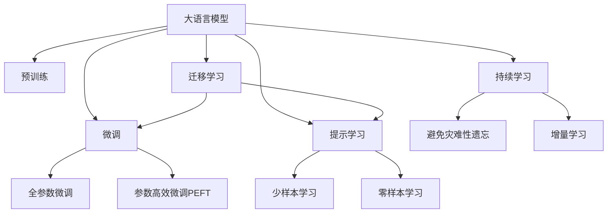

                 

## 1. 背景介绍

在人工智能领域，博学、审问、慎思、明辨、笃行是任何一次技术突破必须经历的五阶段过程。本节将对大语言模型进行详细解析，从背景知识到核心概念，再到核心算法和操作步骤，系统梳理大语言模型的基本原理和实践方法。

### 1.1 问题由来

大语言模型（Large Language Models, LLMs）在近年来取得了显著的进展。例如，GPT-3模型通过在百万亿级的参数上进行训练，展现了强大的语言理解能力和生成能力。然而，预训练的大语言模型往往在特定领域上的表现有限，无法直接应用于实际问题。

### 1.2 问题核心关键点

大语言模型微调的核心关键点在于如何结合监督学习，使得模型在特定任务上达到更好的表现。主要包括以下几个方面：

1. 选择合适的模型：基于预训练语言模型，如BERT、GPT等。
2. 设计任务适配层：根据特定任务，设计合适的输出层和损失函数。
3. 设置微调超参数：包括学习率、优化器、正则化等。
4. 执行梯度训练：通过反向传播算法更新模型参数。
5. 评估模型性能：在验证集和测试集上评估模型效果。
6. 部署应用：将微调后的模型应用于实际应用场景。

### 1.3 问题研究意义

大语言模型微调的研究意义在于：

1. 提升模型效果：利用监督学习，微调模型在特定任务上取得更好的性能。
2. 降低成本：减少从头训练模型的成本，缩短开发周期。
3. 拓展应用：扩大语言模型的应用场景，如智能客服、金融舆情、个性化推荐等。
4. 技术创新：推动自然语言处理领域的技术进步，促进NLP技术的产业化。

## 2. 核心概念与联系

### 2.1 核心概念概述

本节将介绍几个关键概念：

- **大语言模型（Large Language Models, LLMs）**：基于自回归或自编码模型的大规模预训练语言模型，具有强大的语言理解和生成能力。
- **预训练（Pre-training）**：通过在大量无标签文本上训练模型，学习通用的语言表示。
- **微调（Fine-tuning）**：在预训练模型基础上，通过有监督学习优化特定任务的表现。
- **迁移学习（Transfer Learning）**：利用预训练模型在特定任务上进行微调。
- **参数高效微调（Parameter-Efficient Fine-tuning, PEFT）**：只更新少量参数，提高微调效率。
- **提示学习（Prompt Learning）**：通过输入模板，引导模型输出特定结果，减少微调参数。
- **少样本学习（Few-shot Learning）**：利用少量样本进行训练。
- **零样本学习（Zero-shot Learning）**：不依赖任何样本，直接从任务描述中推理结果。
- **持续学习（Continual Learning）**：模型在持续新数据的情况下，保持学习能力。

这些概念通过以下Mermaid流程图联系起来：



### 2.2 核心概念原理和架构的 Mermaid 流程图


## 3. 核心算法原理 & 具体操作步骤

### 3.1 算法原理概述

大语言模型微调的核心原理是通过有监督学习，在预训练模型基础上，优化模型在特定任务上的性能。算法流程如下：

1. 准备预训练模型和数据集。
2. 设计任务适配层。
3. 设置微调超参数。
4. 执行梯度训练。
5. 评估和部署模型。

### 3.2 算法步骤详解

#### 步骤一：准备预训练模型和数据集

- 选择合适的预训练模型，如BERT、GPT等。
- 收集标注数据集，包括训练集、验证集和测试集。

#### 步骤二：设计任务适配层

- 根据任务类型，设计合适的输出层。
- 选择合适的损失函数，如交叉熵损失、均方误差损失等。

#### 步骤三：设置微调超参数

- 选择合适的优化器，如Adam、SGD等。
- 设置学习率、批大小、迭代轮数等。
- 添加正则化技术，如L2正则、Dropout等。

#### 步骤四：执行梯度训练

- 将数据集批次化加载。
- 前向传播计算损失。
- 反向传播计算梯度。
- 使用优化器更新模型参数。
- 周期性在验证集上评估模型性能。
- 重复训练，直至满足停止条件。

#### 步骤五：评估和部署模型

- 在测试集上评估模型性能。
- 将模型应用到实际应用场景中。
- 定期更新模型，保持最新性能。

### 3.3 算法优缺点

#### 优点

- 高效：可以利用已有预训练模型，减少从头训练成本。
- 灵活：适用于各种NLP任务。
- 泛化能力强：在特定领域内表现优异。
- 参数高效：可通过PEFT等方法减少需更新的参数。

#### 缺点

- 依赖标注数据：需要大量标注数据，获取成本高。
- 迁移能力有限：难以跨领域迁移。
- 模型鲁棒性不足：面对域外数据，泛化性能差。
- 可解释性差：难以解释模型决策过程。

### 3.4 算法应用领域

- 智能客服：利用微调模型，提升客户咨询体验。
- 金融舆情：监测市场舆情，及时预警风险。
- 个性化推荐：通过微调模型，实现精准推荐。
- 医疗诊断：利用微调模型，辅助医生诊断。
- 教育：实现智能批改作业，提供个性化学习建议。

## 4. 数学模型和公式 & 详细讲解

### 4.1 数学模型构建

假设预训练模型为 $M_{\theta}$，任务适配层为 $F$，任务损失函数为 $\mathcal{L}$，微调的目标是最小化任务损失函数：

$$
\hat{\theta} = \mathop{\arg\min}_{\theta} \mathcal{L}(M_{\theta}, F(x))
$$

### 4.2 公式推导过程

以二分类任务为例，假设模型输出为 $\hat{y}=M_{\theta}(x)$，真实标签为 $y \in \{0,1\}$。则损失函数为：

$$
\mathcal{L}(M_{\theta}(x),y) = -[y\log \hat{y} + (1-y)\log(1-\hat{y})]
$$

使用梯度下降算法进行微调，优化目标函数为：

$$
\theta \leftarrow \theta - \eta \nabla_{\theta}\mathcal{L}(\theta)
$$

其中，$\eta$ 为学习率，$\nabla_{\theta}\mathcal{L}(\theta)$ 为损失函数对 $\theta$ 的梯度。

### 4.3 案例分析与讲解

考虑一个情感分析任务，输入为评论文本，输出为情感分类。假设模型输出为 $\hat{y}=M_{\theta}(x)$，则损失函数为：

$$
\mathcal{L}(M_{\theta}(x),y) = -\frac{1}{N}\sum_{i=1}^N [y_i\log \hat{y}_i+(1-y_i)\log(1-\hat{y}_i)]
$$

梯度下降更新公式为：

$$
\theta \leftarrow \theta - \eta \frac{1}{N}\sum_{i=1}^N [\frac{y_i}{\hat{y}_i}-\frac{1-y_i}{1-\hat{y}_i}]\frac{\partial M_{\theta}(x)}{\partial \theta}
$$

## 5. 项目实践：代码实例和详细解释说明

### 5.1 开发环境搭建

- 安装Anaconda：从官网下载并安装Anaconda。
- 创建虚拟环境：
```bash
conda create -n pytorch-env python=3.8 
conda activate pytorch-env
```

- 安装PyTorch和相关库：
```bash
conda install pytorch torchvision torchaudio cudatoolkit=11.1 -c pytorch -c conda-forge
```

### 5.2 源代码详细实现

以情感分析为例，以下是使用PyTorch实现微调的大致代码：

```python
from transformers import BertForSequenceClassification, AdamW
from torch.utils.data import DataLoader
from sklearn.metrics import classification_report

# 加载预训练模型和任务适配层
model = BertForSequenceClassification.from_pretrained('bert-base-uncased', num_labels=2)

# 设置优化器和超参数
optimizer = AdamW(model.parameters(), lr=2e-5)

# 准备数据集
train_data = ...
val_data = ...
test_data = ...

# 创建数据加载器
train_loader = DataLoader(train_data, batch_size=16, shuffle=True)
val_loader = DataLoader(val_data, batch_size=16, shuffle=False)
test_loader = DataLoader(test_data, batch_size=16, shuffle=False)

# 训练模型
for epoch in range(5):
    model.train()
    for batch in train_loader:
        input_ids = batch['input_ids'].to(device)
        attention_mask = batch['attention_mask'].to(device)
        labels = batch['labels'].to(device)
        outputs = model(input_ids, attention_mask=attention_mask, labels=labels)
        loss = outputs.loss
        optimizer.zero_grad()
        loss.backward()
        optimizer.step()
    
    model.eval()
    evaluator = Evaluator(val_loader)
    with torch.no_grad():
        y_preds, y_true = evaluator.predict(val_loader)
        print(classification_report(y_true, y_preds))

# 测试模型
with torch.no_grad():
    y_preds, y_true = evaluator.predict(test_loader)
    print(classification_report(y_true, y_preds))
```

### 5.3 代码解读与分析

代码中包含了数据加载、模型训练、评估等关键步骤：

- 加载预训练模型和任务适配层：使用 `BertForSequenceClassification` 类加载预训练的BERT模型，并设计合适的任务适配层。
- 设置优化器和超参数：使用AdamW优化器，设置学习率、批大小等超参数。
- 准备数据集：准备训练集、验证集和测试集，并进行数据增强等处理。
- 创建数据加载器：使用DataLoader加载数据集。
- 训练模型：在训练集上迭代训练模型，计算损失并更新参数。
- 评估模型：在验证集和测试集上评估模型性能，并输出分类报告。

## 6. 实际应用场景

### 6.1 智能客服系统

通过微调模型，智能客服系统可以提升客户咨询体验。例如，通过微调BERT模型，训练对话生成模型，实现自动问答功能，提升客服响应速度和质量。

### 6.2 金融舆情监测

利用微调技术，对金融舆情进行情感分析，及时预警风险。例如，通过微调BERT模型，分析新闻评论的情感倾向，监测市场舆情。

### 6.3 个性化推荐系统

利用微调模型，实现个性化推荐。例如，通过微调BERT模型，根据用户浏览历史生成推荐列表，提高推荐效果。

### 6.4 未来应用展望

未来，微调技术将在更多领域得到应用，如智慧医疗、智能教育、智慧城市等。微调技术将推动NLP技术的发展，提升各行业智能化水平。

## 7. 工具和资源推荐

### 7.1 学习资源推荐

- 《Transformer从原理到实践》系列博文：深入浅出介绍Transformer原理、BERT模型、微调技术等。
- CS224N《深度学习自然语言处理》课程：斯坦福大学开设的NLP明星课程，涵盖NLP基本概念和经典模型。
- 《Natural Language Processing with Transformers》书籍：全面介绍使用Transformers库进行NLP任务开发。
- HuggingFace官方文档：提供预训练模型和微调样例，方便开发者上手实践。
- CLUE开源项目：提供中文语言理解测评基准，助力中文NLP技术发展。

### 7.2 开发工具推荐

- PyTorch：开源深度学习框架，适合快速迭代研究。
- TensorFlow：Google主导的开源框架，生产部署方便。
- Transformers库：HuggingFace开发的NLP工具库，集成了多个预训练模型。
- Weights & Biases：记录和可视化模型训练指标。
- Google Colab：谷歌提供的在线Jupyter Notebook环境，方便实验和分享。

### 7.3 相关论文推荐

- Attention is All You Need（Transformer原论文）：提出Transformer结构，开启NLP预训练模型时代。
- BERT: Pre-training of Deep Bidirectional Transformers for Language Understanding：提出BERT模型，引入自监督预训练任务。
- Language Models are Unsupervised Multitask Learners（GPT-2论文）：展示大语言模型的零样本学习能力。
- Parameter-Efficient Transfer Learning for NLP：提出Adapter等参数高效微调方法。
- Prefix-Tuning: Optimizing Continuous Prompts for Generation：引入连续型Prompt的微调范式。

## 8. 总结：未来发展趋势与挑战

### 8.1 研究成果总结

本文系统梳理了基于监督学习的大语言模型微调方法。通过从原理到实践的全面讲解，帮助读者理解大语言模型微调的核心概念和操作步骤。本文还提供了丰富的学习资源和开发工具，助力开发者高效实践。

### 8.2 未来发展趋势

未来，大语言模型微调技术将呈现以下几个发展趋势：

1. 模型规模持续增大：超大规模语言模型将进一步提升微调效果。
2. 微调方法多样：参数高效微调、持续学习、无监督学习等方法将被广泛应用。
3. 多模态微调崛起：多模态信息融合，提升语言模型对现实世界的理解能力。
4. 模型通用性增强：大语言模型将具备更强的跨领域迁移能力。

### 8.3 面临的挑战

微调技术在发展过程中仍面临以下挑战：

1. 标注成本高：大规模标注数据获取成本高。
2. 模型鲁棒性不足：面对域外数据，泛化性能差。
3. 推理效率低：大模型推理速度慢，内存占用大。
4. 可解释性差：微调模型决策过程缺乏解释。
5. 安全性问题：模型输出可能存在偏见、有害信息。

### 8.4 研究展望

未来研究应关注以下几个方向：

1. 探索无监督和半监督微调方法。
2. 研究参数高效和计算高效的微调范式。
3. 引入更多先验知识，提高模型泛化能力。
4. 结合因果分析和博弈论工具，提高模型鲁棒性。
5. 纳入伦理道德约束，确保模型输出安全。

## 9. 附录：常见问题与解答

**Q1：大语言模型微调是否适用于所有NLP任务？**

A: 微调方法适用于大多数NLP任务，但需根据具体任务进行优化。

**Q2：微调过程中如何选择合适的学习率？**

A: 一般建议从1e-5开始调参，逐步减小学习率，直至收敛。

**Q3：采用大模型微调时会面临哪些资源瓶颈？**

A: 主要面临算力、内存、存储等资源瓶颈，需采用优化技术。

**Q4：如何缓解微调过程中的过拟合问题？**

A: 数据增强、正则化、对抗训练等方法可缓解过拟合。

**Q5：微调模型在落地部署时需要注意哪些问题？**

A: 模型裁剪、量化加速、服务化封装、弹性伸缩、监控告警、安全防护等。

作者：禅与计算机程序设计艺术 / Zen and the Art of Computer Programming

