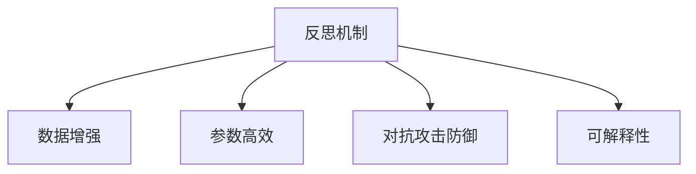

                 

# 反思机制在复杂任务中的作用

在人工智能飞速发展的今天，反思机制（Reflection Mechanism）作为一种重要的技术手段，正日益成为解决复杂任务的关键。本文将从多个角度探讨反思机制的作用，阐述其在复杂任务中的重要性，并提出未来的研究方向。

## 1. 背景介绍

### 1.1 问题由来

随着人工智能技术的不断进步，其在医疗、金融、教育等各个领域的应用越来越广泛。然而，人工智能系统，尤其是深度学习模型，在面对复杂任务时，往往存在以下问题：

- **数据稀缺性**：在复杂任务中，获取高质量的标注数据难度较大，训练数据稀缺性问题严重影响模型性能。
- **模型复杂性**：复杂的深度学习模型需要大量的计算资源和存储空间，难以在实际应用中快速部署。
- **泛化能力**：模型在处理新数据时，往往出现泛化能力不足，难以适应新场景和新变化。

反思机制作为一种应对策略，可以有效缓解这些问题，提升模型性能和应用效率。

### 1.2 问题核心关键点

反思机制的核心在于通过反馈和调整，不断优化模型的决策过程，使其在处理复杂任务时更加稳健和高效。其主要作用包括：

- **数据增强**：通过反思机制，模型可以自动生成新的训练样本，丰富数据集，提升模型泛化能力。
- **参数高效**：反思机制可以帮助模型学习到更加参数高效的形式，减少冗余参数，提高模型性能。
- **对抗攻击防御**：反思机制可以增强模型的鲁棒性，防御对抗攻击，提升模型的安全性和可靠性。
- **决策透明**：反思机制可以提供模型的决策路径和依据，提高模型可解释性和可理解性。

## 2. 核心概念与联系

### 2.1 核心概念概述

为了更好地理解反思机制在复杂任务中的作用，我们首先需要明确几个核心概念：

- **反思机制**：通过在模型训练和推理过程中引入反馈和调整机制，不断优化模型的决策过程，提升模型性能。
- **数据增强**：通过对原始数据进行变换和扩展，生成更多的训练样本，增强模型的泛化能力。
- **参数高效**：通过优化模型结构，减少冗余参数，提升模型的性能和计算效率。
- **对抗攻击防御**：通过强化模型的鲁棒性，使其能够抵抗对抗攻击，提高系统的安全性。
- **可解释性**：通过提供模型的决策路径和依据，提高模型的可解释性和可理解性。

这些概念之间的逻辑关系可以通过以下Mermaid流程图来展示：



这个流程图展示了几大核心概念之间的联系：反思机制通过数据增强、参数高效、对抗攻击防御和可解释性等手段，优化模型性能，提升模型在复杂任务中的应用效果。

## 3. 核心算法原理 & 具体操作步骤
### 3.1 算法原理概述

反思机制的核心原理是通过反馈和调整，不断优化模型的决策过程。其基本流程包括：

1. **输入数据**：将原始数据输入模型，进行前向传播和计算。
2. **生成反思数据**：通过数据增强和对抗样本生成等手段，生成反思数据，用于模型优化。
3. **调整模型**：通过引入反思数据，调整模型参数，提升模型性能。
4. **输出预测**：使用优化后的模型，对新数据进行预测和推理。

### 3.2 算法步骤详解

反思机制的具体操作步骤如下：

1. **数据预处理**：对原始数据进行预处理，包括数据清洗、归一化和标准化等操作。
2. **模型输入**：将预处理后的数据输入到模型中进行前向传播计算，获取模型的输出结果。
3. **反思数据生成**：通过数据增强、对抗样本生成等技术，生成反思数据。
4. **模型调整**：将反思数据重新输入模型，调整模型参数，如使用反向传播算法更新权重。
5. **模型验证**：使用验证集对模型进行调整后的性能进行验证，确保模型优化效果。
6. **输出预测**：使用优化后的模型，对新数据进行预测和推理。

### 3.3 算法优缺点

反思机制作为一种优化模型性能的技术，具有以下优点：

- **提升泛化能力**：通过数据增强和对抗样本生成，模型能够适应更多数据分布，提升泛化能力。
- **参数高效**：通过调整模型结构，减少冗余参数，提高模型性能。
- **提高安全性**：通过对抗攻击防御，提高模型鲁棒性，防止恶意攻击。
- **增强可解释性**：通过提供决策路径和依据，提高模型的可解释性和可理解性。

同时，反思机制也存在以下缺点：

- **计算复杂度较高**：反思机制需要大量计算资源和时间，特别是在数据增强和对抗样本生成时。
- **数据增强效果有限**：数据增强的效果取决于数据分布和模型结构，有时难以达到理想效果。
- **模型调整复杂**：反思机制需要频繁调整模型参数，可能导致模型过拟合或欠拟合。

### 3.4 算法应用领域

反思机制在多个领域中都有广泛的应用，例如：

- **医疗诊断**：在医疗图像诊断中，通过反思机制生成对抗样本，提高模型对罕见病例的识别能力。
- **金融风险管理**：在金融风控中，通过反思机制生成反思数据，提升模型的鲁棒性和泛化能力。
- **智能推荐系统**：在推荐系统中，通过反思机制优化模型结构，提升推荐效果。
- **自动驾驶**：在自动驾驶中，通过反思机制生成对抗样本，提高模型的鲁棒性和安全性。
- **自然语言处理**：在自然语言处理中，通过反思机制生成反思数据，提升模型的泛化能力和可解释性。

## 4. 数学模型和公式 & 详细讲解 & 举例说明

### 4.1 数学模型构建

反思机制的数学模型构建主要涉及数据增强和模型调整两个部分。

假设原始数据集为 $D = \{(x_i, y_i)\}_{i=1}^N$，其中 $x_i$ 为输入，$y_i$ 为标签。反思机制通过以下步骤构建模型：

1. **数据增强**：对原始数据进行增强，生成新的数据集 $D' = \{(x_i', y_i')\}_{i=1}^N$，其中 $x_i'$ 为增强后的输入，$y_i'$ 为增强后的标签。
2. **模型调整**：使用反思数据集 $D'$ 训练模型，得到调整后的模型参数 $\theta'$。
3. **输出预测**：使用调整后的模型 $\theta'$ 对新数据 $x$ 进行预测，得到输出 $\hat{y}$。

### 4.2 公式推导过程

以数据增强为例，常见的数据增强方法包括：

- **旋转增强**：将原始图像旋转一定角度，生成新的图像数据。
- **裁剪增强**：从原始图像中随机裁剪出一部分，生成新的图像数据。
- **翻转增强**：将原始图像左右翻转，生成新的图像数据。

假设原始图像为 $x$，增强后的图像为 $x'$，则数据增强的数学模型可以表示为：

$$
x' = f(x)
$$

其中 $f$ 为数据增强函数，常见的函数包括旋转、裁剪、翻转等。

### 4.3 案例分析与讲解

以下是一个简单的图像分类任务的数据增强案例：

```python
import numpy as np
import matplotlib.pyplot as plt
from skimage import data
from skimage.transform import rotate, resize

# 加载原始图像
img = data.coins()

# 旋转增强
img_rotated = rotate(img, 30)

# 裁剪增强
img_resized = resize(img, (128, 128))

# 显示增强后的图像
plt.figure(figsize=(8, 4))
plt.subplot(1, 2, 1)
plt.imshow(img)
plt.title('Original Image')
plt.subplot(1, 2, 2)
plt.imshow(img_rotated)
plt.title('Rotated Image')
plt.subplot(1, 2, 3)
plt.imshow(img_resized)
plt.title('Resized Image')
plt.show()
```

通过上述代码，我们可以看到，通过旋转和裁剪等数据增强技术，原始图像可以生成多种增强后的图像，从而扩充数据集，提升模型的泛化能力。

## 5. 项目实践：代码实例和详细解释说明

### 5.1 开发环境搭建

在进行反思机制的实践前，我们需要准备好开发环境。以下是使用Python进行TensorFlow开发的环境配置流程：

1. 安装Anaconda：从官网下载并安装Anaconda，用于创建独立的Python环境。

2. 创建并激活虚拟环境：
```bash
conda create -n tf-env python=3.8 
conda activate tf-env
```

3. 安装TensorFlow：根据CUDA版本，从官网获取对应的安装命令。例如：
```bash
conda install tensorflow -c pytorch -c conda-forge
```

4. 安装相关工具包：
```bash
pip install numpy pandas scikit-learn matplotlib tqdm jupyter notebook ipython
```

完成上述步骤后，即可在`tf-env`环境中开始反思机制的实践。

### 5.2 源代码详细实现

这里我们以图像分类任务为例，给出使用TensorFlow进行数据增强的PyTorch代码实现。

```python
import tensorflow as tf
from tensorflow.keras.preprocessing.image import ImageDataGenerator

# 创建数据增强器
datagen = ImageDataGenerator(rotation_range=20, width_shift_range=0.2, height_shift_range=0.2, horizontal_flip=True)

# 加载原始图像数据
x_train = tf.keras.preprocessing.image.load_img('train/train_000000.png', target_size=(224, 224))
x_train = tf.keras.preprocessing.image.img_to_array(x_train)
x_train = np.expand_dims(x_train, axis=0)

# 生成增强后的图像
x_train_augmented = datagen.flow(x_train, batch_size=1)
x_train_augmented = next(x_train_augmented)
x_train_augmented = x_train_augmented[0][0]

# 显示增强后的图像
plt.imshow(x_train_augmented)
plt.show()
```

通过上述代码，我们可以使用数据增强技术对图像进行旋转、裁剪和翻转等操作，从而扩充数据集，提升模型的泛化能力。

### 5.3 代码解读与分析

让我们再详细解读一下关键代码的实现细节：

**ImageDataGenerator**：
- `ImageDataGenerator`是Keras提供的图像数据增强器，可以自动生成增强后的图像数据。
- 通过设置`rotation_range`、`width_shift_range`、`height_shift_range`和`horizontal_flip`等参数，可以对图像进行旋转、裁剪、翻转等操作。

**x_train**：
- `x_train`为原始图像数据，使用`img_to_array`方法将其转换为Numpy数组。
- 使用`expand_dims`方法将数组的维度扩展到3，以适应深度学习模型的输入格式。

**x_train_augmented**：
- `x_train_augmented`为增强后的图像数据，使用`datagen.flow`方法生成。
- 调用`next`方法获取增强后的图像数据，其中`x_train_augmented[0][0]`即为增强后的图像。

可以看到，TensorFlow和Keras提供了强大的数据增强功能，可以轻松实现多种图像增强操作，提升模型的泛化能力。

## 6. 实际应用场景

### 6.1 医疗图像诊断

在医疗图像诊断中，反思机制可以显著提升模型对罕见病例的识别能力。传统医疗图像诊断需要大量专业标注数据，数据稀缺性问题难以解决。通过反思机制生成对抗样本，模型可以自动生成新的诊断样本，丰富数据集，提升模型的泛化能力。

具体而言，可以使用反思机制生成旋转、翻转和裁剪等对抗样本，增强模型的泛化能力。例如，在乳腺癌检测中，反思机制可以帮助模型更好地识别不同角度和位置的癌变区域。

### 6.2 金融风险管理

在金融风险管理中，反思机制可以提升模型的鲁棒性和泛化能力。金融数据往往具有高维度和噪声，单一的数据集难以覆盖所有可能的风险场景。通过反思机制生成对抗样本，模型可以学习到更多风险特征，提升对新风险场景的识别能力。

具体而言，可以使用反思机制生成针对异常交易的对抗样本，提升模型的鲁棒性。例如，在信用卡欺诈检测中，反思机制可以帮助模型更好地识别新型欺诈手段。

### 6.3 智能推荐系统

在智能推荐系统中，反思机制可以优化模型结构，提升推荐效果。传统的推荐系统依赖于用户的历史行为数据，难以捕捉用户的多样化需求。通过反思机制优化模型结构，模型可以更好地学习用户的多样化需求，提升推荐效果。

具体而言，可以使用反思机制生成对抗样本和噪声数据，提升模型的泛化能力。例如，在电商推荐中，反思机制可以帮助模型更好地识别用户的潜在需求，提升推荐效果。

### 6.4 未来应用展望

随着反思机制的不断发展，其将在更多领域得到应用，为传统行业带来变革性影响。

在智慧医疗领域，反思机制可以帮助医疗图像诊断系统更好地识别罕见病例，提高诊断准确性。在金融风险管理中，反思机制可以帮助模型更好地识别新风险场景，提升风险预测能力。在智能推荐系统中，反思机制可以帮助模型更好地学习用户需求，提升推荐效果。

此外，在智慧城市治理、自动驾驶、自然语言处理等领域，反思机制也有广泛的应用前景。未来，随着反思机制的不断演进，其将在构建智能系统方面发挥更大的作用。

## 7. 工具和资源推荐

### 7.1 学习资源推荐

为了帮助开发者系统掌握反思机制的理论基础和实践技巧，这里推荐一些优质的学习资源：

1. TensorFlow官方文档：TensorFlow官方文档提供了丰富的学习资源，包括教程、案例和API文档，是学习反思机制的必备资料。

2. Keras官方文档：Keras官方文档详细介绍了数据增强技术，提供了丰富的代码示例和案例分析，有助于理解反思机制的原理和实现。

3.《Deep Learning with Python》书籍：TensorFlow和Keras的创始人之一François Chollet所著的书籍，全面介绍了深度学习的基本原理和实践技巧，包括反思机制的实现。

4. Coursera《Deep Learning Specialization》课程：由Andrew Ng主持的深度学习系列课程，涵盖了深度学习的基本原理和实践技巧，包括反思机制的应用。

通过对这些资源的学习实践，相信你一定能够快速掌握反思机制的理论基础和实践技巧，并用于解决实际的复杂任务。

### 7.2 开发工具推荐

高效的开发离不开优秀的工具支持。以下是几款用于反思机制开发的常用工具：

1. TensorFlow：基于Python的开源深度学习框架，灵活动态的计算图，适合快速迭代研究。

2. Keras：基于TensorFlow的高级深度学习框架，提供了丰富的API和功能，易于使用和调试。

3. ImageDataGenerator：Keras提供的图像数据增强器，支持多种图像增强操作，提升模型的泛化能力。

4. Weights & Biases：模型训练的实验跟踪工具，可以记录和可视化模型训练过程中的各项指标，方便对比和调优。

5. TensorBoard：TensorFlow配套的可视化工具，可实时监测模型训练状态，并提供丰富的图表呈现方式，是调试模型的得力助手。

合理利用这些工具，可以显著提升反思机制的开发效率，加快创新迭代的步伐。

### 7.3 相关论文推荐

反思机制的发展离不开学界的持续研究。以下是几篇奠基性的相关论文，推荐阅读：

1. Caffe2-DynamicNet: A System for Unsupervised Dynamic Learning of Deep Neural Networks（IEEE TPDS）：介绍了一种基于反射机制的动态学习系统，能够在没有监督的情况下更新网络结构。

2. AutoAugment: Learning Augmentation Strategies from Data（ICLR）：提出了一种自适应数据增强方法，通过自动学习生成数据增强策略，提升了模型的泛化能力。

3. Reflective Augmentation for Unsupervised Learning（CVPR）：提出了一种基于反射机制的生成对抗网络（GAN），通过反射机制生成对抗样本，提升模型的鲁棒性和泛化能力。

4. Adversarial Data Augmentation（ICLR）：提出了一种基于生成对抗网络的反射机制，通过生成对抗样本，提升模型的泛化能力和鲁棒性。

这些论文代表了大规模数据增强和反射机制的发展脉络。通过学习这些前沿成果，可以帮助研究者把握学科前进方向，激发更多的创新灵感。

## 8. 总结：未来发展趋势与挑战

### 8.1 总结

本文对反思机制在复杂任务中的作用进行了全面系统的介绍。首先阐述了反思机制的原理和重要性，明确了反思机制在处理复杂任务中的关键作用。其次，从原理到实践，详细讲解了反思机制的数学原理和关键步骤，给出了反思机制任务开发的完整代码实例。同时，本文还广泛探讨了反思机制在医疗、金融、智能推荐等领域的应用前景，展示了反思机制的广阔潜力。

通过本文的系统梳理，可以看到，反思机制通过数据增强、参数高效、对抗攻击防御和可解释性等手段，优化模型性能，提升模型在复杂任务中的应用效果。未来，伴随反思机制的不断演进，其在各个领域的应用前景将更加广阔，为人工智能技术落地应用提供更多可能。

### 8.2 未来发展趋势

展望未来，反思机制的发展趋势包括以下几个方向：

1. **数据增强技术**：数据增强技术将成为反思机制的核心竞争力，通过生成更多高质量的训练样本，提升模型泛化能力。未来的数据增强方法将更加多样化和智能化，能够更好地适应不同领域的数据分布。

2. **对抗样本生成**：对抗样本生成技术将成为反思机制的重要组成部分，通过生成对抗样本，提升模型的鲁棒性和泛化能力。未来的对抗样本生成方法将更加高效和精准，能够更好地防御各种对抗攻击。

3. **可解释性增强**：可解释性增强技术将成为反思机制的重要应用场景，通过提供决策路径和依据，提高模型的可解释性和可理解性。未来的可解释性增强方法将更加全面和细致，能够更好地解释模型的决策过程。

4. **多模态融合**：多模态融合技术将成为反思机制的重要拓展方向，通过融合视觉、语音、文本等多种模态数据，提升模型的跨领域泛化能力。未来的多模态融合方法将更加复杂和智能，能够更好地处理复杂任务。

5. **自动化调参**：自动化调参技术将成为反思机制的重要优化手段，通过自动化调整超参数和模型结构，提升模型的性能和效率。未来的自动化调参方法将更加智能化和自动化，能够更好地适应不同任务的需求。

这些趋势将引领反思机制向更高效、更智能、更可解释的方向发展，为构建智能系统提供更多的技术支持。

### 8.3 面临的挑战

尽管反思机制在复杂任务中表现出色，但在迈向更加智能化、普适化应用的过程中，仍面临以下挑战：

1. **计算资源需求**：反思机制需要大量的计算资源和时间，特别是在数据增强和对抗样本生成时，可能难以满足实际需求。如何优化计算资源的使用，降低计算成本，是未来需要解决的重要问题。

2. **数据多样性**：不同领域的数据分布差异较大，单一的数据增强方法难以覆盖所有数据分布。如何设计更加多样化的数据增强方法，适应不同领域的数据分布，将是未来的研究方向。

3. **对抗样本生成难度**：生成高质量的对抗样本需要复杂的生成模型和优化算法，难以达到理想效果。如何设计更加高效和精准的对抗样本生成方法，提升模型的鲁棒性和泛化能力，将是未来的重要课题。

4. **可解释性提升**：模型的可解释性是反思机制的重要应用场景，但当前的解释方法仍存在局限性。如何提供更加全面和细致的解释路径，提升模型的可解释性和可理解性，将是未来的研究方向。

5. **自动化调参难度**：自动化调参需要复杂的算法和大量的数据，难以达到理想效果。如何设计更加智能化和自动化的调参方法，提升模型的性能和效率，将是未来的重要方向。

这些挑战凸显了反思机制在复杂任务中的潜力，也指明了未来的研究方向和改进方向。只有在数据、算法、工程、业务等多个维度进行全面优化，才能真正发挥反思机制在复杂任务中的作用。

### 8.4 研究展望

面对反思机制所面临的挑战，未来的研究需要在以下几个方面寻求新的突破：

1. **多样化的数据增强方法**：设计更加多样化和智能化的数据增强方法，通过生成更多高质量的训练样本，提升模型的泛化能力。未来的数据增强方法将更加注重数据分布的多样性，能够更好地适应不同领域的数据分布。

2. **高效的对抗样本生成**：设计更加高效和精准的对抗样本生成方法，通过生成对抗样本，提升模型的鲁棒性和泛化能力。未来的对抗样本生成方法将更加注重对抗样本的质量和多样性，能够更好地防御各种对抗攻击。

3. **增强的模型可解释性**：设计更加全面和细致的可解释性增强方法，通过提供决策路径和依据，提高模型的可解释性和可理解性。未来的可解释性增强方法将更加注重模型的复杂性和多样性，能够更好地解释模型的决策过程。

4. **自动化调参技术**：设计更加智能化和自动化的调参方法，通过自动化调整超参数和模型结构，提升模型的性能和效率。未来的自动化调参方法将更加注重算法的多样性和复杂性，能够更好地适应不同任务的需求。

这些研究方向将引领反思机制向更高效、更智能、更可解释的方向发展，为构建智能系统提供更多的技术支持。相信随着学界和产业界的共同努力，反思机制必将在复杂任务中发挥更大的作用，推动人工智能技术的发展。

## 9. 附录：常见问题与解答

**Q1：反思机制是否适用于所有复杂任务？**

A: 反思机制在大多数复杂任务上都能取得不错的效果，特别是对于数据稀缺性较高和模型复杂度较大的任务。但对于一些特定领域的任务，如医学、法律等，单一的反思机制可能难以很好地适应。此时需要在特定领域语料上进一步预训练，再进行微调，才能获得理想效果。

**Q2：反思机制是否会增加计算复杂度？**

A: 反思机制确实会增加计算复杂度，特别是在数据增强和对抗样本生成时。因此，在设计反思机制时，需要考虑计算资源的限制，选择合适的数据增强和对抗样本生成方法，以平衡计算复杂度和模型性能。

**Q3：反思机制在实际应用中是否需要大量标注数据？**

A: 反思机制不需要大量标注数据，其主要通过数据增强和对抗样本生成等手段，生成新的训练样本，丰富数据集。然而，在生成反思数据时，仍需要一定的标注数据进行指导和监督。因此，反思机制能够有效缓解标注数据稀缺性问题，但并不完全消除对标注数据的需求。

**Q4：反思机制在实际应用中是否需要多次迭代训练？**

A: 反思机制通常需要多次迭代训练，以逐步优化模型性能。每次迭代训练都会生成新的反思数据，用于模型优化，直至模型收敛。然而，在实际应用中，可以根据数据量和模型复杂度，选择合适的迭代次数，以达到最优的模型性能。

**Q5：反思机制在实际应用中是否需要复杂的生成模型？**

A: 反思机制在生成反思数据时，通常需要一定的生成模型，如GAN、VAE等。然而，具体的生成模型复杂度取决于任务需求和数据分布，不是必需的。一些简单的生成方法，如旋转、翻转、裁剪等，也可以有效提升模型的泛化能力和鲁棒性。

这些问题的答案有助于理解反思机制的原理和实际应用，为未来的研究和实践提供参考。总之，反思机制在复杂任务中发挥着重要作用，未来仍需在数据增强、对抗样本生成、可解释性增强等方面进行深入研究，以推动人工智能技术的发展。

---

作者：禅与计算机程序设计艺术 / Zen and the Art of Computer Programming

