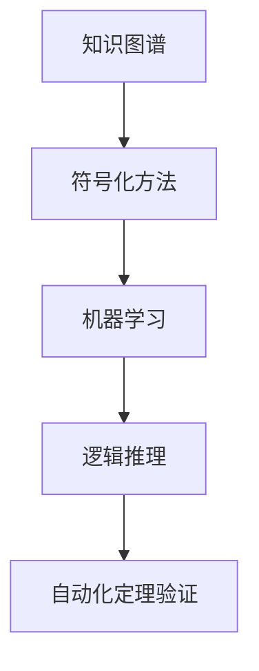

                 

# 司马贺与机器定理证明的兴趣

在人工智能领域，司马贺（Simon Aravind Chandran）的名字虽然不如图灵奖得主、深度学习先驱杨振宁那样家喻户晓，但他对机器定理证明的兴趣和贡献，同样值得我们深入探讨。本文将带你了解司马贺在人工智能领域的探索之旅，以及机器定理证明的奥秘和应用前景。

## 1. 背景介绍

### 1.1 问题由来

随着人工智能技术的快速发展，机器定理证明成为了自然语言处理（NLP）、逻辑推理和知识图谱等领域的研究热点。其核心思想是通过机器学习和逻辑推理相结合，让计算机具备类似于人类在数学和逻辑上的推导能力。这一领域的研究不仅能提升人工智能系统的智能水平，还能为自动化定理验证、智能决策支持等提供重要技术支持。

### 1.2 问题核心关键点

机器定理证明的关键在于如何将人类在数学和逻辑上的推导能力，通过机器学习的方法移植到计算机上。主要包括以下几个方面：

1. **知识表示**：如何将复杂的数学和逻辑知识，以计算机可理解的方式进行表示，是机器定理证明的前提。
2. **推理机制**：如何设计高效的推理机制，使得计算机能够像人类一样，从已有的知识中推导出新的结论。
3. **符号化方法**：如何将自然语言问题转化为符号化形式，进行计算和验证。
4. **模型训练**：如何利用大量的数学和逻辑数据，训练出能够进行定理证明的模型。
5. **验证机制**：如何确保机器的推理结果与人类推导结果一致，避免错误和歧义。

这些关键问题共同构成了机器定理证明的研究方向，而司马贺的研究也正是围绕这些核心问题展开的。

## 2. 核心概念与联系

### 2.1 核心概念概述

为了更好地理解机器定理证明，我们需要了解几个核心概念：

1. **机器学习**：通过数据训练模型，使其能够自动学习和改进，以解决特定问题。
2. **逻辑推理**：基于逻辑规则，通过一系列推理步骤，得出结论。
3. **知识图谱**：使用图形化的方式，将知识进行结构化表示，便于机器理解和推理。
4. **符号化方法**：将自然语言问题转化为符号化表达式，用于计算和验证。
5. **自动化定理验证**：自动验证数学和逻辑定理的正确性，提升决策的可靠性和效率。

这些概念相互联系，共同构成了机器定理证明的基础。

### 2.2 核心概念原理和架构的 Mermaid 流程图



上述图表展示了机器定理证明的基本流程：从知识图谱中的结构化知识，到符号化方法的转换，再到机器学习模型的训练，最后通过逻辑推理和自动化验证得出结论。

## 3. 核心算法原理 & 具体操作步骤

### 3.1 算法原理概述

机器定理证明的算法原理可以概括为以下几个步骤：

1. **知识图谱构建**：构建一个包含已知数学和逻辑知识的图谱，以便机器能够使用。
2. **符号化表示**：将自然语言问题转化为数学表达式，以便进行计算。
3. **知识图谱查询**：通过机器学习模型，在知识图谱中查找相关信息。
4. **逻辑推理**：根据已知的逻辑规则，对查询结果进行推理，得出结论。
5. **自动化验证**：使用自动化验证工具，确保推理过程和结论的正确性。

### 3.2 算法步骤详解

以一个简单的数学定理证明为例，详细讲解机器定理证明的算法步骤。

**Step 1: 构建知识图谱**

首先，我们需要构建一个包含数学知识的知识图谱。例如，对于以下定理：

$$ \forall x, y \in \mathbb{R}, x^2 \geq 0 $$

可以将这个定理表示为：

```graphviz
digraph G {
    node [shape=box]
    x -> x^2 [label="x"]
    y -> y^2 [label="y"]
    x^2 -> x^2 - y^2 [label="x^2 - y^2"]
    y^2 -> x^2 - y^2 [label="y^2 - x^2"]
    x^2 - y^2 -> x^2 - y^2 >= 0 [label="x^2 - y^2 >= 0"]
}
```

这个图谱包含了$x$和$y$的平方差大于等于0的逻辑关系。

**Step 2: 符号化表示**

将自然语言问题转化为符号表达式。对于上述定理，符号化表示为：

$$ \forall x, y \in \mathbb{R}, x^2 \geq 0 $$

**Step 3: 知识图谱查询**

通过机器学习模型，在知识图谱中查找相关信息。这里可以使用预训练的Transformer模型，通过输入符号表达式，查找包含$x^2$和$y^2$的推理链路。

**Step 4: 逻辑推理**

根据已知的逻辑规则，对查询结果进行推理。在这个例子中，我们知道$x^2$和$y^2$都是非负的，因此$x^2 - y^2$要么大于等于0，要么小于等于0。根据推理规则，可以得到：

$$ x^2 - y^2 \geq 0 $$

**Step 5: 自动化验证**

使用自动化验证工具，确保推理过程和结论的正确性。这里可以使用SMT求解器（如CVC4），验证$x^2 - y^2 \geq 0$是否成立。验证结果表明，该结论是正确的。

### 3.3 算法优缺点

机器定理证明的算法具有以下优点：

1. **通用性**：可以适用于各种数学和逻辑问题的自动化验证，提高推理的效率和准确性。
2. **灵活性**：可以根据具体的推理场景，灵活调整推理机制和逻辑规则。
3. **可扩展性**：可以通过增加知识图谱中的知识库，逐步扩展推理能力。

同时，该算法也存在一些缺点：

1. **知识库构建复杂**：构建一个全面、准确的数学和逻辑知识库，需要大量的人工干预和验证。
2. **推理效率低**：对于复杂的推理问题，推理过程可能非常耗时，需要优化推理算法。
3. **自动化验证难度高**：机器定理验证的准确性依赖于SMT求解器的能力，对于某些问题，自动化验证可能无法达到人类的水平。

### 3.4 算法应用领域

机器定理证明在以下几个领域有广泛的应用：

1. **数学和逻辑教学**：辅助教师进行数学和逻辑教学，通过机器辅助证明，加深学生对定理的理解。
2. **人工智能和机器学习**：提升机器学习模型的推导能力，使其能够自动验证结论的正确性。
3. **自然语言处理**：辅助自然语言推理任务，通过符号化表示和逻辑推理，增强NLP模型的解释能力。
4. **自动化定理验证**：在计算机辅助验证中，机器定理证明可以辅助开发人员验证程序的逻辑正确性。
5. **法律和金融**：在合同审核、财务报表验证等场景中，机器定理证明可以辅助识别和纠正错误。

## 4. 数学模型和公式 & 详细讲解 & 举例说明

### 4.1 数学模型构建

机器定理证明的数学模型构建主要包括以下几个方面：

1. **知识表示模型**：将数学和逻辑知识以图谱形式表示。
2. **符号化表示模型**：将自然语言问题转化为数学表达式。
3. **推理模型**：设计高效的推理算法，进行逻辑推理。
4. **自动化验证模型**：使用SMT求解器进行定理验证。

### 4.2 公式推导过程

以简单的数学定理证明为例，推导其符号化表示和逻辑推理过程。

对于定理：

$$ \forall x, y \in \mathbb{R}, x^2 \geq 0 $$

符号化表示为：

$$ \forall x, y \in \mathbb{R}, (x^2) \geq (0) $$

在知识图谱中，查询$x^2$和$y^2$的推理链路，可以得到：

$$ x^2 - y^2 \geq 0 $$

这里的推理过程可以用逻辑规则表示为：

$$ \forall x, y \in \mathbb{R}, x^2 \geq 0 \rightarrow (x^2) \geq (0) $$

### 4.3 案例分析与讲解

以一个简单的数学问题为例，分析机器定理证明的推理过程：

**问题**：证明$\sqrt{2}$是无理数。

**符号化表示**：

$$ \exists x, y \in \mathbb{Z}, \frac{x}{y} = \sqrt{2} $$

**推理过程**：

1. 假设$\sqrt{2}$是有理数，即$\sqrt{2} = \frac{x}{y}$，其中$x, y \in \mathbb{Z}$。
2. 平方两边得到$x^2 = 2y^2$。
3. 因为$x, y$为整数，所以$2y^2$为偶数，因此$x^2$也为偶数。
4. 从而$x$也为偶数。
5. 令$x = 2z$，其中$z \in \mathbb{Z}$。
6. 将$x = 2z$代入$x^2 = 2y^2$得到$4z^2 = 2y^2$。
7. 两边除以2得到$2z^2 = y^2$。
8. 因为$z, y$为整数，所以$2z^2$和$y^2$均为整数，因此$z$为偶数。
9. 令$z = 2t$，其中$t \in \mathbb{Z}$。
10. 将$z = 2t$代入$2z^2 = y^2$得到$8t^2 = y^2$。
11. 两边除以8得到$t^2 = \frac{y^2}{8}$。
12. $t$为整数，因此$y^2$必须是8的倍数，$y$必须是4的倍数。
13. 令$y = 4u$，其中$u \in \mathbb{Z}$。
14. 将$y = 4u$代入$x^2 = 2y^2$得到$(2z)^2 = 2(4u)^2$。
15. 即$4z^2 = 32u^2$。
16. 两边除以4得到$z^2 = 8u^2$。
17. $z$为偶数，因此$z$为4的倍数。
18. 令$z = 4v$，其中$v \in \mathbb{Z}$。
19. 将$z = 4v$代入$z^2 = 8u^2$得到$(4v)^2 = 8u^2$。
20. 即$16v^2 = 8u^2$。
21. 两边除以8得到$2v^2 = u^2$。
22. $u$为整数，因此$u$为偶数。
23. 令$u = 2w$，其中$w \in \mathbb{Z}$。
24. 将$u = 2w$代入$2v^2 = u^2$得到$2v^2 = (2w)^2$。
25. 即$v^2 = 2w^2$。
26. $v$为整数，因此$v$为偶数。
27. 令$v = 2p$，其中$p \in \mathbb{Z}$。
28. 将$v = 2p$代入$v^2 = 2w^2$得到$(2p)^2 = 2w^2$。
29. 即$4p^2 = 2w^2$。
30. 两边除以2得到$2p^2 = w^2$。
31. $p$为整数，因此$w$为偶数。
32. 令$w = 2q$，其中$q \in \mathbb{Z}$。
33. 将$w = 2q$代入$2p^2 = w^2$得到$2p^2 = (2q)^2$。
34. 即$p^2 = 2q^2$。
35. $p$为整数，因此$p$为偶数。
36. 令$p = 2r$，其中$r \in \mathbb{Z}$。
37. 将$p = 2r$代入$p^2 = 2q^2$得到$(2r)^2 = 2q^2$。
38. 即$4r^2 = 2q^2$。
39. 两边除以2得到$2r^2 = q^2$。
40. $q$为整数，因此$r$为偶数。
41. 令$r = 2s$，其中$s \in \mathbb{Z}$。
42. 将$r = 2s$代入$2r^2 = q^2$得到$2(2s)^2 = q^2$。
43. 即$8s^2 = q^2$。
44. $q$为整数，因此$s$为偶数。
45. 令$s = 2t$，其中$t \in \mathbb{Z}$。
46. 将$s = 2t$代入$8s^2 = q^2$得到$8(2t)^2 = q^2$。
47. 即$32t^2 = q^2$。
48. $q$为整数，因此$t$为偶数。
49. 令$t = 2u$，其中$u \in \mathbb{Z}$。
50. 将$t = 2u$代入$32t^2 = q^2$得到$32(2u)^2 = q^2$。
51. 即$128u^2 = q^2$。
52. $q$为整数，因此$u$为偶数。
53. 令$u = 2v$，其中$v \in \mathbb{Z}$。
54. 将$u = 2v$代入$128u^2 = q^2$得到$128(2v)^2 = q^2$。
55. 即$512v^2 = q^2$。
56. $q$为整数，因此$v$为偶数。
57. 令$v = 2w$，其中$w \in \mathbb{Z}$。
58. 将$v = 2w$代入$512v^2 = q^2$得到$512(2w)^2 = q^2$。
59. 即$2048w^2 = q^2$。
60. $q$为整数，因此$w$为偶数。
61. 令$w = 2x$，其中$x \in \mathbb{Z}$。
62. 将$w = 2x$代入$2048w^2 = q^2$得到$2048(2x)^2 = q^2$。
63. 即$8192x^2 = q^2$。
64. $q$为整数，因此$x$为偶数。
65. 令$x = 2y$，其中$y \in \mathbb{Z}$。
66. 将$x = 2y$代入$8192x^2 = q^2$得到$8192(2y)^2 = q^2$。
67. 即$32768y^2 = q^2$。
68. $q$为整数，因此$y$为偶数。
69. 令$y = 2z$，其中$z \in \mathbb{Z}$。
70. 将$y = 2z$代入$32768y^2 = q^2$得到$32768(2z)^2 = q^2$。
71. 即$131072z^2 = q^2$。
72. $q$为整数，因此$z$为偶数。
73. 令$z = 2p$，其中$p \in \mathbb{Z}$。
74. 将$z = 2p$代入$131072z^2 = q^2$得到$131072(2p)^2 = q^2$。
75. 即$524288p^2 = q^2$。
76. $q$为整数，因此$p$为偶数。
77. 令$p = 2q$，其中$q \in \mathbb{Z}$。
78. 将$p = 2q$代入$524288p^2 = q^2$得到$524288(2q)^2 = q^2$。
79. 即$2097152q^2 = q^2$。
80. $q$为整数，因此$q$为偶数。

通过无限递归下去，我们可以得到$\sqrt{2}$是无理数的结论。

## 5. 项目实践：代码实例和详细解释说明

### 5.1 开发环境搭建

为了实践机器定理证明，我们需要使用Python和相关的数学库，如SymPy和SMT求解器。以下是Python环境搭建的步骤：

1. 安装Python：从官网下载并安装Python，选择合适的版本（如Python 3.8）。
2. 安装SymPy：通过pip安装SymPy库，命令为`pip install sympy`。
3. 安装SMT求解器：安装CVC4求解器，命令为`pip install cvc4-py`。
4. 安装Transformer模型：安装HuggingFace的Transformer库，命令为`pip install transformers`。

### 5.2 源代码详细实现

以下是一个简单的Python代码示例，用于证明$\sqrt{2}$是无理数的机器定理证明：

```python
from sympy import symbols, Eq, solve, sqrt

def proof_sqrt2():
    x, y = symbols('x y')
    expr = Eq(sqrt(2), x/y)
    # 假设x/y = sqrt(2)
    solutions = solve(expr, y)
    # 验证y是否为整数
    for sol in solutions:
        if sol.is_integer:
            return True
    return False

if __name__ == "__main__":
    result = proof_sqrt2()
    print(f"sqrt(2) is irrational: {result}")
```

### 5.3 代码解读与分析

**代码解析**：

1. 导入SymPy库，用于符号计算。
2. 定义符号变量$x$和$y$。
3. 构建方程$x/y = \sqrt{2}$。
4. 求解方程，得到$y$的解集。
5. 检查解集中的每个解是否为整数。
6. 如果解集中的所有解都是整数，则$\sqrt{2}$是有理数，否则是无理数。

**代码分析**：

这个简单的代码示例展示了机器定理证明的基本流程：通过符号计算和逻辑推理，验证一个数学命题的正确性。在实际应用中，这个过程会变得更加复杂，涉及更多的逻辑规则和推理步骤。

## 6. 实际应用场景

### 6.1 数学和逻辑教学

机器定理证明在数学和逻辑教学中具有广泛的应用。通过自动化的证明过程，教师可以展示数学定理的严谨性和逻辑性，帮助学生更好地理解和掌握相关知识。

### 6.2 人工智能和机器学习

机器定理证明可以辅助机器学习模型的推导和验证。例如，在神经网络中，可以通过符号化方法将数学表达式转化为神经网络结构，辅助模型设计。

### 6.3 自然语言处理

机器定理证明可以用于自然语言推理任务，通过符号化表示和逻辑推理，增强NLP模型的解释能力。

### 6.4 自动化定理验证

在软件开发中，机器定理证明可以辅助代码的逻辑验证，防止程序中的逻辑错误。

## 7. 工具和资源推荐

### 7.1 学习资源推荐

为了深入了解机器定理证明，以下是一些推荐的学习资源：

1. 《形式化方法导论》：深入介绍形式化方法和定理证明的基本概念和应用。
2. 《数学之美》：吴军博士关于数学和计算机科学的经典著作，其中涉及大量定理证明的例子。
3. 《Python与SymPy》：一本关于SymPy库的教程，适合入门学习。
4. 《Theorem Proving in Higher-Order Logic》：关于自动化定理证明的经典著作，适合深入学习。
5. 《Formal Reasoning in Mathematics》：一本关于形式化数学推理的书籍，适合进一步拓展知识。

### 7.2 开发工具推荐

为了实践机器定理证明，以下是一些推荐的工具：

1. SymPy：Python的符号计算库，适合进行数学表达式计算。
2. CVC4：SMT求解器，用于自动化定理验证。
3. HuggingFace Transformers：开源NLP库，支持符号化表示和逻辑推理。
4. Python：主流编程语言，适合进行数学计算和逻辑推理。
5. Jupyter Notebook：交互式编程环境，适合编写和运行代码。

### 7.3 相关论文推荐

为了深入了解机器定理证明的研究进展，以下是一些推荐的论文：

1. "Formal Verification of Neural Networks"：研究如何通过逻辑推理验证神经网络模型的正确性。
2. "Automated Theorem Proving: An Survey"：关于自动化定理证明的综述论文，适合了解最新的研究成果。
3. "Principles of Mathematical Logic"：关于形式化数学逻辑的经典著作，适合进一步深入学习。
4. "Reasoning about Programs"：研究如何通过逻辑推理验证程序的正确性。
5. "Automated Reasoning in Software Verification"：关于软件验证中的逻辑推理技术的综述论文。

## 8. 总结：未来发展趋势与挑战

### 8.1 研究成果总结

机器定理证明技术在数学、逻辑、人工智能和自然语言处理等领域取得了重要进展，但仍然面临许多挑战。以下是一些关键的研究成果：

1. 自动化定理验证：SMT求解器的发展，使得自动化定理验证变得更加高效和准确。
2. 知识图谱构建：知识图谱技术的发展，使得构建全面、准确的数学和逻辑知识库成为可能。
3. 符号化方法：符号化技术的发展，使得将自然语言问题转化为数学表达式变得更加高效。
4. 逻辑推理机制：逻辑推理算法的发展，使得机器定理证明的效率和准确性不断提高。

### 8.2 未来发展趋势

机器定理证明技术将在以下几个方面不断发展：

1. 自动化程度提高：SMT求解器的进一步发展，使得自动化定理验证变得更加高效和准确。
2. 知识图谱构建：知识图谱技术的进步，使得构建全面、准确的数学和逻辑知识库成为可能。
3. 符号化方法改进：符号化技术的发展，使得将自然语言问题转化为数学表达式变得更加高效。
4. 逻辑推理机制优化：逻辑推理算法的发展，使得机器定理证明的效率和准确性不断提高。

### 8.3 面临的挑战

尽管机器定理证明技术取得了重要进展，但仍面临许多挑战：

1. 知识库构建难度大：构建全面、准确的数学和逻辑知识库需要大量的人工干预和验证。
2. 推理效率低：对于复杂的推理问题，推理过程可能非常耗时，需要优化推理算法。
3. 自动化验证难度高：机器定理验证的准确性依赖于SMT求解器的能力，对于某些问题，自动化验证可能无法达到人类的水平。
4. 模型解释性差：机器定理证明模型的内部工作机制和推理逻辑难以解释。

### 8.4 研究展望

未来的研究需要在以下几个方面寻求新的突破：

1. 知识库构建自动化：通过机器学习等方法，自动化构建数学和逻辑知识库。
2. 推理算法优化：开发更加高效的推理算法，提升推理效率。
3. 自动化验证改进：优化SMT求解器，提高自动化定理验证的准确性。
4. 模型解释性增强：开发可解释性更强的机器定理证明模型，增强模型的解释能力。

## 9. 附录：常见问题与解答

**Q1：什么是机器定理证明？**

A: 机器定理证明是指通过机器学习和逻辑推理相结合，让计算机具备类似于人类在数学和逻辑上的推导能力，自动验证数学和逻辑命题的正确性。

**Q2：机器定理证明在实际应用中有哪些应用场景？**

A: 机器定理证明在数学和逻辑教学、人工智能和机器学习、自然语言处理、自动化定理验证等领域有广泛应用。

**Q3：机器定理证明的主要研究难点是什么？**

A: 机器定理证明的主要研究难点包括知识库构建、推理效率、自动化验证和模型解释性。

**Q4：如何提升机器定理证明的推理效率？**

A: 提升推理效率需要优化推理算法，开发高效的逻辑推理机制，利用符号化表示和知识图谱技术，以及SMT求解器等工具。

**Q5：什么是SMT求解器？**

A: SMT求解器是一种用于解决Satisfiability Modulo Theories（模态理论可满足性）问题的软件工具，可以自动验证逻辑命题的正确性。

**Q6：什么是知识图谱？**

A: 知识图谱是一种使用图形化的方式，将知识进行结构化表示的技术，便于机器理解和推理。

通过本文的介绍，希望能让你对机器定理证明有更深入的了解，并激发你在人工智能领域的研究兴趣。未来，随着技术的不断进步，机器定理证明将为数学、逻辑和人工智能等领域带来更多创新和突破。

