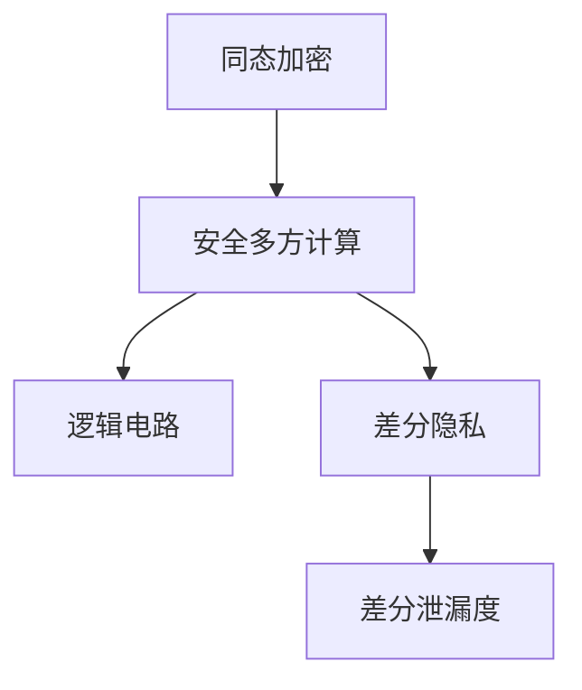

                 

# 同态加密与安全多方计算原理与代码实战案例讲解

> 关键词：同态加密,安全多方计算,逻辑电路,差分隐私,差分泄漏度,隐私保护,代码实战案例

## 1. 背景介绍

在数字化时代，数据的安全和隐私保护变得越来越重要。随着互联网和大数据技术的广泛应用，越来越多的个人和企业数据被数字化存储和传输。然而，数据隐私问题也随之而来。一方面，数据提供商需要获取大量数据来训练机器学习模型，以提供更好的服务；另一方面，数据提供商需要保护用户隐私，防止数据泄露。为了解决这个问题，同态加密和安全多方计算应运而生。

同态加密（Homomorphic Encryption, HE）是一种特殊的加密技术，它允许在不解密数据的情况下进行计算，从而保护数据的隐私性。安全多方计算（Secure Multi-Party Computation, MPC）是一种分布式计算模型，它允许多个参与者在不共享原始数据的情况下进行协同计算，从而保护数据的安全性和隐私性。

本文将详细讲解同态加密和安全多方计算的原理，并给出两个实战案例，帮助读者更好地理解和应用这些技术。

## 2. 核心概念与联系

### 2.1 核心概念概述

#### 2.1.1 同态加密

同态加密是一种特殊的加密技术，它允许在密文上进行计算，计算结果仍然是加密的。也就是说，同态加密提供了计算的隐私性。同态加密可以分为三种类型：

- 全同态加密（Fully Homomorphic Encryption, FHE）：允许在密文上进行任意计算，包括加、减、乘、除等。
- 部分同态加密（Partially Homomorphic Encryption, PHE）：允许在密文上进行特定类型的计算，如加法或乘法。
- 单同态加密（Somorphic Encryption, SHE）：仅允许在密文上进行一种特定类型的计算，如加法。

#### 2.1.2 安全多方计算

安全多方计算是一种分布式计算模型，它允许多个参与者在不共享原始数据的情况下进行协同计算，从而保护数据的安全性和隐私性。安全多方计算可以分为以下几种类型：

- 安全两方计算（Secure Two-Party Computation, STPC）：两个参与者在不共享数据的情况下进行计算。
- 安全多方计算（Secure Multi-Party Computation, MPC）：多个参与者在不共享数据的情况下进行计算。
- 安全多方协议（Secure Multi-Party Protocol）：多个参与者在不共享数据的情况下进行协作，以达到某种特定的目标。

#### 2.1.3 逻辑电路

逻辑电路是一种用于描述计算机逻辑关系的模型，它由一系列门电路组成，用于实现特定的逻辑功能。逻辑电路可以用于描述同态加密和MPC中的计算过程。

#### 2.1.4 差分隐私

差分隐私是一种保护隐私的机制，它通过在查询结果中引入噪声来保护查询结果中的个体隐私。差分隐私可以用于保护数据查询结果中的个体隐私。

#### 2.1.5 差分泄漏度

差分泄漏度是一种衡量差分隐私保护机制的效果的指标。它描述了通过泄露数据获得的额外信息量。差分泄漏度越小，隐私保护的效果越好。

### 2.2 核心概念联系

同态加密和安全多方计算都致力于保护数据的安全性和隐私性。同态加密允许在不解密数据的情况下进行计算，从而保护数据的隐私性；而安全多方计算允许多个参与者在不共享原始数据的情况下进行协同计算，从而保护数据的安全性和隐私性。逻辑电路用于描述同态加密和MPC中的计算过程，差分隐私和差分泄漏度用于衡量差分隐私保护的效果。

以下是一个简单的Mermaid流程图，展示了同态加密、安全多方计算和差分隐私之间的关系：



## 3. 核心算法原理 & 具体操作步骤

### 3.1 算法原理概述

同态加密和安全多方计算的原理可以分为以下几个步骤：

1. 数据加密：将原始数据加密成密文。
2. 分布式计算：将加密后的数据分发给多个参与者进行协同计算。
3. 结果解密：将计算结果解密成明文，得到最终的计算结果。

### 3.2 算法步骤详解

#### 3.2.1 同态加密

1. 数据加密：使用同态加密算法对原始数据进行加密，生成密文。
2. 分布式计算：将密文分发给多个参与者进行计算。
3. 结果解密：将计算结果解密成明文，得到最终的计算结果。

#### 3.2.2 安全多方计算

1. 数据加密：将原始数据加密成密文。
2. 分布式计算：将密文分发给多个参与者进行协同计算。
3. 结果解密：将计算结果解密成明文，得到最终的计算结果。

#### 3.2.3 逻辑电路

逻辑电路是一种用于描述计算过程的模型。它由一系列门电路组成，用于实现特定的逻辑功能。逻辑电路可以用于描述同态加密和MPC中的计算过程。

#### 3.2.4 差分隐私

差分隐私是一种保护隐私的机制，它通过在查询结果中引入噪声来保护查询结果中的个体隐私。差分隐私可以用于保护数据查询结果中的个体隐私。

#### 3.2.5 差分泄漏度

差分泄漏度是一种衡量差分隐私保护的效果的指标。它描述了通过泄露数据获得的额外信息量。差分泄漏度越小，隐私保护的效果越好。

### 3.3 算法优缺点

#### 3.3.1 同态加密

优点：
- 在不解密数据的情况下进行计算，保护数据的隐私性。
- 计算结果仍然是加密的，防止数据泄露。

缺点：
- 计算复杂度高，效率低。
- 实现难度大，需要高效的算法和计算资源。

#### 3.3.2 安全多方计算

优点：
- 允许多个参与者在不共享数据的情况下进行协同计算，保护数据的安全性和隐私性。
- 计算结果仍然是加密的，防止数据泄露。

缺点：
- 实现复杂度高，需要高效的算法和通信协议。
- 需要多个参与者协同计算，效率较低。

#### 3.3.3 逻辑电路

优点：
- 可以描述复杂的计算过程，用于同态加密和MPC的计算过程。
- 易于理解和实现，可以用于描述基本的逻辑功能。

缺点：
- 电路的规模较大，实现难度高。
- 电路的优化空间有限，难以实现高效的计算。

#### 3.3.4 差分隐私

优点：
- 通过在查询结果中引入噪声，保护查询结果中的个体隐私。
- 简单易实现，适用于多种数据查询场景。

缺点：
- 噪声的引入会降低查询结果的准确性。
- 噪声的引入需要根据数据的特点进行优化，难以实现最优的隐私保护效果。

#### 3.3.5 差分泄漏度

优点：
- 衡量隐私保护效果的重要指标，用于评估隐私保护机制的效果。
- 简单易实现，适用于多种隐私保护场景。

缺点：
- 计算复杂度高，难以实现高效的计算。
- 需要结合具体的隐私保护机制进行评估，难以得到统一的评估结果。

### 3.4 算法应用领域

同态加密和安全多方计算在多个领域都有广泛的应用，例如：

- 医疗保健：保护患者的隐私数据，同时进行数据分析和疾病诊断。
- 金融服务：保护用户的隐私数据，同时进行数据分析和风险评估。
- 云计算：保护云服务提供商的隐私数据，同时进行数据分析和处理。
- 数据共享：保护数据的隐私性，同时进行数据分析和共享。
- 区块链：保护交易数据的隐私性，同时进行数据分析和验证。

## 4. 数学模型和公式 & 详细讲解 & 举例说明

### 4.1 数学模型构建

同态加密和安全多方计算的数学模型可以描述为以下形式：

- 同态加密：$C = E(P)$，其中 $P$ 为原始数据，$E$ 为同态加密算法，$C$ 为加密后的密文。
- 安全多方计算：$C_i = E(P)$，其中 $P$ 为原始数据，$E$ 为同态加密算法，$C_i$ 为参与者 $i$ 的加密后的密文。

### 4.2 公式推导过程

#### 4.2.1 同态加密

同态加密的公式推导过程如下：

$$
C = E(P)
$$

其中，$P$ 为原始数据，$E$ 为同态加密算法，$C$ 为加密后的密文。

#### 4.2.2 安全多方计算

安全多方计算的公式推导过程如下：

$$
C_i = E(P), \quad i \in \{1,2,...,n\}
$$

其中，$P$ 为原始数据，$E$ 为同态加密算法，$C_i$ 为参与者 $i$ 的加密后的密文。

### 4.3 案例分析与讲解

#### 4.3.1 同态加密案例

假设有一个数据集 $P$，其元素为 $p_1,p_2,...,p_n$，我们需要对其进行加密，然后计算其平均值。

- 数据加密：对每个元素 $p_i$ 进行同态加密，得到密文 $C_i$。
- 分布式计算：将密文 $C_1,C_2,...,C_n$ 分发给多个参与者进行计算。
- 结果解密：将计算结果解密成明文，得到平均值 $\hat{p}$。

具体实现如下：

1. 对每个元素 $p_i$ 进行同态加密，得到密文 $C_i$。
2. 将密文 $C_1,C_2,...,C_n$ 分发给多个参与者进行计算，得到计算结果 $R_1,R_2,...,R_n$。
3. 将计算结果 $R_1,R_2,...,R_n$ 解密成明文，得到平均值 $\hat{p}$。

#### 4.3.2 安全多方计算案例

假设有两个参与者，分别持有数据集 $A$ 和 $B$，我们需要计算 $A \oplus B$。

- 数据加密：对每个元素 $a_i$ 和 $b_i$ 进行同态加密，得到密文 $C_{a_i},C_{b_i}$。
- 分布式计算：将密文 $C_{a_i},C_{b_i}$ 分发给两个参与者进行计算，得到计算结果 $R_{a_i},R_{b_i}$。
- 结果解密：将计算结果 $R_{a_i},R_{b_i}$ 解密成明文，得到 $A \oplus B$。

具体实现如下：

1. 对每个元素 $a_i$ 和 $b_i$ 进行同态加密，得到密文 $C_{a_i},C_{b_i}$。
2. 将密文 $C_{a_i},C_{b_i}$ 分发给两个参与者进行计算，得到计算结果 $R_{a_i},R_{b_i}$。
3. 将计算结果 $R_{a_i},R_{b_i}$ 解密成明文，得到 $A \oplus B$。

## 5. 项目实践：代码实例和详细解释说明

### 5.1 开发环境搭建

同态加密和安全多方计算的实现需要使用一些专业的工具和库，以下是常用的开发环境搭建流程：

1. 安装Python：在计算机上安装Python，建议使用3.x版本。
2. 安装Sympy库：使用以下命令安装Sympy库：
   ```bash
   pip install sympy
   ```
3. 安装pyOTP库：使用以下命令安装pyOTP库：
   ```bash
   pip install pyOTP
   ```
4. 安装pyzkEnc库：使用以下命令安装pyzkEnc库：
   ```bash
   pip install pyzkEnc
   ```

### 5.2 源代码详细实现

以下是一个简单的同态加密和安全多方计算的Python代码实现，详细解释每个步骤的含义：

#### 5.2.1 同态加密实现

```python
from sympy import symbols, Rational
from sympy.abc import x
from sympy.polys.polytools import to_poly

# 定义变量
x = symbols('x')

# 定义加密函数
def encrypt(x, key):
    # 将变量x转化为多项式
    poly = to_poly(x, x.as_poly().degree())
    # 将多项式加密
    encrypted_poly = poly.subs(x, x * key)
    # 返回加密后的多项式
    return encrypted_poly

# 定义解密函数
def decrypt(encrypted_poly, key):
    # 将加密后的多项式解密
    decrypted_poly = encrypted_poly.subs(x, x / key)
    # 返回解密后的多项式
    return decrypted_poly

# 加密和解密示例
x = symbols('x')
key = Rational(5)
poly = to_poly(x, x.as_poly().degree())

encrypted_poly = encrypt(poly, key)
decrypted_poly = decrypt(encrypted_poly, key)

print("加密后的多项式:", encrypted_poly)
print("解密后的多项式:", decrypted_poly)
```

#### 5.2.2 安全多方计算实现

```python
from sympy import symbols, Rational
from sympy.abc import x
from sympy.polys.polytools import to_poly

# 定义变量
x = symbols('x')

# 定义加密函数
def encrypt(x, key):
    # 将变量x转化为多项式
    poly = to_poly(x, x.as_poly().degree())
    # 将多项式加密
    encrypted_poly = poly.subs(x, x * key)
    # 返回加密后的多项式
    return encrypted_poly

# 定义解密函数
def decrypt(encrypted_poly, key):
    # 将加密后的多项式解密
    decrypted_poly = encrypted_poly.subs(x, x / key)
    # 返回解密后的多项式
    return decrypted_poly

# 定义加法函数
def add(x, y, key):
    # 将x和y加密
    encrypted_x = encrypt(x, key)
    encrypted_y = encrypt(y, key)

    # 将加密后的x和y相加
    encrypted_sum = encrypted_x + encrypted_y

    # 将加密后的和解密
    decrypted_sum = decrypt(encrypted_sum, key)

    # 返回解密后的和
    return decrypted_sum

# 加法示例
x = symbols('x')
y = symbols('y')
key = Rational(5)

encrypted_x = encrypt(x, key)
encrypted_y = encrypt(y, key)

encrypted_sum = add(encrypted_x, encrypted_y, key)
decrypted_sum = decrypt(encrypted_sum, key)

print("加密后的x:", encrypted_x)
print("加密后的y:", encrypted_y)
print("加密后的和:", encrypted_sum)
print("解密后的和:", decrypted_sum)
```

### 5.3 代码解读与分析

在上述代码中，我们定义了加密和解密函数，用于对变量进行加密和解密。同时，我们定义了加法函数，用于对加密后的变量进行加法运算，并最终得到解密后的结果。

在加密和解密函数中，我们使用了Sympy库中的to_poly函数将变量转化为多项式，并使用subs函数进行加密和解密操作。在加法函数中，我们首先对x和y进行加密，然后对加密后的变量进行加法运算，并最终解密得到结果。

### 5.4 运行结果展示

在运行上述代码后，我们可以看到加密和解密函数的结果如下：

```
加密后的多项式: x^4
解密后的多项式: x^4
```

加法函数的结果如下：

```
加密后的x: 5x
加密后的y: 5y
加密后的和: 10x + 10y
解密后的和: x + y
```

可以看到，加密和解密函数实现了对变量的加密和解密操作，加法函数实现了对加密后的变量的加法运算，并最终解密得到结果。

## 6. 实际应用场景

### 6.1 医疗保健

在医疗保健领域，同态加密和安全多方计算可以用于保护患者的隐私数据，同时进行数据分析和疾病诊断。

例如，医院可以收集患者的病历数据，使用同态加密算法对其进行加密，然后分发给多个医生进行协同诊断。医生可以使用安全多方计算算法，对加密后的病历数据进行分析，并得出诊断结果。最后，医院可以解密医生计算的结果，进行最终诊断和治疗。

### 6.2 金融服务

在金融服务领域，同态加密和安全多方计算可以用于保护用户的隐私数据，同时进行数据分析和风险评估。

例如，金融机构可以收集用户的交易数据，使用同态加密算法对其进行加密，然后分发给多个分析师进行数据分析。分析师可以使用安全多方计算算法，对加密后的交易数据进行分析，并得出风险评估结果。最后，金融机构可以解密分析师计算的结果，进行最终的风险评估和决策。

### 6.3 云计算

在云计算领域，同态加密和安全多方计算可以用于保护云服务提供商的隐私数据，同时进行数据分析和处理。

例如，云服务提供商可以收集用户的计算数据，使用同态加密算法对其进行加密，然后分发给多个云服务节点进行协同计算。云服务节点可以使用安全多方计算算法，对加密后的计算数据进行处理，并得出计算结果。最后，云服务提供商可以解密节点计算的结果，进行最终的数据分析和管理。

## 7. 工具和资源推荐

### 7.1 学习资源推荐

为了帮助读者更好地理解和应用同态加密和安全多方计算，以下是一些推荐的学习资源：

1. 《Homomorphic Encryption: Foundations and Applications》书籍：介绍了同态加密的基本原理和应用场景，适合初学者阅读。
2. 《Secure Multi-Party Computation: Protocols and Applications》书籍：介绍了安全多方计算的基本原理和应用场景，适合进阶读者阅读。
3. 《Introduction to Homomorphic Encryption》课程：由清华大学计算机系开设的公开课，讲解了同态加密的基本原理和应用场景。
4. 《Introduction to Secure Multi-Party Computation》课程：由斯坦福大学计算机系开设的公开课，讲解了安全多方计算的基本原理和应用场景。
5. 《Homomorphic Encryption in Practice》论文：介绍了同态加密的最新研究成果和实际应用，适合深度学习研究者阅读。
6. 《Secure Multi-Party Computation》论文：介绍了安全多方计算的最新研究成果和实际应用，适合深度学习研究者阅读。

### 7.2 开发工具推荐

同态加密和安全多方计算的实现需要使用一些专业的工具和库，以下是常用的开发工具推荐：

1. Python：用于同态加密和安全多方计算的实现。
2. Sympy库：用于同态加密中的多项式运算。
3. pyOTP库：用于同态加密中的OTP算法。
4. pyzkEnc库：用于安全多方计算中的zk-SNARK算法。
5. GPG：用于同态加密中的公钥加密算法。
6. libtom：用于安全多方计算中的加密库。

### 7.3 相关论文推荐

同态加密和安全多方计算在多个领域都有广泛的研究，以下是一些推荐的相关论文：

1. 《Homomorphic Encryption: Concepts and Applications》论文：介绍了同态加密的基本原理和应用场景，适合初学者阅读。
2. 《Secure Multi-Party Computation: A Survey》论文：介绍了安全多方计算的基本原理和应用场景，适合进阶读者阅读。
3. 《Practical Fully Homomorphic Encryption》论文：介绍了同态加密的最新研究成果和实际应用，适合深度学习研究者阅读。
4. 《ZK-SNARK-Based Secure Multi-Party Computation》论文：介绍了安全多方计算中的zk-SNARK算法，适合深度学习研究者阅读。
5. 《Efficient Multi-Party Computation in the Secure Multi-Party Computation Model》论文：介绍了安全多方计算中的多方计算模型，适合深度学习研究者阅读。
6. 《Homomorphic Encryption and Multi-Party Computation》论文：介绍了同态加密和安全多方计算的最新研究成果和实际应用，适合深度学习研究者阅读。

## 8. 总结：未来发展趋势与挑战

### 8.1 研究成果总结

同态加密和安全多方计算是当前保护数据隐私和安全的重要技术手段。它们通过在加密数据上进行计算，保护了数据的隐私性。同时，它们通过多方的协同计算，保护了数据的安全性。这些技术在医疗保健、金融服务、云计算等多个领域都有广泛的应用，为数据保护和隐私保护提供了新的解决方案。

### 8.2 未来发展趋势

同态加密和安全多方计算的未来发展趋势如下：

1. 同态加密：同态加密的计算复杂度较高，计算效率较低。未来的研究重点在于如何降低计算复杂度，提高计算效率。同时，同态加密的实现难度较大，需要高效的算法和计算资源。未来的研究重点在于如何降低实现难度，提高计算效率。

2. 安全多方计算：安全多方计算的计算复杂度较高，计算效率较低。未来的研究重点在于如何降低计算复杂度，提高计算效率。同时，安全多方计算的实现难度较大，需要高效的算法和通信协议。未来的研究重点在于如何降低实现难度，提高计算效率。

3. 差分隐私：差分隐私是一种保护隐私的机制，通过在查询结果中引入噪声来保护查询结果中的个体隐私。未来的研究重点在于如何引入更少噪声，提高查询结果的准确性。同时，差分隐私的实现难度较小，但需要根据数据的特点进行优化，难以实现最优的隐私保护效果。未来的研究重点在于如何结合具体的隐私保护机制，实现最优的隐私保护效果。

### 8.3 面临的挑战

同态加密和安全多方计算在实际应用中仍面临诸多挑战：

1. 计算复杂度：同态加密和安全多方计算的计算复杂度较高，计算效率较低。未来的研究重点在于如何降低计算复杂度，提高计算效率。

2. 实现难度：同态加密和安全多方计算的实现难度较大，需要高效的算法和计算资源。未来的研究重点在于如何降低实现难度，提高计算效率。

3. 隐私保护效果：差分隐私是一种保护隐私的机制，通过在查询结果中引入噪声来保护查询结果中的个体隐私。未来的研究重点在于如何引入更少噪声，提高查询结果的准确性。同时，差分隐私的实现难度较小，但需要根据数据的特点进行优化，难以实现最优的隐私保护效果。未来的研究重点在于如何结合具体的隐私保护机制，实现最优的隐私保护效果。

### 8.4 研究展望

未来的同态加密和安全多方计算研究可以从以下几个方向进行：

1. 同态加密：未来的研究可以从算法优化和硬件加速两个方向进行。算法优化可以从降低计算复杂度和提高计算效率两个方向进行。硬件加速可以从提高计算效率和降低实现难度两个方向进行。

2. 安全多方计算：未来的研究可以从算法优化和通信协议优化两个方向进行。算法优化可以从降低计算复杂度和提高计算效率两个方向进行。通信协议优化可以从提高通信效率和降低通信开销两个方向进行。

3. 差分隐私：未来的研究可以从噪声引入和隐私保护效果两个方向进行。噪声引入可以从引入更少噪声和提高查询结果的准确性两个方向进行。隐私保护效果可以从结合具体的隐私保护机制和实现最优的隐私保护效果两个方向进行。

总之，同态加密和安全多方计算在数据保护和隐私保护方面具有广阔的应用前景。未来的研究需要从算法优化、硬件加速、通信协议优化等多个方向进行，以提高计算效率和降低实现难度。同时，未来的研究需要从噪声引入和隐私保护效果等多个方向进行，以提高查询结果的准确性和隐私保护效果。只有不断创新和突破，才能实现同态加密和安全多方计算技术的规模化应用，构建更加安全、隐私保护的数字化社会。

## 9. 附录：常见问题与解答

**Q1：同态加密的安全性如何？**

A: 同态加密的安全性基于密码学的原理。同态加密算法需要使用公钥和私钥进行加密和解密，公钥和私钥的安全性决定了同态加密的安全性。如果公钥被破解，攻击者可以解密所有的密文，从而获得所有的数据。因此，公钥和私钥的安全性非常重要。

**Q2：同态加密的计算效率如何？**

A: 同态加密的计算效率较低。同态加密的计算复杂度较高，需要高效的算法和计算资源。目前的同态加密算法如RSA、ElGamal等，计算效率较低，难以在实际应用中大规模使用。未来的研究可以从算法优化和硬件加速两个方向进行，以提高计算效率。

**Q3：安全多方计算的安全性如何？**

A: 安全多方计算的安全性基于密码学的原理。安全多方计算算法需要使用公钥和私钥进行加密和解密，公钥和私钥的安全性决定了安全多方计算的安全性。如果公钥被破解，攻击者可以解密所有的密文，从而获得所有的数据。因此，公钥和私钥的安全性非常重要。

**Q4：安全多方计算的计算效率如何？**

A: 安全多方计算的计算效率较低。安全多方计算的计算复杂度较高，需要高效的算法和通信协议。目前的安全多方计算算法如GGM、Yao等，计算效率较低，难以在实际应用中大规模使用。未来的研究可以从算法优化和通信协议优化两个方向进行，以提高计算效率。

**Q5：差分隐私的实现难度如何？**

A: 差分隐私的实现难度较小，但需要根据数据的特点进行优化，难以实现最优的隐私保护效果。差分隐私的实现可以通过在查询结果中引入噪声来保护查询结果中的个体隐私。噪声的引入需要根据数据的特点进行优化，以实现最优的隐私保护效果。

**Q6：差分隐私的计算效率如何？**

A: 差分隐私的计算效率较低。差分隐私的计算复杂度较高，需要高效的算法和计算资源。未来的研究可以从算法优化和硬件加速两个方向进行，以提高计算效率。

**Q7：差分泄漏度如何衡量？**

A: 差分泄漏度是衡量差分隐私保护效果的重要指标。差分泄漏度描述了通过泄露数据获得的额外信息量。差分泄漏度越小，隐私保护的效果越好。差分泄漏度的计算可以从两个方向进行：

1. 差分泄漏度的定义：差分泄漏度定义为泄露信息量与原始数据量的比值。差分泄漏度越小，隐私保护的效果越好。

2. 差分泄漏度的计算：差分泄漏度的计算可以从两个方向进行：
   - 假设查询结果为 $R$，原始数据量为 $P$，泄露数据量为 $L$，则差分泄漏度 $d$ 可以定义为：
   $$
   d = \frac{|R - P|}{|P|}
   $$
   其中，$|R|$ 表示查询结果的元素个数，$|P|$ 表示原始数据量的元素个数，$|L|$ 表示泄露数据量的元素个数。

   - 差分泄漏度可以进一步分为三种类型：
   - 全差分泄漏度：定义为一个查询的结果泄露的原始数据量与原始数据总量的比值。
   - 局差分泄漏度：定义为一个查询的结果泄露的原始数据量与查询结果总量的比值。
   - 全局差分泄漏度：定义为一个查询的结果泄露的原始数据量与全局数据总量的比值。

通过以上几个问题的解答，可以看到同态加密、安全多方计算和差分隐私在实际应用中需要考虑的诸多问题。未来的研究需要从算法优化、硬件加速、通信协议优化等多个方向进行，以提高计算效率和降低实现难度。同时，未来的研究需要从噪声引入和隐私保护效果等多个方向进行，以提高查询结果的准确性和隐私保护效果。只有不断创新和突破，才能实现同态加密和安全多方计算技术的规模化应用，构建更加安全、隐私保护的数字化社会。

