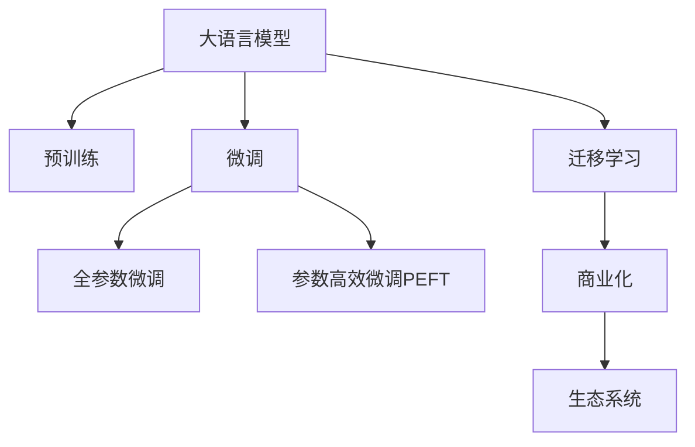

                 

## 1. 背景介绍

### 1.1 问题由来

近年来，大语言模型（Large Language Models, LLMs）的发展迅猛，其广泛的应用如机器翻译、文本摘要、智能客服、情感分析等引起了各行业的极大关注。这些模型通过在大规模无标签文本数据上进行预训练，掌握了丰富的语言知识，表现出了卓越的生成和理解能力。

然而，尽管大语言模型具有强大的潜力，但将其转化为商业化应用并不容易。由于大模型往往需要巨额计算资源和标注数据，因此在初创企业中，如何构建可商业化的大模型，并从中获利，成为了一个重要的课题。

### 1.2 问题核心关键点

大模型创业的生存之路，核心在于如何将模型转化为可商业化的产品或服务。这涉及多个环节，包括数据收集、模型训练、应用部署、商业化策略等。以下是创业生存之路上需要重点关注的几个方面：

1. **数据收集**：大模型依赖大量的高质量数据进行预训练，如何获取和处理这些数据是一个重要挑战。
2. **模型训练**：在有限的资源条件下，如何高效地训练大模型，保证其性能和泛化能力。
3. **应用部署**：如何将训练好的大模型部署到生产环境，并确保其稳定性和效率。
4. **商业化策略**：如何将大模型转化为可变现的商业化产品，如API服务、SaaS平台等。

## 2. 核心概念与联系

### 2.1 核心概念概述

为更好地理解大模型创业的生存之路，我们将介绍几个核心概念：

- **大语言模型（LLMs）**：以自回归模型（如GPT）或自编码模型（如BERT）为代表的大规模预训练语言模型。通过在大规模无标签文本数据上进行预训练，学习通用语言知识，具备强大的语言理解和生成能力。

- **预训练（Pre-training）**：指在大规模无标签文本数据上，通过自监督学习任务训练通用语言模型的过程。常见的预训练任务包括语言建模、掩码语言模型等。

- **微调（Fine-tuning）**：指在预训练模型的基础上，使用下游任务的少量标注数据，通过有监督学习优化模型在该任务上的性能。

- **迁移学习（Transfer Learning）**：指将一个领域学习到的知识，迁移应用到另一个不同但相关的领域的学习范式。大模型的预训练-微调过程即是一种典型的迁移学习方式。

- **商业化（Commercialization）**：将技术转化为可销售的产品或服务的过程，包括市场调研、产品设计、销售渠道、用户反馈等环节。

- **生态系统（Ecosystem）**：围绕核心产品构建的商业生态，包括合作伙伴、客户、供应商、开发者等，共同促进产品的成长和创新。

这些核心概念之间的逻辑关系可以通过以下Mermaid流程图来展示：



这个流程图展示了从预训练到商业化的整个流程，以及生态系统在其中扮演的角色。

## 3. 核心算法原理 & 具体操作步骤

### 3.1 算法原理概述

大模型创业的生存之路，其核心算法原理主要体现在两个方面：预训练-微调框架的构建和商业化策略的设计。

- **预训练-微调框架**：通过在大规模无标签文本数据上进行预训练，获得通用语言知识，然后使用下游任务的少量标注数据进行微调，提升模型在特定任务上的性能。
- **商业化策略**：通过市场调研、产品设计、渠道建设等手段，将大模型转化为可变现的商业产品或服务。

### 3.2 算法步骤详解

大模型创业的生存之路，通常包括以下几个关键步骤：

**Step 1: 数据收集与处理**

- 收集与任务相关的文本数据。数据应具有代表性，覆盖多样性和长尾数据。
- 清洗数据，去除噪声和错误，保证数据质量。
- 分批次、按比例划分为训练集、验证集和测试集。

**Step 2: 模型训练与微调**

- 选择合适的预训练模型，如BERT、GPT等。
- 设置训练参数，包括学习率、批大小、迭代轮数等。
- 添加任务适配层，如线性分类器、解码器等。
- 使用下游任务的数据集进行微调，最小化损失函数。

**Step 3: 模型部署与监控**

- 将微调后的模型部署到生产环境。
- 设置监控指标，如模型响应时间、内存占用等。
- 实时收集用户反馈，优化模型性能。

**Step 4: 商业化策略制定**

- 进行市场调研，了解目标用户的需求和痛点。
- 设计符合用户需求的产品和服务。
- 选择合适的销售渠道，如线上平台、合作伙伴等。
- 建立客户反馈机制，不断改进产品和服务。

### 3.3 算法优缺点

大模型创业的生存之路，具有以下优点：

- **高效性**：通过预训练和微调，模型可以在少量标注数据下快速适应新任务，节省时间和资源。
- **通用性**：大模型预训练的通用知识可以应用于多个下游任务，提升模型的适用性和泛化能力。
- **可扩展性**：模型可以在已有基础上进行扩展和优化，持续提升性能。

同时，也存在一些缺点：

- **高成本**：预训练和微调需要大量的计算资源和标注数据，初期投入成本较高。
- **高复杂性**：构建大模型的生态系统，涉及多个环节，需要跨学科的知识和技能。
- **依赖数据**：模型性能依赖于数据的质量和多样性，数据获取和处理是关键。

## 4. 数学模型和公式 & 详细讲解  
### 4.1 数学模型构建

大语言模型预训练和微调的过程，本质上是通过数据驱动的学习任务进行模型优化。其数学模型构建如下：

- **预训练模型**：以自回归模型（如GPT）或自编码模型（如BERT）为基础，在大规模无标签文本数据上进行预训练。
- **微调模型**：在预训练模型的基础上，使用下游任务的少量标注数据进行有监督学习，最小化损失函数。

**公式推导过程**

假设预训练模型为 $M_{\theta}$，其中 $\theta$ 为预训练得到的模型参数。给定下游任务 $T$ 的标注数据集 $D=\{(x_i, y_i)\}_{i=1}^N$，微调的目标是找到新的模型参数 $\hat{\theta}$，使得：

$$
\hat{\theta}=\mathop{\arg\min}_{\theta} \mathcal{L}(M_{\theta},D)
$$

其中 $\mathcal{L}$ 为针对任务 $T$ 设计的损失函数，用于衡量模型预测输出与真实标签之间的差异。常见的损失函数包括交叉熵损失、均方误差损失等。

在实践中，我们通常使用基于梯度的优化算法（如SGD、Adam等）来近似求解上述最优化问题。设 $\eta$ 为学习率，$\lambda$ 为正则化系数，则参数的更新公式为：

$$
\theta \leftarrow \theta - \eta \nabla_{\theta}\mathcal{L}(\theta) - \eta\lambda\theta
$$

其中 $\nabla_{\theta}\mathcal{L}(\theta)$ 为损失函数对参数 $\theta$ 的梯度，可通过反向传播算法高效计算。

### 4.3 案例分析与讲解

以BERT模型为例，其在新闻分类任务上的微调过程如下：

1. **数据预处理**：收集新闻文本和其分类标签，划分为训练集、验证集和测试集。
2. **模型构建**：使用BERT预训练模型作为初始化参数，添加线性分类器和交叉熵损失函数。
3. **微调训练**：在训练集上使用AdamW优化器进行梯度下降，最小化损失函数。
4. **模型评估**：在验证集和测试集上评估模型性能，使用分类指标（如准确率、F1值等）评估模型效果。

## 5. 项目实践：代码实例和详细解释说明

### 5.1 开发环境搭建

在进行大模型创业的实践前，我们需要准备好开发环境。以下是使用Python进行PyTorch开发的环境配置流程：

1. 安装Anaconda：从官网下载并安装Anaconda，用于创建独立的Python环境。

2. 创建并激活虚拟环境：
```bash
conda create -n pytorch-env python=3.8 
conda activate pytorch-env
```

3. 安装PyTorch：根据CUDA版本，从官网获取对应的安装命令。例如：
```bash
conda install pytorch torchvision torchaudio cudatoolkit=11.1 -c pytorch -c conda-forge
```

4. 安装Transformers库：
```bash
pip install transformers
```

5. 安装各类工具包：
```bash
pip install numpy pandas scikit-learn matplotlib tqdm jupyter notebook ipython
```

完成上述步骤后，即可在`pytorch-env`环境中开始大模型创业的实践。

### 5.2 源代码详细实现

下面我们以新闻分类任务为例，给出使用Transformers库对BERT模型进行微调的PyTorch代码实现。

首先，定义数据处理函数：

```python
from transformers import BertTokenizer
from torch.utils.data import Dataset
import torch

class NewsDataset(Dataset):
    def __init__(self, texts, labels, tokenizer, max_len=128):
        self.texts = texts
        self.labels = labels
        self.tokenizer = tokenizer
        self.max_len = max_len
        
    def __len__(self):
        return len(self.texts)
    
    def __getitem__(self, item):
        text = self.texts[item]
        label = self.labels[item]
        
        encoding = self.tokenizer(text, return_tensors='pt', max_length=self.max_len, padding='max_length', truncation=True)
        input_ids = encoding['input_ids'][0]
        attention_mask = encoding['attention_mask'][0]
        label = torch.tensor(label, dtype=torch.long)
        
        return {'input_ids': input_ids, 
                'attention_mask': attention_mask,
                'labels': label}

# 标签与id的映射
label2id = {'politics': 0, 'economy': 1, 'sports': 2, 'entertainment': 3, 'technology': 4}
id2label = {v: k for k, v in label2id.items()}

# 创建dataset
tokenizer = BertTokenizer.from_pretrained('bert-base-uncased')

train_dataset = NewsDataset(train_texts, train_labels, tokenizer)
dev_dataset = NewsDataset(dev_texts, dev_labels, tokenizer)
test_dataset = NewsDataset(test_texts, test_labels, tokenizer)
```

然后，定义模型和优化器：

```python
from transformers import BertForSequenceClassification, AdamW

model = BertForSequenceClassification.from_pretrained('bert-base-uncased', num_labels=len(label2id))

optimizer = AdamW(model.parameters(), lr=2e-5)
```

接着，定义训练和评估函数：

```python
from torch.utils.data import DataLoader
from tqdm import tqdm
from sklearn.metrics import classification_report

device = torch.device('cuda') if torch.cuda.is_available() else torch.device('cpu')
model.to(device)

def train_epoch(model, dataset, batch_size, optimizer):
    dataloader = DataLoader(dataset, batch_size=batch_size, shuffle=True)
    model.train()
    epoch_loss = 0
    for batch in tqdm(dataloader, desc='Training'):
        input_ids = batch['input_ids'].to(device)
        attention_mask = batch['attention_mask'].to(device)
        labels = batch['labels'].to(device)
        model.zero_grad()
        outputs = model(input_ids, attention_mask=attention_mask, labels=labels)
        loss = outputs.loss
        epoch_loss += loss.item()
        loss.backward()
        optimizer.step()
    return epoch_loss / len(dataloader)

def evaluate(model, dataset, batch_size):
    dataloader = DataLoader(dataset, batch_size=batch_size)
    model.eval()
    preds, labels = [], []
    with torch.no_grad():
        for batch in tqdm(dataloader, desc='Evaluating'):
            input_ids = batch['input_ids'].to(device)
            attention_mask = batch['attention_mask'].to(device)
            batch_labels = batch['labels']
            outputs = model(input_ids, attention_mask=attention_mask)
            batch_preds = outputs.logits.argmax(dim=1).to('cpu').tolist()
            batch_labels = batch_labels.to('cpu').tolist()
            for pred, label in zip(batch_preds, batch_labels):
                preds.append(pred)
                labels.append(label)
                
    print(classification_report(labels, preds))
```

最后，启动训练流程并在测试集上评估：

```python
epochs = 5
batch_size = 16

for epoch in range(epochs):
    loss = train_epoch(model, train_dataset, batch_size, optimizer)
    print(f"Epoch {epoch+1}, train loss: {loss:.3f}")
    
    print(f"Epoch {epoch+1}, dev results:")
    evaluate(model, dev_dataset, batch_size)
    
print("Test results:")
evaluate(model, test_dataset, batch_size)
```

以上就是使用PyTorch对BERT进行新闻分类任务微调的完整代码实现。可以看到，得益于Transformers库的强大封装，我们可以用相对简洁的代码完成BERT模型的加载和微调。

### 5.3 代码解读与分析

让我们再详细解读一下关键代码的实现细节：

**NewsDataset类**：
- `__init__`方法：初始化文本、标签、分词器等关键组件。
- `__len__`方法：返回数据集的样本数量。
- `__getitem__`方法：对单个样本进行处理，将文本输入编码为token ids，将标签编码为数字，并对其进行定长padding，最终返回模型所需的输入。

**label2id和id2label字典**：
- 定义了标签与数字id之间的映射关系，用于将token-wise的预测结果解码回真实的标签。

**训练和评估函数**：
- 使用PyTorch的DataLoader对数据集进行批次化加载，供模型训练和推理使用。
- 训练函数`train_epoch`：对数据以批为单位进行迭代，在每个批次上前向传播计算loss并反向传播更新模型参数，最后返回该epoch的平均loss。
- 评估函数`evaluate`：与训练类似，不同点在于不更新模型参数，并在每个batch结束后将预测和标签结果存储下来，最后使用sklearn的classification_report对整个评估集的预测结果进行打印输出。

**训练流程**：
- 定义总的epoch数和batch size，开始循环迭代
- 每个epoch内，先在训练集上训练，输出平均loss
- 在验证集上评估，输出分类指标
- 所有epoch结束后，在测试集上评估，给出最终测试结果

可以看到，PyTorch配合Transformers库使得BERT微调的代码实现变得简洁高效。开发者可以将更多精力放在数据处理、模型改进等高层逻辑上，而不必过多关注底层的实现细节。

当然，工业级的系统实现还需考虑更多因素，如模型的保存和部署、超参数的自动搜索、更灵活的任务适配层等。但核心的微调范式基本与此类似。

## 6. 实际应用场景

### 6.1 智能客服系统

基于大语言模型微调的对话技术，可以广泛应用于智能客服系统的构建。传统客服往往需要配备大量人力，高峰期响应缓慢，且一致性和专业性难以保证。而使用微调后的对话模型，可以7x24小时不间断服务，快速响应客户咨询，用自然流畅的语言解答各类常见问题。

在技术实现上，可以收集企业内部的历史客服对话记录，将问题和最佳答复构建成监督数据，在此基础上对预训练对话模型进行微调。微调后的对话模型能够自动理解用户意图，匹配最合适的答案模板进行回复。对于客户提出的新问题，还可以接入检索系统实时搜索相关内容，动态组织生成回答。如此构建的智能客服系统，能大幅提升客户咨询体验和问题解决效率。

### 6.2 金融舆情监测

金融机构需要实时监测市场舆论动向，以便及时应对负面信息传播，规避金融风险。传统的人工监测方式成本高、效率低，难以应对网络时代海量信息爆发的挑战。基于大语言模型微调的文本分类和情感分析技术，为金融舆情监测提供了新的解决方案。

具体而言，可以收集金融领域相关的新闻、报道、评论等文本数据，并对其进行主题标注和情感标注。在此基础上对预训练语言模型进行微调，使其能够自动判断文本属于何种主题，情感倾向是正面、中性还是负面。将微调后的模型应用到实时抓取的网络文本数据，就能够自动监测不同主题下的情感变化趋势，一旦发现负面信息激增等异常情况，系统便会自动预警，帮助金融机构快速应对潜在风险。

### 6.3 个性化推荐系统

当前的推荐系统往往只依赖用户的历史行为数据进行物品推荐，无法深入理解用户的真实兴趣偏好。基于大语言模型微调技术，个性化推荐系统可以更好地挖掘用户行为背后的语义信息，从而提供更精准、多样的推荐内容。

在实践中，可以收集用户浏览、点击、评论、分享等行为数据，提取和用户交互的物品标题、描述、标签等文本内容。将文本内容作为模型输入，用户的后续行为（如是否点击、购买等）作为监督信号，在此基础上微调预训练语言模型。微调后的模型能够从文本内容中准确把握用户的兴趣点。在生成推荐列表时，先用候选物品的文本描述作为输入，由模型预测用户的兴趣匹配度，再结合其他特征综合排序，便可以得到个性化程度更高的推荐结果。

### 6.4 未来应用展望

随着大语言模型和微调方法的不断发展，基于微调范式将在更多领域得到应用，为传统行业带来变革性影响。

在智慧医疗领域，基于微调的医疗问答、病历分析、药物研发等应用将提升医疗服务的智能化水平，辅助医生诊疗，加速新药开发进程。

在智能教育领域，微调技术可应用于作业批改、学情分析、知识推荐等方面，因材施教，促进教育公平，提高教学质量。

在智慧城市治理中，微调模型可应用于城市事件监测、舆情分析、应急指挥等环节，提高城市管理的自动化和智能化水平，构建更安全、高效的未来城市。

此外，在企业生产、社会治理、文娱传媒等众多领域，基于大模型微调的人工智能应用也将不断涌现，为NLP技术带来了全新的突破。相信随着预训练语言模型和微调方法的持续演进，大语言模型微调必将在构建人机协同的智能时代中扮演越来越重要的角色。

## 7. 工具和资源推荐
### 7.1 学习资源推荐

为了帮助开发者系统掌握大语言模型微调的理论基础和实践技巧，这里推荐一些优质的学习资源：

1. 《Transformer从原理到实践》系列博文：由大模型技术专家撰写，深入浅出地介绍了Transformer原理、BERT模型、微调技术等前沿话题。

2. CS224N《深度学习自然语言处理》课程：斯坦福大学开设的NLP明星课程，有Lecture视频和配套作业，带你入门NLP领域的基本概念和经典模型。

3. 《Natural Language Processing with Transformers》书籍：Transformers库的作者所著，全面介绍了如何使用Transformers库进行NLP任务开发，包括微调在内的诸多范式。

4. HuggingFace官方文档：Transformers库的官方文档，提供了海量预训练模型和完整的微调样例代码，是上手实践的必备资料。

5. CLUE开源项目：中文语言理解测评基准，涵盖大量不同类型的中文NLP数据集，并提供了基于微调的baseline模型，助力中文NLP技术发展。

通过对这些资源的学习实践，相信你一定能够快速掌握大语言模型微调的精髓，并用于解决实际的NLP问题。
###  7.2 开发工具推荐

高效的开发离不开优秀的工具支持。以下是几款用于大语言模型微调开发的常用工具：

1. PyTorch：基于Python的开源深度学习框架，灵活动态的计算图，适合快速迭代研究。大部分预训练语言模型都有PyTorch版本的实现。

2. TensorFlow：由Google主导开发的开源深度学习框架，生产部署方便，适合大规模工程应用。同样有丰富的预训练语言模型资源。

3. Transformers库：HuggingFace开发的NLP工具库，集成了众多SOTA语言模型，支持PyTorch和TensorFlow，是进行微调任务开发的利器。

4. Weights & Biases：模型训练的实验跟踪工具，可以记录和可视化模型训练过程中的各项指标，方便对比和调优。与主流深度学习框架无缝集成。

5. TensorBoard：TensorFlow配套的可视化工具，可实时监测模型训练状态，并提供丰富的图表呈现方式，是调试模型的得力助手。

6. Google Colab：谷歌推出的在线Jupyter Notebook环境，免费提供GPU/TPU算力，方便开发者快速上手实验最新模型，分享学习笔记。

合理利用这些工具，可以显著提升大语言模型微调任务的开发效率，加快创新迭代的步伐。

### 7.3 相关论文推荐

大语言模型和微调技术的发展源于学界的持续研究。以下是几篇奠基性的相关论文，推荐阅读：

1. Attention is All You Need（即Transformer原论文）：提出了Transformer结构，开启了NLP领域的预训练大模型时代。

2. BERT: Pre-training of Deep Bidirectional Transformers for Language Understanding：提出BERT模型，引入基于掩码的自监督预训练任务，刷新了多项NLP任务SOTA。

3. Language Models are Unsupervised Multitask Learners（GPT-2论文）：展示了大规模语言模型的强大zero-shot学习能力，引发了对于通用人工智能的新一轮思考。

4. Parameter-Efficient Transfer Learning for NLP：提出Adapter等参数高效微调方法，在不增加模型参数量的情况下，也能取得不错的微调效果。

5. Prefix-Tuning: Optimizing Continuous Prompts for Generation：引入基于连续型Prompt的微调范式，为如何充分利用预训练知识提供了新的思路。

6. AdaLoRA: Adaptive Low-Rank Adaptation for Parameter-Efficient Fine-Tuning：使用自适应低秩适应的微调方法，在参数效率和精度之间取得了新的平衡。

这些论文代表了大语言模型微调技术的发展脉络。通过学习这些前沿成果，可以帮助研究者把握学科前进方向，激发更多的创新灵感。

## 8. 总结：未来发展趋势与挑战

### 8.1 总结

本文对大模型创业的生存之路进行了全面系统的介绍。首先阐述了大模型创业的背景和意义，明确了创业生存之路的关键步骤和要点。其次，从原理到实践，详细讲解了大模型微调的全过程，给出了微调任务开发的完整代码实例。同时，本文还探讨了微调模型在多个行业领域的应用前景，展示了微调范式的巨大潜力。最后，精选了微调技术的各类学习资源，力求为读者提供全方位的技术指引。

通过本文的系统梳理，可以看到，大模型创业的生存之路需要跨越数据收集、模型训练、应用部署、商业化策略等多个环节，既要兼顾技术的前沿，又要考虑实际的应用和商业模式。正是这些环节的有机结合，才能构建一个成功的商业生态，推动大模型技术的落地应用。

### 8.2 未来发展趋势

展望未来，大模型创业的生存之路将呈现以下几个发展趋势：

1. **技术融合与创新**：大模型将与更多前沿技术进行融合，如因果推理、知识图谱、增强学习等，拓展应用的深度和广度。
2. **模型标准化**：随着大模型的标准化和模块化，生态系统的协作将更加紧密，资源共享将更加高效。
3. **商业化创新**：基于大模型微调的产品和服务将更加多样化和定制化，满足不同行业的需求。
4. **用户参与**：用户反馈和参与将成为模型优化和迭代的重要动力，推动技术的不断进步。
5. **法律法规**：伴随大模型应用的普及，数据隐私、伦理道德等法律法规也将逐步完善。

以上趋势将推动大模型技术的快速发展，为更多行业带来变革性的影响。

### 8.3 面临的挑战

尽管大模型创业具备广阔的发展前景，但在迈向成功的过程中，仍面临诸多挑战：

1. **资源限制**：大模型训练和微调需要大量的计算资源和标注数据，初期投入成本较高。
2. **市场竞争**：大模型领域竞争激烈，需要持续创新以保持市场竞争力。
3. **数据隐私**：在收集和处理用户数据时，需要严格遵守数据隐私法律法规。
4. **算法透明**：大模型通常被视为"黑盒"，需要提高模型的可解释性和透明度。
5. **应用场景**：不同行业的定制需求复杂多样，需要灵活的模型适配和优化。

这些挑战需要创业团队不断创新和改进，才能在大模型创业的道路上稳步前行。

### 8.4 研究展望

面对大模型创业的诸多挑战，未来的研究需要在以下几个方面寻求新的突破：

1. **参数高效微调**：开发更多参数高效的微调方法，如Prefix-Tuning、LoRA等，以降低计算成本。
2. **模型优化**：采用更高效的数据表示和模型结构，如量化加速、稀疏化存储等，提高模型性能和效率。
3. **可解释性**：引入因果分析和博弈论工具，增强模型输出解释的因果性和逻辑性。
4. **生态系统建设**：构建更加开放和协作的生态系统，促进模型和技术的共享和交流。
5. **法律法规**：研究如何平衡创新与法律法规之间的关系，确保技术应用的合规性。

这些研究方向的探索，必将引领大模型创业技术迈向更高的台阶，为构建安全、可靠、可解释、可控的智能系统铺平道路。面向未来，大模型微调技术还需要与其他人工智能技术进行更深入的融合，共同推动自然语言理解和智能交互系统的进步。只有勇于创新、敢于突破，才能不断拓展大模型的边界，让智能技术更好地造福人类社会。

## 9. 附录：常见问题与解答

**Q1：大模型微调需要哪些资源？**

A: 大模型微调需要以下几个关键资源：

1. **计算资源**：训练和微调大模型需要大量的计算资源，一般需要GPU或TPU等高性能设备。
2. **标注数据**：微调过程需要大量标注数据，数据质量直接影响模型性能。
3. **工具和库**：如PyTorch、TensorFlow、Transformers等深度学习框架，以及数据处理工具和库。

**Q2：如何评估大模型的性能？**

A: 大模型的性能评估通常从以下几个方面进行：

1. **精度**：模型在测试集上的准确率、召回率、F1值等指标。
2. **鲁棒性**：模型在不同数据分布下的表现稳定性。
3. **实时性**：模型推理速度和响应时间。
4. **可解释性**：模型的决策过程和推理逻辑是否透明、可解释。
5. **可扩展性**：模型在新增数据或任务上的泛化能力。

**Q3：大模型微调如何应用到实际业务中？**

A: 大模型微调的应用主要分为以下几个步骤：

1. **需求分析**：了解业务需求，确定微调任务和目标。
2. **数据收集**：收集和处理相关的文本数据，构建训练集和测试集。
3. **模型构建**：选择合适的预训练模型，添加任务适配层。
4. **模型训练**：在训练集上训练微调模型，调整超参数，优化模型性能。
5. **模型评估**：在验证集和测试集上评估模型性能，确保模型泛化能力。
6. **模型部署**：将微调模型部署到生产环境，实时处理业务数据。
7. **持续优化**：根据用户反馈和业务需求，持续优化模型，提升用户体验。

**Q4：大模型微调需要多长时间？**

A: 大模型微调的时间取决于多个因素，如数据规模、模型复杂度、硬件资源等。通常，微调一个中等规模的模型，从数据收集到模型部署可能需要数周到数月时间。

**Q5：大模型微调如何处理数据不平衡问题？**

A: 数据不平衡是微调过程中常见的问题。常用的解决方法包括：

1. **数据增强**：通过数据增强技术，如回译、近义替换等，扩充少数类数据。
2. **重采样**：对少数类数据进行过采样，或者对多数类数据进行欠采样，平衡数据分布。
3. **类权重**：在损失函数中设置不同类的权重，提高少数类的训练效果。

**Q6：大模型微调有哪些实际案例？**

A: 大模型微调在多个领域都有成功应用，以下是一些实际案例：

1. **智能客服**：如阿里云的智能客服机器人，基于大模型微调，提供7x24小时客户咨询服务。
2. **金融舆情监测**：如中国平安的金融舆情监测系统，基于大模型微调，实时分析金融市场动态。
3. **个性化推荐**：如京东的推荐系统，基于大模型微调，实现商品推荐、个性化广告等。
4. **医疗问答**：如百度健康医疗问答系统，基于大模型微调，解答用户健康咨询。

---

作者：禅与计算机程序设计艺术 / Zen and the Art of Computer Programming

