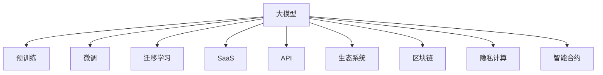

                 

# 商业模式：大模型创业的战略蓝图

## 1. 背景介绍

近年来，随着深度学习技术的飞速发展，大模型在各行各业的应用逐渐得到广泛关注和认可。其背后的核心是算法的进步，例如Transformer、BERT、GPT-3等模型的出现，带来了预训练大模型的新时代。然而，成功应用大模型并实现商业化运作的案例仍然较为稀少。本文将从商业模式的视角，探讨如何实现大模型创业的战略蓝图。

## 2. 核心概念与联系

### 2.1 核心概念概述

**大模型**：指经过大规模无标签数据预训练的模型，通常拥有大量参数，能够学习丰富的语言知识和领域知识。

**预训练**：指在大量无标签数据上训练模型，学习通用的语言表示，通常在这一步模型获得较强的泛化能力。

**微调**：指在预训练模型基础上，针对特定任务，使用少量有标签数据进行有监督学习，使得模型更加适应该任务。

**迁移学习**：指将一个领域的知识迁移到另一个相关领域，以提升模型在新任务上的表现。

**商业模型**：指通过向用户提供某种产品或服务，获取收入的商业模式。

**SaaS（软件即服务）**：指通过向用户提供软件即服务，按订阅收费的商业模式。

**API（应用程序接口）**：指定义了应用程序间交互规则，用于服务的调用的接口。

**生态系统**：指通过一个产品或服务的内部组件和服务，以及外部合作伙伴和用户共同构建的生态系统。

**区块链**：指通过去中心化的方式，实现数据的安全、透明和不可篡改。

**隐私计算**：指在确保数据隐私的前提下，对数据进行计算和分析的技术。

**智能合约**：指自动执行、控制或文档化协议条款的计算机程序，使用区块链技术实现。

以上概念通过以下Mermaid流程图联系起来：



## 3. 核心算法原理 & 具体操作步骤

### 3.1 算法原理概述

大模型的商业模式主要围绕着预训练、微调和迁移学习展开。大模型在无标签数据上预训练，获得广泛的语言知识，然后针对特定任务进行微调，通过迁移学习将知识迁移到相关领域，实现商业化运作。

假设一个大模型 $M$，在无标签数据集 $D$ 上进行预训练，学习到通用的语言表示。然后针对特定任务 $T$，在任务数据集 $T$ 上进行微调，得到微调后的模型 $M_T$。最后，将 $M_T$ 部署到各种商业场景中，如SaaS服务、API接口等，通过收费获取收益。

### 3.2 算法步骤详解

**Step 1: 数据预训练**
- 收集大规模无标签数据集 $D$，如维基百科、新闻、社交媒体等。
- 使用Transformer等模型，在数据集 $D$ 上进行预训练，学习通用的语言知识。

**Step 2: 任务微调**
- 收集少量有标签数据集 $T$，如问答、分类、生成等。
- 使用微调技术，在预训练模型 $M$ 的基础上，对 $T$ 进行微调，得到微调后的模型 $M_T$。

**Step 3: 模型部署**
- 将 $M_T$ 部署到商业平台，如SaaS服务、API接口等，供用户使用。
- 提供API接口，支持用户按需调用模型进行计算和推理。
- 构建用户生态系统，吸引开发者和用户，提升使用体验和粘性。

**Step 4: 收费模式**
- 提供基于使用量的收费模式，如按计算量、按使用时长、按API调用次数等。
- 提供灵活的定价策略，如免费试用、分期支付、合约优惠等，降低用户的使用门槛。

**Step 5: 数据分析和优化**
- 收集用户使用数据，分析模型效果和使用情况。
- 根据分析结果，优化模型算法和参数，提升性能和用户体验。
- 持续迭代和更新模型，保持竞争力。

### 3.3 算法优缺点

**优点**：
- 预训练和微调使得模型能够更好地适应特定任务，提升性能。
- 多领域迁移学习使得模型具有广泛的应用前景，可以用于各种商业场景。
- SaaS和API模式使得模型可以按需提供服务，降低运营成本。

**缺点**：
- 需要大量数据进行预训练和微调，数据获取和处理成本较高。
- 预训练和微调过程复杂，技术门槛较高，需要专业人才支持。
- 模型复杂，推理计算量大，需要高性能计算资源。
- 模型性能依赖于用户数据，用户数据质量影响模型效果。

### 3.4 算法应用领域

大模型和商业模式结合，可以应用于多种场景，如：

- **自然语言处理**：如智能客服、智能翻译、智能写作等。
- **医疗健康**：如医学问答、病历分析、药物研发等。
- **金融科技**：如风险评估、客户服务、智能投顾等。
- **智能制造**：如产品推荐、质量检测、供应链优化等。
- **智能交通**：如交通预测、智能驾驶、智能监控等。
- **教育培训**：如个性化推荐、智能答疑、智能测评等。

## 4. 数学模型和公式 & 详细讲解 & 举例说明

### 4.1 数学模型构建

假设预训练大模型为 $M$，输入为 $x$，输出为 $y$，则其可以表示为：

$$
y = M(x)
$$

其中，$M$ 为预训练后的模型，$x$ 为输入数据，$y$ 为输出结果。

假设微调任务为 $T$，微调后的模型为 $M_T$，则其可以表示为：

$$
y_T = M_T(x)
$$

其中，$M_T$ 为微调后的模型，$x$ 为输入数据，$y_T$ 为输出结果。

### 4.2 公式推导过程

**预训练过程**：
- 无标签数据集 $D$ 通过模型 $M$ 进行训练，损失函数为 $L_D$：
$$
L_D = \frac{1}{N}\sum_{i=1}^N \ell(M(x_i), y_i)
$$

其中，$\ell$ 为损失函数，$x_i$ 为输入数据，$y_i$ 为标签。

**微调过程**：
- 有标签数据集 $T$ 通过微调后的模型 $M_T$ 进行训练，损失函数为 $L_T$：
$$
L_T = \frac{1}{N}\sum_{i=1}^N \ell(M_T(x_i), y_i)
$$

其中，$\ell$ 为损失函数，$x_i$ 为输入数据，$y_i$ 为标签。

**模型部署过程**：
- 通过API接口，用户调用微调后的模型 $M_T$，获得输出结果 $y_T$。

### 4.3 案例分析与讲解

假设某公司开发了一个智能客服系统，基于大模型进行预训练和微调，部署到云端。其商业模式如下：

1. **预训练**：公司收集了大量无标签客户对话数据，使用BERT模型进行预训练，学习通用的语言表示。
2. **微调**：公司收集了少量标注的客户服务对话数据，对预训练模型进行微调，学习特定场景下的语言知识。
3. **部署**：公司将微调后的模型部署到云端，提供API接口，用户可以通过API调用系统进行智能客服。
4. **收费**：公司采用按使用量收费的模式，用户按API调用次数付费，享受智能客服服务。
5. **优化**：公司收集用户反馈和对话记录，分析模型效果，优化模型算法和参数，提升服务质量。

## 5. 项目实践：代码实例和详细解释说明

### 5.1 开发环境搭建

**Step 1: 安装PyTorch**
```bash
pip install torch torchvision torchaudio
```

**Step 2: 安装Transformer库**
```bash
pip install transformers
```

**Step 3: 搭建SaaS平台**
- 选择合适的云平台，如AWS、阿里云、腾讯云等。
- 搭建服务器，配置高性能计算资源。
- 部署应用服务，包括数据库、API接口等。

### 5.2 源代码详细实现

**Step 1: 数据预训练**
```python
from transformers import BertTokenizer, BertForMaskedLM
import torch

tokenizer = BertTokenizer.from_pretrained('bert-base-uncased')
model = BertForMaskedLM.from_pretrained('bert-base-uncased')

# 数据预处理
inputs = tokenizer(text, return_tensors='pt', padding=True)
labels = torch.randint(0, 2, (inputs.shape[0], inputs.shape[1]))

# 模型训练
model.train()
optimizer = torch.optim.Adam(model.parameters(), lr=2e-5)
for epoch in range(epochs):
    model.zero_grad()
    outputs = model(inputs.input_ids, labels=labels)
    loss = outputs.loss
    loss.backward()
    optimizer.step()
```

**Step 2: 任务微调**
```python
from transformers import BertTokenizer, BertForSequenceClassification
import torch

tokenizer = BertTokenizer.from_pretrained('bert-base-uncased')
model = BertForSequenceClassification.from_pretrained('bert-base-uncased', num_labels=2)

# 数据预处理
inputs = tokenizer(text, return_tensors='pt', padding=True)
labels = torch.tensor([1])

# 模型训练
model.train()
optimizer = torch.optim.Adam(model.parameters(), lr=2e-5)
for epoch in range(epochs):
    model.zero_grad()
    outputs = model(inputs.input_ids, labels=labels)
    loss = outputs.loss
    loss.backward()
    optimizer.step()
```

**Step 3: 模型部署**
```python
from transformers import BertForSequenceClassification
import torch
import flask

app = flask.Flask(__name__)

@app.route('/predict', methods=['POST'])
def predict():
    data = request.json['text']
    inputs = tokenizer(data, return_tensors='pt', padding=True)
    outputs = model(**inputs)
    result = outputs.logits.argmax().item()
    return {'score': result}

if __name__ == '__main__':
    app.run(host='0.0.0.0', port=5000)
```

### 5.3 代码解读与分析

**数据预处理**：
- 使用BertTokenizer将文本数据转换为模型可接受的输入形式。
- 对输入数据进行padding，使其固定长度。

**模型训练**：
- 使用Adam优化器，学习率设置为2e-5。
- 在每个epoch中，对模型进行前向传播和反向传播，更新模型参数。

**模型部署**：
- 使用Flask构建API接口，提供预测服务。
- 用户通过API接口调用模型，获取预测结果。

## 6. 实际应用场景

### 6.1 智能客服系统
某公司开发了基于BERT模型的智能客服系统，通过预训练和微调技术，可以回答各种常见问题，如订单查询、产品介绍等。公司将其部署到云端，采用按使用量收费的模式，提供智能客服服务。系统通过API接口，用户可以按需调用，享受高质量的客户服务。

### 6.2 医疗健康应用
某医院使用BERT模型进行医疗问答系统的开发。通过预训练和微调技术，系统可以回答患者的常见医疗问题，如疾病诊断、药物咨询等。系统部署在云端，按使用量收费，提供医疗咨询服务。医生可以通过系统查询答案，患者可以自助获取医疗知识，提升医疗服务质量。

### 6.3 金融科技服务
某金融公司开发了基于BERT模型的智能投顾系统。通过预训练和微调技术，系统可以分析用户财务状况，提供个性化的投资建议。系统部署在云端，按使用量收费，提供智能投顾服务。用户可以按需调用系统，获取精准的投资建议，提升投资回报率。

## 7. 工具和资源推荐

### 7.1 学习资源推荐

**Step 1: 选择合适的学习资源**
- 《深度学习入门：基于Python的理论与实现》：深入介绍深度学习的基础理论和Python实现。
- Coursera上的《Deep Learning Specialization》：由Andrew Ng教授主讲的深度学习课程。
- CS224N《自然语言处理与深度学习》：斯坦福大学开设的NLP明星课程。
- HuggingFace官方文档：Transformer库的官方文档，提供详细的模型介绍和API接口。

### 7.2 开发工具推荐

**Step 2: 选择合适的开发工具**
- PyTorch：基于Python的深度学习框架，灵活动态的计算图，适合快速迭代研究。
- TensorFlow：由Google主导开发的深度学习框架，生产部署方便，适合大规模工程应用。
- Flask：轻量级的Python Web框架，易于搭建API接口。
- Docker：基于容器技术的部署工具，方便构建和部署模型。
- Kubernetes：容器编排工具，提供自动化部署和管理。

### 7.3 相关论文推荐

**Step 3: 阅读相关论文**
- Attention is All You Need：Transformer结构，开启预训练大模型时代。
- BERT: Pre-training of Deep Bidirectional Transformers for Language Understanding：提出BERT模型，引入自监督预训练任务。
- Large Language Model Fine-Tuning: Reconciling Scalability and Performance：探讨参数高效微调方法。
- Towards AI-Generated Content: The Good, the Bad, and the Uncertain：讨论大模型生成的内容，引发对AI伦理的思考。

## 8. 总结：未来发展趋势与挑战

### 8.1 研究成果总结

大模型创业的商业模式，通过预训练、微调和迁移学习，结合SaaS、API等技术手段，实现了大模型在实际应用中的商业化运作。大模型在医疗、金融、客服等多个领域的成功应用，展示了其强大的应用前景和商业潜力。

### 8.2 未来发展趋势

**趋势一**：预训练技术的发展将进一步推动大模型创业。未来的预训练技术将更加高效、通用，能够学习更多的领域知识和常识，提升微调后的模型效果。

**趋势二**：微调方法将更加灵活、高效。未来的微调方法将更加注重参数高效、计算高效，提升模型推理速度和资源利用率。

**趋势三**：生态系统将更加丰富。未来的生态系统将涵盖更多领域、更多应用场景，形成更加完善的技术生态。

**趋势四**：区块链和隐私计算将提供更多保障。未来的区块链和隐私计算技术将确保数据安全和隐私保护，提升模型可信度。

**趋势五**：智能合约将提供更多自动化和透明性。未来的智能合约将确保模型调用的自动化和透明性，提升用户体验和信任度。

### 8.3 面临的挑战

**挑战一**：数据获取和处理成本较高。未来的数据获取和处理成本仍然较高，需要更多的算法和技术手段降低成本。

**挑战二**：技术门槛较高。未来的大模型创业需要更多专业人才和技术支持，如何降低技术门槛，普及大模型应用，需要进一步探索。

**挑战三**：模型性能依赖于用户数据。未来的模型性能仍然依赖于用户数据，如何提升模型泛化性和抗干扰能力，需要更多研究。

**挑战四**：计算资源成本较高。未来的大模型创业仍然需要高性能计算资源，如何降低计算成本，提高资源利用率，需要进一步优化。

**挑战五**：隐私和安全问题突出。未来的大模型创业需要更多隐私和安全技术手段，保障数据和模型的安全。

### 8.4 研究展望

**展望一**：探索无监督和半监督微调方法，降低数据获取和处理成本。

**展望二**：开发更多参数高效和计算高效的微调方法，提升推理速度和资源利用率。

**展望三**：引入更多先验知识，提升模型泛化性和抗干扰能力。

**展望四**：结合因果分析和博弈论工具，增强模型的决策解释性和稳定性。

**展望五**：采用区块链和隐私计算技术，确保数据安全和隐私保护。

**展望六**：开发智能合约，确保模型调用的自动化和透明性。

## 9. 附录：常见问题与解答

**Q1: 大模型创业有哪些主要步骤？**

A: 主要步骤包括数据预训练、任务微调、模型部署、收费模式和数据分析优化。

**Q2: 如何降低数据获取和处理成本？**

A: 可以探索无监督和半监督微调方法，利用已有知识和算法进行推理，降低数据需求。

**Q3: 如何选择合适的大模型和算法？**

A: 需要根据具体应用场景和技术需求，选择合适的预训练模型和微调算法，进行适配和优化。

**Q4: 如何提升模型的泛化性和抗干扰能力？**

A: 可以通过引入更多先验知识、因果分析和博弈论工具，增强模型的泛化性和鲁棒性。

**Q5: 如何保障数据安全和隐私保护？**

A: 可以采用区块链和隐私计算技术，确保数据的安全和隐私保护，增强用户信任度。

**Q6: 如何提高模型推理速度和资源利用率？**

A: 可以开发更多参数高效和计算高效的微调方法，提升模型的推理速度和资源利用率。

**Q7: 如何确保模型的决策解释性和透明度？**

A: 可以结合因果分析和博弈论工具，增强模型的决策解释性和透明度，提升用户体验和信任度。

---

作者：禅与计算机程序设计艺术 / Zen and the Art of Computer Programming

