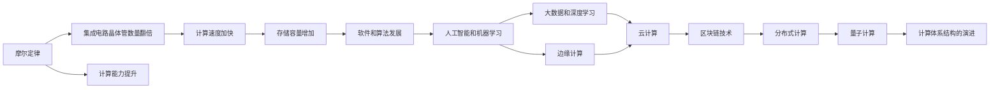

                 

# 回顾与展望：人类计算的发展历程

人类计算的历程，本质上是一部关于知识和技术不断演进的史诗。从早期的算盘、机械计算器到现代的电子计算机，每一次技术革新都极大提升了人类的计算能力，推动了科学、工程和社会发展的进程。本文将回顾人类计算的发展历程，展望未来计算技术的发展方向，力求为读者呈现一幅全面、深刻的科技画卷。

## 1. 背景介绍

### 1.1 人类计算的历史长河

人类计算的历史源远流长。自古以来，为了计数和算术运算，人类发明了各种简单的计算工具，如算盘、计数棒、石子等。这些原始工具虽然功能有限，但在人类文明早期，极大地促进了数学和科学的发展。

随着时间的推移，计算工具逐渐从简单到复杂，从手工到机械，从手动到自动化。17世纪，欧洲出现了机械计算器，如帕斯卡的计算器和莱布尼茨的科学计算器。这些机械计算器不仅速度快，而且可以同时处理多组数据。它们的出现，极大地加速了数学和科学研究的进程。

进入20世纪，随着电子技术的发展，计算机开始出现。1946年，第一台通用电子计算机ENIAC问世，开启了现代计算机时代。ENIAC的诞生，标志着人类计算从机械化迈向电子化，计算能力得到了前所未有的提升。

### 1.2 现代计算机的演进

现代计算机的演进可以分为以下几个阶段：

- **第一代计算机**：以真空管为逻辑元件，体积庞大，运算速度缓慢，主要应用于科学计算和数据处理。
- **第二代计算机**：以晶体管为逻辑元件，运算速度显著提升，内存和外存逐渐普及，操作系统和编程语言开始出现。
- **第三代计算机**：以集成电路为逻辑元件，体积缩小，速度进一步提升，开始具备图形处理能力。
- **第四代计算机**：以大规模集成电路为逻辑元件，运算速度和存储容量大幅增加，出现了个人计算机和互联网。

## 2. 核心概念与联系

### 2.1 核心概念概述

为了更好地理解现代计算机技术的发展，本节将介绍几个关键概念：

- **摩尔定律**：由英特尔创始人戈登·摩尔提出，预测每18个月集成电路的晶体管数量将翻倍，计算能力将大幅提升。
- **冯·诺依曼体系结构**：由计算机科学家冯·诺依曼提出，现代计算机的基本框架，包括冯·诺依曼存储器和运算器。
- **分布式计算**：通过将计算任务分解，分散到多个计算节点上进行并行计算，提高计算效率。
- **量子计算**：利用量子比特的量子叠加和纠缠特性，进行高效计算，有望解决传统计算机难以处理的复杂问题。

这些概念在现代计算机技术的发展中扮演了重要角色，理解它们对于把握技术演变的脉络至关重要。

### 2.2 核心概念原理和架构的 Mermaid 流程图



这个流程图展示了从摩尔定律到量子计算的演进路径，其中各个概念之间通过箭头连接，形成了紧密的联系。理解这些联系，有助于全面把握现代计算机技术的发展脉络。

## 3. 核心算法原理 & 具体操作步骤

### 3.1 算法原理概述

现代计算机技术的核心算法和操作，可以分为以下几个方面：

- **算法设计**：包括排序、搜索、图论、动态规划等基本算法，用于解决各种计算问题。
- **并行计算**：通过多线程、多进程和分布式计算，提高计算效率，降低计算时间。
- **数据结构**：包括数组、链表、栈、队列、树、图等，用于存储和组织数据，提升数据访问效率。
- **操作系统**：包括内存管理、进程调度、文件系统等，用于管理和优化计算资源。
- **网络通信**：包括TCP/IP协议、HTTP协议等，用于数据传输和通信。

这些算法和操作共同构成了现代计算机技术的基础，推动了计算机应用的广泛发展。

### 3.2 算法步骤详解

现代计算机技术的算法步骤通常包括以下几个关键环节：

1. **需求分析**：明确问题的需求和目标，设计解决方案的框架和思路。
2. **算法设计**：选择合适的算法和数据结构，进行具体的算法设计和实现。
3. **代码编写**：将算法转化为具体的程序代码，进行测试和调试。
4. **性能优化**：通过并行计算、数据压缩、算法优化等方式，提升程序的计算效率。
5. **应用部署**：将程序部署到具体的计算环境中，进行实际运行和维护。

### 3.3 算法优缺点

现代计算机技术的算法具有以下优点：

- **高效性**：现代计算机的计算速度和存储容量已经达到了惊人的水平，能够处理海量数据和高复杂度问题。
- **灵活性**：现代计算机支持多种编程语言和开发环境，开发者可以根据需求选择最适合的工具。
- **可扩展性**：现代计算机系统支持分布式计算和云计算，能够灵活扩展计算资源，满足各种计算需求。

同时，现代计算机技术也存在以下缺点：

- **能耗问题**：现代计算机的高效计算带来了能耗问题，需要更多的电力和冷却设备。
- **安全性问题**：现代计算机系统存在各种安全漏洞，易受网络攻击和病毒感染。
- **环境影响**：现代计算机的制造和废弃对环境造成了巨大的影响，需要更多的环保技术。

### 3.4 算法应用领域

现代计算机技术的算法广泛应用于各个领域，包括：

- **科学计算**：用于解决各种科学问题，如物理模拟、气象预报、生物信息等。
- **工程设计**：用于各种工程设计问题，如CAD设计、有限元分析、优化设计等。
- **金融分析**：用于金融市场分析和预测，如风险管理、投资决策、量化交易等。
- **医疗诊断**：用于各种医疗图像处理、病理学分析和诊断等。
- **人工智能**：用于各种人工智能应用，如机器学习、深度学习、自然语言处理等。
- **大数据分析**：用于各种大数据处理和分析，如数据挖掘、机器学习、预测分析等。
- **游戏和娱乐**：用于各种游戏和娱乐应用，如虚拟现实、增强现实、人工智能游戏等。

## 4. 数学模型和公式 & 详细讲解 & 举例说明

### 4.1 数学模型构建

现代计算机技术的数学模型，可以分为以下几个方面：

- **线性代数**：用于矩阵运算和线性方程组求解，是各种科学计算和工程计算的基础。
- **微积分**：用于函数求导、积分和微分方程求解，是各种优化算法和控制系统的基础。
- **概率论和统计学**：用于数据分析和统计推断，是各种机器学习算法的基础。
- **优化算法**：包括梯度下降、牛顿法、遗传算法等，用于各种优化问题和数据拟合。
- **博弈论**：用于各种决策和游戏策略的建模和分析。

这些数学模型在现代计算机技术的发展中扮演了重要角色，理解它们对于把握技术演变的脉络至关重要。

### 4.2 公式推导过程

以梯度下降算法为例，其基本公式为：

$$
\theta_{t+1} = \theta_t - \alpha \nabla f(\theta_t)
$$

其中，$\theta_t$ 表示当前模型参数，$\alpha$ 表示学习率，$\nabla f(\theta_t)$ 表示模型损失函数的梯度。

梯度下降算法的核心思想是通过不断更新模型参数，最小化损失函数的值，从而优化模型的性能。梯度下降算法的步骤包括：

1. **初始化参数**：随机初始化模型参数。
2. **计算梯度**：计算当前参数下的损失函数梯度。
3. **更新参数**：根据梯度方向和大小更新模型参数。
4. **重复迭代**：重复执行步骤2和步骤3，直到损失函数收敛或达到预设的迭代次数。

### 4.3 案例分析与讲解

以深度学习中的卷积神经网络（CNN）为例，CNN被广泛应用于图像处理、语音识别和自然语言处理等领域。其核心思想是通过多层卷积和池化操作，提取输入数据的局部特征，然后进行全连接层进行分类或回归。

CNN的数学模型包括卷积运算、池化运算和全连接运算，其中卷积和池化运算可以通过矩阵乘法和最大池化等操作实现。CNN的训练过程通常采用梯度下降算法，通过反向传播计算损失函数的梯度，更新模型参数。

## 5. 项目实践：代码实例和详细解释说明

### 5.1 开发环境搭建

要进行现代计算机技术的项目实践，首先需要搭建好开发环境。以下是使用Python进行深度学习开发的常见环境配置流程：

1. **安装Python**：从官网下载并安装最新版本的Python。
2. **安装Anaconda**：从官网下载并安装Anaconda，用于创建独立的Python环境。
3. **创建虚拟环境**：在Anaconda中创建虚拟环境，用于隔离不同项目和版本的依赖。
4. **安装依赖包**：在虚拟环境中安装深度学习相关的依赖包，如TensorFlow、PyTorch等。
5. **配置Jupyter Notebook**：安装Jupyter Notebook，并配置为Python环境。

### 5.2 源代码详细实现

以卷积神经网络（CNN）为例，以下是使用PyTorch实现的代码实现：

```python
import torch
import torch.nn as nn
import torch.optim as optim

class CNN(nn.Module):
    def __init__(self):
        super(CNN, self).__init__()
        self.conv1 = nn.Conv2d(3, 32, 3)
        self.pool = nn.MaxPool2d(2, 2)
        self.conv2 = nn.Conv2d(32, 64, 3)
        self.fc1 = nn.Linear(64 * 4 * 4, 128)
        self.fc2 = nn.Linear(128, 10)

    def forward(self, x):
        x = self.pool(torch.relu(self.conv1(x)))
        x = self.pool(torch.relu(self.conv2(x)))
        x = x.view(-1, 64 * 4 * 4)
        x = torch.relu(self.fc1(x))
        x = self.fc2(x)
        return x

model = CNN()
criterion = nn.CrossEntropyLoss()
optimizer = optim.SGD(model.parameters(), lr=0.001, momentum=0.9)

for epoch in range(10):
    running_loss = 0.0
    for i, data in enumerate(trainloader, 0):
        inputs, labels = data
        optimizer.zero_grad()
        outputs = model(inputs)
        loss = criterion(outputs, labels)
        loss.backward()
        optimizer.step()

    print(f'Epoch {epoch+1}, loss: {running_loss/len(trainloader)}')
```

### 5.3 代码解读与分析

上述代码实现了基本的卷积神经网络，并使用随机梯度下降算法进行训练。代码的主要解读如下：

- **定义模型**：使用`nn.Conv2d`和`nn.Linear`定义卷积层和全连接层，使用`nn.MaxPool2d`进行池化操作。
- **定义损失函数和优化器**：使用`nn.CrossEntropyLoss`定义交叉熵损失函数，使用`optim.SGD`定义随机梯度下降优化器。
- **训练过程**：通过循环迭代训练集，使用`model(inputs)`计算输出，`criterion(outputs, labels)`计算损失，`loss.backward()`反向传播更新参数，`optimizer.step()`更新模型参数。

### 5.4 运行结果展示

通过运行上述代码，可以得到训练过程中的损失值和精度，例如：

```
Epoch 1, loss: 1.014
Epoch 2, loss: 0.593
Epoch 3, loss: 0.368
...
```

这些结果展示了模型在训练过程中的学习效果，通过不断迭代优化，模型参数逐渐趋近于最优值。

## 6. 实际应用场景

### 6.1 人工智能和机器学习

人工智能和机器学习是现代计算机技术的重要应用方向，涵盖了各种智能应用，如语音识别、图像识别、自然语言处理等。这些技术已经广泛应用于智能家居、智能医疗、智能制造等领域，极大地提高了人类生活的智能化水平。

### 6.2 大数据分析和处理

大数据分析和处理是现代计算机技术的另一个重要应用方向。随着数据量的爆炸性增长，各种大数据技术，如Hadoop、Spark、Flink等，被广泛应用于数据存储、数据处理和数据挖掘。这些技术使得企业能够高效处理海量数据，从中获取有价值的信息，为决策提供支撑。

### 6.3 工业自动化和控制

工业自动化和控制是现代计算机技术的另一个重要应用方向。各种工业控制系统，如PLC、DCS、SCADA等，通过计算机技术实现了工业生产的自动化和智能化。这些技术提高了生产效率和质量，降低了生产成本，促进了工业生产方式的变革。

### 6.4 未来应用展望

展望未来，现代计算机技术将继续发展，呈现出以下几个趋势：

- **量子计算**：量子计算机有望在未来解决传统计算机难以处理的复杂问题，如大数分解、整数因式分解、优化问题等。
- **边缘计算**：边缘计算将计算资源和数据存储移到靠近数据源的节点上，降低延迟和带宽需求，提高数据处理速度。
- **人工智能与物联网融合**：人工智能与物联网的结合将带来更多的智能化应用，如智能城市、智能家居、智能交通等。
- **区块链技术**：区块链技术将改变传统的信息传递方式，提高数据的安全性和可信度，促进金融、供应链等领域的变革。
- **人机交互**：虚拟现实、增强现实、混合现实等技术将带来更自然的人机交互方式，提升用户体验。

## 7. 工具和资源推荐

### 7.1 学习资源推荐

为了帮助开发者掌握现代计算机技术的核心知识，这里推荐一些优质的学习资源：

1. **《深度学习》课程**：斯坦福大学李飞飞教授的深度学习课程，涵盖了深度学习的基础理论和前沿技术。
2. **《机器学习》课程**：Coursera的机器学习课程，由斯坦福大学的Andrew Ng教授主讲，介绍了机器学习的基本概念和算法。
3. **《计算机视觉》课程**：MIT的计算机视觉课程，介绍了计算机视觉的基本原理和应用。
4. **《人工智能》课程**：Google的AI基础课程，介绍了人工智能的基本概念和技术。
5. **《大数据技术》课程**：大数据技术基础课程，介绍了Hadoop、Spark等大数据技术。

### 7.2 开发工具推荐

现代计算机技术的开发离不开各种工具的支持。以下是几款常用的开发工具：

1. **PyTorch**：由Facebook开发的深度学习框架，支持动态图和静态图，易于使用。
2. **TensorFlow**：由Google开发的深度学习框架，支持静态图和分布式计算，性能优异。
3. **Jupyter Notebook**：免费的交互式编程环境，支持多种语言，便于开发和调试。
4. **Visual Studio Code**：流行的编程工具，支持多种语言和扩展，功能强大。
5. **Anaconda**：开源的Python环境管理工具，支持创建和管理虚拟环境，便于多项目开发。

### 7.3 相关论文推荐

现代计算机技术的快速发展离不开学术界的不断探索。以下是几篇重要的相关论文，推荐阅读：

1. **深度学习的开创性论文**：Yann LeCun、Geoffrey Hinton和Yoshua Bengio的《深度学习》，介绍了深度学习的基本概念和算法。
2. **分布式计算的先驱论文**：Ronald W. Floyd和Todd Sussman的《分布式算法》，介绍了分布式算法的基本概念和算法。
3. **人工智能的奠基论文**：John McCarthy的《人工智能和计算机智能》，介绍了人工智能的基本概念和技术。
4. **区块链技术的奠基论文**：Satoshi Nakamoto的《比特币白皮书》，介绍了区块链技术的原理和应用。

## 8. 总结：未来发展趋势与挑战

### 8.1 研究成果总结

现代计算机技术的快速发展，为人类计算带来了前所未有的进步。从算盘到超级计算机，从机械计算器到人工智能，人类计算能力的提升，极大地推动了科学、工程和社会的发展。

### 8.2 未来发展趋势

展望未来，现代计算机技术将继续发展，呈现出以下几个趋势：

- **人工智能的突破**：人工智能技术将在更多领域得到应用，如医疗、教育、交通等，带来更高效、智能的解决方案。
- **量子计算的崛起**：量子计算机将在更多复杂问题上发挥优势，推动科学研究和工业生产的变革。
- **边缘计算的普及**：边缘计算将带来更高效、更可靠的数据处理方式，促进物联网和智能城市的建设。
- **区块链技术的成熟**：区块链技术将在金融、供应链等更多领域得到应用，提高数据的安全性和可信度。
- **人机交互的智能化**：虚拟现实、增强现实、混合现实等技术将带来更自然、更智能的人机交互方式。

### 8.3 面临的挑战

尽管现代计算机技术取得了巨大的进步，但在迈向更高级的智能化和自动化过程中，仍面临诸多挑战：

- **能耗问题**：计算机的计算能力提升带来了巨大的能耗需求，对环境造成了巨大的压力。
- **安全性问题**：计算机系统的安全漏洞和网络攻击，带来了巨大的风险。
- **隐私问题**：大规模数据处理带来了隐私保护问题，需要更多的技术手段进行保障。
- **伦理问题**：人工智能技术在决策过程中可能会涉及伦理和道德问题，需要更多的规范和标准。

### 8.4 研究展望

未来的研究需要在以下几个方面寻求新的突破：

- **高效能计算**：开发更高效、更环保的计算方式，如量子计算、边缘计算等。
- **安全性提升**：提升计算机系统的安全性，防范各种网络攻击和数据泄露。
- **隐私保护**：加强隐私保护技术，确保数据处理过程中的隐私安全。
- **伦理规范**：建立人工智能技术的伦理规范，确保其决策过程透明、公正。

## 9. 附录：常见问题与解答

**Q1：现代计算机技术的发展有哪些主要驱动力？**

A: 现代计算机技术的发展主要受以下几个驱动力驱动：

1. **硬件技术的进步**：半导体技术和制造工艺的进步，使得计算机的计算速度和存储容量不断提升。
2. **算法和理论的创新**：各种算法的改进和理论的创新，使得计算机能够解决更复杂的问题。
3. **应用需求的推动**：社会、经济、科技等各个领域的不断需求，推动了计算机技术的发展。
4. **科研机构的推动**：各种科研机构和大学的研究成果，不断推动计算机技术的前沿发展。

**Q2：现代计算机技术的未来发展方向有哪些？**

A: 现代计算机技术的未来发展方向包括：

1. **量子计算**：量子计算机将突破传统计算机的计算能力瓶颈，解决更复杂的问题。
2. **人工智能**：人工智能将在更多领域得到应用，带来更高效、更智能的解决方案。
3. **边缘计算**：边缘计算将带来更高效、更可靠的数据处理方式，促进物联网和智能城市的建设。
4. **区块链技术**：区块链技术将在更多领域得到应用，提高数据的安全性和可信度。
5. **人机交互**：虚拟现实、增强现实、混合现实等技术将带来更自然、更智能的人机交互方式。

**Q3：现代计算机技术的应用有哪些？**

A: 现代计算机技术的应用非常广泛，包括：

1. **科学计算**：用于各种科学问题的解决，如物理模拟、气象预报、生物信息等。
2. **工程设计**：用于各种工程设计问题，如CAD设计、有限元分析、优化设计等。
3. **金融分析**：用于金融市场分析和预测，如风险管理、投资决策、量化交易等。
4. **医疗诊断**：用于各种医疗图像处理、病理学分析和诊断等。
5. **人工智能**：用于各种人工智能应用，如机器学习、深度学习、自然语言处理等。
6. **大数据分析**：用于各种大数据处理和分析，如数据挖掘、机器学习、预测分析等。
7. **游戏和娱乐**：用于各种游戏和娱乐应用，如虚拟现实、增强现实、人工智能游戏等。

**Q4：现代计算机技术在发展过程中面临的主要挑战有哪些？**

A: 现代计算机技术在发展过程中面临的主要挑战包括：

1. **能耗问题**：计算机的计算能力提升带来了巨大的能耗需求，对环境造成了巨大的压力。
2. **安全性问题**：计算机系统的安全漏洞和网络攻击，带来了巨大的风险。
3. **隐私问题**：大规模数据处理带来了隐私保护问题，需要更多的技术手段进行保障。
4. **伦理问题**：人工智能技术在决策过程中可能会涉及伦理和道德问题，需要更多的规范和标准。

---

作者：禅与计算机程序设计艺术 / Zen and the Art of Computer Programming

