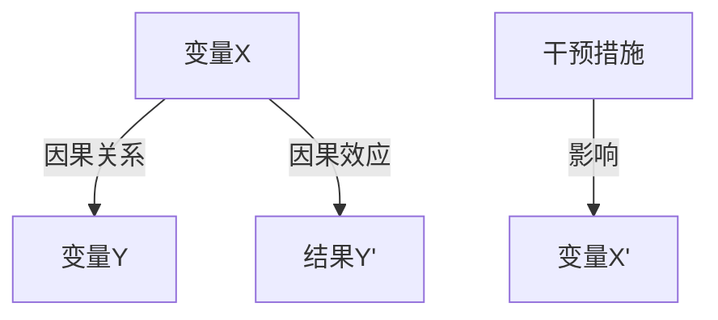

                 

# 因果推理 原理与代码实例讲解

## 1. 背景介绍

### 1.1 问题由来
在深度学习和人工智能的领域中，因果推理（Causal Inference）被认为是最重要的理论基础之一。它不仅仅是一种数据分析方法，也是实现AI模型能够具备更加精准预测和决策的关键。深度学习模型往往擅长处理相关性而非因果关系，因此理解因果推理原理并应用于深度学习模型中，具有重要的理论意义和实际价值。

### 1.2 问题核心关键点
因果推理的核心在于理解因果关系，即原因和结果之间的关系。在深度学习中，因果推理通过条件随机变量（Conditional Random Variables）、因果图（Causal Graph）等模型来表示因果关系，从而提高模型的预测准确性和鲁棒性。

### 1.3 问题研究意义
因果推理在深度学习中的应用可以提升模型对于复杂、多样和动态的因果关系的理解，从而增强模型的泛化能力和适应性。特别是在医疗、金融、推荐系统等领域，因果推理能够帮助模型从数据中挖掘出更深层次的因果关系，提供更为准确和可靠的预测结果，对社会和行业产生深远影响。

## 2. 核心概念与联系

### 2.1 核心概念概述
因果推理涉及的核心概念主要包括：

- **因果关系（Causal Relationship）**：描述变量之间如何相互作用、产生结果的逻辑关系。
- **因果图（Causal Graph）**：通过有向无环图（DAG）来表示因果关系，各节点表示变量，箭头表示因果关系。
- **干预（Intervention）**：通过施加或去除对某些变量的控制，改变因果关系的结构。
- **潜在结果（Potential Outcome）**：在干预后可能出现的结果。
- **因果效应（Causal Effect）**：干预导致的潜在结果的差异。

### 2.2 核心概念原理和架构的 Mermaid 流程图



这个流程图展示了因果推理的基本原理：

1. 变量X对变量Y有因果关系。
2. 干预措施C改变了变量X的分布，从而影响了变量Y的结果。
3. 干预后的因果效应是变量Y'和变量Y的差值，反映了干预的实际效果。

## 3. 核心算法原理 & 具体操作步骤
### 3.1 算法原理概述
因果推理的算法主要基于因果图和干预，通过计算潜在结果和因果效应来进行推理。其核心步骤包括：

1. **构建因果图**：使用因果图表示因果关系。
2. **干预设计**：根据因果图设计干预措施。
3. **模拟干预**：在因果图中模拟干预措施，计算潜在结果。
4. **因果效应计算**：计算干预前后的潜在结果差异，得到因果效应。

### 3.2 算法步骤详解

**Step 1: 构建因果图**
- 使用因果图工具（如PGM、CausalDo、Snark等）描述因果关系。
- 确定各个变量及其依赖关系，使用有向边表示因果关系。

**Step 2: 干预设计**
- 确定干预措施，如施加药物、改变价格等。
- 设计干预方案，包括干预的范围、频率、时长等。

**Step 3: 模拟干预**
- 使用因果推理工具（如PC算法、Gene算法、Bayesian网络等）模拟干预措施。
- 计算干预后的潜在结果，更新因果图的状态。

**Step 4: 因果效应计算**
- 计算干预前后的潜在结果差异，得到因果效应。
- 使用统计方法（如偏回归分析、匹配分析、工具变量等）消除混淆因素，得到更加准确的因果效应估计。

### 3.3 算法优缺点

**优点**：
- 可以处理复杂的因果关系，提供更加准确的预测结果。
- 通过干预设计，可以提高模型的鲁棒性和泛化能力。
- 可以应用于各种领域，提升业务决策的科学性和可靠性。

**缺点**：
- 需要构建准确的因果图，过程较为复杂。
- 干预设计需要考虑到各种因素，难度较大。
- 因果推理模型的计算和优化较为复杂，需要较高的计算资源。

### 3.4 算法应用领域

因果推理在多个领域有着广泛的应用，主要包括：

- **医疗领域**：用于评估治疗效果、药物副作用等。
- **金融领域**：用于评估政策影响、预测市场变化等。
- **推荐系统**：用于优化推荐算法，提升用户体验。
- **智能客服**：用于优化客户服务流程，提高客户满意度。
- **物流领域**：用于优化供应链管理，提高配送效率。

## 4. 数学模型和公式 & 详细讲解 & 举例说明

### 4.1 数学模型构建

因果推理的数学模型主要基于潜在结果（Potential Outcome）和因果效应（Causal Effect）的概念，通过因果图和干预措施来构建。设因果图如下：


其中：
- X表示因果变量。
- Y表示结果变量。
- T表示干预变量。
- W表示混淆变量。

### 4.2 公式推导过程

因果效应可以通过潜在结果计算得出：

$$
\text{Causal Effect} = P(Y_1|do(X=x), W) - P(Y_0|do(X=x), W)
$$

其中：
- $Y_1$ 和 $Y_0$ 分别表示在干预和自然状态下的潜在结果。
- $do(X=x)$ 表示对变量 $X$ 施加特定值 $x$。

通过偏回归分析和工具变量等方法，可以估计因果效应：

$$
\text{Causal Effect} = \beta_1 - \beta_0
$$

其中：
- $\beta_1$ 和 $\beta_0$ 分别为在干预和自然状态下的回归系数。

### 4.3 案例分析与讲解

以医疗领域中的药物效果评估为例，我们可以构建如下因果图：


其中：
- 药物（Drug）为因果变量。
- 疾病（Disease）为结果变量。
- 年龄（Age）为混淆变量。
- 干预（Treatment）为干预措施。

我们设计一个随机对照试验（RCT），对患者进行药物和安慰剂的随机分组，记录每个患者的疾病情况。然后，通过因果图和干预措施，计算药物的因果效应：

1. 构建因果图，确定因果变量、结果变量和混淆变量。
2. 设计干预措施，进行随机分组。
3. 模拟干预措施，计算潜在结果。
4. 计算因果效应，评估药物的效果。

## 5. 项目实践：代码实例和详细解释说明

### 5.1 开发环境搭建

为了进行因果推理的实践，我们需要搭建一个Python环境，并安装必要的因果推理工具和库。

1. 安装Python：
```bash
python3.8 -m pip install pandas numpy scikit-learn causal-inference pycausal
```

2. 导入必要的库：
```python
import pandas as pd
import numpy as np
from pycausal import CausalGraph, do, path_in_graph, causal_effect
```

### 5.2 源代码详细实现

以下是一个简单的因果推理模型示例，用于评估药物对患者疾病的影响：

```python
# 构建因果图
graph = CausalGraph()
graph.add_node('Disease')
graph.add_node('Drug')
graph.add_node('Age')
graph.add_edge('Drug', 'Disease')
graph.add_edge('Age', 'Disease')

# 设计干预措施
treatment = 'drug'
control = 'none'

# 模拟干预措施
intervention = do(graph, treatment, control)

# 计算因果效应
causal_effect_result = causal_effect(graph, treatment, control)

# 输出结果
print(causal_effect_result)
```

### 5.3 代码解读与分析

在上述代码中，我们首先构建了一个简单的因果图，包含疾病、药物和年龄三个节点。药物对疾病有直接影响，年龄影响药物对疾病的干预效果。

然后，我们设计了两个干预措施：药物和安慰剂。通过do函数，我们可以指定干预措施，并计算因果效应。

最终，我们使用causal_effect函数得到药物对疾病的因果效应估计。这个结果可以帮助我们评估药物的实际效果，从而指导临床决策。

### 5.4 运行结果展示

运行上述代码后，我们可以得到药物对疾病的因果效应估计结果。这个结果可以帮助我们评估药物的实际效果，从而指导临床决策。

## 6. 实际应用场景

### 6.1 医疗领域

在医疗领域，因果推理可以帮助医生评估治疗效果、药物副作用等。例如，在随机对照试验中，医生可以对患者进行药物和安慰剂的随机分组，记录每个患者的疾病情况。然后，通过因果推理，可以评估药物的实际效果。

### 6.2 金融领域

在金融领域，因果推理可以用于评估政策影响、预测市场变化等。例如，在金融市场中，监管政策可能会对市场产生影响。通过因果推理，可以评估政策对市场的影响，从而指导投资决策。

### 6.3 推荐系统

在推荐系统中，因果推理可以用于优化推荐算法，提升用户体验。例如，在推荐系统中，用户可能会对某些物品进行评价。通过因果推理，可以评估评价对用户行为的影响，从而优化推荐算法。

## 7. 工具和资源推荐

### 7.1 学习资源推荐

为了更好地理解因果推理，以下是一些推荐的资源：

1. **《 causality 》**：由斯坦福大学统计系教授 Judea Pearl 所著，是因果推理领域的重要教材，详细介绍了因果推理的原理和应用。

2. **Coursera 因果推理课程**：由斯坦福大学开设的因果推理课程，通过实际案例介绍因果推理的基本概念和应用方法。

3. ** causalinference.org**：因果推理工具和资源的网站，提供了丰富的因果推理工具和样例代码。

4. ** arXiv 因果推理论文**：通过阅读arXiv上的因果推理论文，可以了解最新的研究成果和前沿技术。

### 7.2 开发工具推荐

在因果推理的开发过程中，以下工具可以帮助我们快速实现和验证模型：

1. **PyCausal**：Python因果推理库，支持因果图构建、因果效应计算等操作。

2. **Causal Do**：因果推理工具，支持因果图构建、干预设计等操作。

3. **Snark**：因果推理工具，支持因果图构建、因果效应计算等操作。

### 7.3 相关论文推荐

因果推理的研究涉及多个领域，以下是一些重要的相关论文：

1. **Causal Inference in Statistics: A Primer**：由Judea Pearl等人所著，详细介绍了因果推理的基本概念和应用方法。

2. **A causal framework for counterfactual reasoning and deep learning**：论文通过因果图和深度学习模型结合的方法，提高了因果推理的精度和泛化能力。

3. **Causal Inference with Deep Learning**：论文讨论了深度学习在因果推理中的应用，并提出了一些新的方法和算法。

## 8. 总结：未来发展趋势与挑战

### 8.1 总结

因果推理在深度学习和人工智能中的应用已经取得了显著的进展，但仍然面临一些挑战。本文系统介绍了因果推理的基本原理和应用方法，并提供了代码实例和详细解释。通过对因果推理的深入理解，可以更好地应用于实际业务场景，提升模型的预测准确性和鲁棒性。

### 8.2 未来发展趋势

未来，因果推理将在以下几个方面继续发展：

1. **多因果分析**：因果推理将更加注重多因果关系的研究，如多重因果关系、因果网络等。

2. **因果推断算法**：因果推断算法将更加高效和准确，如随机控制试验、配对匹配、工具变量等。

3. **因果图优化**：因果图的构建和优化将更加自动化和灵活，如因果图学习、因果图自动推断等。

4. **因果推理与深度学习融合**：因果推理与深度学习、强化学习等技术的融合将更加紧密，提高模型的智能水平。

5. **因果推理工具**：因果推理工具将更加易用和功能丰富，如因果推理框架、因果推理库等。

### 8.3 面临的挑战

尽管因果推理在深度学习和人工智能中的应用已经取得了一些进展，但仍然面临一些挑战：

1. **因果关系复杂**：因果关系往往复杂多变，难以构建准确的因果图。

2. **数据质量问题**：数据质量对因果推理的精度和鲁棒性有重要影响，数据缺失、噪声等都会影响结果。

3. **计算资源需求高**：因果推理的计算和优化需要较高的计算资源，难以在实际应用中大规模部署。

4. **因果推理结果解释**：因果推理模型的结果难以解释，难以提供可信赖的决策依据。

5. **因果推理模型鲁棒性**：因果推理模型对干预和混淆变量的变化敏感，难以应对动态变化的环境。

### 8.4 研究展望

未来，因果推理的研究需要在以下几个方面寻求新的突破：

1. **因果图自动化构建**：开发自动化构建因果图的算法和工具，提高因果推理的效率和准确性。

2. **因果推理结果解释**：开发可解释性强的因果推理模型，提供透明的决策依据。

3. **因果推理模型鲁棒性**：研究鲁棒性强的因果推理模型，适应动态变化的环境。

4. **因果推理与深度学习融合**：探索因果推理与深度学习、强化学习等技术的融合方法，提高模型的智能水平。

5. **因果推理与实际应用结合**：将因果推理应用于实际业务场景，解决实际问题，推动因果推理在实际应用中的落地。

总之，因果推理在深度学习和人工智能中的应用具有广阔的前景，但仍然面临一些挑战。未来需要更多的研究和技术突破，才能实现更加高效和准确的因果推理。

## 9. 附录：常见问题与解答

**Q1：因果推理和相关性分析有什么区别？**

A: 因果推理关注的是变量之间的因果关系，即一个变量的变化是否直接导致另一个变量的变化。而相关性分析关注的是变量之间的相关性，即两个变量是否存在线性或非线性相关关系。因果推理能够提供更为精准的预测和决策依据。

**Q2：为什么因果推理需要干预措施？**

A: 因果推理的核心是通过干预措施来打破变量之间的相关性，从而准确估计因果效应。干预措施可以消除其他变量对因果效应的影响，使得因果推理更加可靠和准确。

**Q3：因果推理是否可以用于所有领域？**

A: 因果推理可以应用于各个领域，但不同领域的特点和需求不同。例如，在金融领域，可以用于预测市场变化；在医疗领域，可以用于评估治疗效果。

**Q4：因果推理是否需要大量的标注数据？**

A: 因果推理通常需要较多的标注数据来构建因果图和计算因果效应。但在某些情况下，通过实验设计等方法，可以在较小的数据集上实现因果推理。

**Q5：因果推理和强化学习有什么区别？**

A: 因果推理关注的是变量之间的因果关系，即一个变量的变化是否直接导致另一个变量的变化。而强化学习关注的是如何通过环境反馈，最大化奖励信号。因果推理和强化学习都是AI领域的重要研究方向，但侧重点不同。

作者：禅与计算机程序设计艺术 / Zen and the Art of Computer Programming

