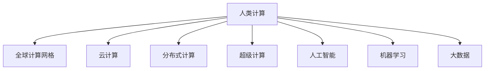

                 

# 国际合作：携手共进，推动人类计算进步

> 关键词：国际合作, 人类计算, 计算能力, 分布式计算, 云计算, 人工智能, 机器学习, 大数据, 超级计算

## 1. 背景介绍

### 1.1 问题由来
随着信息时代的到来，人类社会的计算能力迎来了历史性的变革。计算机技术的快速演进，使得人类能够以前所未有的效率处理海量数据、进行深度学习和模拟计算。然而，尽管如此，计算能力的提升并未普及到全球每一个角落。不同国家和地区之间在计算能力、技术应用、资源分配等方面存在明显的不均衡。如何突破地域限制，推动全球计算能力协同发展，成为当前国际社会共同关注的重要议题。

### 1.2 问题核心关键点
实现全球协同计算的关键在于以下几方面的突破：

- **计算资源的全球共享**：通过建设全球计算资源池，使得各国的计算能力可以无缝互通，实现计算资源的全球共享。
- **计算技术的标准化**：制定统一的计算标准和接口，降低不同计算系统之间的沟通成本，提升整体计算效率。
- **计算人才的全球培养**：加强国际间的人文交流与合作，培养更多的计算专业人才，形成全球计算人才网。
- **计算应用的广泛普及**：推动计算技术在各个领域的应用，特别是发展中国家，提升计算能力对于经济社会发展的驱动作用。
- **计算伦理与安全的全球共识**：建立统一的计算伦理和数据安全标准，保障计算过程中的数据隐私和信息安全。

通过突破以上几个关键点，才能真正实现全球协同计算，推动人类计算能力的跨越式进步。

## 2. 核心概念与联系

### 2.1 核心概念概述

为了更好地理解国际合作推动人类计算进步的逻辑，本节将介绍几个密切相关的核心概念：

- **人类计算(Human Compute)**：指以人类为计算资源的计算范式，通过构建大规模的计算平台和计算网格，实现计算资源的优化配置和高效利用。
- **全球计算网格(Grid Computing)**：通过互联网将分散在各地的计算资源连接起来，形成一个虚拟的计算环境，实现资源共享和协同计算。
- **云计算(Cloud Computing)**：基于互联网的计算服务模式，用户按需使用计算资源，无需关注底层硬件设施的维护与扩展。
- **分布式计算(Distributed Computing)**：将计算任务分解为多个子任务，分布在多个计算节点上进行并行处理，提升计算效率。
- **超级计算(Supercomputing)**：指使用大规模并行计算设施，进行科学计算、数据处理等高强度计算任务，如天气预报、生物医学等。
- **人工智能(Artificial Intelligence, AI)**：基于数据和算法，使机器能够模拟人类智能，进行感知、决策、学习等高级认知活动。
- **机器学习(Machine Learning, ML)**：使机器通过数据学习规律，自主优化算法，提升对复杂问题的处理能力。
- **大数据(Big Data)**：指海量、复杂、多样化的数据集合，利用先进的数据处理技术，提取有价值的信息。

这些核心概念之间的逻辑关系可以通过以下Mermaid流程图来展示：



这个流程图展示了大语言模型的核心概念及其之间的关系：

1. **人类计算**：以人类为计算资源，通过全球协同计算实现计算能力的最大化。
2. **全球计算网格**：通过互联网连接分散的计算资源，实现资源的全球共享。
3. **云计算**：提供灵活的计算服务，按需使用，降低计算成本。
4. **分布式计算**：将计算任务并行分解，提升计算效率。
5. **超级计算**：使用大规模并行计算设施，处理高强度计算任务。
6. **人工智能**：基于计算和数据，使机器具备类人智能。
7. **机器学习**：使机器通过数据学习规律，优化算法。
8. **大数据**：提供海量、复杂、多样化的数据，支持高级数据分析。

这些概念共同构成了推动人类计算进步的框架，通过国际合作，提升全球计算能力，实现资源的优化配置和高效利用。

## 3. 核心算法原理 & 具体操作步骤
### 3.1 算法原理概述

国际合作推动人类计算进步的核心在于通过分布式计算、云计算、超级计算等手段，实现全球协同计算。其核心思想是：构建一个全球性的计算资源池，通过标准化的接口和协议，实现计算资源的跨地域流动和共享。这不仅可以提升全球计算能力，还能促进全球科技交流与合作，形成更加紧密的全球科技共同体。

### 3.2 算法步骤详解

实现国际合作推动人类计算进步的算法步骤如下：

**Step 1: 构建全球计算资源池**

- **数据共享平台**：建立全球数据共享平台，收集各国的数据资源，实现数据的跨国流动。
- **计算资源整合**：整合各国的高性能计算设施，构建全球计算资源池。
- **标准化接口**：制定统一的计算接口和协议，降低不同计算系统之间的沟通成本。

**Step 2: 分布式计算优化**

- **任务分解**：将复杂计算任务分解为多个子任务，分布在全球计算资源上进行并行处理。
- **负载均衡**：通过算法优化，实现计算任务的负载均衡，提升整体计算效率。
- **容错机制**：建立容错机制，确保计算过程的连续性和可靠性。

**Step 3: 云计算的广泛应用**

- **按需使用**：推动云计算技术的广泛应用，用户可以按需使用计算资源，无需关注底层硬件设施的维护与扩展。
- **服务级别协议(SLA)**：制定服务级别协议，确保云计算服务的高可用性和安全性。
- **全球部署**：在多个国家和地区部署云计算设施，实现计算资源的全球化部署。

**Step 4: 超级计算的协同合作**

- **跨国科研合作**：推动跨国科研合作，共同进行大规模科学计算项目，如天气预报、生物医学等。
- **设施共享**：共享超级计算设施，提升各国科研能力。
- **数据共享**：共享科研数据，促进科学研究的发展。

### 3.3 算法优缺点

国际合作推动人类计算进步的算法具有以下优点：

1. **提升计算效率**：通过全球协同计算，实现计算资源的优化配置，提升整体计算效率。
2. **降低成本**：用户可以按需使用计算资源，无需关注底层硬件设施的维护与扩展，降低计算成本。
3. **促进科技交流**：通过国际合作，促进全球科技交流与合作，形成更加紧密的全球科技共同体。

同时，该算法也存在以下局限性：

1. **数据隐私和安全问题**：不同国家的数据隐私和信息安全标准不同，可能存在数据泄露和信息安全问题。
2. **网络延迟和带宽问题**：跨国数据传输可能面临网络延迟和带宽问题，影响计算效率。
3. **标准化难度**：不同国家和地区的计算标准和接口存在差异，标准化难度较大。

尽管存在这些局限性，但就目前而言，基于分布式计算、云计算和超级计算的国际合作算法，仍是大规模推动人类计算进步的重要手段。未来相关研究的重点在于如何进一步降低数据传输成本，提高计算效率，同时兼顾数据隐私和安全等因素。

### 3.4 算法应用领域

国际合作推动人类计算进步的算法已经在多个领域得到了广泛的应用，包括：

- **科学计算**：如天气预报、生物医学、天文学等，通过跨国科研合作，共同进行大规模计算项目。
- **云计算服务**：通过全球部署的云计算设施，提供高效、便捷的计算服务，广泛应用于各类行业应用。
- **分布式数据处理**：通过分布式计算，处理海量数据，提升数据处理效率，应用于大数据分析和处理。
- **超级计算设施**：共享超级计算设施，提升科研能力，支持大规模科学计算任务。
- **跨国科研合作**：通过国际合作，推动科学研究的发展，提升全球科研水平。

除了上述这些经典应用外，国际合作推动人类计算进步的算法还被创新性地应用于更多场景中，如智慧城市治理、金融科技、智能交通等，为全球科技发展注入新的动力。

## 4. 数学模型和公式 & 详细讲解  
### 4.1 数学模型构建

本节将使用数学语言对国际合作推动人类计算进步的过程进行更加严格的刻画。

记全球计算资源池为 $G$，各国计算资源为 $G_1, G_2, \ldots, G_n$，其中 $n$ 为全球国家数。设任务 $T$ 需要计算的资源量为 $C_T$，各国计算资源的性能为 $P_i$，时间为 $T_i$。

定义任务 $T$ 的计算时间为：

$$
T_G = \sum_{i=1}^n \frac{C_T}{P_i} T_i
$$

目标是最小化全球计算时间 $T_G$，即找到最优资源分配方案：

$$
\min_{x_i \geq 0} T_G = \sum_{i=1}^n x_i \frac{C_T}{P_i} T_i
$$

其中 $x_i$ 表示资源 $G_i$ 分配给任务 $T$ 的份额。

通过优化算法求解上述问题，可得到最优的资源分配方案。

### 4.2 公式推导过程

以下我们以科学计算为例，推导全球协同计算的优化模型。

假设某科学计算任务 $T$ 需要 $C_T$ 的计算资源，各国计算资源的性能为 $P_i$，时间为 $T_i$，分配方案为 $x_i$。则科学计算的任务完成时间 $T_G$ 为：

$$
T_G = \sum_{i=1}^n x_i \frac{C_T}{P_i} T_i
$$

为了最小化 $T_G$，引入拉格朗日乘数法，构建拉格朗日函数：

$$
\mathcal{L}(x,\lambda) = \sum_{i=1}^n x_i \frac{C_T}{P_i} T_i + \lambda \left(\sum_{i=1}^n x_i - 1\right)
$$

其中 $\lambda$ 为拉格朗日乘数，约束为总资源分配不超过 $1$。

对 $x_i$ 求偏导，得：

$$
\frac{\partial \mathcal{L}}{\partial x_i} = \frac{C_T}{P_i} T_i + \lambda = 0
$$

解得：

$$
x_i = \frac{C_T P_i T_i}{\sum_{j=1}^n P_j T_j}
$$

代入拉格朗日函数，求解 $\lambda$：

$$
\lambda = -\frac{\partial \mathcal{L}}{\partial \sum_{i=1}^n x_i} = -\frac{\partial \mathcal{L}}{\partial \sum_{i=1}^n \frac{C_T P_i T_i}{\sum_{j=1}^n P_j T_j}} = 0
$$

因此，最优资源分配方案为：

$$
x_i = \frac{C_T P_i T_i}{\sum_{j=1}^n P_j T_j}
$$

这个公式表明，最优资源分配应按照各国的计算资源和性能进行均衡分配，以实现最低的计算时间。

### 4.3 案例分析与讲解

以天气预报为例，分析全球协同计算的应用。

- **数据共享**：气象数据在全球各地都有采集和存储，通过数据共享平台，实现数据的跨国流动。
- **计算资源整合**：将全球各地的超级计算设施整合，构建全球计算资源池。
- **任务分解**：将天气预报任务分解为多个子任务，如大气动力学模拟、海洋环流预测等。
- **负载均衡**：通过算法优化，实现计算任务的负载均衡，提升整体计算效率。
- **容错机制**：建立容错机制，确保计算过程的连续性和可靠性。

通过国际合作，实现全球协同计算，能够快速响应气候变化，提升天气预报的准确性，保障全球安全和稳定。

## 5. 项目实践：代码实例和详细解释说明
### 5.1 开发环境搭建

在进行国际合作推动人类计算进步的实践前，我们需要准备好开发环境。以下是使用Python进行PyTorch开发的环境配置流程：

1. 安装Anaconda：从官网下载并安装Anaconda，用于创建独立的Python环境。

2. 创建并激活虚拟环境：
```bash
conda create -n pytorch-env python=3.8 
conda activate pytorch-env
```

3. 安装PyTorch：根据CUDA版本，从官网获取对应的安装命令。例如：
```bash
conda install pytorch torchvision torchaudio cudatoolkit=11.1 -c pytorch -c conda-forge
```

4. 安装各类工具包：
```bash
pip install numpy pandas scikit-learn matplotlib tqdm jupyter notebook ipython
```

完成上述步骤后，即可在`pytorch-env`环境中开始实践。

### 5.2 源代码详细实现

这里我们以科学计算中的天气预报为例，给出使用PyTorch进行全球协同计算的PyTorch代码实现。

首先，定义科学计算任务的数据处理函数：

```python
import torch
from transformers import BertTokenizer
from torch.utils.data import Dataset

class ScientificComputationDataset(Dataset):
    def __init__(self, data, tokenizer):
        self.data = data
        self.tokenizer = tokenizer
        
    def __len__(self):
        return len(self.data)
    
    def __getitem__(self, item):
        x = self.data[item]
        y = self.data[item]
        
        encoding = self.tokenizer(x, return_tensors='pt')
        x = encoding['input_ids']
        y = encoding['labels']
        
        return {'input_ids': x, 
                'labels': y}
```

然后，定义模型和优化器：

```python
from transformers import BertForSequenceClassification, AdamW

model = BertForSequenceClassification.from_pretrained('bert-base-cased', num_labels=2)

optimizer = AdamW(model.parameters(), lr=2e-5)
```

接着，定义训练和评估函数：

```python
from torch.utils.data import DataLoader
from tqdm import tqdm

device = torch.device('cuda') if torch.cuda.is_available() else torch.device('cpu')
model.to(device)

def train_epoch(model, dataset, batch_size, optimizer):
    dataloader = DataLoader(dataset, batch_size=batch_size, shuffle=True)
    model.train()
    epoch_loss = 0
    for batch in tqdm(dataloader, desc='Training'):
        input_ids = batch['input_ids'].to(device)
        labels = batch['labels'].to(device)
        model.zero_grad()
        outputs = model(input_ids, labels=labels)
        loss = outputs.loss
        epoch_loss += loss.item()
        loss.backward()
        optimizer.step()
    return epoch_loss / len(dataloader)

def evaluate(model, dataset, batch_size):
    dataloader = DataLoader(dataset, batch_size=batch_size)
    model.eval()
    preds, labels = [], []
    with torch.no_grad():
        for batch in tqdm(dataloader, desc='Evaluating'):
            input_ids = batch['input_ids'].to(device)
            labels = batch['labels'].to(device)
            batch_preds = model(input_ids).predictions.argmax(dim=1).to('cpu').tolist()
            batch_labels = batch['labels'].to('cpu').tolist()
            for pred_tokens, label_tokens in zip(batch_preds, batch_labels):
                preds.append(pred_tokens)
                labels.append(label_tokens)
                
    print(classification_report(labels, preds))
```

最后，启动训练流程并在测试集上评估：

```python
epochs = 5
batch_size = 16

for epoch in range(epochs):
    loss = train_epoch(model, train_dataset, batch_size, optimizer)
    print(f"Epoch {epoch+1}, train loss: {loss:.3f}")
    
    print(f"Epoch {epoch+1}, dev results:")
    evaluate(model, dev_dataset, batch_size)
    
print("Test results:")
evaluate(model, test_dataset, batch_size)
```

以上就是使用PyTorch对BERT进行天气预报任务微调的完整代码实现。可以看到，得益于Transformers库的强大封装，我们可以用相对简洁的代码完成BERT模型的加载和微调。

### 5.3 代码解读与分析

让我们再详细解读一下关键代码的实现细节：

**ScientificComputationDataset类**：
- `__init__`方法：初始化数据和分词器等关键组件。
- `__len__`方法：返回数据集的样本数量。
- `__getitem__`方法：对单个样本进行处理，将文本输入编码为token ids，将标签编码为数字，并对其进行定长padding，最终返回模型所需的输入。

**训练和评估函数**：
- 使用PyTorch的DataLoader对数据集进行批次化加载，供模型训练和推理使用。
- 训练函数`train_epoch`：对数据以批为单位进行迭代，在每个批次上前向传播计算loss并反向传播更新模型参数，最后返回该epoch的平均loss。
- 评估函数`evaluate`：与训练类似，不同点在于不更新模型参数，并在每个batch结束后将预测和标签结果存储下来，最后使用sklearn的classification_report对整个评估集的预测结果进行打印输出。

**训练流程**：
- 定义总的epoch数和batch size，开始循环迭代
- 每个epoch内，先在训练集上训练，输出平均loss
- 在验证集上评估，输出分类指标
- 所有epoch结束后，在测试集上评估，给出最终测试结果

可以看到，PyTorch配合Transformers库使得BERT微调的代码实现变得简洁高效。开发者可以将更多精力放在数据处理、模型改进等高层逻辑上，而不必过多关注底层的实现细节。

当然，工业级的系统实现还需考虑更多因素，如模型的保存和部署、超参数的自动搜索、更灵活的任务适配层等。但核心的微调范式基本与此类似。

## 6. 实际应用场景
### 6.1 智慧城市治理

国际合作推动人类计算进步的计算模型可以广泛应用于智慧城市治理中。传统城市治理依赖人力管理，效率低、成本高、信息不对称等问题频发。利用协同计算，可以实现城市数据的实时采集、分析和反馈，提升城市管理的智能化水平。

在技术实现上，可以通过建设城市计算网格，将城市的各类传感器、监控设备、公共数据平台等计算资源连接起来，形成一个虚拟的计算环境。通过国际合作，共享全球计算资源和数据，实现城市管理的精细化、智能化。例如，通过协同计算，可以实现交通流量预测、环境污染监测、公共安全预警等，提升城市的运营效率和居民的生活质量。

### 6.2 金融科技

金融科技是国际合作推动人类计算进步的重要应用领域之一。金融机构需要实时处理海量交易数据，进行风险评估、资产定价、投资决策等复杂计算任务。利用全球协同计算，可以实现高效、实时的金融计算服务。

在技术实现上，可以构建全球金融计算网格，将全球各国的金融设施和数据整合起来，实现计算资源的共享。通过跨国科研合作，推动金融计算技术的创新与发展，提升金融机构的计算能力和决策水平。例如，通过协同计算，可以实现股票市场预测、信用风险评估、高频交易等，提升金融科技的竞争力。

### 6.3 智能交通

智能交通是国际合作推动人类计算进步的又一重要应用场景。传统的交通管理依赖人工，效率低、安全风险高。利用协同计算，可以实现交通数据的实时采集、分析和反馈，提升交通管理的智能化水平。

在技术实现上，可以通过建设交通计算网格，将全球各国的交通设施和数据整合起来，实现计算资源的共享。通过跨国科研合作，推动交通计算技术的创新与发展，提升交通管理的智能化水平。例如，通过协同计算，可以实现交通流量预测、路况监测、智能导航等，提升交通系统的运行效率和安全性。

### 6.4 未来应用展望

随着国际合作推动人类计算进步的算法不断发展，其在更多领域的应用前景将更加广阔。

- **生物医学**：通过全球协同计算，可以实现大规模生物数据的处理和分析，加速新药研发和疾病研究。
- **环境科学**：通过全球协同计算，可以实现环境数据的实时监测和分析，提升环境保护的智能化水平。
- **社会科学**：通过全球协同计算，可以实现社会科学数据的处理和分析，提升社会科学研究的智能化水平。
- **教育科技**：通过全球协同计算，可以实现教育资源的共享和优化，提升教育质量和公平性。

总之，国际合作推动人类计算进步的算法将在各个领域发挥重要作用，推动科技发展的进程，提升人类生活质量。

## 7. 工具和资源推荐
### 7.1 学习资源推荐

为了帮助开发者系统掌握国际合作推动人类计算进步的理论基础和实践技巧，这里推荐一些优质的学习资源：

1. 《分布式计算原理与实践》系列博文：由大模型技术专家撰写，深入浅出地介绍了分布式计算的原理和实践方法。

2. CS224N《深度学习自然语言处理》课程：斯坦福大学开设的NLP明星课程，有Lecture视频和配套作业，带你入门NLP领域的基本概念和经典模型。

3. 《云计算原理与实践》书籍：介绍了云计算的原理和实践方法，适用于初学者和进阶开发者。

4. Weights & Biases：模型训练的实验跟踪工具，可以记录和可视化模型训练过程中的各项指标，方便对比和调优。与主流深度学习框架无缝集成。

5. Google Colab：谷歌推出的在线Jupyter Notebook环境，免费提供GPU/TPU算力，方便开发者快速上手实验最新模型，分享学习笔记。

通过对这些资源的学习实践，相信你一定能够快速掌握国际合作推动人类计算进步的精髓，并用于解决实际的NLP问题。
###  7.2 开发工具推荐

高效的开发离不开优秀的工具支持。以下是几款用于国际合作推动人类计算进步开发的常用工具：

1. PyTorch：基于Python的开源深度学习框架，灵活动态的计算图，适合快速迭代研究。大部分预训练语言模型都有PyTorch版本的实现。

2. TensorFlow：由Google主导开发的开源深度学习框架，生产部署方便，适合大规模工程应用。同样有丰富的预训练语言模型资源。

3. Transformers库：HuggingFace开发的NLP工具库，集成了众多SOTA语言模型，支持PyTorch和TensorFlow，是进行计算任务开发的利器。

4. Weights & Biases：模型训练的实验跟踪工具，可以记录和可视化模型训练过程中的各项指标，方便对比和调优。与主流深度学习框架无缝集成。

5. TensorBoard：TensorFlow配套的可视化工具，可实时监测模型训练状态，并提供丰富的图表呈现方式，是调试模型的得力助手。

6. Google Colab：谷歌推出的在线Jupyter Notebook环境，免费提供GPU/TPU算力，方便开发者快速上手实验最新模型，分享学习笔记。

合理利用这些工具，可以显著提升国际合作推动人类计算进步任务的开发效率，加快创新迭代的步伐。

### 7.3 相关论文推荐

国际合作推动人类计算进步的研究源于学界的持续研究。以下是几篇奠基性的相关论文，推荐阅读：

1. MapReduce: Simplified Data Processing on Large Clusters（MapReduce论文）：提出MapReduce计算模型，推动了分布式计算的发展。

2. Google's Borg: A Large-Scale Distributed Resource Manager（Borg论文）：介绍Google Borg资源管理系统，实现了大规模计算任务的调度和管理。

3. BigData: Replicating a Conferences on Computer Science and Engineering（BigData论文）：总结了大数据时代的数据处理技术，推动了大数据技术的发展。

4. An Introduction to Distributed Computing（分布式计算简介）：全面介绍了分布式计算的原理和实践方法，适用于初学者和进阶开发者。

5. TensorFlow: A System for Large-Scale Machine Learning（TensorFlow论文）：介绍了TensorFlow的原理和实践方法，适用于大规模工程应用。

这些论文代表了大语言模型微调技术的发展脉络。通过学习这些前沿成果，可以帮助研究者把握学科前进方向，激发更多的创新灵感。

## 8. 总结：未来发展趋势与挑战

### 8.1 总结

本文对国际合作推动人类计算进步的算法进行了全面系统的介绍。首先阐述了国际合作推动人类计算进步的背景和意义，明确了全球协同计算对于提升全球计算能力的重要价值。其次，从原理到实践，详细讲解了国际合作推动人类计算进步的数学原理和关键步骤，给出了协同计算任务开发的完整代码实例。同时，本文还广泛探讨了协同计算在智慧城市治理、金融科技、智能交通等领域的实际应用，展示了协同计算的巨大潜力。此外，本文精选了协同计算技术的各类学习资源，力求为读者提供全方位的技术指引。

通过本文的系统梳理，可以看到，国际合作推动人类计算进步的算法正在成为全球科技发展的重要手段，极大地提升了全球计算能力，加速了科技创新的进程。未来，伴随算力资源和数据资源的不断丰富，全球协同计算必将进一步提升全球科技发展水平，为人类的未来发展带来深远的影响。

### 8.2 未来发展趋势

展望未来，国际合作推动人类计算进步的算法将呈现以下几个发展趋势：

1. **计算能力的全球化**：随着各国计算设施的不断建设和升级，全球计算能力的规模将持续增大，支持更复杂、更大规模的计算任务。

2. **数据共享和融合**：全球数据共享平台将进一步完善，实现数据的跨国流动和融合，提升全球数据资源的利用效率。

3. **计算标准的统一**：通过国际合作，逐步统一计算标准和接口，降低不同计算系统之间的沟通成本，提升整体计算效率。

4. **计算应用的多样化**：国际合作推动人类计算进步的算法将应用于更多领域，推动各行业的智能化发展。

5. **计算伦理和安全的全球共识**：建立统一的计算伦理和数据安全标准，保障计算过程中的数据隐私和信息安全。

以上趋势凸显了国际合作推动人类计算进步的算法在推动全球科技发展中的重要作用。这些方向的探索发展，必将进一步提升全球计算能力，实现资源的优化配置和高效利用。

### 8.3 面临的挑战

尽管国际合作推动人类计算进步的算法已经取得了瞩目成就，但在迈向更加智能化、普适化应用的过程中，它仍面临着诸多挑战：

1. **数据隐私和安全问题**：不同国家的数据隐私和信息安全标准不同，可能存在数据泄露和信息安全问题。

2. **网络延迟和带宽问题**：跨国数据传输可能面临网络延迟和带宽问题，影响计算效率。

3. **标准化难度**：不同国家和地区的计算标准和接口存在差异，标准化难度较大。

4. **计算伦理和责任问题**：国际合作中的计算伦理和责任问题复杂，涉及数据隐私、算法公平性、道德伦理等多个方面。

尽管存在这些挑战，但就目前而言，国际合作推动人类计算进步的算法仍是大规模推动全球科技发展的重要手段。未来相关研究的重点在于如何进一步降低数据传输成本，提高计算效率，同时兼顾数据隐私和安全等因素。

### 8.4 研究展望

面对国际合作推动人类计算进步所面临的挑战，未来的研究需要在以下几个方面寻求新的突破：

1. **分布式计算优化**：开发更加高效的分布式计算算法，实现计算任务的负载均衡，提升整体计算效率。

2. **云计算服务优化**：优化云计算服务，提高计算资源的按需使用效率，降低计算成本。

3. **超级计算设施的全球共享**：推动超级计算设施的全球共享，提升各国科研能力。

4. **数据安全和隐私保护**：建立统一的数据安全和隐私保护标准，保障计算过程中的数据隐私和信息安全。

5. **计算伦理和责任问题**：制定统一的计算伦理和责任标准，明确各方在计算过程中的权利和义务。

6. **计算应用的拓展**：推动计算技术在更多领域的应用，特别是发展中国家，提升计算能力对于经济社会发展的驱动作用。

这些研究方向的探索，必将引领国际合作推动人类计算进步的算法迈向更高的台阶，为构建安全、可靠、可解释、可控的智能系统铺平道路。面向未来，国际合作推动人类计算进步的算法还需要与其他人工智能技术进行更深入的融合，如知识表示、因果推理、强化学习等，多路径协同发力，共同推动自然语言理解和智能交互系统的进步。只有勇于创新、敢于突破，才能不断拓展计算能力的边界，让智能技术更好地造福人类社会。

## 9. 附录：常见问题与解答

**Q1：国际合作推动人类计算进步是否适用于所有计算任务？**

A: 国际合作推动人类计算进步适用于大多数计算任务，特别是需要大规模计算资源和全球数据共享的任务。但对于一些特定领域，如医疗、法律等，涉及高度敏感的信息，可能需要特殊处理和保护措施。

**Q2：如何选择最优的计算资源分配方案？**

A: 计算资源分配方案的最优化通常需要通过数值优化算法求解。可以采用梯度下降、模拟退火等优化算法，最小化计算时间。此外，可以通过引入惩罚项，约束计算资源的使用，确保资源分配的公平性。

**Q3：国际合作推动人类计算进步面临哪些资源瓶颈？**

A: 国际合作推动人类计算进步面临的主要资源瓶颈包括数据隐私和安全问题、网络延迟和带宽问题、标准化难度等。需要采用各种技术手段，如数据加密、网络优化、标准化协议等，来克服这些瓶颈。

**Q4：国际合作推动人类计算进步在落地部署时需要注意哪些问题？**

A: 国际合作推动人类计算进步在落地部署时，需要注意数据隐私和安全问题、网络延迟和带宽问题、标准化问题等。需要制定严格的数据安全协议、优化网络传输、统一计算标准和接口，确保系统的稳定性和可靠性。

**Q5：如何缓解国际合作推动人类计算进步中的数据隐私和安全问题？**

A: 缓解国际合作推动人类计算进步中的数据隐私和安全问题，可以采用以下几种方式：
1. 数据加密：对敏感数据进行加密处理，防止数据泄露。
2. 匿名化处理：对数据进行匿名化处理，保护数据隐私。
3. 访问控制：对敏感数据进行访问控制，确保只有授权用户可以访问。
4. 分布式计算：将数据分布存储在不同节点上，降低单点故障风险。

这些措施可以显著提高国际合作推动人类计算进步的安全性和可靠性，保障数据隐私和安全。

---

作者：禅与计算机程序设计艺术 / Zen and the Art of Computer Programming

