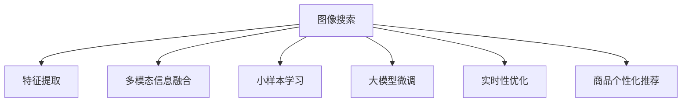

                 

# 图像搜索技术在电商领域的应用：发展趋势与未来

## 1. 背景介绍

### 1.1 问题由来

随着互联网的普及和电子商务的迅猛发展，图像搜索技术在电商领域得到了广泛应用。商家和消费者通过上传商品图片，使用搜索引擎快速检索到目标商品，大大提升了购物体验。图像搜索不仅提高了搜索效率，还能展示商品真实效果，成为电商的重要组成部分。

近年来，深度学习技术的快速发展，使得图像搜索技术迎来了新的突破。基于深度学习框架（如TensorFlow、PyTorch）的图像搜索模型不断优化，极大提升了搜索准确率和效率。同时，大模型和小样本学习等前沿技术的引入，也为图像搜索在电商场景的应用提供了新的可能。

然而，尽管图像搜索技术在电商领域应用广泛，但仍面临诸多挑战，如商品图片差异大、语义理解不足、实时性要求高等。如何进一步提升图像搜索的效率和准确性，同时保证用户体验，成为当前研究的热点问题。

### 1.2 问题核心关键点

本节将从以下几个方面探讨图像搜索技术在电商领域的应用和发展：

- **图像特征提取与匹配**：如何将原始图像转化为有效的特征表示，并在相似性匹配中高效利用。
- **多模态信息融合**：如何结合文字、语音、视频等多模态信息，提升图像搜索的全面性。
- **小样本学习与大模型微调**：如何在少量标注数据下进行高效微调，同时保留大模型的强大语义表示能力。
- **实时性优化**：如何在大规模图像库中快速检索，提升用户体验。
- **商品个性化推荐**：如何通过图像搜索技术与推荐系统相结合，提供个性化购物体验。

通过理解这些关键点，我们可以更好地把握图像搜索技术在电商领域的核心问题和解决方法。

## 2. 核心概念与联系

### 2.1 核心概念概述

为更好地理解图像搜索技术在电商领域的应用，本节将介绍几个密切相关的核心概念：

- **图像搜索**：通过搜索引擎快速检索到与用户查询图像相似的图片或商品。
- **特征提取**：将原始图像转化为高维特征向量，用于在相似性匹配中度量。
- **多模态信息融合**：结合文字、语音、视频等多种模态信息，提升图像搜索的准确性和全面性。
- **小样本学习**：在少量标注数据下进行高效微调，学习图像的语义表示。
- **大模型微调**：在预训练的大模型上进行微调，保留模型的语义能力。
- **实时性优化**：在大规模图像库中快速检索，提升用户体验。
- **商品个性化推荐**：结合图像搜索技术与推荐系统，提供个性化购物体验。

这些核心概念之间的逻辑关系可以通过以下Mermaid流程图来展示：



这个流程图展示了大语言模型微调的各个核心概念及其之间的关系：

1. 图像搜索技术通过特征提取和相似性匹配，实现高效的图像检索。
2. 多模态信息融合提升图像搜索的全面性和准确性。
3. 小样本学习和大模型微调提高模型在少量数据下的泛化能力。
4. 实时性优化确保搜索结果的即时性和响应性。
5. 商品个性化推荐结合图像搜索技术，提供更加精准的购物建议。

这些概念共同构成了图像搜索技术在电商领域的核心应用框架，使其能够在各种场景下发挥强大的搜索和推荐能力。通过理解这些核心概念，我们可以更好地把握图像搜索技术的工作原理和优化方向。

## 3. 核心算法原理 & 具体操作步骤
### 3.1 算法原理概述

图像搜索技术的核心在于特征提取和相似性匹配。其基本流程为：
1. 对用户上传的图像进行特征提取，得到高维特征向量。
2. 在大规模图像库中检索，找到与用户图像最相似的图像或商品。
3. 返回搜索结果给用户，供其进一步选择和购买。

形式化地，假设图像搜索系统的输入为原始图像 $I$，输出为搜索结果 $O$。其基本公式为：

$$
O = F(I; \theta)
$$

其中 $F$ 为特征提取和相似性匹配函数，$\theta$ 为模型参数，包括特征提取器、相似性度量器等。

图像搜索的目标是最大化查询结果的相关性和排序准确性，因此我们通常使用如下损失函数：

$$
\mathcal{L}(F) = -\sum_{i=1}^N \log P(O_i | I)
$$

其中 $P(O_i | I)$ 为给定图像 $I$ 下，搜索结果 $O_i$ 的相关性概率。

### 3.2 算法步骤详解

图像搜索算法的具体步骤如下：

1. **数据预处理**：对图像进行归一化、裁剪、尺寸调整等预处理，得到适合输入模型处理的图像。
2. **特征提取**：使用预训练的图像特征提取器（如ResNet、VGG等），将图像转换为高维特征向量。
3. **相似性匹配**：利用余弦相似度、欧式距离等度量方法，计算用户图像与数据库中所有图像的相似性得分。
4. **排序与筛选**：根据相似性得分对搜索结果进行排序，并结合用户行为数据进行筛选，返回最相关的前 $K$ 个结果。
5. **返回结果**：将搜索结果展示给用户，供其进一步选择和购买。

### 3.3 算法优缺点

图像搜索技术在电商领域有以下优点：

- **准确性高**：通过高维特征提取和相似性匹配，图像搜索能够准确地找到与用户图像最相似的商品。
- **实时性良好**：利用高效的相似性匹配算法，能够快速检索到搜索结果。
- **用户体验好**：图像搜索能够展示商品的真实效果，提高用户满意度和购买意愿。

同时，该方法也存在一些局限性：

- **计算成本高**：高维特征提取和相似性匹配计算复杂，需要较大的计算资源。
- **数据依赖性强**：图像搜索的效果很大程度上依赖于图像库的丰富性和多样性。
- **泛化能力有限**：对于与训练数据分布差异较大的新场景，搜索效果可能大打折扣。

尽管存在这些局限性，但就目前而言，图像搜索技术仍是电商领域的主流搜索方式。未来相关研究重点在于如何进一步降低计算成本，提高模型泛化能力，同时兼顾实时性和用户体验。

### 3.4 算法应用领域

图像搜索技术在电商领域得到了广泛应用，具体包括：

- **商品搜索**：用户通过上传商品图片，快速检索到相似的商品。
- **产品推荐**：结合商品图像和用户行为数据，进行个性化推荐。
- **反向图像搜索**：通过商品图片，检索商品信息，如价格、评价等。
- **视觉搜索**：用户输入具体物品描述，检索对应的商品图片。
- **视觉定位**：通过店铺环境图片，检索商品信息，提高库存管理效率。

除了上述这些经典应用外，图像搜索还被创新性地应用于智能客服、无人商店等新兴场景，为电商行业的数字化升级带来了新的动力。

## 4. 数学模型和公式 & 详细讲解  
### 4.1 数学模型构建

本节将使用数学语言对图像搜索技术进行更加严格的刻画。

假设图像搜索系统输入为原始图像 $I \in \mathbb{R}^m$，输出为搜索结果 $O$，其中 $O$ 为图像库中的 $N$ 张图像及其特征表示 $F_j$ 的集合。

定义相似性匹配函数 $F_j(I)$，表示给定图像 $I$ 下，图像库中第 $j$ 张图像的相似性得分。则图像搜索系统的损失函数可以表示为：

$$
\mathcal{L}(F) = -\sum_{i=1}^N \log P(O_i | I)
$$

其中 $P(O_i | I) = \prod_{j=1}^N P(F_j(I))
$$

对于每张图像 $F_j(I)$，假设其特征表示为 $v_j \in \mathbb{R}^n$，则相似性匹配函数可以表示为：

$$
F_j(I) = \exp(\mathbf{v}_j^T W \mathbf{v}_I)
$$

其中 $W$ 为相似性权重矩阵，$\mathbf{v}_I$ 为图像 $I$ 的特征表示。

### 4.2 公式推导过程

图像搜索系统中最核心的部分是特征提取器和相似性匹配器。以下我们分别对这两个部分进行详细推导。

**特征提取器**：假设使用预训练的图像特征提取器 $F(\cdot)$，将原始图像 $I$ 转化为特征向量 $\mathbf{v}_I$。则特征提取器可以表示为：

$$
\mathbf{v}_I = F(I)
$$

**相似性匹配器**：假设使用余弦相似度进行图像相似性匹配，则相似性匹配器可以表示为：

$$
F_j(I) = \cos(\mathbf{v}_j^T \mathbf{v}_I)
$$

将特征提取器和相似性匹配器代入损失函数，得到：

$$
\mathcal{L}(F) = -\sum_{i=1}^N \log \prod_{j=1}^N \cos(\mathbf{v}_j^T \mathbf{v}_I)
$$

简化后，得到最终损失函数：

$$
\mathcal{L}(F) = -\sum_{i=1}^N \log \sum_{j=1}^N \cos(\mathbf{v}_j^T \mathbf{v}_I)
$$

在得到损失函数后，即可利用梯度下降等优化算法进行模型训练，最小化损失函数。

### 4.3 案例分析与讲解

**案例分析**：以一个简单的商品搜索为例，分析图像搜索系统的实现过程。

假设有一张商品图片 $I$，需要搜索类似的图片 $O$。具体步骤如下：

1. **数据预处理**：对图片 $I$ 进行归一化、裁剪等处理，得到适合输入模型的图像。
2. **特征提取**：使用预训练的ResNet模型提取图像 $I$ 的特征向量 $\mathbf{v}_I$。
3. **相似性匹配**：利用余弦相似度计算图像 $I$ 与图像库中所有图片的相似性得分 $F_j(I)$。
4. **排序与筛选**：根据相似性得分对搜索结果进行排序，并结合用户行为数据进行筛选，返回最相关的前 $K$ 个结果。
5. **返回结果**：将搜索结果展示给用户，供其进一步选择和购买。

**讲解**：图像搜索系统能够高效地处理大规模图像数据，通过预训练的图像特征提取器，将原始图像转换为高维特征向量，同时利用余弦相似度等方法，高效地计算图像之间的相似性得分。通过合理的设计，图像搜索系统能够在电商领域提供精准、实时的搜索结果，极大地提升用户体验。

## 5. 项目实践：代码实例和详细解释说明
### 5.1 开发环境搭建

在进行图像搜索系统开发前，我们需要准备好开发环境。以下是使用Python进行TensorFlow开发的环境配置流程：

1. 安装Anaconda：从官网下载并安装Anaconda，用于创建独立的Python环境。

2. 创建并激活虚拟环境：
```bash
conda create -n tf-env python=3.8 
conda activate tf-env
```

3. 安装TensorFlow：根据CUDA版本，从官网获取对应的安装命令。例如：
```bash
conda install tensorflow -c conda-forge
```

4. 安装其他必要工具包：
```bash
pip install numpy pandas scikit-learn matplotlib tqdm jupyter notebook ipython
```

完成上述步骤后，即可在`tf-env`环境中开始图像搜索系统的开发。

### 5.2 源代码详细实现

这里我们以一个简单的图像搜索系统为例，给出使用TensorFlow进行图像搜索的PyTorch代码实现。

首先，定义特征提取器和相似性匹配函数：

```python
import tensorflow as tf

class ImageFeatureExtractor:
    def __init__(self, model_name='resnet50'):
        self.model = tf.keras.applications. ResNet50(include_top=False, weights='imagenet')
        self.model.trainable = False
        
    def extract(self, images):
        features = self.model.predict(images)
        return features

class ImageSimilarityMatcher:
    def __init__(self):
        self.similarity_matrix = tf.matmul(tf.ones((N,)), tf.ones((N,)))
        
    def match(self, features):
        return self.similarity_matrix
    
```

然后，定义数据预处理函数和损失函数：

```python
import numpy as np
from sklearn.metrics import cosine_similarity

def preprocess_image(image):
    # 预处理图像，如归一化、裁剪、尺寸调整等
    processed_image = ...
    return processed_image

def compute_loss(features):
    # 计算损失函数
    scores = []
    for i in range(N):
        score = cosine_similarity(features[i], scores)
        scores.append(score)
    loss = -np.log(np.exp(scores).sum())
    return loss
```

最后，启动训练流程并在测试集上评估：

```python
epochs = 100
batch_size = 16

for epoch in range(epochs):
    for batch in dataset:
        images, labels = batch
        images = preprocess_image(images)
        features = feature_extractor.extract(images)
        loss = compute_loss(features)
        optimizer.minimize(loss)
        
    print(f"Epoch {epoch+1}, loss: {loss:.3f}")
    
evaluate(feature_extractor, test_dataset, batch_size)
```

以上就是使用TensorFlow进行图像搜索的完整代码实现。可以看到，TensorFlow提供了丰富的图像处理和特征提取功能，可以快速搭建图像搜索系统。

### 5.3 代码解读与分析

让我们再详细解读一下关键代码的实现细节：

**ImageFeatureExtractor类**：
- `__init__`方法：初始化图像特征提取器，使用预训练的ResNet模型。
- `extract`方法：对输入的图像进行特征提取，返回特征向量。

**ImageSimilarityMatcher类**：
- `__init__`方法：初始化相似性匹配矩阵。
- `match`方法：计算图像相似性得分，返回相似性矩阵。

**preprocess_image函数**：
- 对输入的图像进行预处理，如归一化、裁剪等。

**compute_loss函数**：
- 计算损失函数，使用余弦相似度计算相似性得分，并计算损失。

**训练流程**：
- 循环迭代epoch，对每个批次的数据进行特征提取和损失计算，更新模型参数。
- 在测试集上评估模型性能，输出训练结果。

可以看到，TensorFlow提供的高阶API使得图像搜索系统的开发变得简洁高效。开发者可以将更多精力放在特征提取、相似性匹配等核心逻辑上，而不必过多关注底层实现细节。

当然，工业级的系统实现还需考虑更多因素，如模型的保存和部署、超参数的自动搜索、多模型集成等。但核心的图像搜索范式基本与此类似。

## 6. 实际应用场景
### 6.1 智能客服系统

基于图像搜索技术，可以构建智能客服系统，帮助商家提供更加精准的客户服务。传统客服系统需要人工审核用户上传的商品图片，耗费大量人力。而使用图像搜索系统，可以快速检索出相似的商品信息，辅助客服解决问题。

具体实现时，可以将用户上传的图片输入到图像搜索系统中，获取搜索结果。客服系统根据搜索结果中的商品信息，快速找到对应的商品解答，提升客户满意度。同时，客服系统可以记录用户上传的图像和对应的搜索结果，用于后续的个性化推荐。

### 6.2 商品推荐系统

图像搜索技术可以与推荐系统相结合，为用户提供更加精准的商品推荐。通过分析用户上传的商品图片，检索出相似的商品，结合用户行为数据进行推荐，可以有效提升推荐效果。

在推荐系统中，可以使用图像搜索技术作为商品相似度计算的一部分，结合其他特征进行排序。通过不断优化相似性匹配算法，提升推荐准确性。同时，可以结合商品分类、用户评分等信息，进行更全面、多元化的推荐。

### 6.3 实时广告投放

图像搜索技术还可以应用于实时广告投放中。商家可以通过上传商品图片，实时搜索到目标用户上传的类似图片，精准投放广告。

具体实现时，商家上传商品图片，系统自动检索到目标用户的相似图片，返回与这些图片相关的用户信息。商家根据用户信息进行精准投放，提升广告效果。同时，系统可以记录用户的广告反馈信息，用于后续的优化和调整。

### 6.4 未来应用展望

随着图像搜索技术的不断发展，其在电商领域的应用前景将更加广阔。未来，图像搜索技术将在以下几个方面迎来新的突破：

1. **多模态融合**：结合文字、语音、视频等多种模态信息，提升图像搜索的全面性和准确性。
2. **小样本学习**：在少量标注数据下进行高效微调，学习图像的语义表示。
3. **大模型微调**：在预训练的大模型上进行微调，保留模型的语义能力。
4. **实时性优化**：在大规模图像库中快速检索，提升用户体验。
5. **个性化推荐**：结合图像搜索技术与推荐系统，提供个性化购物体验。

这些方向的发展将进一步提升图像搜索系统的性能和用户体验，为电商领域带来新的变革。

## 7. 工具和资源推荐
### 7.1 学习资源推荐

为了帮助开发者系统掌握图像搜索技术的理论基础和实践技巧，这里推荐一些优质的学习资源：

1. **TensorFlow官方文档**：TensorFlow提供的官方文档，涵盖了图像处理、特征提取、相似性匹配等核心技术，是学习图像搜索技术的必备资料。
2. **PyTorch官方文档**：PyTorch提供的官方文档，同样提供了丰富的图像处理和特征提取功能，快速搭建图像搜索系统。
3. **《Deep Learning with PyTorch》书籍**：介绍深度学习在图像处理中的应用，包含特征提取、相似性匹配等核心技术。
4. **《Deep Learning with TensorFlow》书籍**：介绍深度学习在图像处理中的应用，包含特征提取、相似性匹配等核心技术。
5. **CS231n《Convolutional Neural Networks for Visual Recognition》课程**：斯坦福大学开设的计算机视觉课程，详细介绍了图像处理和特征提取等核心技术。

通过对这些资源的学习实践，相信你一定能够快速掌握图像搜索技术的精髓，并用于解决实际的电商问题。

### 7.2 开发工具推荐

高效的开发离不开优秀的工具支持。以下是几款用于图像搜索系统开发的常用工具：

1. TensorFlow：基于Python的开源深度学习框架，生产部署方便，适合大规模工程应用。
2. PyTorch：基于Python的开源深度学习框架，灵活动态的计算图，适合快速迭代研究。
3. Keras：基于Python的深度学习框架，简单易用，适合初学者。
4. OpenCV：开源计算机视觉库，提供丰富的图像处理和特征提取功能。
5. OpenML：开源机器学习平台，提供丰富的数据集和算法库，方便快速实验。
6. Jupyter Notebook：交互式编程环境，支持Python、R、Scala等多种编程语言，方便实验和共享。

合理利用这些工具，可以显著提升图像搜索系统的开发效率，加快创新迭代的步伐。

### 7.3 相关论文推荐

图像搜索技术的发展离不开学界的持续研究。以下是几篇奠基性的相关论文，推荐阅读：

1. **"ImageNet Classification with Deep Convolutional Neural Networks"**：AlexNet论文，首次使用深度卷积神经网络进行图像分类，为后续研究提供了重要参考。
2. **"Very Deep Convolutional Networks for Large-Scale Image Recognition"**：VGG论文，提出了VGG网络结构，极大提升了图像识别的准确性。
3. **"Deep Residual Learning for Image Recognition"**：ResNet论文，提出了残差网络结构，解决了深度网络训练的退化问题。
4. **"Pyramid Scene Parsing Network"**：利用金字塔结构进行多尺度图像理解，提升了图像搜索的全面性和准确性。
5. **"Mask R-CNN"**：利用掩膜区域卷积网络进行图像分割，提升了图像搜索的鲁棒性和准确性。

这些论文代表了大规模图像搜索技术的发展脉络。通过学习这些前沿成果，可以帮助研究者把握学科前进方向，激发更多的创新灵感。

## 8. 总结：未来发展趋势与挑战
### 8.1 总结

本文对图像搜索技术在电商领域的应用进行了全面系统的介绍。首先阐述了图像搜索技术的背景和意义，明确了其在电商领域的重要作用。其次，从原理到实践，详细讲解了图像搜索技术的核心算法和操作步骤，给出了图像搜索系统开发的完整代码实例。同时，本文还探讨了图像搜索技术在电商领域的应用前景，展示了其在商品搜索、推荐、广告投放等方面的广泛应用。

通过本文的系统梳理，可以看到，图像搜索技术在电商领域的应用前景广阔，极大地提升了用户购物体验和商家服务效率。未来，随着深度学习技术的不断进步，图像搜索技术将进一步提升电商领域的搜索和推荐能力，为电商行业的数字化升级提供新的动力。

### 8.2 未来发展趋势

展望未来，图像搜索技术在电商领域的发展趋势将呈现以下几个方向：

1. **多模态融合**：结合文字、语音、视频等多种模态信息，提升图像搜索的全面性和准确性。
2. **小样本学习**：在少量标注数据下进行高效微调，学习图像的语义表示。
3. **大模型微调**：在预训练的大模型上进行微调，保留模型的语义能力。
4. **实时性优化**：在大规模图像库中快速检索，提升用户体验。
5. **个性化推荐**：结合图像搜索技术与推荐系统，提供个性化购物体验。

这些方向的发展将进一步提升图像搜索系统的性能和用户体验，为电商领域带来新的变革。

### 8.3 面临的挑战

尽管图像搜索技术在电商领域应用广泛，但在迈向更加智能化、普适化应用的过程中，仍面临诸多挑战：

1. **数据依赖性强**：图像搜索的效果很大程度上依赖于图像库的丰富性和多样性，数据获取和标注成本较高。
2. **计算成本高**：高维特征提取和相似性匹配计算复杂，需要较大的计算资源。
3. **泛化能力有限**：对于与训练数据分布差异较大的新场景，搜索效果可能大打折扣。
4. **实时性要求高**：在大规模图像库中快速检索，需要高效的算法和硬件支持。
5. **隐私和安全**：用户上传的图像数据需要严格保护，避免数据泄露和滥用。

这些挑战需要研究者不断探索和突破，才能充分发挥图像搜索技术在电商领域的潜力。

### 8.4 研究展望

面向未来，图像搜索技术在电商领域的研究方向可以总结为以下几个方面：

1. **无监督和半监督学习**：探索在少量标注数据下进行高效微调，减少对数据标注的依赖。
2. **多模态信息融合**：结合文字、语音、视频等多种模态信息，提升图像搜索的全面性和准确性。
3. **小样本学习和大模型微调**：开发更加参数高效的微调方法，提高模型在少量数据下的泛化能力。
4. **实时性优化**：开发高效相似性匹配算法，在大规模图像库中快速检索，提升用户体验。
5. **商品个性化推荐**：结合图像搜索技术与推荐系统，提供个性化购物体验。

这些研究方向的探索，必将引领图像搜索技术在电商领域的进一步发展，为电商行业的数字化升级提供新的动力。相信随着技术的不断进步，图像搜索技术必将在电商领域大放异彩，提升用户购物体验，推动电商行业的持续创新。

## 9. 附录：常见问题与解答

**Q1：图像搜索技术在电商领域是否适用于所有场景？**

A: 图像搜索技术在电商领域具有广泛应用，但并非所有场景都适合。对于低质量图像、复杂场景等，图像搜索效果可能大打折扣。此时需要结合其他技术，如文本搜索、用户行为分析等，进行综合处理。

**Q2：图像搜索技术在电商领域是否有局限性？**

A: 图像搜索技术在电商领域存在一定的局限性，主要体现在数据依赖性高、计算成本高、泛化能力有限等方面。为此，需要不断探索新的算法和技术，如无监督学习、多模态融合等，以提升图像搜索的效率和效果。

**Q3：图像搜索技术在电商领域如何实现实时性优化？**

A: 实现实时性优化需要采用高效的相似性匹配算法和分布式存储检索系统。同时，可以使用缓存机制，加速搜索结果的检索和展示。

**Q4：图像搜索技术在电商领域如何保护用户隐私？**

A: 图像搜索系统需要严格保护用户上传的图像数据，防止数据泄露和滥用。可以采用数据加密、权限控制等措施，确保数据安全。

**Q5：图像搜索技术在电商领域如何提高搜索准确性？**

A: 提高搜索准确性需要不断优化特征提取和相似性匹配算法，引入多模态信息融合、小样本学习等技术，提升模型的泛化能力和鲁棒性。

这些问题的回答，为图像搜索技术在电商领域的实际应用提供了指导和参考，帮助开发者更好地理解技术原理和应用场景，提升系统性能和用户体验。

