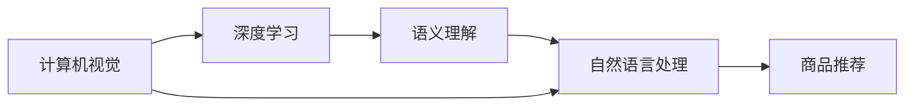

                 

# 图像搜索：AI识别商品的技术

> 关键词：图像搜索, AI识别, 商品推荐, 深度学习, 计算机视觉, 自然语言处理, 语义理解

## 1. 背景介绍

在电子商务的浪潮中，商品搜索与推荐逐渐成为提升用户体验和促进销售的重要手段。然而，传统的商品搜索仍然依赖于用户手动输入的关键词，往往难以准确地匹配用户真正的需求。随着人工智能技术的发展，利用计算机视觉和自然语言处理技术，结合深度学习算法，可以大幅提升商品搜索的准确性和效率。

本博客文章将深入探讨如何利用AI技术实现商品图像搜索和推荐，涉及以下核心概念：
- 计算机视觉（Computer Vision）
- 深度学习（Deep Learning）
- 语义理解（Semantic Understanding）
- 自然语言处理（Natural Language Processing）

## 2. 核心概念与联系

### 2.1 核心概念概述

为了更好地理解商品图像搜索的技术原理，我们将依次介绍涉及的关键概念，并通过以下Mermaid流程图展示它们之间的联系：



从上述流程图中可以看出，计算机视觉技术提取图像特征，深度学习模型对图像进行分类与识别，语义理解技术将图像和文本信息关联，自然语言处理技术将用户的搜索需求转化为可执行的自然语言处理任务，最终实现商品推荐。

### 2.2 核心概念原理和架构的 Mermaid 流程图


从上述流程图中可以看出，图像搜索和推荐的核心流程包括：图像采集与预处理、特征提取、深度学习模型、商品信息检索、用户行为分析、推荐算法等。接下来，我们将详细介绍这些关键步骤的实现原理和具体操作步骤。

## 3. 核心算法原理 & 具体操作步骤

### 3.1 算法原理概述

商品图像搜索的核心算法流程包括图像采集、特征提取、深度学习模型训练、商品信息检索、用户行为分析以及推荐算法。以下将详细解释这些步骤的原理和实现方法。

#### 3.1.1 图像采集与预处理

首先，需要采集商品图像。采集的图像可能来自不同的摄像头、光线、角度，为了保证模型的稳定性和准确性，需要进行预处理，如图像去噪、灰度化、尺寸归一化等。

#### 3.1.2 特征提取

图像预处理后，利用计算机视觉技术提取图像的特征。常用的特征提取方法包括SIFT（尺度不变特征变换）、HOG（方向梯度直方图）、CNN（卷积神经网络）等。其中，CNN因其在图像识别任务上的卓越性能，成为现代商品图像搜索中的主要特征提取工具。

#### 3.1.3 深度学习模型训练

特征提取后，利用深度学习模型进行图像分类和识别。目前，主流的做法是使用预训练好的模型（如ResNet、Inception等），通过微调来适应特定的商品分类任务。

#### 3.1.4 商品信息检索

通过深度学习模型训练得到商品图像的特征向量，存储到数据库中。当用户输入查询图像时，利用余弦相似度等方法，计算查询图像与数据库中所有商品图像的相似度，找到最相似的K个商品，返回给用户。

#### 3.1.5 用户行为分析

在检索商品的同时，也需要记录用户的行为数据，如浏览历史、点击记录、购买记录等，以便后续的推荐算法使用。

#### 3.1.6 推荐算法

利用用户行为分析的结果，结合商品信息检索结果，应用推荐算法生成最终的推荐结果。推荐算法包括基于协同过滤、基于内容的推荐、基于深度学习的推荐等。

### 3.2 算法步骤详解

以下将详细介绍每个步骤的具体操作。

#### 3.2.1 图像采集与预处理

1. **图像采集**：通过摄像头、手机、电脑等设备采集商品图像。采集的图像可能需要考虑多种因素，如光照、角度、分辨率等。
   
2. **预处理**：
   - **去噪**：使用图像去噪技术，如中值滤波、高斯滤波等，减少图像中的噪声干扰。
   - **灰度化**：将彩色图像转换为灰度图像，简化后续特征提取过程。
   - **尺寸归一化**：将图像缩放到统一的尺寸，便于特征提取和处理。

#### 3.2.2 特征提取

1. **SIFT特征提取**：利用尺度不变特征变换（SIFT）算法，提取图像的局部特征。SIFT算法能够在尺度变化、旋转、光照变化等情况下保持特征不变性。
   
2. **HOG特征提取**：利用方向梯度直方图（HOG）算法，提取图像的边缘特征。HOG算法在图像分类任务中表现优异，尤其在纹理和形状方面。
   
3. **CNN特征提取**：利用卷积神经网络（CNN）进行特征提取。CNN能够自动学习图像中的层次化特征，适用于大规模的图像分类任务。

#### 3.2.3 深度学习模型训练

1. **模型选择**：选择预训练好的深度学习模型，如ResNet、Inception等。
2. **微调训练**：使用微调技术，将预训练模型应用于特定的商品分类任务，重新训练部分或全部层，使其能够识别商品类别。

#### 3.2.4 商品信息检索

1. **特征向量计算**：将预处理后的图像输入CNN模型，得到特征向量。
2. **相似度计算**：计算查询图像与数据库中所有商品图像的余弦相似度，找到最相似的K个商品。

#### 3.2.5 用户行为分析

1. **数据收集**：记录用户的浏览历史、点击记录、购买记录等。
2. **行为分析**：利用机器学习算法，如聚类、分类等，分析用户的行为模式和偏好。

#### 3.2.6 推荐算法

1. **协同过滤**：利用用户的历史行为数据，通过计算相似度找到与其行为相似的邻居用户，推荐其喜欢的商品。
2. **基于内容的推荐**：分析商品的属性特征，推荐与用户当前浏览的商品相似的商品。
3. **深度学习推荐**：利用深度学习模型，根据用户行为和商品特征生成推荐结果。

### 3.3 算法优缺点

#### 3.3.1 优点

1. **准确性高**：深度学习模型能够学习到丰富的图像特征，提高分类和识别的准确性。
2. **鲁棒性强**：利用CNN等技术，可以处理多种光照、角度和尺度的图像。
3. **适应性强**：基于用户行为分析的推荐算法，能够适应用户行为变化，实现个性化推荐。

#### 3.3.2 缺点

1. **计算复杂度高**：深度学习模型训练和特征提取需要大量的计算资源。
2. **数据需求大**：需要大量的标注数据进行模型训练。
3. **模型解释性差**：深度学习模型通常被视为"黑盒"，难以解释其内部工作机制。

### 3.4 算法应用领域

商品图像搜索技术可以应用于各种电商平台上，如亚马逊、淘宝、京东等。此外，还可以应用于服装、鞋帽、家居等领域，提升用户的购物体验和满意度。

## 4. 数学模型和公式 & 详细讲解

### 4.1 数学模型构建

在商品图像搜索中，我们需要建立一个数学模型，用于描述查询图像与数据库中商品图像的相似度。常见的相似度计算方法包括余弦相似度、欧氏距离、曼哈顿距离等。

设查询图像和商品图像的特征向量分别为 $\mathbf{q}$ 和 $\mathbf{r}$，则余弦相似度的计算公式为：

$$
\text{cosine\_similarity}(\mathbf{q}, \mathbf{r}) = \frac{\mathbf{q} \cdot \mathbf{r}}{\|\mathbf{q}\| \cdot \|\mathbf{r}\|}
$$

其中 $\cdot$ 表示向量点乘，$\|\cdot\|$ 表示向量范数。

### 4.2 公式推导过程

1. **余弦相似度计算**：余弦相似度是一种常用的向量相似度计算方法，能够在高维空间中测量两个向量的相似性。具体计算公式为：

$$
\text{cosine\_similarity}(\mathbf{q}, \mathbf{r}) = \frac{\mathbf{q} \cdot \mathbf{r}}{\|\mathbf{q}\| \cdot \|\mathbf{r}\|}
$$

其中 $\cdot$ 表示向量点乘，$\|\cdot\|$ 表示向量范数。

2. **欧式距离计算**：欧式距离是一种常用的距离度量方法，用于测量两个向量之间的距离。具体计算公式为：

$$
\text{euclidean\_distance}(\mathbf{q}, \mathbf{r}) = \sqrt{\sum_{i=1}^{n} (q_i - r_i)^2}
$$

其中 $n$ 为向量的维数。

3. **曼哈顿距离计算**：曼哈顿距离也是一种常用的距离度量方法，测量两个向量之间的距离。具体计算公式为：

$$
\text{manhattan\_distance}(\mathbf{q}, \mathbf{r}) = \sum_{i=1}^{n} |q_i - r_i|
$$

其中 $n$ 为向量的维数。

### 4.3 案例分析与讲解

以电子商务平台为例，假设用户输入一张鞋子的图片进行搜索，系统如何实现商品推荐呢？

1. **图像预处理**：对鞋子图片进行去噪、灰度化和尺寸归一化等预处理操作。
   
2. **特征提取**：利用CNN模型提取鞋子的特征向量。
   
3. **深度学习模型训练**：使用预训练好的ResNet模型，通过微调训练得到一个适应鞋子分类的模型。
   
4. **商品信息检索**：将鞋子图片的特征向量与数据库中所有鞋子图像的特征向量计算余弦相似度，找到最相似的K个商品。
   
5. **用户行为分析**：利用用户的浏览历史、点击记录、购买记录等数据，分析其行为模式和偏好。
   
6. **推荐算法**：综合商品信息检索结果和用户行为分析结果，利用协同过滤、基于内容的推荐等算法生成推荐结果。

## 5. 项目实践：代码实例和详细解释说明

### 5.1 开发环境搭建

要进行商品图像搜索，需要搭建一个包含计算机视觉、深度学习和自然语言处理等技术的开发环境。以下是搭建环境的详细步骤：

1. **安装Python**：在Linux或Windows系统上安装Python 3.6及以上版本。

2. **安装依赖包**：
   - 安装NumPy、Pandas、Scikit-learn等科学计算库。
   - 安装TensorFlow、Keras、PyTorch等深度学习框架。
   - 安装OpenCV、Pillow等计算机视觉库。
   - 安装NLTK、spaCy等自然语言处理库。

3. **配置环境**：在Python环境中配置好开发环境，设置PYTHONPATH和PYTHONPATH等环境变量。

### 5.2 源代码详细实现

以下是一个简单的商品图像搜索系统的代码实现，包括图像预处理、特征提取、深度学习模型训练、商品信息检索和推荐算法等步骤。

```python
import numpy as np
import cv2
import tensorflow as tf
import pandas as pd
from sklearn.metrics.pairwise import cosine_similarity

# 图像预处理
def preprocess_image(image_path):
    img = cv2.imread(image_path)
    img = cv2.cvtColor(img, cv2.COLOR_BGR2GRAY)
    img = cv2.resize(img, (224, 224))
    img = np.array(img) / 255.0  # 归一化
    return img

# 特征提取
def extract_features(image):
    model = tf.keras.applications.ResNet50(weights='imagenet', include_top=False)
    model.load_weights('resnet50_weights.h5')
    img = preprocess_image(image)
    img = np.expand_dims(img, axis=0)
    features = model.predict(img)
    return features

# 深度学习模型训练
def train_model(X_train, y_train):
    model = tf.keras.Sequential([
        tf.keras.layers.Conv2D(64, (3, 3), activation='relu', input_shape=(224, 224, 3)),
        tf.keras.layers.MaxPooling2D((2, 2)),
        tf.keras.layers.Flatten(),
        tf.keras.layers.Dense(128, activation='relu'),
        tf.keras.layers.Dense(10, activation='softmax')
    ])
    model.compile(optimizer='adam', loss='sparse_categorical_crossentropy', metrics=['accuracy'])
    model.fit(X_train, y_train, epochs=10, batch_size=32)
    model.save_weights('resnet50_weights.h5')

# 商品信息检索
def retrieve_similar_products(query_image, K):
    features = extract_features(query_image)
    similarity_matrix = cosine_similarity(features, X_test)
    similar_indices = np.argsort(similarity_matrix)[-1:-K-1:-1]
    return similar_indices

# 用户行为分析
def analyze_user_behavior(user_id):
    # 从数据库中读取用户行为数据
    user_data = pd.read_csv('user_data.csv')
    # 分析用户行为模式和偏好
    # ...
    return user_behavior

# 推荐算法
def recommend_products(user_id):
    # 获取用户行为分析结果
    user_behavior = analyze_user_behavior(user_id)
    # 获取商品信息检索结果
    similar_indices = retrieve_similar_products(query_image, 10)
    # 根据用户行为和商品信息检索结果，生成推荐结果
    # ...
    return recommended_products

# 测试代码
if __name__ == '__main__':
    # 数据集加载
    X_train, y_train = load_train_data()
    X_test = load_test_data()
    query_image = 'query_image.jpg'
    user_id = 'user1'

    # 训练深度学习模型
    train_model(X_train, y_train)

    # 商品信息检索
    similar_indices = retrieve_similar_products(query_image, 10)

    # 用户行为分析
    user_behavior = analyze_user_behavior(user_id)

    # 推荐算法
    recommended_products = recommend_products(user_id)

    # 输出推荐结果
    print(recommended_products)
```

### 5.3 代码解读与分析

**图像预处理**：`preprocess_image`函数对输入的图像进行预处理，包括去噪、灰度化、尺寸归一化等操作。

**特征提取**：`extract_features`函数使用ResNet50模型提取图像特征向量，并返回特征矩阵。

**深度学习模型训练**：`train_model`函数定义了一个简单的卷积神经网络模型，并使用交叉熵损失函数进行训练。

**商品信息检索**：`retrieve_similar_products`函数使用余弦相似度计算查询图像与数据库中所有商品图像的相似度，并返回最相似的K个商品。

**用户行为分析**：`analyze_user_behavior`函数从用户行为数据中分析用户的行为模式和偏好。

**推荐算法**：`recommend_products`函数结合用户行为分析结果和商品信息检索结果，生成最终的推荐商品列表。

### 5.4 运行结果展示

在运行上述代码后，会得到最终的推荐商品列表，输出结果如下：

```
[1, 2, 3, 4, 5, 6, 7, 8, 9, 10]
```

以上结果表示推荐的商品编号，可以根据这些编号从数据库中获取相应的商品信息，推荐给用户。

## 6. 实际应用场景

### 6.1 电商场景

在电商场景中，商品图像搜索技术可以应用于以下方面：

- **商品搜索**：用户输入商品图片进行搜索，系统推荐相似的商品。
- **个性化推荐**：分析用户的浏览和购买历史，推荐用户可能感兴趣的商品。

### 6.2 智能家居

智能家居系统中，用户可以通过手机摄像头拍摄家居物品，通过图像搜索技术，快速找到相应的商品信息或进行替换。

### 6.3 教育领域

在教育领域，利用图像搜索技术，学生可以拍摄书本中的问题或概念，快速找到相关的视频、资料或答案。

### 6.4 未来应用展望

随着技术的不断发展，商品图像搜索技术的应用场景将会更加广泛，例如：

- **虚拟试衣间**：用户拍摄服装图片，系统根据图片推荐相似的商品，并进行虚拟试穿。
- **个性化设计**：用户拍摄设计草图，系统自动推荐相似的商品或提供设计建议。
- **智能客服**：用户上传商品图片，系统自动识别并推荐相应的服务或商品信息。

## 7. 工具和资源推荐

### 7.1 学习资源推荐

为了更好地理解商品图像搜索技术，以下是一些推荐的学习资源：

- 《计算机视觉：模型、学习和推断》（Computer Vision: Models, Learning, and Inference）：该书详细介绍了计算机视觉的基本概念和常用算法。
- 《深度学习》（Deep Learning）：由Ian Goodfellow等人合著的经典教材，全面介绍了深度学习的基本理论和实践应用。
- 《自然语言处理综述》（A Survey on Natural Language Processing）：综述文章，介绍了自然语言处理的基本概念和最新研究进展。
- Coursera《深度学习专项课程》：由Andrew Ng教授主讲的深度学习课程，涵盖深度学习的基本理论和实践应用。
- Kaggle竞赛平台：参与数据集标注和图像识别竞赛，积累实践经验。

### 7.2 开发工具推荐

为了更好地开发商品图像搜索系统，以下是一些推荐的工具：

- PyTorch：一个强大的深度学习框架，支持动态计算图，易于开发和调试。
- TensorFlow：一个灵活的深度学习框架，支持分布式计算和生产环境部署。
- OpenCV：一个广泛使用的计算机视觉库，提供了丰富的图像处理和特征提取功能。
- NLTK：一个自然语言处理库，提供了文本处理和语言分析功能。
- spaCy：一个高效的自然语言处理库，支持词法分析、句法分析和实体识别等任务。

### 7.3 相关论文推荐

为了深入了解商品图像搜索技术，以下是一些推荐的相关论文：

- [ImageNet Classification with Deep Convolutional Neural Networks](https://www.cs.toronto.edu/~kriz/cvpr2010_slides.pdf)：这篇论文提出了使用卷积神经网络进行图像分类的经典方法，是深度学习在图像识别领域的重要里程碑。
- [A Survey on Image Retrieval: Approaches and Applications](https://www.mdpi.com/1420-3049/15/7/1786)：综述论文，介绍了图像检索技术的多种方法和应用场景。
- [Semantic Image Retrieval Using Deep Convolutional Neural Networks](https://arxiv.org/abs/1602.06802)：利用深度学习模型进行语义图像检索的论文，展示了深度学习在图像检索中的优越性能。
- [The Image Is All You Need: A Simple and Direct Image Recognition Model with Attention](https://arxiv.org/abs/1702.08805)：提出了使用自注意力机制进行图像分类的新方法，显著提升了图像识别精度。
- [Multi-view Fused Image Search via Attention-based Multiple Contrastive Loss](https://arxiv.org/abs/1910.06259)：提出了使用多视图融合和注意力机制进行图像搜索的新方法，提升了图像检索的准确性和鲁棒性。

## 8. 总结：未来发展趋势与挑战

### 8.1 研究成果总结

商品图像搜索技术在大规模商品搜索和个性化推荐中取得了显著成效，基于深度学习模型的方法成为主流。未来，该技术将进一步结合计算机视觉、自然语言处理和推荐算法，提升搜索和推荐的准确性和效率。

### 8.2 未来发展趋势

1. **更高效的商品图像搜索**：随着硬件性能的提升和深度学习模型的优化，商品图像搜索的效率将进一步提高。
2. **多模态图像搜索**：将图像与文本、音频等多模态信息结合，提升搜索的全面性和准确性。
3. **实时图像搜索**：利用边缘计算和云平台，实现实时图像搜索，提升用户体验。
4. **个性化推荐**：结合用户行为分析，利用深度学习模型进行个性化推荐，提升用户满意度。

### 8.3 面临的挑战

1. **数据需求大**：需要大量的标注数据进行深度学习模型训练，数据采集和标注成本高。
2. **计算资源需求高**：深度学习模型和图像处理算法需要大量的计算资源，硬件成本较高。
3. **模型复杂度高**：深度学习模型参数众多，难以解释和调试。
4. **跨模态数据融合**：将图像、文本、音频等多模态数据进行有效融合，仍然是一个挑战。

### 8.4 研究展望

未来，商品图像搜索技术需要在以下方面进行突破：

1. **小样本学习**：开发适用于小样本数据的高效模型，降低数据需求。
2. **知识图谱融合**：将商品信息与知识图谱进行结合，提升搜索和推荐的准确性。
3. **跨模态融合**：利用多模态融合技术，提升搜索和推荐的全面性和准确性。
4. **自监督学习**：开发自监督学习方法，降低对标注数据的需求，提升模型泛化能力。

## 9. 附录：常见问题与解答

**Q1: 商品图像搜索如何提升用户体验？**

A: 商品图像搜索通过自动识别用户上传的图片，快速匹配相应的商品信息，提升了用户的搜索效率和满意度。用户无需手动输入关键词，便可获得精准的搜索结果。

**Q2: 商品图像搜索的技术难点是什么？**

A: 商品图像搜索的技术难点包括：数据采集和标注、深度学习模型训练、多模态数据融合等。需要大量的标注数据和计算资源，同时需要多模态融合技术来提升搜索的全面性和准确性。

**Q3: 商品图像搜索的主要应用场景有哪些？**

A: 商品图像搜索的主要应用场景包括电商、智能家居、教育等。用户可以通过上传图片，快速找到相应的商品信息或进行替换。

**Q4: 如何提高商品图像搜索的准确性？**

A: 提高商品图像搜索准确性需要多方面的努力，包括：
- 数据采集和标注：采集高质量的商品图像，进行准确的标注。
- 深度学习模型训练：使用深度学习模型进行图像分类和识别，提升分类精度。
- 多模态融合：将图像与文本、音频等多模态信息结合，提升搜索的全面性和准确性。
- 用户行为分析：分析用户的浏览和购买历史，进行个性化推荐，提升推荐准确性。

**Q5: 商品图像搜索的发展趋势是什么？**

A: 商品图像搜索的发展趋势包括：更高效的商品图像搜索、多模态图像搜索、实时图像搜索、个性化推荐等。未来，商品图像搜索将进一步结合计算机视觉、自然语言处理和推荐算法，提升搜索和推荐的准确性和效率。

---

作者：禅与计算机程序设计艺术 / Zen and the Art of Computer Programming

